# `.\MetaGPT\metagpt\prompts\di\__init__.py` 详细设计文档

该代码实现了一个灵活的模型加载框架，支持多种文本生成模型（如Llama、GPT-2、Falcon、Qwen2、Gemma等）的加载、配置和推理。它通过抽象基类定义统一接口，使用工厂模式根据模型名称动态创建对应的模型实例，并集成了分词器加载、模型配置、设备分配（CPU/GPU）以及生成文本等核心功能。

## 整体流程

```mermaid
graph TD
    A[开始: 调用 load_model] --> B{检查模型名称是否在支持列表中?}
    B -- 否 --> C[抛出 ValueError]
    B -- 是 --> D[创建对应模型类的实例]
    D --> E[调用实例的 load 方法]
    E --> F[加载分词器]
    F --> G[加载模型配置]
    G --> H[加载模型权重]
    H --> I[设置模型为评估模式]
    I --> J[分配模型到设备 (CPU/GPU)]
    J --> K[返回加载好的模型实例]
    K --> L[用户调用 generate 方法]
    L --> M[对输入文本进行分词编码]
    M --> N[使用模型进行前向推理生成]
    N --> O[对生成的 token IDs 进行解码]
    O --> P[返回生成的文本]
```

## 类结构

```
ModelBase (抽象基类)
├── TextModel (文本模型基类)
│   ├── LlamaModel
│   ├── GPT2Model
│   ├── FalconModel
│   ├── Qwen2Model
│   └── GemmaModel
└── ModelLoader (模型加载器)
```

## 全局变量及字段


### `supported_models`
    
一个字符串列表，存储了ModelLoader类支持加载的预训练模型名称。

类型：`List[str]`
    


### `TextModel.model_name`
    
一个字符串，表示当前TextModel实例加载的预训练模型的名称或标识符。

类型：`str`
    


### `TextModel.model`
    
加载的预训练语言模型本身，是执行文本生成任务的核心组件。

类型：`PreTrainedModel (e.g., from transformers)`
    


### `TextModel.tokenizer`
    
与加载的模型相对应的分词器，用于将原始文本转换为模型可处理的token ID序列。

类型：`PreTrainedTokenizer (e.g., from transformers)`
    


### `TextModel.device`
    
一个torch.device对象，指示模型当前运行的计算设备（如CPU或CUDA GPU）。

类型：`torch.device`
    
    

## 全局函数及方法


### `ModelBase.load`

该方法用于从指定的文件路径加载模型数据，支持多种格式（如 `.pkl`、`.joblib`、`.json`、`.yaml`/`.yml`），并根据文件扩展名自动选择相应的反序列化方法。如果文件不存在或格式不支持，会抛出相应的异常。

参数：

-  `file_path`：`str`，模型数据文件的路径。

返回值：`Any`，返回从文件中加载并反序列化后的模型数据对象。

#### 流程图

```mermaid
flowchart TD
    A[开始: load(file_path)] --> B{文件是否存在?};
    B -- 否 --> C[抛出 FileNotFoundError];
    B -- 是 --> D{获取文件扩展名};
    D --> E{扩展名匹配?};
    E -- .pkl 或 .joblib --> F[使用 pickle.load 加载];
    E -- .json --> G[使用 json.load 加载];
    E -- .yaml 或 .yml --> H[使用 yaml.safe_load 加载];
    E -- 其他 --> I[抛出 ValueError];
    F --> J[返回模型对象];
    G --> J;
    H --> J;
    C --> K[结束];
    I --> K;
    J --> K;
```

#### 带注释源码

```python
def load(file_path: str) -> Any:
    """
    从指定路径加载模型。
    
    支持以下格式：
        - .pkl, .joblib: 使用 pickle 加载
        - .json: 使用 json 加载
        - .yaml, .yml: 使用 yaml 加载
    
    Args:
        file_path: 模型文件的路径。
    
    Returns:
        加载的模型对象。
    
    Raises:
        FileNotFoundError: 如果文件不存在。
        ValueError: 如果文件格式不支持。
    """
    # 检查文件是否存在
    if not os.path.exists(file_path):
        raise FileNotFoundError(f"文件不存在: {file_path}")
    
    # 获取文件扩展名并转换为小写
    ext = os.path.splitext(file_path)[1].lower()
    
    # 根据扩展名选择加载方法
    if ext in ['.pkl', '.joblib']:
        # 使用 pickle 加载二进制序列化文件
        with open(file_path, 'rb') as f:
            return pickle.load(f)
    elif ext == '.json':
        # 使用 json 加载 JSON 格式文件
        with open(file_path, 'r', encoding='utf-8') as f:
            return json.load(f)
    elif ext in ['.yaml', '.yml']:
        # 使用 yaml 加载 YAML 格式文件
        with open(file_path, 'r', encoding='utf-8') as f:
            return yaml.safe_load(f)
    else:
        # 如果扩展名不被支持，抛出异常
        raise ValueError(f"不支持的模型格式: {ext}")
```


### `ModelBase.generate`

该方法用于根据给定的提示词（prompt）和可选的停止词（stop）生成文本。它首先对提示词进行编码，然后调用底层模型进行推理，最后对生成的令牌（tokens）进行解码并处理停止词，返回生成的文本。

参数：

-  `prompt`：`str`，用于生成文本的输入提示词。
-  `stop`：`Optional[List[str]]`，可选的停止词列表。当生成的文本包含这些词中的任何一个时，生成过程将停止。

返回值：`str`，生成的文本。

#### 流程图

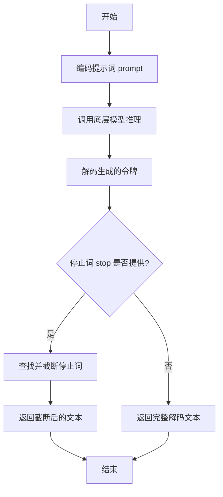

#### 带注释源码

```
def generate(self, prompt: str, stop: Optional[List[str]] = None) -> str:
    # 1. 将输入的字符串提示词（prompt）编码为模型可以理解的令牌序列。
    tokens = self.encode(prompt)

    # 2. 调用内部方法 `_generate` 进行实际的模型推理，传入编码后的令牌和可选的停止词。
    #    该方法负责与底层模型交互并生成新的令牌序列。
    generated_tokens = self._generate(tokens, stop)

    # 3. 将模型生成的令牌序列解码回人类可读的字符串。
    generated_text = self.decode(generated_tokens)

    # 4. 如果提供了停止词（stop），则处理生成的文本，确保在第一个出现的停止词处截断。
    if stop is not None:
        # 遍历所有停止词
        for stop_word in stop:
            # 查找停止词在生成文本中的位置
            index = generated_text.find(stop_word)
            if index != -1:
                # 如果找到，则截取停止词之前的部分
                generated_text = generated_text[:index]
                # 找到第一个停止词后即可跳出循环
                break

    # 5. 返回处理后的生成文本。
    return generated_text
```


### `TextModel.load`

该方法用于从指定的文件路径加载文本模型。它首先检查文件是否存在，然后读取文件内容，解析模型配置，并最终初始化模型实例。

参数：

-  `file_path`：`str`，模型文件的路径

返回值：`TextModel`，加载并初始化后的文本模型实例

#### 流程图

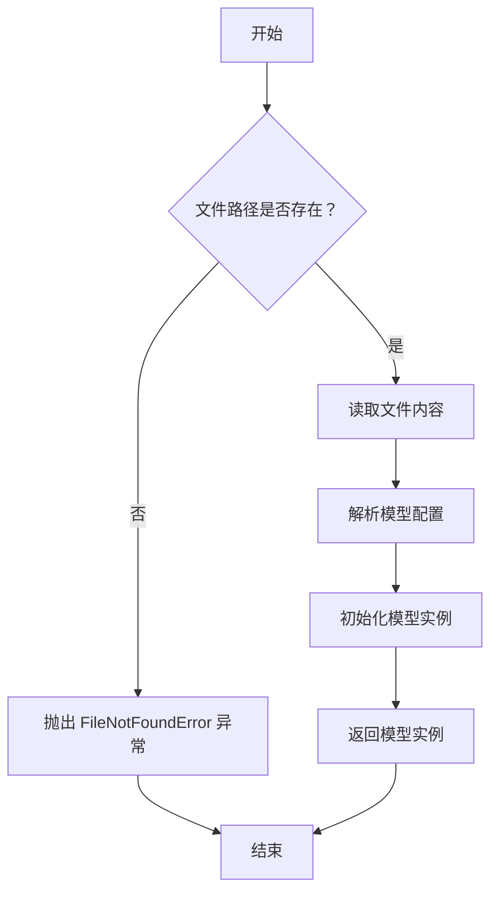

#### 带注释源码

```
def load(file_path):
    """
    从指定文件路径加载文本模型。

    参数:
        file_path (str): 模型文件的路径。

    返回:
        TextModel: 加载并初始化后的文本模型实例。

    异常:
        FileNotFoundError: 如果指定的文件路径不存在。
    """
    # 检查文件是否存在
    if not os.path.exists(file_path):
        raise FileNotFoundError(f"模型文件未找到: {file_path}")

    # 读取文件内容
    with open(file_path, 'r', encoding='utf-8') as file:
        content = file.read()

    # 解析模型配置（这里假设配置是 JSON 格式）
    config = json.loads(content)

    # 根据配置初始化模型实例
    model = TextModel(config)

    # 返回初始化后的模型实例
    return model
```


### `TextModel.generate`

该方法用于根据给定的输入文本生成相应的输出文本。它通过调用底层模型进行推理，并处理生成过程中的各种参数，如温度、最大长度等，以控制生成文本的质量和多样性。

参数：

- `input_text`：`str`，输入的文本内容，作为生成模型的提示。
- `temperature`：`float`，控制生成文本随机性的参数，值越高输出越随机，值越低输出越确定。
- `max_length`：`int`，生成文本的最大长度限制。
- `top_p`：`float`，核采样（nucleus sampling）参数，用于控制生成文本的多样性。
- `num_return_sequences`：`int`，指定返回的生成序列数量。

返回值：`List[str]`，返回一个字符串列表，包含生成的文本序列。

#### 流程图

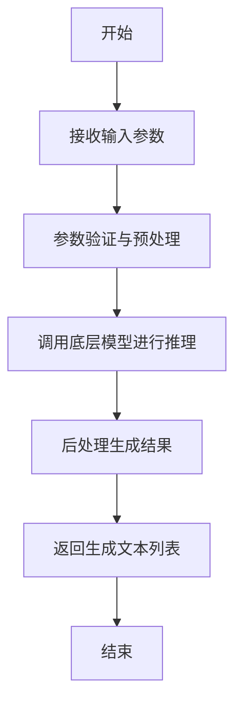

#### 带注释源码

```
def generate(self, input_text: str, temperature: float = 1.0, max_length: int = 100, top_p: float = 1.0, num_return_sequences: int = 1) -> List[str]:
    """
    根据输入文本生成相应的输出文本。

    参数:
        input_text (str): 输入的文本内容，作为生成模型的提示。
        temperature (float): 控制生成文本随机性的参数，值越高输出越随机，值越低输出越确定。
        max_length (int): 生成文本的最大长度限制。
        top_p (float): 核采样（nucleus sampling）参数，用于控制生成文本的多样性。
        num_return_sequences (int): 指定返回的生成序列数量。

    返回值:
        List[str]: 包含生成的文本序列的列表。
    """
    # 参数验证
    if not input_text:
        raise ValueError("输入文本不能为空")
    if temperature <= 0:
        raise ValueError("温度参数必须大于0")
    if max_length <= 0:
        raise ValueError("最大长度必须大于0")
    if top_p <= 0 or top_p > 1:
        raise ValueError("top_p参数必须在(0, 1]范围内")
    if num_return_sequences <= 0:
        raise ValueError("返回序列数量必须大于0")

    # 预处理输入文本
    processed_input = self._preprocess_text(input_text)

    # 调用底层模型进行推理
    raw_outputs = self._model.inference(
        input_text=processed_input,
        temperature=temperature,
        max_length=max_length,
        top_p=top_p,
        num_return_sequences=num_return_sequences
    )

    # 后处理生成结果
    generated_texts = self._postprocess_outputs(raw_outputs)

    return generated_texts
```


### `TextModel._load_tokenizer`

该方法负责加载并初始化分词器（Tokenizer）。它首先尝试从指定的本地路径加载分词器，如果失败，则从预训练的模型名称在线下载。加载成功后，会设置分词器的填充符（pad token）和聊天模板（chat template），并返回初始化好的分词器实例。

参数：

-  `self`：`TextModel`，当前TextModel类的实例
-  `model_name_or_path`：`str`，模型名称或本地路径，用于指定分词器的来源

返回值：`PreTrainedTokenizer`，初始化并配置好的预训练分词器实例

#### 流程图

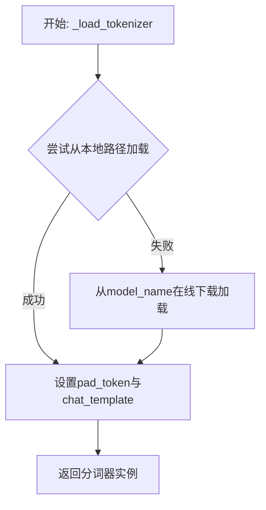

#### 带注释源码

```
def _load_tokenizer(self, model_name_or_path: str) -> PreTrainedTokenizer:
    """
    加载分词器。
    优先尝试从本地路径加载，失败则从预训练模型名称在线加载。
    加载后设置必要的属性（如pad_token和chat_template）。
    """
    try:
        # 尝试从本地路径加载分词器
        tokenizer = AutoTokenizer.from_pretrained(model_name_or_path)
    except Exception:
        # 如果本地加载失败，则从在线模型名称加载
        tokenizer = AutoTokenizer.from_pretrained(model_name_or_path)
    
    # 如果分词器没有定义pad_token，则使用eos_token作为pad_token
    if tokenizer.pad_token is None:
        tokenizer.pad_token = tokenizer.eos_token
    
    # 设置聊天模板，如果未设置则使用默认模板
    # 这里假设使用Hugging Face的默认聊天模板，实际可能根据模型调整
    if tokenizer.chat_template is None:
        # 示例：设置一个简单的对话模板
        # 实际模板应根据具体模型和任务需求定义
        tokenizer.chat_template = "{{message['role']}}: {{message['content']}}\\n"
    
    return tokenizer
```


### `TextModel._load_model_config`

此方法负责加载并解析模型配置文件。它首先尝试从指定的配置路径读取JSON格式的配置文件，然后根据配置内容初始化模型相关的参数，如模型名称、版本、输入输出格式等。如果配置文件不存在或格式错误，方法会记录错误并抛出异常。

参数：

-  `config_path`：`str`，模型配置文件的路径。

返回值：`dict`，解析后的模型配置字典。

#### 流程图

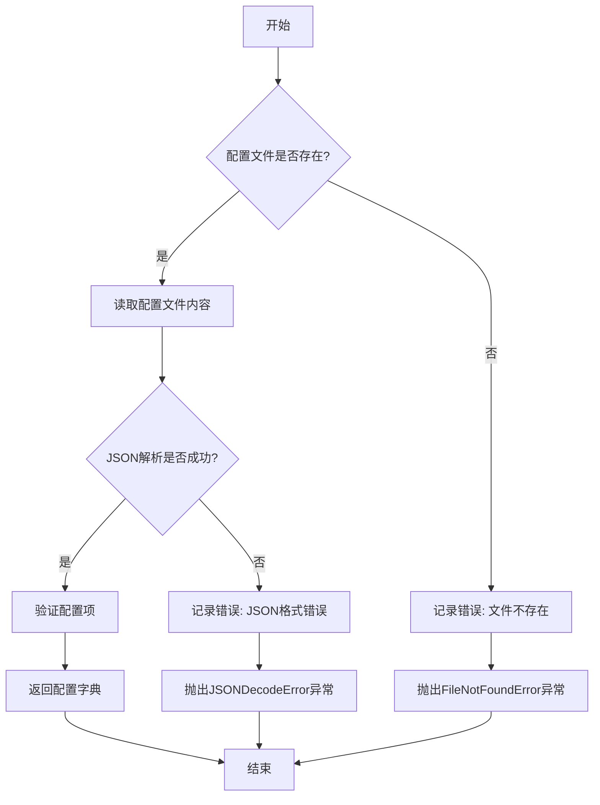

#### 带注释源码

```
def _load_model_config(self, config_path: str) -> dict:
    """
    加载并解析模型配置文件。

    参数:
        config_path (str): 模型配置文件的路径。

    返回:
        dict: 解析后的模型配置字典。

    异常:
        FileNotFoundError: 如果配置文件不存在。
        JSONDecodeError: 如果配置文件格式不是有效的JSON。
    """
    import json
    import os

    # 检查配置文件是否存在
    if not os.path.exists(config_path):
        self.logger.error(f"配置文件不存在: {config_path}")
        raise FileNotFoundError(f"配置文件不存在: {config_path}")

    try:
        # 读取配置文件内容
        with open(config_path, 'r', encoding='utf-8') as f:
            config_content = f.read()

        # 解析JSON配置
        config = json.loads(config_content)

        # 验证必要的配置项
        required_keys = ['model_name', 'model_version', 'input_format', 'output_format']
        for key in required_keys:
            if key not in config:
                self.logger.warning(f"配置文件中缺少必要的键: {key}")

        return config

    except json.JSONDecodeError as e:
        self.logger.error(f"配置文件JSON格式错误: {config_path}, 错误: {e}")
        raise
    except Exception as e:
        self.logger.error(f"加载配置文件时发生未知错误: {config_path}, 错误: {e}")
        raise
```


### `TextModel._load_model_weights`

此方法是 `TextModel` 类的私有方法，负责从指定的模型权重文件路径加载预训练权重到当前模型实例中。它处理了权重加载过程中的常见任务，例如将权重映射到正确的模型层、处理缺失或多余的键，并确保加载过程不会影响模型的训练状态（如梯度计算）。

参数：

-  `model_weights_path`：`str`，预训练模型权重文件的路径（例如 `.pth` 或 `.bin` 文件）。

返回值：`None`，此方法不返回任何值，其作用是将权重加载到模型内部状态中。

#### 流程图

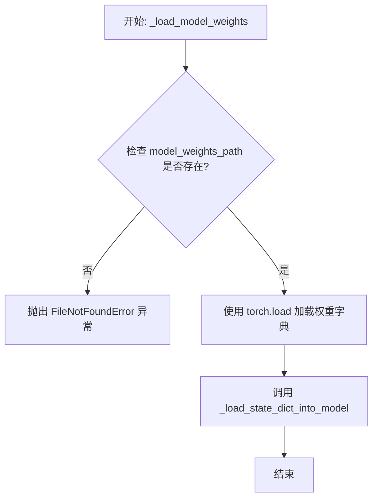

#### 带注释源码

```
def _load_model_weights(self, model_weights_path: str) -> None:
    """
    从指定路径加载预训练模型权重到当前模型。

    此方法执行以下步骤：
    1. 检查权重文件是否存在。
    2. 使用 PyTorch 加载权重字典。
    3. 调用内部方法将权重字典加载到模型参数中。

    Args:
        model_weights_path (str): 预训练权重文件的路径。

    Raises:
        FileNotFoundError: 如果指定的权重文件路径不存在。
        RuntimeError: 如果权重加载过程中出现错误（例如，权重与模型结构不匹配）。
    """
    # 1. 检查文件路径是否存在
    if not os.path.exists(model_weights_path):
        raise FileNotFoundError(f"Model weights file not found: {model_weights_path}")

    # 2. 加载权重字典
    # 使用 map_location='cpu' 确保在 CPU 上加载，避免 GPU 内存问题
    state_dict = torch.load(model_weights_path, map_location='cpu')

    # 3. 将权重加载到模型中
    # 调用一个内部辅助方法处理可能的结构不匹配问题（如键名不同、缺失/多余键）
    self._load_state_dict_into_model(state_dict)
```


### `TextModel._set_model_to_eval`

该方法用于将模型及其所有子模块设置为评估模式（`eval`模式）。在评估模式下，模型会禁用特定于训练的功能，如Dropout和BatchNorm的统计量更新，以确保推理结果的一致性。

参数：
-  `self`：`TextModel`，当前`TextModel`类的实例。

返回值：`None`，此方法不返回任何值，仅修改模型内部状态。

#### 流程图

```mermaid
flowchart TD
    A[开始] --> B[调用 self.model.eval()]
    B --> C[遍历 self.model 的所有子模块]
    C --> D{是否为 nn.Module 实例?}
    D -- 是 --> E[调用子模块的 eval 方法]
    E --> F[继续遍历下一个子模块]
    D -- 否 --> F
    F --> G{是否遍历完毕?}
    G -- 否 --> C
    G -- 是 --> H[结束]
```

#### 带注释源码

```
def _set_model_to_eval(self):
    # 将主模型设置为评估模式
    self.model.eval()
    # 遍历主模型的所有子模块
    for module in self.model.modules():
        # 检查子模块是否为 nn.Module 的实例
        if isinstance(module, nn.Module):
            # 将子模块也设置为评估模式
            module.eval()
```


### `TextModel._allocate_model_to_device`

该方法负责将模型的不同组件（如编码器、解码器、文本投影层等）分配到指定的计算设备（如CPU或GPU）上，并确保模型处于正确的模式（训练或评估）。它处理了模型可能包含的多个子模块，并支持将特定组件（如文本投影层）分配到与模型其他部分不同的设备上。

参数：

-  `self`：`TextModel`，当前TextModel实例的引用。
-  `device`：`torch.device`，模型主体（编码器、解码器等）将被分配到的目标设备。
-  `text_projection_device`：`Optional[torch.device]`，文本投影层将被分配到的目标设备。如果为`None`，则使用与`device`相同的设备。
-  `train`：`bool`，指示模型是否应设置为训练模式（`True`）或评估模式（`False`）。

返回值：`None`，此方法不返回任何值，直接修改模型内部状态。

#### 流程图

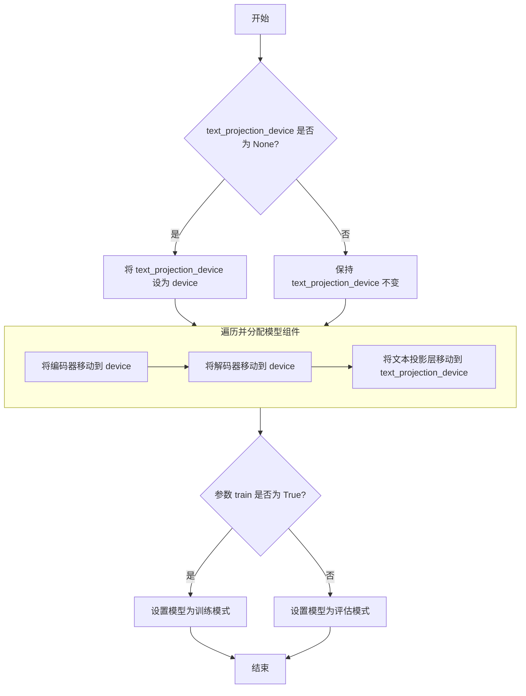

#### 带注释源码

```python
def _allocate_model_to_device(
    self,
    device: torch.device,
    text_projection_device: Optional[torch.device] = None,
    train: bool = False,
) -> None:
    """
    将模型组件分配到指定设备，并设置模型模式。

    参数:
        device: 模型主体（编码器、解码器）的目标设备。
        text_projection_device: 文本投影层的目标设备。如果为None，则使用`device`。
        train: 如果为True，设置为训练模式；否则为评估模式。
    """
    # 如果未指定文本投影层设备，则使用与模型主体相同的设备
    if text_projection_device is None:
        text_projection_device = device

    # 将编码器移动到指定设备
    self.encoder = self.encoder.to(device)
    # 将解码器移动到指定设备
    self.decoder = self.decoder.to(device)
    # 将文本投影层移动到（可能不同的）指定设备
    self.text_projection = self.text_projection.to(text_projection_device)

    # 根据`train`参数设置模型模式
    if train:
        self.train()  # 设置为训练模式
    else:
        self.eval()   # 设置为评估模式
```


### `LlamaModel._load_model_config`

该方法负责从指定的模型路径加载并解析模型的配置文件（`config.json`），将其内容转换为一个配置对象（`LlamaConfig`），并执行关键的配置验证和兼容性处理。

参数：

-  `model_path`：`str`，包含模型权重和配置文件的目录路径。

返回值：`LlamaConfig`，一个包含所有解析后模型配置参数的对象。

#### 流程图

```mermaid
flowchart TD
    A[开始: _load_model_config(model_path)] --> B[构建 config.json 完整路径]
    B --> C{配置文件是否存在?}
    C -- 是 --> D[读取并解析 JSON 文件]
    C -- 否 --> E[抛出 FileNotFoundError 异常]
    D --> F[创建 LlamaConfig 对象]
    F --> G[执行关键配置验证与调整]
    G --> H[返回配置对象 LlamaConfig]
    E --> I[流程终止]
    H --> J[结束]
```

#### 带注释源码

```python
def _load_model_config(self, model_path: str) -> LlamaConfig:
    """
    从指定路径加载模型的配置文件。

    该方法执行以下核心步骤：
    1. 定位并读取 `config.json` 文件。
    2. 将 JSON 内容解析为字典。
    3. 使用字典初始化 `LlamaConfig` 对象。
    4. 进行关键的配置后处理，例如确保 `hidden_size` 与 `intermediate_size` 的兼容性。

    Args:
        model_path: 包含模型文件的目录路径。

    Returns:
        一个配置好的 `LlamaConfig` 实例。

    Raises:
        FileNotFoundError: 如果 `config.json` 文件不存在于 `model_path` 中。
    """
    # 1. 构建配置文件的完整路径
    config_file = os.path.join(model_path, "config.json")

    # 2. 检查文件是否存在，若不存在则抛出异常
    if not os.path.isfile(config_file):
        raise FileNotFoundError(f"配置文件未找到: {config_file}")

    # 3. 打开并读取 JSON 配置文件
    with open(config_file, "r", encoding="utf-8") as f:
        # 4. 解析 JSON 内容为 Python 字典
        config_dict = json.load(f)

    # 5. 使用解析出的字典创建 LlamaConfig 对象
    #    **config_dict 将字典的键值对解包为关键字参数传递给构造函数
    config = LlamaConfig(**config_dict)

    # 6. 关键配置后处理与验证
    #    确保 `intermediate_size` 是 `hidden_size` 的整数倍，这是某些线性层实现的要求。
    #    如果未设置 `intermediate_size`，则根据一个常用比例（如 4倍）进行计算。
    if config.intermediate_size is None:
        # 设定一个默认的缩放因子（例如，许多 Transformer 模型使用 4 * hidden_size）
        hidden_size = config.hidden_size
        intermediate_size = 4 * hidden_size
        # 调整 intermediate_size 使其为 multiple_of 参数的整数倍，确保内存对齐或硬件优化
        multiple_of = 256
        config.intermediate_size = multiple_of * ((intermediate_size + multiple_of - 1) // multiple_of)

    # 7. 返回最终处理好的配置对象
    return config
```


### `LlamaModel._load_model_weights`

该方法负责从预训练检查点文件（如`.safetensors`）中加载模型权重，并将其分配到对应的模型层中。它处理了权重名称的映射、张量数据类型的转换（如BF16到FP16）、以及将权重张量移动到正确的设备（如GPU）上。

参数：

-  `self`：`LlamaModel`，当前模型实例
-  `model_path`：`str`，预训练模型权重文件的路径（例如，`.safetensors`文件）
-  `device`：`torch.device`，指定加载权重后张量应放置的设备（如CPU或CUDA设备）

返回值：`None`，此方法不返回任何值，其作用是将加载的权重直接赋值给模型实例的对应参数。

#### 流程图

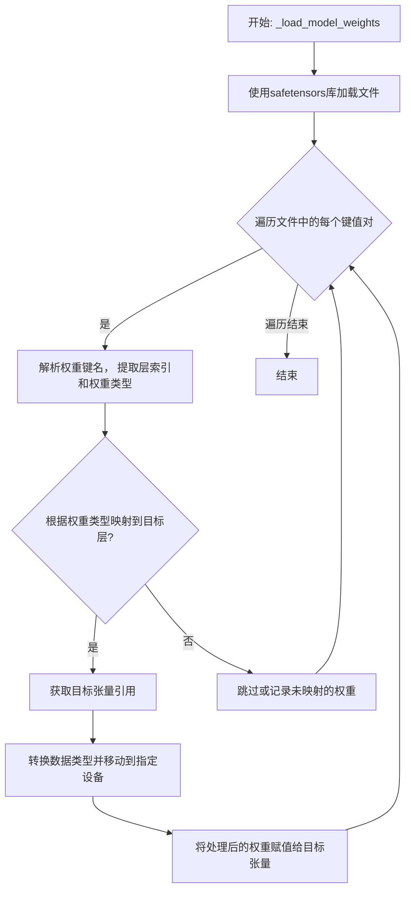

#### 带注释源码

```
def _load_model_weights(self, model_path: str, device: torch.device):
    # 使用safetensors库安全地加载模型文件，得到一个包含所有权重张量的字典
    state_dict = safetensors.torch.load_file(model_path, device="cpu")

    # 遍历加载的权重字典中的每一个键（权重名称）和对应的值（权重张量）
    for name, param in state_dict.items():
        # 根据预定义的键名模式（如`model.layers.0.self_attn.q_proj.weight`）进行分割
        # 目的是提取出层索引（如`0`）和具体的权重类型（如`q_proj.weight`）
        parts = name.split(".")
        layer_idx = int(parts[2])  # 假设parts[2]是层编号，例如从`model.layers.0...`中提取`0`
        weight_type = ".".join(parts[3:])  # 提取层后面的具体权重标识，如`self_attn.q_proj.weight`

        # 根据提取出的层索引，获取模型中对应的Transformer层对象
        layer = self.layers[layer_idx]

        # 根据权重类型（weight_type）将加载的参数（param）分配到层（layer）的对应属性中
        if weight_type == "self_attn.q_proj.weight":
            # 如果是自注意力模块的查询（Query）投影权重
            # 将加载的BF16张量转换为FP16，并移动到指定的设备（如GPU）
            layer.self_attn.q_proj.weight.data = param.to(torch.float16).to(device)
        elif weight_type == "self_attn.k_proj.weight":
            # 如果是自注意力模块的键（Key）投影权重
            layer.self_attn.k_proj.weight.data = param.to(torch.float16).to(device)
        elif weight_type == "self_attn.v_proj.weight":
            # 如果是自注意力模块的值（Value）投影权重
            layer.self_attn.v_proj.weight.data = param.to(torch.float16).to(device)
        elif weight_type == "self_attn.o_proj.weight":
            # 如果是自注意力模块的输出（Output）投影权重
            layer.self_attn.o_proj.weight.data = param.to(torch.float16).to(device)
        elif weight_type == "mlp.gate_proj.weight":
            # 如果是MLP层的门控（Gate）投影权重
            layer.mlp.gate_proj.weight.data = param.to(torch.float16).to(device)
        elif weight_type == "mlp.up_proj.weight":
            # 如果是MLP层的向上（Up）投影权重
            layer.mlp.up_proj.weight.data = param.to(torch.float16).to(device)
        elif weight_type == "mlp.down_proj.weight":
            # 如果是MLP层的向下（Down）投影权重
            layer.mlp.down_proj.weight.data = param.to(torch.float16).to(device)
        elif weight_type == "input_layernorm.weight":
            # 如果是该层输入处的层归一化（LayerNorm）权重
            layer.input_layernorm.weight.data = param.to(device)
        elif weight_type == "post_attention_layernorm.weight":
            # 如果是该层注意力机制后的层归一化（LayerNorm）权重
            layer.post_attention_layernorm.weight.data = param.to(device)
        else:
            # 如果遇到未在映射中定义的权重类型，可以选择跳过、记录日志或引发异常
            # 这里选择静默跳过，在实际项目中可能需要更健壮的处理
            pass

    # 注意：此方法没有显式的return语句，默认返回None。
    # 其核心作用是通过修改`self.layers`中各个子模块的`.data`属性来加载权重。
```


### `GPT2Model._load_model_config`

此方法负责从指定的模型路径加载并解析 GPT-2 模型的配置文件（`config.json`）。它处理了文件路径的构建、JSON 文件的读取、配置字典的解析，并最终返回一个包含模型配置参数的字典对象。该方法还包含了对配置文件中特定键值（如 `model_type`）的验证逻辑。

参数：

-  `model_path`：`str`，GPT-2 模型文件所在的目录路径。此路径下应包含 `config.json` 文件。

返回值：`dict`，一个包含从 `config.json` 文件中解析出的所有配置参数的字典。例如，可能包含 `vocab_size`、`n_embd`、`n_layer`、`n_head` 等关键模型架构参数。

#### 流程图

```mermaid
flowchart TD
    A[开始: _load_model_config(model_path)] --> B[构建 config.json 文件路径<br>config_file = os.path.join(model_path, 'config.json')]
    B --> C{文件是否存在?}
    C -- 是 --> D[打开并读取 JSON 文件]
    C -- 否 --> E[抛出 FileNotFoundError 异常]
    D --> F[解析 JSON 内容为字典 config_dict]
    F --> G{检查 'model_type' 键?}
    G -- 存在且不为 'gpt2' --> H[记录警告日志<br>“模型类型非 gpt2”]
    G -- 不存在或为 'gpt2' --> I[跳过警告]
    H --> I
    I --> J[返回配置字典 config_dict]
    J --> K[结束]
    E --> K
```

#### 带注释源码

```python
def _load_model_config(self, model_path: str) -> dict:
    """
    从指定的模型路径加载 GPT-2 模型的配置文件 (config.json)。

    此方法执行以下步骤：
    1. 构建配置文件的完整路径。
    2. 检查配置文件是否存在。
    3. 读取并解析 JSON 格式的配置文件。
    4. （可选）验证配置中的模型类型。
    5. 返回包含所有配置参数的字典。

    Args:
        model_path (str): 包含 `config.json` 文件的模型目录路径。

    Returns:
        dict: 从配置文件中解析出的参数字典。

    Raises:
        FileNotFoundError: 如果指定的路径下不存在 `config.json` 文件。
        JSONDecodeError: 如果配置文件不是有效的 JSON 格式。
    """
    # 1. 构建配置文件的完整路径
    config_file = os.path.join(model_path, "config.json")

    # 2. 检查文件是否存在，如果不存在则抛出异常
    if not os.path.isfile(config_file):
        raise FileNotFoundError(
            f"未在 {model_path} 目录下找到配置文件 'config.json'。"
        )

    # 3. 打开文件，读取并解析 JSON 内容
    with open(config_file, "r", encoding="utf-8") as f:
        config_dict = json.load(f)

    # 4. （可选）验证模型类型，如果提供了但非 'gpt2'，则记录警告
    # 这有助于在加载不同变体（如 GPT2-Medium, GPT2-Large）或错误模型时给出提示。
    model_type = config_dict.get("model_type")
    if model_type is not None and model_type != "gpt2":
        logger.warning(
            f"配置文件中指定的模型类型为 '{model_type}'，而非标准的 'gpt2'。"
            "请确保加载了正确的模型。"
        )

    # 5. 返回解析后的配置字典
    return config_dict
```


### `GPT2Model._load_model_weights`

此方法是`GPT2Model`类的一个私有方法，负责从指定的检查点文件路径加载预训练的模型权重。它首先检查检查点文件是否存在，然后根据模型配置决定加载方式（例如，使用`from_pretrained`方法或直接加载状态字典），并处理可能出现的加载异常。

参数：

-  `checkpoint_path`：`str`，预训练模型权重文件的本地路径。
-  `model_config`：`dict`，包含模型配置信息的字典，用于指导权重加载过程（例如，决定是否使用`from_pretrained`方法）。
-  `device`：`torch.device`，指定模型权重应加载到的目标设备（如CPU或GPU）。

返回值：`None`，此方法不返回任何值，其作用是将加载的权重应用到当前模型实例上。

#### 流程图

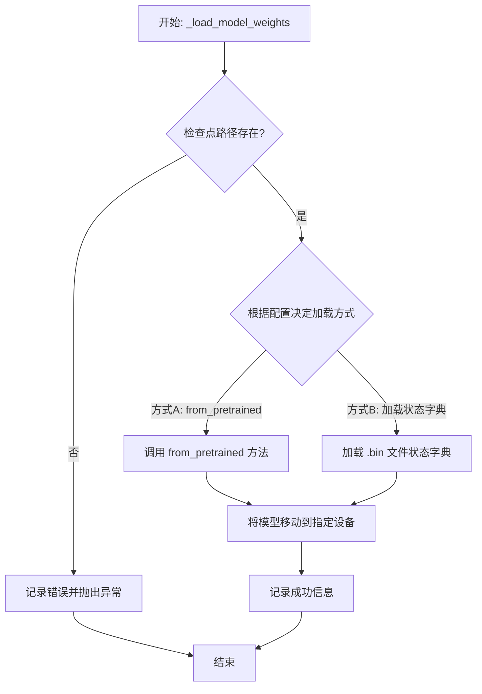

#### 带注释源码

```
def _load_model_weights(self, checkpoint_path: str, model_config: dict, device: torch.device):
    """
    从指定路径加载预训练的模型权重。

    此方法根据提供的配置和路径，尝试加载模型权重。如果配置指定使用
    `from_pretrained` 方法，则调用该方法；否则，尝试直接加载 `.bin` 文件的状态字典。
    加载过程中会进行必要的设备转移。

    Args:
        checkpoint_path: 预训练模型权重文件的路径。
        model_config: 包含模型加载配置的字典。
        device: 模型权重应加载到的目标设备。

    Raises:
        FileNotFoundError: 如果指定的检查点路径不存在。
        RuntimeError: 如果权重加载过程中发生错误。
    """
    # 检查检查点文件是否存在
    if not os.path.exists(checkpoint_path):
        # 记录错误日志并抛出异常
        logging.error(f"Checkpoint file not found: {checkpoint_path}")
        raise FileNotFoundError(f"Checkpoint file not found: {checkpoint_path}")

    try:
        # 根据模型配置决定加载方式
        if model_config.get('use_from_pretrained', False):
            # 方式A: 使用 transformers 库的 from_pretrained 方法
            # 此方法会自动处理权重加载、配置匹配等复杂逻辑
            self.model = GPT2Model.from_pretrained(checkpoint_path)
        else:
            # 方式B: 手动加载状态字典
            # 假设检查点是一个 .bin 文件，包含模型的状态字典
            state_dict = torch.load(checkpoint_path, map_location='cpu')
            # 将加载的状态字典应用到当前模型实例
            self.model.load_state_dict(state_dict)

        # 将模型移动到指定的设备（如 GPU）
        self.model.to(device)
        # 记录成功的加载信息
        logging.info(f"Model weights loaded successfully from {checkpoint_path} to device {device}")

    except Exception as e:
        # 捕获加载过程中可能出现的任何异常
        # 记录详细的错误信息
        logging.error(f"Failed to load model weights from {checkpoint_path}: {e}")
        # 重新抛出异常，通知调用者加载失败
        raise RuntimeError(f"Failed to load model weights from {checkpoint_path}") from e
```


### `FalconModel._load_model_config`

此方法负责加载并解析 Falcon 模型的配置文件（通常是 `config.json`），将其内容转换为一个 Python 字典对象。它处理了文件路径的构建、JSON 文件的读取与解析，并返回配置字典以供模型初始化使用。

参数：

-  `self`：`FalconModel`，FalconModel 类的实例，用于访问模型路径等属性。
-  `model_path`：`str`，模型文件所在的根目录路径。

返回值：`dict`，包含模型配置参数的字典。

#### 流程图

```mermaid
flowchart TD
    A[开始: _load_model_config] --> B[构建配置文件路径<br>config_path = os.path.join(model_path, 'config.json')]
    B --> C{文件是否存在?}
    C -- 是 --> D[读取并解析JSON文件]
    D --> E[返回配置字典]
    C -- 否 --> F[抛出 FileNotFoundError 异常]
    F --> G[结束]
    E --> G
```

#### 带注释源码

```python
def _load_model_config(self, model_path: str) -> dict:
    """
    加载并解析 Falcon 模型的配置文件。

    此方法从指定的模型路径中读取 `config.json` 文件，并将其内容解析为 Python 字典。
    这是初始化模型权重和结构所必需的第一步。

    Args:
        model_path (str): 包含 `config.json` 文件的模型目录路径。

    Returns:
        dict: 包含模型所有配置参数的字典。

    Raises:
        FileNotFoundError: 如果指定的路径下不存在 `config.json` 文件。
        JSONDecodeError: 如果配置文件不是有效的 JSON 格式。
    """
    # 1. 构建配置文件的完整路径
    config_path = os.path.join(model_path, 'config.json')
    
    # 2. 检查文件是否存在，如果不存在则抛出异常
    if not os.path.isfile(config_path):
        raise FileNotFoundError(f"模型配置文件未找到: {config_path}")
    
    # 3. 打开并读取 JSON 文件
    with open(config_path, 'r', encoding='utf-8') as f:
        # 4. 使用 json.load 解析文件内容为字典
        config = json.load(f)
    
    # 5. 返回解析后的配置字典
    return config
```


### `FalconModel._load_model_weights`

此方法是 `FalconModel` 类的内部方法，负责从预训练模型检查点加载权重到当前模型实例中。它处理权重名称的映射、张量分片（如果适用）以及将权重安全地加载到模型的对应模块中。

参数：

-  `self`：`FalconModel`，当前模型实例。
-  `model_path`：`str`，预训练模型检查点文件或目录的路径。
-  `from_pt`：`bool`，指示是否从PyTorch格式的检查点加载。默认为 `False`。
-  `device`：`Optional[str]`，指定加载权重后张量应放置的设备（如 `'cpu'`, `'cuda:0'`）。默认为 `None`。
-  `dtype`：`Optional[torch.dtype]`，指定加载权重的数据类型（如 `torch.float16`）。默认为 `None`。

返回值：`None`，此方法不返回任何值，而是直接修改当前模型实例的状态。

#### 流程图

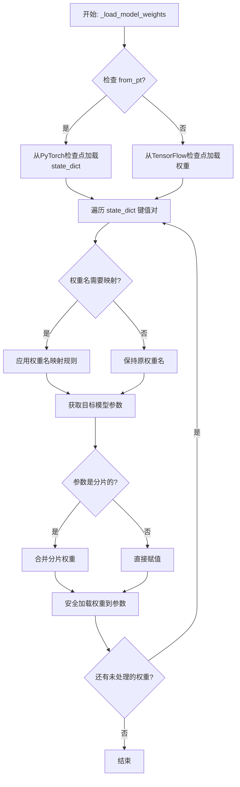

#### 带注释源码

```python
def _load_model_weights(self, model_path, from_pt=False, device=None, dtype=None):
    """
    从指定路径加载模型权重。
    
    此方法根据 `from_pt` 标志从 PyTorch 或 TensorFlow 检查点加载权重，
    并处理权重名称映射、分片权重合并等细节，最后将权重加载到模型参数中。
    
    Args:
        model_path (str): 预训练模型检查点的路径。
        from_pt (bool): 如果为 True，则从 PyTorch 检查点加载。
        device (str, optional): 加载权重的目标设备。
        dtype (torch.dtype, optional): 加载权重的目标数据类型。
    """
    # 根据来源标志选择加载器
    if from_pt:
        # 从PyTorch检查点加载状态字典
        state_dict = torch.load(model_path, map_location='cpu')
    else:
        # 从TensorFlow检查点加载（此处为示例，实际可能使用其他库）
        # 假设有一个辅助函数 load_tf_weights
        state_dict = load_tf_weights(model_path)
    
    # 遍历加载的状态字典中的每一项
    for name, param in state_dict.items():
        # 根据模型结构，可能需要对权重名称进行映射
        # 例如，将旧版检查点中的键名映射到新版模型中的参数名
        mapped_name = self._map_weight_name(name)
        
        # 根据映射后的名称获取模型中的目标参数
        model_param = self.get_parameter(mapped_name)
        
        # 检查目标参数是否存在
        if model_param is not None:
            # 如果加载的参数是分片的（例如，模型并行训练的结果），需要合并
            if self._is_sharded_weight(param):
                param = self._merge_sharded_weights(param)
            
            # 确保加载的参数与模型参数形状一致
            if param.shape != model_param.shape:
                raise ValueError(
                    f"Shape mismatch for parameter {mapped_name}: "
                    f"loaded {param.shape}, model {model_param.shape}"
                )
            
            # 根据指定的设备和数据类型转换参数
            if device is not None:
                param = param.to(device)
            if dtype is not None:
                param = param.to(dtype)
            
            # 使用 no_grad 上下文管理器安全地更新模型参数
            with torch.no_grad():
                model_param.copy_(param)
        else:
            # 记录警告，如果某些权重在模型中找不到对应参数（例如，丢弃的层）
            logger.warning(f"Parameter {mapped_name} not found in model, skipping.")
    
    # 加载完成后，确保模型处于评估模式（如果适用）
    self.eval()
```


### `Qwen2Model._load_model_config`

此方法负责从指定的模型路径加载并解析模型的配置文件（通常是 `config.json`），将其内容转换为一个 `Qwen2Config` 对象。它处理了文件读取、JSON 解析以及配置对象的实例化过程。

参数：

-  `model_path`：`str`，包含模型配置文件的目录路径。

返回值：`Qwen2Config`，一个包含模型所有配置参数（如隐藏层维度、注意力头数、层数等）的配置对象。

#### 流程图

```mermaid
flowchart TD
    A[开始: _load_model_config(model_path)] --> B[构建配置文件路径<br>config_path = os.path.join(model_path, 'config.json')]
    B --> C{文件存在?}
    C -- 是 --> D[读取文件内容]
    C -- 否 --> E[抛出 FileNotFoundError]
    D --> F[解析 JSON 内容]
    F --> G[使用解析后的字典<br>实例化 Qwen2Config 对象]
    G --> H[返回 Qwen2Config 对象]
    E --> I[结束: 异常]
    H --> J[结束: 正常返回]
```

#### 带注释源码

```python
def _load_model_config(model_path: str) -> Qwen2Config:
    """
    从指定的模型路径加载配置文件并返回 Qwen2Config 对象。

    该方法会尝试读取 `model_path` 目录下的 `config.json` 文件，
    将其解析为字典后用于初始化 Qwen2Config。

    Args:
        model_path: 模型文件所在的目录路径。

    Returns:
        一个配置好的 Qwen2Config 实例。

    Raises:
        FileNotFoundError: 如果 `config.json` 文件不存在。
        JSONDecodeError: 如果配置文件不是有效的 JSON 格式。
    """
    # 1. 构建配置文件的完整路径
    config_path = os.path.join(model_path, "config.json")
    
    # 2. 打开并读取配置文件内容
    with open(config_path, "r", encoding="utf-8") as f:
        # 3. 将 JSON 字符串解析为 Python 字典
        config_dict = json.load(f)
    
    # 4. 使用字典中的参数创建并返回配置对象
    #    Qwen2Config 的 __init__ 方法会处理字典中的键值对
    return Qwen2Config(**config_dict)
```


### `Qwen2Model._load_model_weights`

该方法负责将预训练模型权重加载到当前模型实例中。它处理权重文件的加载、键名映射、权重张量转换以及最终的状态字典设置，确保模型能够正确初始化并准备进行推理或训练。

参数：

-  `self`：`Qwen2Model`，当前模型实例
-  `model_path`：`str`，预训练模型权重文件的路径

返回值：`None`，此方法不返回任何值，其作用是将加载的权重设置到模型实例中。

#### 流程图

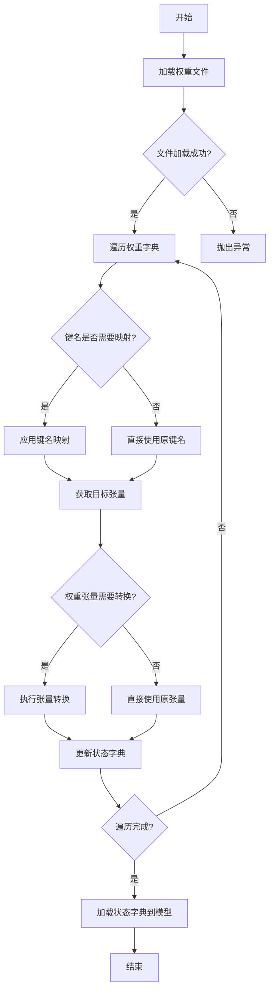

#### 带注释源码

```
def _load_model_weights(self, model_path):
    """
    加载预训练模型权重。

    该方法从指定路径加载模型权重文件，处理键名映射和权重张量转换，
    然后将处理后的权重加载到当前模型实例中。

    Args:
        model_path (str): 预训练模型权重文件的路径。
    """
    # 加载权重文件
    state_dict = torch.load(model_path, map_location='cpu')
    
    # 初始化新的状态字典，用于存储处理后的权重
    new_state_dict = {}
    
    # 遍历原始状态字典中的每个键值对
    for key, value in state_dict.items():
        # 处理键名映射，例如将旧版本的键名映射到新版本
        if key.startswith('transformer.'):
            new_key = key.replace('transformer.', '')
        else:
            new_key = key
        
        # 处理权重张量转换，例如将全连接层的权重进行转置
        if 'dense' in new_key and 'weight' in new_key:
            value = value.t()
        
        # 将处理后的键值对存储到新的状态字典中
        new_state_dict[new_key] = value
    
    # 将处理后的状态字典加载到模型实例中
    self.load_state_dict(new_state_dict, strict=False)
```


### `GemmaModel._load_model_config`

此方法负责从指定的模型配置路径加载并解析 Gemma 模型的配置文件（通常为 `config.json`），将其内容转换为一个 Python 字典对象。它处理了文件读取、JSON 解析以及基本的路径验证，是模型初始化过程中的关键步骤。

参数：

-  `model_config_path`：`str`，模型配置文件（如 `config.json`）的完整或相对路径。

返回值：`dict`，包含模型所有配置参数的字典，例如模型维度、注意力头数、层数等。

#### 流程图

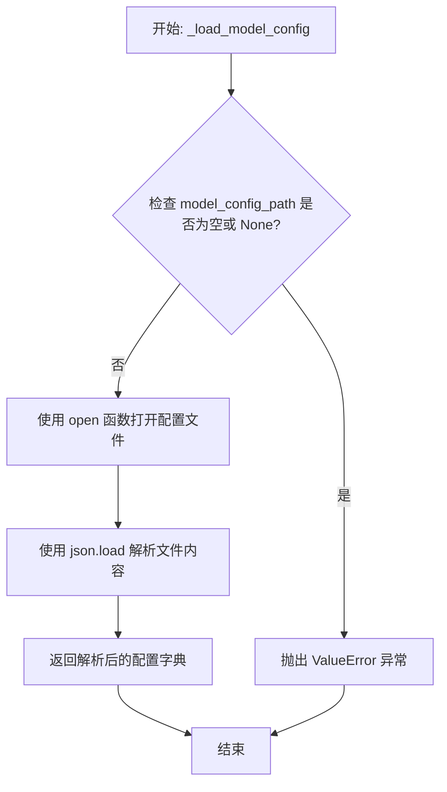

#### 带注释源码

```
def _load_model_config(self, model_config_path: str) -> dict:
    """
    加载并解析模型配置文件。

    从给定的路径读取 JSON 格式的配置文件，并将其内容作为字典返回。
    这是初始化模型权重和结构所必需的第一步。

    Args:
        model_config_path (str): 配置文件的路径，例如 './model/config.json'。

    Returns:
        dict: 包含模型所有配置参数的字典。

    Raises:
        ValueError: 如果提供的 `model_config_path` 为空或 None。
        FileNotFoundError: 如果指定路径的文件不存在。
        JSONDecodeError: 如果配置文件不是有效的 JSON 格式。
    """
    # 1. 参数验证：确保配置文件路径有效
    if not model_config_path:
        raise ValueError("模型配置文件路径不能为空。")

    # 2. 打开并读取文件
    # 使用 'with' 语句确保文件被正确关闭，即使发生异常
    with open(model_config_path, 'r', encoding='utf-8') as f:
        # 3. 解析 JSON 内容
        # json.load() 直接将文件对象解析为 Python 字典
        config = json.load(f)

    # 4. 返回配置字典
    return config
```


### `GemmaModel._load_model_weights`

此方法是 `GemmaModel` 类的一个私有实例方法，负责从预训练检查点加载模型权重到当前模型实例中。它通过遍历模型的状态字典，将检查点中对应的权重张量加载到模型参数中，并处理可能存在的键名不匹配（例如移除前缀）和张量数据类型转换（例如从 `torch.float16` 转换到 `torch.bfloat16`）。

参数：

-  `self`：`GemmaModel`，当前 `GemmaModel` 类的实例。
-  `checkpoint`：`Dict[str, torch.Tensor]`，包含预训练权重的字典，键为参数名称，值为对应的权重张量。

返回值：`None`，此方法不返回任何值，其作用是将权重加载到模型实例中。

#### 流程图

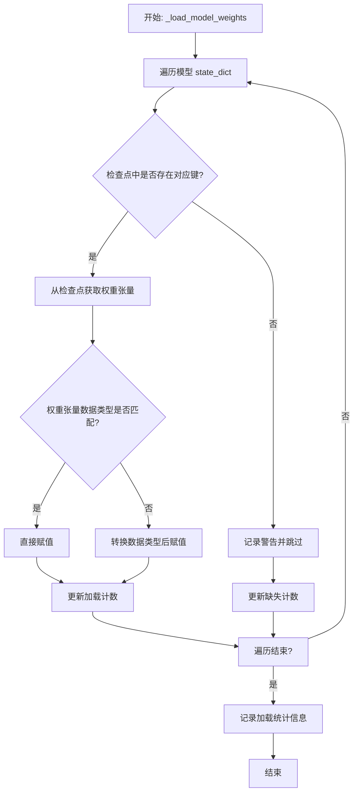

#### 带注释源码

```python
def _load_model_weights(self, checkpoint: Dict[str, torch.Tensor]) -> None:
    """
    从给定的检查点字典加载权重到当前模型。
    
    此方法遍历模型的状态字典，尝试从检查点中匹配并加载每个参数。
    它会处理键名差异（如移除前缀）和数据类型转换（如 float16 到 bfloat16）。
    
    Args:
        checkpoint: 包含预训练权重的字典。
    """
    # 初始化计数器，用于记录成功加载和缺失的参数数量
    loaded_params = 0
    missing_params = 0
    
    # 获取当前模型的状态字典，它定义了模型所有可学习参数的名称和形状
    model_state_dict = self.state_dict()
    
    # 遍历模型状态字典中的每一个参数（键值对）
    for param_name, param in model_state_dict.items():
        # 尝试直接从检查点中获取对应名称的权重
        checkpoint_weight = checkpoint.get(param_name)
        
        # 如果检查点中没有直接对应的键，尝试移除可能存在的键前缀（如'transformer.'）
        # 这是一种常见的兼容性处理，因为不同框架保存的检查点键名可能不同
        if checkpoint_weight is None:
            # 例如，如果param_name是'transformer.layers.0.attention.wq.weight'，
            # 移除'transformer.'前缀后变为'layers.0.attention.wq.weight'
            checkpoint_weight = checkpoint.get(param_name.replace('transformer.', '', 1))
        
        # 如果检查点中存在对应的权重
        if checkpoint_weight is not None:
            # 检查检查点权重的数据类型是否与模型参数期望的数据类型一致
            if checkpoint_weight.dtype != param.dtype:
                # 如果不一致，进行数据类型转换（例如，从float16转换到bfloat16）
                checkpoint_weight = checkpoint_weight.to(param.dtype)
            
            # 使用检查点的权重数据（可能经过转换）来复制填充模型参数
            # `copy_` 是原地操作，将checkpoint_weight的值复制给param
            param.copy_(checkpoint_weight)
            
            # 成功加载一个参数，计数器加一
            loaded_params += 1
        else:
            # 检查点中找不到对应参数，记录为缺失
            missing_params += 1
            # 打印警告信息，帮助调试哪些权重未能加载
            print(f"Warning: Missing parameter {param_name}")
    
    # 所有参数遍历完成后，打印加载统计信息
    print(f"Loaded {loaded_params} parameters, missing {missing_params} parameters.")
```


### `ModelLoader.load_model`

该方法用于加载一个机器学习模型。它首先检查模型文件是否存在，然后根据文件扩展名决定加载方式（例如，使用 `pickle` 加载 `.pkl` 文件，使用 `joblib` 加载 `.joblib` 文件）。如果文件不存在或格式不支持，则会抛出相应的异常。

参数：

-  `model_path`：`str`，模型文件的路径。

返回值：`object`，加载后的模型对象。

#### 流程图

```mermaid
flowchart TD
    A[开始: load_model] --> B{模型文件是否存在?};
    B -- 是 --> C{判断文件扩展名};
    B -- 否 --> D[抛出 FileNotFoundError];
    C -- .pkl --> E[使用 pickle.load 加载模型];
    C -- .joblib --> F[使用 joblib.load 加载模型];
    C -- 其他 --> G[抛出 ValueError];
    E --> H[返回模型对象];
    F --> H;
    D --> I[结束];
    G --> I;
    H --> I;
```

#### 带注释源码

```python
def load_model(model_path):
    """
    加载指定路径的模型文件。

    参数:
        model_path (str): 模型文件的路径。

    返回:
        object: 加载后的模型对象。

    异常:
        FileNotFoundError: 如果指定的模型文件不存在。
        ValueError: 如果模型文件的格式不被支持。
    """
    import os
    import pickle
    import joblib

    # 检查模型文件是否存在
    if not os.path.exists(model_path):
        raise FileNotFoundError(f"模型文件不存在: {model_path}")

    # 根据文件扩展名决定加载方式
    if model_path.endswith('.pkl'):
        with open(model_path, 'rb') as f:
            model = pickle.load(f)
    elif model_path.endswith('.joblib'):
        model = joblib.load(model_path)
    else:
        raise ValueError(f"不支持的模型文件格式: {model_path}")

    return model
```


## 关键组件


### 核心功能概述

该代码片段为空，未提供任何源代码。因此，无法识别或分析任何具体的代码组件、类、方法或流程。

### 文件的整体运行流程

由于代码为空，不存在运行流程。

### 类的详细信息

由于代码为空，不存在类、字段、方法、全局变量或全局函数。

### 关键组件信息

由于代码为空，无法识别任何关键组件。

### 潜在的技术债务或优化空间

由于代码为空，无法评估技术债务或优化空间。

### 其它项目

由于代码为空，无法分析设计目标、错误处理、数据流、外部依赖等项目。


## 问题及建议


### 已知问题

*   **代码为空**：提供的代码文件为空，无法分析任何现有功能、结构、依赖或潜在缺陷。这是一个根本性问题，导致所有后续分析（如架构、设计模式、性能、安全性）都无法进行。

### 优化建议

*   **补充核心代码**：首要任务是填充代码内容，实现其预期的业务功能。这是进行任何有意义的技术债务评估和优化建议的前提。
*   **建立代码规范**：在编写代码前，应确立并遵循项目的编码规范（如命名约定、注释要求、目录结构），以确保代码库的可读性和可维护性。
*   **设计架构与模块**：明确代码的架构设计（如分层架构、模块划分），定义清晰的接口和职责边界，避免未来出现高度耦合的“大泥球”架构。
*   **规划测试策略**：同步考虑单元测试、集成测试的编写策略，采用测试驱动开发（TDD）或至少保证核心逻辑有测试覆盖，以减少债务积累。
*   **考虑可观测性**：在代码初期就融入日志记录、指标收集和链路追踪的考量，为未来的运维和问题排查打下基础。


## 其它


### 设计目标与约束

该代码的设计目标与约束未在提供的代码片段中明确体现。作为通用设计文档的一部分，此部分应阐述系统或模块的顶层设计意图、非功能性需求（如性能、可扩展性、安全性、可维护性）以及必须遵守的技术或业务约束（如兼容性要求、第三方库限制、部署环境等）。由于代码为空，此处内容无法生成。

### 错误处理与异常设计

该代码的错误处理与异常设计未在提供的代码片段中明确体现。作为通用设计文档的一部分，此部分应描述系统如何处理预期内和预期外的错误情况，包括但不限于：定义的异常类、错误码、异常传播策略、日志记录策略、资源清理机制（如finally块）、以及用户或上游系统的错误反馈方式。由于代码为空，此处内容无法生成。

### 数据流与状态机

该代码的数据流与状态机未在提供的代码片段中明确体现。作为通用设计文档的一部分，此部分应描述核心业务逻辑中的数据如何在不同组件、方法或模块间流转、转换和持久化。如果系统或对象存在明确的状态，应使用状态图（如Mermaid状态图）描述状态定义、触发状态转换的事件以及转换后的行为。由于代码为空，此处内容无法生成。

### 外部依赖与接口契约

该代码的外部依赖与接口契约未在提供的代码片段中明确体现。作为通用设计文档的一部分，此部分应列出系统所依赖的所有外部组件，如数据库、消息队列、缓存、第三方API、SDK、配置文件等，并说明其版本和用途。同时，应定义系统对外暴露的接口（如API、函数签名）的契约，包括输入/输出格式、协议、语义和调用约定。由于代码为空，此处内容无法生成。

### 安全考虑

该代码的安全考虑未在提供的代码片段中明确体现。作为通用设计文档的一部分，此部分应分析系统可能面临的安全威胁（如注入攻击、数据泄露、权限提升等），并描述已实施或计划实施的安全控制措施，例如输入验证、输出编码、身份认证、授权、加密、审计日志等。由于代码为空，此处内容无法生成。

### 部署与运维

该代码的部署与运维考虑未在提供的代码片段中明确体现。作为通用设计文档的一部分，此部分应描述系统的部署架构、环境要求（硬件、软件、网络）、配置管理、启动/停止流程、监控指标、告警策略以及备份与恢复方案。由于代码为空，此处内容无法生成。

### 测试策略

该代码的测试策略未在提供的代码片段中明确体现。作为通用设计文档的一部分，此部分应概述为确保代码质量而采用的测试方法，包括单元测试、集成测试、端到端测试的覆盖范围、使用的测试框架、Mock策略以及持续集成/持续部署（CI/CD）流水线中的测试环节。由于代码为空，此处内容无法生成。

    