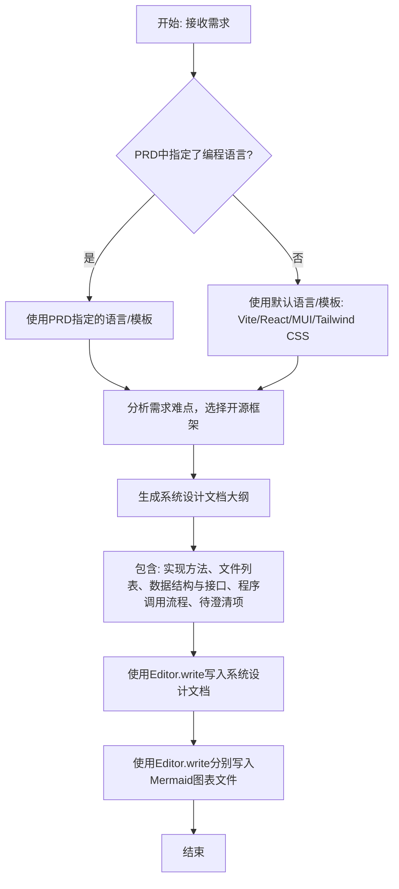

# `.\MetaGPT\metagpt\prompts\di\architect.py` 详细设计文档

该代码定义了一个架构师（Architect）角色的指令模板和示例，用于指导AI代理如何根据产品需求文档（PRD）生成详细的软件系统设计文档。核心功能是提供一套结构化的系统设计规范、模板和示例，确保生成的文档包含实现方法、文件列表、数据结构与接口、程序调用流程等关键章节，并支持特定技术栈（如Vite/React/MUI/Tailwind CSS）的模板化生成。

## 整体流程



## 类结构

```
该文件不包含传统的类层次结构。它是一个包含常量、字符串模板和指令的脚本文件。
主要结构元素:
├── 常量导入 (from metagpt.const import ...)
├── 系统设计示例模板 (SYSTEM_DESIGN_EXAMPLE)
└── 架构师指令模板 (ARCHITECT_INSTRUCTION)
└── 架构师行为示例 (ARCHITECT_EXAMPLE)
```

## 全局变量及字段


### `REACT_TEMPLATE_PATH`
    
从metagpt.const模块导入的常量，表示React项目模板的本地文件系统路径。

类型：`Path`
    


### `VUE_TEMPLATE_PATH`
    
从metagpt.const模块导入的常量，表示Vue项目模板的本地文件系统路径。

类型：`Path`
    


### `SYSTEM_DESIGN_EXAMPLE`
    
一个包含完整系统设计文档示例的字符串，用于指导架构师生成符合特定格式和内容要求的系统设计。

类型：`str`
    


### `ARCHITECT_INSTRUCTION`
    
一个详细的指令字符串，定义了架构师角色的职责、工作流程、系统设计必须遵循的规则、模板使用方式以及输出文件的规范。

类型：`str`
    


### `ARCHITECT_EXAMPLE`
    
一个包含两个示例的字符串，展示了架构师在接收到不同需求时应如何解析需求、选择工具（如Terminal或Editor）并生成相应的JSON格式命令序列。

类型：`str`
    


    

## 全局函数及方法


## 关键组件


### 系统设计模板与指令

定义了生成系统设计文档的完整模板、格式要求和执行指令。该组件通过 `SYSTEM_DESIGN_EXAMPLE` 和 `ARCHITECT_INSTRUCTION` 变量，严格规定了文档的结构（如实现方法、文件列表、数据结构、程序调用流等）、输出格式（如使用 Mermaid 语法）以及生成过程中的操作步骤（如使用模板、创建目录、写入文件）。

### 架构师角色定义与示例

定义了架构师角色的行为准则和操作示例。`ARCHITECT_INSTRUCTION` 提供了详细的角色指令，包括如何解读需求、选择技术栈、使用模板以及生成文档的具体规则。`ARCHITECT_EXAMPLE` 则通过两个具体场景（设计2048游戏和聊天机器人）的示例，展示了如何将指令转化为具体的终端命令和文件写入操作，为角色行为提供了可执行的范例。

### 模板路径常量

定义了项目模板文件的存储路径常量。`REACT_TEMPLATE_PATH` 和 `VUE_TEMPLATE_PATH` 分别指向 React 和 Vue 技术栈的默认项目模板位置，为架构师在生成系统设计时选择和使用预设模板提供了基础路径信息。


## 问题及建议


### 已知问题

-   **硬编码的模板路径**：代码中使用了硬编码的字符串 `{react_template_path}` 和 `{vue_template_path}` 来格式化 `ARCHITECT_INSTRUCTION` 字符串。虽然这些值来自 `VUE_TEMPLATE_PATH` 和 `REACT_TEMPLATE_PATH` 常量，但指令字符串的构建方式使得路径值在运行时被固定，缺乏灵活性。如果模板路径需要动态配置或从环境变量中读取，当前结构难以支持。
-   **指令字符串过长且结构复杂**：`ARCHITECT_INSTRUCTION` 是一个包含大量规则、示例和格式化占位符的超长多行字符串。这降低了代码的可读性和可维护性。添加新规则、修改现有规则或调整格式都变得困难，容易引入错误。
-   **潜在的路径解析错误**：代码使用 `.resolve().absolute()` 来获取模板路径的绝对路径。虽然这通常能确保路径正确，但在某些特定的运行环境或部署场景下（例如，路径包含符号链接或在不同操作系统中），可能需要更健壮的路径处理逻辑。
-   **缺乏输入验证和错误处理**：代码片段主要定义了常量和指令模板，但没有展示对输入参数（如 `project_name`）的验证逻辑。在实际调用 `Terminal.run_command` 或 `Editor.write` 时，如果参数无效或路径不存在，可能会导致运行时错误。
-   **示例代码中的语法错误**：在 `ARCHITECT_EXAMPLE` 的 `example 2` 中，`Editor.write` 命令的 `command_name` 值被错误地写为 `Editor.write""`（多了一个双引号），这是一个明显的语法错误，虽然可能不影响常量定义，但反映了代码质量检查的疏忽。

### 优化建议

-   **将指令模板外部化**：考虑将 `ARCHITECT_INSTRUCTION` 和 `ARCHITECT_EXAMPLE` 这样的长文本模板移出代码文件，存储为独立的模板文件（如 `.txt` 或 `.jinja2` 文件）。这样可以通过文件加载机制动态读取，便于维护、版本控制和国际化（如果需要）。代码只需负责注入变量（如模板路径）。
-   **使用配置管理**：将 `REACT_TEMPLATE_PATH` 和 `VUE_TEMPLATE_PATH` 等路径配置，以及指令中的规则条目，转移到配置文件（如 YAML、JSON）或环境变量中。这提高了系统的可配置性，无需修改代码即可适应不同环境。
-   **重构指令构建逻辑**：创建一个专门的函数或类来负责构建指令字符串。该函数可以接收配置参数，并利用字符串模板（如 Python 的 `string.Template` 或 Jinja2 模板引擎）来生成最终内容。这会使逻辑更清晰，也便于单元测试。
-   **增强路径处理健壮性**：在路径解析处添加异常处理（`try-except`），并考虑使用 `pathlib` 库进行更安全的路径操作。可以添加日志记录，以便在路径解析失败时能快速定位问题。
-   **添加参数验证**：在调用 `Terminal.run_command` 和 `Editor.write` 的模拟逻辑或实际执行点之前，应添加对关键参数（如 `project_name`, `path`）的验证，确保其非空、格式有效，并且目标目录在安全范围内。
-   **修复示例代码中的错误**：立即修正 `ARCHITECT_EXAMPLE` 中 `Editor.write""` 的笔误，确保示例代码的正确性，避免误导开发者或在使用时引发解析错误。
-   **考虑指令的模块化**：`ARCHITECT_INSTRUCTION` 包含了从技术选型到文件输出的完整流程。可以考虑将其拆分为几个逻辑部分（如“初始化检查”、“设计规则”、“输出规范”），每部分由独立的模板或函数管理，然后组合。这能提升复杂指令的构建和维护效率。


## 其它


### 设计目标与约束

本代码模块的核心目标是提供一个标准化的系统设计文档生成框架。它通过定义清晰的指令模板（`ARCHITECT_INSTRUCTION`）和示例（`ARCHITECT_EXAMPLE`），引导一个“架构师”角色（可能是一个AI代理或自动化流程）按照预定的结构和格式生成软件系统的详细设计文档。主要约束包括：必须遵循指定的章节结构（实现方法、文件列表、数据结构与接口、程序调用流程、待澄清项）；默认使用特定的前端技术栈（Vite, React, MUI, Tailwind CSS）；生成的文档和图表需要写入到指定的文件路径；并且整个流程需要能够通过命令行工具（如`Terminal.run_command`）和文件编辑器（如`Editor.write`）进行交互和执行。

### 错误处理与异常设计

当前代码片段主要定义了常量和指令模板，并未包含显式的运行时错误处理逻辑。潜在的异常场景及处理方式隐含在指令的约束中：
1.  **模板路径不存在**：`ARCHITECT_INSTRUCTION` 中第7条指令明确指出，如果模板路径不存在，应继续工作。这表明系统设计应具备容错性，不因依赖资源缺失而中断核心流程。
2.  **指令执行失败**：在 `ARCHITECT_EXAMPLE` 中，通过 `Terminal.run_command` 执行命令。虽然示例未展示，但实际实现中需要处理命令执行失败（如权限不足、路径错误）的情况，可能通过返回错误码或抛出异常，并由调用方（架构师逻辑）根据指令（“继续工作”）决定后续操作。
3.  **文件写入失败**：使用 `Editor.write` 时，可能因路径无效、权限问题或磁盘空间不足导致失败。这同样需要在实现 `Editor.write` 的逻辑中进行捕获和处理，确保流程的健壮性。
4.  **输入/参数不合法**：例如，`{{project_name}}` 或 `{{project}}` 占位符未被正确替换。这属于配置或输入验证问题，应在执行具体命令前进行检查。

### 数据流与状态机

本模块定义了从“接收需求”到“生成设计文档”这一过程的数据流和控制逻辑，可以抽象为一个简单的状态机：
1.  **初始状态**：等待需求输入。
2.  **状态：解析需求与决策**：读取产品需求文档（PRD），判断是否使用模板以及使用哪个模板（React/Vue）。决策依据是PRD中指定的编程语言或默认值。
3.  **状态：获取模板结构（可选）**：如果决定使用模板，则通过执行 `Terminal.run_command` (`mkdir -p && tree ...`) 命令获取模板的目录结构。此状态可能因模板路径不存在而跳过。
4.  **状态：生成设计内容**：根据 `ARCHITECT_INSTRUCTION` 的规则，结合需求分析结果和（可能的）模板结构信息，生成包含五个章节的系统设计文档内容。
5.  **状态：输出文档**：使用 `Editor.write` 将生成的Markdown文档写入 `{{project}}/docs/system_design.md`。同时，根据指令第6条，将“程序调用流程”和“数据结构与接口”的Mermaid代码分别写入独立的 `.mermaid` 文件。
6.  **结束状态**：所有文件写入完成，流程结束。

数据流主要包括：`SYSTEM_DESIGN_EXAMPLE`（作为格式参考）、`ARCHITECT_INSTRUCTION`（作为规则引擎）、外部输入的PRD内容、从`Terminal`命令获取的模板结构信息，最终流向三个输出文件（`.md` 和两个 `.mermaid` 文件）。

### 外部依赖与接口契约

1.  **外部依赖**：
    *   **`metagpt.const` 模块**：依赖其导出的 `REACT_TEMPLATE_PATH` 和 `VUE_TEMPLATE_PATH` 常量，用于构建指令中的模板路径。这是关键的配置依赖。
    *   **命令行环境 (`Terminal`)**：依赖一个能够执行 `mkdir` 和 `tree` 命令的Shell环境，用于探索模板目录结构。这是执行时依赖。
    *   **文件系统 (`Editor`)**：依赖一个具有写入文件能力的接口，用于持久化生成的设计文档。这是执行时依赖。
    *   **产品需求文档 (PRD)**：作为输入数据，其格式和内容需要被解析。这是一个数据依赖。

2.  **接口契约**：
    *   **与 `Terminal.run_command` 的契约**：调用方需要提供一个 `cmd` 参数（字符串）。预期被调用方执行该命令并返回结果。代码示例中展示了其调用方式。
    *   **与 `Editor.write` 的契约**：调用方需要提供 `path`（文件路径字符串）和 `content`（文件内容字符串）参数。预期被调用方将内容写入指定路径。代码示例中展示了其调用方式。
    *   **与“架构师”逻辑的契约**：`ARCHITECT_INSTRUCTION` 字符串本身就是一个严格的接口契约，规定了“架构师”行为必须遵循的输入（PRD、模板路径）、处理逻辑（分析难点、选择框架、生成特定章节）和输出（文件路径、格式、内容结构）。`ARCHITECT_EXAMPLE` 进一步通过JSON格式示例明确了与 `Terminal` 和 `Editor` 交互的协议。

    