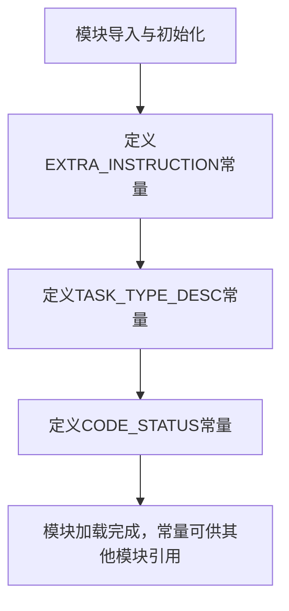

# `.\MetaGPT\metagpt\prompts\di\data_analyst.py` 详细设计文档

该代码文件定义了一个任务执行系统的配置和指令集。它通过一个全局常量字符串 `EXTRA_INSTRUCTION` 提供了针对不同任务类型（如网页任务、文档处理、代码执行等）的详细操作指南和最佳实践。同时，它利用 `TaskType` 枚举动态生成任务类型描述，并定义了一个用于格式化代码执行状态报告的模板字符串 `CODE_STATUS`。

## 整体流程



## 类结构

```
无显式类定义
├── 全局常量
│   ├── EXTRA_INSTRUCTION
│   ├── TASK_TYPE_DESC
│   └── CODE_STATUS
└── 导入的外部类
    └── TaskType (来自 metagpt.strategy.task_type)
```

## 全局变量及字段


### `EXTRA_INSTRUCTION`
    
一个包含额外操作指令的多行字符串，用于指导AI代理如何根据任务类型选择合适的工具（如SearchEnhancedQA、Browser、DataAnalyst）并遵循特定的工作流程（如规划、文档读取、任务完成）。

类型：`str`
    


### `TASK_TYPE_DESC`
    
一个通过遍历TaskType枚举生成的格式化字符串，用于描述系统中定义的各种任务类型及其说明。

类型：`str`
    


### `CODE_STATUS`
    
一个用于格式化代码执行状态报告的多行字符串模板，包含代码内容、执行状态和执行结果三个占位符。

类型：`str`
    


    

## 全局函数及方法


## 关键组件


### 任务类型定义与描述

定义了任务类型枚举及其描述，用于在系统中对不同类型的任务进行分类和指导。

### 额外指令集

包含一系列针对特定任务（如网页任务、文档处理、任务规划与结束）的详细操作指令和约束条件，用于指导AI代理的行为。

### 代码执行状态模板

提供了一个格式化字符串模板，用于统一展示代码执行后的状态、结果等信息。


## 问题及建议


### 已知问题

-   **常量定义与业务逻辑耦合**：`EXTRA_INSTRUCTION` 常量包含了大量具体的、面向特定工具（如 `SearchEnhancedQA`, `Browser`, `DataAnalyst`）和特定操作流程（如处理文档、结束任务）的业务规则。这导致常量内容冗长、易变，且与核心的 `TaskType` 枚举定义分离，降低了代码的可维护性和清晰度。
-   **硬编码的格式化字符串**：`CODE_STATUS` 字符串模板直接硬编码了展示格式。如果展示需求发生变化（例如，需要添加更多执行上下文信息或改变排版），需要直接修改源代码，违反了开闭原则。
-   **枚举描述生成逻辑内联**：`TASK_TYPE_DESC` 的生成逻辑（使用列表推导式拼接字符串）直接写在模块顶层。虽然当前简单，但如果描述格式需要复杂处理（如国际化、多行格式化），此处将变得难以扩展和维护。
-   **缺乏输入验证与错误处理**：`TASK_TYPE_DESC` 的生成依赖于 `TaskType` 枚举的 `type_name` 和 `value.desc` 属性。如果 `TaskType` 的结构发生变化或某些枚举值缺少必要属性，此处的字符串生成可能会失败或产生错误输出，但当前代码没有相应的防御性检查或异常处理。

### 优化建议

-   **将业务指令重构为配置或策略类**：建议将 `EXTRA_INSTRUCTION` 中的具体业务规则抽离。可以创建一个专门的配置类（如 `TaskHandlingPolicy`）或一组策略函数来管理不同任务类型（`TaskType`）对应的工具选择和执行流程。这样可以将易变的业务逻辑与稳定的常量/枚举定义解耦，并通过代码结构更清晰地表达规则。
-   **使用模板引擎或配置化格式化**：对于 `CODE_STATUS` 这类展示模板，建议将其移至外部配置文件（如 YAML、JSON）或使用 Python 的 `string.Template`、`str.format` 映射字典等更灵活的方式管理。这样可以实现展示逻辑与业务逻辑的分离，便于非开发人员修改和进行多环境配置。
-   **封装枚举描述生成逻辑**：为 `TaskType` 枚举类增加一个类方法（如 `get_formatted_descriptions()`）来负责生成格式化的描述字符串。这样可以将描述生成的逻辑封装在枚举自身内部，提高内聚性。当描述格式需要调整时，只需修改该方法，而不必改动使用该描述的模块代码。
-   **增加健壮性检查**：在生成 `TASK_TYPE_DESC` 或类似动态内容时，添加简单的校验逻辑。例如，在遍历 `TaskType` 前，可以检查其成员是否具备所需的属性，或在格式化时使用 `getattr` 并提供默认值，防止因枚举定义不完整导致的运行时错误。


## 其它


### 设计目标与约束

本代码模块的核心设计目标是提供一个清晰、结构化的任务执行指导框架，用于规范AI代理在处理不同类型任务（特别是Web相关任务）时的行为逻辑。其约束条件包括：必须与`metagpt.strategy.task_type`模块定义的`TaskType`枚举紧密集成；指令文本需要保持清晰、无歧义，以指导AI代理的决策；代码状态模板需要提供标准化的输出格式，便于结果解析和日志记录。

### 错误处理与异常设计

当前代码模块本身不包含直接的错误处理或异常抛出逻辑。它主要定义了静态的字符串常量和模板。潜在的异常可能来源于：
1.  **模板格式化错误**：`CODE_STATUS`模板字符串在使用`format`方法时，如果传入的参数字典缺少`code`、`status`或`result`键，将引发`KeyError`。
2.  **外部依赖错误**：`TASK_TYPE_DESC`的生成依赖于`TaskType`枚举及其成员的`type_name`和`value.desc`属性。如果`TaskType`枚举结构发生变化或导入失败，将导致`AttributeError`或`ImportError`。

模块的设计将错误处理的责任委托给了使用这些常量和模板的上层调用者。

### 数据流与状态机

本模块不定义动态的数据流或复杂的状态机。它提供的是静态的配置和描述信息：
*   **数据定义**：`EXTRA_INSTRUCTION`、`TASK_TYPE_DESC`、`CODE_STATUS`作为常量被定义。
*   **数据生成**：`TASK_TYPE_DESC`在模块加载时通过列表推导式和字符串拼接动态生成，其内容来源于`TaskType`枚举。
*   **数据消费**：这些常量预计被其他模块（如任务规划器、代理执行器）读取，用于指导AI行为或格式化输出。`CODE_STATUS`模板在使用时会被填充动态的执行结果数据。

### 外部依赖与接口契约

1.  **外部依赖**：
    *   `metagpt.strategy.task_type.TaskType`：这是核心外部依赖。模块通过导入此枚举来获取所有任务类型的定义，用于生成`TASK_TYPE_DESC`。
2.  **接口契约**：
    *   对`TaskType`枚举的契约：假设每个`TaskType`枚举成员都具有`type_name`（字符串类型）和`value.desc`（字符串类型）属性。模块的`TASK_TYPE_DESC`生成逻辑依赖于这个隐式契约。
    *   对下游调用者的契约：`CODE_STATUS`模板定义了一个明确的格式化接口，调用者必须提供一个包含`code`、`status`、`result`三个键的字典来填充该模板，否则会引发格式化错误。

    