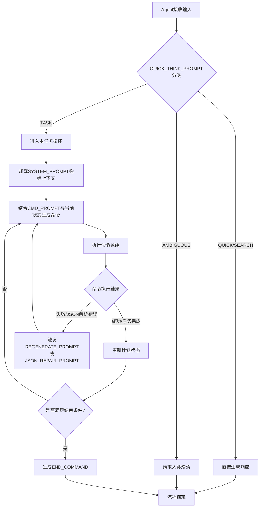

# `.\MetaGPT\metagpt\prompts\di\role_zero.py` 详细设计文档

该文件定义了一系列用于构建和指导AI Agent（特别是RoleZero角色）决策与行动流程的提示词模板和常量。它通过结构化的系统提示、指令和示例，引导Agent进行任务规划、命令执行、状态评估、异常处理以及与人类用户的交互。核心功能是提供一个可配置的、基于上下文的指令框架，使Agent能够理解复杂任务、管理计划、使用工具并生成符合特定格式的响应。

## 整体流程



## 类结构

```
提示词与常量定义 (非面向对象类结构)
├── 角色核心指令 (ROLE_INSTRUCTION)
├── 系统提示模板 (SYSTEM_PROMPT)
├── 命令生成提示模板 (CMD_PROMPT)
│   ├── 经验掩码 (CMD_EXPERIENCE_MASK)
│   └── 思维指导 (THOUGHT_GUIDANCE)
├── 重生成提示 (REGENERATE_PROMPT)
├── 快速思考模块
│   ├── 系统提示 (QUICK_THINK_SYSTEM_PROMPT)
│   ├── 用户提示 (QUICK_THINK_PROMPT)
│   ├── 示例 (QUICK_THINK_EXAMPLES)
│   └── 快速响应系统提示 (QUICK_RESPONSE_SYSTEM_PROMPT)
├── 人类交互模块
│   ├── 报告提示 (REPORT_TO_HUMAN_PROMPT)
│   ├── 总结提示 (SUMMARY_PROMPT)
│   ├── 重复问题总结 (SUMMARY_PROBLEM_WHEN_DUPLICATE)
│   └── 求助格式 (ASK_HUMAN_GUIDANCE_FORMAT)
└── 工具与辅助
    ├── JSON修复提示 (JSON_REPAIR_PROMPT)
    ├── 语言检测提示 (DETECT_LANGUAGE_PROMPT)
    ├── 结束命令模板 (END_COMMAND)
    └── 预定义求助命令 (ASK_HUMAN_COMMAND)
```

## 全局变量及字段


### `EXPERIENCE_MASK`
    
从metagpt.const导入的常量，用于在提示词中标记经验部分。

类型：`str`
    


### `ROLE_INSTRUCTION`
    
角色指令，指导AI如何基于上下文创建、修改和执行任务计划。

类型：`str`
    


### `SYSTEM_PROMPT`
    
系统级提示词模板，定义了AI角色的基本信息、数据结构、可用命令和指令。

类型：`str`
    


### `CMD_EXPERIENCE_MASK`
    
命令提示词的经验部分，用于在命令执行上下文中插入历史经验。

类型：`str`
    


### `CMD_PROMPT`
    
完整的命令提示词，组合了经验、当前状态、计划、任务等信息，指导AI生成具体的命令序列。

类型：`str`
    


### `THOUGHT_GUIDANCE`
    
思维引导，为AI在生成命令前提供结构化的思考步骤。

类型：`str`
    


### `REGENERATE_PROMPT`
    
重新生成提示词，用于在AI遇到问题或需要反思时，引导其提供不同的响应。

类型：`str`
    


### `END_COMMAND`
    
预定义的结束命令JSON，用于指示AI停止执行。

类型：`str`
    


### `SUMMARY_PROBLEM_WHEN_DUPLICATE`
    
当遇到重复命令问题时，用于引导AI直接描述问题的提示词模板。

类型：`str`
    


### `ASK_HUMAN_GUIDANCE_FORMAT`
    
向人类寻求指导时使用的消息格式模板。

类型：`str`
    


### `ASK_HUMAN_COMMAND`
    
预定义的向人类提问的命令列表。

类型：`list[dict]`
    


### `JSON_REPAIR_PROMPT`
    
JSON修复提示词，用于引导AI检查和修复格式错误的JSON数据。

类型：`str`
    


### `QUICK_THINK_SYSTEM_PROMPT`
    
快速思考（意图分类）的系统提示词模板，用于定义角色和分类规则。

类型：`str`
    


### `QUICK_THINK_PROMPT`
    
快速思考（意图分类）的用户提示词，指导AI对用户请求进行分类。

类型：`str`
    


### `QUICK_THINK_EXAMPLES`
    
快速思考（意图分类）的示例，帮助AI理解如何对不同类型的请求进行分类。

类型：`str`
    


### `QUICK_RESPONSE_SYSTEM_PROMPT`
    
快速响应（直接回答）的系统提示词，指示AI直接响应用户而不调用团队。

类型：`str`
    


### `QUICK_THINK_TAG`
    
用于标记由快速思考流程产生的消息的标签。

类型：`str`
    


### `REPORT_TO_HUMAN_PROMPT`
    
向人类报告进度或结果的提示词模板。

类型：`str`
    


### `SUMMARY_PROMPT`
    
总结提示词，用于引导AI简洁地总结近期完成的工作和产出。

类型：`str`
    


### `DETECT_LANGUAGE_PROMPT`
    
检测响应语言的提示词模板，用于确定AI应以何种自然语言进行回复。

类型：`str`
    


### `Task.task_id`
    
任务的唯一标识符。

类型：`str`
    


### `Task.dependent_task_ids`
    
当前任务所依赖的其他任务的ID列表。

类型：`list[str]`
    


### `Task.instruction`
    
任务的详细指令或描述。

类型：`str`
    


### `Task.task_type`
    
任务的类型，用于分类和分配。

类型：`str`
    


### `Task.assignee`
    
被分配执行此任务的角色或实体。

类型：`str`
    
    

## 全局函数及方法


## 关键组件


### 系统提示模板 (SYSTEM_PROMPT)

定义了构建系统提示的核心模板，用于向AI代理提供角色信息、可用数据结构、任务类型、命令和示例，是驱动代理决策和行动的基础指令框架。

### 命令执行提示模板 (CMD_PROMPT)

定义了AI代理在每次行动周期中接收的具体上下文和指令，整合了过往经验、当前工具状态、计划状态、当前任务等信息，并严格规定了包含思考过程和命令JSON数组的输出格式。

### 思考引导 (THOUGHT_GUIDANCE)

为AI代理提供了一个结构化的思考框架，引导其按步骤回顾近期行动、分析消息、评估计划状态、判断是否需要人工交互或终止，旨在提升代理决策的逻辑性和可控性。

### 快速思考分类器 (QUICK_THINK_SYSTEM_PROMPT / QUICK_THINK_PROMPT)

一个用于预判用户请求意图的分类系统。它将请求分为QUICK（直接回答）、SEARCH（需搜索）、TASK（需执行多步任务）和AMBIGUOUS（信息不足）四类，以决定后续处理流程（如直接响应或启动任务规划）。

### 报告生成模板 (REPORT_TO_HUMAN_PROMPT)

定义了当AI代理完成任务后，向用户报告进展和成果时应遵循的格式和内容要求，强调简洁、包含可交付成果描述并使用指定语言。

### JSON修复提示 (JSON_REPAIR_PROMPT)

当AI代理输出的命令JSON格式错误时，用于引导系统或另一个模型修复JSON数据，确保其能被正确解析，是错误恢复机制的一部分。

### 重复问题总结提示 (SUMMARY_PROBLEM_WHEN_DUPLICATE)

当检测到代理陷入重复命令循环时，用于引导代理直接陈述其遇到的困惑或问题，以便人类介入提供指导，是防止死循环的干预机制。

### 请求语言检测提示 (DETECT_LANGUAGE_PROMPT)

用于分析用户需求，确定AI代理在最终回复中应使用的自然语言类型。


## 问题及建议


### 已知问题

-   **硬编码与配置分散**：大量提示词模板（如 `ROLE_INSTRUCTION`, `SYSTEM_PROMPT`, `CMD_PROMPT` 等）以字符串字面量形式硬编码在代码中，导致维护困难、复用性差，且难以进行国际化或根据不同环境调整。
-   **字符串模板拼接复杂**：`CMD_PROMPT` 等长提示词由多个字符串片段（如 `CMD_EXPERIENCE_MASK`）拼接而成，结构不清晰，容易在修改时引入错误，且难以追踪各部分的来源和用途。
-   **魔法字符串与命令耦合**：代码中存在多处魔法字符串（如 `"end"`, `"RoleZero.ask_human"`, `"Plan.finish_current_task"`），这些字符串与具体的类和方法名紧密耦合。一旦后端实现变更，需要同步修改所有相关字符串，容易遗漏。
-   **JSON 输出格式约束严格且易错**：`CMD_PROMPT` 中对 AI 响应的 JSON 格式要求极其严格（如必须以 **```json [** 开头），并提供了 `JSON_REPAIR_PROMPT` 用于修复格式错误。这表明当前流程对模型输出的格式稳定性处理不足，依赖事后修复，增加了复杂性和失败风险。
-   **逻辑流程依赖文本指令**：核心的工作流控制（如何时结束任务、何时请求帮助）通过 `ROLE_INSTRUCTION` 和 `THOUGHT_GUIDANCE` 等自然语言指令传递给 AI 模型执行，而非在代码中通过明确的状态机或业务逻辑实现。这导致流程控制不可靠、难以调试，且严重依赖模型的指令遵循能力。
-   **重复与冗余的提示词**：`THOUGHT_GUIDANCE` 中的部分指导原则（如关注用户消息、使用 `RoleZero.reply_to_human` 报告进度）与 `ROLE_INSTRUCTION` 和 `CMD_PROMPT` 中的内容存在重复，增加了维护负担和潜在的不一致风险。
-   **快速思考（Quick Think）分类逻辑可能模糊**：`QUICK_THINK_PROMPT` 和 `QUICK_THINK_EXAMPLES` 定义的分类规则（如 QUICK 与 TASK 的边界）存在主观判断空间，例如“如何设计一个平台”被归类为 QUICK，而类似的“构建一个网站”被归类为 TASK，可能导致分类结果不稳定。

### 优化建议

-   **将提示词外部化与模块化**：将所有提示词模板移出代码，存储到配置文件（如 YAML、JSON）或专用模板文件中。可以按功能模块（如系统指令、命令生成、错误修复）进行组织，并通过键名引用。这便于集中管理、版本控制和多语言支持。
-   **使用模板引擎或构建器模式**：替代当前的字符串拼接方式，使用成熟的模板引擎（如 Jinja2）或自定义的提示词构建器类来动态生成提示词。这可以提高可读性、减少拼接错误，并支持条件逻辑和变量注入。
-   **定义命令枚举或常量类**：创建一个包含所有有效命令名的枚举（Enum）或常量类。在代码和配置中引用这些常量，而非字符串字面量。这样可以在编译或启动时检查有效性，并在命令变更时只需修改一处。
-   **强化输出解析与容错机制**：在解析 AI 响应时，采用更健壮的解析策略。例如，使用正则表达式提取 JSON 块，而不是依赖固定的前缀；在解析失败时，可以尝试多种修复策略（如修复括号、引号），而不仅仅是依赖另一个 AI 调用（`JSON_REPAIR_PROMPT`），后者成本高且不稳定。
-   **将业务流程内化为代码逻辑**：将 `ROLE_INSTRUCTION` 和 `THOUGHT_GUIDANCE` 中描述的核心决策逻辑（如“任务完成判断”、“何时请求人类帮助”）提取出来，在应用程序层面实现为明确的状态机、规则引擎或策略模式。让 AI 负责执行具体动作，而非流程控制。这能大幅提高系统的确定性和可测试性。
-   **重构并合并提示词**：审查所有提示词，消除重复内容。可以创建一个主提示词骨架，将通用的指导原则（如响应语言、命令格式要求）作为基础部分，再根据具体场景（如创建计划、执行任务、快速响应）注入特定的指令块。
-   **明确并优化分类规则**：重新审视 `QUICK_THINK_SYSTEM_PROMPT` 中的分类标准，提供更清晰、更具操作性的定义和更多边界案例。考虑是否可以通过规则引擎或基于关键词的简单分类器来辅助或替代 AI 分类，以提高速度和一致性。


## 其它


### 设计目标与约束

本代码模块的核心设计目标是构建一个用于驱动智能体（Agent）进行任务规划和执行的提示词（Prompt）生成系统。它通过一系列精心设计的模板和常量，为大型语言模型（LLM）提供结构化的上下文、指令和输出格式约束，引导其完成从意图识别、任务分解、计划制定、工具调用到状态报告的全流程。主要约束包括：1) **输出格式强约束**：要求LLM的响应必须严格遵循指定的JSON数组格式，以确保下游系统能够可靠地解析和执行命令。2) **流程控制**：通过提示词逻辑强制智能体遵循特定的状态检查和动作序列（如完成任务后必须显式调用`Plan.finish_current_task`）。3) **上下文管理**：需要动态填充大量变量（如`{role_info}`, `{plan_status}`）以构建完整的系统提示，对上下文组装逻辑的可靠性要求高。4) **防循环与错误处理**：内置了针对重复命令、JSON解析失败等情况的专用提示词（如`REGENERATE_PROMPT`, `JSON_REPAIR_PROMPT`），以提升系统鲁棒性。

### 错误处理与异常设计

该模块通过预定义的提示词模板来引导LLM进行自我检查和错误恢复，是一种“提示词驱动”的错误处理机制。
1.  **重复动作检测与处理**：当系统检测到智能体可能陷入循环时，会使用`SUMMARY_PROBLEM_WHEN_DUPLICATE`和`ASK_HUMAN_GUIDANCE_FORMAT`模板引导其直接向人类求助，并禁止输出命令。
2.  **响应再生机制**：当LLM的输出不符合预期时，可使用`REGENERATE_PROMPT`要求其反思历史并生成不同的响应，明确禁止输出相同的命令。
3.  **JSON格式修复**：专门设计了`JSON_REPAIR_PROMPT`用于在LLM输出JSON格式错误时，请求另一个LLM（或自身）对JSON数据进行修复和重新格式化，确保其可被`json.loads()`解析。
4.  **模糊请求处理**：通过`QUICK_THINK_SYSTEM_PROMPT`和`QUICK_THINK_PROMPT`对用户请求进行意图分类。将`AMBIGUOUS`类请求识别出来，这本身是一种前置的错误预防，避免智能体在不明确的需求下执行错误动作。
5.  **终止条件**：在`THOUGHT_GUIDANCE`和`REGENERATE_PROMPT`中明确规定了使用`end`命令终止执行的条件（如完成所有需求、任务列表为空），为流程提供了明确的出口。

### 数据流与状态机

本模块定义了智能体核心决策循环中的数据流和隐式状态机。
1.  **数据流**：
    *   **输入**：外部系统提供的动态上下文变量，包括角色信息(`role_info`)、当前状态(`current_state`)、计划状态(`plan_status`)、当前任务(`current_task`)、最新观察(`latest_observation`)等。
    *   **处理**：这些变量被注入到相应的提示词模板（如`SYSTEM_PROMPT`, `CMD_PROMPT`）中，组合成完整的提示词发送给LLM。
    *   **输出**：LLM被期望输出一个包含`Thought`文本和一个JSON命令数组的响应。该命令数组是核心输出，用于驱动外部系统执行具体操作（如修改计划、调用工具、回复人类）。
2.  **隐式状态机**：提示词逻辑引导智能体在以下状态间转换：
    *   **意图识别(QuickThink)**：根据`QUICK_THINK_PROMPT`判断请求类型，决定进入快速回答、搜索、任务执行或澄清流程。
    *   **任务规划与状态评估**：在`CMD_PROMPT`阶段，智能体需评估`Current Plan`和`Current Task`。状态包括：`无任务`、`有任务未开始`、`任务进行中`、`任务已完成`。
    *   **动作执行**：根据状态评估结果，输出相应的命令来改变状态：`Plan.append_task`（创建任务）、`Plan.finish_current_task`（推进任务）、工具调用（执行任务）、`RoleZero.reply_to_human`（报告状态）。
    *   **异常/求助状态**：当遇到错误或不确定时，通过`RoleZero.ask_human`命令转入等待人工输入状态。
    *   **终止状态**：输出`end`命令，结束循环。

### 外部依赖与接口契约

1.  **外部依赖**：
    *   **大型语言模型(LLM)**：核心依赖，负责理解所有提示词并生成结构化响应。其性能直接影响任务分解、规划和质量。
    *   **`metagpt.const`模块**：依赖`EXPERIENCE_MASK`常量，用于在提示词中嵌入过去的经验或掩码信息。
    *   **`BaseModel`（可能来自Pydantic）**：`SYSTEM_PROMPT`中引用了`Task`类，暗示外部系统需提供此数据模型的定义，用于示例和上下文理解。
2.  **接口契约**：
    *   **提示词变量注入契约**：调用方必须按照模板定义（如`{plan_status}`, `{current_task}`）提供所有必要的上下文变量，否则会导致提示词不完整。
    *   **LLM输出格式契约**：LLM必须返回一个JSON数组，其中每个对象包含`command_name`和`args`键。`command_name`必须对应外部系统实际可执行的类方法或函数名（如`Plan.finish_current_task`, `RoleZero.ask_human`）。
    *   **命令执行环境契约**：代码中提到的所有命令（如`Editor.insert_content_at_line`）都必须在智能体运行环境中存在对应的实现，否则命令会执行失败。
    *   **`QUICK_THINK_TAG`标记契约**：该常量用于标记由快速思考流程产生的消息，下游系统需要识别此标记以进行特殊处理或路由。

### 安全与合规考虑

1.  **指令注入风险**：提示词模板中包含了来自外部的动态变量（如`{role_info}`, `{instruction}`）。如果这些变量内容被恶意构造，可能引导LLM执行非预期的危险操作（如删除文件、访问敏感数据）。需要对注入的上下文进行严格的过滤和验证。
2.  **工具滥用控制**：`available_commands`列表定义了智能体可用的所有操作。必须确保该列表是经过最小权限原则筛选的，避免包含高危命令。同时，在`CMD_PROMPT`中通过规则限制某些命令的重复使用（如禁止多次使用`Editor.insert_content_at_line`），是一种安全约束。
3.  **人类监督机制**：设计了明确的求助路径（`RoleZero.ask_human`）和报告路径（`RoleZero.reply_to_human`），确保关键节点和异常情况有人类参与决策，符合合规中对高风险AI系统的人工监督要求。
4.  **数据泄露**：`SUMMARY_PROMPT`要求总结产出物时包含文件路径和URL。在总结和报告过程中，需注意避免泄露系统内部敏感路径或未授权的外部资源信息。
5.  **语言与内容合规**：`DETECT_LANGUAGE_PROMPT`和`REPORT_TO_HUMAN_PROMPT`中要求响应使用特定语言(`{respond_language}`)。这可用于确保输出内容符合地区法律法规和内容审核要求。同时，所有引导LLM生成的文本内容都应符合相关的内容安全政策。


    