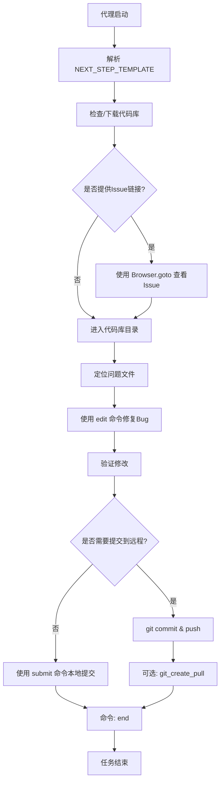

# `.\MetaGPT\metagpt\prompts\di\swe_agent.py` 详细设计文档

该代码定义了一个用于指导自主编程代理（Autonomous Programmer Agent）的指令模板和提示系统。它通过一个结构化的JSON命令接口，引导代理在受限的终端环境中（不支持交互式会话）执行代码库的定位、问题分析、文件编辑、修复Bug以及提交更改等一系列软件工程任务。核心是`NEXT_STEP_TEMPLATE`模板，它整合了任务设定、操作示例（`MINIMAL_EXAMPLE`）、关键提示（`IMPORTANT_TIPS`）和当前状态占位符，为代理生成每一步的“思考-命令”对提供完整上下文。

## 整体流程



## 类结构

```
本文件不包含类定义，主要由全局常量和字符串模板构成。
├── 全局常量 (MINIMAL_EXAMPLE, IMPORTANT_TIPS)
├── 全局模板 (NEXT_STEP_TEMPLATE, CURRENT_BASH_STATE)
└── 无类、函数或变量定义
```

## 全局变量及字段


### `MINIMAL_EXAMPLE`
    
一个包含完整任务执行轨迹的示例字符串，展示了从理解问题、定位代码、修复bug到提交更改的完整流程，用于指导代理如何操作。

类型：`str`
    


### `IMPORTANT_TIPS`
    
一个包含重要操作提示和最佳实践的长字符串，为代理在代码库中导航、搜索、编辑和提交更改时提供关键指导。

类型：`str`
    


### `NEXT_STEP_TEMPLATE`
    
一个格式化字符串模板，用于生成代理的下一步指令。它整合了环境设置、操作约束、示例轨迹和重要提示，是驱动代理决策的核心模板。

类型：`str`
    


### `CURRENT_BASH_STATE`
    
一个格式化字符串模板，用于描述当前Shell环境的状态，包括打开的文件和当前工作目录，为代理提供上下文信息。

类型：`str`
    


    

## 全局函数及方法


## 关键组件


### 动作轨迹示例 (MINIMAL_EXAMPLE)

一个完整的、结构化的任务执行示例，展示了从理解问题、定位代码、修复Bug到提交更改的完整流程，定义了代理应遵循的标准操作序列。

### 重要提示与最佳实践 (IMPORTANT_TIPS)

一系列针对代码编辑、文件搜索、命令执行和版本控制的操作指南和约束条件，旨在指导代理高效、准确地完成任务，避免常见错误。

### 下一步行动模板 (NEXT_STEP_TEMPLATE)

定义了代理在每次交互中应遵循的输出格式。它整合了系统设置、指令、示例和提示，并强制要求代理的响应必须包含推理过程和单个JSON格式的命令。

### 当前Bash状态模板 (CURRENT_BASH_STATE)

一个用于在代理的“思考”过程中动态插入当前工作环境（打开的文件和当前目录）的模板字符串，帮助代理基于上下文做出决策。


## 问题及建议


### 已知问题

-   **硬编码的示例与模板**：`MINIMAL_EXAMPLE` 和 `NEXT_STEP_TEMPLATE` 中包含了大量硬编码的路径（如 `/workspace/MetaGPT`）、仓库名（如 `garylin2099/MetaGPT`）和具体的代码修改示例。这使得该模板与特定任务和仓库高度耦合，缺乏通用性。当应用于其他项目或不同问题时，需要大量手动修改，容易出错且维护困难。
-   **命令执行逻辑的脆弱性**：`IMPORTANT_TIPS` 中多次强调“一个失败的命令如果不修改就不会成功第二次”，这暴露了底层命令执行环境或代理逻辑可能存在状态管理问题或非幂等性操作，导致开发体验不流畅，需要开发者进行额外的人工判断和干预。
-   **编辑命令的易错性**：提示中反复警告 `edit` 命令对缩进敏感，且容易因指定错误行号而导致意外修改。这暗示当前的代码编辑机制可能不够鲁棒，缺乏对上下文代码块的智能感知或安全校验，将正确性负担完全转移给了提示词和代理的“谨慎操作”。
-   **结构僵化与逻辑混合**：`NEXT_STEP_TEMPLATE` 将系统指令、操作示例、重要提示和输出模板混合在一个长字符串中。这种结构使得更新、维护和针对不同场景定制变得困难。同时，它强制代理遵循“定位问题->修复问题->提交更改”的线性流程，可能不适用于所有类型的开发任务（如代码审查、重构、探索性分析）。
-   **潜在的依赖与兼容性问题**：示例中使用了 `Browser.goto` 等特定工具命令，并假设了 `git_create_pull` 等自定义命令的存在。如果目标运行环境不支持这些命令或版本不兼容，整个工作流将无法执行。
-   **缺乏错误恢复指导**：虽然提示中列举了许多“不要做什么”，但对于命令失败后（尤其是搜索、编辑失败）的具体恢复策略和备选方案描述不足，更多是原则性警告，可能使代理在遇到意外情况时陷入困惑。

### 优化建议

-   **参数化与模板引擎**：将硬编码的路径、仓库信息、甚至部分流程步骤抽象为可配置的参数或变量。可以考虑使用模板引擎（如Jinja2）来动态生成 `NEXT_STEP_TEMPLATE`，使其能够根据传入的上下文（如目标仓库URL、问题ID）自动适配。
-   **增强命令执行层的鲁棒性**：优化底层命令执行器，使其具备更好的错误处理和状态管理能力。例如，实现命令的幂等性，或提供更清晰的错误信息反馈，让代理能基于明确的错误类型（如文件未找到、语法错误）采取不同的恢复动作，而不是笼统地“不要重复失败命令”。
-   **开发更智能的代码编辑工具**：替代或增强基础的 `edit` 命令。可以设计一个能理解代码结构（如AST）的编辑接口，允许代理指定函数名、类名进行修改，或提供代码片段进行替换，由系统自动处理正确的行号和缩进，降低操作复杂度。
-   **模块化提示工程与流程抽象**：将长提示拆分为独立的模块：系统角色定义、可用工具描述、通用最佳实践、任务特定流程模板、输出格式规范等。可以设计一个流程引擎，允许定义和组合不同的“阶段”（Phase），如“探索阶段”、“诊断阶段”、“修复阶段”、“验证阶段”，使代理的行为更加灵活和可定制。
-   **明确环境契约与降级方案**：在文档或初始化阶段明确声明所需的外部命令和工具（如git, find, grep的特定版本，以及自定义工具），并检查其可用性。对于可选的高级功能（如 `git_create_pull`），提供明确的降级方案（例如，指导用户手动执行等效的git命令）。
-   **构建系统化的错误处理策略**：在提示中为常见失败场景（如搜索无结果、编辑后语法检查失败）设计标准化的恢复工作流。例如，可以指导代理：“如果`find_file`未找到目标，尝试使用`grep -r`进行内容搜索”；“执行`edit`后，使用`Bash.run(‘python -m py_compile file.py’)`快速进行语法验证”。
-   **引入上下文记忆与摘要**：当前提示主要依赖代理的“思考”（Thought）来维持上下文。可以设计机制，让系统自动维护一个轻量级的任务上下文（如已查看的文件、已尝试的修改、当前假设），并在每一步骤前将其摘要提供给代理，帮助其在长序列操作中保持连贯性，避免重复劳动。


## 其它


### 设计目标与约束

本代码模块的核心设计目标是提供一个结构化的、可执行的“智能体（Agent）行动轨迹”模板和提示系统，用于指导一个自主编程智能体在受限的交互式环境中（如SWE-agent）完成代码修复任务。其主要约束包括：1. **单步执行**：智能体必须严格遵循“思考-行动-观察”的循环，每次只能执行一个命令并等待反馈。2. **非交互式环境**：禁止使用交互式会话命令（如`python`、`vim`），所有操作需通过脚本或文件编辑完成。3. **精确的编辑操作**：`edit`命令要求精确的缩进和行号范围，任何错误都可能导致语法问题，需要后续修正。4. **上下文感知**：智能体必须时刻关注当前工作目录和打开的文件，因为不同命令会改变这些状态。5. **任务导向的流程**：设计强制遵循“理解问题 -> 定位代码 -> 修复Bug -> 保存更改”的标准工作流。

### 错误处理与异常设计

代码本身不包含运行时错误处理逻辑，因为它是一个静态的配置模板字符串。其“错误处理”机制是通过嵌入在`IMPORTANT_TIPS`和`NEXT_STEP_TEMPLATE`中的**预防性指南**和**操作策略**来实现的。例如：1. **命令失败处理**：明确提示“如果命令失败，不要重复执行相同的命令，应修改后重试”。2. **编辑错误恢复**：针对`edit`命令可能因行号或缩进错误导致的失败，提供了“检查修改结果”和“再次发出修正命令”的恢复策略。3. **搜索边界处理**：在文件搜索策略中，考虑了文件不存在、路径错误、结果过多等边界情况，并给出了相应的调整建议（如细化搜索词、检查当前目录）。4. **状态不一致预防**：反复强调要关注`(Open file)`和`(Current directory)`状态，防止因状态不一致导致的命令执行在错误上下文中。这是一种**通过严格的操作规程和智能体自身的“思考”来规避错误**的设计，而非在代码层面进行`try-catch`。

### 数据流与状态机

系统的数据流和状态转换主要由智能体根据模板和提示信息驱动，核心状态包括：1. **智能体内部状态**：即其“思考（Thought）”内容，代表对任务当前阶段（如定位、修复）和下一步行动的理解。2. **环境外部状态**：由`CURRENT_BASH_STATE`模板捕获，包括`{open_file}`（当前打开的文件）和`{working_dir}`（当前工作目录）。这两个状态是智能体所有行动（`Bash.run`、`edit`、`open`等）的输入和输出，形成了一个反馈循环。3. **任务阶段状态**：隐含在示例轨迹中，如“Read and understand issue”、“Locate issue”、“Fix the Bug”、“Save the Changes”。智能体需要推动状态沿此路径迁移。整个系统可以看作一个**由提示信息驱动的确定性状态机**，智能体的“Thought”是状态判断逻辑，其输出的JSON命令是状态迁移动作，而环境的反馈（命令结果和新的`CURRENT_BASH_STATE`）是状态迁移的结果和下一轮输入。

### 外部依赖与接口契约

本配置模块定义了智能体与执行环境之间的**交互协议和接口契约**：1. **命令接口**：智能体通过输出特定格式的JSON来调用能力。已明确的命令包括`Bash.run`（执行shell命令）、`Browser.goto`（访问网页）、`edit`（编辑文件）、`submit`（提交本地更改）、`git_create_pull`（创建PR）和`end`（结束会话）。每个命令都有预期的`args`结构。2. **环境反馈接口**：环境在执行命令后，需要向智能体提供标准化的反馈，包括命令执行结果（成功输出或错误信息）以及更新后的`CURRENT_BASH_STATE`。3. **隐含的工具依赖**：智能体的有效操作依赖于底层环境提供一系列工具，如`find_file`、`search_dir_and_preview`等搜索命令，这些并非标准Bash命令，而是环境必须实现的**特殊工具**。4. **Git/版本控制依赖**：完成“保存更改”阶段需要本地安装并配置好Git，并且智能体拥有对应远程仓库的推送权限。这些依赖和契约是智能体能够正确工作的前提，但在此配置代码中并未显式声明或检查，属于隐含假设。

    