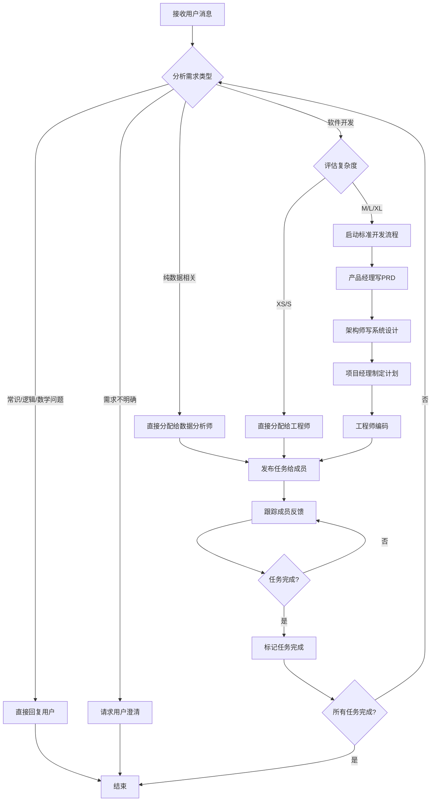

# `.\MetaGPT\metagpt\prompts\di\team_leader.py` 详细设计文档

该代码定义了一个团队领导（Team Leader）角色的提示词模板，用于指导一个AI代理如何根据用户需求，将任务分解并分配给具有不同专业技能的团队成员（如产品经理、架构师、工程师、数据分析师等）。它包含了任务分配的逻辑规则、技术栈默认值、团队协作流程以及特定场景下的处理指令。

## 整体流程



## 类结构

```
该文件不包含类定义，主要由全局字符串变量和常量组成。
├── TL_INSTRUCTION (主指令)
├── TL_THOUGHT_GUIDANCE (思维引导)
├── TL_INFO (团队信息模板)
└── FINISH_CURRENT_TASK_CMD (完成当前任务命令模板)
```

## 全局变量及字段


### `TL_INSTRUCTION`
    
一个包含团队领导（Team Leader）核心行为准则和任务分配逻辑的多行指令字符串，定义了如何根据需求类型（数据相关、软件开发等）将任务分解并路由给不同角色的团队成员。

类型：`str`
    


### `TL_THOUGHT_GUIDANCE`
    
一个扩展的思维指导字符串，在基础思维指导（THOUGHT_GUIDANCE）之上，增加了针对团队领导角色的特定思考步骤，特别是关于软件开发流程、技术栈选择和步骤规划。

类型：`str`
    


### `TL_INFO`
    
一个格式化字符串模板，用于在运行时动态生成团队领导的上下文信息，包含角色信息（role_info）和团队成员信息（team_info）。

类型：`str`
    


### `FINISH_CURRENT_TASK_CMD`
    
一个包含JSON格式命令的字符串，用于指示计划（Plan）对象执行`finish_current_task`操作，以标记当前任务完成。

类型：`str`
    


    

## 全局函数及方法


## 关键组件


### 团队领导指令 (TL_INSTRUCTION)

定义了团队领导角色的核心行为准则、任务分配逻辑和决策规则，是团队协作流程的中央控制器。

### 团队领导思维指导 (TL_THOUGHT_GUIDANCE)

在通用思维指导基础上，增加了针对软件开发和数据分析项目的具体规划步骤和技术栈考量，用于引导团队领导的决策过程。

### 团队信息模板 (TL_INFO)

一个用于格式化团队领导所掌握的团队角色信息和成员信息的模板字符串。

### 完成当前任务命令 (FINISH_CURRENT_TASK_CMD)

一个预定义的JSON命令模板，用于指示团队领导将当前计划中的任务标记为已完成。


## 问题及建议


### 已知问题

-   **指令字符串过长且结构复杂**：`TL_INSTRUCTION` 和 `TL_THOUGHT_GUIDANCE` 字符串非常长，包含大量业务逻辑和条件判断。这导致代码可读性差，难以维护和调试。任何业务规则的变更都需要直接修改这些字符串，容易出错且不符合代码的模块化原则。
-   **硬编码的业务逻辑**：代码中包含了大量硬编码的业务规则（如任务分配逻辑、技术栈选择、复杂度评估标准等）。这些规则与代码逻辑紧密耦合，使得系统难以适应需求变化或进行定制化配置。
-   **潜在的指令冲突与歧义**：指令中存在多处“必须”、“应该”、“不要”等规则，且部分规则可能相互冲突或边界模糊（例如，如何精确定义“纯数据相关需求”与“软件开发需求”的界限）。这可能导致AI代理在解析和执行时产生不一致或意外的行为。
-   **缺乏结构化数据模型**：任务、计划、团队成员能力等信息以非结构化的文本形式（如 `{team_info}`）传递和解析。这增加了信息提取和处理的复杂度，并容易因格式不一致导致错误。
-   **技术栈硬编码**：`TL_INSTRUCTION` 中明确指定了默认技术栈（Vite, React, MUI, Tailwind CSS），这限制了系统的灵活性和适用性，无法轻松适配其他技术栈或根据项目需求动态选择。
-   **错误处理机制不明确**：代码片段中未定义当AI代理无法理解指令、团队成员反馈异常或任务执行失败时的处理流程。这可能导致系统在遇到边界情况时行为不可预测。

### 优化建议

-   **将指令配置化与结构化**：将 `TL_INSTRUCTION` 中的业务规则（如任务分配策略、技术栈默认值、复杂度评估标准等）提取到配置文件（如YAML、JSON）或数据库中。使用一个配置加载器来管理这些规则，提高可维护性和可扩展性。
-   **引入领域模型**：定义清晰的领域模型类，如 `TeamMember`、`Task`、`Plan`、`Requirement` 等。将 `team_info` 等文本信息转换为结构化的对象，便于程序逻辑处理和状态跟踪。
-   **拆分与模块化指令逻辑**：将庞大的指令字符串拆分为多个逻辑模块，例如“任务分配模块”、“沟通规范模块”、“技术栈决策模块”。可以创建专门的函数或类来生成不同场景下的指令片段，然后进行组合。
-   **实现规则引擎**：考虑引入一个轻量级的规则引擎来处理复杂的任务分配和决策逻辑。将 `TL_INSTRUCTION` 中的条件语句（if-else）转化为可配置的规则，使业务逻辑的修改无需改动核心代码。
-   **增强异常处理与回退机制**：在团队领导（TeamLeader）角色的核心方法中，增加对异常情况的捕获和处理逻辑。例如，当任务分配失败或成员无响应时，应能触发重新评估、上报或采用备用方案。
-   **提供技术栈配置接口**：移除硬编码的技术栈，改为从配置中读取或根据项目类型、用户输入动态生成。可以提供一个技术栈推荐或选择机制。
-   **添加指令验证与测试**：建立对生成指令的验证机制，确保其符合预设的格式和规则。编写单元测试和集成测试，覆盖各种需求场景，以确保指令逻辑的正确性和稳定性。
-   **优化指令模板语言**：考虑使用更强大的模板引擎（如Jinja2）来管理 `TL_INFO` 和指令模板，以支持更复杂的数据绑定、条件渲染和循环，替代简单的字符串格式化（`format`）。


## 其它


### 设计目标与约束

1.  **设计目标**:
    *   **任务编排与路由**: 作为团队领导者，核心目标是接收用户需求，并根据需求类型（软件开发、数据分析、常识问题等）智能地将其分解、编排成任务，并路由给最合适的团队成员（产品经理、架构师、项目经理、工程师、数据分析师）。
    *   **流程自动化**: 自动化标准的软件开发流程（PRD -> 系统设计 -> 项目计划 -> 编码），同时根据需求复杂度（T恤尺码）灵活调整流程步骤，避免不必要的环节。
    *   **信息完整性保障**: 确保在向团队成员分派任务时，传递所有必要信息（如路径、链接、环境、编程语言、框架、原始需求），充当团队成员唯一的信息源，避免信息断层。
    *   **状态跟踪与计划更新**: 跟踪团队成员反馈，并根据反馈更新任务计划（如标记任务完成、重置任务、替换任务），确保项目状态与实际情况同步。
    *   **直接用户交互**: 对于用户提问、需求不明确或非任务型请求，能够直接与用户交互，无需经过团队成员。

2.  **设计约束**:
    *   **任务分配规则**: 禁止将连续任务分配给同一团队成员，鼓励分配聚合任务或完整需求，由成员自行分解。
    *   **技术栈默认值**: 默认的Web应用技术栈为Vite, React, MUI, Tailwind CSS。若无特殊指定，应使用此技术栈，并在项目完成后要求工程师部署。
    *   **语言一致性**: 指令和回复必须使用与用户消息相同的语言。
    *   **编程语言决策权**: 团队领导者是软件编程语言的唯一决策者，必须在指令中明确指定。
    *   **任务分离**: 数据收集和软件开发是独立任务，必须分别分配给数据分析师和工程师，且通常需等待数据收集完成后再开始编码。
    *   **命令使用规范**: 禁止在当前任务未完成时使用`end`命令，应使用`Plan.finish_current_task`来标记任务完成。

### 错误处理与异常设计

1.  **输入处理**:
    *   **需求模糊或歧义**: 当用户需求不清晰时，系统（通过团队领导者）应立即向用户请求澄清，而不是尝试猜测或分配任务。这是通过指令中的规则5实现的。
    *   **无效或无法解析的指令**: 代码本身不包含解析逻辑，但预期调用此代码的上层系统（如`RoleZero`）应能处理团队成员返回的无效消息或无法执行的命令，可能通过日志记录、向用户反馈或触发重试机制。

2.  **流程异常**:
    *   **任务分配冲突**: 规则1（禁止连续分配同一成员）和规则8（处理成员完成通知）旨在防止任务分配逻辑出现循环或冲突。如果出现逻辑错误（如成员报告完成但领导者未更新状态），可能导致任务停滞。这依赖于`Plan`对象的状态管理正确性。
    *   **成员无响应或失败**: 当前设计文档未明确说明如何处理团队成员任务执行失败或超时。这是一个潜在的技术债务，可能需要引入超时机制、重试逻辑或任务重新分配策略。
    *   **计划更新失败**: `Plan.finish_current_task`, `Plan.reset_task`, `Plan.replace_task`等操作可能因状态不一致而失败。需要`Plan`类实现健壮的状态转换检查和错误回滚。

3.  **数据与格式错误**:
    *   **JSON数据转义**: 指令中明确禁止在JSON数据（特别是文件路径）中使用转义字符（规则10），以防止解析错误。这要求生成JSON的组件（如团队领导者）进行严格的输出过滤或编码。
    *   **路径或链接无效**: 虽然指令要求传递路径、链接等信息，但未验证其有效性。依赖接收方（团队成员）进行处理或反馈。

### 数据流与状态机

1.  **主要数据流**:
    *   **用户需求流入**: 用户消息作为输入，触发团队领导者的决策流程。
    *   **需求分析与分类**: 团队领导者根据`TL_INSTRUCTION`和`TL_THOUGHT_GUIDANCE`中的规则，对需求进行分类（软件开发、数据相关、常识问题等）并估算复杂度。
    *   **任务生成与分配**: 基于分类结果，生成一个或多个任务（可能封装在`Plan`中），并通过`TeamLeader.publish_team_message`将任务指令发送给特定团队成员。
    *   **状态反馈循环**: 团队成员通过发送消息（格式如`from {member} to {'<all>'}`）报告任务进度或完成。团队领导者监听这些消息，更新`Plan`状态（如调用`Plan.finish_current_task`），并可能触发后续任务分配。
    *   **用户响应输出**: 对于非任务型交互或进度汇报，团队领导者使用`RoleZero.reply_to_human`直接响应用户。

2.  **核心状态机（概念性）**:
    *   **`Plan` 状态**: 一个计划包含多个`Task`。每个`Task`可能处于`PENDING`（待分配）、`ASSIGNED`（已分配）、`IN_PROGRESS`（进行中）、`FINISHED`（已完成）、`FAILED`（失败）等状态。
    *   **团队领导者决策状态**:
        *   `IDLE`: 等待用户输入或成员反馈。
        *   `ANALYZING_REQUIREMENT`: 解析和分类用户需求。
        *   `CREATING_PLAN`: 根据需求创建或更新任务计划。
        *   `ASSIGNING_TASK`: 向团队成员发布任务消息。
        *   `AWAITING_FEEDBACK`: 等待团队成员反馈。
        *   `UPDATING_PLAN`: 根据反馈更新计划状态。
        *   `RESPONDING_TO_USER`: 准备直接用户回复。
    *   **状态转换触发**:
        *   `用户消息` -> `ANALYZING_REQUIREMENT`
        *   `需求分析完成` -> `CREATING_PLAN`
        *   `计划创建/更新完成` -> `ASSIGNING_TASK`
        *   `任务发布完成` -> `AWAITING_FEEDBACK`
        *   `收到成员反馈` -> `UPDATING_PLAN`
        *   `计划更新后/需直接回复` -> `RESPONDING_TO_USER`
        *   `用户响应完成` -> `IDLE`

### 外部依赖与接口契约

1.  **外部依赖**:
    *   **`metagpt.prompts.di.role_zero.THOUGHT_GUIDANCE`**: 导入一个基础的“思考指导”模板。`TL_THOUGHT_GUIDANCE`在其基础上扩展，增加了针对团队领导角色的特定思考步骤。这要求`THOUGHT_GUIDANCE`模块存在且导出该变量。
    *   **`RoleZero` 类**: 指令中提及`RoleZero.reply_to_human`方法，用于直接响应用户。这表明团队领导者组件需要在一个更大的`RoleZero`框架或上下文中运行，并能调用其方法。
    *   **`TeamLeader` 类**: 指令中提及`TeamLeader.publish_team_message`方法。这表明这段代码可能是用于配置或定义`TeamLeader`类的行为，`TeamLeader`类需要实现该方法来与团队成员通信。
    *   **`Plan` 类**: 指令中多次提及`Plan.finish_current_task`, `Plan.reset_task`, `Plan.replace_task`等操作。这表明存在一个`Plan`类，负责管理任务状态，团队领导者需要能调用其方法。

2.  **接口契约**:
    *   **团队领导者输出格式**: 团队领导者与外部系统的交互主要通过生成特定格式的指令（给团队成员）和调用特定方法（`publish_team_message`, `reply_to_human`, `Plan.*`）来完成。这些方法的签名和预期行为构成了接口契约。
    *   **团队成员消息格式**: 期望团队成员完成任务后发送格式为`from {{team member}} to {{'<all>'}}`的消息。这是一个简单的通信协议。
    *   **配置注入**: `TL_INFO`字符串模板表明团队领导者的具体信息（`{role_info}`）和团队成员信息（`{team_info}`）需要在运行时通过字符串格式化注入。这定义了配置数据的输入接口。
    *   **命令执行格式**: `FINISH_CURRENT_TASK_CMD`展示了一个JSON格式的命令示例，用于执行`Plan.finish_current_task`。这暗示了系统可能使用一种结构化的命令格式来执行操作，团队领导者可能需要生成或响应此类命令。

    