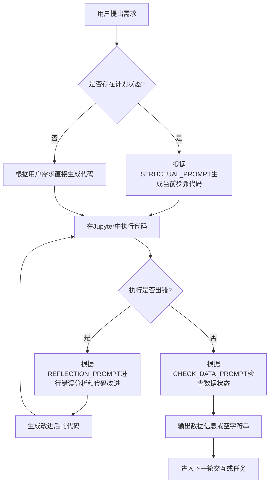

# `.\MetaGPT\metagpt\prompts\di\write_analysis_code.py` 详细设计文档

该文件定义了一系列用于AI代码生成和调试任务的提示词模板和系统消息，主要服务于一个交互式Jupyter笔记本环境中的AI助手，用于指导其执行代码生成、错误反思和数据检查等任务。

## 整体流程



## 类结构

```
该文件不包含类定义，仅包含全局字符串变量和函数。
├── 系统消息变量 (INTERPRETER_SYSTEM_MSG, REFLECTION_SYSTEM_MSG)
├── 提示词模板变量 (STRUCTUAL_PROMPT, REFLECTION_PROMPT, CHECK_DATA_PROMPT, DATA_INFO)
└── 示例变量 (DEBUG_REFLECTION_EXAMPLE)
```

## 全局变量及字段


### `INTERPRETER_SYSTEM_MSG`
    
定义数据科学家AI助手的系统提示，指导其在Jupyter笔记本环境中以逐步、连续的方式执行任务，并规定了代码输出和工具使用的格式。

类型：`str`
    


### `STRUCTUAL_PROMPT`
    
一个结构化的提示模板，用于指导AI根据用户需求、计划状态和可用工具生成可执行的代码块，强调遵循约束条件和输出格式。

类型：`str`
    


### `REFLECTION_SYSTEM_MSG`
    
定义AI调试助手的系统提示，指导其根据之前的实现代码、运行时错误和提示来反思并改进代码实现，特别处理模块导入错误。

类型：`str`
    


### `DEBUG_REFLECTION_EXAMPLE`
    
一个调试反思的示例，展示了从错误实现到改进实现的完整过程，包括问题分析、反思和改进后的代码。

类型：`str`
    


### `REFLECTION_PROMPT`
    
一个用于引导AI进行代码反思和改进的提示模板，结合了示例、上下文、之前的实现和具体指令，要求输出反思分析和改进后的代码。

类型：`str`
    


### `CHECK_DATA_PROMPT`
    
一个用于检查已完成任务中关键数据（特别是DataFrame列信息）的提示模板，指导AI输出相应的检查代码以指导后续行动。

类型：`str`
    


### `DATA_INFO`
    
一个用于格式化并展示最新数据信息的提示模板，将检查到的数据信息整合到后续任务的上下文中。

类型：`str`
    


    

## 全局函数及方法


## 关键组件


### 系统提示词 (INTERPRETER_SYSTEM_MSG)

定义了数据科学家AI代理在Jupyter笔记本环境中进行交互式、分步编码时的核心行为准则，包括避免使用`asyncio.run`、优先使用Terminal工具执行Shell命令、每次响应只输出一个代码块等。

### 结构化提示词模板 (STRUCTUAL_PROMPT)

一个用于指导AI代理根据用户需求、计划状态和可用工具信息生成下一步可执行代码的模板。它强调遵循计划、确保代码在同一个Jupyter笔记本中可执行，并优先使用预定义工具。

### 反思与调试系统 (REFLECTION_SYSTEM_MSG, DEBUG_REFLECTION_EXAMPLE, REFLECTION_PROMPT)

一个用于代码调试和迭代改进的组件。它包含一个反思系统提示，指导AI在遇到运行时错误时如何修正代码（特别是处理`ModuleNotFoundError`）；一个调试反思示例，展示了从错误代码到改进代码的完整思维和输出流程；以及一个反思提示模板，用于结构化地引导AI分析先前代码、错误上下文并生成改进后的实现。

### 数据检查机制 (CHECK_DATA_PROMPT, DATA_INFO)

一个用于在连续任务执行过程中检查和传递数据状态的组件。`CHECK_DATA_PROMPT`指导AI检查已完成任务中的代码，并输出关键变量信息（对于数据分析任务，会使用`get_column_info`函数打印最新的列信息）。`DATA_INFO`则是一个模板，用于将检查得到的最新数据信息格式化，以便在后续任务中作为上下文使用。


## 问题及建议


### 已知问题

-   **硬编码的提示词模板**：`INTERPRETER_SYSTEM_MSG`、`STRUCTUAL_PROMPT`、`REFLECTION_SYSTEM_MSG`、`REFLECTION_PROMPT`、`CHECK_DATA_PROMPT` 和 `DATA_INFO` 等提示词模板直接以字符串形式硬编码在代码中。这导致修改提示词需要直接修改源代码，不利于维护、版本控制和在不同环境（如不同语言、不同任务）下复用。
-   **缺乏配置管理**：所有系统消息和提示词模板的配置与业务逻辑代码耦合。没有统一的配置管理机制（如配置文件、环境变量、配置类），使得调整系统行为（如修改约束条件、工具信息格式）变得困难。
-   **潜在的代码注入风险**：`STRUCTUAL_PROMPT` 和 `REFLECTION_PROMPT` 等模板使用 `{user_requirement}`、`{plan_status}` 等占位符，并通过字符串格式化（如 `.format()` 或 f-string）填充。如果填充的内容来自不可信来源且未经过适当转义，可能存在代码注入风险，尤其是在生成可执行代码的上下文中。
-   **示例代码耦合**：`DEBUG_REFLECTION_EXAMPLE` 作为一个具体的调试示例被硬编码在反射逻辑中。这使得示例难以更新或替换，例如，如果需要展示一个更复杂或领域特定的调试案例。
-   **工具导入逻辑固化**：`REFLECTION_SYSTEM_MSG` 中关于处理 `ModuleNotFoundError` 的指令是硬编码的，它指定了从 `metagpt.tools.libs.terminal` 导入 `Terminal` 并使用特定命令格式。这限制了工具的灵活性和可替换性。
-   **数据检查逻辑单一**：`CHECK_DATA_PROMPT` 中的数据检查逻辑主要针对“数据分析和机器学习任务”，并硬编码了使用 `get_column_info(df)` 函数。对于其他类型的任务（如文件操作、网络请求），其检查逻辑（“打印任何你认为合适的关键变量”）过于模糊，缺乏指导性，可能导致不一致的输出。

### 优化建议

-   **外部化提示词配置**：将所有的提示词模板（`INTERPRETER_SYSTEM_MSG`、`STRUCTUAL_PROMPT` 等）移至外部配置文件（如 YAML、JSON）或数据库。创建一个配置加载器来管理这些模板，实现配置与代码的分离，便于维护和A/B测试。
-   **实现配置类或管理器**：设计一个 `PromptConfig` 或 `AgentConfig` 类，使用 Pydantic 等库进行验证和管理。将当前散落的字符串常量整合为该类的属性，并通过依赖注入的方式供其他组件使用。
-   **对动态内容进行安全处理**：在将用户输入、计划状态等动态内容插入提示词模板前，实施严格的输入验证和清理。考虑使用模板引擎（如 Jinja2）的自动转义功能，或为特定上下文设计安全的插值方法。
-   **将示例代码模块化**：将 `DEBUG_REFLECTION_EXAMPLE` 这类示例移出核心逻辑。可以创建一个示例仓库或配置文件来管理不同场景下的示例，并通过配置键来动态加载所需的示例。
-   **抽象工具调用接口**：将 `REFLECTION_SYSTEM_MSG` 中处理依赖安装的硬编码逻辑抽象为一个通用的 `DependencyManager` 或 `ToolExecutor` 接口。该接口可以根据错误类型（如 `ModuleNotFoundError`）和上下文决定如何解决依赖问题（可能是 `pip install`，也可能是 `conda install` 或加载其他工具）。
-   **增强数据检查的通用性**：重构 `CHECK_DATA_PROMPT` 的逻辑。可以定义一个 `DataChecker` 接口或一系列策略类，针对不同的任务类型（数据分析、文件处理、API调用等）实现特定的检查方法。核心系统根据上下文选择并执行合适的检查策略，使检查逻辑更灵活、可扩展。


## 其它


### 设计目标与约束

本代码库旨在构建一个支持在Jupyter Notebook环境中进行交互式、分步代码生成与调试的AI助手系统。其核心设计目标包括：
1.  **交互式与增量式开发**：系统被设计为在持续的Jupyter会话中运行，每次响应只生成并执行一个步骤的代码，以支持探索性数据分析和迭代开发。
2.  **工具集成与约束**：优先使用预定义的工具（如`Terminal`）来执行Shell命令、安装包等操作，禁止在Notebook代码块中使用`!`命令，以确保代码的可移植性和环境一致性。
3.  **错误恢复与自我改进**：通过反射（Reflection）机制，系统能够分析运行时错误，理解问题根源，并生成修正后的代码，实现自我调试和代码质量提升。
4.  **上下文感知与状态管理**：代码生成需考虑用户需求、已制定的计划状态、可用工具信息以及之前执行代码产生的数据状态，确保新代码在现有上下文中可执行。

主要约束包括：
-   运行环境限制为Jupyter Notebook，避免使用`asyncio.run`，需使用`await`调用异步函数。
-   每次响应必须且只能输出一个代码块。
-   在发生`ModuleNotFoundError`时，反射逻辑必须优先通过`Terminal`工具安装缺失包。

### 错误处理与异常设计

系统的错误处理主要围绕`REFLECTION_SYSTEM_MSG`和`REFLECTION_PROMPT`定义的反射流程展开，这是一种主动的、基于分析的错误恢复机制。

1.  **错误捕获与上下文提供**：当生成的代码在Notebook中执行失败时（由外部运行时环境捕获错误），系统将错误信息、之前的实现代码(`previous_impl`)以及任务上下文(`context`)作为输入，传递给反射流程。
2.  **结构化错误分析**：`REFLECTION_PROMPT`引导AI逐步分析（`[reflection on previous impl]`）错误原因，例如逻辑错误、API误用或缺失依赖。`DEBUG_REFLECTION_EXAMPLE`提供了一个从错误输出反推问题并修正的范例。
3.  **针对性修复与代码生成**：基于分析结果，系统生成改进的实现（`[improved impl]`）。对于`ModuleNotFoundError`这类特定异常，`REFLECTION_SYSTEM_MSG`给出了明确的修复指令：在改进的代码中，必须先导入并使用`Terminal`工具安装缺失包，然后再导入该包。
4.  **数据检查与状态验证**：`CHECK_DATA_PROMPT`定义了一种预防性错误处理。它要求在执行后续任务前，检查已执行代码生成的关键变量（特别是`DataFrame`），并打印其列信息或关键状态。这有助于在数据流异常或类型不匹配导致运行时错误之前，提前发现潜在问题。

系统的异常设计并非传统的`try-catch`块，而是将异常作为触发更高级别（AI驱动）诊断和修复流程的输入信号。

### 数据流与状态机

系统管理着多种状态，数据流围绕这些状态在提示词模板和AI响应间传递。

1.  **核心状态**：
    -   **用户需求 (`user_requirement`)**：初始输入，驱动整个会话。
    -   **计划状态 (`plan_status`)**：可能是一个任务列表或当前步骤标识，用于指导`STRUCTUAL_PROMPT`决定是继续执行计划中的“当前任务”还是直接处理原始需求。
    -   **工具信息 (`tool_info`)**：描述可用工具（如`Terminal`, `data_preprocess`模块的函数）的元信息，指导代码生成时选择正确的工具。
    -   **已编写代码 (`code_written`)**：在`CHECK_DATA_PROMPT`中，代表之前所有成功执行的代码块集合，是检查数据状态的依据。
    -   **最新数据信息 (`info`)**：`CHECK_DATA_PROMPT`执行后产生的输出（如`column_info`），通过`DATA_INFO`模板格式化后，可作为后续`STRUCTUAL_PROMPT`的输入，实现数据感知的代码生成。

2.  **状态机流程**：
    -   **主循环 (正常执行)**：
        1.  输入：`用户需求` + `计划状态` + `工具信息` + (`最新数据信息`)。
        2.  处理：`INTERPRETER_SYSTEM_MSG` 和 `STRUCTUAL_PROMPT` 引导AI生成下一步代码。
        3.  输出：可执行的Python代码块。
        4.  状态更新：执行的代码可能更新Jupyter内核中的变量（隐式状态），`code_written`集合增加。
    -   **检查点 (数据验证)**：
        -   在特定节点（可能由计划状态或用户触发），调用`CHECK_DATA_PROMPT`。
        -   输入：`code_written`。
        -   输出：数据检查代码块，执行后产生`info`。
        -   状态更新：`info`被捕获并用于更新后续循环的上下文。
    -   **异常分支 (反射调试)**：
        1.  触发：主循环输出的代码执行失败。
        2.  输入：`错误上下文` + `previous_impl` + `任务上下文`。
        3.  处理：`REFLECTION_SYSTEM_MSG` 和 `REFLECTION_PROMPT` 引导AI分析错误并生成修正代码。
        4.  输出：包含分析过程和`[improved impl]`的响应。
        5.  状态更新：用修正的代码替换有问题的`previous_impl`，重新进入执行阶段。

### 外部依赖与接口契约

1.  **外部依赖**：
    -   **Jupyter Notebook/Kernel**：核心运行时环境。系统生成的代码依赖于此环境来执行、维护变量状态和捕获输出/错误。
    -   **`metagpt.tools` 库**：提供了关键的工具类和方法。
        -   `metagpt.tools.libs.terminal.Terminal`：用于执行Shell命令的异步工具。契约：通过`await terminal.run_command(cmd)`调用。
        -   `metagpt.tools.libs.data_preprocess.get_column_info`：用于获取DataFrame列信息的函数。契约：输入一个`DataFrame`对象，返回其列信息（具体格式未在代码中明确定义，但预期为可打印的摘要信息）。
    -   **大语言模型 (LLM) API**：所有提示词模板（`INTERPRETER_SYSTEM_MSG`, `STRUCTUAL_PROMPT`等）的内容都需要发送给一个LLM（如GPT-4）进行处理，以获得代码或文本响应。这是系统最核心的外部依赖。

2.  **接口契约**：
    -   **提示词模板**：每个模板（如`STRUCTUAL_PROMPT`）定义了一个严格的输入输出契约。输入是模板中占位符（如`{user_requirement}`）的具体值，输出是遵循模板末尾指定格式（如“Always output one and only one code block...”）的响应。系统其他部分必须保证填充模板的数据格式正确，并能够解析LLM的响应。
    -   **工具调用契约**：在生成的代码中，调用`Terminal`等工具必须遵循异步模式（使用`await`），并且安装包的代码必须出现在导入该包之前，如`REFLECTION_SYSTEM_MSG`所规定。
    -   **数据检查契约**：`CHECK_DATA_PROMPT`要求生成的检查代码必须定义一个名为`column_info`的变量（如果是数据分析任务）并打印它。这保证了`DATA_INFO`模板能够从标准输出中捕获到结构化的`{info}`。

    