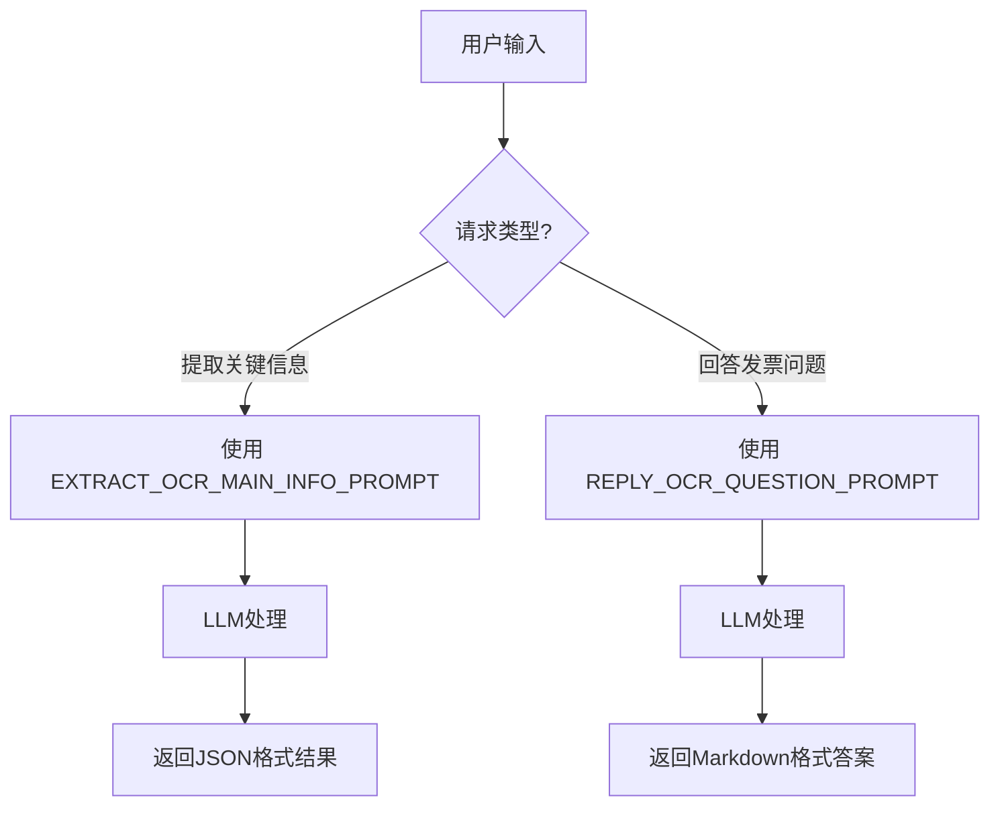

# `.\MetaGPT\metagpt\prompts\invoice_ocr.py` 详细设计文档

该文件定义了一个发票OCR助手的提示词模板库，包含用于从OCR识别结果中提取结构化信息（如收款人、城市、总费用、开票日期）以及回答用户关于发票问题的提示词模板。

## 整体流程



## 类结构

```
invoice_ocr.py (提示词模板文件)
├── 全局常量
│   ├── COMMON_PROMPT
│   ├── EXTRACT_OCR_MAIN_INFO_PROMPT
│   ├── REPLY_OCR_QUESTION_PROMPT
│   └── INVOICE_OCR_SUCCESS
└── (无类定义)
```

## 全局变量及字段


### `COMMON_PROMPT`
    
发票OCR识别的通用提示语前缀，用于构建其他更具体的提示词。

类型：`str`
    


### `EXTRACT_OCR_MAIN_INFO_PROMPT`
    
用于从OCR识别结果中提取收款人、城市、总费用和开票日期等关键信息的格式化提示词模板。

类型：`str`
    


### `REPLY_OCR_QUESTION_PROMPT`
    
用于基于OCR识别结果回答用户特定问题的格式化提示词模板。

类型：`str`
    


### `INVOICE_OCR_SUCCESS`
    
表示发票OCR任务成功完成的确认消息字符串。

类型：`str`
    


    

## 全局函数及方法


## 关键组件


### 通用提示词 (COMMON_PROMPT)

一个用于所有发票OCR相关提示的通用前缀，用于设定上下文，表明后续内容是基于OCR识别结果的。

### 信息提取提示词 (EXTRACT_OCR_MAIN_INFO_PROMPT)

一个结构化的提示词模板，用于指导大语言模型从OCR文本中提取特定字段（收款人、城市、总费用、开票日期），并强制要求以指定的JSON格式和语言返回结果。

### 问答回复提示词 (REPLY_OCR_QUESTION_PROMPT)

一个灵活的提示词模板，用于指导大语言模型基于OCR文本回答用户提出的任意问题，并强制要求以指定的语言、不返回原始OCR数据、并使用Markdown格式进行回复。

### 成功状态消息 (INVOICE_OCR_SUCCESS)

一个预定义的字符串常量，用于表示发票OCR任务已成功完成，可作为流程状态或用户反馈信息。


## 问题及建议


### 已知问题

-   **硬编码的JSON结构**：`EXTRACT_OCR_MAIN_INFO_PROMPT` 提示词中硬编码了输出JSON的键名（如`"收款人"`、`"城市"`）。这导致代码与特定语言（中文）和固定的输出模式强耦合。如果需要支持其他语言（如英文键名`"payee"`）或提取更多/不同的字段，必须修改源代码，违反了开闭原则。
-   **提示词模板缺乏验证**：提示词模板中使用了占位符 `{ocr_result}` 和 `{language}`，但代码中没有机制来确保在生成最终提示词字符串时这些占位符已被正确替换。如果调用方遗漏了某个参数，生成的提示词将包含未替换的占位符，可能导致大语言模型（LLM）无法正确理解指令。
-   **潜在的安全与注入风险**：`ocr_result` 和 `query` 的内容被直接拼接到提示词字符串中。如果这些输入包含特殊的标记或指令（例如，用户输入被设计为包含 `"""` 或试图结束JSON对象），可能会破坏提示词的结构，导致LLM执行非预期操作或输出格式错误。
-   **错误处理缺失**：当前模块仅定义了提示词字符串，没有任何错误处理逻辑。当使用这些提示词调用外部OCR或LLM服务时，如果服务失败或返回非预期格式，该模块无法提供任何帮助，所有错误处理责任都推给了调用方。
-   **配置化程度低**：发票的关键字段（如`payee`, `city`）和输出JSON的格式被硬编码在提示词中。如果业务需求变化（例如，需要增加“纳税人识别号”字段），需要直接修改源代码并重新部署，而不是通过配置文件进行管理。

### 优化建议

-   **将输出结构配置化**：将需要提取的字段列表及其对应的输出JSON键名（可支持多语言）抽取为配置（如字典、JSON文件或Pydantic模型）。`EXTRACT_OCR_MAIN_INFO_PROMPT` 的生成逻辑应读取此配置来动态构建输出格式描述部分。这提高了灵活性和可维护性。
-   **实现提示词模板引擎**：使用安全的字符串模板库（如Python的`string.Template`或更高级的`Jinja2`）来管理提示词。这可以确保所有必要变量都被替换，并能在模板渲染阶段提供基本的参数缺失检查。
-   **对用户输入进行清洗或转义**：在将 `ocr_result` 和 `query` 插入提示词之前，应对其进行适当的清洗或转义，以防止提示词注入攻击。例如，可以过滤掉可能破坏JSON或Markdown结构的特殊字符，或者使用模板引擎的自动转义功能。
-   **封装并增强健壮性**：将提示词定义封装在一个类中。该类可以提供方法（如`generate_extraction_prompt(ocr_result: str, language: str, fields_config: dict)`）来生成最终提示词，并在方法内部进行参数验证（如非空检查）、模板渲染和基本的错误处理（如捕获模板渲染异常）。
-   **分离关注点与定义接口**：明确本模块的职责是“提供发票OCR处理的提示词定义”。建议定义一个清晰的接口或基类，声明生成各类提示词的方法。这有助于在不同实现（如针对不同LLM优化提示词）之间切换，并方便单元测试。


## 其它


### 设计目标与约束

本模块的核心设计目标是提供一个轻量级、可配置的发票OCR结果后处理提示词模板库。其核心约束包括：
1.  **语言无关性**：通过 `{language}` 占位符支持多语言输出，提示词模板本身不绑定特定语言。
2.  **结构化输出**：对于关键信息提取任务，强制要求模型返回严格遵循指定键名的JSON格式，以确保下游系统能可靠解析。
3.  **内容隔离**：在问答任务中，明确禁止模型直接返回输入的原始OCR数据，要求其进行理解、归纳后作答。
4.  **提示词工程化**：将通用指令（`COMMON_PROMPT`）与特定任务指令分离，遵循DRY原则，便于维护和复用。

### 错误处理与异常设计

当前模块作为纯配置/模板文件，不包含运行时逻辑，因此无内置的错误处理机制。其错误处理完全依赖于调用方：
1.  **输入验证**：调用方需确保传入 `format()` 方法的 `ocr_result` 和 `language` 参数非空且格式正确。
2.  **模板渲染错误**：若占位符（如 `{ocr_result}`）与传入参数不匹配，Python的字符串格式化操作将抛出 `KeyError` 异常，需由调用方捕获处理。
3.  **模型输出合规性**：模板中虽定义了严格的输出格式（如JSON），但无法保证大语言模型（LLM）一定遵守。调用方必须对模型的返回结果进行有效性校验、解析和异常捕获（如 `json.JSONDecodeError`）。

### 数据流与状态机

本模块不涉及动态数据流或状态机。其数据流是静态的、单向的：
1.  **输入**：调用方提供 `ocr_result`（字符串）和 `language`（字符串）等参数。
2.  **处理**：通过Python的字符串格式化（如 `.format(ocr_result=..., language=...)`），将参数注入到对应的提示词模板常量中。
3.  **输出**：生成一个完整的、参数化的提示词字符串。该字符串将作为调用LLM API的输入（`prompt` 或 `message` 参数）。
4.  模块本身无状态，每次调用都是独立的。

### 外部依赖与接口契约

1.  **外部依赖**：
    *   **Python 3**：运行环境。
    *   **调用方逻辑**：依赖外部代码来导入本模块、格式化字符串，并将生成的提示词发送给LLM服务（如OpenAI API、本地模型等）。
    *   **LLM服务**：模块输出的提示词专为与大语言模型交互而设计，隐含依赖模型具备指令跟随、JSON格式输出、多语言理解等能力。

2.  **接口契约**：
    *   **提供的接口**：三个字符串常量 `COMMON_PROMPT`， `EXTRACT_OCR_MAIN_INFO_PROMPT`， `REPLY_OCR_QUESTION_PROMPT` 以及一个成功状态字符串 `INVOICE_OCR_SUCCESS`。
    *   **使用契约**：
        *   `EXTRACT_OCR_MAIN_INFO_PROMPT` 和 `REPLY_OCR_QUESTION_PROMPT` 必须使用 `.format()` 方法传入指定的参数。
        *   `EXTRACT_OCR_MAIN_INFO_PROMPT` 要求LLM返回特定JSON结构。
        *   `REPLY_OCR_QUESTION_PROMPT` 要求LLM返回Markdown格式的答案。
    *   **不变性**：所有导出的提示词常量应被视为不可变配置。任何修改都应在源码中进行，而非运行时。

    