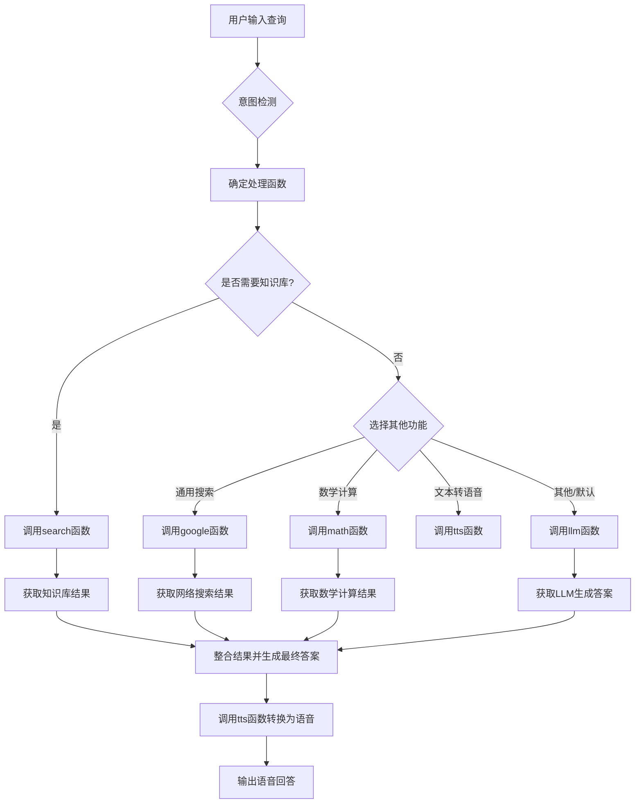

# `.\MetaGPT\metagpt\prompts\metagpt_sample.py` 详细设计文档

该代码定义了一个基于MetaGPT框架的个人助手系统规范，该系统能够根据用户查询意图，智能选择使用个人知识库搜索、通用搜索、数学计算或文本转语音等功能，最终以语音形式回答用户问题。

## 整体流程



## 类结构

```
MetaGPT框架 (概念性结构)
├── 核心功能模块
│   ├── llm (大语言模型接口)
│   ├── intent_detection (意图检测)
│   ├── add_doc (知识库文档添加)
│   ├── search (知识库向量搜索)
│   ├── google (通用网络搜索)
│   ├── math (数学公式计算)
│   └── tts (文本转语音)
└── 个人助手逻辑 (控制流)
    ├── 意图判断
    ├── 功能路由
    └── 语音输出集成
```

## 全局变量及字段


### `METAGPT_SAMPLE`
    
一个包含MetaGPT示例代码使用说明和用户需求的多行字符串常量，定义了个人助理的实现规范。

类型：`str`
    


    

## 全局函数及方法


## 关键组件


### 意图检测 (Intent Detection)

根据用户查询分析其意图，并返回对应的公共库函数名称，以指导后续调用合适的处理函数。

### 知识库管理 (Knowledge Base Management)

提供向个人知识库添加文档（文件或文件夹）以及基于向量检索进行搜索的功能，用于支持基于个人知识的问答。

### 大语言模型接口 (Large Language Model Interface)

提供一个通用的接口，允许向大语言模型提问并获取基于模型知识的文本回答。

### 网络搜索 (Web Search)

提供使用谷歌进行公开信息搜索的功能，以获取外部知识来补充回答。

### 数学计算 (Mathematical Calculation)

提供执行数学公式计算的功能，用于处理涉及数学运算的用户查询。

### 文本转语音 (Text-to-Speech)

提供将文本转换为音频文件的功能，用于实现语音回答的输出。

### 个人助理决策逻辑 (Personal Assistant Decision Logic)

核心控制逻辑，负责判断用户意图、决定是否使用个人知识库进行搜索，并协调调用上述各个组件来最终生成语音回答。


## 问题及建议


### 已知问题

-   **代码功能不完整**：提供的代码仅包含一个字符串常量 `METAGPT_SAMPLE`，该字符串描述了一个系统提示词（System Prompt）或任务规范，而非可执行的程序逻辑。没有实现任何类、函数或实际运行流程。
-   **依赖关系不明确**：提示词中要求使用一个名为 `metagpt` 的公共库，并列举了其函数（如 `llm`, `intent_detection` 等），但代码本身并未导入或使用该库。这只是一个设计规范，而非实现。
-   **缺乏错误处理机制**：描述的需求（如意图判断、知识库搜索、语音回答）涉及多个可能失败的环节（如网络请求、文件I/O、外部服务调用），但当前代码框架中完全没有考虑错误处理。
-   **硬编码的提示词**：核心逻辑（如何判断意图、何时使用知识库）被写死在字符串常量中，缺乏可配置性。修改业务逻辑需要直接修改源代码。
-   **潜在的资源管理问题**：需求中提到“添加文件或文件夹到知识库”（`add_doc`）和文本转语音（`tts`），这些操作可能涉及文件句柄、音频流等资源的打开与关闭，在未来的实现中若处理不当会导致资源泄漏。

### 优化建议

-   **实现核心架构**：根据 `METAGPT_SAMPLE` 中的描述，实现一个真正的 `PersonalAssistant` 类。该类应包含初始化方法（设置知识库路径等）、一个主要的 `process_query` 方法（处理用户输入），并内部调用意图判断、搜索、LLM问答、TTS等模块。
-   **模块化设计**：将“意图判断”、“知识库搜索”、“LLM调用”、“TTS生成”等功能拆分为独立的类或函数。例如，创建 `IntentDetector`、`KnowledgeBaseSearcher`、`LLMClient`、`TTSGenerator` 等类，通过依赖注入的方式组合到 `PersonalAssistant` 中，以提高可测试性和可维护性。
-   **引入配置管理**：将系统提示词、模型路径、API密钥、知识库位置等配置信息从代码中剥离，使用配置文件（如YAML、JSON）或环境变量进行管理。
-   **完善错误处理与日志**：在关键步骤（如外部API调用、文件操作）添加 `try-except` 块，定义明确的异常类型，并记录详细的日志，便于问题追踪和系统监控。
-   **实现资源上下文管理**：对于文件操作、网络连接等资源，使用 `with` 语句确保其被正确释放。例如，在 `add_doc` 和 `tts` 函数中确保文件被正确关闭。
-   **添加异步支持**：考虑到LLM调用、网络搜索、TTS转换等可能是耗时操作，建议使用异步编程（如 `asyncio`）来提高系统的并发处理能力和响应速度。
-   **编写单元测试与集成测试**：为各个模块（意图检测、搜索逻辑等）编写单元测试，并为整个助手流程编写集成测试，确保代码质量与功能稳定性。


## 其它


### 设计目标与约束

1.  **设计目标**：
    *   实现一个基于个人知识库的智能个人助理，能够理解用户意图，并调用合适的工具函数（包括知识库搜索、网络搜索、数学计算、文本转语音等）来回答问题。
    *   核心功能是意图识别与路由，根据用户查询动态选择最合适的处理流程。
    *   最终答案以语音形式输出，增强交互体验。
2.  **设计约束**：
    *   **技术栈限制**：只能使用 `metagpt` 公共库中已定义的函数，不能引入其他第三方库。这要求所有功能必须通过 `x.func()` 的形式调用。
    *   **架构约束**：响应必须封装在**单一函数**内，该函数需要尽可能完整地实现所有需求细节。
    *   **逻辑处理约束**：对于无法通过简单函数调用来解决的复杂逻辑，应设计提示词，交由底层大语言模型（LLM）处理，体现了“LLM as a Function”的设计思想。
    *   **输入/输出约束**：用户输入为文本查询，系统最终输出为音频文件（`.wav`格式）。

### 错误处理与异常设计

1.  **意图识别失败**：当 `intent_detection` 函数返回未知或无法处理的意图时，应有一个默认的降级处理策略。例如，可以回退到使用通用 `llm` 函数进行回答，或提示用户重新表述问题。
2.  **外部服务调用失败**：`google`（网络搜索）、`math`（公式计算）、`tts`（语音合成）等函数可能因网络、参数错误或服务不可用而失败。主函数应包含基本的 `try-except` 块来捕获异常，并向用户返回友好的错误信息（例如，“网络搜索暂时不可用，我将尝试从知识库中寻找答案”），而不是让程序崩溃。
3.  **知识库操作错误**：`add_doc` 和 `search` 函数可能因文件路径无效、格式不支持或索引错误而失败。需要验证输入路径，并在操作失败时记录日志或通知用户。
4.  **LLM 调用异常**：`llm` 函数可能因模型服务问题或超时返回错误。应有重试机制或备选方案。

### 数据流与状态机

1.  **数据流**：
    *   **输入**：用户文本查询（`str`）。
    *   **处理**：
        1.  **意图解析**：查询文本 -> `intent_detection` -> 意图标签（`str`）。
        2.  **路由与执行**：根据意图标签，选择执行分支（如 `search`, `google`, `math`, `llm` 等），并传入查询文本或处理后的参数。
        3.  **结果整合**：获取分支执行的结果（`str` 或 `list[str]`）。
        4.  **语音合成**：将最终文本结果 -> `tts` -> 音频文件（`.wav`）。
    *   **输出**：硬盘上的音频文件路径（由 `tts` 函数生成）。
2.  **状态机（逻辑流程）**：
    *   系统主要是一个**决策树**或**规则引擎**，其状态由 `intent_detection` 的输出决定。
    *   **关键状态（意图）**：可能包括 `“knowledge_base_search”`, `“web_search”`, `“calculation”`, `“general_qa”`, `“text_to_speech”`（虽然TTS是最终步骤，但可能也是一个独立意图）等。
    *   从一个状态（意图）到另一个状态的转换是线性的、基于规则匹配的，而非循环或复杂的状态转移。没有长期维持的对话状态。

### 外部依赖与接口契约

1.  **外部依赖**：
    *   **`metagpt` 公共库**：这是系统的核心依赖，提供了所有基础能力（AI、搜索、计算、语音）。
    *   **底层大语言模型（LLM）服务**：通过 `x.llm()` 间接依赖，用于通用问答和复杂逻辑处理。
    *   **互联网连接**：`x.google()` 函数依赖网络以进行实时搜索。
    *   **语音合成引擎**：`x.tts()` 函数依赖底层的TTS服务或库。
    *   **向量数据库/知识库引擎**：`x.add_doc()` 和 `x.search()` 函数背后依赖一个向量存储系统。
2.  **接口契约**：
    *   `x.intent_detection(query: str) -> str`：**契约**是返回一个预定义的、系统能识别的函数名字符串。如果意图无法识别，应返回一个特定的值（如 `“unknown”` 或 `“general”`），主函数需对此情况进行约定处理。
    *   `x.search(query: str) -> list[str]`：**契约**是返回一个字符串列表，通常为与查询最相关的知识库片段。主函数需要约定如何将这些片段组合成最终答案（例如，取前N个拼接，或再次用LLM总结）。
    *   `x.tts(text: str, wav_path: str) -> None`：**契约**是在指定路径生成音频文件。主函数需要约定生成音频的路径命名规则（如基于时间戳或查询内容哈希），并确保目录存在。
    *   主函数（待实现）与用户之间的契约是：输入一个查询字符串，系统在后台处理并在约定位置生成一个音频文件作为响应。

    