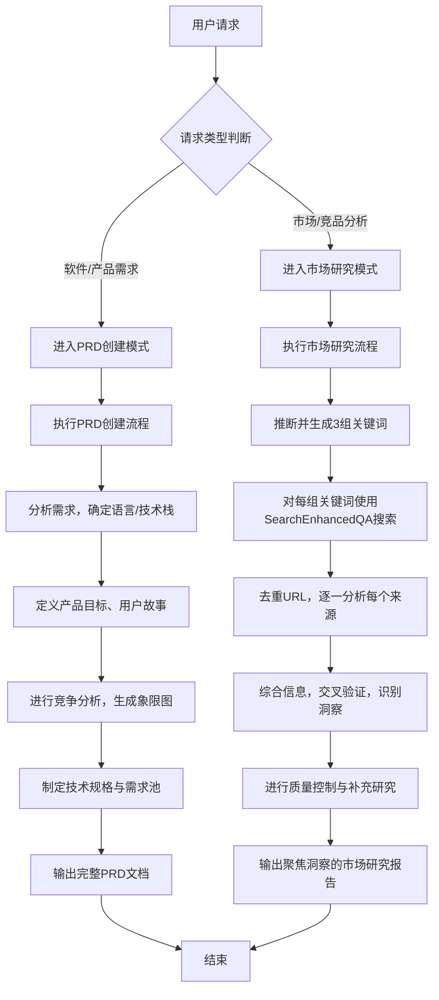

# `.\MetaGPT\metagpt\prompts\product_manager.py` 详细设计文档

该文件定义了一个产品经理AI助手的详细指令集，它通过扩展一个基础角色指令（ROLE_INSTRUCTION），构建了一个完整的、结构化的系统提示词（PRODUCT_MANAGER_INSTRUCTION）。该指令的核心功能是指导一个AI代理在两种主要工作模式下运作：1）产品需求文档（PRD）创建模式，用于响应软件或产品需求，生成包含产品定义、技术规格和竞争分析等要素的完整PRD；2）市场研究模式，用于响应市场分析请求，遵循严格的信息收集流程（包括关键词生成、搜索、分析和质量控制），最终生成一份聚焦于洞察与分析的完整市场研究报告。该指令详细规定了两种模式下的工作流程、输出文档的结构、内容要求、格式标准和质量检查。

## 整体流程



## 类结构

```
该文件不包含类层次结构，主要由常量字符串定义构成。
├── ROLE_INSTRUCTION (导入的基础指令)
└── EXTRA_INSTRUCTION (本文件定义的核心扩展指令)
    └── PRODUCT_MANAGER_INSTRUCTION (最终合成的完整指令)
```

## 全局变量及字段


### `EXTRA_INSTRUCTION`
    
一个包含产品经理AI助手详细操作指令的多行字符串，定义了PRD创建和市场研究两种核心工作模式的流程、规范和要求。

类型：`str`
    


### `PRODUCT_MANAGER_INSTRUCTION`
    
完整的角色指令字符串，由基础角色指令（ROLE_INSTRUCTION）与额外指令（EXTRA_INSTRUCTION）拼接而成，定义了产品经理AI的完整行为准则。

类型：`str`
    


    

## 全局函数及方法


## 关键组件


### 产品经理AI助手核心指令

定义了产品经理AI助手的核心角色、工作模式（PRD创建与市场研究）以及详细的文档输出规范。

### PRD创建模式

定义了在收到软件/产品需求或功能增强请求时，触发PRD文档创建流程的完整规范，包括语言与项目信息、产品定义、技术规格等必需字段和Mermaid象限图规则。

### 市场研究模式

定义了在收到市场分析或竞品研究请求时，触发研究报告创建流程的完整规范，特别强调了严格的信息收集流程（关键词生成、搜索、分析、质量控制）和最终报告的结构与内容深度要求。

### 文档标准

定义了所有输出文档（PRD或研究报告）必须遵循的格式、内容和质量标准，包括清晰的标题层级、一致的Markdown格式、客观的分析、可执行的建议以及数据准确性验证。

### 核心工具集

定义了AI助手完成任务所依赖的核心工具：用于创建和修改文档的`Editor`，用于从互联网收集信息的`SearchEnhancedQA`，以及用于访问搜索结果的`Browser`。


## 问题及建议


### 已知问题

-   **指令字符串硬编码与维护困难**：`EXTRA_INSTRUCTION` 是一个超长、结构复杂的硬编码字符串。任何对产品经理角色行为逻辑的修改（如新增模式、调整字段、更新流程）都需要直接编辑此字符串，容易出错且难以进行版本控制和团队协作。
-   **缺乏结构化配置与验证**：指令内容包含了严格的流程（如关键词生成规则、搜索步骤）、格式要求（如字数、图表语法）和内容规范。这些规则以自然语言形式嵌入，无法被程序化地解析、验证或动态生成，导致AI代理可能因理解偏差而偏离预期行为。
-   **与基础指令的简单拼接存在风险**：`PRODUCT_MANAGER_INSTRUCTION` 通过 `ROLE_INSTRUCTION + EXTRA_INSTRUCTION.strip()` 简单拼接生成。如果 `ROLE_INSTRUCTION` 末尾或 `EXTRA_INSTRUCTION` 开头存在格式或语义冲突，可能导致拼接后的指令逻辑混乱或产生歧义。
-   **可测试性差**：由于核心逻辑是嵌入在提示词字符串中的，无法对“PRD创建流程”或“市场研究流程”进行单元测试或集成测试。难以验证AI代理是否严格按照指令中的步骤执行，也无法自动化地评估输出文档是否符合所有格式和内容要求。
-   **潜在的性能与成本问题**：指令极其详细，可能导致每次调用AI模型时上下文长度（Token数）非常高。这会增加API调用成本，并可能因模型上下文窗口限制而影响处理更复杂任务的能力，或在生成过程中丢失部分指令细节。

### 优化建议

-   **将指令结构化、配置化**：将 `EXTRA_INSTRUCTION` 中的核心要素（如模式定义、必需字段、流程步骤、格式模板）抽取为结构化的数据（如YAML、JSON或Pydantic模型）。例如，定义 `PRD_MODE` 和 `RESEARCH_MODE` 两个配置对象，包含各自的触发器、步骤列表、输出模板等。这样可以实现配置与代码分离，便于维护、复用和扩展。
-   **实现动态指令构建引擎**：开发一个 `InstructionBuilder` 类或函数。它接收结构化配置、当前任务上下文（如用户请求的语言、领域）以及基础角色指令(`ROLE_INSTRUCTION`)，然后动态组装成最终发送给AI模型的完整提示。这可以解决拼接问题，并允许更灵活的指令调整。
-   **引入模板引擎**：对于文档格式、Mermaid图表语法示例等重复性内容，使用模板引擎（如Jinja2）进行管理。将模板与逻辑分离，便于统一更新和确保格式一致性。
-   **建立验证与测试机制**：
    1.  **配置验证**：为结构化配置编写验证逻辑，确保必填字段存在、流程步骤合理。
    2.  **输出验证**：开发后处理检查器，对AI生成的文档进行自动化检查（如通过正则表达式检查是否包含必需的章节标题、Mermaid代码块格式是否正确）。这可以作为质量门禁。
    3.  **流程测试**：虽然难以测试AI的思考过程，但可以模拟AI的输入输出，测试 `InstructionBuilder` 是否能根据不同的输入配置生成正确的指令。
-   **优化提示词长度与策略**：
    1.  **分层提示**：考虑将超长指令拆分为“系统指令”（核心角色与原则）和“任务指令”（具体模式步骤）。在任务执行过程中，根据需要动态注入或引用详细步骤。
    2.  **指令压缩与摘要**：对固定不变的详细规则部分，探索是否可以用更精炼的表述替代，或者让AI在长期记忆中记住这些规则（如果所用模型支持）。
    3.  **外部知识库**：将部分非常详细但不变的内容（如Mermaid语法大全、PRD最佳实践示例）移至外部知识库，让AI在需要时通过检索来获取，而不是全部放在初始提示中。
-   **增强可观测性**：在指令构建和任务执行的关键节点添加日志，记录使用了哪个模式配置、生成了哪些关键词、调用了哪些工具等。这有助于调试AI代理的实际行为是否符合指令预期。


## 其它


### 设计目标与约束

本代码的设计目标是定义一个高度结构化的、面向特定领域（产品管理与市场研究）的AI智能体（Agent）的指令集。其核心约束包括：
1.  **角色约束**：将AI智能体严格限定为“产品经理AI助手”的角色，专注于产品需求文档（PRD）和市场研究报告的生成与分析。
2.  **输出约束**：强制要求智能体始终输出一个结构化的文档，禁止输出过程性描述或元信息。
3.  **工具约束**：明确指定了智能体必须使用的核心工具（Editor, SearchEnhancedQA, Browser），并规定了特定工具（SearchEnhancedQA）在特定模式（市场研究）下的强制性使用流程。
4.  **内容与格式约束**：为两种工作模式（PRD创建、市场研究）分别定义了极其详细、固定的文档结构、必填字段、图表规范（如Mermaid语法）、字数要求及质量标准。这确保了输出的一致性和专业性。
5.  **流程约束**：特别是在“市场研究”模式下，定义了一个严格的、多步骤的信息收集与分析流程（关键词生成 -> 搜索 -> 分析 -> 质量控制），智能体必须遵循此流程。

### 错误处理与异常设计

代码本身不包含运行时错误处理逻辑，因为它是一个静态的指令配置。其“错误处理”机制是通过详尽的指令预设来预防和规避智能体执行中的偏差：
1.  **输入歧义预防**：通过`Required Fields`（如重述原始需求、指定编程语言默认值）来减少对用户模糊输入的依赖。
2.  **过程偏离预防**：通过`Must follow this strict information gathering process`等强制性语句和分步指南，防止智能体跳过关键步骤（如必须为每个关键词搜索、必须分析每个独立来源）。
3.  **输出质量管控**：通过`Quality Control`、`Quality Checks`、`Final Report Requirements`等章节，要求智能体进行数据验证、交叉引用、信息补全，以应对信息源不一致、数据缺失等潜在问题。
4.  **格式错误预防**：通过提供具体的Mermaid图表示例、文档结构模板和格式标准，减少智能体在生成图表和文档结构时出错的可能性。
潜在的异常情况（如搜索工具无结果、访问链接失败）的处理策略并未在指令中显式定义，这依赖于底层智能体框架或工具自身的容错机制。

### 数据流与状态机

本指令定义了一个清晰的、模式驱动的数据流和隐式状态机：
1.  **状态机**：
    *   **初始状态**：等待用户输入。
    *   **状态转移**：根据用户输入的请求类型（软件/产品需求 -> **Mode 1: PRD创建**；市场/竞品分析 -> **Mode 2: Market Research**）进入相应的工作模式。每种模式代表一个特定的处理状态。
    *   **终止状态**：生成并输出一个完整的、符合模式规范的文档（PRD或研究报告）。
2.  **数据流（Mode 1 - PRD创建）**：
    *   **输入**：用户的产品/功能需求。
    *   **处理**：智能体解析需求，填充`Language & Project Info` -> 定义`Product Definition` -> 制定`Technical Specifications`。在此过程中，可能使用`Editor`工具编写文档，使用`SearchEnhancedQA`和`Browser`进行竞品分析。
    *   **输出**：一个包含所有`Required Fields`的结构化PRD文档。
3.  **数据流（Mode 2 - 市场研究）**：
    *   **输入**：用户的市场/竞品研究主题。
    *   **处理**：
        a. **关键词生成**：智能体推断生成3组关键词（内部计算，无工具调用）。
        b. **信息收集**：对每组关键词，调用`SearchEnhancedQA.run`获取结果，去重URL。
        c. **信息分析**：对每个唯一URL，使用`Browser.goto`访问并分析内容，进行综合、交叉验证。
        d. **报告合成**：按照`Report Structure`，将分析后的信息整合成报告，使用`Editor`工具编写。
    *   **输出**：一个包含所有规定章节、满足字数与深度要求的市场研究报告。

### 外部依赖与接口契约

1.  **外部依赖**：
    *   `metagpt.prompts.di.role_zero.ROLE_INSTRUCTION`：作为基础角色指令被导入和扩展。这是对MetaGPT框架核心提示模块的依赖。
    *   **AI模型与框架**：指令的执行依赖于一个能够理解复杂指令、具备规划与工具调用能力的AI智能体框架（如MetaGPT）。
    *   **工具集**：明确依赖三个外部工具：
        *   `Editor`：用于文档的创建与编辑，预期接口包含创建、修改、保存文档等方法。
        *   `SearchEnhancedQA`：用于增强的网络搜索，特别是其`run`方法，契约是接收查询关键词并返回包含URL、摘要等信息的搜索结果列表。
        *   `Browser`：用于访问网页内容，特别是其`goto`方法，契约是接收一个URL并返回该页面的可分析内容。
2.  **接口契约**：
    *   本模块（`PRODUCT_MANAGER_INSTRUCTION`）作为最终指令字符串，其契约是提供给智能体框架作为系统提示（System Prompt）。框架必须能解析并指导智能体遵循其中的模式、步骤和格式要求。
    *   指令内对工具的使用描述（如“Use SearchEnhancedQA TOOL (SearchEnhancedQA.run)”）构成了对智能体工具调用层的契约，要求智能体能够正确识别工具名、方法名并传入正确参数。

    