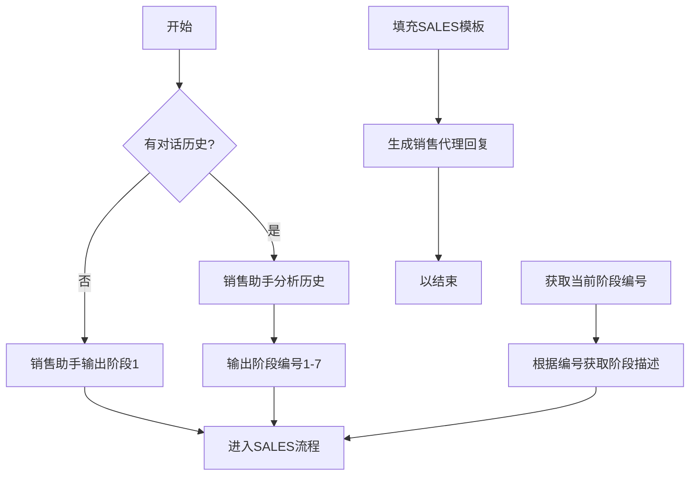

# `.\MetaGPT\metagpt\prompts\sales.py` 详细设计文档

该代码定义了一个销售对话系统的核心提示词模板和配置。它包含两个主要的大型语言模型（LLM）提示词模板：SALES_ASSISTANT 用于根据对话历史判断当前应进入的销售阶段（1-7），SALES 用于生成销售代理在特定阶段的对话回复。此外，还定义了一个 conversation_stages 字典，将阶段编号映射到详细的阶段描述。该代码为构建基于阶段的销售对话AI代理提供了必要的文本配置和逻辑定义。

## 整体流程



## 类结构

```
sales.py (配置文件)
├── 全局字符串常量
│   ├── SALES_ASSISTANT
│   └── SALES
└── 全局字典常量
    └── conversation_stages
```

## 全局变量及字段


### `SALES_ASSISTANT`
    
一个用于指导销售助手（Sales Assistant）判断当前销售对话应进入哪个阶段的系统提示词模板，它定义了对话阶段的分析逻辑和输出格式。

类型：`str`
    


### `SALES`
    
一个用于指导销售代理（Sales Agent）进行对话的系统提示词模板，它定义了销售代理的角色、公司背景、对话目标以及根据当前对话阶段和历史生成回复的规则。

类型：`str`
    


### `conversation_stages`
    
一个字典，将销售对话的各个阶段（用数字1-7作为键）映射到该阶段的详细描述和指导原则，为SALES_ASSISTANT和SALES提示词提供阶段定义。

类型：`dict[str, str]`
    


    

## 全局函数及方法


## 关键组件


### 销售对话阶段管理

定义了销售对话的七个标准阶段（从介绍到成交），并为每个阶段提供了详细的指导文本，用于引导销售助理的对话内容和行为。

### 销售助理系统提示

一个用于指导AI销售助理行为的系统提示模板，它定义了助理的身份、公司背景、联系目的、沟通方式，并规定了其响应格式（如保持简短、以`<END_OF_TURN>`结束），确保对话符合销售流程。

### 销售阶段决策提示

一个用于分析对话历史并决定下一步应进入哪个销售阶段的系统提示。它接收对话历史作为输入，并强制要求输出一个1到7之间的数字，代表建议的下一阶段，以此驱动对话的流程控制。


## 问题及建议


### 已知问题

-   **硬编码的提示词模板**：`SALES_ASSISTANT` 和 `SALES` 提示词模板直接以字符串形式嵌入代码中。这导致任何修改都需要直接更改源代码，降低了灵活性和可维护性。例如，调整销售流程、话术或阶段定义都需要开发者介入。
-   **缺乏配置管理**：关键的配置参数（如公司名称、业务描述、价值观等）没有与代码逻辑分离。它们被硬编码在 `SALES` 模板字符串中，使得为不同销售场景或客户定制化变得困难且容易出错。
-   **数据结构脆弱**：`conversation_stages` 字典的键（“1”到“7”）与 `SALES_ASSISTANT` 提示词中要求输出的数字（1到7）存在隐式耦合。这种依赖关系没有通过代码结构（如枚举类）来明确和固化，容易在修改时导致不一致。
-   **代码组织单一**：所有逻辑（提示词定义、阶段映射）都集中在一个模块的全局作用域中，没有进行面向对象的封装。随着功能扩展，代码会变得臃肿且难以管理。
-   **潜在的类型安全风险**：代码中大量使用字符串进行逻辑判断和映射（如阶段数字、历史记录），缺乏类型注解和验证，增加了运行时错误的风险。

### 优化建议

-   **外部化配置与提示词**：将 `SALES_ASSISTANT`、`SALES` 提示词模板以及 `conversation_stages` 的定义移至外部配置文件（如 YAML、JSON）或数据库。这样可以在不修改代码的情况下调整销售策略和话术。
-   **引入配置类**：创建一个 `SalesConfig` 类，用于集中管理公司信息、销售角色、对话目的等配置项。可以通过环境变量、配置文件或命令行参数来初始化这个类，实现配置与代码的分离。
-   **使用枚举定义对话阶段**：将对话阶段定义为 `Enum`（枚举）类，例如 `ConversationStage`。用枚举成员（如 `ConversationStage.INTRODUCTION`）替代字符串数字键，提高代码的可读性、类型安全性和可维护性。
-   **重构为面向对象设计**：
    -   创建 `SalesConversation` 类，封装对话历史、当前阶段、配置等状态。
    -   创建 `SalesAgent` 类，负责根据当前状态和提示词生成回复。
    -   创建 `StageDecider` 类（或方法），专门负责根据历史记录判断下一阶段，实现单一职责原则。
-   **增加输入验证与错误处理**：为关键函数（如阶段判断、回复生成）添加输入参数验证，确保传入的对话历史等数据格式正确。添加适当的异常处理机制，提高系统的健壮性。
-   **添加日志记录**：在关键决策点（如阶段转换、生成回复）添加日志记录，便于调试和监控销售对话的流程，分析模型决策。
-   **考虑提示词模板引擎**：如果提示词模板变得复杂，可以考虑使用成熟的模板引擎（如 Jinja2）来管理，支持条件判断、循环等高级功能，使提示词更动态、更易维护。


## 其它


### 设计目标与约束

本代码模块的核心设计目标是实现一个基于规则和模板的销售对话管理系统。它通过定义销售对话的七个标准阶段（从介绍到成交），并提供一个销售助手提示词（`SALES_ASSISTANT`）来自动判断当前对话应处于哪个阶段，以及一个销售代理提示词（`SALES`）来根据当前阶段和历史对话生成符合角色设定的回应。主要约束包括：1) 响应必须简洁，避免列表，以保持用户注意力；2) 每次只生成一个回应，并以`<END_OF_TURN>`标记结束；3) 阶段判断逻辑仅基于`===`标记之间的对话历史，输出严格限定为1-7的数字；4) 销售代理的身份、公司信息、对话目的等通过模板变量动态注入，确保对话的个性化和一致性。

### 错误处理与异常设计

当前代码未显式包含错误处理或异常捕获机制。其健壮性依赖于外部调用者（如LLM接口）正确处理其输出的字符串，以及正确格式化输入的变量（如`{conversation_history}`）。潜在风险包括：1) 如果`conversation_history`格式不符合预期（例如，不包含`===`分隔符），`SALES_ASSISTANT`的逻辑可能失效；2) 模板变量未正确填充可能导致`SALES`提示词生成无意义或格式错误的内容；3) 依赖外部系统解析`<END_OF_TURN>`标记以进行对话轮次切换。建议在调用层增加输入验证和模板变量检查，并对LLM的响应进行后处理，以确保输出格式符合预期。

### 数据流与状态机

系统隐含一个简单的状态机，其状态由`conversation_stages`字典中的7个阶段定义。数据流如下：1) **输入**：历史对话记录（`conversation_history`）、销售代理信息（`salesperson_name`, `company_name`等）、当前对话阶段（`conversation_stage`）。2) **处理**：`SALES_ASSISTANT`提示词与历史对话结合，发送给LLM，输出下一个阶段编号（1-7）。该编号用于查找`conversation_stages`中的阶段描述。3) **输出**：`SALES`提示词与所有输入变量结合，生成销售代理的下一条消息，以`<END_OF_TURN>`结尾。状态转换由`SALES_ASSISTANT`的输出驱动，但转换逻辑（即基于对话历史判断下一阶段）完全封装在LLM中，本代码仅提供提示词规则。

### 外部依赖与接口契约

本模块高度依赖外部大型语言模型（LLM）服务，如OpenAI的GPT系列。接口契约是非正式的，基于提示词工程：1) **提供给LLM的输入**：必须是符合`SALES_ASSISTANT`或`SALES`模板格式的字符串。2) **期望从LLM获得的输出**：对于`SALES_ASSISTANT`，输出必须是单个数字字符（1-7）。对于`SALES`，输出是一段自然语言文本，并以`<END_OF_TURN>`结尾。模块本身不包含网络调用或API客户端，它只是生成符合这些契约的提示词字符串。因此，调用者必须负责集成LLM SDK、处理网络错误、管理API速率限制和成本。

### 配置与可维护性

系统的行为由三个全局字符串常量（`SALES_ASSISTANT`, `SALES`, `conversation_stages`）控制。这是一种硬编码的配置方式，优点是简单明了。然而，这也带来了可维护性挑战：1) **修改困难**：任何对销售流程、公司话术或阶段定义的调整都需要直接修改源代码。2) **缺乏国际化支持**：提示词和阶段描述均为英文，难以适配其他语言市场。3) **测试复杂度**：由于逻辑嵌入在长文本提示词中，进行单元测试或验证提示词有效性较为困难。建议将提示词模板和阶段定义抽取到外部配置文件（如JSON、YAML）或数据库中，以便于动态更新和管理。

    