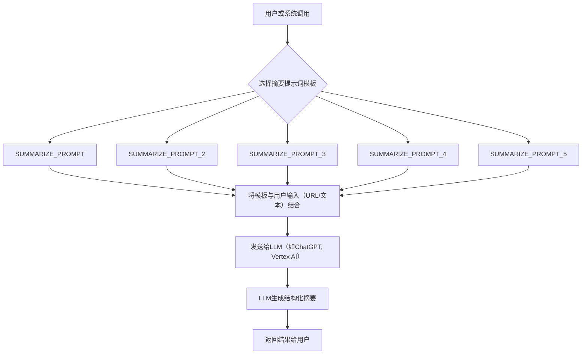

# `.\MetaGPT\metagpt\prompts\summarize.py` 详细设计文档

该文件是一个提示词（Prompt）集合，主要用于文本摘要任务。它包含了从不同来源（如Chrome插件和Google Cloud Platform）收集的多个预定义的提示词模板，用于指导大型语言模型（如ChatGPT、Vertex AI等）生成不同格式和风格的文本摘要，包括简短摘要、要点列表、TL;DR（太长不看）版本以及对话摘要等。

## 整体流程



## 类结构

```
该文件不包含类定义，仅包含全局字符串常量。
```

## 全局变量及字段


### `SUMMARIZE_PROMPT`
    
用于指导AI生成包含摘要和事实要点的文本摘要的提示词模板，支持从URL或给定内容中提取信息。

类型：`str`
    


### `SUMMARIZE_PROMPT_2`
    
用于生成不超过三句话的极简短摘要的提示词，示例内容关于量子计算与量子纠错。

类型：`str`
    


### `SUMMARIZE_PROMPT_3`
    
用于生成TL;DR（Too Long; Didn't Read）式极简摘要的提示词，示例内容关于量子计算与量子纠错。

类型：`str`
    


### `SUMMARIZE_PROMPT_4`
    
用于生成包含四个要点列表的简短摘要的提示词，示例内容关于量子计算与量子纠错。

类型：`str`
    


### `SUMMARIZE_PROMPT_5`
    
用于总结对话内容并提取支持代理待办事项的提示词，示例为一个客户服务对话。

类型：`str`
    


    

## 全局函数及方法


## 关键组件


### 文本摘要提示模板 (SUMMARIZE_PROMPT)

一个用于指导AI模型生成结构化摘要的通用提示模板，要求输出包含摘要和事实列表，并支持根据输入源（URL或直接文本）动态选择内容。

### 量子计算摘要示例 (SUMMARIZE_PROMPT_2, SUMMARIZE_PROMPT_3, SUMMARIZE_PROMPT_4)

一组用于演示不同摘要风格（如极简总结、TL;DR、要点列表）的示例提示，均以同一段关于量子计算和量子纠错的科普文本作为输入内容。

### 对话摘要示例 (SUMMARIZE_PROMPT_5)

一个用于演示如何从客服对话中提取摘要和待办事项的示例提示，展示了提示工程在特定领域（如客户支持）的应用。


## 问题及建议


### 已知问题

-   **代码功能不完整**：当前文件仅定义了多个用于文本摘要的提示词模板字符串，并未包含任何实际的代码逻辑（如类、函数、变量）来加载、处理或使用这些模板。它更像一个配置或资源文件，而非一个可运行的模块。
-   **缺乏模块化和可维护性**：所有提示词模板都以独立的全局变量形式硬编码在文件中。随着提示词数量增加，管理、查找和修改会变得困难，容易出错。
-   **存在未使用的代码和潜在依赖**：注释中提到了外部资源（如Chrome插件、GCP VertexAI笔记本）和占位符变量（如`{{SELECTED_LANGUAGE}}`、`{{URL}}`、`{{CONTENT}}`），但代码中并未实现对这些占位符的替换逻辑或对外部资源的引用处理，这可能导致提示词无法直接使用或功能缺失。
-   **命名和结构不一致**：变量命名从`SUMMARIZE_PROMPT`到`SUMMARIZE_PROMPT_5`，缺乏描述性。同时，提示词的内容格式（如摘要、要点、TL;DR）和用途（总结网页、对话、技术文章）混杂在一起，没有清晰的分类或组织。
-   **缺乏文档和示例**：虽然每个变量上方有注释说明来源，但缺少关于如何在项目中具体使用这些提示词、它们的预期输入输出格式、以及如何处理其中动态部分（如`{{CONTENT}}`）的说明。

### 优化建议

-   **重构为配置驱动**：建议将所有的提示词模板移出代码文件，放入一个结构化的配置文件（如JSON、YAML或TOML）中。可以按用途（如“通用摘要”、“对话摘要”、“技术摘要”）或格式（如“要点式”、“段落式”）进行分类。这样可以实现代码与配置的分离，便于非开发者修改和扩展。
-   **创建提示词管理类**：设计一个`PromptManager`或`SummarizationPrompt`类。该类负责从配置文件加载提示词模板，并提供方法（如`get_prompt(template_name, variables)`）来根据名称获取模板，并替换其中的动态变量（如`{{SELECTED_LANGUAGE}}`）。这将提高代码的封装性和复用性。
-   **统一命名并补充元数据**：为每个提示词模板定义更具描述性的键名（如`web_summary_with_bullets`、`conversation_summary_with_todos`）。在配置中，除了模板字符串本身，还可以为每个模板添加`description`、`input_requirements`、`output_format`等元数据字段，增强可读性和可维护性。
-   **实现变量替换逻辑**：在提示词管理类中，实现一个安全的变量替换机制。当调用`get_prompt`时，传入一个字典（如`{'SELECTED_LANGUAGE': '中文', 'CONTENT': some_text}`）来填充模板中的占位符，确保提示词在发送给AI模型前是完整和可用的。
-   **添加单元测试和验证**：为提示词管理类编写单元测试，确保模板加载正确、变量替换无误，并且生成的最终提示词符合预期格式。这有助于在修改配置或代码时防止回归错误。
-   **提供使用示例**：在代码库的README或专门的文档中，提供如何使用这些摘要提示词的完整示例，包括如何初始化管理器、选择模板、传入变量以及处理返回的摘要结果。


## 其它


### 设计目标与约束

本代码模块的核心设计目标是提供一个可复用的、用于文本摘要任务的提示词（Prompt）集合。它不包含任何执行逻辑，而是作为一个静态的提示词库。其主要约束包括：1) **静态性**：所有内容均为预定义的字符串常量，不支持运行时动态生成或修改。2) **单一职责**：仅负责存储和提供提示词模板，不涉及任何文本处理、模型调用或结果解析功能。3) **外部依赖**：其有效性完全依赖于外部系统（如LLM API）对这些提示词模板的正确解析和执行。

### 错误处理与异常设计

由于本模块仅包含常量定义，不包含任何可执行代码逻辑，因此**不存在运行时错误处理或异常设计**。任何与这些提示词相关的错误（如模板语法错误、变量替换失败、模型调用异常等）都将在使用这些常量的外部代码中发生和处理。本模块的设计前提是假设这些字符串常量在语法上是正确的。

### 数据流与状态机

本模块**不涉及数据流或状态机**。它由一系列独立的、在模块加载时即被初始化的字符串常量（`SUMMARIZE_PROMPT` 等）组成。这些常量之间没有调用关系、依赖关系或状态转移。它们作为数据（知识）被外部代码读取和使用，自身不具备处理数据或改变状态的能力。

### 外部依赖与接口契约

1.  **外部依赖**：本模块的功能性依赖完全在于外部系统。
    *   **大型语言模型（LLM）服务**：如OpenAI ChatGPT、Google Vertex AI等。这些常量是专门为与这类服务交互而设计的提示词模板。
    *   **使用本模块的客户端代码**：客户端代码负责获取输入内容（如URL、文本、对话记录），将这些内容按照模板中的占位符（如`{{SELECTED_LANGUAGE}}`， `{{CONTENT}}`）进行格式化，并发送给LLM服务。

2.  **接口契约**：
    *   **提供方契约（本模块）**：以模块级全局变量的形式，提供一系列符合特定格式要求的字符串常量。这些常量是稳定的、公开的接口。
    *   **消费方契约（客户端代码）**：客户端代码应理解每个`SUMMARIZE_PROMPT_X`常量的预期输入格式和输出格式。例如，`SUMMARIZE_PROMPT`期望客户端提供`SELECTED_LANGUAGE`、`URL`、`CONTENT`等变量，并预期LLM返回包含“### Summary”和“### Facts”部分的Markdown文本。
    *   **隐式契约**：每个提示词常量都隐含了对LLM模型能力的假设（如理解指令、生成特定格式文本）。客户端需确保使用的LLM满足这些假设。

    