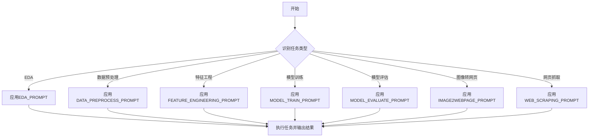

# `.\MetaGPT\metagpt\prompts\task_type.py` 详细设计文档

该文件定义了一系列用于不同机器学习或数据处理任务的提示词模板。每个模板都是一个多行字符串，包含了针对特定任务（如探索性数据分析、数据预处理、特征工程、模型训练、模型评估、图像转网页和网页抓取）的详细指导原则、注意事项和最佳实践。这些提示词旨在引导AI助手或自动化系统在执行相应任务时遵循一致的规范和约束，确保任务执行的正确性、高效性和结果质量。

## 整体流程



## 类结构

```
该文件不包含类定义，仅包含全局变量（提示词字符串常量）。
```

## 全局变量及字段


### `EDA_PROMPT`
    
用于指导执行探索性数据分析（EDA）任务的提示文本，包含数据类型区分和可视化建议。

类型：`str`
    


### `DATA_PREPROCESS_PROMPT`
    
用于指导执行数据预处理任务的提示文本，强调数据操作规范、标签列保护及训练/测试集一致性处理。

类型：`str`
    


### `FEATURE_ENGINEERING_PROMPT`
    
用于指导执行特征工程任务的提示文本，关注特征多样性、避免冗余、ID列排除及与标签列的隔离。

类型：`str`
    


### `MODEL_TRAIN_PROMPT`
    
用于指导执行模型训练任务的提示文本，根据数据类型推荐模型库，强调性能优先和超参数调优。

类型：`str`
    


### `MODEL_EVALUATE_PROMPT`
    
用于指导执行模型评估任务的提示文本，确保评估数据与训练数据处理一致，并复用已有模型对象。

类型：`str`
    


### `IMAGE2WEBPAGE_PROMPT`
    
用于指导执行图像转网页代码任务的提示文本，要求单步生成完整代码（HTML/CSS/JS）并使用指定保存方法。

类型：`str`
    


### `WEB_SCRAPING_PROMPT`
    
用于指导执行网络爬虫任务的提示文本，强调先分析HTML结构、基于实际元素属性编写代码及复用已有HTML对象。

类型：`str`
    


    

## 全局函数及方法


## 关键组件


### 任务特定提示词系统

一个用于指导不同机器学习或数据处理任务执行的提示词集合，每个提示词都封装了特定任务（如EDA、数据预处理、特征工程、模型训练等）的最佳实践、约束条件和操作指南。

### 数据预处理约束

定义了在数据预处理任务中必须遵守的核心规则，包括禁止修改标签列、避免使用独热编码、对训练集和测试集进行独立但一致的处理，以及始终在副本上进行操作以确保数据完整性。

### 特征工程原则

规定了特征工程任务的操作准则，强调生成多样化但非冗余的特征、排除ID列、禁止使用标签列（分类编码除外）创建特征，并确保对训练集和开发/测试集应用相同的工程操作。

### 模型选择与训练策略

为模型训练任务提供了模型库选择和性能优化指导，针对表格、图像和文本数据集推荐了相应的先进模型，并强调以避免高训练时间的模型（如SVM）为代价来优先追求模型性能。

### 任务间数据流管理

在多个任务提示词中（如特征工程、模型训练、模型评估）明确要求直接使用上游任务的输出结果，禁止模拟或重新加载数据/模型，从而确保了任务管道中数据流和状态的一致性。


## 问题及建议


### 已知问题

-   **提示词内容重复与不一致**：多个提示词（如 `DATA_PREPROCESS_PROMPT` 和 `FEATURE_ENGINEERING_PROMPT`）都包含了“Always copy the DataFrame before processing it and use the copy to process.”这条规则。这种重复不仅增加了维护成本，也暗示了这些规则可能缺乏一个统一的、可复用的抽象层。
-   **硬编码的模型与技术栈**：`MODEL_TRAIN_PROMPT` 中为不同类型的数据集（表格、图像、文本）硬编码了推荐的模型列表（如 XGBoost, Swin Transformer, BERT）。这限制了系统的灵活性和可扩展性，当有新的、更优的模型出现时，需要直接修改源代码。
-   **职责边界模糊**：部分提示词包含了超出其核心职责的指令。例如，`MODEL_TRAIN_PROMPT` 中包含了数据预处理步骤（“If non-numeric columns exist, perform label encode together with all steps.”），这模糊了“模型训练”与“数据预处理/特征工程”任务之间的边界，可能导致逻辑混乱和代码重复。
-   **缺乏结构化配置**：所有提示词都以多行字符串的形式硬编码在模块顶层。随着提示词数量增加或内容变复杂，这种形式难以管理、版本控制和进行动态调整（例如，根据不同环境或用户角色切换提示词）。
-   **潜在的上下文遗漏风险**：`FEATURE_ENGINEERING_PROMPT` 和 `MODEL_TRAIN_PROMPT` 都强调“Use the data from previous task result directly”，但 `MODEL_EVALUATE_PROMPT` 额外提醒需要检查数据是否经过相同处理并使用‘Done Tasks’中的对象进行转换。这暴露了任务间数据流传递和状态管理依赖口头约定而非强制机制，容易出错。

### 优化建议

-   **提炼与统一公共规则**：将重复出现的规则（如 DataFrame 拷贝、任务间数据传递规范）抽取为独立的、版本化的指导原则或基础提示词模板。各具体任务提示词通过引用或继承这些基础规则来构建，确保一致性和便于集中修改。
-   **实现可插拔的模型/技术注册机制**：将模型推荐列表从硬编码改为可配置的注册表或策略模式。可以定义一个 `ModelRegistry` 类，允许运行时根据数据集类型、任务目标、资源约束等条件动态查询和推荐最适合的模型或技术栈，提升系统适应性和可维护性。
-   **明确任务职责与接口契约**：重构提示词，严格限定每个任务的核心职责。例如，将数据编码等预处理逻辑完全移入 `DATA_PREPROCESS_PROMPT`。同时，明确定义任务间的输入输出接口契约（如规定上游任务必须输出处理后的数据和相应的转换器对象），并在代码层面通过类型注解或轻量级数据结构（如 Pydantic 模型）进行约束。
-   **将提示词外部化与结构化**：将提示词内容移出代码文件，存储到配置文件（如 YAML、JSON）或数据库中。为每个提示词定义结构化的字段，如 `name`、`task_type`、`core_instruction`、`constraints`、`examples` 等。这样可以实现提示词的热加载、A/B 测试和更精细的权限管理。
-   **设计显式的任务上下文传递机制**：建立一个轻量级的“任务上下文”或“工作流状态”对象，在任务链中传递。该对象应强制包含必要的中间数据、转换器、模型等引用，并可能包含数据谱系信息。`MODEL_EVALUATE_PROMPT` 中的检查逻辑可以转化为对该上下文对象中特定属性的验证，从而降低对开发者记忆的依赖，提高可靠性。


## 其它


### 设计目标与约束

本代码库的核心设计目标是提供一个可配置、可扩展的提示词（Prompt）管理系统，用于指导不同领域（如数据分析、机器学习、网页开发）的AI代理任务执行。其核心约束包括：1) **领域隔离**：每个提示词严格对应一个特定任务领域（如`eda`, `data_preprocess`），确保指导的专一性。2) **操作指导性**：提示词内容需提供具体、可操作的技术指导与最佳实践，而非泛泛而谈。3) **上下文连贯性**：部分提示词（如`feature_engineering`, `model_train`）强调利用前序任务的结果，避免数据/模型的重载或模拟，以维持任务链的上下文一致性。4) **非侵入性**：作为配置模块，代码本身不包含任何执行逻辑，仅提供静态的文本配置。

### 错误处理与异常设计

由于当前代码模块完全由常量字符串定义组成，不包含任何运行时逻辑、函数或类，因此**不存在运行时错误处理或异常设计**。任何与这些提示词使用相关的错误（如提示词未被正确解析、任务类型不匹配）都将在消费这些常量的外部系统（如AI代理执行引擎）中处理。本模块的设计假设是：所有定义的字符串常量都是语法正确且内容完整的。潜在的“错误”仅限于提示词内容的逻辑矛盾或指导缺失，这需要通过代码审查和更新提示词文本来解决，而非通过程序化的异常机制。

### 数据流与状态机

本模块不涉及传统的数据处理流程或状态转换。其“数据流”实质上是**配置信息的静态引用流**。外部系统根据任务类型（如接收到“data_preprocess”指令）来索引对应的常量（`DATA_PREPROCESS_PROMPT`），并将其作为上下文提供给AI模型。这是一个简单的键值映射关系：`任务类型 -> 提示词文本`。不存在状态机，因为模块本身无状态；所有提示词在程序初始化后即加载到内存中，并保持不变，直到程序重启或配置被重新加载。

### 外部依赖与接口契约

1.  **外部依赖**：本模块无直接的三方库依赖。其功能性依赖在于**外部执行环境**，即一个能够接收并利用这些文本提示词的AI代理框架或系统（如基于LLM的自动化任务执行平台）。
2.  **接口契约**：
    *   **提供方契约（本模块）**：模块通过全局变量（如`EDA_PROMPT`）公开一系列字符串常量。契约保证这些变量的名称能清晰表明其用途，且其字符串值包含针对特定任务的有效指导。
    *   **消费方契约（外部系统）**：消费这些提示词的外部系统需要：a) 知晓本模块中定义的所有任务类型常量名。b) 在需要时通过变量名正确引用提示词文本。c) 负责将提示词文本与用户查询、历史上下文等组合，形成完整的请求发送给AI模型。

### 配置管理与可维护性

1.  **配置结构**：当前采用扁平化的Python模块级变量进行配置。每个任务类型对应一个独立的全局字符串常量，结构简单清晰。
2.  **可维护性考量**：
    *   **优点**：集中管理，易于查找和修改。添加新任务类型只需新增一个常量。
    *   **潜在改进**：随着提示词数量增多或内容变长（例如需要支持多语言），可考虑将提示词移至外部配置文件（如YAML、JSON）或数据库中，实现配置与代码分离，并支持动态更新。
    *   **版本控制**：提示词的修改应纳入版本控制系统。重大的提示词更新可能影响下游AI代理的行为，需有相应的测试和回滚机制。

### 安全性与合规性

1.  **内容安全**：提示词内容本身是静态文本，不执行代码，因此无代码注入风险。但需注意提示词中不应包含敏感信息（如内部API密钥、硬编码的个人数据）。
2.  **输出引导**：提示词承担着引导AI模型安全、合规操作的责任。例如，`WEB_SCRAPING_PROMPT`中强调分析实际HTML结构而非依赖先验知识，这有助于避免因误解而爬取不该爬取的数据，间接符合数据采集的合规性要求。`DATA_PREPROCESS_PROMPT`中强调不对标签列进行操作，这是机器学习中的一项重要安全约束，防止数据泄露。所有提示词都应定期审查，以确保其引导方向符合伦理和法律规范。

    