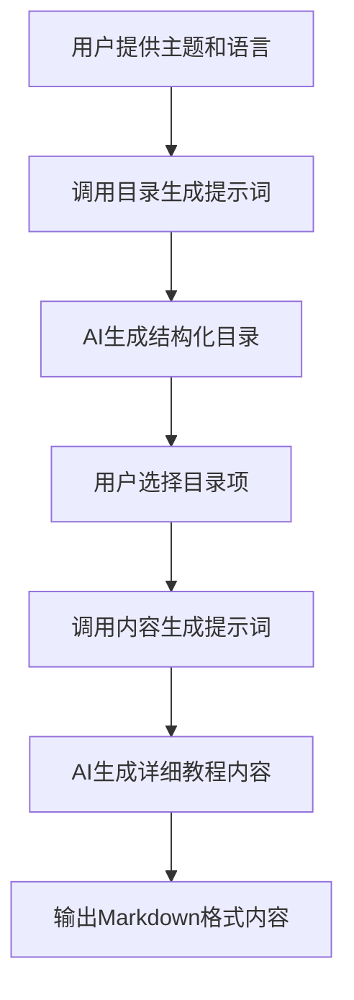

# `.\MetaGPT\metagpt\prompts\tutorial_assistant.py` 详细设计文档

该文件定义了一个教程助手的提示词模板系统，包含用于生成技术教程目录和内容的预定义提示词模板。这些模板通过字符串格式化接收主题和语言等参数，指导AI生成结构化的教程输出。

## 整体流程



## 类结构

```
提示词模板系统
├── COMMON_PROMPT (基础提示词)
├── DIRECTORY_PROMPT (目录生成提示词)
└── CONTENT_PROMPT (内容生成提示词)
```

## 全局变量及字段


### `COMMON_PROMPT`
    
定义教程助手的通用提示语模板，用于设定AI的角色和任务基础。

类型：`str`
    


### `DIRECTORY_PROMPT`
    
基于COMMON_PROMPT构建，用于生成特定技术教程目录结构的提示语模板，要求输出结构化的目录字典。

类型：`str`
    


### `CONTENT_PROMPT`
    
基于COMMON_PROMPT构建，用于根据给定的目录标题生成详细教程内容（包括原理和代码示例）的提示语模板，要求遵循Markdown格式。

类型：`str`
    


    

## 全局函数及方法


## 关键组件


### 提示词模板系统

定义了一套用于生成技术教程的提示词模板，包括通用提示、目录生成提示和内容生成提示，通过模板化和参数化实现了提示的复用和定制。

### 参数化与格式化

支持通过占位符（如 `{topic}`, `{language}`, `{directory}`）进行动态内容注入，并严格规定了输出格式（如字典格式、Markdown语法），确保生成内容的结构化和规范性。

### 分层内容生成策略

采用分步生成策略，首先通过 `DIRECTORY_PROMPT` 生成教程目录结构，再基于此目录通过 `CONTENT_PROMPT` 生成每个章节的详细内容，实现了从大纲到详情的可控内容生成流程。


## 问题及建议


### 已知问题

-   **硬编码的提示词模板**：所有提示词模板（`COMMON_PROMPT`, `DIRECTORY_PROMPT`, `CONTENT_PROMPT`）都以字符串字面量的形式硬编码在模块中。这使得修改、扩展或根据不同环境（如开发、测试、生产）调整提示词变得困难，需要直接修改源代码。
-   **缺乏输入验证与转义**：模板中使用了 `{topic}`, `{language}`, `{directory}` 等占位符进行字符串格式化。当前代码没有对传入这些占位符的值进行任何验证或转义。如果用户输入包含特殊字符（如花括号 `{}`），可能导致字符串格式化错误或潜在的提示词注入风险。
-   **脆弱的数据格式约定**：`DIRECTORY_PROMPT` 要求大语言模型输出一个严格的字典格式（如 `{"title": "xxx", "directory": [{"dir 1": ["sub dir 1", "sub dir 2"]}, {"dir 2": ["sub dir 3", "sub dir 4"]}]}`）。这种约定非常脆弱，完全依赖于大语言模型的“遵守程度”。模型输出的任何微小偏差（如额外的空格、换行、键名变化、列表与字典的嵌套差异）都会导致下游解析代码失败。
-   **模块职责模糊**：当前文件 (`tutorial_assistant.py`) 的 `@Describe` 注释表明其职责是“Tutorial Assistant's prompt templates”，即存放提示词模板。然而，它也可能被期望承担提示词组装或管理的职责。这种模糊性可能导致代码组织上的混乱。
-   **可维护性挑战**：提示词字符串较长且包含复杂的格式要求，全部堆叠在变量赋值语句中，可读性较差。当需要调整提示词逻辑或翻译成多语言时，维护成本高。

### 优化建议

-   **外部化配置提示词**：将 `COMMON_PROMPT`, `DIRECTORY_PROMPT`, `CONTENT_PROMPT` 等模板移至外部配置文件（如 JSON、YAML）或数据库中。这样可以在不重新部署代码的情况下修改提示词，并方便支持多套提示词策略。
-   **实现模板安全渲染机制**：创建一个专门的函数或类来渲染提示词模板。在此过程中，应对输入参数进行验证（如非空检查、语言代码有效性）、清理和转义，以防止格式化错误和注入攻击。可以考虑使用更安全的模板引擎（如 Jinja2，并配置自动转义）。
-   **定义并验证结构化输出模式**：与其依赖模型输出脆弱的字典字符串，不如明确定义一个目录结构的 Pydantic 模型或 JSON Schema。在调用大语言模型时，使用其“结构化输出”功能（如果支持）直接请求符合该模式的对象。如果不支持，则在解析模型返回的文本后，使用定义好的模式进行验证和标准化，确保数据结构的可靠性。
-   **明确模块职责与重构**：明确本模块的职责。如果仅是存储，可重命名为 `prompt_templates.py` 并保持现状。如果需要管理，则应创建一个 `PromptManager` 或 `TemplateEngine` 类，将模板加载、渲染、验证等逻辑封装在内，提高代码的内聚性和可测试性。
-   **提升代码可读性与可维护性**：
    -   对于长字符串，可以使用 Python 的三引号和多行字符串，但注意缩进。或者将每部分提示词拆分为更小的片段，最后组合。
    -   为每个提示词变量添加更详细的文档字符串，说明其用途、占位符、期望的输出格式。
    -   考虑将不同语言的提示词模板分开管理，以支持国际化。


## 其它


### 设计目标与约束

本模块的核心设计目标是提供一个可配置、结构化的提示词模板库，用于驱动大语言模型生成特定格式的技术教程内容。主要约束包括：
1.  **输出格式约束**：必须严格遵循指定的语言、数据结构（如JSON字典）和排版格式（如Markdown），以确保下游处理的一致性。
2.  **内容结构约束**：生成的教程需具备清晰的目录层级（一级、二级目录）和充实的内容，目录需有实际意义。
3.  **无冗余约束**：输出内容应简洁，避免不必要的空格、换行、总结性话语或重复主题。
4.  **模块化约束**：通过`COMMON_PROMPT`实现基础指令的复用，`DIRECTORY_PROMPT`和`CONTENT_PROMPT`在其基础上扩展特定任务指令，符合DRY原则。

### 错误处理与异常设计

当前代码版本未显式包含错误处理逻辑，其健壮性依赖于外部调用者对模板的使用方式以及大语言模型对提示词指令的遵循程度。潜在的异常场景及隐含的处理方式包括：
1.  **模板格式化错误**：当外部调用者使用`format()`方法填充`{topic}`, `{language}`, `{directory}`等变量时，若提供的参数缺失或类型错误，Python将抛出`KeyError`或`TypeError`。这需要通过调用方的参数校验来预防。
2.  **模型输出格式不符**：尽管提示词中包含了严格的输出格式指令，但大语言模型仍可能返回格式错误、不完整或包含额外说明的内容。此类错误不在本模块处理范围内，需由调用方对模型的响应进行解析、验证和清洗。
3.  **提示词注入风险**：如果`{topic}`, `{directory}`等变量内容来自不可信源，可能包含旨在篡改原始提示词指令的文本。当前设计未做输入清洗或转义，存在潜在安全风险。

### 数据流与状态机

本模块作为静态模板定义，自身无状态。其数据流体现在被调用时的信息传递过程：
1.  **输入**：外部调用者提供变量参数（`topic`, `language`, `directory`）。
2.  **处理**：调用Python的字符串格式化功能，将参数注入到对应的提示词模板（`DIRECTORY_PROMPT` 或 `CONTENT_PROMPT`）中，生成最终的提示词字符串。
3.  **输出**：生成的提示词字符串被传递给大语言模型（LLM）作为输入。
4.  **后续流**：LLM根据提示词生成内容（教程目录或章节正文），该内容返回给本模块的调用方进行后续处理。

### 外部依赖与接口契约

1.  **外部依赖**：
    *   **Python 3**：运行环境，依赖其字符串格式化语法。
    *   **大语言模型（LLM）服务**：核心功能依赖，用于解释提示词并生成内容。本模块不关心具体的LLM提供商（如OpenAI, Anthropic等）。
2.  **接口契约（提供给调用方）**：
    *   **变量契约**：调用方在格式化`DIRECTORY_PROMPT`时必须提供`topic`和`language`变量；格式化`CONTENT_PROMPT`时必须提供`topic`, `language`和`directory`变量。
    *   **格式契约**：模块保证输出的提示词字符串包含了对LLM输出格式的明确要求（如字典格式、Markdown、禁用冗余）。调用方有责任将符合格式要求的提示词发送给LLM，并解析LLM的返回结果。

### 配置与可维护性

1.  **配置点**：所有可配置的提示词模板均以模块级变量的形式公开（`COMMON_PROMPT`, `DIRECTORY_PROMPT`, `CONTENT_PROMPT`）。修改提示词逻辑只需编辑这些字符串常量，无需改动代码结构。
2.  **可维护性**：
    *   **清晰分离**：目录生成与内容生成的提示词分离，利于独立调整。
    *   **基础复用**：`COMMON_PROMPT`定义了共享身份和任务上下文，避免了重复，一处修改即可全局生效。
    *   **缺乏版本管理**：对提示词的修改直接覆盖原变量，在团队协作或需要回溯时，建议引入配置文件或版本控制机制来管理提示词模板的变更历史。

    