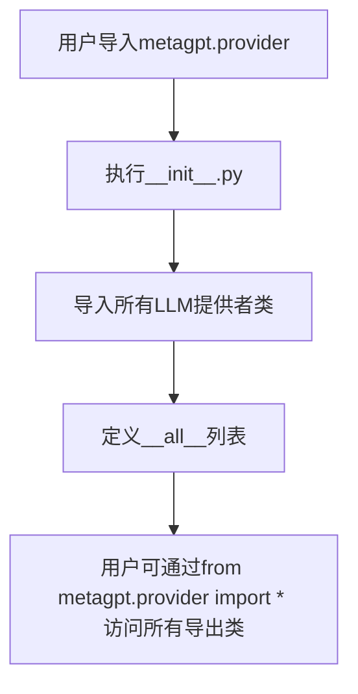

# `.\MetaGPT\metagpt\provider\__init__.py` 详细设计文档

该文件是MetaGPT项目中LLM（大语言模型）提供者模块的初始化文件，主要功能是集中导入和导出各种第三方和自定义的LLM API客户端类，为项目提供一个统一的LLM提供者接口入口。

## 整体流程



## 类结构

```
metagpt.provider (包)
├── __init__.py (当前文件)
├── google_gemini_api.py
├── ollama_api.py
├── openai_api.py
├── zhipuai_api.py
├── azure_openai_api.py
├── metagpt_api.py
├── human_provider.py
├── spark_api.py
├── qianfan_api.py
├── dashscope_api.py
├── anthropic_api.py
├── bedrock_api.py
├── ark_api.py
└── openrouter_reasoning.py
```

## 全局变量及字段


### `__all__`
    
一个字符串列表，定义了从该模块公开导出的类名，用于控制模块的公共接口。

类型：`List[str]`
    


    

## 全局函数及方法


## 关键组件


### 大语言模型提供者 (LLM Providers)

该模块是MetaGPT项目的大语言模型提供者抽象层，集中导入了多种不同厂商和服务的LLM实现类，为上层应用提供了统一的LLM调用接口，支持通过配置灵活切换底层模型服务。

### 模型服务集成 (Model Service Integrations)

该模块集成了包括OpenAI、Google Gemini、Anthropic Claude、国内云服务（如智谱AI、百度千帆、阿里灵积、讯飞星火、月之暗面）以及开源模型（如Ollama）在内的多种主流大语言模型API，实现了对多样化模型生态的支持。

### 统一接口抽象 (Unified Interface Abstraction)

通过定义共同的基类或接口（虽然在此初始化文件中未直接体现，但通常存在于父模块或基类中），这些导入的LLM类对外提供了一致的调用方法（如`ask`, `aask`），隐藏了不同API的具体实现细节，简化了上层业务逻辑的编写。

### 特殊提供者 (Specialized Providers)

除了标准的云端API提供者，该模块还包含了`HumanProvider`（可能用于模拟人工输入或测试）和`OpenrouterReasoningLLM`（可能通过Openrouter平台接入具有强化推理能力的模型）等特殊用途的提供者，扩展了框架的应用场景。


## 问题及建议


### 已知问题

-   **缺乏统一的LLM接口抽象**：当前代码通过`__all__`导出了多个不同供应商的LLM类（如`OpenAILLM`, `GeminiLLM`等）。如果这些类没有实现一个共同的基类或接口，那么在使用这些类时，客户端代码将面临高度的耦合和复杂性，难以在不修改大量代码的情况下切换或增加新的LLM提供商。
-   **潜在的初始化与配置复杂性**：每个LLM提供商类（如`AzureOpenAILLM`, `BedrockLLM`）可能有自己独特的初始化参数和配置方式（如API密钥、端点URL、模型版本）。将这些差异全部暴露给上层调用者，会增加使用的复杂度和出错概率。
-   **依赖管理分散**：该`__init__.py`文件集中导入了所有提供商模块，这意味着即使项目只使用其中一个提供商，也会加载所有提供商的依赖。这可能增加不必要的内存开销和潜在的导入错误风险（如果某个依赖未安装）。
-   **缺少版本与兼容性管理**：导入列表包含了`OpenrouterReasoningLLM`等较新的或特定功能的提供商，但代码中缺乏对各个提供商API版本、功能支持度或互操作性差异的说明或统一处理机制。

### 优化建议

-   **定义统一的LLM抽象接口**：创建一个抽象的基类（例如`BaseLLM`），规定所有LLM提供商必须实现的方法（如`complete`, `achat`等）。让`OpenAILLM`, `GeminiLLM`等具体类继承并实现此接口。这能极大提升代码的可维护性和可扩展性。
-   **引入工厂模式或配置化加载**：实现一个LLM工厂类或通过统一配置来实例化具体的LLM对象。上层代码只需指定提供商名称（如`"openai"`）和通用配置，由工厂负责处理不同提供商的特有初始化逻辑，从而简化调用方代码。
-   **实现按需导入（延迟加载）**：可以重构导入逻辑，仅在真正需要某个特定LLM提供商时才动态导入其模块。例如，在工厂类的`get_llm`方法内部根据提供商名称进行导入，而不是在`__init__.py`顶部一次性导入所有。这能优化启动性能和避免缺失依赖导致的全局导入失败。
-   **建立提供商能力描述与适配层**：考虑引入一个元数据层或适配器，来描述不同提供商支持的功能（如是否支持流式响应、最大token数等）。对于像`OpenrouterReasoningLLM`这类有特殊功能的提供商，可以通过适配器模式将其能力映射到统一接口，或明确标识其特殊性，供调用者选择。
-   **集中管理配置与密钥**：建议将各LLM的配置（如API Base URL, API Key）集中管理，例如通过环境变量或统一的配置文件进行注入，而不是硬编码在各个LLM类的初始化中。这能提升安全性和配置的灵活性。


## 其它


### 设计目标与约束

本模块的设计目标是提供一个统一、可扩展的接口，用于集成多种大语言模型（LLM）服务提供商。其核心约束包括：1) 必须定义一个所有LLM提供商类都遵循的公共接口（例如，一个基类或一组必须实现的方法），以确保客户端代码可以以一致的方式调用不同的LLM。2) 模块结构应支持轻松添加新的LLM提供商，而无需修改现有客户端代码。3) 需要处理不同提供商API在认证、请求格式、响应解析等方面的差异，将这些复杂性封装在各个具体的提供商实现类内部。

### 错误处理与异常设计

模块的错误处理策略主要依赖于各个具体LLM提供商类的实现。通常，每个提供商的API调用方法（如`ask`或`completion`）应捕获其底层网络请求或API返回的特定异常，并将其转换为模块内部定义的、统一的异常类型（例如，`LLMError`, `AuthenticationError`, `RateLimitError`等），然后向上抛出。`__init__.py`文件本身不直接处理异常，但其导出的类应遵循统一的异常抛出规范，以便调用者能够进行一致的错误处理。

### 数据流与状态机

本模块作为服务集成层，不维护复杂的内部状态。其主要数据流是单向的：客户端调用具体LLM提供商实例的方法，传入提示文本（prompt）和配置参数；该实例将请求封装成对应API的格式并发送；收到响应后，解析并提取出生成的文本内容，返回给客户端。整个过程是无状态的，每个请求独立。模块本身不涉及状态机。

### 外部依赖与接口契约

1.  **外部依赖**：每个导出的LLM类都依赖于其对应的第三方服务API（如OpenAI API, Anthropic Claude API等）。这些依赖通过各自的SDK或直接HTTP请求实现。模块的`requirements.txt`或`pyproject.toml`需要列出所有这些依赖。
2.  **接口契约**：模块通过`__all__`列表定义了其对外公开的接口（即所有可用的LLM提供商类）。这些类应当实现一个共同的抽象基类（例如`BaseLLM`），该基类定义了必须实现的方法（如`async def aask(self, prompt: str, ...) -> str`），形成了与客户端代码之间的核心契约。`__init__.py`通过导出这些类，承诺它们都遵守此契约。

### 配置管理与环境变量

各个LLM提供商通常需要API密钥、基础URL等配置信息。这些配置应通过环境变量、配置文件或依赖注入框架进行管理，而不是硬编码在类中。例如，`OpenAILLM`可能从环境变量`OPENAI_API_KEY`读取密钥，`AzureOpenAILLM`可能需要`AZURE_OPENAI_ENDPOINT`和`AZURE_OPENAI_API_KEY`。模块的设计应支持灵活、安全的配置注入方式。

### 测试策略

测试应分为两个层次：
1.  **单元测试**：针对每个LLM提供商类，模拟（Mock）其底层的网络请求，测试请求构建、响应解析和错误处理逻辑。
2.  **集成测试**：在拥有有效API密钥的测试环境中，对每个提供商进行真实的API调用测试，验证端到端的连通性和基本功能。由于涉及网络和外部成本，这类测试可能需要在特定条件下运行。
模块的`__init__.py`因其简单性，可能不需要单独的测试，但导出功能的正确性可通过导入测试来验证。

### 安全考量

1.  **敏感信息**：API密钥等敏感信息必须避免泄露。不应出现在代码、日志或错误信息中。推荐使用环境变量或安全的密钥管理服务。
2.  **输入输出过滤**：虽然主要责任在调用方，但LLM提供商类在必要时可考虑对输入（prompt）进行基本的检查，或对输出内容进行安全过滤（如果提供商API不提供此功能），以防止注入攻击或处理不当内容。
3.  **请求安全**：确保向API发起的请求使用HTTPS等安全协议。

    