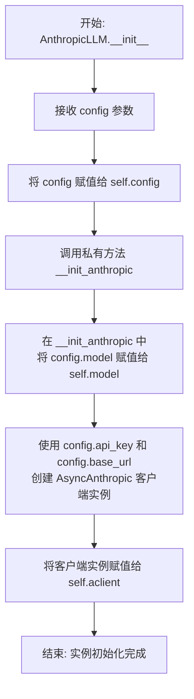
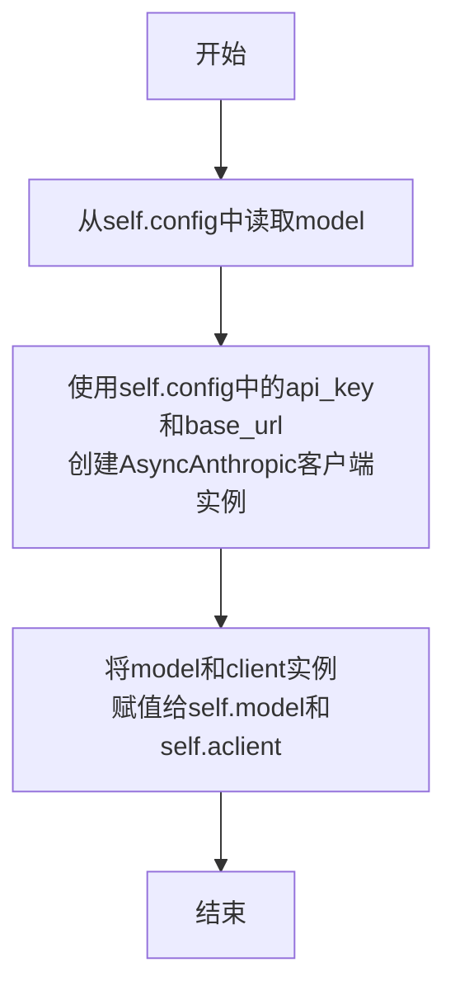
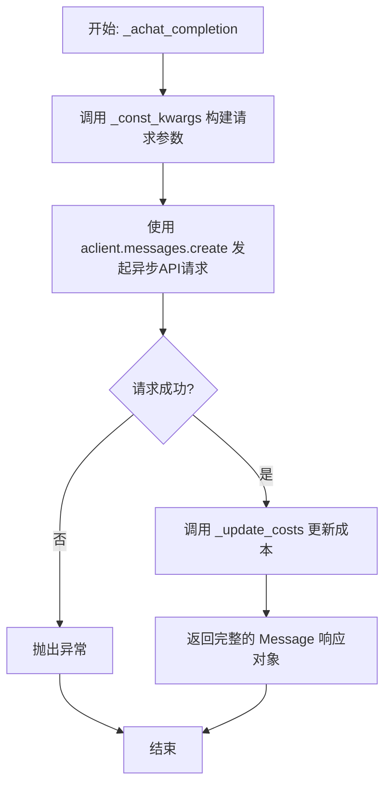
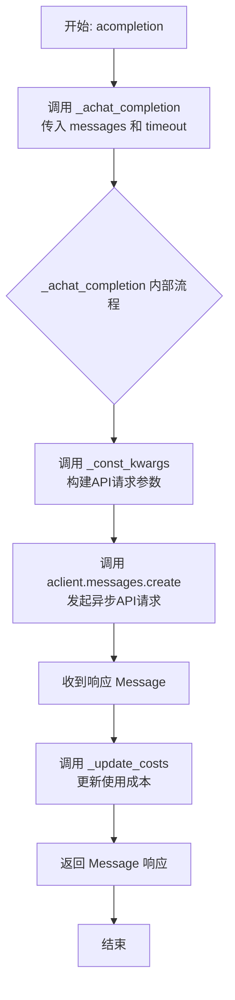
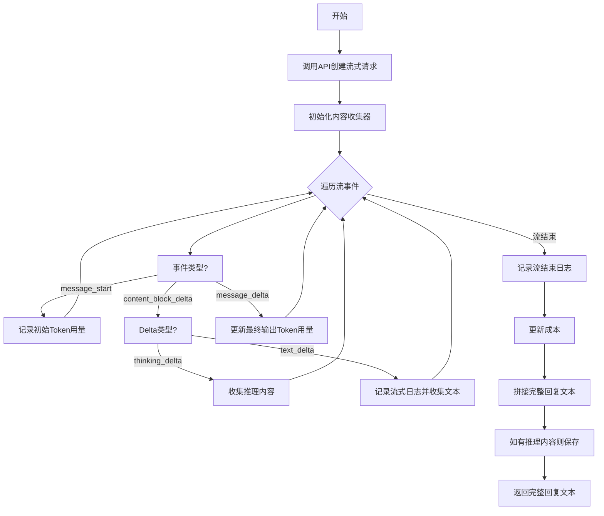

# `.\MetaGPT\metagpt\provider\anthropic_api.py` 详细设计文档

该文件实现了一个基于 Anthropic Claude API 的 LLM 提供者类，继承自 MetaGPT 框架的 BaseLLM 基类。它封装了与 Anthropic API 的异步交互逻辑，支持普通聊天补全和流式响应，并能处理系统提示、推理模式（thinking）以及计算 API 使用成本。

## 整体流程

```mermaid
graph TD
    A[用户调用 acompletion 或流式方法] --> B{是否为流式调用?}
    B -- 否 --> C[_achat_completion]
    C --> D[调用 _const_kwargs 构建请求参数]
    D --> E[调用 AsyncAnthropic.messages.create]
    E --> F[接收 Message 响应]
    F --> G[调用 _update_costs 更新成本]
    G --> H[返回 Message 给调用者]
    B -- 是 --> I[_achat_completion_stream]
    I --> J[调用 _const_kwargs 构建流式请求参数]
    J --> K[调用 AsyncAnthropic.messages.create(stream=True)]
    K --> L[异步迭代事件流]
    L --> M{事件类型?}
    M -- message_start --> N[记录初始用量]
    M -- content_block_delta --> O{Delta 类型?}
    O -- thinking_delta --> P[收集推理内容]
    O -- text_delta --> Q[记录日志并收集文本]
    M -- message_delta --> R[更新最终输出用量]
    N --> L
    P --> L
    Q --> L
    R --> L
    L --> S[流结束]
    S --> T[调用 _update_costs 更新成本]
    T --> U[拼接完整响应文本]
    U --> V[返回完整文本]
```

## 类结构

```
BaseLLM (抽象基类，来自 metagpt.provider.base_llm)
└── AnthropicLLM (具体实现类)
    ├── 字段: config, model, aclient, reasoning_content
    ├── 方法: __init__, __init_anthropic, _const_kwargs, _update_costs, get_choice_text, _achat_completion, acompletion, _achat_completion_stream
```

## 全局变量及字段


### `AnthropicLLM.config`
    
LLM配置对象，包含API密钥、模型名称、最大token数等配置信息。

类型：`LLMConfig`
    


### `AnthropicLLM.model`
    
当前使用的Anthropic模型名称，从config.model初始化而来。

类型：`str`
    


### `AnthropicLLM.aclient`
    
Anthropic API的异步客户端实例，用于发起API调用。

类型：`AsyncAnthropic`
    


### `AnthropicLLM.reasoning_content`
    
存储模型推理过程（thinking）内容的字符串，在流式和非流式响应中均可能被填充。

类型：`str`
    
    

## 全局函数及方法


### `register_provider`

这是一个装饰器函数，用于将LLM提供者类（如`AnthropicLLM`）注册到`llm_provider_registry`中。它接收一个LLM类型列表作为参数，并将被装饰的类与这些类型关联起来，以便系统能够根据配置的LLM类型找到并实例化对应的提供者类。

参数：
-  `llm_types`：`list[LLMType]`，一个包含LLM类型枚举值的列表，用于指定该提供者类所支持的LLM类型（例如`LLMType.ANTHROPIC`和`LLMType.CLAUDE`）。

返回值：`Callable[[type], type]`，返回一个装饰器函数，该函数接收一个类作为参数并返回同一个类（通常是被装饰的类本身）。装饰器的主要作用是在类定义时执行注册逻辑，而非在调用时。

#### 流程图

```mermaid
flowchart TD
    A[调用 register_provider<br>传入 llm_types 列表] --> B[定义内部装饰器函数 wrapper]
    B --> C{被装饰的类 cls 是否已定义？}
    C -- 是 --> D[遍历 llm_types 列表]
    D --> E[将 (llm_type, cls) 对<br>注册到全局注册表中]
    E --> F[返回被装饰的类 cls]
    C -- 否（理论上不会发生） --> G[返回原始类 cls 或 None]
```

#### 带注释源码

```python
# 这是一个装饰器工厂函数，它接收一个LLM类型列表作为参数。
def register_provider(llm_types: list[LLMType]) -> Callable[[type], type]:
    # 这是实际的装饰器函数，它接收一个类（cls）作为参数。
    def wrapper(cls: type) -> type:
        # 遍历传入的LLM类型列表。
        for llm_type in llm_types:
            # 将当前的LLM类型（llm_type）与传入的类（cls）关联起来，
            # 并注册到一个全局的LLM提供者注册表（registry）中。
            # 这样，当系统需要某个特定类型的LLM时，就可以通过这个注册表找到对应的实现类。
            register(llm_type, cls)
        # 装饰器返回原始的类，允许它被正常使用。
        return cls
    # 装饰器工厂返回内部定义的装饰器函数。
    return wrapper
```


### `AnthropicLLM.__init__`

初始化 `AnthropicLLM` 类的实例。该方法接收一个 `LLMConfig` 配置对象，将其存储在实例中，并调用私有方法 `__init_anthropic` 来初始化与 Anthropic API 交互所需的核心客户端和模型信息。

参数：

-  `config`：`LLMConfig`，包含 API 密钥、模型名称、基础 URL 等配置信息的对象。

返回值：`None`，此方法为构造函数，不返回任何值。

#### 流程图



#### 带注释源码

```python
def __init__(self, config: LLMConfig):
    # 将传入的配置对象保存到实例变量中，供类内其他方法使用
    self.config = config
    # 调用私有初始化方法，完成 Anthropic 客户端和模型名称的设置
    self.__init_anthropic()
```


### `AnthropicLLM.__init_anthropic`

该方法用于初始化 Anthropic LLM 客户端。它从配置中提取模型名称，并使用配置中的 API 密钥和基础 URL 创建一个 `AsyncAnthropic` 异步客户端实例。

参数：
-  `self`：`AnthropicLLM`，当前 `AnthropicLLM` 类的实例。

返回值：`None`，此方法不返回任何值，仅用于初始化实例属性。

#### 流程图



#### 带注释源码

```
def __init_anthropic(self):
    # 从配置对象中获取模型名称，并赋值给实例变量 self.model
    self.model = self.config.model
    # 使用配置中的 API 密钥和基础 URL 创建一个异步 Anthropic 客户端实例
    # 该客户端将用于后续所有与 Anthropic API 的交互
    self.aclient: AsyncAnthropic = AsyncAnthropic(api_key=self.config.api_key, base_url=self.config.base_url)
```


### `AnthropicLLM._const_kwargs`

该方法用于构建调用 Anthropic Claude API 所需的关键参数字典。它根据类配置和输入参数，动态组装并返回一个包含模型、消息、最大令牌数等必要信息的字典。特别地，它会处理系统提示和推理功能等高级配置。

参数：

- `messages`：`list[dict]`，包含对话历史的消息列表，每个消息是一个包含 `role` 和 `content` 键的字典。
- `stream`：`bool`，默认为 `False`，指示是否启用流式响应。

返回值：`dict`，一个准备传递给 Anthropic API 客户端（`AsyncAnthropic.messages.create`）的关键字参数字典。

#### 流程图

```mermaid
flowchart TD
    A[开始: _const_kwargs(messages, stream)] --> B[初始化基础kwargs<br>包含 model, messages, max_tokens, stream]
    B --> C{是否启用系统提示<br>且第一条消息角色为'system'?}
    C -- 是 --> D[从kwargs.messages中移除首条系统消息<br>并将其内容设置为kwargs.system]
    C -- 否 --> E[保持kwargs.messages不变]
    D --> F
    E --> F{配置中是否启用了推理功能?}
    F -- 是 --> G[在kwargs中添加thinking参数<br>包含类型和预算令牌数]
    F -- 否 --> H[保持kwargs不变]
    G --> I[返回kwargs]
    H --> I
```

#### 带注释源码

```python
def _const_kwargs(self, messages: list[dict], stream: bool = False) -> dict:
    # 1. 构建基础参数字典，包含模型、消息、最大令牌数和流式控制标志。
    kwargs = {
        "model": self.model,
        "messages": messages,
        "max_tokens": self.config.max_token,
        "stream": stream,
    }
    # 2. 检查是否使用系统提示，并且输入消息列表的第一条消息角色为'system'。
    if self.use_system_prompt:
        if messages[0]["role"] == "system":
            # 3. 如果满足条件，将系统消息从常规消息列表中移除，
            #    并将其内容单独设置为'system'参数（这是Anthropic API要求的格式）。
            kwargs["messages"] = messages[1:]
            kwargs["system"] = messages[0]["content"]  # set system prompt here
    # 4. 检查配置中是否启用了推理功能。
    if self.config.reasoning:
        # 5. 如果启用，添加'thinking'参数来配置推理功能，包括类型和预算令牌数。
        kwargs["thinking"] = {"type": "enabled", "budget_tokens": self.config.reasoning_max_token}
    # 6. 返回最终组装好的参数字典。
    return kwargs
```


### `AnthropicLLM._update_costs`

该方法用于更新LLM调用的成本统计。它接收Anthropic API返回的`Usage`对象，将其转换为内部成本计算所需的格式，并调用父类`BaseLLM`的`_update_costs`方法来完成实际的成本累加。

参数：

-  `usage`：`Usage`，Anthropic API返回的用量对象，包含`input_tokens`和`output_tokens`字段。
-  `model`：`str`，可选参数，指定使用的模型名称。默认为`None`。
-  `local_calc_usage`：`bool`，可选参数，指示是否在本地计算用量。此参数在当前方法实现中未被使用，但为了保持与父类方法签名的一致性而保留。默认为`True`。

返回值：`None`，此方法不返回任何值，其作用在于更新内部成本状态。

#### 流程图

```mermaid
flowchart TD
    A[开始] --> B{接收参数 usage, model}
    B --> C[将 usage 对象转换为字典<br>键: prompt_tokens, completion_tokens]
    C --> D[调用父类方法 super()._update_costs<br>传入转换后的字典和 model 参数]
    D --> E[结束]
```

#### 带注释源码

```python
def _update_costs(self, usage: Usage, model: str = None, local_calc_usage: bool = True):
    # 将 Anthropic API 特定的 Usage 对象转换为通用格式的字典。
    # 转换规则：input_tokens -> prompt_tokens, output_tokens -> completion_tokens
    usage = {"prompt_tokens": usage.input_tokens, "completion_tokens": usage.output_tokens}
    # 调用父类 BaseLLM 的 _update_costs 方法，传入转换后的用量字典和模型名称。
    # 父类方法负责根据配置的成本单价计算费用并进行累加。
    super()._update_costs(usage, model)
```


### `AnthropicLLM.get_choice_text`

该方法用于从 Anthropic API 返回的 `Message` 响应对象中提取出最终的文本内容。它特别处理了包含推理（thinking）内容的响应，确保返回的是用户可读的文本部分。

参数：

-  `resp`：`Message`，Anthropic API 返回的完整消息响应对象。

返回值：`str`，从响应中提取出的纯文本内容。

#### 流程图

```mermaid
flowchart TD
    A[开始: get_choice_text(resp)] --> B{resp.content 长度 > 1?};
    B -- 是 --> C[将 resp.content[0].thinking 存入 self.reasoning_content];
    C --> D[将 resp.content[1].text 赋值给 text];
    B -- 否 --> E[将 resp.content[0].text 赋值给 text];
    D --> F[返回 text];
    E --> F;
```

#### 带注释源码

```python
def get_choice_text(self, resp: Message) -> str:
    # 检查响应内容块的数量
    if len(resp.content) > 1:
        # 如果内容块多于一个，通常第一个是推理内容，第二个是最终文本
        # 将推理内容存储到实例变量中，供后续可能使用
        self.reasoning_content = resp.content[0].thinking
        # 提取最终文本内容
        text = resp.content[1].text
    else:
        # 如果只有一个内容块，则直接提取其文本
        text = resp.content[0].text
    # 返回提取出的文本字符串
    return text
```


### `AnthropicLLM._achat_completion`

该方法是一个异步方法，是 `AnthropicLLM` 类的核心聊天完成方法。它负责调用 Anthropic 的异步 API 客户端，发送构造好的请求参数以获取模型生成的完整响应消息（`Message`），并在请求成功后更新本次调用的成本。

参数：

-  `messages`：`list[dict]`，一个字典列表，代表对话历史。每个字典通常包含 `role`（如 `"user"`, `"assistant"`, `"system"`）和 `content` 字段。
-  `timeout`：`int`，请求的超时时间（秒）。虽然方法签名包含此参数，但在当前实现中并未直接使用，而是通过 `self.aclient` 的配置或底层 HTTP 客户端控制。

返回值：`Message`，Anthropic API 返回的完整消息对象，包含生成的文本内容、使用量统计等信息。

#### 流程图



#### 带注释源码

```python
async def _achat_completion(self, messages: list[dict], timeout: int = USE_CONFIG_TIMEOUT) -> Message:
    # 1. 调用 _const_kwargs 方法，根据传入的 messages 和默认的 stream=False 参数，
    #    构建出符合 Anthropic API 要求的参数字典 (kwargs)。
    #    这包括模型名称、消息列表、最大token数等。
    resp: Message = await self.aclient.messages.create(**self._const_kwargs(messages))
    
    # 2. 请求成功后，从响应对象 resp 中提取使用量信息 (resp.usage)，
    #    并调用 _update_costs 方法更新内部成本统计。
    self._update_costs(resp.usage, self.model)
    
    # 3. 将完整的 API 响应对象返回给调用者。
    return resp
```


### `AnthropicLLM.acompletion`

该方法是一个异步方法，用于向Anthropic Claude API发起一次非流式的聊天补全请求。它封装了底层的API调用，并集成了成本计算和超时控制逻辑。

参数：

-  `messages`：`list[dict]`，一个字典列表，表示对话历史。每个字典通常包含`role`（如"user", "assistant", "system"）和`content`键。
-  `timeout`：`int`，请求的超时时间（秒）。默认值为`USE_CONFIG_TIMEOUT`。

返回值：`Message`，Anthropic API返回的完整响应对象，其中包含生成的文本内容、使用量等信息。

#### 流程图



#### 带注释源码

```
async def acompletion(self, messages: list[dict], timeout: int = USE_CONFIG_TIMEOUT) -> Message:
    # 调用内部的异步聊天补全方法 `_achat_completion`
    # 1. 通过 `self.get_timeout(timeout)` 处理超时配置（可能使用实例或全局配置）
    # 2. 将处理后的超时时间和消息列表传递给 `_achat_completion`
    # 最终返回 `_achat_completion` 的结果，即一个完整的 Anthropic `Message` 响应对象。
    return await self._achat_completion(messages, timeout=self.get_timeout(timeout))
```


### `AnthropicLLM._achat_completion_stream`

该方法用于与Anthropic Claude模型进行异步流式对话，实时接收并处理模型返回的文本流和推理内容（如果启用），最终拼接并返回完整的回复文本。

参数：

-  `messages`：`list[dict]`，包含对话历史和系统提示的消息列表。
-  `timeout`：`int`，请求超时时间（秒），默认使用配置中的超时时间。

返回值：`str`，模型生成的完整回复文本。

#### 流程图



#### 带注释源码

```python
async def _achat_completion_stream(self, messages: list[dict], timeout: int = USE_CONFIG_TIMEOUT) -> str:
    # 1. 调用Anthropic API创建流式请求，传入消息和流式标志
    stream = await self.aclient.messages.create(**self._const_kwargs(messages, stream=True))
    
    # 2. 初始化用于收集文本内容和推理内容的列表
    collected_content = []
    collected_reasoning_content = []
    
    # 3. 初始化一个空的Usage对象用于累计Token消耗
    usage = Usage(input_tokens=0, output_tokens=0)
    
    # 4. 异步迭代处理流式响应中的每一个事件
    async for event in stream:
        event_type = event.type
        
        # 5. 处理消息开始事件，记录初始的输入和输出Token数量
        if event_type == "message_start":
            usage.input_tokens = event.message.usage.input_tokens
            usage.output_tokens = event.message.usage.output_tokens
            
        # 6. 处理内容块增量事件
        elif event_type == "content_block_delta":
            delta_type = event.delta.type
            
            # 6.1 如果增量类型是推理内容，则收集到推理内容列表
            if delta_type == "thinking_delta":
                collected_reasoning_content.append(event.delta.thinking)
                
            # 6.2 如果增量类型是文本内容，则记录流式日志并收集到文本列表
            elif delta_type == "text_delta":
                content = event.delta.text
                log_llm_stream(content)  # 记录日志，通常用于在控制台实时显示
                collected_content.append(content)
                
        # 7. 处理消息增量事件，更新最终的输出Token数量
        elif event_type == "message_delta":
            usage.output_tokens = event.usage.output_tokens  # update final output_tokens

    # 8. 流式响应结束后，记录换行符日志
    log_llm_stream("\n")
    
    # 9. 根据累计的Token用量更新成本
    self._update_costs(usage)
    
    # 10. 将收集到的文本片段拼接成完整的回复内容
    full_content = "".join(collected_content)
    
    # 11. 如果收集到了推理内容，则将其拼接并保存到实例变量中
    if collected_reasoning_content:
        self.reasoning_content = "".join(collected_reasoning_content)
        
    # 12. 返回完整的回复文本
    return full_content
```


## 关键组件


### 异步 Anthropic 客户端 (AsyncAnthropic Client)

用于与 Anthropic Claude API 进行异步通信的核心客户端对象，负责发送请求和接收响应。

### 消息构造器 (_const_kwargs 方法)

根据配置和输入消息动态构建符合 Anthropic API 规范的请求参数字典，支持系统提示、流式输出和推理功能等高级特性。

### 成本追踪器 (_update_costs 方法)

处理 API 响应的 Token 使用量信息，并将其转换为内部成本计算格式，用于监控和统计资源消耗。

### 响应解析器 (get_choice_text 方法)

从 Anthropic API 的复杂响应结构中提取出最终的文本内容，并能够分离和保存推理过程（thinking）内容。

### 异步聊天完成器 (_achat_completion 方法)

执行非流式的异步聊天请求，获取完整的 API 响应，并自动触发成本更新。

### 异步流式聊天完成器 (_achat_completion_stream 方法)

执行流式的异步聊天请求，实时处理返回的数据块（包括文本和推理内容），拼接最终结果，并处理流式响应特有的 Token 计数更新。

### 提供商注册装饰器 (register_provider)

用于将 `AnthropicLLM` 类注册到 MetaGPT 的 LLM 提供商注册表中，使其可以通过配置（如 `LLMType.ANTHROPIC`）被识别和使用。

### 配置管理器 (LLMConfig)

封装了与 Anthropic 模型交互所需的所有配置参数，如模型名称、API密钥、基础URL、最大Token数以及推理功能开关等。

### 流式日志记录器 (log_llm_stream)

在流式响应处理过程中，用于实时输出接收到的文本内容到日志，提供交互式体验。


## 问题及建议


### 已知问题

-   **`__init_anthropic` 方法命名不规范**：该方法以双下划线开头，在Python中表示名称改写（name mangling），通常用于实现私有属性。然而，此处可能仅意图表示“私有”而非需要名称改写，这可能导致在子类中访问或重写该方法时出现意外行为。
-   **`_update_costs` 方法参数默认值不一致**：父类 `BaseLLM._update_costs` 方法的 `local_calc_usage` 参数默认值为 `True`，而子类重写时显式传递了 `local_calc_usage=True`。虽然当前行为一致，但若父类默认值改变，此处可能产生不一致。更关键的是，子类方法签名中的 `model` 参数默认值为 `None`，但调用父类方法时未传递 `model` 参数，而是传递了 `self.model`，这使得 `model` 参数形同虚设，且与父类方法调用逻辑不一致。
-   **流式处理中令牌计数的潜在不准确**：在 `_achat_completion_stream` 方法中，流式响应的令牌使用量（`usage`）是从流事件中逐步收集的。虽然代码尝试在 `message_start` 和 `message_delta` 事件中更新 `output_tokens`，但这种基于增量事件的计数方式可能不如非流式接口返回的最终 `usage` 对象准确，尤其是在网络流中断或解析异常时。
-   **`get_choice_text` 方法对 `resp.content` 结构的强假设**：该方法假设 `resp.content` 列表的长度为1或2，并且当长度为2时，第一个元素是 `thinking` 类型，第二个元素是 `text` 类型。这种硬编码的索引访问缺乏健壮性，如果Anthropic API响应的结构发生变化（例如，返回多个内容块但顺序不同），此方法将可能抛出 `IndexError` 或提取错误的内容。
-   **缺乏配置验证**：在 `__init_anthropic` 方法中，直接使用 `self.config` 中的值初始化 `AsyncAnthropic` 客户端，但未对必要的配置项（如 `api_key`）进行有效性或存在性检查。如果配置不完整，错误可能直到实际API调用时才暴露，不利于调试。

### 优化建议

-   **规范私有方法命名**：如果 `__init_anthropic` 方法不需要严格的名称改写（即不希望被子类意外访问或重写），建议将其改为单下划线前缀 `_init_anthropic`，以遵循Python社区对“受保护”方法的约定，提高代码可读性。
-   **统一并清理 `_update_costs` 方法**：
    1.  移除子类方法中未使用的 `model` 参数，或者使其逻辑与父类保持一致（例如，当 `model` 为 `None` 时使用 `self.model`）。
    2.  考虑移除 `local_calc_usage` 参数，因为子类实现中并未使用它进行本地计算，直接调用父类方法即可。如果父类依赖此参数，应确保传递正确的值。
-   **增强 `get_choice_text` 方法的健壮性**：重构该方法，使其通过检查 `content` 块（`ContentBlock` 对象）的 `type` 属性（例如 `"thinking"`, `"text"`）来动态定位 `thinking` 和 `text` 内容，而不是依赖固定的列表索引。这可以更好地适应API响应结构的变化。
-   **增加配置验证**：在 `__init__` 或 `__init_anthropic` 方法中，添加对关键配置（如 `api_key`, `model`）的基础验证。例如，检查 `api_key` 是否非空或符合预期格式（如以 `"sk-"` 开头），并在验证失败时抛出清晰的 `ValueError`。
-   **考虑添加更完善的错误处理**：当前代码中，API调用（`aclient.messages.create`）可能抛出各种异常（如网络错误、认证失败、速率限制等）。建议在 `_achat_completion` 和 `_achat_completion_stream` 方法中添加更具体的异常捕获和转换，将其包装为项目内部定义的异常类型，并提供更有上下文的错误信息，便于上游调用者处理。
-   **优化流式处理中的资源管理**：`_achat_completion_stream` 方法中的 `stream` 对象是一个异步上下文管理器。虽然当前代码在异步生成器结束后隐式关闭了连接，但显式使用 `async with` 语句来管理 `aclient.messages.create` 调用返回的流对象是更佳实践，可以确保在任何情况下（包括异常提前退出）资源都能被正确清理。
-   **提取常量或配置**：方法中出现的魔术字符串，如 `"thinking_delta"`, `"text_delta"`，可以考虑提取为类常量或从 `anthropic` 库导入相应的枚举类型（如果存在），以提高代码的可维护性和避免拼写错误。


## 其它


### 设计目标与约束

该代码的设计目标是实现一个与Anthropic Claude API交互的LLM提供者，作为MetaGPT框架中BaseLLM抽象基类的具体实现。主要约束包括：必须遵循BaseLLM定义的接口契约；需要处理Anthropic API特有的功能，如系统提示词和思维链推理；需要支持同步和异步两种调用模式；需要集成到MetaGPT的提供者注册机制中；需要正确处理API调用成本计算。

### 错误处理与异常设计

当前代码未显式处理网络错误、API错误（如认证失败、配额不足、模型不可用）、超时、以及响应数据格式异常。这些错误可能由底层的`AsyncAnthropic`客户端或网络库抛出。建议在`_achat_completion`和`_achat_completion_stream`方法中添加try-except块，捕获`anthropic.APIError`、`anthropic.APIConnectionError`、`anthropic.RateLimitError`等异常，并将其转换为框架内统一的LLM异常类型，或至少进行日志记录和向上传播。超时参数`timeout`被传递但未在`AsyncAnthropic`客户端调用中显式使用，需要确认其生效方式。

### 数据流与状态机

核心数据流始于用户调用`acompletion`或`_achat_completion_stream`方法，传入`messages`列表。数据经过`_const_kwargs`方法封装成符合Anthropic API格式的请求参数。对于非流式响应，数据流为：请求 -> `acompletion` -> `_achat_completion` -> Anthropic API -> `Message`响应 -> `get_choice_text`提取文本。对于流式响应，数据流为：请求 -> `_achat_completion_stream` -> Anthropic API流 -> 异步迭代事件 -> 累积文本块 -> 返回完整文本。过程中会通过`_update_costs`更新成本统计。类内部状态包括`config`（配置）、`model`（模型名）、`aclient`（API客户端）和`reasoning_content`（存储流式响应中的思维链内容）。

### 外部依赖与接口契约

**外部依赖**：
1.  `anthropic`库：核心API客户端，用于与Anthropic服务通信。
2.  `metagpt`框架模块：包括`LLMConfig`, `LLMType`, `USE_CONFIG_TIMEOUT`, `BaseLLM`, `register_provider`, `log_llm_stream`。这些依赖定义了配置结构、常量、基类接口和日志功能。

**接口契约**：
1.  继承自`BaseLLM`：必须实现`acompletion`等方法，并遵循其定义的签名和行为预期（如返回类型、异常）。
2.  装饰器`@register_provider`：将此类注册到MetaGPT的LLM提供者工厂，使其可通过`LLMType.ANTHROPIC`或`LLMType.CLAUDE`标识符被实例化。
3.  Anthropic API契约：`_const_kwargs`构建的参数字典必须符合Anthropic Messages API的规范。响应对象`Message`和`Usage`的结构由`anthropic.types`定义。

### 配置管理与环境

配置完全通过`LLMConfig`实例（`self.config`）管理，包含`api_key`、`base_url`、`model`、`max_token`、`reasoning`、`reasoning_max_token`等关键参数。`__init_anthropic`方法使用这些配置初始化`AsyncAnthropic`客户端。超时设置使用了框架常量`USE_CONFIG_TIMEOUT`，并通过`get_timeout`方法（可能来自基类）解析最终值。系统提示词的支持通过`use_system_prompt`属性（可能来自基类或配置）控制。这种设计将配置集中化，便于通过框架统一管理。

### 安全与合规考虑

代码安全依赖于`LLMConfig`安全地管理API密钥（`api_key`）。密钥通过`AsyncAnthropic`构造函数传递，应确保配置对象在日志、序列化或传输过程中不会泄露密钥。代码本身不处理用户输入的内容安全过滤（如防止提示词注入、生成有害内容），这依赖于Anthropic API层面的安全措施或上游调用者的处理。成本计算功能（`_update_costs`）有助于监控和预算控制，避免意外的高额API费用。需要确保在分布式或多线程环境下，成本统计的更新是线程安全的（当前实现可能依赖于基类实现）。

    