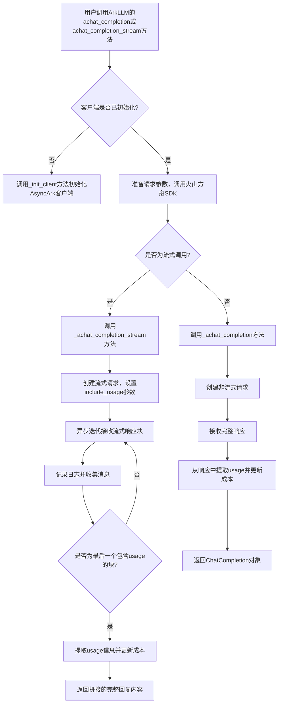
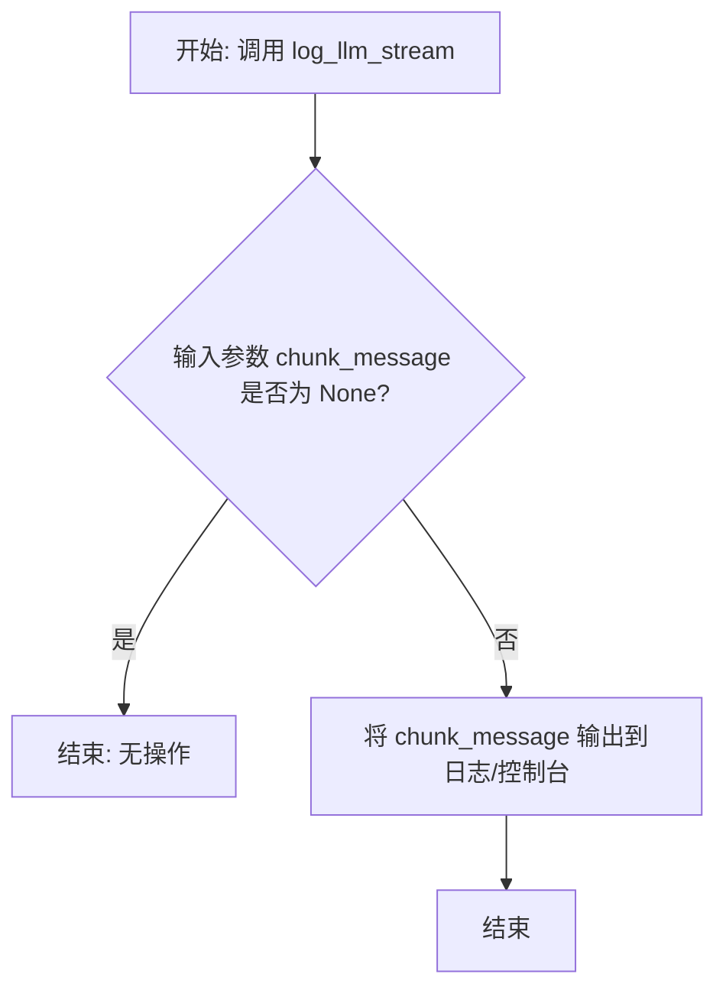
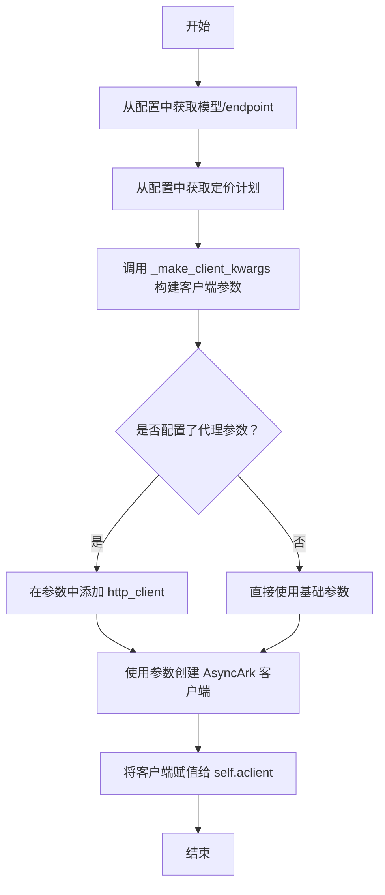
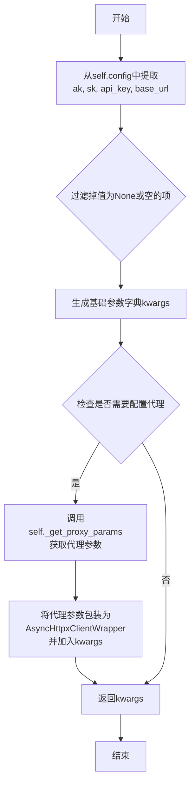
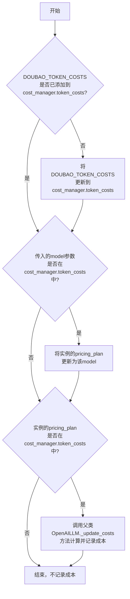
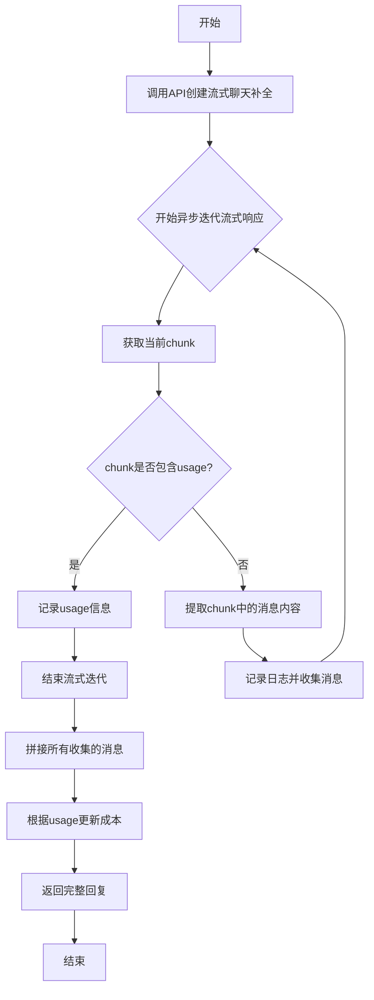
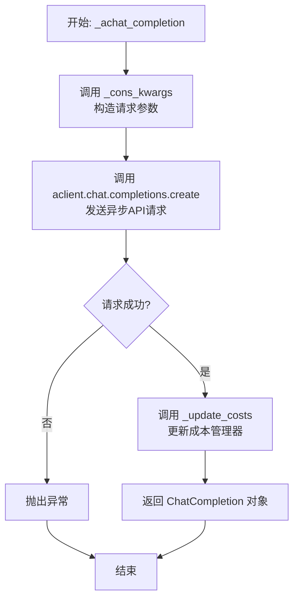

# `.\MetaGPT\metagpt\provider\ark_api.py` 详细设计文档

该代码文件是MetaGPT框架中用于集成火山引擎方舟（Volcengine Ark）大语言模型服务的提供者（Provider）实现。它继承自OpenAILLM基类，通过适配火山方舟的SDK，实现了与OpenAI兼容的异步聊天补全接口，支持流式和非流式响应，并集成了成本管理和代理配置功能。

## 整体流程



## 类结构

```
OpenAILLM (基类，来自metagpt.provider.openai_api)
└── ArkLLM (火山方舟提供者)
    ├── 类字段: aclient
    ├── 类方法: _init_client
    ├── 类方法: _make_client_kwargs
    ├── 类方法: _update_costs
    ├── 类方法: _achat_completion_stream
    └── 类方法: _achat_completion
```

## 全局变量及字段


### `DOUBAO_TOKEN_COSTS`
    
存储火山引擎豆包模型不同定价方案对应的token成本字典，用于成本计算。

类型：`dict`
    


### `USE_CONFIG_TIMEOUT`
    
表示使用配置中定义的超时时间的常量，用于LLM API调用。

类型：`int`
    


### `ArkLLM.aclient`
    
火山引擎方舟API的异步客户端实例，用于发起实际的API请求。

类型：`Optional[AsyncArk]`
    
    

## 全局函数及方法

### `register_provider`

`register_provider` 是一个全局函数，用于将特定的 LLM 类型（如火山方舟 ARK）与对应的 LLM 实现类（如 `ArkLLM`）进行注册。它作为 LLM 提供者注册机制的核心，允许系统在运行时根据配置动态地选择和使用不同的 LLM 服务。

参数：

-  `llm_type`：`LLMType`，要注册的 LLM 类型枚举值，例如 `LLMType.ARK`。

返回值：`Callable[[Type[OpenAILLM]], Type[OpenAILLM]]`，返回一个装饰器函数，该装饰器接受一个 `OpenAILLM` 的子类作为参数，并将其注册到全局的提供者注册表中，然后返回该类本身。

#### 流程图

```mermaid
flowchart TD
    A[调用 register_provider(LLMType.ARK)] --> B[返回装饰器函数 decorator]
    B --> C[装饰器接收类 ArkLLM 作为参数]
    C --> D[将 (LLMType.ARK, ArkLLM) 注册到全局映射]
    D --> E[返回 ArkLLM 类]
```

#### 带注释源码

```python
# 这是一个装饰器工厂函数，接收一个 llm_type 参数。
def register_provider(llm_type: LLMType):
    """
    注册 LLM 提供者的装饰器。
    它将给定的 llm_type 与装饰的类关联起来，并存储在一个全局的 PROVIDER_CLASS_MAP 中。
    """
    # 内部定义的装饰器函数，它接收一个 cls 参数，即要被注册的类（例如 ArkLLM）。
    def decorator(cls):
        # 核心操作：将 (llm_type, cls) 键值对添加到全局的 PROVIDER_CLASS_MAP 字典中。
        # 这样，系统其他地方就可以通过 LLMType.ARK 查找到 ArkLLM 类。
        PROVIDER_CLASS_MAP[llm_type] = cls
        # 装饰器返回原始的类，允许它被正常使用。
        return cls
    # 装饰器工厂返回上面定义的 decorator 函数。
    return decorator
```


### `log_llm_stream`

该函数用于记录（通常指打印到日志或标准输出）来自大型语言模型（LLM）的流式响应内容。它接收一个字符串参数，并将其内容输出，通常用于在流式对话过程中实时显示模型生成的部分文本。

参数：
-  `chunk_message`：`str`，来自LLM流式响应的单个文本片段。

返回值：`None`，该函数不返回任何值。

#### 流程图



#### 带注释源码

```
# 从 metagpt.logs 模块导入 log_llm_stream 函数
from metagpt.logs import log_llm_stream

# ... 在异步流式处理循环中 ...
async for chunk in response:
    # 从响应块中提取消息内容，如果不存在则为空字符串
    chunk_message = chunk.choices[0].delta.content or "" if chunk.choices else ""
    # 调用 log_llm_stream 函数，将当前文本片段输出
    log_llm_stream(chunk_message)
    # 将片段收集到列表中，用于后续拼接完整回复
    collected_messages.append(chunk_message)
    # ... 处理 usage 信息 ...

# 在所有流式片段处理完毕后，输出一个换行符，通常用于格式化输出
log_llm_stream("\n")
```


### `ArkLLM._init_client`

初始化火山方舟（Ark）的异步客户端。该方法负责根据配置信息（如API密钥、基础URL、代理设置等）构建并设置`AsyncArk`客户端实例，并将其赋值给类属性`aclient`。同时，它会根据配置确定要使用的模型（endpoint）和定价计划。

参数：
- 无显式参数。该方法使用实例的`self.config`属性来获取配置信息。

返回值：`None`，该方法不返回任何值，其作用是为实例设置`aclient`属性。

#### 流程图



#### 带注释源码

```python
def _init_client(self):
    """SDK: https://github.com/openai/openai-python#async-usage"""
    # 确定使用的模型或endpoint，优先使用配置中的endpoint，否则使用model
    self.model = (
        self.config.endpoint or self.config.model
    )  # endpoint name, See more: https://console.volcengine.com/ark/region:ark+cn-beijing/endpoint
    # 确定定价计划，优先使用配置中的pricing_plan，否则使用上面确定的model
    self.pricing_plan = self.config.pricing_plan or self.model
    # 调用辅助方法构建创建客户端所需的关键字参数字典
    kwargs = self._make_client_kwargs()
    # 使用构建好的参数创建火山方舟的异步客户端实例
    self.aclient = AsyncArk(**kwargs)
```


### `ArkLLM._make_client_kwargs`

该方法用于构建初始化火山方舟（Ark）异步客户端（`AsyncArk`）所需的关键字参数字典。它从配置中提取必要的认证和连接信息，并根据需要配置代理参数。

参数：
-  `self`：`ArkLLM`，当前`ArkLLM`类的实例。

返回值：`dict`，一个包含用于初始化`AsyncArk`客户端的关键字参数的字典。

#### 流程图



#### 带注释源码

```python
def _make_client_kwargs(self) -> dict:
    # 1. 定义需要从配置中提取的键值对映射
    kvs = {
        "ak": self.config.access_key,      # 访问密钥 (Access Key)
        "sk": self.config.secret_key,      # 秘密密钥 (Secret Key)
        "api_key": self.config.api_key,    # API密钥
        "base_url": self.config.base_url,  # API基础URL
    }
    # 2. 过滤掉值为None或空的配置项，只保留有效值
    kwargs = {k: v for k, v in kvs.items() if v}

    # 3. 检查并配置代理参数
    # 调用父类或自身方法获取代理设置（如代理URL）
    if proxy_params := self._get_proxy_params():
        # 如果存在代理参数，则创建一个异步HTTP客户端包装器
        # 并将其作为`http_client`参数加入kwargs，供AsyncArk使用
        kwargs["http_client"] = AsyncHttpxClientWrapper(**proxy_params)

    # 4. 返回构建好的参数字典
    return kwargs
```


### `ArkLLM._update_costs`

该方法用于更新成本管理器中的令牌成本，并根据传入的模型或定价计划，调用父类方法计算并记录本次API调用的成本。

参数：

- `usage`：`Union[dict, BaseModel]`，API调用返回的用量信息，包含输入和输出的令牌数量。
- `model`：`str`，可选参数，本次API调用使用的模型名称。如果未提供，则使用实例的`pricing_plan`。
- `local_calc_usage`：`bool`，可选参数，指示是否在本地计算用量。默认为`True`。

返回值：`None`，该方法不返回任何值，其作用是通过副作用更新成本管理器。

#### 流程图



#### 带注释源码

```python
def _update_costs(self, usage: Union[dict, BaseModel], model: str = None, local_calc_usage: bool = True):
    # 步骤1：确保火山引擎的令牌成本定价（DOUBAO_TOKEN_COSTS）已添加到成本管理器的定价表中。
    # 这是为了避免每次调用都重复添加，提高效率。
    if next(iter(DOUBAO_TOKEN_COSTS)) not in self.cost_manager.token_costs:
        self.cost_manager.token_costs.update(DOUBAO_TOKEN_COSTS)

    # 步骤2：如果调用者明确指定了`model`参数，并且该模型在定价表中，
    # 则将实例的定价计划（pricing_plan）更新为该模型。
    # 这使得本次成本计算能使用正确的模型单价。
    if model in self.cost_manager.token_costs:
        self.pricing_plan = model

    # 步骤3：如果当前实例的定价计划（pricing_plan）在定价表中，
    # 则调用父类（OpenAILLM）的_update_costs方法进行实际成本计算和记录。
    # 父类方法会根据`usage`中的令牌数和`pricing_plan`对应的单价来计算成本。
    if self.pricing_plan in self.cost_manager.token_costs:
        super()._update_costs(usage, self.pricing_plan, local_calc_usage)
    # 注意：如果pricing_plan不在定价表中，则本次调用不会记录成本。
```

### `ArkLLM._achat_completion_stream`

该方法用于与火山方舟（Volcengine Ark）的LLM API进行异步流式对话补全。它发送一个消息列表，以流式方式接收模型的回复，实时记录并拼接回复内容，并在流式响应结束时处理API返回的令牌使用量（usage）信息以更新成本。

参数：

- `messages`：`list[dict]`，包含对话历史和当前请求的消息列表，每个元素是一个字典，通常包含`role`和`content`键。
- `timeout`：`int`，请求的超时时间（秒），默认使用配置中的超时设置。

返回值：`str`，模型生成的完整回复内容。

#### 流程图



#### 带注释源码

```python
async def _achat_completion_stream(self, messages: list[dict], timeout=USE_CONFIG_TIMEOUT) -> str:
    # 调用火山方舟SDK的异步客户端，创建流式聊天补全请求。
    # `_cons_kwargs`方法用于构造请求参数（如model, messages等）。
    # `stream=True` 表示启用流式响应。
    # `extra_body={"stream_options": {"include_usage": True}}` 是火山方舟特定参数，用于在流式响应中最后返回usage信息。
    response: AsyncStream[ChatCompletionChunk] = await self.aclient.chat.completions.create(
        **self._cons_kwargs(messages, timeout=self.get_timeout(timeout)),
        stream=True,
        extra_body={"stream_options": {"include_usage": True}},  # 只有增加这个参数才会在流式时最后返回usage
    )
    usage = None  # 初始化usage变量，用于存储从最后一个chunk中提取的令牌使用量
    collected_messages = []  # 初始化列表，用于收集流式返回的每个消息片段
    # 异步迭代流式响应的每一个chunk
    async for chunk in response:
        # 从chunk中提取消息内容。如果chunk.choices存在，则取第一个choice的delta.content，否则为空字符串。
        chunk_message = chunk.choices[0].delta.content or "" if chunk.choices else ""  # extract the message
        log_llm_stream(chunk_message)  # 将消息片段实时记录到日志中，实现打字机效果
        collected_messages.append(chunk_message)  # 将消息片段收集到列表中
        if chunk.usage:
            # 火山方舟的流式调用会在最后一个chunk中返回usage,最后一个chunk的choices为[]
            usage = chunk.usage  # 保存最后一个chunk中的usage信息

    log_llm_stream("\n")  # 流式日志记录结束，换行
    full_reply_content = "".join(collected_messages)  # 将所有收集的消息片段拼接成完整的回复内容
    self._update_costs(usage, chunk.model)  # 调用内部方法，根据获取的usage信息和模型名称更新成本管理器
    return full_reply_content  # 返回完整的回复内容
```

### `ArkLLM._achat_completion`

该方法用于与火山方舟（Volcengine Ark）的LLM API进行异步非流式交互，发送聊天消息并获取完整的模型回复。它是`OpenAILLM`类中对应方法的具体实现，负责处理火山方舟API特有的参数构造、请求发送和成本更新逻辑。

参数：

- `messages`：`list[dict]`，一个字典列表，其中每个字典代表一条聊天消息（例如，包含`role`和`content`键），用于构建发送给模型的对话上下文。
- `timeout`：`int`，可选参数，默认为`USE_CONFIG_TIMEOUT`。指定请求的超时时间（秒）。如果未提供，将使用配置中定义的默认超时。

返回值：`ChatCompletion`，返回火山方舟SDK定义的`ChatCompletion`对象，其中包含模型的完整回复、使用量统计（如token数）以及模型名称等信息。

#### 流程图



#### 带注释源码

```python
async def _achat_completion(self, messages: list[dict], timeout=USE_CONFIG_TIMEOUT) -> ChatCompletion:
    # 1. 构造请求参数：调用父类方法，将消息和超时时间转换为API调用所需的参数字典。
    kwargs = self._cons_kwargs(messages, timeout=self.get_timeout(timeout))
    # 2. 发送异步请求：使用已初始化的火山方舟异步客户端，调用聊天补全接口。
    rsp: ChatCompletion = await self.aclient.chat.completions.create(**kwargs)
    # 3. 更新成本：根据API响应中的使用量（usage）和模型名称（model），更新内部成本管理器。
    self._update_costs(rsp.usage, rsp.model)
    # 4. 返回响应：将完整的API响应对象返回给调用者。
    return rsp
```

## 关键组件


### 火山方舟客户端适配器 (ArkLLM)

继承自 `OpenAILLM` 的适配器类，用于将 MetaGPT 的 LLM 调用接口适配到火山方舟 (Volcengine Ark) 的 API 和 SDK。

### 客户端初始化与配置 (_init_client, _make_client_kwargs)

负责根据配置（如 `base_url`、`api_key`、`endpoint`）初始化火山方舟的异步客户端 (`AsyncArk`)，并处理代理设置等网络配置。

### 流式响应处理 (_achat_completion_stream)

专门处理火山方舟 API 的流式聊天完成响应，通过解析 `AsyncStream` 对象收集消息内容，并捕获流式响应末尾返回的 `usage` 数据以进行成本计算。

### 成本管理适配 (_update_costs)

扩展了基础的成本管理逻辑，将火山方舟特有的计价方案 (`pricing_plan`) 和令牌成本 (`DOUBAO_TOKEN_COSTS`) 集成到 MetaGPT 的成本管理器中。

### 提供者注册机制 (register_provider)

利用 `@register_provider(LLMType.ARK)` 装饰器，将 `ArkLLM` 类注册到 MetaGPT 的 LLM 提供者注册表中，使其能够通过配置被动态发现和使用。


## 问题及建议


### 已知问题

-   **客户端初始化逻辑存在潜在的空指针风险**：`_init_client` 方法中，`self.aclient` 的初始化依赖于 `self._make_client_kwargs()` 的返回值。如果 `_make_client_kwargs` 返回的字典不包含 `AsyncArk` 所需的必要参数（如 `api_key` 或 `ak/sk`），`AsyncArk` 的初始化可能会失败或产生一个无效的客户端，但当前代码没有对此进行捕获或处理，可能导致后续的 API 调用因 `self.aclient` 为 `None` 或无效而抛出异常。
-   **流式响应处理逻辑对特定 API 行为有强依赖**：`_achat_completion_stream` 方法中，`usage` 信息的获取依赖于火山方舟 API 在最后一个 `chunk` 中返回 `usage` 字段。这是一个对特定供应商 API 行为的硬编码假设。如果 API 行为发生变化（例如，`usage` 不再在流式响应中返回，或返回格式改变），此逻辑将失效，导致成本计算错误。
-   **`pricing_plan` 字段的赋值逻辑可能产生混淆**：在 `_init_client` 中，`self.pricing_plan` 被赋值为 `self.config.pricing_plan or self.model`。在 `_update_costs` 中，如果传入的 `model` 参数在成本字典中，又会将 `self.pricing_plan` 重新赋值为 `model`。这种在不同方法中修改同一字段的逻辑，使得 `pricing_plan` 的最终值难以追踪，可能引发预期外的成本计算行为。
-   **缺少对异步流式响应对象的显式关闭**：`_achat_completion_stream` 方法使用了 `AsyncStream` 对象，但在方法结束时没有显式地关闭或释放该流。虽然 Python 的异步上下文管理器通常会在垃圾回收时处理，但在高并发或资源敏感的场景下，显式管理资源生命周期是更佳实践。

### 优化建议

-   **增强客户端初始化的健壮性**：在 `_init_client` 方法中，对 `AsyncArk` 的初始化进行 `try-except` 捕获，记录详细的错误日志，并可能抛出一个更具描述性的自定义异常，以便上层调用者能清晰地感知到配置或连接问题。
-   **解耦流式响应处理与特定 API 细节**：将 `usage` 信息的提取逻辑抽象化。可以检查 `chunk` 对象中是否存在 `usage` 属性，而不是依赖于特定的顺序（最后一个chunk）。或者，考虑提供一个配置项或回调函数，允许适配不同供应商的流式 `usage` 返回方式，提高代码的扩展性。
-   **明确 `pricing_plan` 的赋值策略**：重新审视 `pricing_plan` 的用途。如果它主要用于成本计算，建议在 `_update_costs` 方法内部根据传入的 `model` 和配置的 `pricing_plan` 映射关系来确定最终用于查询成本的价格计划，而不是将其作为一个在类生命周期内可能被多次修改的实例变量。这样可以简化状态管理。
-   **显式管理异步资源**：考虑使用 `async with` 语句来包装 `self.aclient.chat.completions.create` 的调用（如果 SDK 支持异步上下文管理器），或者确保在 `_achat_completion_stream` 方法结束时，如果响应对象有 `close()` 或类似方法，则调用它。
-   **增加类型注解的完备性**：例如，`_make_client_kwargs` 返回 `dict`，但可以进一步注解为 `Dict[str, Any]`。`_update_costs` 方法的 `usage` 参数类型为 `Union[dict, BaseModel]`，可以为其定义一个更具体的 `TypeAlias` 以提高可读性。
-   **考虑配置验证**：在初始化阶段，可以增加对必要配置项（如 `api_key` 或 `ak/sk` 对）的验证，避免在运行时因配置缺失而失败。


## 其它


### 设计目标与约束

本模块的核心设计目标是提供一个与火山引擎方舟（Volcengine Ark）大模型API兼容的LLM提供者（Provider）实现。它继承自`OpenAILLM`基类，旨在复用MetaGPT框架中已有的OpenAI API交互模式、成本管理和流式处理等基础设施，同时适配火山方舟API在认证方式、请求参数和响应格式上的特定要求。主要约束包括：1) 必须遵循`OpenAILLM`的抽象接口，确保在MetaGPT框架内可无缝替换使用；2) 需要处理火山方舟特有的认证机制（支持AK/SK或API Key）和端点（Endpoint）模型；3) 需适配其流式响应中`usage`信息位于最后一个`chunk`的特性；4) 需集成针对豆包（Doubao）模型的特定token成本计算规则。

### 错误处理与异常设计

模块的错误处理主要依赖于底层`volcenginesdkarkruntime` SDK和基类`OpenAILLM`的异常传播机制。SDK在遇到网络错误、认证失败、无效请求参数或API服务端错误时会抛出相应的异常（如`APIConnectionError`, `AuthenticationError`, `RateLimitError`等），这些异常会向上传递给调用者。在`_achat_completion_stream`方法中，代码通过`async for`循环处理流式响应，SDK或网络异常会中断循环并抛出。`_update_costs`方法在更新成本时，依赖于`usage`数据的正确性，如果`usage`为`None`或格式不符，成本计算可能不准确，但不会导致程序崩溃，这构成了潜在的数据一致性风险。模块本身未定义新的自定义异常类。

### 数据流与状态机

数据流始于外部调用`achat_completion`或`achat_completion_stream`方法。核心数据流路径为：1) 调用`_init_client`初始化`AsyncArk`客户端，状态从“未初始化”转为“就绪”；2) 通过`_make_client_kwargs`和`_cons_kwargs`（继承自基类）构建请求参数；3) 向火山方舟API发起异步HTTP请求；4) 对于非流式响应，直接接收完整的`ChatCompletion`对象；对于流式响应，进入`_achat_completion_stream`中的异步迭代循环，逐个处理`ChatCompletionChunk`，收集消息内容并捕获最后一个`chunk`中的`usage`信息；5) 响应处理完毕后，调用`_update_costs`方法，根据响应中的`usage`和预设的`DOUBAO_TOKEN_COSTS`更新成本管理器状态。模块本身没有复杂的状态机，其“状态”主要体现在客户端`aclient`的初始化与否以及成本管理器`cost_manager`中累计成本的数值变化上。

### 外部依赖与接口契约

1.  **直接依赖**：
    *   `volcenginesdkarkruntime`：火山方舟官方Python SDK，用于构建客户端、发送请求和处理响应。模块强依赖于其`AsyncArk`、`AsyncStream`、`ChatCompletion`、`ChatCompletionChunk`等类及`chat.completions.create`方法。
    *   `OpenAILLM`（MetaGPT基类）：继承并复用其通用LLM交互逻辑、配置管理和成本计算框架。必须实现或重写特定的`_achat_completion`和`_achat_completion_stream`等方法。
    *   `DOUBAO_TOKEN_COSTS`（来自`metagpt.utils.token_counter`）：一个字典，定义了豆包系列模型的token单价，用于成本核算。

2.  **接口契约**：
    *   **对上游（MetaGPT框架）的契约**：作为`LLMType.ARK`类型的注册提供者，必须提供与`OpenAILLM`基类一致的异步聊天接口。这通过`@register_provider`装饰器和继承关系来保证。
    *   **对下游（火山方舟API）的契约**：遵循火山方舟Chat Completions API的HTTP接口规范。请求体需包含`model`（此处实际为`endpoint`）、`messages`、`stream`等参数，流式调用时需设置`extra_body={"stream_options": {"include_usage": True}}`以获取用量信息。响应体需符合SDK定义的`ChatCompletion`或`ChatCompletionChunk`数据结构。
    *   **配置契约**：依赖`LLMConfig`配置对象（来自`self.config`），期望其包含`base_url`、`api_key`、`access_key`、`secret_key`、`endpoint`、`pricing_plan`等字段，用于客户端初始化和成本模型匹配。

### 安全与合规考量

1.  **敏感信息处理**：代码直接处理`api_key`、`access_key`和`secret_key`等敏感凭证。这些凭证通过配置对象`self.config`传入，并用于初始化SDK客户端。模块依赖于MetaGPT框架的配置管理机制来安全地加载这些凭证（例如，从环境变量或加密的配置文件中），代码本身不涉及凭证的持久化或日志输出，避免了直接泄露的风险。
2.  **网络通信安全**：通过使用HTTPS (`base_url` 以 `https://` 开头) 与火山方舟API服务端进行通信，保障数据传输过程中的机密性和完整性。支持通过`_get_proxy_params`方法（继承）配置代理，以适应企业网络环境。
3.  **合规使用API**：模块通过`cost_manager`进行token用量统计和成本估算，有助于监控资源消耗，避免意外超支，符合资源使用的合规性要求。开发者需确保对火山方舟API的使用遵守其服务条款和速率限制。

    