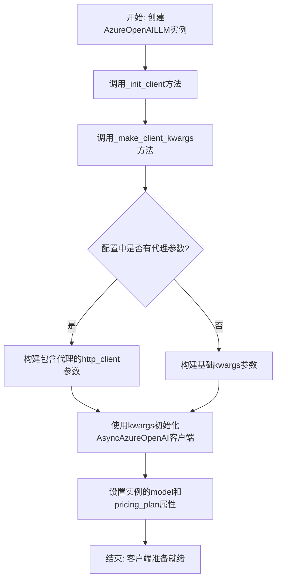
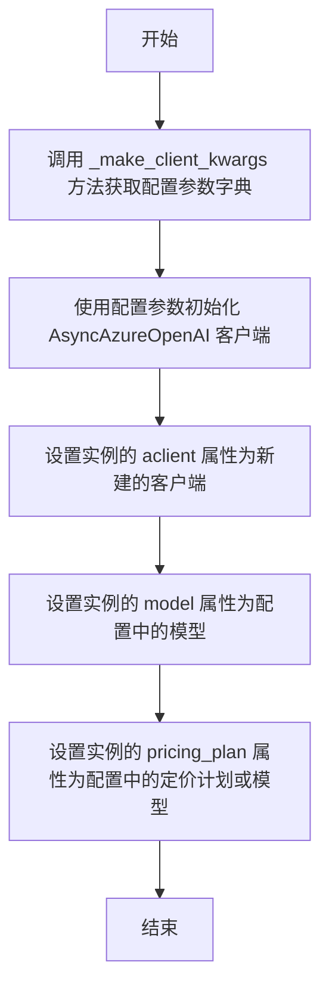
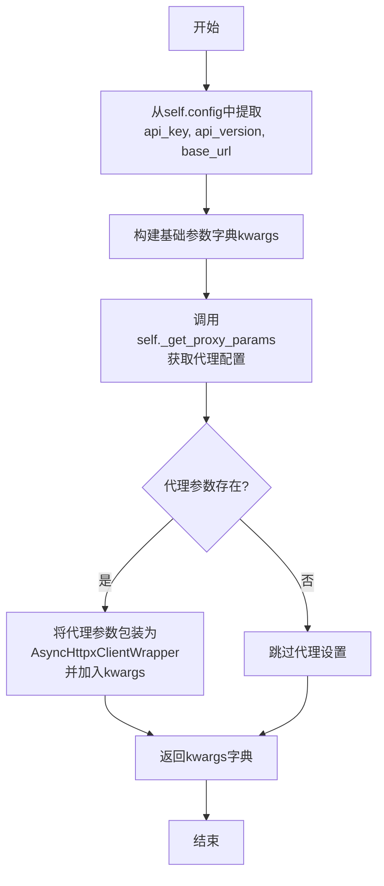

# `.\MetaGPT\metagpt\provider\azure_openai_api.py` 详细设计文档

该文件定义了一个AzureOpenAILLM类，它继承自OpenAILLM，是MetaGPT框架中用于连接和调用微软Azure OpenAI服务的具体提供者实现。它通过注册机制与LLMType.AZURE类型关联，并负责初始化异步客户端、配置代理参数，以适配Azure OpenAI的特定API端点、密钥和版本要求。

## 整体流程



## 类结构

```
OpenAILLM (父类，位于metagpt.provider.openai_api)
└── AzureOpenAILLM (本文件定义的类)
```

## 全局变量及字段


### `AzureOpenAILLM.aclient`
    
异步Azure OpenAI客户端实例，用于与Azure OpenAI服务进行交互。

类型：`AsyncAzureOpenAI`
    


### `AzureOpenAILLM.model`
    
当前使用的AI模型名称，用于计算使用量和构造请求参数。

类型：`str`
    


### `AzureOpenAILLM.pricing_plan`
    
定价计划标识符，默认为模型名称，用于成本计算或计费。

类型：`str`
    
    

## 全局函数及方法


### `AzureOpenAILLM._init_client`

该方法用于初始化Azure OpenAI异步客户端，配置API密钥、版本、终结点以及代理参数，并设置模型和定价计划。

参数：

-  `self`：`AzureOpenAILLM`，当前AzureOpenAILLM类的实例

返回值：`None`，无返回值

#### 流程图



#### 带注释源码

```python
def _init_client(self):
    # 调用 _make_client_kwargs 方法生成客户端初始化所需的参数字典
    kwargs = self._make_client_kwargs()
    # 使用生成的参数字典初始化 Azure OpenAI 异步客户端
    # 参考链接：https://learn.microsoft.com/zh-cn/azure/ai-services/openai/how-to/migration?tabs=python-new%2Cdalle-fix
    self.aclient = AsyncAzureOpenAI(**kwargs)
    # 设置当前实例的 model 属性为配置中的模型，用于后续计算使用量和构造请求参数
    self.model = self.config.model  # Used in _calc_usage & _cons_kwargs
    # 设置定价计划，如果配置中指定了 pricing_plan 则使用，否则使用模型名称作为定价计划
    self.pricing_plan = self.config.pricing_plan or self.model
```


### `AzureOpenAILLM._make_client_kwargs`

该方法用于构建并返回初始化 Azure OpenAI 异步客户端 (`AsyncAzureOpenAI`) 所需的关键参数字典。它整合了配置中的认证信息、API 版本、终结点，并根据需要配置代理参数。

参数：
-  `self`：`AzureOpenAILLM`，当前 `AzureOpenAILLM` 类的实例。

返回值：`dict`，一个包含用于初始化 `AsyncAzureOpenAI` 客户端的关键参数的字典。

#### 流程图



#### 带注释源码

```python
def _make_client_kwargs(self) -> dict:
    # 1. 构建基础参数字典，包含Azure OpenAI服务必需的身份验证和连接信息。
    kwargs = dict(
        api_key=self.config.api_key,          # API密钥，用于身份验证
        api_version=self.config.api_version,  # Azure OpenAI API的版本号
        azure_endpoint=self.config.base_url,  # Azure OpenAI服务的终结点URL
    )

    # 2. 获取代理配置参数（例如代理服务器地址、端口等）。
    proxy_params = self._get_proxy_params()
    # 3. 如果配置了代理，则将其包装成OpenAI客户端库所需的格式并加入参数字典。
    if proxy_params:
        # 使用AsyncHttpxClientWrapper包装代理参数，以适配openai库的http_client接口。
        kwargs["http_client"] = AsyncHttpxClientWrapper(**proxy_params)

    # 4. 返回最终构建好的参数字典。
    return kwargs
```


## 关键组件


### 注册机制

通过装饰器 `@register_provider(LLMType.AZURE)` 将 `AzureOpenAILLM` 类注册为特定类型（`LLMType.AZURE`）的LLM提供者，实现了提供者的可插拔式管理。

### 客户端初始化与配置

`AzureOpenAILLM` 类通过 `_init_client` 和 `_make_client_kwargs` 方法，根据配置（如API密钥、版本、终端地址）初始化并配置 `AsyncAzureOpenAI` 客户端，支持通过代理参数进行网络连接定制。

### 继承与复用

`AzureOpenAILLM` 类继承自 `OpenAILLM`，复用其核心的LLM交互逻辑（如用量计算、请求构造），同时通过重写 `_init_client` 和 `_make_client_kwargs` 方法，专门适配Azure OpenAI服务的特定配置要求。


## 问题及建议


### 已知问题

-   **连接泄漏风险**：代码中使用了 `AsyncHttpxClientWrapper` 来支持代理，但未显式管理其生命周期。如果 `AsyncAzureOpenAI` 客户端在异常情况下未能正确关闭，可能导致底层的 `AsyncHttpxClientWrapper` 及其连接池未释放，造成资源泄漏。
-   **配置验证缺失**：`_make_client_kwargs` 方法直接使用配置对象（`self.config`）中的值构建参数字典，但未对这些配置项（如 `api_key`, `api_version`, `base_url`）进行有效性或完整性检查。如果配置错误或不完整，错误可能直到实际调用API时才暴露，增加调试难度。
-   **硬编码的模型映射**：在 `_init_client` 方法中，`self.model` 被直接赋值为 `self.config.model`，并用于计费和后续的请求参数构造。如果Azure OpenAI服务的模型命名与配置中的模型标识符存在差异，或者需要更复杂的映射逻辑，当前实现缺乏灵活性。
-   **代理参数处理耦合**：代理参数的获取（`self._get_proxy_params`）与客户端构建逻辑耦合在 `_make_client_kwargs` 方法中。这虽然封装了细节，但也使得 `AzureOpenAILLM` 类依赖于父类 `OpenAILLM` 中 `_get_proxy_params` 方法的具体实现，降低了子类的独立性和可测试性。

### 优化建议

-   **显式资源管理**：考虑在 `AzureOpenAILLM` 类中实现一个 `close` 或 `aclose` 方法，用于显式关闭 `self.aclient`。同时，确保类在析构时或使用上下文管理器（`async with`）时能自动清理资源。可以检查父类 `OpenAILLM` 是否已提供相关方法并进行调用。
-   **增强配置验证**：在 `_init_client` 或 `_make_client_kwargs` 方法开始时，增加对必要配置参数的验证。例如，检查 `api_key`, `api_version`, `base_url` 是否非空且格式基本有效。可以抛出具有明确信息的异常（如 `ValueError`），便于快速定位配置问题。
-   **解耦模型配置与使用**：将模型名称的映射或处理逻辑抽象出来。可以创建一个单独的方法（如 `_get_model_for_request`）来决定最终发送给API的模型参数。这样，子类可以覆盖此方法来处理特定于Azure的模型命名规则，而不影响计费（`self.pricing_plan`）等其他用途的模型标识符。
-   **重构代理参数集成**：将代理参数的准备与客户端 `kwargs` 的构建进一步分离。例如，可以设计一个 `_get_http_client_config` 方法，专门负责生成与HTTP客户端相关的配置字典（包括代理）。这样可以使 `_make_client_kwargs` 方法更专注于Azure特有的参数，提高代码的清晰度和可维护性。同时，确保对 `_get_proxy_params` 的依赖有清晰的文档说明。
-   **增加日志与监控点**：在客户端初始化和关键参数构建步骤中添加调试或信息级别的日志记录。例如，记录正在使用的Azure终结点、API版本和模型（脱敏后）。这有助于在分布式或复杂部署环境中跟踪问题。


## 其它


### 设计目标与约束

1. **设计目标**：
   - 提供与Azure OpenAI服务兼容的LLM（大语言模型）客户端实现。
   - 复用`OpenAILLM`基类的核心功能，如请求处理、费用计算等，实现代码复用。
   - 通过`register_provider`机制，使本类能作为`LLMType.AZURE`类型的提供者被系统动态发现和使用。
   - 支持通过代理服务器连接Azure OpenAI服务。

2. **设计约束**：
   - 必须继承自`OpenAILLM`基类，遵循其定义的接口和内部流程。
   - 必须适配Azure OpenAI服务的特定参数，如`api_version`、`azure_endpoint`（即`base_url`）。
   - 客户端初始化必须使用`openai`库的`AsyncAzureOpenAI`类。
   - 代理配置需要适配`openai` v1.x版本的`AsyncHttpxClientWrapper`方式。

### 错误处理与异常设计

1. **错误来源**：
   - **网络错误**：如连接超时（`ReadTimeout`）、代理错误、服务不可用等。已在基类或历史修改中提及修复。
   - **API错误**：由Azure OpenAI服务返回的错误，如无效的API Key、模型不可用、配额不足、请求参数错误等。这些错误会由`AsyncAzureOpenAI`客户端抛出`openai.APIError`或其子类。
   - **配置错误**：如`LLMConfig`中必要的Azure参数（`api_key`, `api_version`, `base_url`）缺失或格式错误，导致`_init_client`或`_make_client_kwargs`失败。

2. **异常处理策略**：
   - 网络及API层错误预计在基类`OpenAILLM`的请求方法（如`achat`）中被捕获和处理，可能包括重试、降级或向上抛出业务异常。
   - 配置错误应在初始化阶段尽早暴露。
   - 本类专注于正确构建客户端参数，将具体的请求和异常处理逻辑委托给基类。

### 数据流与状态机

1. **主要数据流**：
   - **初始化流程**：`LLMConfig` -> `AzureOpenAILLM.__init__` -> `_init_client` -> `_make_client_kwargs` -> 创建`AsyncAzureOpenAI`实例 -> 设置`self.aclient`。
   - **请求流程**（继承自基类）：用户调用`achat`等方法 -> 基类方法准备请求参数 -> 通过`self.aclient`（即本类初始化的`AsyncAzureOpenAI`实例）发送请求至Azure端点 -> 接收响应 -> 基类处理响应并计算使用量。

2. **状态**：
   - `self.aclient`：核心状态，表示与Azure OpenAI服务的异步连接会话。一旦初始化完成，在对象生命周期内应保持不变。
   - `self.model` 和 `self.pricing_plan`：从配置中获取，用于标识模型和计费方案，在费用计算时使用。

### 外部依赖与接口契约

1. **外部库依赖**：
   - `openai` >= 1.0.0：主要SDK，特别是其中的`AsyncAzureOpenAI`和`AsyncHttpxClientWrapper`类。
   - `metagpt.configs.llm_config`：定义了`LLMType`枚举和`LLMConfig`配置结构。
   - `metagpt.provider.llm_provider_registry`：提供`register_provider`装饰器，用于提供商注册。
   - `metagpt.provider.openai_api`：提供基类`OpenAILLM`。

2. **接口契约**：
   - **对上游（调用者）的契约**：作为`LLMType.AZURE`的提供商，提供与`OpenAILLM`基类一致的异步聊天接口（如`achat`）。
   - **对下游（Azure服务）的契约**：通过`AsyncAzureOpenAI`客户端，按照Azure OpenAI REST API的规范发送HTTP请求。
   - **配置契约**：依赖的`LLMConfig`对象必须包含Azure特有的字段：`api_key`、`api_version`、`base_url`（映射为`azure_endpoint`），并可选的`proxy`配置。

### 配置管理

1. **配置项**：
   - `api_key` (str): Azure OpenAI服务的API密钥。
   - `api_version` (str): 使用的Azure OpenAI API版本（如`"2024-02-15-preview"`）。
   - `base_url` (str): Azure OpenAI服务的终端节点URL（如`"https://your-resource.openai.azure.com/"`）。
   - `model` (str): 指定要使用的部署模型名称。
   - `pricing_plan` (str, optional): 用于费用计算的定价计划标识，默认为`model`值。
   - `proxy` (str, optional): 代理服务器地址。

2. **配置来源与传递**：
   - 配置通过`LLMConfig`实例在初始化时传入基类构造函数，最终由本类通过`self.config`属性访问。
   - 代理配置通过基类的`_get_proxy_params`方法解析。

### 生命周期管理

1. **对象初始化**：
   - 在提供商注册机制下，当系统需要`LLMType.AZURE`类型的LLM时，会实例化本类。
   - 初始化过程会调用`_init_client`来创建并设置异步客户端。

2. **资源清理**：
   - 代码注释历史提到修复“Unclosed connection”问题。在`openai` 1.x版本中，`AsyncAzureOpenAI`客户端应在其生命周期结束时被正确关闭。通常这需要在应用程序关闭时或对象销毁前，调用客户端的`close()`方法或使用异步上下文管理器。当前代码片段未显式展示清理逻辑，这部分可能由基类、框架或调用者负责。

### 安全考虑

1. **敏感信息**：
   - `api_key`是高度敏感信息。代码中通过`self.config`访问，应确保配置管理过程安全（如从环境变量或安全存储中读取），避免硬编码或日志泄露。

2. **通信安全**：
   - 与`azure_endpoint`的通信应使用HTTPS。
   - 通过代理访问时，需确保代理通道的安全性。

### 测试策略建议

1. **单元测试**：
   - 测试`_make_client_kwargs`方法在不同配置（有无代理、正确/错误的Azure参数）下是否能生成正确的参数字典。
   - 模拟`AsyncAzureOpenAI`的初始化，验证`_init_client`能正确设置`self.aclient`。

2. **集成测试**：
   - 使用测试用的Azure OpenAI资源或模拟服务器，验证完整的请求-响应流程。
   - 测试代理功能是否正常工作。

3. **配置测试**：
   - 验证当必要的Azure配置缺失时，是否有适当的错误提示或异常抛出。

    