# `.\MetaGPT\metagpt\provider\base_llm.py` 详细设计文档

该文件定义了一个抽象基类 `BaseLLM`，用于规范与大型语言模型（LLM）API 的交互。它提供了消息格式化、成本管理、错误重试、消息压缩等通用功能，并定义了异步完成、流式处理等核心操作的抽象接口，旨在为不同的LLM提供商（如OpenAI、Azure等）实现一个统一、可扩展的接口层。

## 整体流程

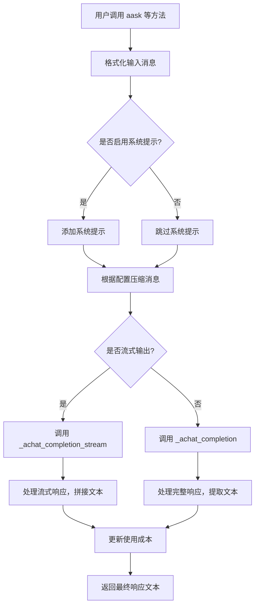

## 类结构

```
BaseLLM (抽象基类)
├── 字段: config, use_system_prompt, system_prompt, aclient, cost_manager, model, pricing_plan, _reasoning_content
├── 属性: reasoning_content
├── 抽象方法: __init__, _achat_completion, acompletion, _achat_completion_stream
├── 具体方法: _user_msg, _user_msg_with_imgs, _assistant_msg, _system_msg, support_image_input, format_msg, _system_msgs, _default_system_msg, _update_costs, get_costs, mask_base64_data, aask, _extract_assistant_rsp, aask_batch, aask_code, acompletion_text, get_choice_text, get_choice_delta_text, get_choice_function, get_choice_function_arguments, messages_to_prompt, messages_to_dict, with_model, get_timeout, count_tokens, compress_messages
└── 装饰器方法: acompletion_text (使用 tenacity.retry 装饰)
```

## 全局变量及字段


### `IMAGES`
    
用于在消息元数据中标识图像数据的常量键名

类型：`str`
    


### `LLM_API_TIMEOUT`
    
LLM API调用的默认超时时间常量

类型：`int`
    


### `USE_CONFIG_TIMEOUT`
    
表示应使用配置中超时设置的标志常量

类型：`int`
    


### `MULTI_MODAL_MODELS`
    
支持多模态输入（如图像）的模型名称列表

类型：`list[str]`
    


### `TOKEN_MAX`
    
各模型的最大token限制映射表

类型：`dict[str, int]`
    


### `BaseLLM.config`
    
LLM的配置对象，包含API密钥、端点、超时等设置

类型：`LLMConfig`
    


### `BaseLLM.use_system_prompt`
    
是否在对话中使用系统提示的标志

类型：`bool`
    


### `BaseLLM.system_prompt`
    
默认的系统提示内容

类型：`str`
    


### `BaseLLM.aclient`
    
异步LLM客户端实例，用于与API交互

类型：`Optional[Union[AsyncOpenAI]]`
    


### `BaseLLM.cost_manager`
    
用于跟踪和管理API调用成本的组件

类型：`Optional[CostManager]`
    


### `BaseLLM.model`
    
当前使用的LLM模型名称

类型：`Optional[str]`
    


### `BaseLLM.pricing_plan`
    
用于成本计算的定价计划标识

类型：`Optional[str]`
    


### `BaseLLM._reasoning_content`
    
存储推理模式返回的中间推理内容

类型：`Optional[str]`
    
    

## 全局函数及方法

### `log_and_reraise`

这是一个用于重试装饰器的错误回调函数。当重试逻辑最终失败（即所有重试尝试都因指定的异常而失败）时，此函数会被调用。它的主要作用是记录最后一次尝试失败的异常信息，然后将该异常重新抛出，确保调用者能够感知到最终的失败。

参数：

-  `retry_state`：`tenacity.RetryCallState`，包含重试状态信息的对象，例如最后一次尝试的异常。

返回值：`None`，此函数不返回任何值，而是直接重新抛出异常。

#### 流程图

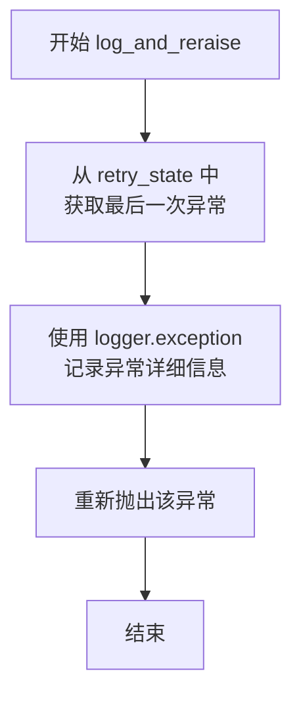

#### 带注释源码

```python
def log_and_reraise(retry_state):
    """
    重试失败后的回调函数，用于记录异常并重新抛出。
    
    参数:
        retry_state (tenacity.RetryCallState): 包含重试状态的对象。
        
    返回:
        无。此函数总是重新抛出异常。
    """
    # 从 retry_state 中获取最后一次尝试抛出的异常
    ex = retry_state.outcome.exception()
    # 使用 logger.exception 记录异常的完整堆栈跟踪信息
    logger.exception(ex)
    # 重新抛出该异常，确保调用者能收到最终的失败信号
    raise ex
```

### `BaseLLM.__init__`

BaseLLM 类的抽象初始化方法，要求所有继承类必须实现此方法以完成 LLM 客户端的配置初始化。

参数：

- `config`：`LLMConfig`，LLM 的配置对象，包含模型、API 密钥、超时等配置信息

返回值：`None`，此方法不返回任何值

#### 流程图

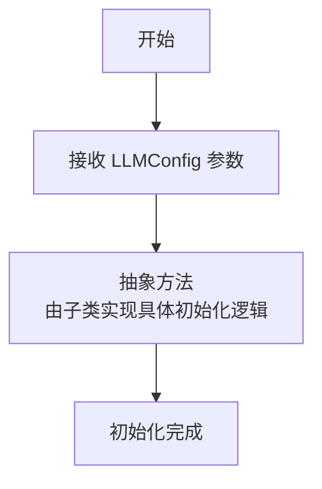

#### 带注释源码

```python
@abstractmethod
def __init__(self, config: LLMConfig):
    pass
```

### `BaseLLM._user_msg`

该方法用于构建用户消息字典，支持纯文本和带图像的多模态输入。当模型支持图像输入且提供了图像参数时，会调用内部方法构建包含图像内容的消息结构；否则返回标准的用户角色文本消息。

参数：

- `msg`：`str`，用户输入的文本消息内容。
- `images`：`Optional[Union[str, list[str]]]`，可选的图像参数，可以是单个图像URL/Base64字符串或此类字符串的列表。

返回值：`dict[str, Union[str, dict]]`，返回一个符合OpenAI API格式的消息字典。键`"role"`固定为`"user"`，键`"content"`的值根据输入决定：纯文本时为字符串，带图像时为包含文本和图像URL的字典列表。

#### 流程图

```mermaid
flowchart TD
    A[开始: _user_msg(msg, images)] --> B{images存在且<br>模型支持图像输入?}
    B -- 是 --> C[调用 _user_msg_with_imgs<br>构建多模态消息]
    B -- 否 --> D[返回标准用户消息字典<br>{"role": "user", "content": msg}]
    C --> E[返回包含图像内容的消息字典]
    D --> F[结束]
    E --> F
```

#### 带注释源码

```python
def _user_msg(self, msg: str, images: Optional[Union[str, list[str]]] = None) -> dict[str, Union[str, dict]]:
    # 检查是否提供了图像参数，并且当前模型支持图像输入
    if images and self.support_image_input():
        # 如果支持，则调用专门处理图像消息的方法
        return self._user_msg_with_imgs(msg, images)
    else:
        # 否则，返回标准的纯文本用户消息格式
        return {"role": "user", "content": msg}
```

### `BaseLLM._user_msg_with_imgs`

该方法用于构建包含文本和图像内容的多模态用户消息。当模型支持图像输入时，将文本消息与图像数据（URL或base64编码）组合成一个符合多模态API要求的消息结构。

参数：

- `msg`：`str`，用户输入的文本消息内容
- `images`：`Optional[Union[str, list[str]]]`，可选的图像数据，可以是单个图像URL/base64字符串，或图像URL/base64字符串列表

返回值：`dict[str, Union[str, dict]]`，返回一个包含"role"和"content"键的字典，其中"content"是一个列表，包含文本和图像内容项

#### 流程图

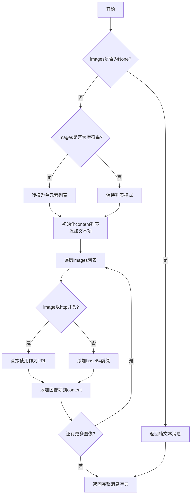

#### 带注释源码

```python
def _user_msg_with_imgs(self, msg: str, images: Optional[Union[str, list[str]]]):
    """
    images: can be list of http(s) url or base64
    """
    # 如果images是单个字符串，转换为列表以便统一处理
    if isinstance(images, str):
        images = [images]
    
    # 初始化content列表，首先添加文本内容
    content = [{"type": "text", "text": msg}]
    
    # 遍历所有图像
    for image in images:
        # 判断是URL还是base64编码：以http开头的视为URL，否则视为base64
        url = image if image.startswith("http") else f"data:image/jpeg;base64,{image}"
        # 添加图像项到content列表，支持多图像输入
        content.append({"type": "image_url", "image_url": {"url": url}})
    
    # 返回完整的消息字典，包含角色和内容
    return {"role": "user", "content": content}
```

### `BaseLLM._assistant_msg`

该方法用于创建一个表示AI助手消息的字典，遵循OpenAI的聊天消息格式。

参数：

- `msg`：`str`，AI助手生成的消息内容

返回值：`dict[str, str]`，返回一个包含"role"和"content"键的字典，其中"role"固定为"assistant"，"content"为传入的消息内容

#### 流程图

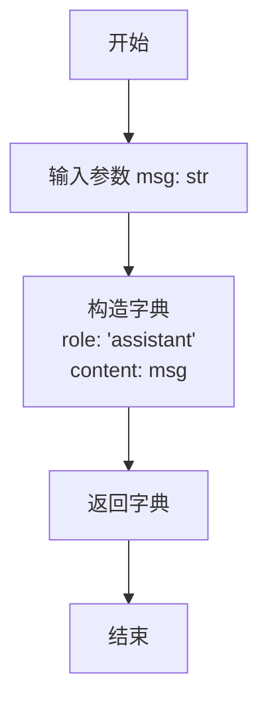

#### 带注释源码

```python
def _assistant_msg(self, msg: str) -> dict[str, str]:
    # 返回一个表示AI助手消息的字典
    # 格式遵循OpenAI聊天API的消息格式
    return {"role": "assistant", "content": msg}
```

### `BaseLLM._system_msg`

该方法用于创建一个系统角色的消息字典，通常用于在对话中设置系统提示或指令。

参数：

- `msg`：`str`，系统消息的内容，将作为消息字典中的"content"值。

返回值：`dict[str, str]`，返回一个包含"role"和"content"键的字典，其中"role"固定为"system"，"content"为传入的消息内容。

#### 流程图

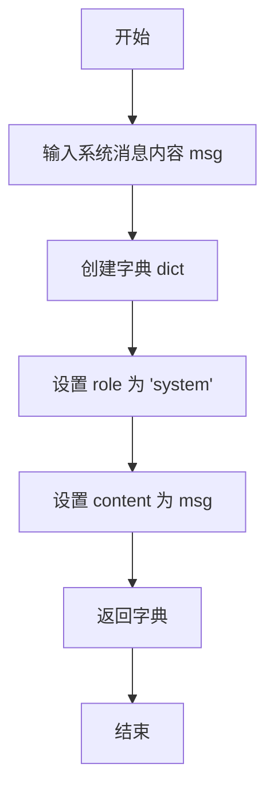

#### 带注释源码

```python
def _system_msg(self, msg: str) -> dict[str, str]:
    # 创建一个字典，表示系统角色的消息
    # role: 固定为 'system'，表示消息来自系统
    # content: 传入的消息内容
    return {"role": "system", "content": msg}
```

### `BaseLLM.support_image_input`

该方法用于检查当前LLM模型是否支持图像输入功能。它通过检查模型名称是否包含在多模态模型列表中来实现这一判断。

参数：

- 无参数

返回值：`bool`，返回True表示当前模型支持图像输入，False表示不支持

#### 流程图

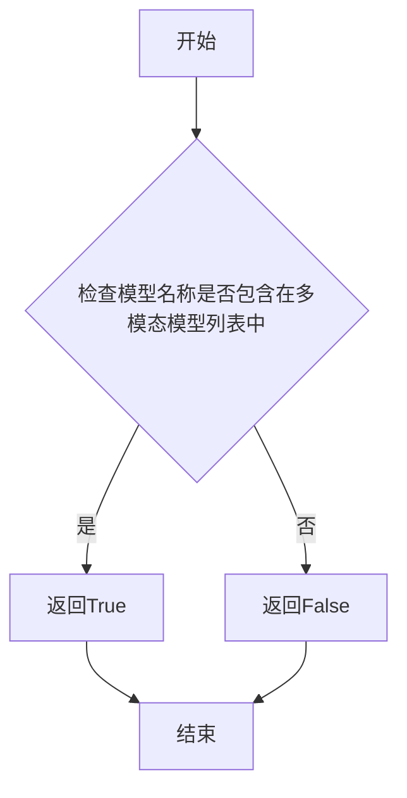

#### 带注释源码

```python
def support_image_input(self) -> bool:
    """
    检查当前LLM模型是否支持图像输入功能
    
    该方法通过检查实例的model属性是否包含在MULTI_MODAL_MODELS列表中
    来判断当前模型是否支持多模态输入（特别是图像输入）
    
    Returns:
        bool: 如果模型支持图像输入返回True，否则返回False
    """
    return any([m in self.model for m in MULTI_MODAL_MODELS])
```

### `BaseLLM.format_msg`

将多种格式的消息（字符串、Message对象、字典、字符串列表）转换为标准化的OpenAI API消息格式列表。

参数：

- `messages`：`Union[str, "Message", list[dict], list["Message"], list[str]]`，需要格式化的消息，可以是单个消息或消息列表

返回值：`list[dict]`，标准化后的消息列表，每个元素为包含"role"和"content"键的字典

#### 流程图

```mermaid
flowchart TD
    A[开始: format_msg(messages)] --> B{是否为列表?}
    B -->|否| C[转换为列表 messages = [messages]]
    B -->|是| C
    C --> D[初始化 processed_messages = []]
    D --> E[遍历 messages 中的每个 msg]
    E --> F{msg 类型判断}
    
    F -->|字符串| G[添加 {"role": "user", "content": msg}]
    F -->|字典| H{检查键是否为 role 和 content}
    H -->|是| I[直接添加 msg]
    H -->|否| J[抛出异常]
    F -->|Message对象| K{是否有图片元数据?}
    K -->|是| L[调用 _user_msg 处理图片]
    K -->|否| M[调用 to_dict 转换]
    F -->|其他类型| N[抛出 ValueError]
    
    G --> O[添加到 processed_messages]
    I --> O
    L --> O
    M --> O
    J --> P[结束: 抛出异常]
    N --> P
    
    O --> Q{是否遍历完成?}
    Q -->|否| E
    Q -->|是| R[返回 processed_messages]
```

#### 带注释源码

```python
def format_msg(self, messages: Union[str, "Message", list[dict], list["Message"], list[str]]) -> list[dict]:
    """convert messages to list[dict]."""
    from metagpt.schema import Message  # 延迟导入避免循环依赖

    # 步骤1: 统一转换为列表处理
    if not isinstance(messages, list):
        messages = [messages]

    processed_messages = []  # 存储处理后的消息
    
    # 步骤2: 遍历所有消息进行类型转换
    for msg in messages:
        # 情况1: 字符串类型 -> 转换为用户消息
        if isinstance(msg, str):
            processed_messages.append({"role": "user", "content": msg})
        
        # 情况2: 字典类型 -> 验证格式后直接使用
        elif isinstance(msg, dict):
            # 验证字典格式是否符合OpenAI API标准
            assert set(msg.keys()) == set(["role", "content"])
            processed_messages.append(msg)
        
        # 情况3: Message对象 -> 根据是否有图片元数据选择处理方式
        elif isinstance(msg, Message):
            # 检查消息中是否包含图片
            images = msg.metadata.get(IMAGES)
            if images:
                # 有图片: 调用专门的图片消息处理方法
                processed_msg = self._user_msg(msg=msg.content, images=images)
            else:
                # 无图片: 使用Message对象的to_dict方法
                processed_msg = msg.to_dict()
            processed_messages.append(processed_msg)
        
        # 情况4: 不支持的类型 -> 抛出异常
        else:
            raise ValueError(
                f"Only support message type are: str, Message, dict, but got {type(messages).__name__}!"
            )
    
    # 步骤3: 返回处理后的消息列表
    return processed_messages
```

### `BaseLLM._system_msgs`

该方法接收一个字符串列表，为每个字符串生成一个系统角色的消息字典，并返回这些字典组成的列表。

参数：

- `msgs`：`list[str]`，包含多个系统消息内容的字符串列表

返回值：`list[dict[str, str]]`，由系统消息字典组成的列表，每个字典包含"role"和"content"键

#### 流程图

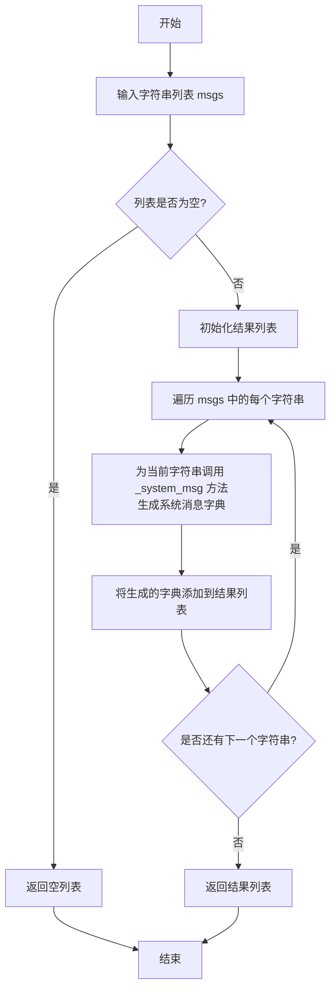

#### 带注释源码

```python
def _system_msgs(self, msgs: list[str]) -> list[dict[str, str]]:
    # 使用列表推导式，为输入列表中的每个字符串调用 _system_msg 方法
    # _system_msg 方法会将单个字符串包装成 {"role": "system", "content": msg} 格式的字典
    # 最终返回一个包含所有系统消息字典的列表
    return [self._system_msg(msg) for msg in msgs]
```

### `BaseLLM._default_system_msg`

该方法用于生成一个默认的系统消息字典。它调用 `_system_msg` 方法，并传入类属性 `system_prompt` 作为内容，从而创建一个角色为 "system"、内容为预设系统提示的消息字典。

参数：
- 无

返回值：`dict[str, str]`，一个包含键 `"role"`（值为 `"system"`）和 `"content"`（值为 `self.system_prompt`）的字典。

#### 流程图

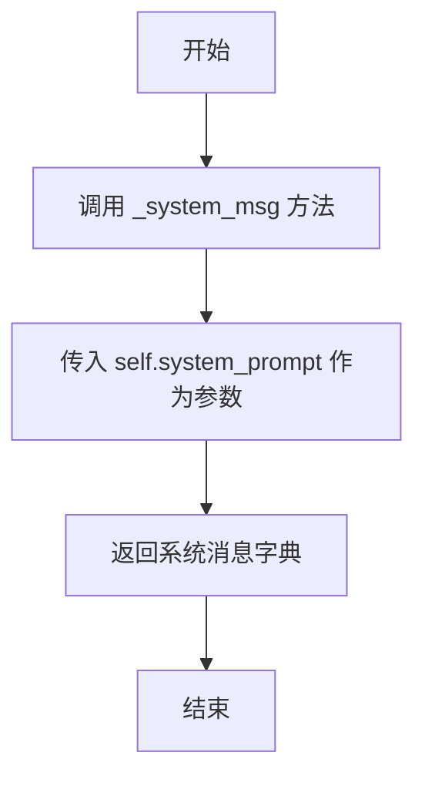

#### 带注释源码

```python
def _default_system_msg(self):
    # 调用 _system_msg 方法，传入类属性 system_prompt 作为消息内容
    # 返回一个格式为 {"role": "system", "content": self.system_prompt} 的字典
    return self._system_msg(self.system_prompt)
```

### `BaseLLM._update_costs`

该方法用于更新每次LLM API请求的token成本。它会从API响应中提取prompt_tokens和completion_tokens，然后通过cost_manager更新累计成本。该方法包含异常处理机制，当成本更新失败时会记录错误日志但不会中断程序执行。

参数：

- `usage`：`Union[dict, BaseModel]`，API返回的token使用量信息，可以是字典或Pydantic模型
- `model`：`str`，模型名称或定价计划，默认为None
- `local_calc_usage`：`bool`，是否本地计算使用量，默认为True，会覆盖LLMConfig.calc_usage设置

返回值：`None`，无返回值

#### 流程图

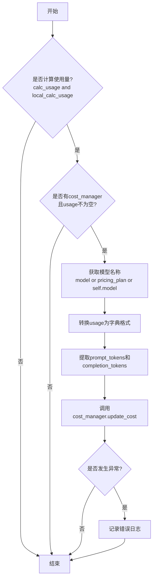

#### 带注释源码

```python
def _update_costs(self, usage: Union[dict, BaseModel], model: str = None, local_calc_usage: bool = True):
    """update each request's token cost
    Args:
        model (str): model name or in some scenarios called endpoint
        local_calc_usage (bool): some models don't calculate usage, it will overwrite LLMConfig.calc_usage
    """
    # 检查是否需要计算使用量：配置允许且本地计算标志为True
    calc_usage = self.config.calc_usage and local_calc_usage
    # 确定使用的模型名称，优先级：传入参数 > pricing_plan > 实例的model
    model = model or self.pricing_plan
    model = model or self.model
    # 如果usage是Pydantic模型，转换为字典格式
    usage = usage.model_dump() if isinstance(usage, BaseModel) else usage
    # 只有在需要计算、有cost_manager且usage不为空时才进行成本更新
    if calc_usage and self.cost_manager and usage:
        try:
            # 从usage中提取prompt_tokens和completion_tokens，默认为0
            prompt_tokens = int(usage.get("prompt_tokens", 0))
            completion_tokens = int(usage.get("completion_tokens", 0))
            # 调用cost_manager更新成本
            self.cost_manager.update_cost(prompt_tokens, completion_tokens, model)
        except Exception as e:
            # 成本更新失败时记录错误日志，但不中断程序执行
            logger.error(f"{self.__class__.__name__} updates costs failed! exp: {e}")
```

### `BaseLLM.get_costs`

该方法用于获取当前LLM实例的累计使用成本。如果实例没有配置成本管理器（`cost_manager`），则返回一个零成本的`Costs`对象；否则，通过成本管理器获取并返回详细的成本信息。

参数：

- 无

返回值：`Costs`，包含总成本、提示令牌成本、完成令牌成本等详细信息的对象。

#### 流程图

```mermaid
flowchart TD
    A[开始] --> B{是否存在 cost_manager?}
    B -- 否 --> C[返回零成本的 Costs 对象]
    B -- 是 --> D[调用 cost_manager.get_costs()]
    D --> E[返回 Costs 对象]
    C --> F[结束]
    E --> F
```

#### 带注释源码

```python
def get_costs(self) -> Costs:
    """
    获取当前LLM实例的累计使用成本。
    如果实例没有配置成本管理器（cost_manager），则返回一个零成本的Costs对象。
    否则，通过成本管理器获取并返回详细的成本信息。

    Returns:
        Costs: 包含总成本、提示令牌成本、完成令牌成本等详细信息的对象。
    """
    if not self.cost_manager:
        # 如果没有配置成本管理器，返回一个零成本的Costs对象
        return Costs(0, 0, 0, 0)
    # 调用成本管理器的get_costs方法获取详细的成本信息
    return self.cost_manager.get_costs()
```

### `BaseLLM.mask_base64_data`

该方法用于处理消息字典中的Base64图像数据，将其替换为占位符，以便于日志记录和调试，避免因冗长的Base64数据导致日志可读性下降。

参数：
- `msg`：`dict`，一个遵循OpenAI格式的消息字典，可能包含文本或多媒体内容。

返回值：`dict`，处理后的消息字典，其中Base64图像数据已被替换为占位符。

#### 流程图

```mermaid
flowchart TD
    A[开始: 输入消息字典msg] --> B{msg是否为字典?}
    B -- 否 --> C[返回原消息msg]
    B -- 是 --> D[创建msg的浅拷贝new_msg]
    D --> E[获取new_msg中的content字段]
    E --> F{content是否为列表?}
    F -- 是 --> G[遍历content列表中的每个元素item]
    G --> H{item是否为字典且type为'image_url'?}
    H -- 是 --> I[获取image_url中的url]
    I --> J{url是否以'data:image/'开头?}
    J -- 是 --> K[复制item并替换url为占位符]
    J -- 否 --> L[保留原item]
    H -- 否 --> L
    K --> M[将处理后的item加入new_content]
    L --> M
    G --> N[循环结束]
    N --> O[将new_content赋值给new_msg['content']]
    F -- 否 --> P{content是否为字符串且包含'data:image/'?}
    P -- 是 --> Q[将new_msg['content']替换为文本占位符]
    P -- 否 --> R[保持new_msg['content']不变]
    O --> S[返回处理后的new_msg]
    Q --> S
    R --> S
    C --> S
```

#### 带注释源码

```python
def mask_base64_data(self, msg: dict) -> dict:
    """Process the base64 image data in the message, replacing it with placeholders for easier logging

    Args:
        msg (dict): A dictionary of messages in OpenAI format

    Returns:
        dict: This is the processed message dictionary with the image data replaced with placeholders
    """
    # 检查输入是否为字典，如果不是则直接返回原消息
    if not isinstance(msg, dict):
        return msg

    # 创建消息字典的浅拷贝，避免修改原始数据
    new_msg = msg.copy()
    # 获取消息内容，可能是字符串或列表
    content = new_msg.get("content")
    # 定义Base64图像数据的前缀，用于识别
    img_base64_prefix = "data:image/"

    # 情况1: 内容是多模态格式的列表（例如GPT-4V的输入格式）
    if isinstance(content, list):
        new_content = []
        for item in content:
            # 检查是否为图像URL项
            if isinstance(item, dict) and item.get("type") == "image_url":
                image_url = item.get("image_url", {}).get("url", "")
                # 如果URL是Base64数据，则替换为占位符
                if image_url.startswith(img_base64_prefix):
                    item = item.copy()  # 复制字典以避免修改原始项
                    item["image_url"] = {"url": "<Image base64 data has been omitted>"}
            new_content.append(item)
        new_msg["content"] = new_content
    # 情况2: 内容是纯文本字符串且包含Base64图像数据
    elif isinstance(content, str) and img_base64_prefix in content:
        # 将整个内容替换为文本占位符
        new_msg["content"] = "<Messages containing image base64 data have been omitted>"
    # 返回处理后的消息字典
    return new_msg
```

### `BaseLLM.aask`

该方法是一个异步方法，用于向大型语言模型（LLM）发送一个或多个消息，并获取其文本回复。它支持系统消息、格式化消息、图像输入、流式响应和消息压缩等功能，是LLM交互的核心接口。

参数：

- `msg`：`Union[str, list[dict[str, str]]]`，用户消息，可以是字符串或消息字典列表。
- `system_msgs`：`Optional[list[str]]`，可选的系统消息字符串列表，用于设置对话上下文。
- `format_msgs`：`Optional[list[dict[str, str]]]`，可选的格式化消息字典列表，用于插入额外的消息。
- `images`：`Optional[Union[str, list[str]]]`，可选的图像输入，可以是单个图像URL/Base64字符串或列表。
- `timeout`：`int`，请求超时时间，默认使用配置中的超时设置。
- `stream`：`Optional[bool]`，是否使用流式响应，默认使用配置中的流式设置。

返回值：`str`，LLM返回的文本回复内容。

#### 流程图

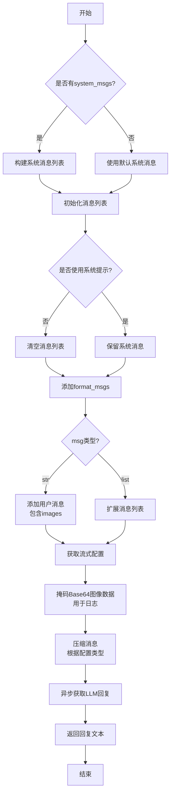

#### 带注释源码

```python
async def aask(
    self,
    msg: Union[str, list[dict[str, str]]],
    system_msgs: Optional[list[str]] = None,
    format_msgs: Optional[list[dict[str, str]]] = None,
    images: Optional[Union[str, list[str]]] = None,
    timeout=USE_CONFIG_TIMEOUT,
    stream=None,
) -> str:
    # 步骤1: 构建初始消息列表。如果有传入的系统消息，则使用它们；否则，使用默认的系统提示。
    if system_msgs:
        message = self._system_msgs(system_msgs)
    else:
        message = [self._default_system_msg()]
    # 步骤2: 根据配置决定是否包含系统提示。
    if not self.use_system_prompt:
        message = []
    # 步骤3: 添加任何额外的格式化消息。
    if format_msgs:
        message.extend(format_msgs)
    # 步骤4: 处理主用户消息。如果msg是字符串，则构建一个用户消息字典（可能包含图像）；如果已经是列表，则直接扩展。
    if isinstance(msg, str):
        message.append(self._user_msg(msg, images=images))
    else:
        message.extend(msg)
    # 步骤5: 确定是否使用流式响应。如果调用时未指定，则使用配置中的默认值。
    if stream is None:
        stream = self.config.stream

    # 步骤6: 为了日志清晰，将消息中的Base64图像数据替换为占位符。
    masked_message = [self.mask_base64_data(m) for m in message]
    logger.debug(masked_message)

    # 步骤7: 根据配置的压缩策略压缩消息，以适配模型的Token限制。
    compressed_message = self.compress_messages(message, compress_type=self.config.compress_type)
    # 步骤8: 异步调用LLM的文本补全接口，获取回复。
    rsp = await self.acompletion_text(compressed_message, stream=stream, timeout=self.get_timeout(timeout))
    # 步骤9: 返回LLM的文本回复。
    return rsp
```

### `BaseLLM._extract_assistant_rsp`

该方法用于从对话上下文中提取所有助手（assistant）角色的消息内容，并将它们连接成一个字符串返回。它遍历给定的上下文列表，筛选出角色为“assistant”的条目，提取其“content”字段，并用换行符连接这些内容。

参数：

- `context`：`list`，包含对话消息的列表，每个消息是一个字典，通常包含“role”和“content”等键。

返回值：`str`，包含所有助手角色消息内容的字符串，每条消息内容之间用换行符分隔。

#### 流程图

```mermaid
flowchart TD
    A[开始] --> B[初始化空列表 contents]
    B --> C[遍历 context 中的每个消息 msg]
    C --> D{msg['role'] == 'assistant'?}
    D -- 是 --> E[将 msg['content'] 添加到 contents]
    D -- 否 --> C
    E --> C
    C --> F[遍历结束]
    F --> G[用换行符连接 contents 中的所有元素]
    G --> H[返回连接后的字符串]
    H --> I[结束]
```

#### 带注释源码

```python
def _extract_assistant_rsp(self, context):
    # 使用列表推导式，遍历上下文列表，筛选出角色为'assistant'的消息，并提取其'content'字段
    # 最后用换行符'\n'连接所有提取出的内容，形成一个字符串
    return "\n".join([i["content"] for i in context if i["role"] == "assistant"])
```

### `BaseLLM.aask_batch`

该方法用于实现与大语言模型的批量顺序对话。它接收一个消息列表，依次将每条消息作为用户输入发送给模型，并将模型的回复添加到对话上下文中，最终返回所有助手回复的拼接字符串。

参数：

- `msgs`：`list`，包含多个用户消息的列表，每个消息通常是字符串
- `timeout`：`int`，请求超时时间，默认使用配置中的超时设置

返回值：`str`，所有助手回复的拼接字符串，每个回复之间用换行符分隔

#### 流程图

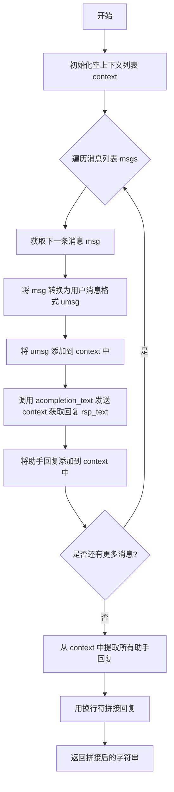

#### 带注释源码

```python
async def aask_batch(self, msgs: list, timeout=USE_CONFIG_TIMEOUT) -> str:
    """Sequential questioning"""  # 顺序提问
    context = []  # 初始化对话上下文列表
    for msg in msgs:  # 遍历每条用户消息
        umsg = self._user_msg(msg)  # 将消息转换为用户消息格式
        context.append(umsg)  # 将用户消息添加到上下文中
        rsp_text = await self.acompletion_text(context, timeout=self.get_timeout(timeout))  # 发送当前上下文获取模型回复
        context.append(self._assistant_msg(rsp_text))  # 将助手回复添加到上下文中
    return self._extract_assistant_rsp(context)  # 从上下文中提取所有助手回复并拼接返回
```

### `BaseLLM.aask_code`

该方法是一个抽象方法，用于向大型语言模型（LLM）发起异步请求以生成代码。它接收消息作为输入，并返回一个包含代码生成结果的字典。由于这是一个抽象方法，具体的实现细节由继承 `BaseLLM` 类的子类提供。

参数：

- `messages`：`Union[str, "Message", list[dict]]`，表示要发送给LLM的消息。可以是字符串、`Message`对象或消息字典列表。
- `timeout`：`int`，可选参数，默认为 `USE_CONFIG_TIMEOUT`，表示请求的超时时间（秒）。
- `**kwargs`：可变关键字参数，用于传递额外的配置选项。

返回值：`dict`，返回一个字典，包含LLM生成的代码及相关信息。

#### 流程图

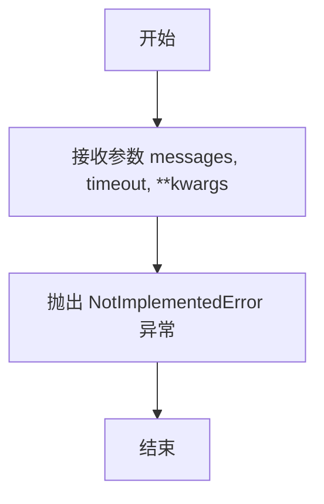

#### 带注释源码

```python
async def aask_code(
    self, messages: Union[str, "Message", list[dict]], timeout=USE_CONFIG_TIMEOUT, **kwargs
) -> dict:
    raise NotImplementedError
```

### `BaseLLM._achat_completion`

该方法是一个抽象方法，用于实现异步聊天补全功能。它定义了所有继承自 `BaseLLM` 的类必须提供的标准接口，用于向大语言模型发送消息并获取响应。具体的实现细节由子类完成，例如处理不同的API端点、请求格式和响应解析。

参数：

- `messages`：`list[dict]`，包含对话消息的列表，每个消息是一个字典，通常包含 `role`（如 "user"、"assistant"、"system"）和 `content` 字段。
- `timeout`：`int`，请求的超时时间，单位为秒。默认值为 `USE_CONFIG_TIMEOUT`，表示使用配置中的超时设置。

返回值：`None`，这是一个抽象方法，没有具体实现，因此没有返回值。子类实现时应返回一个包含模型响应的字典。

#### 流程图

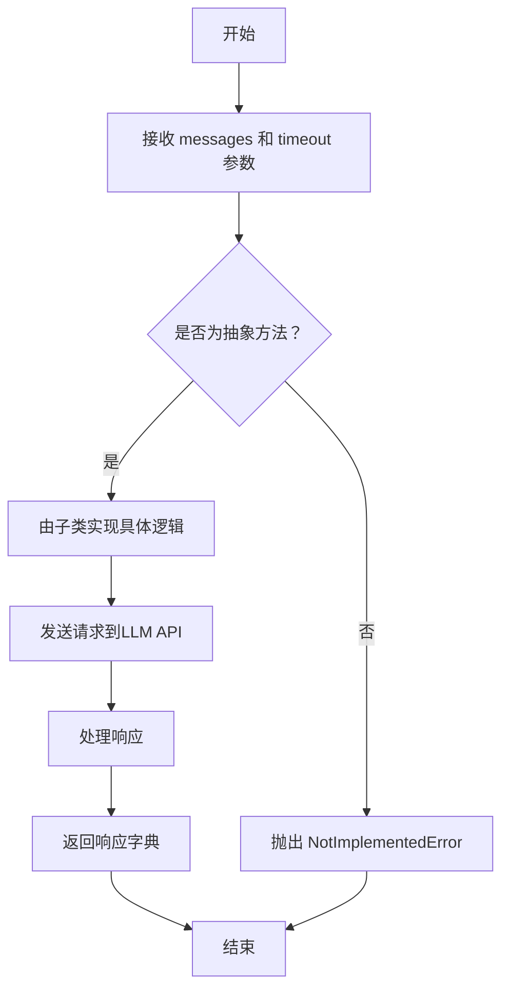

#### 带注释源码

```python
@abstractmethod
async def _achat_completion(self, messages: list[dict], timeout=USE_CONFIG_TIMEOUT):
    """_achat_completion implemented by inherited class"""
    # 这是一个抽象方法，没有具体实现。
    # 子类必须重写此方法，以提供与特定LLM API的异步交互逻辑。
    # 参数：
    #   messages: 消息列表，格式为 [{"role": "user", "content": "Hello"}]
    #   timeout: 请求超时时间，默认使用配置中的值
    # 返回值：
    #   子类应返回一个字典，包含LLM的完整响应，通常包括 choices、usage 等字段。
    pass
```

### `BaseLLM.acompletion`

该方法是一个抽象方法，定义了异步完成LLM对话的标准接口。它要求所有继承自`BaseLLM`的子类必须实现此方法，以提供与OpenAI兼容的聊天完成功能。该方法接收一个消息列表作为输入，并返回一个包含LLM响应的字典。

参数：

- `messages`：`list[dict]`，一个字典列表，每个字典代表一条消息，通常包含"role"（角色）和"content"（内容）键。格式遵循OpenAI的聊天完成API规范。
- `timeout`：`int`，可选参数，指定API调用的超时时间（秒）。默认值为`USE_CONFIG_TIMEOUT`，表示使用配置中的超时设置。

返回值：`dict`，返回一个字典，包含LLM的完整响应。通常，这个响应字典的结构与OpenAI的聊天完成API响应一致，例如包含"choices"键，其中存储了生成的回复消息。

#### 流程图

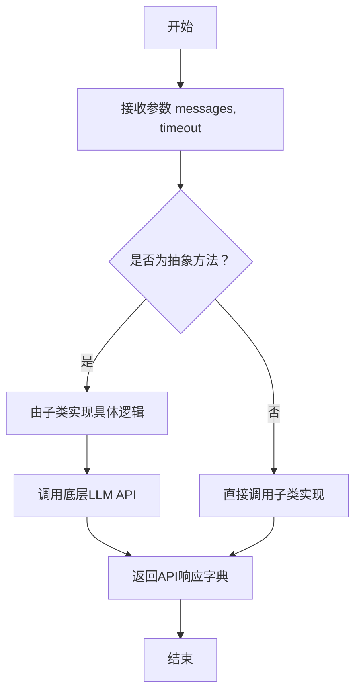

#### 带注释源码

```python
    @abstractmethod
    async def acompletion(self, messages: list[dict], timeout=USE_CONFIG_TIMEOUT):
        """Asynchronous version of completion
        All GPTAPIs are required to provide the standard OpenAI completion interface
        [
            {"role": "system", "content": "You are a helpful assistant."},
            {"role": "user", "content": "hello, show me python hello world code"},
            # {"role": "assistant", "content": ...}, # If there is an answer in the history, also include it
        ]
        """
```

### `BaseLLM._achat_completion_stream`

这是一个抽象方法，用于实现异步流式聊天完成功能。它接收消息列表和超时时间作为参数，返回一个字符串，表示从流式响应中提取的文本内容。

参数：

- `messages`：`list[dict]`，包含对话消息的列表，每个消息是一个字典，包含角色（如"user"、"assistant"、"system"）和内容。
- `timeout`：`int`，超时时间（秒），默认为`USE_CONFIG_TIMEOUT`。

返回值：`str`，从流式响应中提取的文本内容。

#### 流程图

```mermaid
flowchart TD
    A[开始] --> B[接收消息列表和超时时间]
    B --> C[调用具体实现的流式聊天完成方法]
    C --> D[处理流式响应]
    D --> E[返回提取的文本内容]
    E --> F[结束]
```

#### 带注释源码

```python
@abstractmethod
async def _achat_completion_stream(self, messages: list[dict], timeout: int = USE_CONFIG_TIMEOUT) -> str:
    """_achat_completion_stream implemented by inherited class"""
```

### `BaseLLM.acompletion_text`

该方法是一个异步的文本补全方法，支持流式和非流式两种模式。它通过重试机制处理连接错误，并调用具体的聊天完成实现来获取响应，最终返回纯文本内容。

参数：

- `messages`：`list[dict]`，消息列表，格式为OpenAI聊天完成API的标准格式，例如 `[{"role": "user", "content": "Hello"}]`。
- `stream`：`bool`，默认为`False`。指示是否使用流式响应。如果为`True`，则调用流式处理方法；如果为`False`，则调用非流式处理方法。
- `timeout`：`int`，默认为`USE_CONFIG_TIMEOUT`。请求的超时时间（秒）。

返回值：`str`，返回从LLM响应中提取的纯文本内容。

#### 流程图

```mermaid
graph TD
    A[开始: acompletion_text] --> B{stream 参数是否为 True?};
    B -- 是 --> C[调用 _achat_completion_stream 获取流式响应];
    C --> D[返回流式响应的最终文本];
    B -- 否 --> E[调用 _achat_completion 获取完整响应];
    E --> F[调用 get_choice_text 提取文本];
    F --> G[返回提取的文本];
    G --> H[结束];
    D --> H;
```

#### 带注释源码

```python
    @retry(
        stop=stop_after_attempt(3),  # 最多重试3次
        wait=wait_random_exponential(min=1, max=60),  # 使用指数退避策略等待重试，最小1秒，最大60秒
        after=after_log(logger, logger.level("WARNING").name),  # 重试后记录警告日志
        retry=retry_if_exception_type(ConnectionError),  # 仅对ConnectionError类型异常进行重试
        retry_error_callback=log_and_reraise,  # 重试失败后的回调函数，记录错误并重新抛出异常
    )
    async def acompletion_text(
        self, messages: list[dict], stream: bool = False, timeout: int = USE_CONFIG_TIMEOUT
    ) -> str:
        """Asynchronous version of completion. Return str. Support stream-print"""
        # 根据stream参数决定调用流式或非流式处理方法
        if stream:
            return await self._achat_completion_stream(messages, timeout=self.get_timeout(timeout))
        # 调用非流式聊天完成方法
        resp = await self._achat_completion(messages, timeout=self.get_timeout(timeout))
        # 从响应中提取文本内容并返回
        return self.get_choice_text(resp)
```

### `BaseLLM.get_choice_text`

该方法用于从LLM API的响应字典中提取第一个选择（choice）的文本内容。如果响应中包含推理内容（reasoning_content），则会将其存储到实例的`reasoning_content`属性中。

参数：

- `rsp`：`dict`，LLM API返回的响应字典，通常包含"choices"字段，其中每个选择包含"message"字段。

返回值：`str`，第一个选择的文本内容。

#### 流程图

```mermaid
graph TD
    A[开始] --> B{响应字典是否包含choices?}
    B -->|是| C[获取第一个choice的message]
    B -->|否| D[返回空字符串或抛出异常]
    C --> E{message中是否包含reasoning_content?}
    E -->|是| F[设置实例的reasoning_content属性]
    E -->|否| G[跳过设置reasoning_content]
    F --> H[返回message的content字段]
    G --> H
    H --> I[结束]
```

#### 带注释源码

```python
def get_choice_text(self, rsp: dict) -> str:
    """Required to provide the first text of choice"""
    # 从响应字典中获取第一个choice的message
    message = rsp.get("choices")[0]["message"]
    # 检查message中是否包含推理内容，如果包含则存储到实例属性中
    if "reasoning_content" in message:
        self.reasoning_content = message["reasoning_content"]
    # 返回message中的文本内容
    return message["content"]
```

### `BaseLLM.get_choice_delta_text`

该方法用于从流式响应的字典中提取第一个选择（choice）的增量文本内容（delta text）。在流式响应中，每次返回的是部分内容，该方法负责提取这部分内容。

参数：

- `rsp`：`dict`，包含流式响应的字典，通常来自OpenAI API的流式响应。

返回值：`str`，返回第一个选择的增量文本内容。如果字典中没有`choices`字段，或`choices`为空，或`delta`中没有`content`字段，则返回空字符串。

#### 流程图

```mermaid
flowchart TD
    A[开始] --> B{检查rsp中是否有choices字段}
    B -->|否| C[返回空字符串]
    B -->|是| D{检查choices是否为空}
    D -->|是| C
    D -->|否| E{检查第一个choice中是否有delta字段}
    E -->|否| C
    E -->|是| F{检查delta中是否有content字段}
    F -->|否| C
    F -->|是| G[返回content字段的值]
    G --> H[结束]
```

#### 带注释源码

```python
def get_choice_delta_text(self, rsp: dict) -> str:
    """Required to provide the first text of stream choice"""
    # 从响应字典中获取choices列表，如果不存在则返回空列表
    # 获取第一个choice的delta字典，如果不存在则返回空字典
    # 从delta字典中获取content字段，如果不存在则返回空字符串
    return rsp.get("choices", [{}])[0].get("delta", {}).get("content", "")
```

### `BaseLLM.get_choice_function`

该方法用于从OpenAI聊天完成API的响应中提取第一个工具调用（tool_calls）的函数信息。当API响应包含工具调用时，该方法可以解析出函数名称和参数。

参数：

- `rsp`：`dict`，OpenAI chat.completion API的响应JSON。要求响应中的"message"必须包含"tool_calls"，且"tool_calls"必须包含"function"字段。

返回值：`dict`，返回第一个工具调用的函数信息字典，包含"name"和"arguments"两个键。

#### 流程图

```mermaid
graph TD
    A[开始] --> B[获取choices列表的第一个元素]
    B --> C[获取message中的tool_calls列表]
    C --> D[获取tool_calls的第一个元素]
    D --> E[获取function字段]
    E --> F[返回function字典]
    F --> G[结束]
```

#### 带注释源码

```python
def get_choice_function(self, rsp: dict) -> dict:
    """Required to provide the first function of choice
    :param dict rsp: OpenAI chat.comletion respond JSON, Note "message" must include "tool_calls",
        and "tool_calls" must include "function", for example:
        {...
            "choices": [
                {
                "index": 0,
                "message": {
                    "role": "assistant",
                    "content": null,
                    "tool_calls": [
                    {
                        "id": "call_Y5r6Ddr2Qc2ZrqgfwzPX5l72",
                        "type": "function",
                        "function": {
                        "name": "execute",
                        "arguments": "{\n  \"language\": \"python\",\n  \"code\": \"print('Hello, World!')\"\n}"
                        }
                    }
                    ]
                },
                "finish_reason": "stop"
                }
            ],
            ...}
    :return dict: return first function of choice, for exmaple,
        {'name': 'execute', 'arguments': '{\n  "language": "python",\n  "code": "print(\'Hello, World!\')"\n}'}
    """
    # 从响应中获取choices列表的第一个元素的message字段中的tool_calls列表的第一个元素的function字段
    return rsp.get("choices")[0]["message"]["tool_calls"][0]["function"]
```

### `BaseLLM.get_choice_function_arguments`

该方法用于从OpenAI聊天完成API的响应中提取第一个工具调用（tool call）的函数参数，并将其解析为Python字典。

参数：

- `rsp`：`dict`，OpenAI聊天完成API的响应JSON字典。该字典必须包含`choices`字段，且第一个选择中的`message`必须包含`tool_calls`，`tool_calls`中的第一个元素必须包含`function`字段。

返回值：`dict`，返回第一个工具调用的函数参数字典。例如：`{'language': 'python', 'code': "print('Hello, World!')"}`。

#### 流程图

```mermaid
flowchart TD
    A[开始] --> B[调用 get_choice_function<br/>获取第一个工具调用的 function 字典]
    B --> C[从 function 字典中<br/>获取 'arguments' 键的值]
    C --> D[使用 json.loads<br/>解析 arguments 字符串为字典]
    D --> E[返回解析后的参数字典]
    E --> F[结束]
```

#### 带注释源码

```python
def get_choice_function_arguments(self, rsp: dict) -> dict:
    """Required to provide the first function arguments of choice.

    :param dict rsp: same as in self.get_choice_function(rsp)
    :return dict: return the first function arguments of choice, for example,
        {'language': 'python', 'code': "print('Hello, World!')"}
    """
    # 1. 调用 get_choice_function 方法，从响应 rsp 中提取第一个工具调用的 function 字典。
    #    该字典包含 'name' 和 'arguments' 两个键。
    # 2. 从返回的 function 字典中，获取 'arguments' 键对应的值，这是一个JSON格式的字符串。
    # 3. 使用 json.loads 将 JSON 字符串解析为 Python 字典。
    #    strict=False 参数允许解析器更宽松地处理控制字符等。
    # 4. 返回解析后的参数字典。
    return json.loads(self.get_choice_function(rsp)["arguments"], strict=False)
```

### `BaseLLM.messages_to_prompt`

将消息列表转换为格式化的提示字符串，将每条消息的"role"和"content"组合成"role: content"的格式，并用换行符连接。

参数：

- `messages`：`list[dict]`，包含消息的列表，每条消息是一个字典，通常包含"role"和"content"键。

返回值：`str`，格式化后的提示字符串，每条消息以"role: content"的形式呈现，消息之间用换行符分隔。

#### 流程图

```mermaid
graph TD
    A[开始] --> B[初始化空列表 lines]
    B --> C[遍历 messages 列表]
    C --> D{是否遍历完所有消息?}
    D -- 是 --> E[用换行符连接 lines 列表]
    E --> F[返回格式化后的字符串]
    D -- 否 --> G[获取当前消息的 role 和 content]
    G --> H[格式化字符串: f"{role}: {content}"]
    H --> I[将格式化字符串添加到 lines 列表]
    I --> C
```

#### 带注释源码

```python
def messages_to_prompt(self, messages: list[dict]):
    """[{"role": "user", "content": msg}] to user: <msg> etc."""
    # 使用列表推导式遍历 messages 列表，将每条消息格式化为 "role: content" 的字符串
    # 然后使用 "\n".join() 将这些字符串用换行符连接起来，形成最终的提示字符串
    return "\n".join([f"{i['role']}: {i['content']}" for i in messages])
```

### `BaseLLM.messages_to_dict`

该方法将消息对象列表转换为字典列表，每个字典包含消息的角色和内容信息。

参数：

- `messages`：`list`，包含消息对象的列表，每个消息对象应具有`to_dict`方法

返回值：`list[dict]`，转换后的字典列表，每个字典包含`role`和`content`字段

#### 流程图

```mermaid
flowchart TD
    A[开始] --> B[初始化空结果列表]
    B --> C{遍历messages列表}
    C --> D[调用i.to_dict()方法]
    D --> E[将结果添加到列表]
    E --> C
    C --> F[遍历完成]
    F --> G[返回结果列表]
    G --> H[结束]
```

#### 带注释源码

```python
def messages_to_dict(self, messages):
    """objects to [{"role": "user", "content": msg}] etc."""
    # 遍历messages列表中的每个消息对象
    # 调用每个消息对象的to_dict()方法将其转换为字典格式
    # 将所有转换后的字典收集到一个新列表中并返回
    return [i.to_dict() for i in messages]
```

### `BaseLLM.with_model`

该方法用于设置当前LLM实例使用的模型名称，并返回实例自身以支持链式调用。

参数：

- `model`：`str`，要设置的模型名称

返回值：`BaseLLM`，返回当前实例自身以支持链式调用

#### 流程图

```mermaid
flowchart TD
    A[开始] --> B[接收model参数]
    B --> C[设置self.model = model]
    C --> D[返回self实例]
    D --> E[结束]
```

#### 带注释源码

```python
def with_model(self, model: str):
    """Set model and return self. For example, `with_model("gpt-3.5-turbo")`."""
    self.model = model  # 将传入的模型名称赋值给实例的model属性
    return self  # 返回实例自身，支持链式调用
```

### `BaseLLM.get_timeout`

该方法用于确定LLM API调用的超时时间，遵循优先级：传入参数 > 配置参数 > 全局默认值。

参数：

- `timeout`：`int`，调用方指定的超时时间（秒）。如果为0或None，表示使用配置或默认值。

返回值：`int`，最终确定的超时时间（秒）。

#### 流程图

```mermaid
flowchart TD
    A[开始: get_timeout(timeout)] --> B{timeout 是否为真值?<br>（非0且非None）};
    B -- 是 --> C[返回 timeout];
    B -- 否 --> D{self.config.timeout 是否为真值?};
    D -- 是 --> E[返回 self.config.timeout];
    D -- 否 --> F[返回全局常量 LLM_API_TIMEOUT];
```

#### 带注释源码

```python
def get_timeout(self, timeout: int) -> int:
    # 超时时间确定逻辑：优先使用传入的timeout参数，
    # 如果未指定（为0或None），则使用实例配置中的timeout，
    # 如果配置中也未设置，则使用全局默认常量LLM_API_TIMEOUT。
    return timeout or self.config.timeout or LLM_API_TIMEOUT
```

### `BaseLLM.count_tokens`

该方法提供了一个粗略的启发式算法，用于估算给定消息列表的总令牌数。它通过将每条消息的内容长度乘以一个固定系数（0.5）来近似计算令牌数。此方法在基类中实现，旨在为继承类提供一个默认的、不精确的估算方法，并建议继承类根据具体使用的语言模型（LLM）的令牌化规则来重写此方法，以获得更精确的计数。

参数：
- `messages`：`list[dict]`，一个字典列表，其中每个字典代表一条消息，通常包含`role`和`content`键。

返回值：`int`，估算出的消息列表的总令牌数。

#### 流程图

```mermaid
flowchart TD
    A[开始] --> B[初始化总令牌数 total = 0]
    B --> C{遍历消息列表 messages}
    C --> D[获取当前消息 msg]
    D --> E[计算当前消息的令牌数<br>token_count = len(msg['content']) * 0.5]
    E --> F[将 token_count 累加到 total]
    F --> C
    C --> G[遍历结束]
    G --> H[返回 total]
    H --> I[结束]
```

#### 带注释源码

```python
def count_tokens(self, messages: list[dict]) -> int:
    # A very raw heuristic to count tokens, taking reference from:
    # https://help.openai.com/en/articles/4936856-what-are-tokens-and-how-to-count-them
    # https://platform.deepseek.com/api-docs/#token--token-usage
    # The heuristics is a huge overestimate for English text, e.g., and should be overwrittem with accurate token count function in inherited class
    # logger.warning("Base count_tokens is not accurate and should be overwritten.")
    # 使用启发式方法估算令牌数：每条消息的令牌数 ≈ 内容长度 * 0.5
    return sum([int(len(msg["content"]) * 0.5) for msg in messages])
```

### `BaseLLM.compress_messages`

该方法根据指定的压缩策略对消息列表进行压缩，以确保总令牌数不超过设定的阈值。它支持多种压缩类型，包括不压缩、按令牌数前后截断和按消息条数前后截断。系统消息总是被保留，用户和助手消息则根据压缩策略和令牌限制进行选择性保留或截断。

参数：

- `messages`：`list[dict]`，需要压缩的消息列表，每个消息是一个包含`role`和`content`键的字典。
- `compress_type`：`CompressType`，压缩策略枚举，默认为`CompressType.NO_COMPRESS`。
- `max_token`：`int`，最大令牌限制，默认为128000。如果模型在`TOKEN_MAX`中有定义，则使用该值。
- `threshold`：`float`，令牌限制阈值，默认为0.8，即保留80%的令牌用于消息，20%留给补全。

返回值：`list[dict]`，压缩后的消息列表。

#### 流程图

```mermaid
flowchart TD
    A[开始] --> B{压缩类型是否为NO_COMPRESS?}
    B -- 是 --> C[直接返回原始消息列表]
    B -- 否 --> D[计算最大令牌数max_token<br>和保留令牌数keep_token]
    D --> E[分离系统消息和用户/助手消息]
    E --> F[初始化压缩列表和当前令牌计数]
    F --> G{压缩类型?}
    G -- POST_CUT_BY_TOKEN<br>或POST_CUT_BY_MSG --> H[从后往前遍历用户/助手消息]
    H --> I{当前令牌数 + 消息令牌数 <= keep_token?}
    I -- 是 --> J[将消息插入系统消息后<br>更新令牌计数]
    I -- 否 --> K{压缩类型为POST_CUT_BY_TOKEN<br>或压缩列表只有系统消息?}
    K -- 是 --> L[截断消息内容以适配剩余令牌数<br>插入系统消息后]
    K -- 否 --> M[丢弃该消息]
    L --> N[记录警告日志]
    M --> N
    J --> H
    N --> O[返回压缩列表]
    G -- PRE_CUT_BY_TOKEN<br>或PRE_CUT_BY_MSG --> P[从前往后遍历用户/助手消息]
    P --> Q{当前令牌数 + 消息令牌数 <= keep_token?}
    Q -- 是 --> R[将消息追加到压缩列表<br>更新令牌计数]
    Q -- 否 --> S{压缩类型为PRE_CUT_BY_TOKEN<br>或压缩列表只有系统消息?}
    S -- 是 --> T[截断消息内容以适配剩余令牌数<br>追加到压缩列表]
    S -- 否 --> U[丢弃该消息]
    T --> V[记录警告日志]
    U --> V
    R --> P
    V --> O
    C --> O
```

#### 带注释源码

```python
def compress_messages(
    self,
    messages: list[dict],
    compress_type: CompressType = CompressType.NO_COMPRESS,
    max_token: int = 128000,
    threshold: float = 0.8,
) -> list[dict]:
    """Compress messages to fit within the token limit.
    Args:
        messages (list[dict]): List of messages to compress.
        compress_type (CompressType, optional): Compression strategy. Defaults to CompressType.NO_COMPRESS.
        max_token (int, optional): Maximum token limit. Defaults to 128000. Not effective if token limit can be found in TOKEN_MAX.
        threshold (float): Token limit threshold. Defaults to 0.8. Reserve 20% of the token limit for completion message.
    """
    # 如果压缩类型为NO_COMPRESS，直接返回原始消息
    if compress_type == CompressType.NO_COMPRESS:
        return messages

    # 确定最大令牌数：优先使用模型特定的TOKEN_MAX，否则使用传入的max_token
    max_token = TOKEN_MAX.get(self.model, max_token)
    # 计算需要保留的令牌数（根据阈值）
    keep_token = int(max_token * threshold)
    compressed = []  # 初始化压缩后的消息列表

    # 总是保留系统消息（假设它们不会超过令牌限制）
    system_msg_val = self._system_msg("")["role"]  # 获取系统消息的角色值（通常是"system"）
    system_msgs = []
    # 分离系统消息和用户/助手消息
    for i, msg in enumerate(messages):
        if msg["role"] == system_msg_val:
            system_msgs.append(msg)
        else:
            user_assistant_msgs = messages[i:]
            break
    # 将系统消息加入压缩列表
    compressed.extend(system_msgs)
    # 计算当前已使用的令牌数（仅系统消息）
    current_token_count = self.count_tokens(system_msgs)

    # 处理POST_CUT_BY_TOKEN或POST_CUT_BY_MSG压缩策略（保留最新的消息）
    if compress_type in [CompressType.POST_CUT_BY_TOKEN, CompressType.POST_CUT_BY_MSG]:
        # 从后往前遍历用户/助手消息（即从最新到最旧）
        for i, msg in enumerate(reversed(user_assistant_msgs)):
            token_count = self.count_tokens([msg])  # 计算当前消息的令牌数
            # 如果加上当前消息后不超过保留令牌数，则保留完整消息
            if current_token_count + token_count <= keep_token:
                # 插入到系统消息之后，保持相对顺序
                compressed.insert(len(system_msgs), msg)
                current_token_count += token_count
            else:
                # 如果压缩类型要求按令牌截断，或者压缩列表中还没有任何用户/助手消息，则强制截断
                if compress_type == CompressType.POST_CUT_BY_TOKEN or len(compressed) == len(system_msgs):
                    # 截断消息内容，只保留能放入剩余令牌数的部分（从末尾开始截取）
                    truncated_content = msg["content"][-(keep_token - current_token_count) :]
                    # 将截断后的消息插入压缩列表
                    compressed.insert(len(system_msgs), {"role": msg["role"], "content": truncated_content})
                # 记录警告日志，说明发生了截断
                logger.warning(
                    f"Truncated messages with {compress_type} to fit within the token limit. "
                    f"The first user or assistant message after truncation (originally the {i}-th message from last): {compressed[len(system_msgs)]}."
                )
                break  # 一旦触发截断或丢弃，停止处理后续消息

    # 处理PRE_CUT_BY_TOKEN或PRE_CUT_BY_MSG压缩策略（保留最早的消息）
    elif compress_type in [CompressType.PRE_CUT_BY_TOKEN, CompressType.PRE_CUT_BY_MSG]:
        # 从前往后遍历用户/助手消息（即从最旧到最新）
        for i, msg in enumerate(user_assistant_msgs):
            token_count = self.count_tokens([msg])
            # 如果加上当前消息后不超过保留令牌数，则保留完整消息
            if current_token_count + token_count <= keep_token:
                compressed.append(msg)
                current_token_count += token_count
            else:
                # 如果压缩类型要求按令牌截断，或者压缩列表中还没有任何用户/助手消息，则强制截断
                if compress_type == CompressType.PRE_CUT_BY_TOKEN or len(compressed) == len(system_msgs):
                    # 截断消息内容，只保留能放入剩余令牌数的部分（从开头开始截取）
                    truncated_content = msg["content"][: keep_token - current_token_count]
                    compressed.append({"role": msg["role"], "content": truncated_content})
                # 记录警告日志
                logger.warning(
                    f"Truncated messages with {compress_type} to fit within the token limit. "
                    f"The last user or assistant message after truncation (originally the {i}-th message): {compressed[-1]}."
                )
                break  # 一旦触发截断或丢弃，停止处理后续消息

    # 返回压缩后的消息列表
    return compressed
```

## 关键组件

### 消息压缩策略 (CompressType)

定义了多种消息压缩策略，用于在对话历史超过模型Token限制时，通过截断或丢弃部分消息来控制输入长度，确保API调用成功。

### 成本管理器 (CostManager)

用于跟踪和管理调用大语言模型API所产生的Token使用成本，支持按模型分别统计和汇总。

### 多模态模型支持 (MULTI_MODAL_MODELS)

一个常量列表，标识了支持图像输入（多模态）的模型名称。代码通过检查当前使用的模型是否在此列表中来决定是否处理图像消息。

### 消息格式化与处理

提供了一系列方法（如 `_user_msg`, `_assistant_msg`, `_system_msg`, `format_msg`）来将不同类型的输入（字符串、字典、自定义`Message`对象）统一转换为OpenAI API所需的标准化消息字典格式，并支持包含图像内容。

### 异步完成与重试机制

通过 `acompletion_text` 方法封装了异步调用大语言模型的核心流程，并集成了基于`tenacity`库的重试逻辑，以应对网络连接错误等临时性故障，提高鲁棒性。

### 响应解析器

包含 `get_choice_text`, `get_choice_delta_text`, `get_choice_function` 等方法，用于从不同格式的API响应（如普通响应、流式响应、函数调用响应）中提取出所需的内容部分。

### 基础64图像数据掩码

`mask_base64_data` 方法用于在处理日志时，将消息中可能包含的大体积Base64编码图像数据替换为占位符文本，以避免日志被过长的数据污染，便于调试和阅读。

## 问题及建议


### 已知问题

-   **`count_tokens` 方法不准确**：`BaseLLM` 类中的 `count_tokens` 方法使用了一个非常粗略的启发式方法（按字符长度的一半估算），这对于英文文本来说严重高估，对于其他语言或包含代码的文本则完全不准确。这直接影响了 `compress_messages` 方法的可靠性，可能导致错误的压缩决策（过早截断或未压缩）。
-   **`compress_messages` 方法逻辑复杂且存在潜在错误**：该方法在处理 `PRE_CUT_BY_MSG` 和 `POST_CUT_BY_MSG` 模式时，当压缩后仅包含系统消息（即 `len(compressed) == len(system_msgs)`）时，会强制按 Token 截断。然而，在 `PRE_CUT_BY_MSG` 的循环中，`compressed` 列表在开始时已经包含了系统消息，因此 `len(compressed) == len(system_msgs)` 的条件在第一次处理用户/助理消息之前就为真，这可能导致逻辑与预期不符。此外，整个方法的控制流（使用 `break` 和多个条件分支）较为复杂，可读性和可维护性有待提高。
-   **`aclient` 字段类型注解不完整**：`aclient` 字段的类型注解为 `Optional[Union[AsyncOpenAI]]`，这暗示未来可能支持其他客户端类型，但目前 `Union` 中只有一个类型，且没有为其他可能的客户端（如 AzureOpenAI）提供明确的类型提示或创建逻辑，扩展性不足。
-   **`_update_costs` 方法异常处理过于宽泛**：`_update_costs` 方法在更新成本时捕获了所有 `Exception`，这可能会掩盖更深层次的配置错误或逻辑错误，不利于调试。
-   **`aask` 方法参数 `stream` 的默认值逻辑**：`aask` 方法中 `stream` 参数默认为 `None`，但在函数内部判断 `if stream is None:` 时，会将其设置为 `self.config.stream`。这增加了理解上的间接性，不如直接在函数签名中设置默认值为 `self.config.stream` 清晰（尽管 Python 默认值不能是实例属性）。可以考虑使用 `sentinel` 对象作为默认值。
-   **缺乏对消息列表为空或无效的健壮性检查**：`format_msg` 和 `compress_messages` 等方法假设输入的消息列表是有效的，缺乏对空列表或包含意外结构数据的充分验证和错误处理。

### 优化建议

-   **实现或集成准确的 Token 计数**：应将 `count_tokens` 方法改为抽象方法，强制每个具体的 LLM 提供商子类（如 `OpenAILLM`, `AzureLLM`）实现其准确的 Token 计数逻辑，例如通过调用模型的特定 API（如 OpenAI 的 `tiktoken`）或使用提供商 SDK 提供的工具。这能确保成本计算和消息压缩的准确性。
-   **重构 `compress_messages` 方法**：
    1.  **简化逻辑**：考虑将不同的压缩策略（`PRE_CUT_BY_TOKEN`, `POST_CUT_BY_MSG` 等）拆分为独立的辅助函数，以降低主函数的圈复杂度。
    2.  **修复边界条件**：重新审视 `PRE_CUT_BY_MSG` 和 `POST_CUT_BY_MSG` 模式下，当无法添加任何用户/助理消息时的处理逻辑，确保其行为符合文档描述且一致。
    3.  **增强可测试性**：为该方法编写详尽的单元测试，覆盖各种边界情况（如系统消息超限、单个消息超限、混合消息类型等）。
-   **完善 `aclient` 的类型和创建逻辑**：考虑定义一个 `BaseLLMClient` 抽象类或协议，然后让 `AsyncOpenAI` 及其他可能的客户端（如 `AsyncAzureOpenAI`）实现它。将 `aclient` 的类型注解更新为 `Optional[BaseLLMClient]`，并在具体子类的 `__init__` 中实例化对应的客户端。这能提高代码的类型安全性和可扩展性。
-   **细化异常处理**：在 `_update_costs` 方法中，将捕获的异常类型具体化，例如改为 `(KeyError, ValueError, TypeError)`，并记录更详细的错误信息（如当前的 `usage` 字典内容），以便于定位问题。同时，可以考虑将错误向上抛出，由调用方决定如何处理，而不是仅仅记录日志。
-   **明确 `stream` 参数默认行为**：使用一个模块级常量（如 `_USE_DEFAULT_STREAM = object()`）作为 `aask` 方法 `stream` 参数的默认值，然后在函数内部进行判断和赋值。这样可以使“使用配置”的意图更明确。或者，在文档字符串中清晰说明该参数的行为。
-   **增加输入验证**：在 `format_msg`、`compress_messages` 等关键方法的开始处，增加对输入数据的验证。例如，检查消息列表是否为空，检查字典消息是否包含必需的 `role` 和 `content` 键。对于无效输入，抛出明确的、易于理解的异常（如 `ValueError`）。
-   **考虑性能优化**：`compress_messages` 方法中多次调用 `count_tokens` 对单个消息进行计算，在消息较多时可能造成性能开销。可以考虑缓存每个消息的 Token 计数，或者优化 `count_tokens` 的实现（在实现准确计数后）。对于超长消息的截断，当前是简单的字符串切片，可能会破坏 UTF-8 字符或多字节字符，建议使用更安全的方法进行截断。


## 其它


### 设计目标与约束

1.  **抽象与统一接口**：为不同的LLM服务提供商（如OpenAI、Azure等）提供一个统一的、抽象的编程接口，屏蔽底层API的差异，使上层业务代码能够以一致的方式调用LLM能力。
2.  **异步支持**：核心方法均设计为异步（async），以支持高并发场景，避免I/O等待阻塞主线程。
3.  **可配置性**：通过`LLMConfig`类集中管理LLM连接参数（如API密钥、基础URL、模型名称、超时时间等），支持运行时动态配置。
4.  **成本管理**：集成`CostManager`，自动跟踪和统计每次API调用的Token消耗及预估费用，便于监控和优化成本。
5.  **容错与重试**：利用`tenacity`库为关键的网络请求操作（`acompletion_text`）实现自动重试机制，以应对网络波动、连接超时等临时性故障，提高系统鲁棒性。
6.  **消息处理灵活性**：支持多种消息输入格式（字符串、`Message`对象、字典列表），并能处理包含图像的多模态输入（如GPT-4V）。
7.  **上下文长度管理**：提供消息压缩功能（`compress_messages`），当对话历史超过模型Token限制时，可根据不同策略（如前截断、后截断）进行压缩，确保长对话的连续性。

### 错误处理与异常设计

1.  **重试机制**：`acompletion_text`方法被`@retry`装饰器包裹，当发生`ConnectionError`时，会进行最多3次指数退避重试。重试失败后，通过`log_and_reraise`回调记录错误并重新抛出异常。
2.  **输入验证**：`format_msg`方法对输入消息类型进行校验，对于不支持的格式会抛出`ValueError`。
3.  **静默降级**：
    *   `_update_costs`方法在更新成本时若发生异常，会捕获并记录错误日志，但不中断主流程。
    *   `mask_base64_data`方法在处理日志时，对可能包含大量数据的base64图像进行脱敏替换，避免日志膨胀，此过程发生错误应不影响主逻辑。
4.  **抽象方法约束**：作为抽象基类（ABC），`__init__`、`_achat_completion`、`_achat_completion_stream`、`acompletion`被声明为`@abstractmethod`，强制子类实现，否则在实例化时会抛出`TypeError`。
5.  **未实现功能**：`aask_code`方法明确抛出`NotImplementedError`，指示该功能需由特定子类或未来版本实现。

### 数据流与状态机

1.  **核心数据流**：
    *   **输入**：用户/系统提供的自然语言指令、历史消息、图像数据等，通过`aask`、`aask_batch`等方法传入。
    *   **处理**：
        *   消息格式化（`format_msg`）与角色分配（`_user_msg`, `_system_msg`, `_assistant_msg`）。
        *   可选的消息压缩（`compress_messages`）以适应Token限制。
        *   通过`acompletion_text`发起异步网络请求，内部调用子类实现的`_achat_completion`或`_achat_completion_stream`。
    *   **输出**：从LLM API的响应JSON中提取文本内容（`get_choice_text`）或函数调用参数（`get_choice_function_arguments`），返回给调用者。
2.  **状态管理**：
    *   **配置状态**：`config`、`model`、`use_system_prompt`等字段在初始化时设定，决定了LLM实例的行为。
    *   **连接状态**：`aclient`字段持有与LLM服务后端的异步客户端连接。
    *   **成本状态**：`cost_manager`字段持续累积和更新Token消耗与费用。
    *   **推理状态**：`_reasoning_content`属性用于存储支持“推理模式”的模型返回的中间推理内容，是一个可选的、模型特定的状态。
3.  **无复杂状态机**：该类本身不管理复杂的多状态转换（如登录、会话等），主要状态是配置和累积成本。其行为由方法调用序列驱动。

### 外部依赖与接口契约

1.  **外部库依赖**：
    *   `openai`：用于与OpenAI官方API或兼容API（如Azure OpenAI）进行交互的官方客户端。
    *   `pydantic`：用于数据验证和设置管理（`BaseModel`）。
    *   `tenacity`：提供重试装饰器，实现弹性调用。
    *   `metagpt.*`：项目内部模块，用于配置（`LLMConfig`）、常量定义、日志、工具类（`CostManager`, `token_counter`）等。
2.  **接口契约（对子类）**：
    *   **必须实现的方法**：子类必须实现`__init__`、`_achat_completion`、`_achat_completion_stream`、`acompletion`这四个抽象方法，以完成特定LLM供应商的客户端初始化和原始API调用。
    *   **消息格式契约**：子类实现的`acompletion`等方法应接受并处理符合OpenAI Chat Completion格式的`list[dict]`消息。
    *   **响应格式契约**：子类应确保返回的响应字典结构与OpenAI API响应兼容，以便父类的`get_choice_text`、`get_choice_function`等方法能正确解析。
3.  **接口契约（对调用者）**：
    *   **主要调用入口**：`aask`、`aask_batch`为上层业务代码提供了简洁的问答接口。
    *   **异步约定**：所有涉及网络IO的方法均为`async`，调用者需在异步上下文中使用`await`。
    *   **配置传递**：调用者需提供正确的`LLMConfig`实例来初始化`BaseLLM`或其子类。
4.  **环境依赖**：依赖正确的网络环境以访问外部LLM API，并依赖相应的API密钥等认证信息（通过`LLMConfig`配置）。

    