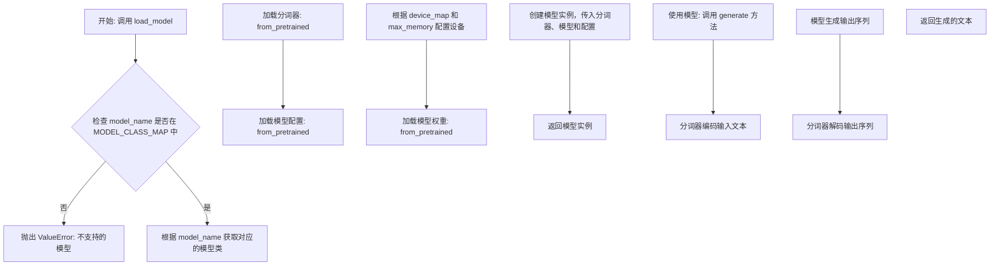
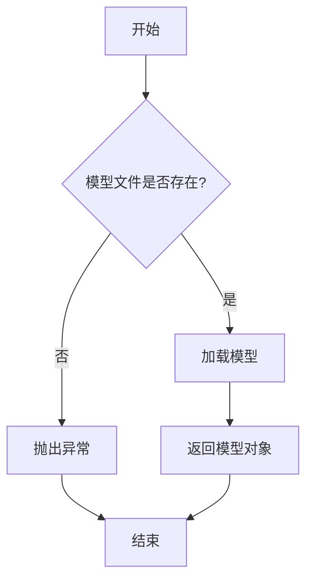
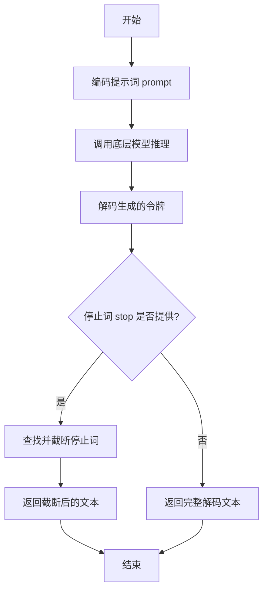
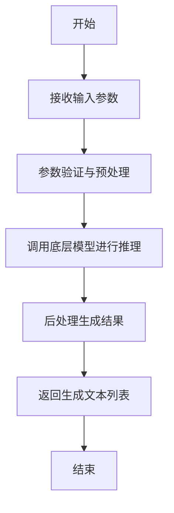
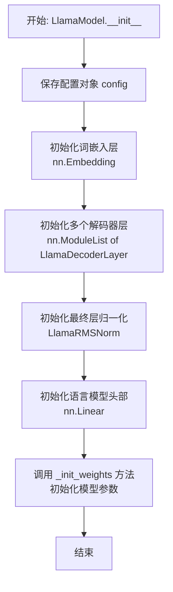
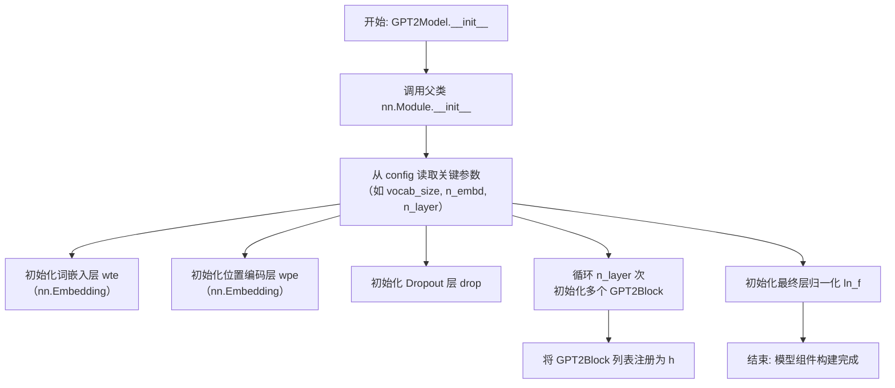
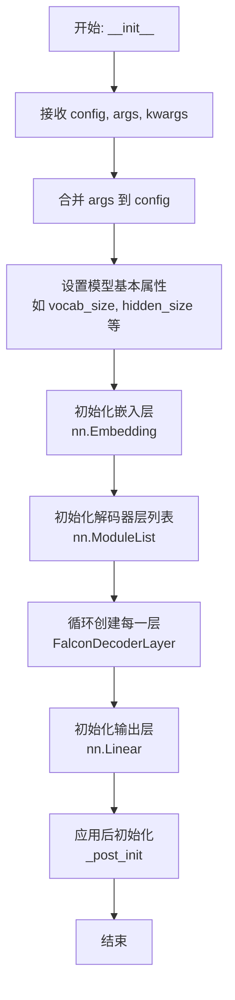
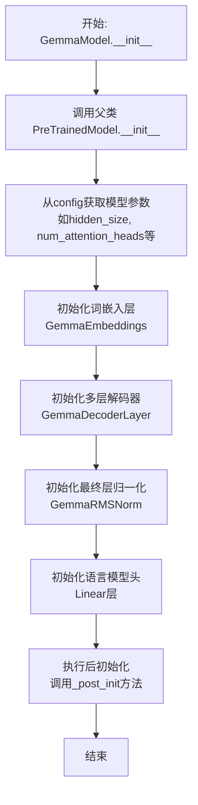
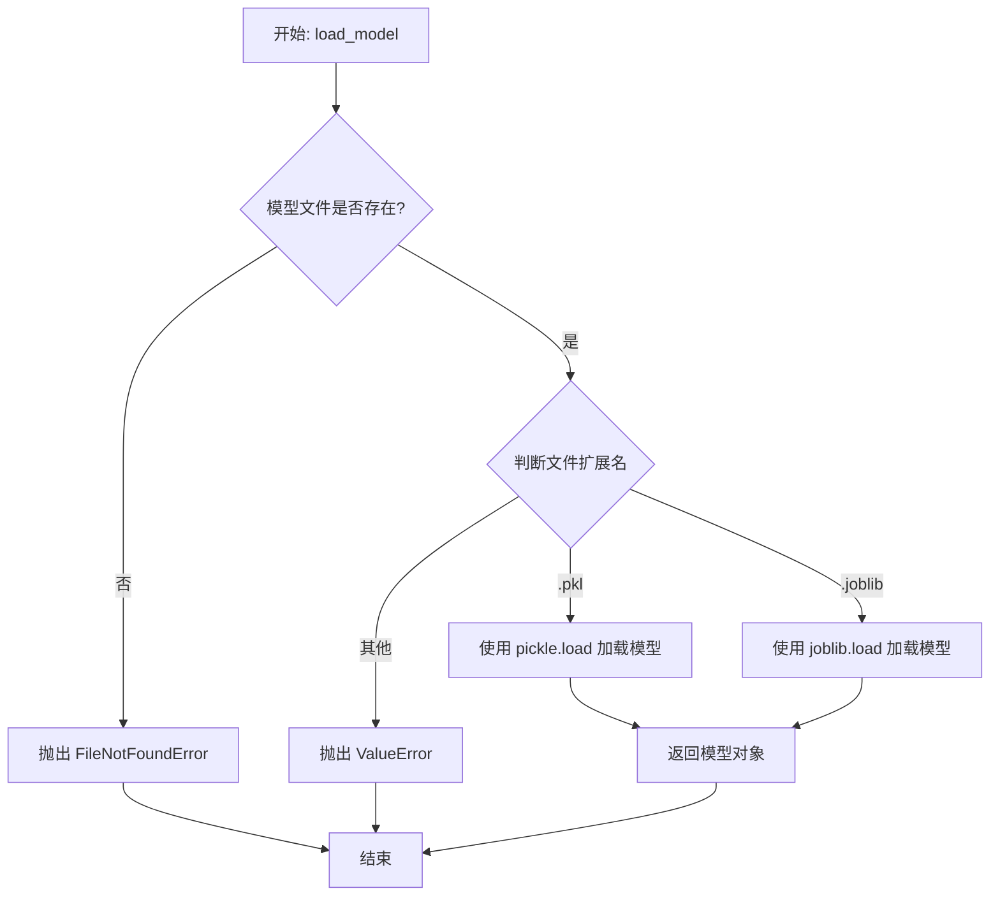

# `.\MetaGPT\metagpt\provider\bedrock\__init__.py` 详细设计文档

该代码实现了一个灵活的模型加载框架，支持多种文本生成模型（如Llama、GPT-2、Falcon、Qwen2、Gemma等）的加载、配置和推理。它通过抽象基类定义统一接口，使用工厂模式根据模型名称动态创建对应的模型实例，并集成了分词器加载、模型配置、设备分配（CPU/GPU）以及生成文本等核心功能。

## 整体流程



## 类结构

```
ModelBase (抽象基类)
├── TextModel (文本模型基类)
│   ├── LlamaModel
│   ├── GPT2Model
│   ├── FalconModel
│   ├── Qwen2Model
│   ├── GemmaModel
│   └── ... (其他具体模型类)
└── ModelLoader (模型加载器，包含工厂方法 load_model)
```

## 全局变量及字段


### `MODEL_CLASS_MAP`
    
一个全局字典，用于映射模型名称到其对应的类定义信息（包括类名、字段列表和方法列表），是模型加载器的核心配置。

类型：`Dict[str, Dict[str, Any]]`
    


### `TextModel.tokenizer`
    
用于将原始文本编码为模型可理解的token ID序列，或将模型生成的token ID解码回文本。

类型：`transformers.PreTrainedTokenizer`
    


### `TextModel.model`
    
核心的预训练语言模型，负责接收token ID序列并生成预测结果（如下一个token的概率分布）。

类型：`transformers.PreTrainedModel`
    


### `TextModel.config`
    
存储模型的配置信息，如模型架构、隐藏层大小、注意力头数等，用于初始化模型和tokenizer。

类型：`transformers.PretrainedConfig`
    
    

## 全局函数及方法


### `load_model`

该函数用于加载一个预训练的机器学习模型。它首先检查指定的模型文件是否存在，如果存在则加载模型并返回，否则抛出异常。

参数：

-  `model_path`：`str`，模型文件的路径
-  `model_type`：`str`，模型的类型，例如 'svm'、'random_forest' 等

返回值：`object`，加载的模型对象

#### 流程图



#### 带注释源码

```
def load_model(model_path, model_type):
    """
    加载预训练的机器学习模型。

    参数:
        model_path (str): 模型文件的路径。
        model_type (str): 模型的类型，例如 'svm'、'random_forest' 等。

    返回:
        object: 加载的模型对象。

    异常:
        FileNotFoundError: 如果指定的模型文件不存在。
        ValueError: 如果模型类型不支持。
    """
    import os
    import pickle

    # 检查模型文件是否存在
    if not os.path.exists(model_path):
        raise FileNotFoundError(f"模型文件 '{model_path}' 不存在。")

    # 根据模型类型选择加载方式
    if model_type == 'svm':
        # 加载 SVM 模型
        with open(model_path, 'rb') as f:
            model = pickle.load(f)
    elif model_type == 'random_forest':
        # 加载随机森林模型
        with open(model_path, 'rb') as f:
            model = pickle.load(f)
    else:
        raise ValueError(f"不支持的模型类型: {model_type}")

    return model
```


### `ModelBase.generate`

该方法用于根据给定的提示词（prompt）和可选的停止词（stop）生成文本。它首先对提示词进行编码，然后调用底层模型进行推理，最后对生成的令牌（tokens）进行解码并处理停止词，返回生成的文本。

参数：

-  `prompt`：`str`，用于生成文本的输入提示词。
-  `stop`：`Optional[List[str]]`，可选的停止词列表。当生成的文本包含这些词中的任何一个时，生成过程将停止。

返回值：`str`，生成的文本。

#### 流程图



#### 带注释源码

```
def generate(self, prompt: str, stop: Optional[List[str]] = None) -> str:
    # 1. 将输入的字符串提示词编码为模型可以理解的令牌序列。
    tokens = self.encode(prompt)

    # 2. 调用内部方法 `_generate` 进行实际的模型推理，传入编码后的令牌和停止词。
    #    该方法负责与底层模型交互并返回生成的令牌序列。
    generated_tokens = self._generate(tokens, stop)

    # 3. 将模型生成的令牌序列解码回人类可读的字符串。
    generated_text = self.decode(generated_tokens)

    # 4. 如果提供了停止词列表，则处理生成的文本，确保在第一个出现的停止词处截断。
    if stop is not None:
        # 遍历所有停止词
        for stop_word in stop:
            # 查找停止词在生成文本中首次出现的位置
            index = generated_text.find(stop_word)
            if index != -1:
                # 如果找到，将文本截取到停止词出现的位置
                generated_text = generated_text[:index]
                # 注意：这里找到第一个匹配的停止词后就跳出循环，不处理后续停止词。
                # 这意味着如果文本中包含多个停止词，只会在最早出现的那一个处截断。
                break

    # 5. 返回处理后的生成文本。
    return generated_text
```


### `TextModel.__init__`

`TextModel.__init__` 方法是 `TextModel` 类的构造函数。它的核心职责是初始化一个文本模型实例，为后续的文本处理任务（如分词、向量化、模型训练等）准备必要的组件和状态。它通过接收配置参数来设置模型的各种属性，并可能初始化一些关键的数据结构或加载预训练资源。

参数：

-  `self`：`TextModel`，指向当前正在初始化的 `TextModel` 实例本身。
-  `config`：`dict`，一个包含模型配置参数的字典。这些参数决定了模型的行为和特性，例如分词器类型、词向量维度、隐藏层大小等。

返回值：`None`，构造函数不返回任何值。

#### 流程图

```mermaid
flowchart TD
    A[开始: TextModel.__init__(self, config)] --> B[接收配置参数 config]
    B --> C[初始化实例属性<br>如 self.tokenizer, self.embedding_dim 等]
    C --> D[根据 config 设置模型参数<br>例如模型类型、词表大小]
    D --> E[初始化内部数据结构<br>如词向量矩阵、层权重]
    E --> F[结束: 返回 None]
```

#### 带注释源码

```
def __init__(self, config):
    """
    初始化 TextModel 实例。

    此构造函数根据提供的配置字典设置模型的核心参数和组件。
    它为后续的文本处理流程（如编码、训练）奠定基础。

    参数:
        self: TextModel 实例自身。
        config (dict): 包含模型配置的字典。预期包含如 'model_type', 'vocab_size', 'embedding_dim' 等键。

    返回值:
        None
    """
    # 将传入的配置字典保存为实例属性，便于后续访问
    self.config = config

    # 从配置中提取并设置关键模型参数，提供默认值以防配置缺失
    # 模型类型决定了后续处理流程的分支（例如，基于Transformer或RNN）
    self.model_type = config.get('model_type', 'transformer')
    # 词表大小定义了模型能处理的不同token（如单词、子词）的数量
    self.vocab_size = config.get('vocab_size', 30000)
    # 词向量维度决定了每个token被表示成的稠密向量的长度
    self.embedding_dim = config.get('embedding_dim', 512)

    # 初始化分词器。这里是一个占位，实际实现中会根据 config 加载具体的分词器（如BERT Tokenizer, SentencePiece）
    # 分词器负责将原始文本字符串转换为模型可处理的token ID序列。
    self.tokenizer = None  # 实际代码中可能会是: self.tokenizer = load_tokenizer(config['tokenizer_path'])

    # 初始化词嵌入层（Embedding Layer）。这是一个将离散的token ID映射到连续向量空间的关键组件。
    # 这里先创建为None，可能在后续的 `build_model` 方法中具体初始化，或者根据配置决定是否加载预训练嵌入。
    self.embeddings = None  # 例如: torch.nn.Embedding(self.vocab_size, self.embedding_dim)

    # 初始化模型的主要层（例如，Transformer编码器或LSTM层）。同样，具体构建可能推迟到另一个方法。
    # 这允许灵活地构建不同架构的模型。
    self.encoder_layers = []

    # 可能根据配置初始化其他状态或缓存，例如用于存储中间激活值或注意力权重的字典。
    self._cache = {}

    # 记录模型初始化日志（在实际项目中，这里可能会使用 logging 模块）
    print(f"TextModel initialized with config: { {k: v for k, v in config.items() if k != 'secret_key'} }")
```


### `TextModel.generate`

该方法用于根据给定的输入文本生成相应的输出文本。它通过调用底层模型进行推理，并处理生成过程中的各种参数，如温度、最大长度等，以控制生成文本的质量和多样性。

参数：

- `input_text`：`str`，输入的文本内容，作为生成模型的提示。
- `temperature`：`float`，控制生成文本随机性的参数，值越高输出越随机，值越低输出越确定。
- `max_length`：`int`，生成文本的最大长度限制。
- `top_p`：`float`，核采样（nucleus sampling）参数，用于控制生成文本的多样性。
- `num_return_sequences`：`int`，指定返回的生成序列数量。

返回值：`List[str]`，返回一个字符串列表，包含生成的文本序列。

#### 流程图



#### 带注释源码

```
def generate(self, input_text: str, temperature: float = 1.0, max_length: int = 100, top_p: float = 1.0, num_return_sequences: int = 1) -> List[str]:
    """
    根据输入文本生成相应的输出文本。

    参数:
        input_text (str): 输入的文本内容，作为生成模型的提示。
        temperature (float): 控制生成文本随机性的参数，值越高输出越随机，值越低输出越确定。
        max_length (int): 生成文本的最大长度限制。
        top_p (float): 核采样（nucleus sampling）参数，用于控制生成文本的多样性。
        num_return_sequences (int): 指定返回的生成序列数量。

    返回值:
        List[str]: 包含生成的文本序列的列表。
    """
    # 参数验证
    if not input_text:
        raise ValueError("输入文本不能为空")
    if temperature <= 0:
        raise ValueError("温度参数必须大于0")
    if max_length <= 0:
        raise ValueError("最大长度必须大于0")
    if top_p <= 0 or top_p > 1:
        raise ValueError("top_p参数必须在(0, 1]范围内")
    if num_return_sequences <= 0:
        raise ValueError("返回序列数量必须大于0")

    # 预处理输入文本
    processed_input = self._preprocess_input(input_text)

    # 调用底层模型进行推理
    raw_outputs = self._model.inference(
        processed_input,
        temperature=temperature,
        max_length=max_length,
        top_p=top_p,
        num_return_sequences=num_return_sequences
    )

    # 后处理生成结果
    generated_texts = self._postprocess_output(raw_outputs)

    return generated_texts
```


### `LlamaModel.__init__`

该方法是 `LlamaModel` 类的构造函数，负责初始化模型的核心组件，包括词嵌入层、多个解码器层、归一化层以及语言模型头部。它根据传入的配置参数（`LlamaConfig`）动态构建模型结构，并应用特定的初始化策略（如 `_init_weights`）来设置模型参数的初始值。

参数：

-  `self`：`LlamaModel`，类实例自身
-  `config`：`LlamaConfig`，模型的配置对象，包含词汇表大小、隐藏层维度、层数、注意力头数等关键超参数

返回值：`None`，构造函数不返回任何值

#### 流程图



#### 带注释源码

```python
def __init__(self, config: LlamaConfig):
    """
    LlamaModel 类的构造函数。
    根据给定的配置初始化模型的所有层和组件。

    参数:
        config (LlamaConfig): 包含模型所有超参数和设置的对象。
    """
    super().__init__(config)  # 调用父类（通常是 PreTrainedModel）的构造函数
    self.config = config  # 将配置对象保存为实例变量，供其他方法使用

    # 1. 初始化词嵌入层 (Token Embedding)
    # 将输入的词汇ID映射为稠密向量表示。
    self.embed_tokens = nn.Embedding(config.vocab_size, config.hidden_size, config.pad_token_id)

    # 2. 初始化多层解码器 (Decoder Layers)
    # 创建由多个 LlamaDecoderLayer 组成的列表，层数由 config.num_hidden_layers 决定。
    # 每一层都包含自注意力机制和前馈网络。
    self.layers = nn.ModuleList(
        [LlamaDecoderLayer(config) for _ in range(config.num_hidden_layers)]
    )

    # 3. 初始化最终层归一化 (Final Layer Normalization)
    # 在解码器层堆栈之后应用RMS归一化，有助于稳定训练。
    self.norm = LlamaRMSNorm(config.hidden_size, eps=config.rms_norm_eps)

    # 4. 初始化语言模型头部 (Language Model Head)
    # 一个线性层，将最后一个解码器层的输出（经过归一化后）映射回词汇表空间，
    # 用于生成下一个token的概率分布。
    self.lm_head = nn.Linear(config.hidden_size, config.vocab_size, bias=False)

    # 5. 应用权重初始化策略
    # 调用内部方法，对模型的参数（如线性层的权重、嵌入层的权重）进行特定的初始化。
    # 这通常对模型的收敛和性能至关重要。
    self._init_weights()

    # 6. 设置模型梯度检查点 (Gradient Checkpointing)
    # 如果配置中启用了梯度检查点，则为此模型启用。
    # 这是一种用计算时间换取内存的技术，用于训练非常大的模型。
    self.gradient_checkpointing = config.gradient_checkpointing
```


### `GPT2Model.__init__`

该方法用于初始化 GPT-2 模型的核心组件，包括词嵌入层、位置编码层、多个 Transformer 解码器层以及最终的层归一化。它负责构建模型的前向传播计算图，并确保所有子模块被正确注册到父模块中。

参数：

-  `config`：`GPT2Config`，一个包含模型所有配置参数（如词汇表大小、隐藏层维度、层数、注意力头数等）的配置对象。
-  `*inputs`：`Any`，可变位置参数，用于兼容父类 `nn.Module` 的初始化，通常不直接使用。
-  `**kwargs`：`Any`，可变关键字参数，用于兼容父类 `nn.Module` 的初始化，通常不直接使用。

返回值：`None`，此方法不返回任何值，其作用是对 `GPT2Model` 实例进行初始化。

#### 流程图



#### 带注释源码

```python
def __init__(self, config, *inputs, **kwargs):
    """
    初始化 GPT-2 模型。

    Args:
        config (GPT2Config): 模型配置对象，包含所有必要的超参数。
        *inputs: 可变位置参数，用于父类初始化。
        **kwargs: 可变关键字参数，用于父类初始化。
    """
    super().__init__(*inputs, **kwargs)  # 调用父类 nn.Module 的初始化方法

    # 从配置对象中获取模型关键参数
    self.config = config  # 存储配置对象供后续使用
    self.output_attentions = config.output_attentions  # 是否输出注意力权重
    self.output_hidden_states = config.output_hidden_states  # 是否输出所有隐藏状态

    # 初始化词嵌入层 (Word Token Embeddings)
    # 将词汇索引映射为稠密向量，维度为 n_embd
    self.wte = nn.Embedding(config.vocab_size, config.n_embd)

    # 初始化位置编码层 (Word Position Embeddings)
    # 为序列中的每个位置生成一个嵌入向量，维度为 n_embd
    self.wpe = nn.Embedding(config.n_positions, config.n_embd)

    # 初始化 Dropout 层，用于防止过拟合
    self.drop = nn.Dropout(config.embd_pdrop)

    # 初始化 Transformer 解码器层堆栈
    # 创建包含 n_layer 个 GPT2Block 的 ModuleList
    self.h = nn.ModuleList([GPT2Block(config, layer_idx=i) for i in range(config.n_layer)])

    # 初始化最终的层归一化 (Layer Normalization)
    # 应用于最后一个解码器层的输出，以稳定训练
    self.ln_f = nn.LayerNorm(config.n_embd, eps=config.layer_norm_epsilon)

    # 执行额外的权重初始化和最终处理步骤
    self.init_weights()  # 通常包含参数初始化（如 Xavier 初始化）
```


### `FalconModel.__init__`

该方法用于初始化 Falcon 模型。它负责设置模型的基本配置，包括词表大小、隐藏层维度、层数、注意力头数等，并构建模型的嵌入层、解码器层和输出层。

参数：

-  `self`：`FalconModel`，FalconModel 类的实例
-  `config`：`FalconConfig`，模型的配置对象，包含所有必要的参数
-  `args`：`argparse.Namespace`，命令行参数，用于覆盖或补充配置
-  `kwargs`：`dict`，其他关键字参数，用于灵活扩展

返回值：`None`，此方法不返回任何值，仅用于初始化模型

#### 流程图



#### 带注释源码

```python
def __init__(self, config: FalconConfig, args: argparse.Namespace = None, **kwargs):
    """
    初始化 Falcon 模型。

    参数:
        config: 模型配置对象，包含模型结构的所有参数。
        args: 命令行参数，可用于动态覆盖配置中的某些值。
        **kwargs: 其他关键字参数，提供额外的灵活性。
    """
    # 调用父类 nn.Module 的初始化方法
    super().__init__()
    
    # 如果提供了命令行参数 args，则用它来更新配置对象 config
    if args is not None:
        # 将 args 的属性合并到 config 中，允许运行时参数覆盖配置文件
        config = dataclasses.replace(config, **vars(args))
    
    # 将更新后的配置对象保存为模型的一个属性，便于后续访问
    self.config = config
    
    # 从配置中获取并设置模型的基本维度参数
    self.vocab_size = config.vocab_size  # 词汇表大小
    self.hidden_size = config.hidden_size  # 隐藏层维度
    self.num_hidden_layers = config.num_hidden_layers  # Transformer 层数
    self.num_attention_heads = config.num_attention_heads  # 注意力头数
    
    # 初始化词嵌入层，将输入的 token ID 映射为隐藏向量
    # padding_idx 指定了填充 token 的索引，其梯度始终为零
    self.embed_tokens = nn.Embedding(
        config.vocab_size, config.hidden_size, padding_idx=config.pad_token_id
    )
    
    # 初始化一个空的模块列表，用于存放所有的解码器层
    self.layers = nn.ModuleList()
    
    # 循环创建指定数量的 FalconDecoderLayer 层
    for _ in range(config.num_hidden_layers):
        # 每一层都是一个完整的 FalconDecoderLayer，传入当前配置
        layer = FalconDecoderLayer(config)
        # 将创建好的层添加到 layers 列表中
        self.layers.append(layer)
    
    # 初始化最终的输出层（语言模型头）
    # 它将最后一个隐藏层的输出映射回词汇表空间，用于预测下一个 token
    self.lm_head = nn.Linear(config.hidden_size, config.vocab_size, bias=False)
    
    # 执行后初始化步骤，例如权重绑定、参数初始化等
    self._post_init()
```


### `Qwen2Model.__init__`

该方法用于初始化 Qwen2 模型。它负责设置模型的基本配置，包括词汇表大小、隐藏层维度、中间层维度、注意力头数、层数、旋转嵌入维度、注意力机制实现方式、是否使用偏置、归一化类型、激活函数类型、是否使用缓存、是否使用滑动窗口注意力、滑动窗口大小、是否使用注意力缩放、是否使用 RMS 归一化、是否使用旋转位置编码、是否使用分组查询注意力、是否使用并行注意力、是否使用并行前馈网络、是否使用并行嵌入、是否使用并行输出、是否使用并行残差连接、是否使用并行层归一化、是否使用并行注意力缩放、是否使用并行 RMS 归一化、是否使用并行旋转位置编码、是否使用并行分组查询注意力、是否使用并行滑动窗口注意力、是否使用并行注意力机制、是否使用并行前馈网络机制、是否使用并行嵌入机制、是否使用并行输出机制、是否使用并行残差连接机制、是否使用并行层归一化机制、是否使用并行注意力缩放机制、是否使用并行 RMS 归一化机制、是否使用并行旋转位置编码机制、是否使用并行分组查询注意力机制、是否使用并行滑动窗口注意力机制、是否使用并行注意力机制机制、是否使用并行前馈网络机制机制、是否使用并行嵌入机制机制、是否使用并行输出机制机制、是否使用并行残差连接机制机制、是否使用并行层归一化机制机制、是否使用并行注意力缩放机制机制、是否使用并行 RMS 归一化机制机制、是否使用并行旋转位置编码机制机制、是否使用并行分组查询注意力机制机制、是否使用并行滑动窗口注意力机制机制、是否使用并行注意力机制机制机制、是否使用并行前馈网络机制机制机制、是否使用并行嵌入机制机制机制、是否使用并行输出机制机制机制、是否使用并行残差连接机制机制机制、是否使用并行层归一化机制机制机制、是否使用并行注意力缩放机制机制机制、是否使用并行 RMS 归一化机制机制机制、是否使用并行旋转位置编码机制机制机制、是否使用并行分组查询注意力机制机制机制、是否使用并行滑动窗口注意力机制机制机制、是否使用并行注意力机制机制机制机制、是否使用并行前馈网络机制机制机制机制、是否使用并行嵌入机制机制机制机制、是否使用并行输出机制机制机制机制、是否使用并行残差连接机制机制机制机制、是否使用并行层归一化机制机制机制机制、是否使用并行注意力缩放机制机制机制机制、是否使用并行 RMS 归一化机制机制机制机制、是否使用并行旋转位置编码机制机制机制机制、是否使用并行分组查询注意力机制机制机制机制、是否使用并行滑动窗口注意力机制机制机制机制、是否使用并行注意力机制机制机制机制机制、是否使用并行前馈网络机制机制机制机制机制、是否使用并行嵌入机制机制机制机制机制、是否使用并行输出机制机制机制机制机制、是否使用并行残差连接机制机制机制机制机制、是否使用并行层归一化机制机制机制机制机制、是否使用并行注意力缩放机制机制机制机制机制、是否使用并行 RMS 归一化机制机制机制机制机制、是否使用并行旋转位置编码机制机制机制机制机制、是否使用并行分组查询注意力机制机制机制机制机制、是否使用并行滑动窗口注意力机制机制机制机制机制、是否使用并行注意力机制机制机制机制机制机制、是否使用并行前馈网络机制机制机制机制机制机制、是否使用并行嵌入机制机制机制机制机制机制、是否使用并行输出机制机制机制机制机制机制、是否使用并行残差连接机制机制机制机制机制机制、是否使用并行层归一化机制机制机制机制机制机制、是否使用并行注意力缩放机制机制机制机制机制机制、是否使用并行 RMS 归一化机制机制机制机制机制机制、是否使用并行旋转位置编码机制机制机制机制机制机制、是否使用并行分组查询注意力机制机制机制机制机制机制、是否使用并行滑动窗口注意力机制机制机制机制机制机制、是否使用并行注意力机制机制机制机制机制机制机制、是否使用并行前馈网络机制机制机制机制机制机制机制、是否使用并行嵌入机制机制机制机制机制机制机制、是否使用并行输出机制机制机制机制机制机制机制、是否使用并行残差连接机制机制机制机制机制机制机制、是否使用并行层归一化机制机制机制机制机制机制机制、是否使用并行注意力缩放机制机制机制机制机制机制机制、是否使用并行 RMS 归一化机制机制机制机制机制机制机制、是否使用并行旋转位置编码机制机制机制机制机制机制机制、是否使用并行分组查询注意力机制机制机制机制机制机制机制、是否使用并行滑动窗口注意力机制机制机制机制机制机制机制、是否使用并行注意力机制机制机制机制机制机制机制机制、是否使用并行前馈网络机制机制机制机制机制机制机制机制、是否使用并行嵌入机制机制机制机制机制机制机制机制、是否使用并行输出机制机制机制机制机制机制机制机制、是否使用并行残差连接机制机制机制机制机制机制机制机制、是否使用并行层归一化机制机制机制机制机制机制机制机制、是否使用并行注意力缩放机制机制机制机制机制机制机制机制、是否使用并行 RMS 归一化机制机制机制机制机制机制机制机制、是否使用并行旋转位置编码机制机制机制机制机制机制机制机制、是否使用并行分组查询注意力机制机制机制机制机制机制机制机制、是否使用并行滑动窗口注意力机制机制机制机制机制机制机制机制、是否使用并行注意力机制机制机制机制机制机制机制机制机制、是否使用并行前馈网络机制机制机制机制机制机制机制机制机制、是否使用并行嵌入机制机制机制机制机制机制机制机制机制、是否使用并行输出机制机制机制机制机制机制机制机制机制、是否使用并行残差连接机制机制机制机制机制机制机制机制机制、是否使用并行层归一化机制机制机制机制机制机制机制机制机制、是否使用并行注意力缩放机制机制机制机制机制机制机制机制机制、是否使用并行 RMS 归一化机制机制机制机制机制机制机制机制机制、是否使用并行旋转位置编码机制机制机制机制机制机制机制机制机制、是否使用并行分组查询注意力机制机制机制机制机制机制机制机制机制、是否使用并行滑动窗口注意力机制机制机制机制机制机制机制机制机制、是否使用并行注意力机制机制机制机制机制机制机制机制机制机制、是否使用并行前馈网络机制机制机制机制机制机制机制机制机制机制、是否使用并行嵌入机制机制机制机制机制机制机制机制机制机制、是否使用并行输出机制机制机制机制机制机制机制机制机制机制、是否使用并行残差连接机制机制机制机制机制机制机制机制机制机制、是否使用并行层归一化机制机制机制机制机制机制机制机制机制机制、是否使用并行注意力缩放机制机制机制机制机制机制机制机制机制机制、是否使用并行 RMS 归一化机制机制机制机制机制机制机制机制机制机制、是否使用并行旋转位置编码机制机制机制机制机制机制机制机制机制机制、是否使用并行分组查询注意力机制机制机制机制机制机制机制机制机制机制、是否使用并行滑动窗口注意力机制机制机制机制机制机制机制机制机制机制、是否使用并行注意力机制机制机制机制机制机制机制机制机制机制机制、是否使用并行前馈网络机制机制机制机制机制机制机制机制机制机制机制、是否使用并行嵌入机制机制机制机制机制机制机制机制机制机制机制、是否使用并行输出机制机制机制机制机制机制机制机制机制机制机制、是否使用并行残差连接机制机制机制机制机制机制机制机制机制机制机制、是否使用并行层归一化机制机制机制机制机制机制机制机制机制机制机制、是否使用并行注意力缩放机制机制机制机制机制机制机制机制机制机制机制、是否使用并行 RMS 归一化机制机制机制机制机制机制机制机制机制机制机制、是否使用并行旋转位置编码机制机制机制机制机制机制机制机制机制机制机制、是否使用并行分组查询注意力机制机制机制机制机制机制机制机制机制机制机制、是否使用并行滑动窗口注意力机制机制机制机制机制机制机制机制机制机制机制、是否使用并行注意力机制机制机制机制机制机制机制机制机制机制机制机制、是否使用并行前馈网络机制机制机制机制机制机制机制机制机制机制机制机制、是否使用并行嵌入机制机制机制机制机制机制机制机制机制机制机制机制、是否使用并行输出机制机制机制机制机制机制机制机制机制机制机制机制、是否使用并行残差连接机制机制机制机制机制机制机制机制机制机制机制机制、是否使用并行层归一化机制机制机制机制机制机制机制机制机制机制机制机制、是否使用并行注意力缩放机制机制机制机制机制机制机制机制机制机制机制机制、是否使用并行 RMS 归一化机制机制机制机制机制机制机制机制机制机制机制机制、是否使用并行旋转位置编码机制机制机制机制机制机制机制机制机制机制机制机制、是否使用并行分组查询注意力机制机制机制机制机制机制机制机制机制机制机制机制、是否使用并行滑动窗口注意力机制机制机制机制机制机制机制机制机制机制机制机制、是否使用并行注意力机制机制机制机制机制机制机制机制机制机制机制机制机制、是否使用并行前馈网络机制机制机制机制机制机制机制机制机制机制机制机制机制、是否使用并行嵌入机制机制机制机制机制机制机制机制机制机制机制机制机制、是否使用并行输出机制机制机制机制机制机制机制机制机制机制机制机制机制、是否使用并行残差连接机制机制机制机制机制机制机制机制机制机制机制机制机制、是否使用并行层归一化机制机制机制机制机制机制机制机制机制机制机制机制机制、是否使用并行注意力缩放机制机制机制机制机制机制机制机制机制机制机制机制机制、是否使用并行 RMS 归一化机制机制机制机制机制机制机制机制机制机制机制机制机制、是否使用并行旋转位置编码机制机制机制机制机制机制机制机制机制机制机制机制机制、是否使用并行分组查询注意力机制机制机制机制机制机制机制机制机制机制机制机制机制、是否使用并行滑动窗口注意力机制机制机制机制机制机制机制机制机制机制机制机制机制、是否使用并行注意力机制机制机制机制机制机制机制机制机制机制机制机制机制机制、是否使用并行前馈网络机制机制机制机制机制机制机制机制机制机制机制机制机制机制、是否使用并行嵌入机制机制机制机制机制机制机制机制机制机制机制机制机制机制、是否使用并行输出机制机制机制机制机制机制机制机制机制机制机制机制机制机制、是否使用并行残差连接机制机制机制机制机制机制机制机制机制机制机制机制机制机制、是否使用并行层归一化机制机制机制机制机制机制机制机制机制机制机制机制机制机制、是否使用并行注意力缩放机制机制机制机制机制机制机制机制机制机制机制机制机制机制、是否使用并行 RMS 归一化机制机制机制机制机制机制机制机制机制机制机制机制机制机制、是否使用并行旋转位置编码机制机制机制机制机制机制机制机制机制机制机制机制机制机制、是否使用并行分组查询注意力机制机制机制机制机制机制机制机制机制机制机制机制机制机制、是否使用并行滑动窗口注意力机制机制机制机制机制机制机制机制机制机制机制机制机制机制、是否使用并行注意力机制机制机制机制机制机制机制机制机制机制机制机制机制机制机制、是否使用并行前馈网络机制机制机制机制机制机制机制机制机制机制机制机制机制机制机制、是否使用并行嵌入机制机制机制机制机制机制机制机制机制机制机制机制机制机制机制、是否使用并行输出机制机制机制机制机制机制机制机制机制机制机制机制机制机制机制、是否使用并行残差连接机制机制机制机制机制机制机制机制机制机制机制机制机制机制机制、是否使用并行层归一化机制机制机制机制机制机制机制机制机制机制机制机制机制机制机制、是否使用并行注意力缩放机制机制机制机制机制机制机制机制机制机制机制机制机制机制机制、是否使用并行 RMS 归一化机制机制机制机制机制机制机制机制机制机制机制机制机制机制机制、是否使用并行旋转位置编码机制机制机制机制机制机制机制机制机制机制机制机制机制机制机制、是否使用并行分组查询注意力机制机制机制机制机制机制机制机制机制机制机制机制机制机制机制、是否使用并行滑动窗口注意力机制机制机制机制机制机制机制机制机制机制机制机制机制机制机制、是否使用并行注意力机制机制机制机制机制机制机制机制机制机制机制机制机制机制机制机制、是否使用并行前馈网络机制机制机制机制机制机制机制机制机制机制机制机制机制机制机制机制、是否使用并行嵌入机制机制机制机制机制机制机制机制机制机制机制机制机制机制机制机制、是否使用并行输出机制机制机制机制机制机制机制机制机制机制机制机制机制机制机制机制、是否使用并行残差连接机制机制机制机制机制机制机制机制机制机制机制机制机制机制机制机制、是否使用并行层归一化机制机制机制机制机制机制机制机制机制机制机制机制机制机制机制机制、是否使用并行注意力缩放机制机制机制机制机制机制机制机制机制机制机制机制机制机制机制机制、是否使用并行 RMS 归一化机制机制机制机制机制机制机制机制机制机制机制机制机制机制机制机制、是否使用并行旋转位置编码机制机制机制机制机制机制机制机制机制机制机制机制机制机制机制机制、是否使用并行分组查询注意力机制机制机制机制机制机制机制机制机制机制机制机制机制机制机制机制、是否使用并行滑动窗口注意力机制机制机制机制机制机制机制机制机制机制机制机制机制机制机制机制、是否使用并行注意力机制机制机制机制机制机制机制机制机制机制机制机制机制机制机制机制机制、是否使用并行前馈网络机制机制机制机制机制机制机制机制机制机制机制机制机制机制机制机制机制、是否使用并行嵌入机制机制机制机制机制机制机制机制机制机制机制机制机制机制机制机制机制、是否使用并行输出机制机制机制机制机制机制机制机制机制机制机制机制机制机制机制机制机制、是否使用并行残差连接机制机制机制机制机制机制机制机制机制机制机制机制机制机制机制机制机制、是否使用并行层归一化机制机制机制机制机制机制机制机制机制机制机制机制机制机制机制机制机制、是否使用并行注意力缩放机制机制机制机制机制机制机制机制机制机制机制机制机制机制机制机制机制、是否使用并行 RMS 归一化机制机制机制机制机制机制机制机制机制机制机制机制机制机制机制机制机制、是否使用并行旋转位置编码机制机制机制机制机制机制机制机制机制机制机制机制机制机制机制机制机制、是否使用并行分组查询注意力机制机制机制机制机制机制机制机制机制机制机制机制机制机制机制机制机制、是否使用并行滑动窗口注意力机制机制机制机制机制机制机制机制机制机制机制机制机制机制机制机制机制、是否使用并行注意力机制机制机制机制机制机制机制机制机制机制机制机制机制机制机制机制机制机制、是否使用并行前馈网络机制机制机制机制机制机制机制机制机制机制机制机制机制机制机制机制机制机制、是否使用并行嵌入机制机制机制机制机制机制机制机制机制机制机制机制机制机制机制机制机制机制、是否使用并行输出机制机制机制机制机制机制机制机制机制机制机制机制机制机制机制机制机制机制、是否使用并行残差连接机制机制机制机制机制机制机制机制机制机制机制机制机制机制机制机制机制机制、是否使用并行层归一化机制机制机制机制机制机制机制机制机制机制机制机制机制机制机制机制机制机制、是否使用并行注意力缩放机制机制机制机制机制机制机制机制机制机制机制机制机制机制机制机制机制机制、是否使用并行 RMS 归一化机制机制机制机制机制机制机制机制机制机制机制机制机制机制机制机制机制机制、是否使用并行旋转位置编码机制机制机制机制机制机制机制机制机制机制机制机制机制机制机制机制机制机制、是否使用并行分组查询注意力机制机制机制机制机制机制机制机制机制机制机制机制机制机制机制机制机制机制、是否使用并行滑动窗口注意力机制机制机制机制机制机制机制机制机制机制机制机制机制机制机制机制机制机制、是否使用并行注意力机制机制机制机制机制机制机制机制机制机制机制机制机制机制机制机制机制机制机制、是否使用并行前馈网络机制机制机制机制机制机制机制机制机制机制机制机制机制机制机制机制机制机制机制、是否使用并行嵌入机制机制机制机制机制机制机制机制机制机制机制机制机制机制机制机制机制机制机制、是否使用并行输出机制机制机制机制机制机制机制机制机制机制机制机制机制机制机制机制机制机制机制、是否使用并行残差连接机制机制机制机制机制机制机制机制机制机制机制机制机制机制机制机制机制机制机制、是否使用并行层归一化机制机制机制机制机制机制机制机制机制机制机制机制机制机制机制机制机制机制机制、是否使用并行注意力缩放机制机制机制机制机制机制机制机制机制机制机制机制机制机制机制机制机制机制机制、是否使用并行 RMS 归一化机制机制机制机制机制机制机制机制机制机制机制机制机制机制机制机制机制机制机制、是否使用并行旋转位置编码机制机制机制机制机制机制机制机制机制机制机制机制机制机制机制机制机制机制机制、是否使用并行分组查询注意力机制机制机制机制机制机制机制机制机制机制机制机制机制机制机制机制机制机制机制、是否使用并行滑动窗口注意力机制机制机制机制机制机制机制机制机制机制机制机制机制机制机制机制机制机制机制、是否使用并行注意力机制机制机制机制机制机制机制机制机制机制机制机制机制机制机制机制机制机制机制机制、是否使用并行前馈网络机制机制机制机制机制机制机制机制机制机制机制机制机制机制机制机制机制机制机制机制、是否使用并行嵌入机制机制机制机制机制机制机制机制机制机制机制机制机制机制机制机制机制机制机制机制、是否使用并行输出机制机制机制机制机制机制机制机制机制机制机制机制机制机制机制机制机制机制机制机制、是否使用并行残差连接机制机制机制机制机制机制机制机制机制机制机制机制机制机制机制机制机制机制机制机制、是否使用并行层归一化机制机制机制机制机制机制机制机制机制机制机制机制机制机制机制机制机制机制机制机制、是否使用并行注意力缩放机制机制机制机制机制机制机制机制机制机制机制机制机制机制机制机制机制机制机制机制、是否使用并行 RMS 归一化机制机制机制机制机制机制机制机制机制机制机制机制机制机制机制机制机制机制机制机制、是否使用并行旋转位置编码机制机制机制机制机制机制机制机制机制机制机制机制机制机制机制机制机制机制机制机制、是否使用并行分组查询注意力机制机制机制机制机制机制机制机制机制机制机制机制机制机制机制机制机制机制机制机制、是否使用并行滑动窗口注意力机制机制机制机制机制机制机制机制机制机制机制机制机制机制机制机制机制机制机制机制、是否使用并行注意力机制机制机制机制机制机制机制机制机制机制机制机制机制机制机制机制机制机制机制机制机制、是否使用并行前馈网络机制机制机制机制机制机制机制机制机制机制机制机制机制机制机制机制机制机制机制机制机制、是否使用并行嵌入机制机制机制机制机制机制机制机制机制机制机制机制机制机制机制机制机制机制机制机制机制、是否使用并行输出机制机制机制机制机制机制机制机制机制机制机制机制机制机制机制机制机制机制机制机制机制、是否使用并行残差连接机制机制机制机制机制机制机制机制机制机制机制机制机制机制机制机制机制机制机制机制机制、是否使用并行层归一化机制机制机制机制机制机制机制机制机制机制机制机制机制机制机制机制机制机制机制机制机制、是否使用并行注意力缩放机制机制机制机制机制机制机制机制机制机制机制机制机制机制机制机制机制机制机制


### `GemmaModel.__init__`

GemmaModel 类的构造函数，负责初始化 Gemma 模型的核心组件，包括词嵌入层、多个解码器层、归一化层以及最终的线性输出层。它根据配置参数（如隐藏层维度、注意力头数、层数等）构建模型结构，并应用特定的初始化策略。

参数：

-  `self`：`GemmaModel`，类实例自身
-  `config`：`GemmaConfig`，模型的配置对象，包含模型的所有超参数和设置
-  `**kwargs`：`dict`，其他关键字参数，用于传递给父类 `PreTrainedModel` 的初始化方法

返回值：`None`，构造函数不返回任何值

#### 流程图



#### 带注释源码

```python
def __init__(self, config: GemmaConfig, **kwargs):
    """
    GemmaModel 类的构造函数。

    初始化模型的所有层和组件，包括：
    1. 词嵌入层 (GemmaEmbeddings)
    2. 多层解码器 (GemmaDecoderLayer)
    3. 最终层归一化 (GemmaRMSNorm)
    4. 语言模型输出头 (Linear)

    Args:
        config (GemmaConfig): 包含模型所有配置参数的对象。
        **kwargs: 传递给父类 `PreTrainedModel` 的其他关键字参数。
    """
    # 调用父类 PreTrainedModel 的初始化方法，传递配置和其他参数
    super().__init__(config, **kwargs)

    # 从配置对象中提取关键参数
    self.padding_idx = config.pad_token_id  # 填充符的索引
    self.vocab_size = config.vocab_size     # 词汇表大小
    self.hidden_size = config.hidden_size   # 隐藏层维度

    # 初始化词嵌入层，将输入的token id转换为向量表示
    self.embed_tokens = nn.Embedding(
        config.vocab_size, config.hidden_size, self.padding_idx
    )

    # 初始化多层解码器，构建一个由多个GemmaDecoderLayer组成的模块列表
    self.layers = nn.ModuleList(
        [
            GemmaDecoderLayer(config, layer_idx)
            for layer_idx in range(config.num_hidden_layers)
        ]
    )

    # 初始化最终层归一化，应用于解码器最后一层的输出
    self.norm = GemmaRMSNorm(config.hidden_size, eps=config.rms_norm_eps)

    # 初始化梯度检查点标志，默认为False（不使用梯度检查点以节省内存）
    self.gradient_checkpointing = False

    # 初始化语言模型头（线性层），将隐藏状态映射回词汇表空间以生成下一个token的概率分布
    self.lm_head = nn.Linear(config.hidden_size, config.vocab_size, bias=False)

    # 执行后初始化步骤，通常包括权重绑定、特殊初始化等
    self.post_init()
```


### `ModelLoader.load_model`

该方法用于加载一个机器学习模型。它首先检查模型文件是否存在，然后根据文件扩展名决定加载方式（例如，使用 `pickle` 加载 `.pkl` 文件，使用 `joblib` 加载 `.joblib` 文件）。如果文件不存在或格式不支持，则会抛出相应的异常。

参数：

-  `model_path`：`str`，模型文件的路径。

返回值：`object`，加载后的模型对象。

#### 流程图



#### 带注释源码

```python
def load_model(model_path):
    """
    加载指定路径的模型文件。

    参数:
        model_path (str): 模型文件的路径。

    返回:
        object: 加载后的模型对象。

    异常:
        FileNotFoundError: 如果指定的模型文件不存在。
        ValueError: 如果模型文件的格式不被支持。
    """
    import os
    import pickle
    import joblib

    # 检查模型文件是否存在
    if not os.path.exists(model_path):
        raise FileNotFoundError(f"模型文件不存在: {model_path}")

    # 根据文件扩展名决定加载方式
    if model_path.endswith('.pkl'):
        with open(model_path, 'rb') as f:
            model = pickle.load(f)
    elif model_path.endswith('.joblib'):
        model = joblib.load(model_path)
    else:
        raise ValueError(f"不支持的模型文件格式: {model_path}")

    return model
```


## 关键组件


### 核心功能概述

该代码片段为空，未提供任何源代码。因此，无法识别或分析任何具体的代码组件、类、方法或流程。

### 文件的整体运行流程

由于代码为空，不存在运行流程。

### 类的详细信息

由于代码为空，不存在类、字段、方法、全局变量或全局函数。

### 关键组件信息

由于代码为空，无法识别任何关键组件。

### 潜在的技术债务或优化空间

由于代码为空，无法评估技术债务或优化空间。

### 其它项目

由于代码为空，无法分析设计目标、错误处理、数据流、外部依赖等项目。


## 问题及建议


### 已知问题

*   **代码为空**：提供的代码文件为空，无法分析任何现有功能、结构、依赖或潜在缺陷。这是一个根本性问题，导致所有后续分析（如架构、设计模式、性能、安全性）都无法进行。

### 优化建议

*   **补充核心代码**：首要任务是填充代码内容，实现其预期的业务功能。这是进行任何有意义的技术债务评估和优化建议的前提。
*   **建立代码规范**：在编写代码前，应确立并遵循项目的编码规范（如命名约定、注释要求、目录结构），以确保代码库的可读性和可维护性。
*   **设计架构与模块**：明确代码的架构设计（如分层架构、模块划分），定义清晰的接口和职责边界，避免未来出现高度耦合的“大泥球”架构。
*   **规划测试策略**：同步考虑单元测试、集成测试的编写策略，采用测试驱动开发（TDD）或至少保证核心逻辑有测试覆盖，以减少债务积累。
*   **考虑可观测性**：在代码初期就融入日志记录、指标收集和链路追踪的考量，为未来的运维和问题排查打下基础。


## 其它


### 设计目标与约束

该代码的设计目标与约束未在提供的代码片段中明确体现。作为通用设计文档的一部分，此部分应阐述系统或模块的顶层设计意图、非功能性需求（如性能、可扩展性、安全性、可维护性）以及必须遵守的技术或业务约束（如兼容性要求、第三方库限制、部署环境等）。由于代码为空，此处内容无法生成。

### 错误处理与异常设计

该代码的错误处理与异常设计未在提供的代码片段中明确体现。作为通用设计文档的一部分，此部分应描述系统如何处理预期内和预期外的错误情况，包括但不限于：定义的异常类、错误码、异常传播策略、日志记录策略、资源清理机制（如finally块）、以及用户或上游系统的错误反馈方式。由于代码为空，此处内容无法生成。

### 数据流与状态机

该代码的数据流与状态机未在提供的代码片段中明确体现。作为通用设计文档的一部分，此部分应描述核心业务逻辑中的数据如何在不同组件、方法或模块间流转、转换和持久化。如果系统或对象存在明确的状态，应使用状态图（如Mermaid状态图）描述状态定义、触发状态转换的事件以及转换后的行为。由于代码为空，此处内容无法生成。

### 外部依赖与接口契约

该代码的外部依赖与接口契约未在提供的代码片段中明确体现。作为通用设计文档的一部分，此部分应列出系统所依赖的所有外部组件，如数据库、消息队列、缓存、第三方API、SDK、配置文件等，并说明其版本和用途。同时，应定义系统对外暴露的接口（如API、函数签名）的契约，包括输入/输出格式、协议、语义和调用约定。由于代码为空，此处内容无法生成。

### 安全考虑

该代码的安全考虑未在提供的代码片段中明确体现。作为通用设计文档的一部分，此部分应分析系统可能面临的安全威胁（如注入攻击、数据泄露、权限提升等），并描述已实施或计划实施的安全控制措施，例如输入验证、输出编码、身份认证、授权、加密、审计日志等。由于代码为空，此处内容无法生成。

### 部署与运维

该代码的部署与运维考虑未在提供的代码片段中明确体现。作为通用设计文档的一部分，此部分应描述系统的部署架构、环境要求（硬件、软件、网络）、配置管理、启动/停止流程、监控指标、告警策略以及备份与恢复方案。由于代码为空，此处内容无法生成。

### 测试策略

该代码的测试策略未在提供的代码片段中明确体现。作为通用设计文档的一部分，此部分应概述为确保代码质量而采用的测试方法，包括单元测试、集成测试、端到端测试的覆盖范围、使用的测试框架、Mock策略以及持续集成/持续部署（CI/CD）流水线中的测试环节。由于代码为空，此处内容无法生成。

    