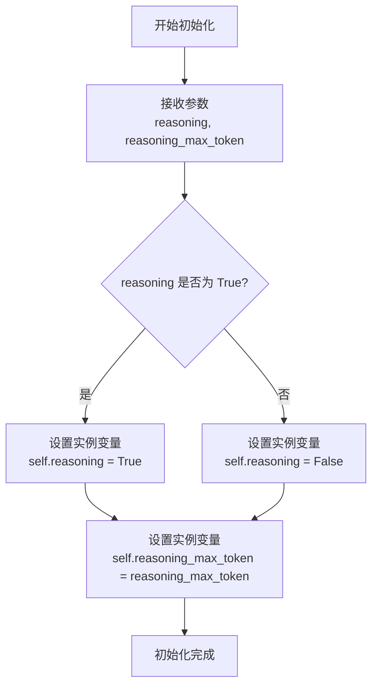
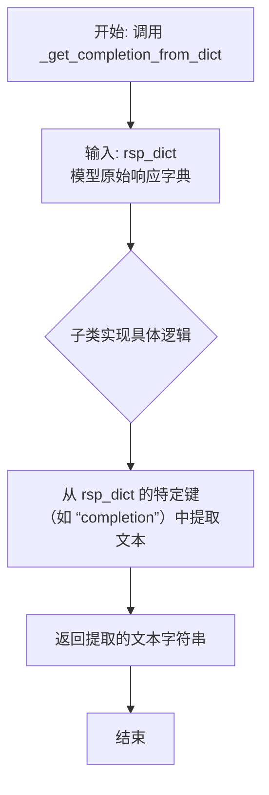
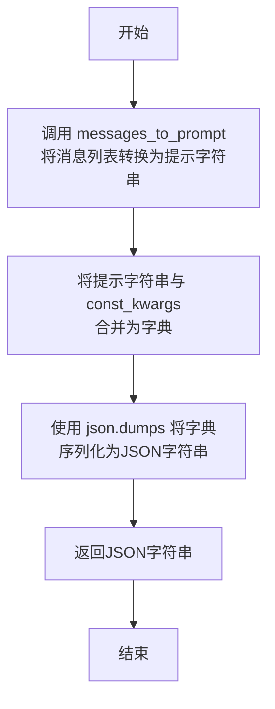
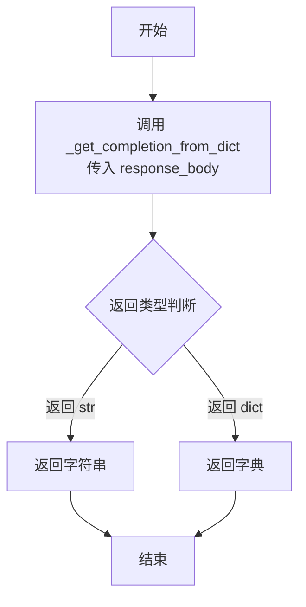

# `.\MetaGPT\metagpt\provider\bedrock\base_provider.py` 详细设计文档

该代码定义了一个用于与AWS Bedrock服务交互的抽象基类 `BaseBedrockProvider`。它封装了将对话消息列表转换为模型提示、构建请求体、以及从Bedrock API响应中提取生成文本的核心逻辑，为不同Bedrock模型提供统一的接口。

## 整体流程

```mermaid
graph TD
    A[用户调用 get_request_body] --> B[调用 messages_to_prompt 转换消息]
    B --> C[将提示与常量参数合并为JSON]
    C --> D[返回请求体字符串]
    
    E[用户调用 get_choice_text] --> F[调用 _get_completion_from_dict 抽象方法]
    F --> G[返回提取的文本或字典]
    
    H[用户调用 get_choice_text_from_stream] --> I[解析流式响应事件]
    I --> J[调用 _get_completion_from_dict 抽象方法]
    J --> K[返回 (False, 提取的文本)]
```

## 类结构

```
BaseBedrockProvider (抽象基类)
├── 具体模型Provider类 (未在代码中实现，需子类化)
│   ├── 必须实现: _get_completion_from_dict 方法
│   └── 可覆盖: messages_to_prompt 等方法
```

## 全局变量及字段


### `BaseBedrockProvider.max_tokens_field_name`
    
用于处理不同生成参数中最大令牌数的字段名称，默认为'max_tokens'。

类型：`str`
    


### `BaseBedrockProvider.usage`
    
可选字典，用于存储API调用的使用情况或统计信息。

类型：`Optional[dict]`
    


### `BaseBedrockProvider.reasoning`
    
布尔标志，指示是否启用推理模式。

类型：`bool`
    


### `BaseBedrockProvider.reasoning_max_token`
    
推理模式下允许的最大令牌数，默认为4000。

类型：`int`
    
    

## 全局函数及方法

### `BaseBedrockProvider.__init__`

该方法用于初始化 `BaseBedrockProvider` 抽象基类的实例，主要设置与推理（reasoning）功能相关的配置参数。

参数：

- `reasoning`：`bool`，指示是否启用推理功能，默认为 `False`
- `reasoning_max_token`：`int`，设置推理功能的最大令牌数限制，默认为 `4000`

返回值：`None`，此方法为构造函数，不返回任何值

#### 流程图



#### 带注释源码

```python
def __init__(self, reasoning: bool = False, reasoning_max_token: int = 4000):
    # 设置实例的推理功能启用状态
    self.reasoning = reasoning
    # 设置实例的推理功能最大令牌数限制
    self.reasoning_max_token = reasoning_max_token
```

### `BaseBedrockProvider._get_completion_from_dict`

这是一个抽象方法，其核心职责是从一个给定的字典响应体中提取出“完成文本”或“生成结果”。具体的提取逻辑由继承 `BaseBedrockProvider` 的子类实现，以适应不同模型（如 Claude、Titan）的响应格式差异。

参数：

- `rsp_dict`：`dict`，包含模型原始响应的字典对象，通常由 `json.loads` 解析 API 响应体得到。

返回值：`str`，从响应字典中提取出的文本生成结果。

#### 流程图



#### 带注释源码

```python
@abstractmethod
def _get_completion_from_dict(self, rsp_dict: dict) -> str:
    # 这是一个抽象方法，没有具体的实现代码。
    # 它定义了一个接口契约：所有继承 BaseBedrockProvider 的子类
    # 都必须实现此方法，以提供从特定模型响应格式中提取文本的逻辑。
    # 参数 rsp_dict 是模型 API 返回的 JSON 响应解析后的字典。
    # 返回值应为从该字典中解析出的纯文本生成内容。
    ...
```

### `BaseBedrockProvider.get_request_body`

该方法用于将对话消息列表和固定的生成参数组合成一个符合特定格式的JSON请求体字符串。

参数：
- `messages`：`list[dict]`，包含对话角色和内容的字典列表，例如 `[{"role": "user", "content": "Hello"}]`。
- `const_kwargs`：`dict`，模型生成所需的固定参数，例如温度（temperature）、最大令牌数（max_tokens）等。
- `*args`：`tuple`，可变位置参数，当前方法中未使用。
- `**kwargs`：`dict`，可变关键字参数，当前方法中未使用。

返回值：`str`，一个JSON格式的字符串，其结构为 `{"prompt": "...", **const_kwargs}`，其中 `prompt` 字段的值由 `messages_to_prompt` 方法生成。

#### 流程图



#### 带注释源码

```python
def get_request_body(self, messages: list[dict], const_kwargs, *args, **kwargs) -> str:
    # 1. 调用 messages_to_prompt 方法，将消息字典列表转换为一个格式化的提示字符串。
    # 2. 创建一个字典，包含 "prompt" 键（值为上一步的字符串）以及 const_kwargs 中的所有键值对。
    # 3. 使用 json.dumps 将这个字典序列化为一个JSON格式的字符串。
    # 4. 返回这个JSON字符串，作为请求体。
    body = json.dumps({"prompt": self.messages_to_prompt(messages), **const_kwargs})
    return body
```

### `BaseBedrockProvider.get_choice_text`

该方法用于从AWS Bedrock服务的响应体中提取生成的文本内容。它通过调用一个抽象方法 `_get_completion_from_dict` 来处理具体的响应字典，并返回提取出的文本或包含文本的字典。

参数：

- `response_body`：`dict`，AWS Bedrock服务返回的响应体，通常是一个包含生成结果的字典。

返回值：`Union[str, dict[str, str]]`，返回从响应体中提取出的文本内容。如果底层实现返回字符串，则直接返回字符串；如果返回字典，则返回该字典。

#### 流程图



#### 带注释源码

```python
def get_choice_text(self, response_body: dict) -> Union[str, dict[str, str]]:
    # 调用抽象方法 _get_completion_from_dict 处理响应字典
    completions = self._get_completion_from_dict(response_body)
    # 返回处理后的结果，可能是字符串或字典
    return completions
```

### `BaseBedrockProvider.get_choice_text_from_stream`

该方法用于处理来自Amazon Bedrock服务的流式响应事件，从事件数据中提取并解析模型生成的文本内容。

参数：

- `event`：`dict`，包含流式响应数据的字典对象，其`chunk`键下的`bytes`字段存储了JSON格式的响应体。

返回值：`tuple[bool, str]`，返回一个元组，其中第一个元素为布尔值`False`（表示流式响应尚未结束），第二个元素为从响应体中解析出的模型生成的文本内容。

#### 流程图

```mermaid
flowchart TD
    A[开始: 接收流式事件 event] --> B[从 event['chunk']['bytes'] 加载JSON数据]
    B --> C[解析JSON为字典 rsp_dict]
    C --> D[调用 _get_completion_from_dict(rsp_dict) 提取文本]
    D --> E[返回元组 (False, 提取的文本)]
    E --> F[结束]
```

#### 带注释源码

```python
def get_choice_text_from_stream(self, event) -> Union[bool, str]:
    # 1. 从传入的流式事件字典中，获取字节数据并解析为JSON字典
    rsp_dict = json.loads(event["chunk"]["bytes"])
    # 2. 调用抽象方法，由具体子类实现如何从响应字典中提取生成的文本
    completions = self._get_completion_from_dict(rsp_dict)
    # 3. 返回一个元组。第一个元素为False，表示当前事件不是流的结束；
    #    第二个元素是本次事件中解析出的文本内容。
    return False, completions
```

### `BaseBedrockProvider.messages_to_prompt`

该方法将对话消息列表（通常包含角色和内容）转换为一个简单的、以换行符分隔的纯文本提示字符串。转换规则是将每条消息格式化为“{role}: {content}”的形式。

参数：

- `messages`：`list[dict]`，一个字典列表，每个字典代表一条消息，通常包含 `'role'` 和 `'content'` 键。

返回值：`str`，转换后的纯文本提示字符串。

#### 流程图

```mermaid
flowchart TD
    A[开始] --> B[初始化空列表 lines]
    B --> C{遍历 messages 列表?}
    C -- 是 --> D[获取当前消息 msg]
    D --> E[格式化字符串: f"{msg['role']}: {msg['content']}"]
    E --> F[将格式化字符串添加到 lines 列表]
    F --> C
    C -- 否 --> G[使用换行符连接 lines 列表中的所有字符串]
    G --> H[返回连接后的字符串]
    H --> I[结束]
```

#### 带注释源码

```python
def messages_to_prompt(self, messages: list[dict]) -> str:
    """[{"role": "user", "content": msg}] to user: <msg> etc."""
    # 使用列表推导式遍历 messages 列表中的每个字典 msg
    # 对于每个 msg，将其格式化为 "角色: 内容" 的字符串
    # 最后使用换行符 "\n" 将所有格式化后的字符串连接成一个完整的字符串并返回
    return "\n".join([f"{msg['role']}: {msg['content']}" for msg in messages])
```

## 关键组件


### BaseBedrockProvider 基类

定义了与 Amazon Bedrock 服务交互的抽象基类，为不同模型提供统一的请求构建、响应解析和消息格式转换接口。

### 抽象方法 _get_completion_from_dict

定义了从模型返回的字典中提取完成文本的抽象方法，强制子类根据具体模型的响应格式实现解析逻辑。

### 请求体构建 (get_request_body)

将输入的消息列表和固定参数转换为符合 Bedrock API 要求的 JSON 请求体字符串。

### 响应解析 (get_choice_text / get_choice_text_from_stream)

提供了从标准响应字典或流式响应事件中提取模型生成文本的通用方法，内部依赖于 `_get_completion_from_dict` 的具体实现。

### 消息格式转换 (messages_to_prompt)

将通用的角色-内容消息字典列表转换为特定于 Bedrock 模型的提示字符串格式（例如，“role: content”）。

### 推理模式支持

通过 `reasoning` 和 `reasoning_max_token` 字段，为支持链式推理的模型提供配置选项，以控制推理过程的启用和最大令牌数。


## 问题及建议


### 已知问题

-   **`get_choice_text_from_stream` 方法返回值类型与声明不匹配**：方法签名声明返回 `Union[bool, str]`，但实际返回的是一个包含两个元素的元组 `(False, completions)`。这会导致类型检查工具（如 mypy）报错，并且调用方可能无法正确处理返回值。
-   **`usage` 类变量未在实例中初始化或使用**：类变量 `usage` 被声明为 `Optional[dict]`，但在 `__init__` 方法中未对其进行初始化，且在所有方法中均未使用。这可能导致混淆，不清楚其设计意图。
-   **`messages_to_prompt` 方法过于简单**：该方法仅将消息列表简单地拼接为 `role: content` 的字符串，没有考虑不同模型对提示格式（如系统提示、用户/助手角色标记、特殊分隔符等）的特定要求，通用性较差。
-   **`get_request_body` 方法参数设计模糊**：参数 `const_kwargs` 名称和用途不明确，且方法签名中包含 `*args, **kwargs` 但未在方法体中使用，这增加了接口的复杂性和不确定性。
-   **缺乏错误处理机制**：代码中没有对 JSON 解析失败、网络请求异常或模型响应格式不符合预期等情况进行错误处理，鲁棒性不足。

### 优化建议

-   **修正 `get_choice_text_from_stream` 方法的返回值**：应将方法签名修改为返回 `tuple[bool, str]` 或 `tuple[bool, Union[str, dict[str, str]]]`，以匹配实际返回的数据结构。同时，考虑第一个布尔值参数（可能表示流是否结束）的命名和用途是否清晰。
-   **明确 `usage` 变量的用途或移除**：如果 `usage` 变量用于记录令牌使用情况，应在 `__init__` 中初始化为 `None` 或空字典，并在 `get_choice_text` 等方法中从响应中提取并更新它。如果暂无用途，应考虑移除以避免混淆。
-   **重构 `messages_to_prompt` 方法为抽象方法或提供钩子**：由于不同模型（如 Claude、Llama）的提示模板差异很大，应将此方法设为抽象方法，强制子类实现。或者，提供一个可覆盖的默认实现，并允许子类通过重写来定制格式。
-   **优化 `get_request_body` 方法的接口设计**：考虑将 `const_kwargs` 重命名为更具描述性的名称（如 `generation_parameters`），并移除未使用的 `*args, **kwargs` 参数。明确方法职责，使其只负责构建请求体。
-   **增强错误处理**：在 `get_choice_text_from_stream` 中的 `json.loads` 调用周围添加 `try-except` 块以处理 JSON 解析错误。在 `_get_completion_from_dict` 等抽象方法中，也应考虑定义可能抛出的异常，以便子类实现和调用方处理。
-   **考虑添加类型注解和文档字符串**：为方法参数和返回值添加更精确的类型注解（例如，使用 `TypedDict` 或 `Literal` 来定义 `messages` 的结构）。为所有公共方法添加详细的文档字符串，说明其功能、参数和返回值。
-   **评估 `reasoning` 和 `reasoning_max_token` 参数的通用性**：这些参数似乎是针对特定推理功能的，如果并非所有子类都需要，应考虑将其移至需要它们的子类中，或在基类中提供默认实现（可能为空操作）。


## 其它


### 设计目标与约束

本模块旨在为与 AWS Bedrock 服务交互提供一个抽象基类，定义统一的接口和基础实现，以支持不同 Bedrock 模型提供商（如 Claude、Titan 等）的集成。核心设计目标包括：1) **抽象性**：通过抽象方法隔离不同模型提供商对响应体解析的具体实现。2) **一致性**：为消息格式化、请求体构建和响应解析提供标准化的流程。3) **可扩展性**：允许子类通过覆盖特定方法（如 `messages_to_prompt`）来适配不同模型的输入格式要求。主要约束包括：1) 必须遵循 AWS Bedrock 的 HTTP API 调用规范。2) 当前设计假设请求体为 JSON 格式，且包含一个 `"prompt"` 字段。3) 流式与非流式响应的处理接口需保持一致。

### 错误处理与异常设计

当前代码片段中未显式包含错误处理逻辑。在完整实现中，应考虑以下异常场景：1) **网络与 API 错误**：调用 Bedrock 服务时的网络异常、认证失败、配额超限或服务内部错误，应捕获并封装为统一的异常类向上抛出。2) **数据格式错误**：在 `json.loads` 解析响应流、或访问 `response_body` 字典中预期字段时可能引发 `KeyError`、`JSONDecodeError` 等异常，应有相应的 `try-except` 块进行处理，并转化为更有意义的业务异常。3) **抽象方法未实现错误**：如果子类未实现 `_get_completion_from_dict` 抽象方法，在实例化时会由 Python 解释器抛出 `TypeError`。建议在文档中明确此要求。

### 数据流与状态机

1.  **非流式调用数据流**：
    *   **输入**：`messages` (对话历史列表) 和 `const_kwargs` (模型固定参数)。
    *   **处理**：`messages_to_prompt` 将消息列表转换为单一提示字符串 -> `get_request_body` 将提示和参数组合成 JSON 请求体字符串。
    *   **输出**：调用者使用此请求体发起 HTTP 请求。
    *   **响应解析**：收到响应字典 `response_body` -> `get_choice_text` 调用 `_get_completion_from_dict` 提取生成文本。
2.  **流式调用数据流**：
    *   **输入**：单个流事件 `event` (假设包含 `event['chunk']['bytes']` 为 JSON 字符串)。
    *   **处理**：`get_choice_text_from_stream` 解析 JSON -> 调用 `_get_completion_from_dict` 提取该片段的文本。
    *   **输出**：返回一个元组 `(False, completions)`，其中 `False` 可能表示流未结束（当前实现固定返回 `False`，需完善）。
3.  **状态**：类实例通过 `reasoning` 和 `reasoning_max_token` 字段维护与“推理”功能相关的配置状态，影响子类的具体行为。

### 外部依赖与接口契约

1.  **外部服务依赖**：**AWS Bedrock**。本类是 Bedrock 服务的客户端封装，其所有方法最终都是为了生成符合 Bedrock API 要求的请求或解析其响应。
2.  **接口契约**：
    *   **`_get_completion_from_dict` 方法**：是子类必须履行的核心契约。输入为 Bedrock 原始响应字典，输出为提取出的文本内容（`str`）或包含文本的结构（`dict[str, str]`）。子类实现必须了解其对应模型响应体的具体结构。
    *   **`get_choice_text_from_stream` 方法**：假设输入事件 `event` 遵循 AWS SDK for Python (Boto3) 在处理 Bedrock 流式响应时返回的通用事件结构，特别是 `event['chunk']['bytes']` 路径必须有效。
    *   **`messages` 参数格式**：约定为列表，其中每个元素是包含 `'role'` 和 `'content'` 键的字典。`messages_to_prompt` 的默认实现基于此约定。
    *   **请求体格式**：`get_request_body` 默认生成一个包含 `{"prompt": ...}` 的 JSON 对象。这构成了与 Bedrock 模型（尤其是那些接受简单提示的模型）的默认请求契约。

    