# `.\MetaGPT\metagpt\provider\bedrock\bedrock_provider.py` 详细设计文档

该文件定义了一个AWS Bedrock服务提供商工厂模块，包含多个针对不同AI模型提供商（如Mistral、Anthropic、Cohere、Meta、Ai21、Amazon）的适配器类。这些类继承自一个通用的基础提供商，负责将标准化的消息格式转换为各提供商API特定的请求体，并解析其响应。核心功能是通过`get_provider`工厂函数，根据传入的模型ID动态创建并返回对应的提供商实例，以统一接口调用不同的Bedrock模型。

## 整体流程

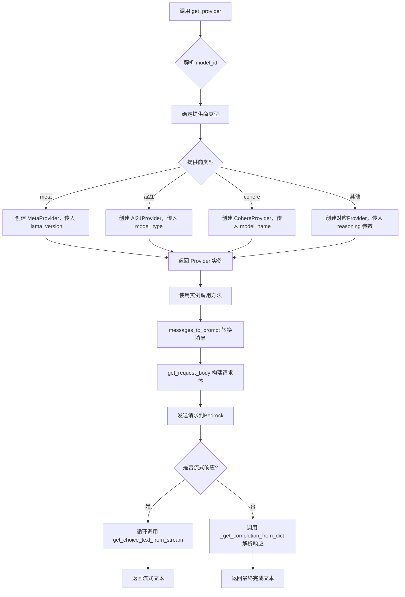

## 类结构

```
BaseBedrockProvider (抽象基类，来自外部模块)
├── MistralProvider
├── AnthropicProvider
├── CohereProvider
├── MetaProvider
├── Ai21Provider
└── AmazonProvider
```

## 全局变量及字段


### `PROVIDERS`
    
一个字典，将提供商名称（如'mistral'、'meta'）映射到对应的提供商类，用于根据模型ID动态选择和实例化适当的提供商。

类型：`dict[str, Type[BaseBedrockProvider]]`
    


### `CohereProvider.model_name`
    
存储Cohere模型的具体名称（如'command-r'），用于在消息转换和请求体构建时区分不同模型系列的行为。

类型：`str`
    


### `MetaProvider.llama_version`
    
指定Meta Llama模型的版本（'llama2'或'llama3'），用于决定使用哪个消息到提示的转换函数。

类型：`Literal['llama2', 'llama3']`
    


### `MetaProvider.max_tokens_field_name`
    
定义在生成请求体时，用于表示最大生成长度的参数字段名，继承自基类但在此类中固定为'max_gen_len'。

类型：`str`
    


### `Ai21Provider.model_type`
    
指定AI21模型类型（'j2'代表Jurassic-2，'jamba'代表Jamba），用于区分不同模型的API参数和响应结构。

类型：`Literal['j2', 'jamba']`
    


### `Ai21Provider.max_tokens_field_name`
    
定义在生成请求体时，用于表示最大生成长度的参数字段名，其值根据model_type（'j2'或'jamba'）动态设置为'maxTokens'或'max_tokens'。

类型：`str`
    


### `AmazonProvider.max_tokens_field_name`
    
定义在生成请求体时，用于表示最大生成长度的参数字段名，继承自基类但在此类中固定为'maxTokenCount'。

类型：`str`
    
    

## 全局函数及方法

### `get_provider`

`get_provider` 是一个全局函数，用于根据给定的模型ID和推理配置，动态创建并返回对应的AWS Bedrock模型提供者实例。它通过解析模型ID来确定提供者类型和模型名称，并根据提供者的特定需求（如模型版本、类型等）实例化相应的提供者类。

参数：

- `model_id`：`str`，AWS Bedrock的模型标识符，格式通常为`provider.model_name`或`region.provider.model_name`。
- `reasoning`：`bool`，可选参数，默认为`False`，指示是否启用推理模式（仅对某些提供者有效，如Anthropic）。
- `reasoning_max_token`：`int`，可选参数，默认为`4000`，指定推理模式的最大令牌数（仅对某些提供者有效，如Anthropic）。

返回值：`BaseBedrockProvider`，返回一个继承自`BaseBedrockProvider`的提供者实例，具体类型取决于`model_id`中指定的提供者。

#### 流程图

```mermaid
graph TD
    A[开始: 调用 get_provider] --> B[解析 model_id]
    B --> C{model_id 长度?}
    C -->|长度为2| D[provider, model_name = arr]
    C -->|长度为3| E[_, provider, model_name = arr]
    D --> F{provider 是否在 PROVIDERS 中?}
    E --> F
    F -->|否| G[抛出 KeyError]
    F -->|是| H{provider 类型?}
    H -->|meta| I[返回 MetaProvider<br/>参数: model_name[:6]]
    H -->|ai21| J[返回 Ai21Provider<br/>参数: model_name.split('-')[0]]
    H -->|cohere| K[返回 CohereProvider<br/>参数: model_name]
    H -->|其他| L[返回 PROVIDERS[provider]<br/>参数: reasoning, reasoning_max_token]
    I --> M[结束: 返回提供者实例]
    J --> M
    K --> M
    L --> M
    G --> M
```

#### 带注释源码

```python
def get_provider(model_id: str, reasoning: bool = False, reasoning_max_token: int = 4000):
    # 解析模型ID，根据点号分割
    arr = model_id.split(".")
    if len(arr) == 2:
        # 标准格式: provider.model_name
        provider, model_name = arr  # meta、mistral……
    elif len(arr) == 3:
        # 可能包含区域信息: region.provider.model_name
        _, provider, model_name = arr

    # 检查提供者是否在支持的列表中
    if provider not in PROVIDERS:
        raise KeyError(f"{provider} is not supported!")
    
    # 根据提供者类型进行特殊处理
    if provider == "meta":
        # Meta提供者需要区分llama2和llama3版本，通过模型名前6个字符判断
        return PROVIDERS[provider](model_name[:6])
    elif provider == "ai21":
        # AI21提供者需要区分j2和jamba类型，通过模型名分割后的第一部分判断
        return PROVIDERS[provider](model_name.split("-")[0])
    elif provider == "cohere":
        # Cohere提供者需要区分R/R+和旧模型，直接传递模型名
        return PROVIDERS[provider](model_name)
    
    # 其他提供者直接实例化，并传递推理相关参数
    return PROVIDERS[provider](reasoning=reasoning, reasoning_max_token=reasoning_max_token)
```

### `MistralProvider.messages_to_prompt`

该方法负责将对话消息列表转换为适用于Mistral模型的提示字符串格式。它通过调用一个专门为Llama2模型设计的消息转换函数来实现，表明Mistral模型与Llama2模型在提示格式上兼容。

参数：

- `messages`：`list[dict]`，一个字典列表，其中每个字典代表一条对话消息，通常包含`role`（如“user”、“assistant”、“system”）和`content`（消息内容）等键。

返回值：`str`，转换后的、符合Mistral模型输入要求的完整提示字符串。

#### 流程图

```mermaid
flowchart TD
    A[开始] --> B[接收参数 messages]
    B --> C[调用 messages_to_prompt_llama2(messages)]
    C --> D[返回转换后的提示字符串]
    D --> E[结束]
```

#### 带注释源码

```python
def messages_to_prompt(self, messages: list[dict]):
    # 调用为Llama2模型设计的消息转换函数，将消息列表转换为提示字符串。
    # 这表明Mistral模型与Llama2模型使用相同的提示格式。
    return messages_to_prompt_llama2(messages)
```

### `MistralProvider._get_completion_from_dict`

该方法用于从 AWS Bedrock Mistral 模型的响应字典中提取生成的文本内容。

参数：

- `rsp_dict`：`dict`，包含 Mistral 模型响应的字典对象

返回值：`str`，从响应字典中提取出的文本内容

#### 流程图

```mermaid
flowchart TD
    A[开始] --> B[接收响应字典 rsp_dict]
    B --> C[访问 rsp_dict['outputs'][0]['text']]
    C --> D[返回提取的文本字符串]
    D --> E[结束]
```

#### 带注释源码

```python
def _get_completion_from_dict(self, rsp_dict: dict) -> str:
    # 从 Mistral 模型的响应字典中提取生成的文本
    # rsp_dict 结构参考 AWS Bedrock Mistral 模型文档
    # 返回 outputs 数组中第一个元素的 text 字段值
    return rsp_dict["outputs"][0]["text"]
```

### `AnthropicProvider._split_system_user_messages`

该方法用于将传入的消息列表按角色拆分为系统消息和用户消息。系统消息（role为"system"）被提取并转换为提示字符串，而用户消息（role为"user"或"assistant"）则保持原样返回。这是为了适配Anthropic Claude模型的API格式，该格式要求系统消息作为独立的`system`字段传递。

参数：

- `messages`：`list[dict]`，包含消息字典的列表，每个字典应包含`role`和`content`键。

返回值：`Tuple[str, list[dict]]`，返回一个元组，第一个元素是系统消息转换后的提示字符串，第二个元素是过滤后的用户消息列表。

#### 流程图

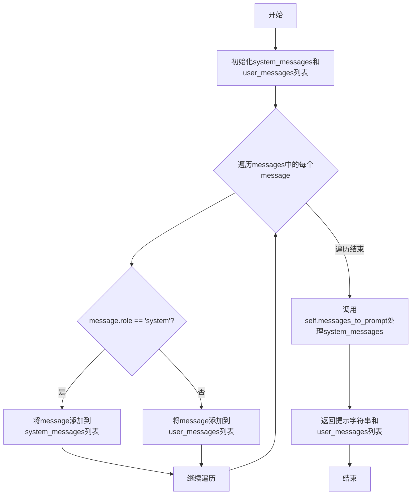

#### 带注释源码

```python
def _split_system_user_messages(self, messages: list[dict]) -> Tuple[str, list[dict]]:
    # 初始化两个空列表，分别用于存放系统消息和用户消息
    system_messages = []
    user_messages = []
    # 遍历传入的消息列表
    for message in messages:
        # 判断消息的角色是否为'system'
        if message["role"] == "system":
            # 如果是系统消息，则添加到system_messages列表
            system_messages.append(message)
        else:
            # 否则，添加到user_messages列表（包括'user'和'assistant'角色）
            user_messages.append(message)
    # 调用父类或本类的messages_to_prompt方法，将系统消息列表转换为提示字符串
    # 返回一个元组：第一个元素是系统提示字符串，第二个元素是用户消息列表
    return self.messages_to_prompt(system_messages), user_messages
```

### `AnthropicProvider.get_request_body`

该方法用于构建发送给AWS Bedrock Anthropic Claude模型的请求体。它处理消息列表和生成参数，特别支持推理模式（reasoning mode），并将系统消息和用户消息分离以符合Anthropic API的格式要求。

参数：

- `messages`：`list[dict]`，包含对话历史的消息列表，每个消息是一个字典，通常包含"role"和"content"键。
- `generate_kwargs`：`dict`，包含模型生成文本时的配置参数，如温度（temperature）、最大令牌数（max_tokens）等。
- `*args`：可变位置参数，当前方法中未使用。
- `**kwargs`：可变关键字参数，当前方法中未使用。

返回值：`str`，返回一个JSON格式的字符串，作为请求体发送给AWS Bedrock Anthropic Claude API。

#### 流程图

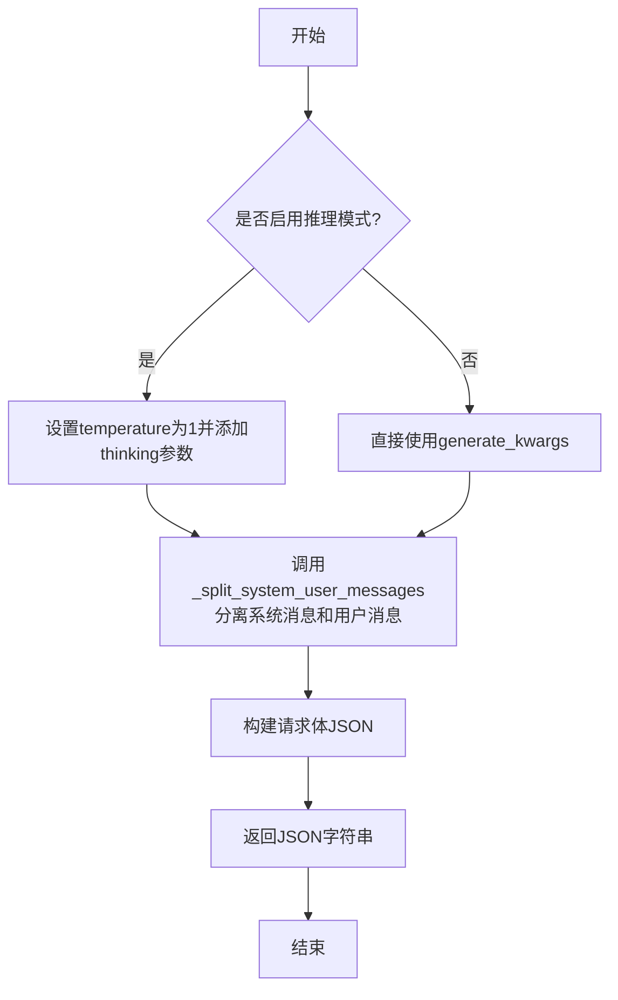

#### 带注释源码

```python
def get_request_body(self, messages: list[dict], generate_kwargs, *args, **kwargs) -> str:
    # 如果启用了推理模式，调整生成参数
    if self.reasoning:
        generate_kwargs["temperature"] = 1  # 推理模式下温度应设为1
        generate_kwargs["thinking"] = {"type": "enabled", "budget_tokens": self.reasoning_max_token}

    # 分离系统消息和用户消息
    system_message, user_messages = self._split_system_user_messages(messages)
    
    # 构建符合Anthropic API格式的请求体
    body = json.dumps(
        {
            "messages": user_messages,  # 用户消息列表
            "anthropic_version": "bedrock-2023-05-31",  # Anthropic API版本
            "system": system_message,  # 系统消息
            **generate_kwargs,  # 合并其他生成参数
        }
    )
    return body  # 返回JSON字符串
```

### `AnthropicProvider._get_completion_from_dict`

该方法用于从AWS Bedrock Anthropic Claude模型的API响应字典中提取生成的文本内容。它根据是否启用了推理模式（`reasoning`）来解析不同的响应结构，返回纯文本或包含推理内容和最终答案的字典。

参数：

- `rsp_dict`：`dict`，AWS Bedrock Anthropic Claude模型的原始API响应字典。

返回值：`Union[str, dict[str, Tuple[str, str]]]`，如果未启用推理模式，则返回生成的文本字符串；如果启用了推理模式，则返回一个字典，包含`reasoning_content`（推理过程）和`content`（最终答案）。

#### 流程图

```mermaid
flowchart TD
    A[开始] --> B{推理模式已启用?<br>self.reasoning == True?}
    B -- 是 --> C[从rsp_dict中提取推理内容和最终答案]
    C --> D[返回字典<br>{'reasoning_content': ..., 'content': ...}]
    B -- 否 --> E[从rsp_dict中提取最终答案文本]
    E --> F[返回文本字符串]
```

#### 带注释源码

```python
def _get_completion_from_dict(self, rsp_dict: dict) -> dict[str, Tuple[str, str]]:
    # 检查是否启用了推理模式
    if self.reasoning:
        # 如果启用了推理模式，Claude的响应结构包含一个`thinking`字段（推理过程）和一个`text`字段（最终答案）
        # 返回一个字典，包含推理内容和最终答案
        return {"reasoning_content": rsp_dict["content"][0]["thinking"], "content": rsp_dict["content"][1]["text"]}
    # 如果未启用推理模式，直接返回响应中的第一个文本内容（最终答案）
    return rsp_dict["content"][0]["text"]
```

### `AnthropicProvider.get_choice_text_from_stream`

该方法用于处理来自AWS Bedrock Anthropic模型的流式响应事件。它解析事件数据，提取增量内容（如文本、推理文本），并在消息结束时收集API使用量统计信息。

参数：
- `event`：`dict`，包含来自AWS Bedrock流式响应的原始事件数据。

返回值：`Union[bool, str]`，返回一个元组，第一个元素是一个布尔值，指示提取的内容是否为推理内容（`True`）或普通文本内容（`False`）；第二个元素是提取到的增量文本内容字符串。如果事件类型不是内容增量或消息停止，则返回`(False, "")`。

#### 流程图

```mermaid
flowchart TD
    A[开始: 接收事件 event] --> B[解析事件中的字节数据为JSON字典 rsp_dict]
    B --> C{判断 rsp_dict['type'] 类型}
    C -->|type == 'content_block_delta'| D{判断 delta_type 类型}
    D -->|delta_type == 'text_delta'| E[completions = 文本增量<br>reasoning = False]
    D -->|delta_type == 'thinking_delta'| F[completions = 推理增量<br>reasoning = True]
    D -->|delta_type == 'signature_delta'| G[completions = 空字符串<br>reasoning = False]
    E --> H[返回 (reasoning, completions)]
    F --> H
    G --> H
    C -->|type == 'message_stop'| I[更新 self.usage 为API使用量统计]
    I --> J[返回 (False, '')]
    C -->|其他类型| K[返回 (False, '')]
```

#### 带注释源码

```python
def get_choice_text_from_stream(self, event) -> Union[bool, str]:
    # 解析事件中的字节数据为JSON字典
    # https://docs.anthropic.com/claude/reference/messages-streaming
    rsp_dict = json.loads(event["chunk"]["bytes"])
    
    # 判断响应类型
    if rsp_dict["type"] == "content_block_delta":
        # 处理内容块增量事件
        reasoning = False
        delta_type = rsp_dict["delta"]["type"]
        
        # 根据增量类型提取内容
        if delta_type == "text_delta":
            # 普通文本增量
            completions = rsp_dict["delta"]["text"]
        elif delta_type == "thinking_delta":
            # 推理文本增量（当启用推理功能时）
            completions = rsp_dict["delta"]["thinking"]
            reasoning = True
        elif delta_type == "signature_delta":
            # 签名增量，无实际文本内容
            completions = ""
        # 返回（是否为推理内容， 增量文本）
        return reasoning, completions
    
    elif rsp_dict["type"] == "message_stop":
        # 处理消息停止事件，提取API使用量统计信息
        self.usage = {
            "prompt_tokens": rsp_dict.get("amazon-bedrock-invocationMetrics", {}).get("inputTokenCount", 0),
            "completion_tokens": rsp_dict.get("amazon-bedrock-invocationMetrics", {}).get("outputTokenCount", 0),
        }
    
    # 对于其他类型的事件或不匹配的情况，返回默认值
    return False, ""
```

### `CohereProvider.__init__`

该方法用于初始化 `CohereProvider` 类的实例，主要功能是设置模型名称。

参数：

- `model_name`：`str`，指定要使用的模型名称，用于后续区分不同模型的行为（如 Command 与 Command R/R+）。

返回值：`None`，无返回值。

#### 流程图

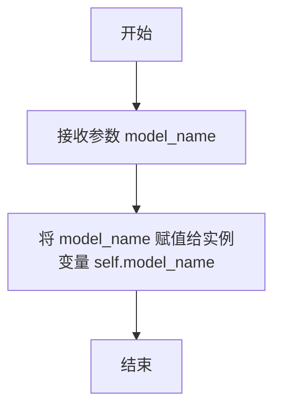

#### 带注释源码

```python
def __init__(self, model_name: str) -> None:
    # 初始化方法，接收一个字符串参数 model_name
    self.model_name = model_name  # 将传入的模型名称保存为实例变量，供类内其他方法使用
```

### `CohereProvider._get_completion_from_dict`

该方法用于从Cohere模型API的响应字典中提取生成的文本内容。

参数：

- `rsp_dict`：`dict`，Cohere模型API返回的响应字典。

返回值：`str`，从响应字典中提取的生成的文本内容。

#### 流程图

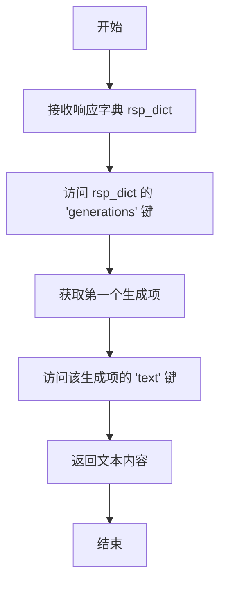

#### 带注释源码

```python
def _get_completion_from_dict(self, rsp_dict: dict) -> str:
    # 从响应字典中提取生成的文本内容
    # 访问 'generations' 键，获取生成列表
    # 取列表中的第一个生成项，并访问其 'text' 键以获取文本
    return rsp_dict["generations"][0]["text"]
```

### `CohereProvider.messages_to_prompt`

该方法根据模型名称（`model_name`）将通用的消息列表（`messages`）转换为Cohere模型特定的提示格式。对于`command-r`系列模型，它会将角色映射为Cohere特定的角色（如`USER`、`CHATBOT`），并返回一个字典列表；对于其他Cohere模型，它会将消息转换为简单的“角色: 内容”文本行。

参数：

- `messages`：`list[dict]`，一个字典列表，每个字典包含`role`（如`user`、`assistant`、`system`）和`content`键，代表对话历史或系统指令。

返回值：`Union[list[dict], str]`，如果模型是`command-r`系列，返回一个映射后的字典列表；否则返回一个由“角色: 内容”组成的字符串。

#### 流程图

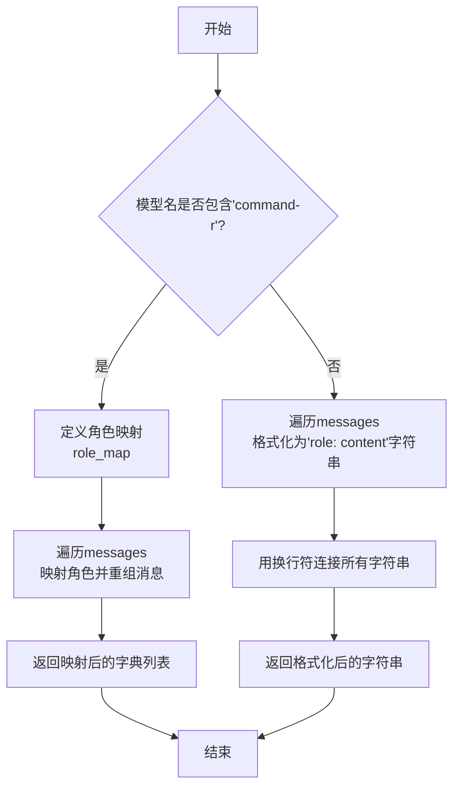

#### 带注释源码

```python
def messages_to_prompt(self, messages: list[dict]) -> str:
    # 检查当前实例的模型名称是否包含'command-r'，以判断是否为Command R/R+系列模型
    if "command-r" in self.model_name:
        # 定义角色映射规则：将通用角色映射到Cohere Command R/R+模型期望的角色
        role_map = {"user": "USER", "assistant": "CHATBOT", "system": "USER"}
        # 使用map和lambda函数遍历messages列表，对每个消息字典进行角色映射和结构重组
        messages = list(
            map(lambda message: {"role": role_map[message["role"]], "message": message["content"]}, messages)
        )
        # 返回映射和重组后的消息字典列表，供Command R/R+模型使用
        return messages
    else:
        """[{"role": "user", "content": msg}] to user: <msg> etc."""
        # 对于非Command R/R+模型（如Command），将每条消息格式化为"role: content"的字符串
        # 使用列表推导式遍历messages，生成格式化字符串列表
        # 最后用换行符'\n'连接所有字符串，形成一个完整的提示文本
        return "\n".join([f"{msg['role']}: {msg['content']}" for msg in messages])
```

### `CohereProvider.get_request_body`

该方法根据Cohere模型的不同版本（Command R/R+ 或 其他），将对话消息列表和生成参数转换为符合AWS Bedrock Cohere模型API要求的JSON请求体字符串。

参数：

- `messages`：`list[dict]`，包含角色（如"user", "assistant", "system"）和内容（"content"）的对话消息列表。
- `generate_kwargs`：`dict`，传递给模型API的额外生成参数（如`temperature`, `max_tokens`等）。
- `*args`：`tuple`，可变位置参数，当前方法中未使用。
- `**kwargs`：`dict`，可变关键字参数，用于接收如`stream`等流式传输控制参数。

返回值：`str`，序列化后的JSON字符串，作为请求体发送给AWS Bedrock Cohere模型API。

#### 流程图

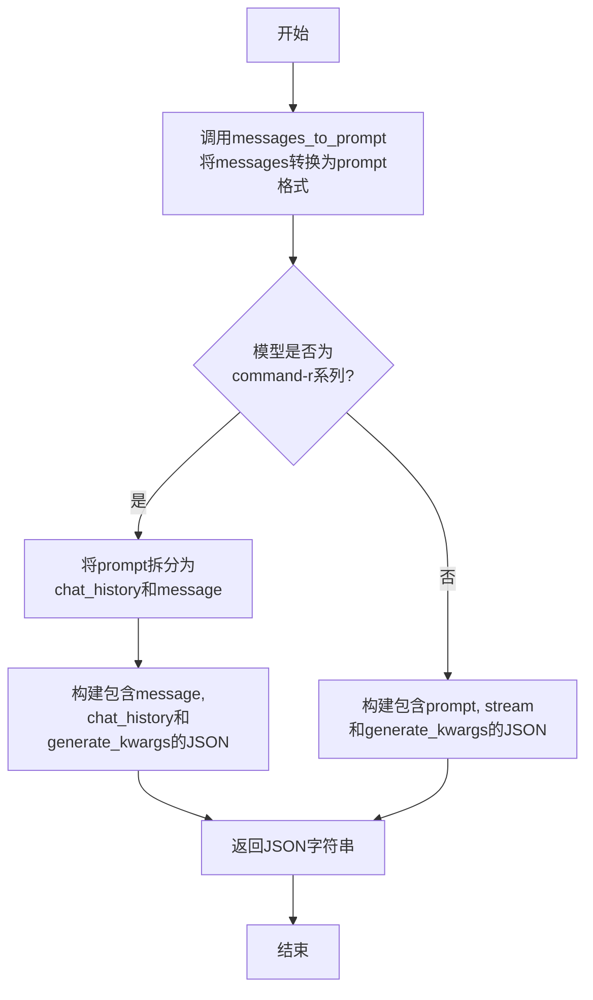

#### 带注释源码

```python
def get_request_body(self, messages: list[dict], generate_kwargs, *args, **kwargs):
    # 调用messages_to_prompt方法，根据模型类型将消息列表转换为合适的提示格式。
    prompt = self.messages_to_prompt(messages)
    # 判断当前模型是否为Command R或Command R+系列。
    if "command-r" in self.model_name:
        # 对于command-r系列模型，prompt是一个消息字典列表。
        # 将最后一条消息作为当前消息，其余作为聊天历史。
        chat_history, message = prompt[:-1], prompt[-1]["message"]
        # 构建符合command-r系列API要求的请求体JSON字符串。
        body = json.dumps({"message": message, "chat_history": chat_history, **generate_kwargs})
    else:
        # 对于非command-r系列模型（如Command），prompt是一个拼接好的字符串。
        # 构建符合其API要求的请求体JSON字符串，并处理流式传输参数。
        body = json.dumps({"prompt": prompt, "stream": kwargs.get("stream", False), **generate_kwargs})
    # 返回构建好的JSON字符串。
    return body
```

### `CohereProvider.get_choice_text_from_stream`

该方法用于处理来自 AWS Bedrock Cohere 模型流式响应的单个事件，解析事件数据并提取生成的文本内容。

参数：

- `event`：`dict`，包含来自 AWS Bedrock 流式响应的单个事件数据，通常包含 `chunk` 键，其值是一个包含 `bytes` 键的字典，`bytes` 的值是 JSON 格式的响应字节串。

返回值：`Union[bool, str]`，返回一个元组，第一个元素为布尔值（在此实现中固定为 `False`，表示非推理内容），第二个元素为字符串，是从事件中解析出的文本内容。如果事件不包含有效文本，则返回空字符串。

#### 流程图

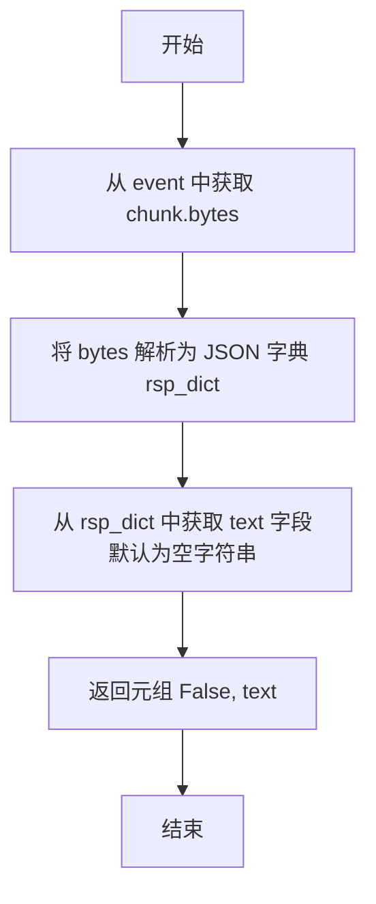

#### 带注释源码

```python
def get_choice_text_from_stream(self, event) -> Union[bool, str]:
    # 1. 从事件对象中提取字节数据并解析为JSON字典
    rsp_dict = json.loads(event["chunk"]["bytes"])
    # 2. 尝试从解析后的字典中获取 'text' 字段的值，如果不存在则返回空字符串
    completions = rsp_dict.get("text", "")
    # 3. 返回一个元组。第一个元素 False 表示这不是推理内容（reasoning content），
    #    第二个元素是提取到的文本内容。
    return False, completions
```

### `MetaProvider.__init__`

`MetaProvider.__init__` 是 `MetaProvider` 类的构造函数，用于初始化一个 `MetaProvider` 实例。它根据传入的 `llama_version` 参数设置实例的 `llama_version` 属性，该属性决定了后续消息转换时使用的提示模板版本（`llama2` 或 `llama3`）。

参数：

- `llama_version`：`Literal["llama2", "llama3"]`，指定要使用的 Llama 模型版本，必须是 `"llama2"` 或 `"llama3"` 中的一个。

返回值：`None`，构造函数不返回任何值。

#### 流程图

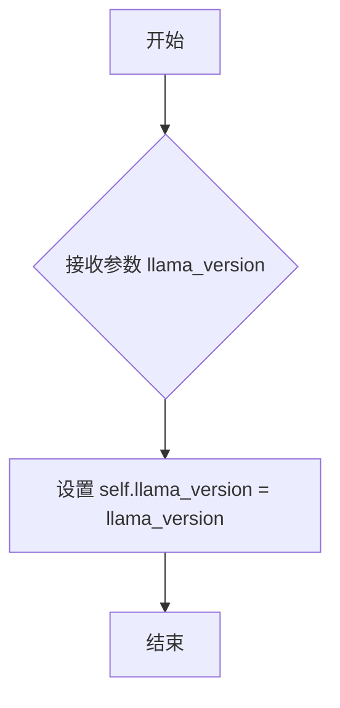

#### 带注释源码

```python
def __init__(self, llama_version: Literal["llama2", "llama3"]) -> None:
    # 初始化 MetaProvider 实例
    # 参数 llama_version 指定了要使用的 Llama 模型版本
    self.llama_version = llama_version
```

### `MetaProvider.messages_to_prompt`

该方法根据 `MetaProvider` 实例初始化的 `llama_version` 参数，将传入的消息列表转换为特定于 Llama2 或 Llama3 模型的提示字符串格式。

参数：

- `messages`：`list[dict]`，一个字典列表，每个字典代表一条消息，通常包含 `role`（如 `"user"`, `"assistant"`, `"system"`）和 `"content"` 键。

返回值：`str`，转换后的、符合指定 Llama 模型格式要求的提示字符串。

#### 流程图

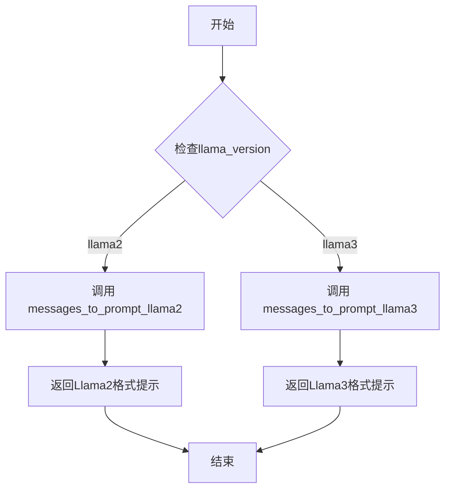

#### 带注释源码

```python
def messages_to_prompt(self, messages: list[dict]):
    # 根据初始化时指定的 Llama 版本，调用相应的工具函数进行消息格式转换。
    if self.llama_version == "llama2":
        # 调用专门为 Llama2 模型设计的消息转换函数。
        return messages_to_prompt_llama2(messages)
    else:
        # 调用专门为 Llama3 模型设计的消息转换函数。
        # 默认或 `llama3` 版本均会执行此分支。
        return messages_to_prompt_llama3(messages)
```

### `MetaProvider._get_completion_from_dict`

该方法用于从AWS Bedrock服务返回的响应字典中提取出模型生成的文本内容。它专门处理Meta（Llama）系列模型的响应格式，从响应字典的特定键中获取生成结果。

参数：

- `rsp_dict`：`dict`，AWS Bedrock服务返回的原始响应字典，其中包含了模型生成的完整信息。

返回值：`str`，从响应字典中提取出的模型生成的文本内容。

#### 流程图

```mermaid
graph TD
    A[开始] --> B[接收响应字典 rsp_dict]
    B --> C{字典中是否存在 'generation' 键}
    C -- 是 --> D[返回 rsp_dict['generation'] 的值]
    C -- 否 --> E[抛出 KeyError 异常]
    D --> F[结束]
    E --> F
```

#### 带注释源码

```python
    def _get_completion_from_dict(self, rsp_dict: dict) -> str:
        # 从响应字典中提取 'generation' 键对应的值，即模型生成的文本。
        # 这是针对Meta（Llama）模型的标准响应格式。
        return rsp_dict["generation"]
```

### `Ai21Provider.__init__`

该方法用于初始化 `Ai21Provider` 类的实例，根据传入的模型类型（`j2` 或 `jamba`）设置相应的 `model_type` 和 `max_tokens_field_name` 字段。

参数：

- `model_type`：`Literal["j2", "jamba"]`，指定 AI21 模型的类型，可以是 "j2"（Jurassic-2）或 "jamba"。

返回值：`None`，无返回值。

#### 流程图

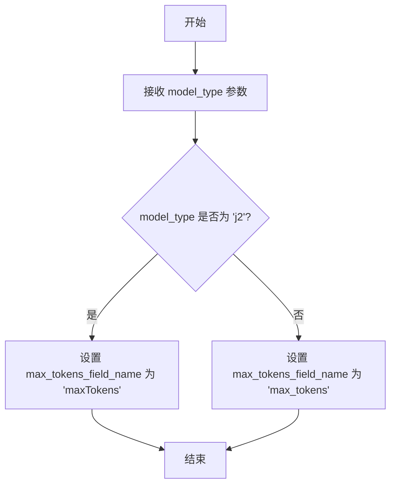

#### 带注释源码

```python
def __init__(self, model_type: Literal["j2", "jamba"]) -> None:
    # 设置实例的模型类型属性，用于区分 j2 和 jamba 模型
    self.model_type = model_type
    # 根据模型类型设置对应的最大令牌数字段名
    # j2 模型使用 'maxTokens'，jamba 模型使用 'max_tokens'
    if self.model_type == "j2":
        self.max_tokens_field_name = "maxTokens"
    else:
        self.max_tokens_field_name = "max_tokens"
```

### `Ai21Provider.get_request_body`

该方法根据 `Ai21Provider` 的模型类型（`j2` 或 `jamba`）构建并返回一个符合 AI21 Labs API 要求的 JSON 请求体字符串。对于 `j2` 模型，它调用父类方法；对于 `jamba` 模型，它直接构建一个包含消息列表和生成参数的 JSON 对象。

参数：

- `messages`：`list[dict]`，一个字典列表，每个字典代表一条消息，通常包含 `role` 和 `content` 键。
- `generate_kwargs`：`dict`，一个包含模型特定生成参数（如 `temperature`、`max_tokens` 等）的字典。
- `*args`：`tuple`，可变位置参数，在此方法中未使用。
- `**kwargs`：`dict`，可变关键字参数，在此方法中未使用。

返回值：`str`，一个 JSON 格式的字符串，作为请求体发送给 AI21 Labs 的 Bedrock 模型。

#### 流程图

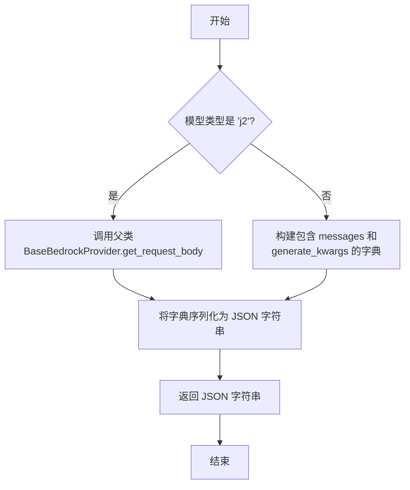

#### 带注释源码

```python
def get_request_body(self, messages: list[dict], generate_kwargs, *args, **kwargs) -> str:
    # 根据模型类型（j2 或 jamba）选择不同的请求体构建策略
    if self.model_type == "j2":
        # 对于 j2 模型，直接使用父类 BaseBedrockProvider 的实现
        body = super().get_request_body(messages, generate_kwargs, *args, **kwargs)
    else:
        # 对于 jamba 模型，构建一个符合其 API 的字典
        # 该字典包含消息列表和所有生成参数
        body = json.dumps(
            {
                "messages": messages,
                **generate_kwargs,
            }
        )
    # 返回序列化后的 JSON 字符串
    return body
```

### `Ai21Provider.get_choice_text_from_stream`

该方法用于处理来自 AWS Bedrock AI21 模型（包括 J2 和 Jamba 系列）的流式响应事件。它从事件中解析出 JSON 数据，并提取出模型生成的增量文本内容（`content`），同时返回一个标志位指示该内容是否属于推理过程（对于 AI21 模型，此标志始终为 `False`）。

参数：

- `event`：`dict`，包含来自 AWS Bedrock 流式响应的原始事件数据。通常，其 `chunk` 字段下的 `bytes` 键包含经过 Base64 编码的 JSON 响应体。

返回值：`Union[bool, str]`，实际上返回一个元组 `(bool, str)`。第一个布尔值表示提取的文本是否属于模型的“推理”内容（对于 AI21 模型，此值恒为 `False`）。第二个字符串是本次事件中模型生成的实际文本增量内容。

#### 流程图

```mermaid
flowchart TD
    A[开始: 接收 event 参数] --> B[从 event['chunk']['bytes'] 加载 JSON 数据]
    B --> C{解析 rsp_dict}
    C --> D[从 rsp_dict['choices'][0]['delta']['content'] 提取内容]
    D --> E[返回元组 (False, 提取的文本)]
    E --> F[结束]
```

#### 带注释源码

```python
def get_choice_text_from_stream(self, event) -> Union[bool, str]:
    # 1. 从流式响应事件中解析 JSON 数据。
    #    event 是 AWS Bedrock 流式 API 返回的事件对象，
    #    其 `chunk['bytes']` 字段包含 Base64 编码的响应体，此处直接加载为 JSON。
    rsp_dict = json.loads(event["chunk"]["bytes"])

    # 2. 从解析后的字典中提取文本增量。
    #    AI21 的流式响应格式与 OpenAI 的 Chat Completions 格式类似。
    #    它通过 `choices[0].delta.content` 字段传递本次事件生成的文本片段。
    #    使用 `.get` 方法进行安全访问，避免键不存在时抛出异常。
    completions = rsp_dict.get("choices", [{}])[0].get("delta", {}).get("content", "")

    # 3. 返回结果。
    #    第一个返回值 `False` 表示此内容不属于“推理”过程（AI21 模型不支持此特性）。
    #    第二个返回值是提取到的文本内容，可能为空字符串。
    return False, completions
```

### `Ai21Provider._get_completion_from_dict`

该方法用于从AI21模型（包括J2和Jamba系列）的API响应字典中提取生成的文本内容。它根据`model_type`属性判断当前使用的是J2模型还是Jamba模型，并从响应字典的不同路径中提取文本。

参数：

- `rsp_dict`：`dict`，AI21模型API的原始响应字典。

返回值：`str`，从响应字典中提取出的生成的文本内容。

#### 流程图

```mermaid
graph TD
    A[开始] --> B{判断 model_type};
    B -- j2 --> C[从 rsp_dict['completions'][0]['data']['text'] 提取];
    B -- jamba --> D[从 rsp_dict['choices'][0]['message']['content'] 提取];
    C --> E[返回文本];
    D --> E;
    E --> F[结束];
```

#### 带注释源码

```python
def _get_completion_from_dict(self, rsp_dict: dict) -> str:
    # 根据实例的 model_type 属性，判断是处理 J2 模型还是 Jamba 模型的响应
    if self.model_type == "j2":
        # J2 模型的响应结构：从 'completions' 列表的第一个元素的 'data' 字典中获取 'text'
        # 参考：https://docs.ai21.com/reference/j2-complete-ref
        return rsp_dict["completions"][0]["data"]["text"]
    else:
        # Jamba 模型的响应结构：从 'choices' 列表的第一个元素的 'message' 字典中获取 'content'
        # 参考：https://docs.ai21.com/reference/jamba-instruct-api
        return rsp_dict["choices"][0]["message"]["content"]
```

### `AmazonProvider.get_request_body`

该方法用于构建 Amazon Titan 模型 API 请求的 JSON 请求体。它将传入的对话消息列表转换为模型所需的输入格式，并与生成配置参数合并，最终序列化为 JSON 字符串。

参数：

- `messages`：`list[dict]`，包含对话历史的消息列表，每个消息是一个包含 `role` 和 `content` 键的字典。
- `generate_kwargs`：`dict`，包含模型生成文本时的配置参数，如 `maxTokenCount`、`temperature` 等。
- `*args`：可变位置参数，在此方法中未使用。
- `**kwargs`：可变关键字参数，在此方法中未使用。

返回值：`str`，序列化后的 JSON 字符串，作为请求体发送给 Amazon Bedrock API。

#### 流程图

```mermaid
flowchart TD
    A[开始] --> B[调用 messages_to_prompt<br>将消息列表转换为提示文本]
    B --> C[构建请求体字典<br>包含 inputText 和 textGenerationConfig]
    C --> D[使用 json.dumps 将字典序列化为 JSON 字符串]
    D --> E[返回 JSON 字符串]
    E --> F[结束]
```

#### 带注释源码

```python
def get_request_body(self, messages: list[dict], generate_kwargs, *args, **kwargs):
    # 调用父类或自身实现的 messages_to_prompt 方法，将消息列表转换为模型所需的输入文本格式。
    # 对于 AmazonProvider，此方法将消息列表转换为一个连续的提示字符串。
    # 然后，构建一个符合 Amazon Titan 模型 API 要求的字典。
    # 字典包含两个主要部分：
    # 1. "inputText": 转换后的提示文本。
    # 2. "textGenerationConfig": 用户传入的生成配置参数（如 maxTokenCount, temperature 等）。
    # 最后，使用 json.dumps 将字典序列化为 JSON 字符串，作为 HTTP 请求的请求体。
    body = json.dumps({"inputText": self.messages_to_prompt(messages), "textGenerationConfig": generate_kwargs})
    return body
```

### `AmazonProvider._get_completion_from_dict`

该方法用于从Amazon Bedrock Titan模型的标准响应字典中提取生成的文本内容。

参数：

- `rsp_dict`：`dict`，Amazon Bedrock Titan模型调用后返回的响应字典。

返回值：`str`，从响应字典中提取出的生成的文本内容。

#### 流程图

```mermaid
graph TD
    A[开始] --> B[接收响应字典 rsp_dict]
    B --> C{字典结构是否包含 results[0].outputText?}
    C -- 是 --> D[提取 rsp_dict['results'][0]['outputText']]
    C -- 否 --> E[抛出 KeyError 或返回空字符串]
    D --> F[返回提取的文本字符串]
    E --> F
    F --> G[结束]
```

#### 带注释源码

```python
def _get_completion_from_dict(self, rsp_dict: dict) -> str:
    # 从Amazon Titan模型的响应字典中提取生成的文本。
    # 标准响应格式为：{"results": [{"outputText": "生成的文本内容"}]}
    return rsp_dict["results"][0]["outputText"]
```

### `AmazonProvider.get_choice_text_from_stream`

该方法用于处理Amazon Bedrock Titan模型流式响应事件，从事件数据中提取生成的文本内容。

参数：

- `event`：`dict`，包含流式响应事件数据的字典，通常来自AWS Bedrock的流式调用。

返回值：`Union[bool, str]`，返回一个元组，第一个元素为布尔值（表示是否为推理内容，Amazon Titan模型固定返回`False`），第二个元素为字符串（提取出的文本内容，若无内容则为空字符串）。

#### 流程图

```mermaid
flowchart TD
    A[开始] --> B[从event中获取chunk字节数据]
    B --> C[将字节数据解析为JSON字典]
    C --> D[从字典中获取outputText字段值]
    D --> E[返回元组 False, outputText]
    E --> F[结束]
```

#### 带注释源码

```python
def get_choice_text_from_stream(self, event) -> Union[bool, str]:
    # 1. 从传入的流式响应事件字典中，获取chunk的字节数据并解析为JSON字典
    rsp_dict = json.loads(event["chunk"]["bytes"])
    # 2. 从解析后的响应字典中，提取outputText字段的值作为生成的文本内容
    completions = rsp_dict["outputText"]
    # 3. 返回一个元组。第一个元素为False，表示这不是推理内容（Amazon Titan模型不支持推理模式）。
    #    第二个元素为提取到的文本内容。
    return False, completions
```

## 关键组件


### MistralProvider

一个用于调用AWS Bedrock平台上Mistral系列模型的提供者类，负责将对话消息转换为Mistral模型所需的提示格式，并从模型响应中提取生成的文本。

### AnthropicProvider

一个用于调用AWS Bedrock平台上Anthropic Claude系列模型的提供者类，特别支持Claude的推理功能，负责处理系统消息与用户消息的分离、构建符合Anthropic API规范的请求体，并从流式或非流式响应中提取推理内容和最终回复。

### CohereProvider

一个用于调用AWS Bedrock平台上Cohere系列模型的提供者类，根据模型名称（如command-r）适配不同的消息格式和请求体结构，以支持Cohere的命令模型和聊天模型。

### MetaProvider

一个用于调用AWS Bedrock平台上Meta Llama系列模型的提供者类，根据指定的Llama版本（如llama2或llama3）选择对应的提示转换函数，并从模型响应中提取生成的文本。

### Ai21Provider

一个用于调用AWS Bedrock平台上AI21 Labs系列模型的提供者类，根据模型类型（如j2或jamba）适配不同的请求体结构和响应解析逻辑，以支持Jurassic-2和Jamba模型。

### AmazonProvider

一个用于调用AWS Bedrock平台上Amazon Titan系列模型的提供者类，负责将对话消息转换为Titan模型所需的输入文本格式，并从模型响应中提取生成的文本。

### BaseBedrockProvider (隐式依赖)

作为所有具体提供者类的基类，定义了与AWS Bedrock服务交互的通用接口和基础逻辑，包括身份验证、请求发送和错误处理等。

### 提供者工厂函数 (`get_provider`)

一个工厂函数，根据传入的模型ID字符串，解析出对应的提供者类型和模型名称，并实例化相应的提供者类。它处理了不同提供者的特殊初始化逻辑（如区分Llama版本、AI21模型类型、Cohere模型系列等）。


## 问题及建议


### 已知问题

-   **`get_provider` 函数逻辑不健壮**：该函数通过分割模型ID字符串来推断提供商和模型名称。对于格式不标准或包含额外点的模型ID（例如 `us.meta.llama3-70b-instruct`），其解析逻辑（`elif len(arr) == 3:`）可能出错，导致无法正确识别提供商。此外，`provider` 变量可能被错误赋值（例如，`arr[1]` 可能不是提供商名称）。
-   **`AnthropicProvider` 的 `_split_system_user_messages` 方法存在潜在错误**：该方法将系统消息列表传递给 `self.messages_to_prompt` 方法，但 `BaseBedrockProvider` 的 `messages_to_prompt` 方法默认实现可能未针对纯系统消息列表进行优化或测试，可能导致格式错误。
-   **`CohereProvider` 的 `messages_to_prompt` 方法逻辑不一致**：对于非 command-r 模型，该方法将消息列表转换为一个纯文本字符串。然而，在 `get_request_body` 中，对于 command-r 模型，`prompt` 变量是一个消息字典列表，而非字符串。这种不一致性可能导致混淆，且 `get_request_body` 中 `prompt[:-1]` 的切片操作在 `prompt` 为空或单条消息时可能引发错误。
-   **`AnthropicProvider` 的 `get_choice_text_from_stream` 方法返回值类型不一致**：该方法在流式响应处理中返回 `Union[bool, str]`，但在处理 `message_stop` 类型时，返回的是 `(False, "")`，这与方法签名中返回单个 `Union[bool, str]` 的约定不符，实际上是返回了一个元组。这可能导致调用方类型检查错误或运行时异常。
-   **`Ai21Provider` 的 `get_choice_text_from_stream` 方法健壮性不足**：该方法通过 `rsp_dict.get("choices", [{}])[0].get("delta", {}).get("content", "")` 链式获取数据，若 `choices` 列表为空，访问 `[0]` 将引发 `IndexError`。
-   **`get_provider` 函数对 `AnthropicProvider` 的初始化参数传递错误**：在函数末尾，对于除 `meta`、`ai21`、`cohere` 之外的所有提供商，都尝试传递 `reasoning` 和 `reasoning_max_token` 参数。然而，并非所有提供商（如 `MistralProvider`, `AmazonProvider`）的构造函数都接受这些参数，这会导致 `TypeError`。

### 优化建议

-   **增强 `get_provider` 函数的鲁棒性**：建议使用正则表达式或更明确的映射规则来解析模型ID，而不是简单地按点分割。可以考虑维护一个从已知模型ID前缀到提供商和模型类型的映射字典。
-   **统一并明确消息转换逻辑**：审查并重构 `messages_to_prompt` 方法在各个子类中的实现，确保其输入输出约定清晰一致。考虑在基类 `BaseBedrockProvider` 中定义更明确的接口或抽象方法。
-   **修复 `AnthropicProvider._split_system_user_messages` 方法**：应确保传递给 `self.messages_to_prompt` 的消息格式符合预期，或者为系统消息单独设计一个转换方法。
-   **修正 `AnthropicProvider.get_choice_text_from_stream` 方法的返回值**：将方法签名改为返回 `Tuple[bool, str]` 以匹配实际返回类型，并更新所有调用点。
-   **增强 `Ai21Provider.get_choice_text_from_stream` 的错误处理**：在访问列表索引前，应检查列表是否为空，例如：`choices = rsp_dict.get("choices", []); completions = choices[0].get("delta", {}).get("content", "") if choices else ""`。
-   **修正 `get_provider` 中的初始化逻辑**：仅为支持 `reasoning` 功能的提供商（目前看来只有 `AnthropicProvider`）传递 `reasoning` 和 `reasoning_max_token` 参数。可以为每个提供商类定义其所需的初始化参数，并在 `get_provider` 中根据提供商类型动态构造参数。
-   **引入配置类或工厂模式**：考虑引入一个配置类来封装不同提供商的初始化参数，或者使用更高级的工厂模式来管理不同提供商实例的创建，以降低 `get_provider` 函数的复杂度并提高可维护性。
-   **增加单元测试**：为每个提供商类以及 `get_provider` 工厂函数编写全面的单元测试，覆盖各种模型ID格式、消息格式和流式/非流式响应场景，以确保代码的健壮性。


## 其它


### 设计目标与约束

本模块的核心设计目标是提供一个统一、可扩展的接口，用于适配 AWS Bedrock 服务中不同厂商（如 Anthropic, Meta, Mistral 等）的大语言模型。它通过抽象出公共的请求/响应处理逻辑到基类 `BaseBedrockProvider`，并允许各个子类通过重写特定方法（如 `messages_to_prompt`, `get_request_body`, `_get_completion_from_dict`）来处理不同模型 API 的协议差异。主要约束包括：必须遵循 AWS Bedrock 的 SDK 调用规范；需要处理不同模型在消息格式、请求体结构、响应解析和流式输出上的多样性；代码需保持清晰的结构以方便未来集成新的模型提供商。

### 错误处理与异常设计

模块中的错误处理主要依赖于外部调用（如 `BaseBedrockProvider` 基类或 AWS SDK）抛出的异常。在 `get_provider` 函数中，当传入的 `model_id` 无法映射到已知的提供商时，会主动抛出 `KeyError` 异常。对于各个子类方法中的 JSON 解析（`json.loads`）或字典键访问（如 `rsp_dict["outputs"][0]["text"]`），如果响应格式不符合预期，将抛出标准的 `KeyError`, `IndexError` 或 `json.JSONDecodeError` 异常，这些异常会向上传播给调用者。模块本身没有定义自定义异常类型，错误处理策略是“快速失败”，让调用方根据具体业务场景决定如何捕获和处理。

### 数据流与状态机

数据流始于 `get_provider` 函数，它根据输入的 `model_id` 和参数实例化对应的提供商类（如 `AnthropicProvider`）。用户通过提供商实例调用方法（通常继承自基类）来发起请求。核心数据转换流程为：1) 输入的消息列表（`messages`）通过 `messages_to_prompt` 方法转换为模型特定的提示格式；2) `get_request_body` 方法将提示和生成参数组装成符合模型 API 规范的 JSON 请求体；3) 请求通过基类逻辑发送给 Bedrock；4) 响应（同步或流式）通过 `_get_completion_from_dict` 或 `get_choice_text_from_stream` 方法被解析为统一的文本或结构化数据。模块内部没有复杂的状态机，每个提供商实例是无状态的，处理过程是纯函数式的转换。

### 外部依赖与接口契约

1.  **直接依赖**：
    *   `metagpt.provider.bedrock.base_provider.BaseBedrockProvider`：所有提供商类的基类，定义了与 AWS Bedrock 交互的核心接口和默认实现。子类通过继承并重写特定方法来适配不同模型。
    *   `metagpt.provider.bedrock.utils.messages_to_prompt_llama2`, `messages_to_prompt_llama3`：外部工具函数，用于将通用消息格式转换为 Llama 2/3 模型所需的特定提示格式。
    *   `json`：用于请求体的序列化和响应体的反序列化。
    *   `typing`：用于类型注解。

2.  **接口契约（对调用方）**：
    *   `get_provider(model_id: str, reasoning: bool = False, reasoning_max_token: int = 4000) -> BaseBedrockProvider`：工厂函数，返回一个配置好的提供商实例。调用方需保证 `model_id` 符合 Bedrock 的模型命名规范。
    *   所有提供商实例都继承自 `BaseBedrockProvider`，因此对外暴露的接口（如 `complete`, `stream_complete` 等方法，虽然在代码片段中未直接展示，但应存在于基类中）是统一的。调用方无需关心底层是哪个模型，只需通过统一的方法进行交互。

3.  **接口契约（对子类实现者）**：
    *   子类必须实现 `_get_completion_from_dict(self, rsp_dict: dict)` 方法，用于从同步调用的响应字典中提取文本补全内容。
    *   如果模型支持流式输出，子类应实现 `get_choice_text_from_stream(self, event)` 方法，用于从流式事件中增量提取文本。
    *   如果模型的请求体结构与基类默认实现不同，子类需要重写 `get_request_body(self, messages, generate_kwargs, *args, **kwargs)` 方法。
    *   如果模型的消息到提示的转换逻辑特殊，子类需要重写 `messages_to_prompt(self, messages)` 方法。

    