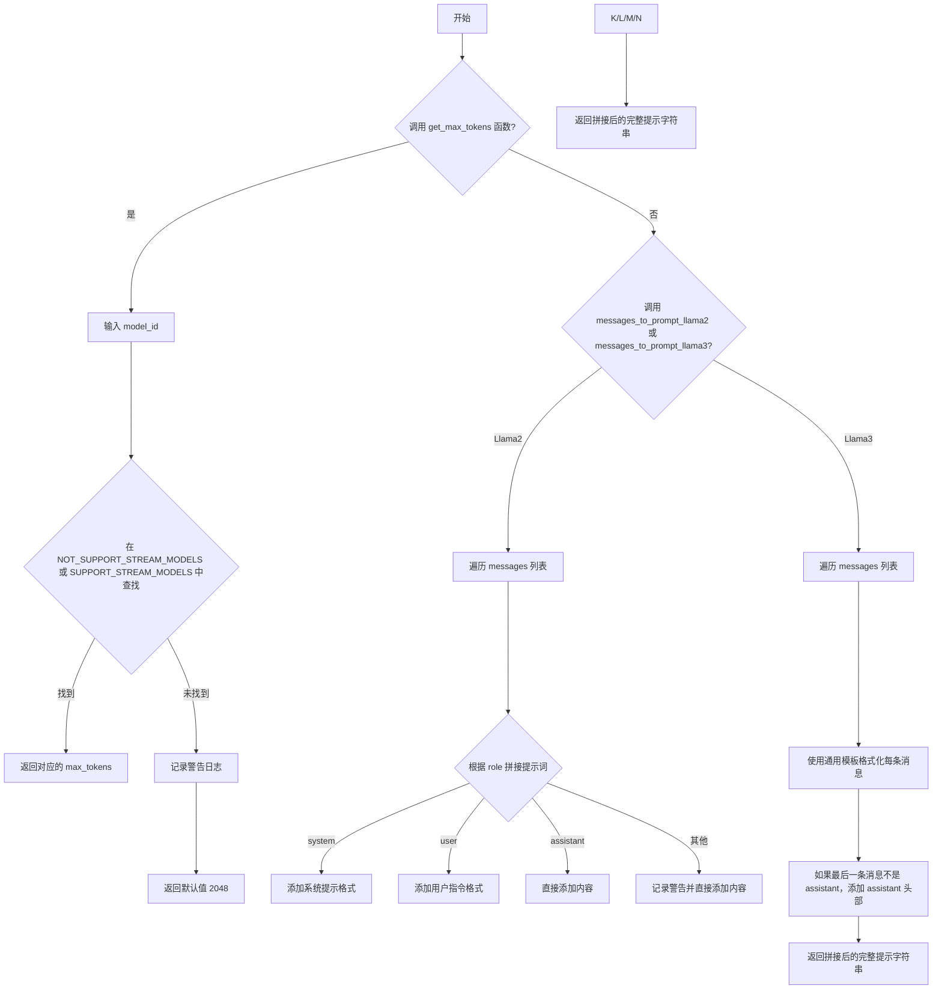
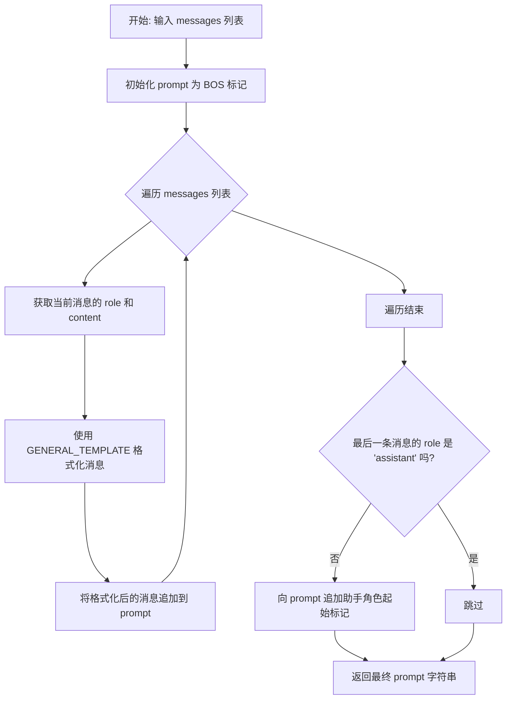
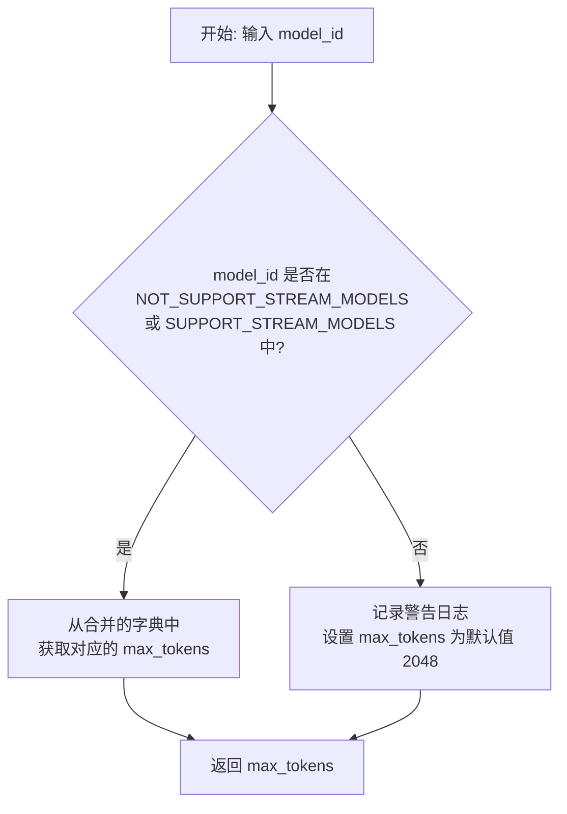

# `.\MetaGPT\metagpt\provider\bedrock\utils.py` 详细设计文档

该代码文件是一个用于管理AWS Bedrock平台上不同大语言模型配置的工具模块，主要功能包括：定义模型ID与最大token数的映射关系（区分支持流式输出和不支持流式输出的模型），以及提供将通用消息列表转换为特定模型（如Llama 2、Llama 3）所需输入提示格式的辅助函数。

## 整体流程



## 类结构

```
该文件不包含类定义，主要由全局变量和函数构成。
├── 全局变量
│   ├── NOT_SUPPORT_STREAM_MODELS (字典)
│   └── SUPPORT_STREAM_MODELS (字典)
└── 全局函数
    ├── messages_to_prompt_llama2
    ├── messages_to_prompt_llama3
    └── get_max_tokens
```

## 全局变量及字段


### `NOT_SUPPORT_STREAM_MODELS`
    
一个字典，用于存储不支持流式输出的AWS Bedrock模型ID及其对应的最大token数量。

类型：`dict[str, int]`
    


### `SUPPORT_STREAM_MODELS`
    
一个字典，用于存储支持流式输出的AWS Bedrock模型ID及其对应的最大token数量。

类型：`dict[str, int]`
    


    

## 全局函数及方法

### `messages_to_prompt_llama2`

该函数用于将一组对话消息（通常包含系统指令、用户查询和助手回复）格式化为符合 Meta Llama 2 模型特定聊天模板的提示字符串。它遵循 Llama 2 的指令格式，使用特殊的标记（如 `[INST]`、`<<SYS>>`）来区分不同角色的消息内容。

参数：

- `messages`：`list[dict]`，一个字典列表，每个字典代表一条消息，通常包含 `role`（如 `"system"`, `"user"`, `"assistant"`）和 `content`（消息文本）字段。

返回值：`str`，一个格式化后的、符合 Llama 2 聊天模板的完整提示字符串。

#### 流程图

```mermaid
flowchart TD
    A[开始: 输入messages列表] --> B[初始化prompt为'<s>']
    B --> C{遍历messages列表}
    C --> D[获取当前消息的role和content]
    D --> E{判断role类型}
    E -- role == 'system' --> F[prompt += `<<SYS>>\\n{content}\\n<</SYS>>\\n\\n`]
    E -- role == 'user' --> G[prompt += `[INST] {content} [/INST]`]
    E -- role == 'assistant' --> H[prompt += `{content}`]
    E -- 其他 --> I[记录警告，prompt += `{content}`]
    F --> J
    G --> J
    H --> J
    I --> J{是否还有下一条消息?}
    J -- 是 --> C
    J -- 否 --> K[返回最终的prompt字符串]
    K --> L[结束]
```

#### 带注释源码

```python
def messages_to_prompt_llama2(messages: list[dict]) -> str:
    # 定义Llama 2聊天模板使用的特殊标记
    # BOS: Beginning Of Sequence，序列开始标记
    BOS = ("<s>",)
    # B_INST/E_INST: 用户指令的开始和结束标记
    B_INST, E_INST = "[INST]", "[/INST]"
    # B_SYS/E_SYS: 系统指令的开始和结束标记
    B_SYS, E_SYS = "<<SYS>>\n", "\n<</SYS>>\n\n"

    # 初始化提示字符串，以BOS标记开头
    prompt = f"{BOS}"
    # 遍历输入的消息列表
    for message in messages:
        # 获取当前消息的角色和内容，使用.get方法提供默认值以防键不存在
        role = message.get("role", "")
        content = message.get("content", "")
        # 根据角色类型，将消息内容用对应的模板标记包裹并追加到prompt中
        if role == "system":
            # 系统消息：用<<SYS>>和<</SYS>>包裹，并添加换行符以保证格式
            prompt += f"{B_SYS} {content} {E_SYS}"
        elif role == "user":
            # 用户消息：用[INST]和[/INST]包裹
            prompt += f"{B_INST} {content} {E_INST}"
        elif role == "assistant":
            # 助手消息：直接追加内容，不添加额外标记
            prompt += f"{content}"
        else:
            # 如果遇到未知的角色，记录警告日志，但仍将内容追加到prompt中
            logger.warning(f"Unknown role name {role} when formatting messages")
            prompt += f"{content}"
    # 返回格式化完成的提示字符串
    return prompt
```

### `messages_to_prompt_llama3`

该函数用于将对话消息列表（通常包含系统、用户和助手角色）格式化为符合 Meta Llama 3 模型输入要求的提示字符串。它遵循 Llama 3 特定的特殊标记格式，如 `<begin_of_text/>`、`<start_header_id/>` 和 `<eot_id/>`，以结构化地组织对话历史。

参数：

- `messages`：`list[dict]`，一个字典列表，每个字典代表一条消息，通常包含 `role`（如 `"system"`， `"user"`， `"assistant"`）和 `content`（消息文本内容）字段。

返回值：`str`，一个格式化后的、符合 Llama 3 模型输入规范的完整提示字符串。

#### 流程图



#### 带注释源码

```python
def messages_to_prompt_llama3(messages: list[dict]) -> str:
    # 定义 Llama 3 使用的特殊标记
    # BOS: 表示文本开始的标记
    BOS = "<|begin_of_text|>"
    # GENERAL_TEMPLATE: 用于格式化每条消息的模板。
    # 它将角色和内容包装在特定的头部标记和结束标记中。
    GENERAL_TEMPLATE = "<|start_header_id|>{role}<|end_header_id|>\n\n{content}<|eot_id|>"

    # 初始化提示字符串，以 BOS 标记开头
    prompt = f"{BOS}"
    # 遍历输入的消息列表
    for message in messages:
        # 从消息字典中获取角色和内容，如果键不存在则返回空字符串
        role = message.get("role", "")
        content = message.get("content", "")
        # 使用模板将当前消息格式化为 Llama 3 要求的格式，并追加到提示字符串中
        prompt += GENERAL_TEMPLATE.format(role=role, content=content)

    # 在处理完所有消息后，检查最后一条消息的角色。
    # 如果最后一条消息不是来自助手（assistant），则需要添加一个助手角色的起始标记，
    # 以引导模型开始生成助手（即模型）的回复。
    if role != "assistant":
        prompt += "<|start_header_id|>assistant<|end_header_id|>"

    # 返回最终构建好的提示字符串
    return prompt
```

### `get_max_tokens`

该函数根据给定的模型ID，从预定义的模型字典中查找并返回该模型支持的最大token数量。如果模型ID未在字典中找到，则记录警告并返回默认值2048。

参数：
- `model_id`：`str`，需要查询最大token数的模型标识符。

返回值：`int`，查询到的模型最大token数，若未找到则返回默认值2048。

#### 流程图



#### 带注释源码

```python
def get_max_tokens(model_id: str) -> int:
    try:
        # 尝试从两个模型字典的并集中查找给定的 model_id
        # 使用字典合并操作符 `|` 将两个字典合并为一个
        max_tokens = (NOT_SUPPORT_STREAM_MODELS | SUPPORT_STREAM_MODELS)[model_id]
    except KeyError:
        # 如果 model_id 不在任何字典中，捕获 KeyError 异常
        # 记录警告日志，提示未找到该模型，并将最大token数设置为默认值 2048
        logger.warning(f"Couldn't find model:{model_id} , max tokens has been set to 2048")
        max_tokens = 2048
    # 返回找到的或默认的最大token数
    return max_tokens
```

## 关键组件


### 模型配置字典

包含两个字典 `NOT_SUPPORT_STREAM_MODELS` 和 `SUPPORT_STREAM_MODELS`，用于存储不同 AWS Bedrock 模型 ID 及其对应的最大 token 数，作为模型能力配置的集中管理。

### 提示词模板函数

包含 `messages_to_prompt_llama2` 和 `messages_to_prompt_llama3` 两个函数，用于将标准化的对话消息列表（`list[dict]`）转换为特定模型（Llama 2 和 Llama 3）所需的输入提示词字符串格式。

### 模型能力查询函数

包含 `get_max_tokens` 函数，通过合并两个模型配置字典，根据传入的模型 ID 查询并返回其最大 token 数，若未找到则返回默认值并记录警告。


## 问题及建议


### 已知问题

-   **硬编码的模型配置**：模型ID与最大令牌数的映射关系被硬编码在两个字典（`NOT_SUPPORT_STREAM_MODELS` 和 `SUPPORT_STREAM_MODELS`）中。当AWS Bedrock新增、更新或淘汰模型时，需要手动修改代码，维护成本高且容易出错。
-   **模型分类逻辑固化**：代码根据是否支持流式传输将模型分为两类，但此分类仅用于组织数据，并未在 `get_max_tokens` 函数中实际使用。这种分类方式可能不符合未来的功能需求（例如，需要根据是否支持流式传输来调整调用逻辑）。
-   **缺乏版本管理**：代码中注释了已淘汰的模型（如Llama 2系列），但字典中仍保留着部分已注释的条目。这种处理方式不够清晰，容易造成混淆，且未建立明确的模型生命周期（如上线、淘汰）管理机制。
-   **提示词模板函数耦合性高**：`messages_to_prompt_llama2` 和 `messages_to_prompt_llama3` 函数直接硬编码了特定模型的提示词格式。每支持一个新模型系列（如新的Claude版本、新的开源模型），就需要添加一个新的类似函数，导致代码膨胀且难以维护。
-   **默认值可能不适用**：`get_max_tokens` 函数在找不到模型ID时，使用2048作为默认最大令牌数。对于某些上下文窗口极大（如Claude 3.7 Sonnet的128K）或极小的模型，这个默认值可能不准确，导致潜在的性能问题或调用失败。
-   **日志级别可能不当**：在 `get_max_tokens` 函数中，当找不到模型ID时使用 `logger.warning`。对于配置错误或使用了未支持的新模型，这更可能是一个需要关注的“错误”而非“警告”，当前的日志级别可能不足以引起运维人员注意。

### 优化建议

-   **外部化模型配置**：将模型ID、最大令牌数、是否支持流式传输、提示词模板名称等配置信息移至外部配置文件（如JSON、YAML）或数据库中。这样可以在不修改代码的情况下动态更新模型信息。
-   **重构模型信息管理**：创建一个 `ModelRegistry` 或类似的类来统一管理所有模型元数据。该类可以从外部配置源加载数据，并提供根据模型ID查询各种属性（如 `max_tokens`, `supports_streaming`, `prompt_template`）的方法。
-   **实现可插拔的提示词模板引擎**：定义一个提示词模板的基类或接口，并为每种模型系列实现具体的模板类。通过模型配置中的模板名称来动态加载和使用对应的模板，实现关注点分离，提高扩展性。
-   **增强错误处理与默认策略**：在 `get_max_tokens` 函数中，除了记录日志，应考虑是否抛出更具业务含义的异常（如 `ModelNotSupportedError`），以便上游调用者能明确处理。或者，可以实现一个回退策略，例如从模型服务商API实时查询默认值（如果可行）。
-   **建立模型生命周期管理**：在模型配置中明确标记模型的“状态”（如 `active`, `deprecated`, `legacy`），并在代码中根据状态决定是否使用或给出更明确的警告/错误信息。
-   **代码清理**：移除 `NOT_SUPPORT_STREAM_MODELS` 和 `SUPPORT_STREAM_MODELS` 字典中已注释的无效条目，保持代码库的整洁。所有配置应转移到外部或新的管理类中。


## 其它


### 设计目标与约束

本模块的核心设计目标是提供一个轻量级的、与特定云服务提供商（AWS Bedrock）解耦的模型配置与提示词格式化工具。它旨在通过静态字典映射来管理不同LLM模型的上下文长度（`max_tokens`）上限，并提供针对特定模型系列（如Llama 2/3）的提示词模板转换函数。主要约束包括：1) 模型列表和配置需要手动维护，与上游服务商（AWS）的模型发布和更新保持同步存在延迟风险；2) 提示词格式化功能仅支持有限的模型系列，不具备通用性；3) 设计为纯函数式、无状态的工具模块，不处理网络请求或认证等复杂逻辑。

### 错误处理与异常设计

模块采用防御性编程和日志告警而非抛出异常的方式进行错误处理。具体体现在：
1.  **键值缺失处理**：在`get_max_tokens`函数中，当传入的`model_id`不在预定义的字典中时，通过捕获`KeyError`异常，记录警告日志，并返回一个安全的默认值（2048），确保函数不会因未知模型而中断调用流程。
2.  **未知角色处理**：在`messages_to_prompt_llama2`函数中，当遇到无法识别的消息`role`时，记录警告日志，并采取保守策略——直接将消息内容附加到提示词中，而不是中断格式化过程。
3.  **静默处理**：整体设计倾向于“尽力而为”，在遇到非致命错误时，通过日志记录问题并返回一个可能可用的结果，将是否中断流程的决定权交给调用者。

### 数据流与状态机

本模块无内部状态，所有函数均为纯函数，数据流清晰：
1.  **输入**：外部调用者提供`model_id`（字符串）或`messages`（字典列表）。
2.  **处理**：
    *   `get_max_tokens`: 根据`model_id`查询两个全局常量字典（`NOT_SUPPORT_STREAM_MODELS`和`SUPPORT_STREAM_MODELS`的并集），返回对应的整数。
    *   `messages_to_prompt_llama2/3`: 遍历`messages`列表，根据每条消息的`role`和`content`，按照预定义的模板规则拼接成最终的提示词字符串。
3.  **输出**：返回整数（`max_tokens`）或字符串（格式化后的提示词）。整个流程是线性的，无分支循环（除了遍历），无状态转换。

### 外部依赖与接口契约

1.  **外部依赖**：
    *   `metagpt.logs.logger`: 用于记录警告信息。这是模块唯一的直接外部依赖，用于实现其非中断式的错误处理策略。
2.  **接口契约（函数签名与行为）**：
    *   `get_max_tokens(model_id: str) -> int`: 契约保证对于任何输入的`model_id`字符串，都会返回一个整数。对于已知模型，返回其预定义的`max_tokens`；对于未知模型，返回默认值2048并记录警告。
    *   `messages_to_prompt_llama2(messages: List[Dict]) -> str`: 契约保证输入一个符合常见聊天格式（包含`role`和`content`键）的消息字典列表，输出一个符合Llama 2模型要求的提示词字符串。对未知`role`的处理如错误处理部分所述。
    *   `messages_to_prompt_llama3(messages: List[Dict]) -> str`: 契约类似，但输出格式符合Llama 3模型要求。它假设输入消息列表的最后一个角色如果不是`assistant`，则会自动补上助理的头部标记。
3.  **数据契约**：
    *   全局字典`NOT_SUPPORT_STREAM_MODELS`和`SUPPORT_STREAM_MODELS`是模块的核心配置数据，其键为AWS Bedrock模型ID字符串，值为该模型支持的上下文长度（`max_tokens`）整数。调用者应信赖这些数据的准确性。

    