# `.\MetaGPT\metagpt\provider\bedrock_api.py` 详细设计文档

该文件是MetaGPT框架中用于集成AWS Bedrock服务的LLM（大语言模型）提供者实现。它继承自基础LLM类，封装了与AWS Bedrock API的交互逻辑，包括同步/异步调用、流式响应处理、成本管理以及针对不同模型提供商（如Anthropic、Meta、AI21等）的适配。

## 整体流程

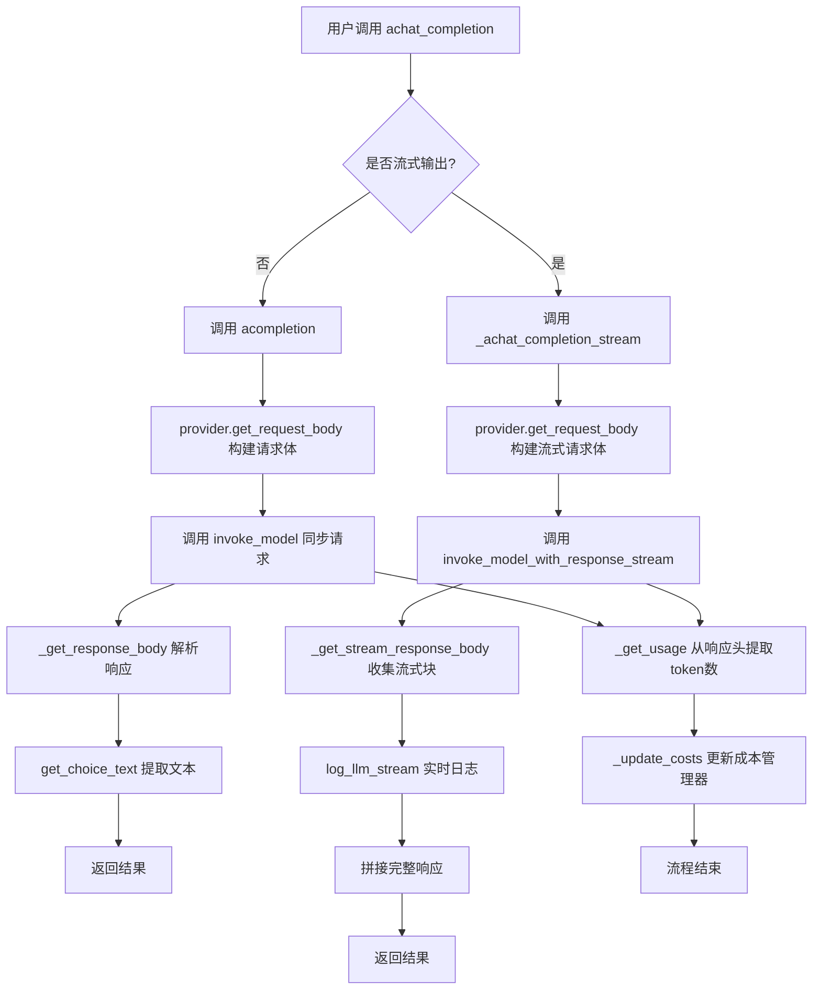

## 类结构

```
BaseLLM (抽象基类)
└── BedrockLLM (AWS Bedrock 提供者)
    ├── __init__
    ├── __init_client
    ├── client (property)
    ├── provider (property)
    ├── list_models
    ├── invoke_model
    ├── invoke_model_with_response_stream
    ├── _const_kwargs (property)
    ├── get_choice_text
    ├── acompletion
    ├── _achat_completion
    ├── _achat_completion_stream
    ├── _get_response_body
    ├── _get_stream_response_body
    └── _get_usage
```

## 全局变量及字段


### `NOT_SUPPORT_STREAM_MODELS`
    
存储不支持流式输出的模型名称列表，用于在初始化时检查并发出警告。

类型：`List[str]`
    


### `BEDROCK_TOKEN_COSTS`
    
定义不同模型对应的token成本，用于CostManager进行费用计算。

类型：`Dict[str, float]`
    


### `USE_CONFIG_TIMEOUT`
    
配置中定义的默认超时时间，用于异步聊天完成方法的超时控制。

类型：`int`
    


### `BedrockLLM.config`
    
LLM配置对象，包含模型、密钥、区域、温度、最大token数等配置信息。

类型：`LLMConfig`
    


### `BedrockLLM.model`
    
当前使用的Bedrock模型名称，从config中提取。

类型：`str`
    


### `BedrockLLM.__client`
    
AWS Bedrock运行时客户端，用于调用模型API，私有属性通过property暴露。

类型：`boto3.client`
    


### `BedrockLLM.__provider`
    
模型特定的提供者对象，负责处理不同模型的请求体构建和响应解析，私有属性通过property暴露。

类型：`BedrockProvider`
    


### `BedrockLLM.cost_manager`
    
成本管理器，用于跟踪和计算API调用的token使用成本。

类型：`CostManager`
    


### `BedrockLLM.__credential_kwargs`
    
存储AWS认证凭据的字典，包括密钥、会话令牌和区域，用于初始化boto3客户端。

类型：`Dict[str, str]`
    


### `BedrockLLM.reasoning_content`
    
存储模型推理过程的内容，当模型支持并返回推理内容时被填充。

类型：`str`
    
    

## 全局函数及方法


### `get_provider`

根据给定的模型名称和推理配置，返回对应的Bedrock模型提供者对象。该函数负责根据模型类型和推理参数，实例化并返回一个能够处理特定Bedrock模型请求的提供者类。

参数：

-  `model`：`str`，Bedrock模型的标识符（例如 `"anthropic.claude-3-sonnet-20240229-v1:0"`）。
-  `reasoning`：`bool`，是否启用模型的推理功能（如果模型支持）。
-  `reasoning_max_token`：`int`，推理过程的最大token数限制。

返回值：`BaseBedrockModel`，一个符合`BaseBedrockModel`接口的提供者实例，用于处理特定模型的请求构建和响应解析。

#### 流程图

```mermaid
flowchart TD
    A[开始: get_provider(model, reasoning, reasoning_max_token)] --> B{模型标识符前缀判断}
    B -- "前缀为 'anthropic'" --> C[实例化 AnthropicBedrockProvider]
    B -- "前缀为 'meta'" --> D[实例化 MetaBedrockProvider]
    B -- "前缀为 'cohere'" --> E[实例化 CohereBedrockProvider]
    B -- "前缀为 'ai21'" --> F[实例化 AI21BedrockProvider]
    B -- "前缀为 'amazon'" --> G[实例化 AmazonBedrockProvider]
    B -- "其他" --> H[抛出 ValueError<br>“Unsupported model: {model}”]
    C --> I[设置推理参数<br>reasoning, reasoning_max_token]
    D --> I
    E --> I
    F --> I
    G --> I
    I --> J[返回提供者实例]
    H --> K[结束: 异常]
    J --> L[结束: 返回实例]
```

#### 带注释源码

```python
# 文件路径: metagpt/provider/bedrock/bedrock_provider.py
# 注意：以下代码是根据上下文推断的 get_provider 函数实现，原始代码未在提供的片段中。

def get_provider(model: str, reasoning: bool = False, reasoning_max_token: int = 0) -> BaseBedrockModel:
    """
    根据模型名称获取对应的Bedrock模型提供者。

    Args:
        model (str): Bedrock模型ID，例如 'anthropic.claude-3-sonnet-20240229-v1:0'
        reasoning (bool): 是否启用推理模式（仅对支持推理的模型有效，如Claude 3）。
        reasoning_max_token (int): 推理部分允许的最大token数。

    Returns:
        BaseBedrockModel: 一个模型提供者实例。

    Raises:
        ValueError: 当传入的模型不被支持时。
    """
    # 根据模型ID的前缀（供应商名称）决定使用哪个提供者类
    if model.startswith("anthropic"):
        from .anthropic_provider import AnthropicBedrockProvider
        provider = AnthropicBedrockProvider()
        # 如果模型是Claude 3且启用了推理，则配置推理参数
        if reasoning and "claude-3" in model:
            provider.enable_reasoning(reasoning_max_token)
    elif model.startswith("meta"):
        from .meta_provider import MetaBedrockProvider
        provider = MetaBedrockProvider()
    elif model.startswith("cohere"):
        from .cohere_provider import CohereBedrockProvider
        provider = CohereBedrockProvider()
    elif model.startswith("ai21"):
        from .ai21_provider import AI21BedrockProvider
        provider = AI21BedrockProvider()
    elif model.startswith("amazon"):
        from .amazon_provider import AmazonBedrockProvider
        provider = AmazonBedrockProvider()
    else:
        # 如果模型前缀无法识别，抛出错误
        raise ValueError(f"Unsupported model: {model}")
    return provider
```


### `get_max_tokens`

该函数用于根据给定的模型名称，返回该模型支持的最大令牌数。它通过查询一个预定义的模型令牌限制字典来实现，如果模型不在字典中，则返回一个默认的最大令牌值。

参数：

- `model`：`str`，模型名称，用于查询对应的最大令牌数。

返回值：`int`，返回指定模型的最大令牌数，如果模型未在预定义字典中找到，则返回默认值。

#### 流程图

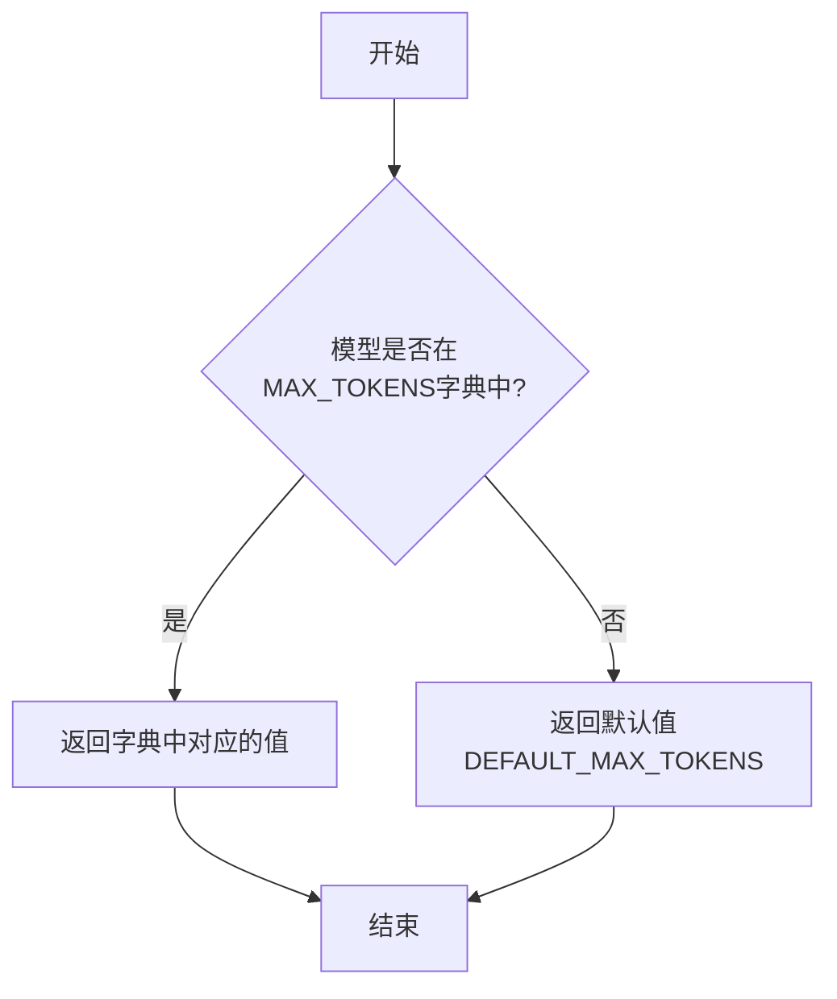

#### 带注释源码

```python
def get_max_tokens(model: str) -> int:
    """
    根据模型名称获取其支持的最大令牌数。

    参数:
        model (str): 模型名称。

    返回:
        int: 模型支持的最大令牌数。如果模型未在预定义字典中找到，则返回默认值。
    """
    # 预定义的模型最大令牌数字典
    MAX_TOKENS = {
        "claude-3-5-sonnet-20241022": 200000,
        "claude-3-opus-20240229": 200000,
        "claude-3-sonnet-20240229": 200000,
        "claude-3-haiku-20240307": 200000,
        "claude-2.1": 200000,
        "claude-2.0": 100000,
        "claude-instant-1.2": 100000,
        "llama2-13b-chat": 4096,
        "llama2-70b-chat": 4096,
        "llama3-8b-instruct": 8192,
        "llama3-70b-instruct": 8192,
        "mistral-7b-instruct": 32768,
        "mixtral-8x7b-instruct": 32768,
    }
    # 默认最大令牌数
    DEFAULT_MAX_TOKENS = 4096

    # 从字典中获取模型对应的最大令牌数，如果不存在则返回默认值
    return MAX_TOKENS.get(model, DEFAULT_MAX_TOKENS)
```


### `register_provider`

`register_provider` 是一个全局函数，用于将特定的 LLM 类型（如 `LLMType.BEDROCK`）与对应的 LLM 实现类（如 `BedrockLLM`）进行注册。它通过装饰器模式，将类标记为特定 LLM 类型的提供者，以便在 LLM 提供者注册表中进行查找和实例化。

参数：

-  `llm_types`：`List[LLMType]`，一个 LLM 类型的列表，表示该类支持哪些类型的 LLM。

返回值：`Callable[[Type[BaseLLM]], Type[BaseLLM]]`，返回一个装饰器函数，该装饰器接受一个 `BaseLLM` 的子类作为参数，并将其注册到提供者注册表中。

#### 流程图

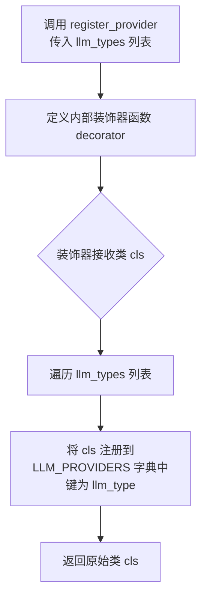

#### 带注释源码

```python
def register_provider(llm_types: List[LLMType]) -> Callable[[Type[BaseLLM]], Type[BaseLLM]]:
    """
    装饰器函数，用于将 LLM 提供者类注册到全局注册表中。
    
    Args:
        llm_types (List[LLMType]): 该提供者类所支持的 LLM 类型列表。
        
    Returns:
        Callable[[Type[BaseLLM]], Type[BaseLLM]]: 一个装饰器，它接受一个 BaseLLM 的子类，
        并将其注册到 LLM_PROVIDERS 字典中，键为 llm_types 中的每个类型。
    """
    def decorator(cls: Type[BaseLLM]) -> Type[BaseLLM]:
        """
        内部装饰器函数，执行实际的注册逻辑。
        
        Args:
            cls (Type[BaseLLM]): 需要被注册的 LLM 提供者类。
            
        Returns:
            Type[BaseLLM]: 返回原始的类 cls，允许装饰器链式调用。
        """
        # 遍历传入的 LLM 类型列表
        for llm_type in llm_types:
            # 将当前类 cls 注册到全局的 LLM_PROVIDERS 字典中
            # 键是 llm_type，值是类 cls 本身
            LLM_PROVIDERS[llm_type] = cls
        # 返回原始的类，保持装饰器的透明性
        return cls
    # 返回内部定义的装饰器函数
    return decorator
```


### `log_llm_stream`

`log_llm_stream` 是一个全局函数，用于将大型语言模型（LLM）的流式输出内容记录到日志中。它通常被调用来实时打印或记录模型生成的文本块，以便在开发或调试过程中观察模型的生成过程。

参数：

- `content`：`str`，需要记录到日志中的文本内容。

返回值：`None`，该函数没有返回值。

#### 流程图

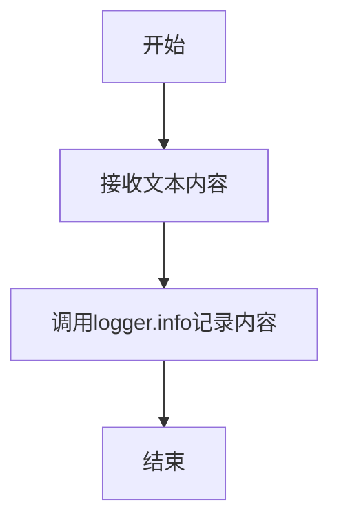

#### 带注释源码

```python
def log_llm_stream(content: str):
    """
    记录LLM流式输出的内容到日志。
    
    参数:
        content (str): 需要记录的文本内容。
    """
    logger.info(content)  # 使用配置的logger将内容记录为INFO级别日志
```

### `BedrockLLM.__init__`

初始化BedrockLLM类实例，配置AWS Bedrock客户端、模型提供者、成本管理器，并检查流式输出支持。

参数：

- `config`：`LLMConfig`，包含LLM配置信息，如模型名称、访问密钥、区域等。

返回值：`None`，无返回值。

#### 流程图

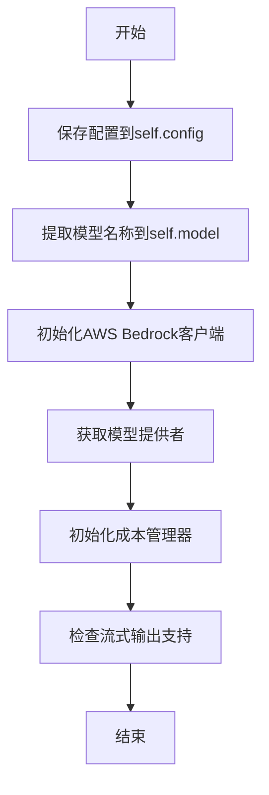

#### 带注释源码

```python
def __init__(self, config: LLMConfig):
    # 保存传入的LLM配置对象
    self.config = config
    # 从配置中提取模型名称
    self.model = config.model
    # 初始化AWS Bedrock运行时客户端
    self.__client = self.__init_client("bedrock-runtime")
    # 根据模型名称和配置获取对应的模型提供者
    self.__provider = get_provider(
        self.model, reasoning=self.config.reasoning, reasoning_max_token=self.config.reasoning_max_token
    )
    # 初始化成本管理器，用于跟踪API调用成本
    self.cost_manager = CostManager(token_costs=BEDROCK_TOKEN_COSTS)
    # 检查当前模型是否不支持流式输出，并记录警告日志
    if self.model in NOT_SUPPORT_STREAM_MODELS:
        logger.warning(f"model {self.model} doesn't support streaming output!")
```

### `BedrockLLM.__init_client`

该方法用于初始化 AWS Bedrock 服务的 boto3 客户端。它根据传入的服务名称（`bedrock-runtime` 或 `bedrock`）以及从环境变量或配置中获取的 AWS 凭证（如访问密钥、秘密密钥、会话令牌和区域）来创建一个 boto3 Session，并最终返回一个配置好的客户端实例，用于后续与 Bedrock 服务的交互。

参数：

- `service_name`：`Literal["bedrock-runtime", "bedrock"]`，指定要初始化的 AWS Bedrock 服务类型。`bedrock-runtime` 用于模型推理，`bedrock` 用于模型管理。

返回值：`Any`（实际为 `botocore.client.BaseClient`），返回一个已配置好的 boto3 客户端对象，可用于调用指定的 AWS Bedrock 服务。

#### 流程图

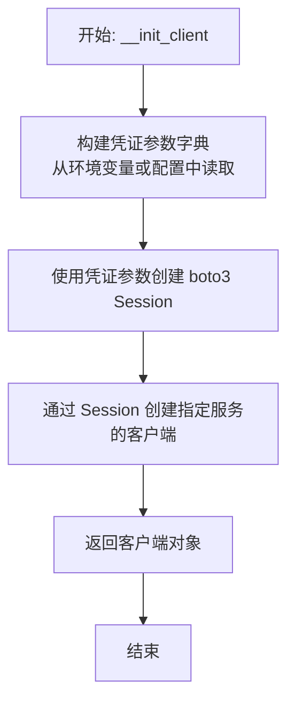

#### 带注释源码

```python
def __init_client(self, service_name: Literal["bedrock-runtime", "bedrock"]):
    """initialize boto3 client"""
    # 从环境变量或配置对象中获取 AWS 访问凭证和区域信息，并构建参数字典。
    # 环境变量的优先级高于配置对象中的值。
    self.__credential_kwargs = {
        "aws_secret_access_key": os.environ.get("AWS_SECRET_ACCESS_KEY", self.config.secret_key),
        "aws_access_key_id": os.environ.get("AWS_ACCESS_KEY_ID", self.config.access_key),
        "aws_session_token": os.environ.get("AWS_SESSION_TOKEN", self.config.session_token),
        "region_name": os.environ.get("AWS_DEFAULT_REGION", self.config.region_name),
    }
    # 使用上一步构建的参数字典创建一个 boto3 Session 对象。
    session = boto3.Session(**self.__credential_kwargs)
    # 通过创建的 Session，初始化一个指向特定服务（bedrock-runtime 或 bedrock）的客户端。
    # 这里显式传递了 region_name，确保客户端使用正确的区域。
    client = session.client(service_name, region_name=self.__credential_kwargs["region_name"])
    # 返回初始化好的客户端，供类内部其他方法使用。
    return client
```

### `BedrockLLM.client`

`BedrockLLM.client` 是一个只读属性（property），用于获取类内部封装的 AWS Bedrock 运行时客户端实例。该客户端是使用 `boto3` 库初始化的，用于与 AWS Bedrock 服务进行交互，执行模型调用等操作。通过此属性，外部代码可以安全地访问这个已配置好的客户端，而无需关心其初始化细节。

参数：无

返回值：`boto3.client`，一个已配置好认证信息和区域的 AWS Bedrock 运行时客户端实例。

#### 流程图

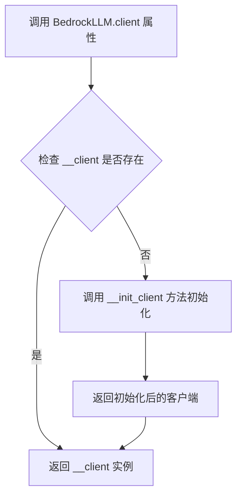

#### 带注释源码

```python
    @property
    def client(self):
        # 返回类内部私有变量 __client 的值。
        # __client 在 __init__ 方法中通过调用 __init_client 方法完成初始化。
        # 这是一个属性访问器，确保客户端实例的封装性。
        return self.__client
```

### `BedrockLLM.provider`

`BedrockLLM.provider` 是一个只读属性（property），用于获取当前 BedrockLLM 实例所关联的模型提供者（provider）对象。该提供者对象封装了与特定 AWS Bedrock 模型（如 Claude、Llama 等）交互的细节，包括如何构建请求体、解析响应以及处理流式输出等。此属性在类初始化时通过 `get_provider` 函数根据配置的模型名称和推理参数创建，并在后续的模型调用中被用于适配不同模型的特定接口。

参数：
- 无（此属性为只读属性，不接受参数）

返回值：`BedrockProvider`（或具体子类实例），返回初始化时创建的模型提供者对象，该对象负责处理与特定 Bedrock 模型交互的底层逻辑。

#### 流程图

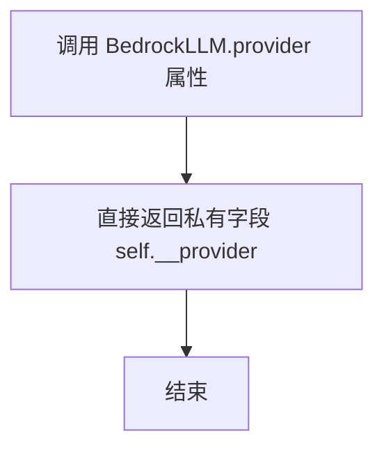

#### 带注释源码

```python
    @property
    def provider(self):
        # 这是一个只读属性（property）的 getter 方法。
        # 当外部代码访问 `BedrockLLM` 实例的 `.provider` 属性时，此方法被调用。
        # 它直接返回在 `__init__` 方法中初始化并存储在私有字段 `self.__provider` 中的提供者对象。
        # 该提供者对象由 `get_provider` 函数根据 `self.model`（模型名称）、`self.config.reasoning`（是否启用推理）和 `self.config.reasoning_max_token`（推理最大令牌数）等配置创建。
        # 这个提供者对象封装了针对特定 Bedrock 模型（如 Claude, Llama）的请求构建、响应解析和流式处理逻辑。
        return self.__provider
```

### `BedrockLLM.list_models`

该方法用于列出AWS Bedrock服务中所有可用的文本生成模型，并输出每个模型的ID及其是否支持流式输出的信息。

参数：
- 无

返回值：`None`，该方法不返回任何值，仅将结果打印到日志中。

#### 流程图

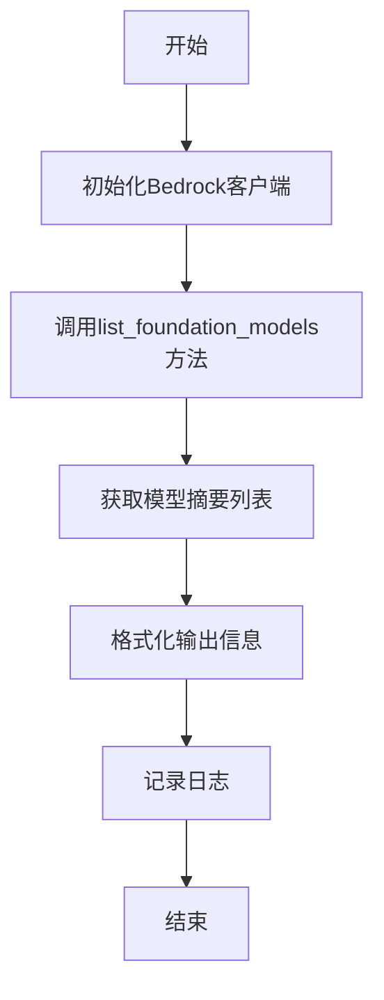

#### 带注释源码

```python
def list_models(self):
    """list all available text-generation models

    ```shell
    ai21.j2-ultra-v1                    Support Streaming:False
    meta.llama3-70b-instruct-v1:0       Support Streaming:True
    ……
    ```
    """
    # 初始化一个用于管理Bedrock基础模型的客户端（与运行时客户端不同）
    client = self.__init_client("bedrock")
    # 调用AWS API，仅筛选输出模式为“TEXT”的模型
    response = client.list_foundation_models(byOutputModality="TEXT")
    # 从响应中提取模型摘要，并格式化为字符串列表
    summaries = [
        f'{summary["modelId"]:50} Support Streaming:{summary["responseStreamingSupported"]}'
        for summary in response["modelSummaries"]
    ]
    # 将格式化后的模型信息记录到日志中
    logger.info("\n" + "\n".join(summaries))
```

### `BedrockLLM.invoke_model`

该方法用于异步调用AWS Bedrock的基础模型，发送请求体并获取模型生成的响应。它通过将同步的`boto3`客户端调用包装在异步执行器中来实现异步操作，并在调用后处理使用量统计和成本更新。

参数：

- `request_body`：`str`，包含模型请求参数的JSON字符串，如提示文本、生成参数等。

返回值：`dict`，模型响应的主体内容，通常包含生成的文本、推理内容或其他模型输出。

#### 流程图

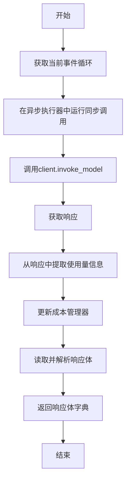

#### 带注释源码

```python
async def invoke_model(self, request_body: str) -> dict:
    # 获取当前运行的事件循环，用于在异步环境中执行同步I/O操作
    loop = asyncio.get_running_loop()
    # 使用partial函数固定client.invoke_model的部分参数（modelId和body），
    # 然后通过run_in_executor在异步执行器中运行这个同步调用，避免阻塞事件循环
    response = await loop.run_in_executor(
        None, partial(self.client.invoke_model, modelId=self.model, body=request_body)
    )
    # 从响应中提取token使用量信息（输入和输出token数）
    usage = self._get_usage(response)
    # 根据使用量和模型名称更新成本管理器中的费用记录
    self._update_costs(usage, self.model)
    # 读取响应的body流，并将其解析为字典格式
    response_body = self._get_response_body(response)
    # 返回解析后的响应体
    return response_body
```

### `BedrockLLM.invoke_model_with_response_stream`

该方法用于异步调用AWS Bedrock模型并获取流式响应。它通过boto3客户端调用`invoke_model_with_response_stream`接口，将请求体发送给指定的Bedrock模型，并返回一个事件流（EventStream）对象，该对象可以逐步获取模型的生成结果。同时，该方法会从响应中提取token使用量并更新成本。

参数：

- `request_body`：`str`，包含模型请求参数的JSON字符串，如提示词、温度、最大token数等。

返回值：`EventStream`，AWS Bedrock返回的事件流对象，用于逐步读取模型的流式输出。

#### 流程图

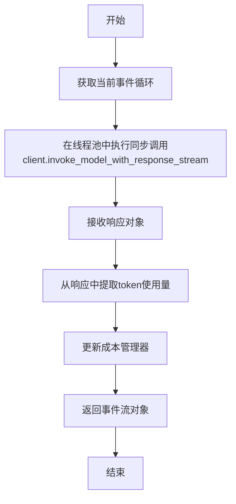

#### 带注释源码

```python
async def invoke_model_with_response_stream(self, request_body: str) -> EventStream:
    # 获取当前运行的事件循环，用于在异步环境中执行同步的boto3调用
    loop = asyncio.get_running_loop()
    # 使用线程池执行器来运行同步的boto3客户端方法，避免阻塞事件循环
    # partial函数用于固定modelId和body参数，只留下self.client.invoke_model_with_response_stream方法本身
    response = await loop.run_in_executor(
        None, partial(self.client.invoke_model_with_response_stream, modelId=self.model, body=request_body)
    )
    # 从响应中提取token使用量信息（输入和输出token数）
    usage = self._get_usage(response)
    # 根据使用量和模型名称更新成本管理器中的费用记录
    self._update_costs(usage, self.model)
    # 返回原始的事件流响应对象，调用者可以进一步处理流式数据
    return response
```

### `BedrockLLM._const_kwargs`

`_const_kwargs` 是 `BedrockLLM` 类的一个只读属性（property）。它的核心功能是根据当前配置的模型和 `LLMConfig` 中的设置，动态计算并返回一个用于构建模型请求体的参数字典。该字典主要包含两个关键参数：`max_tokens`（或其模型特定的等效字段）和 `temperature`。其中，`max_tokens` 的值会通过 `get_max_tokens` 函数获取模型自身的上限，并与用户配置的 `max_token` 进行比较，取两者中的较小值，以确保请求不会超出模型的能力范围。

参数：
-  `self`：`BedrockLLM`，`BedrockLLM` 类的实例，用于访问实例属性如 `self.model`、`self.config` 和 `self.__provider`。

返回值：`dict`，一个包含模型请求所需常量参数的字典。该字典至少包含两个键值对：一个由 `self.__provider.max_tokens_field_name` 指定的键（如 `max_tokens`）及其计算后的值，以及 `temperature` 键及其来自配置的值。

#### 流程图

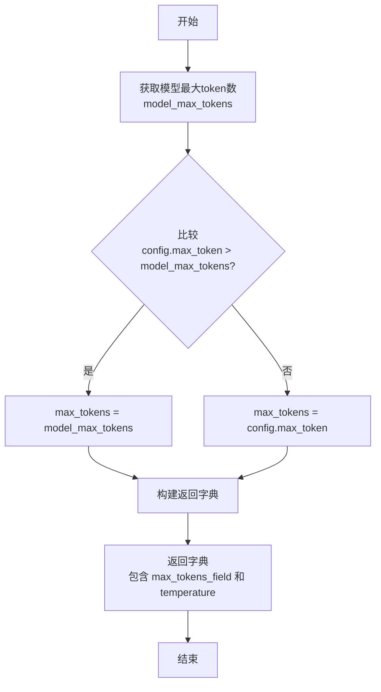

#### 带注释源码

```python
    @property
    def _const_kwargs(self) -> dict:
        # 步骤1: 获取当前配置模型所支持的最大token数量
        model_max_tokens = get_max_tokens(self.model)
        
        # 步骤2: 比较用户配置的max_token与模型上限，取较小值作为最终max_tokens
        if self.config.max_token > model_max_tokens:
            max_tokens = model_max_tokens
        else:
            max_tokens = self.config.max_token

        # 步骤3: 构建并返回参数字典。
        # 使用provider指定的字段名（max_tokens_field_name）来存储max_tokens，
        # 因为不同模型提供商（如Anthropic, Cohere）的API参数名可能不同。
        # 同时，将配置中的temperature也加入字典。
        return {self.__provider.max_tokens_field_name: max_tokens, "temperature": self.config.temperature}
```

### `BedrockLLM.get_choice_text`

该方法用于从AWS Bedrock模型的标准响应字典中提取出最终的文本内容。它通过调用底层提供者（`provider`）的`get_choice_text`方法来处理原始响应。如果提供者返回一个字典（例如，包含推理内容和最终内容），该方法会提取出推理内容存储到实例变量`reasoning_content`中，并返回最终的文本内容。

参数：

- `rsp`：`dict`，AWS Bedrock模型调用返回的原始响应字典。

返回值：`str`，从响应中提取出的最终文本内容。

#### 流程图

```mermaid
flowchart TD
    A[开始] --> B[调用 provider.get_choice_text(rsp)]
    B --> C{返回类型是否为 dict?}
    C -- 是 --> D[提取 reasoning_content 和 content]
    D --> E[将 reasoning_content 存入实例变量]
    E --> F[返回 content]
    C -- 否 --> G[直接返回 rsp]
    F --> H[结束]
    G --> H
```

#### 带注释源码

```python
def get_choice_text(self, rsp: dict) -> str:
    # 调用底层提供者的方法处理原始响应，以适配不同模型（如Claude 3）的响应格式
    rsp = self.__provider.get_choice_text(rsp)
    # 检查处理后的结果是否为字典类型。某些提供者（如Claude 3）可能返回包含推理过程和最终内容的字典。
    if isinstance(rsp, dict):
        # 如果返回的是字典，提取其中的推理内容并存储到实例变量中，供后续使用或分析。
        self.reasoning_content = rsp.get("reasoning_content")
        # 从字典中提取最终的文本内容作为返回值。
        rsp = rsp.get("content")
    # 返回最终的文本内容。如果原始rsp不是字典，则直接返回provider处理后的结果。
    return rsp
```

### `BedrockLLM.acompletion`

该方法用于异步调用AWS Bedrock模型进行文本补全。它接收消息列表，通过provider构建请求体，调用底层invoke_model方法，并返回模型的原始响应。

参数：

- `messages`：`list[dict]`，包含对话历史和当前请求的消息列表，每个消息是一个字典，通常包含"role"和"content"字段。

返回值：`dict`，AWS Bedrock模型的原始响应体，通常包含生成的文本、使用量统计等信息。

#### 流程图

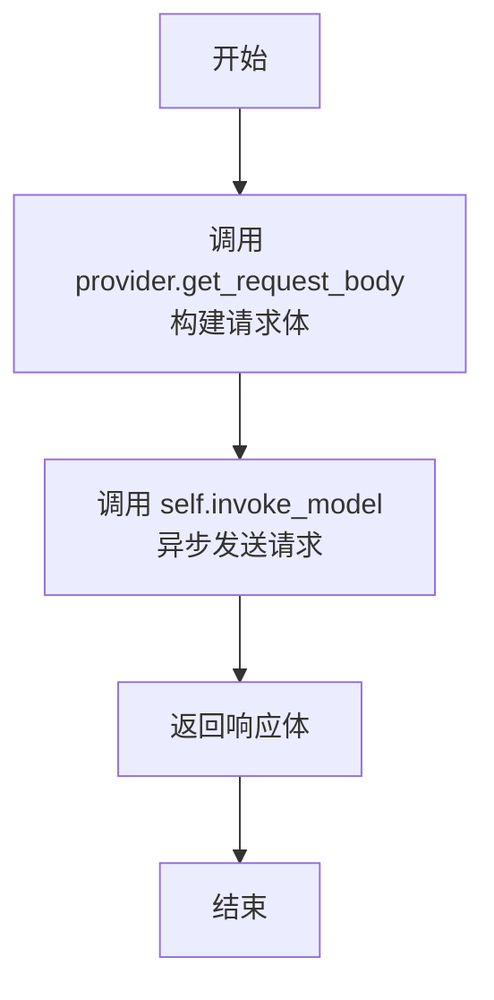

#### 带注释源码

```python
async def acompletion(self, messages: list[dict]) -> dict:
    # 1. 使用provider将消息列表和常量参数转换为Bedrock API所需的请求体格式
    request_body = self.__provider.get_request_body(messages, self._const_kwargs)
    # 2. 异步调用invoke_model方法发送请求并获取响应
    response_body = await self.invoke_model(request_body)
    # 3. 返回原始的响应体字典
    return response_body
```

### `BedrockLLM._achat_completion`

该方法是一个异步方法，用于向 AWS Bedrock 模型发起非流式聊天补全请求。它接收一个消息列表，调用底层的 `acompletion` 方法，并返回模型的响应。

参数：

- `messages`：`list[dict]`，一个字典列表，代表对话历史中的消息序列。每个字典通常包含 `role`（如 `"user"`, `"assistant"`）和 `content`（消息内容）字段。
- `timeout`：`int`，请求的超时时间（单位：秒）。此参数在方法签名中定义，但在当前实现中未被使用，而是直接传递给 `acompletion` 方法。

返回值：`dict`，返回一个字典，包含 AWS Bedrock 模型对给定消息列表的完整响应。该字典的结构由具体的模型提供商（`self.__provider`）决定。

#### 流程图

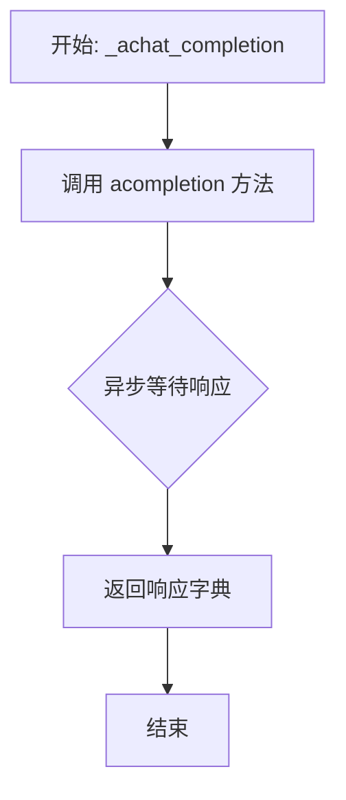

#### 带注释源码

```python
async def _achat_completion(self, messages: list[dict], timeout=USE_CONFIG_TIMEOUT) -> dict:
    # 直接调用 `acompletion` 方法，传入消息列表。
    # `timeout` 参数在此处被接收但未在方法内部使用，而是原样传递给 `acompletion`。
    # 当前 `acompletion` 方法实现也未使用 `timeout` 参数。
    return await self.acompletion(messages)
```

### `BedrockLLM._achat_completion_stream`

该方法用于与 AWS Bedrock 模型进行异步流式对话补全。它首先检查目标模型是否支持流式输出，如果不支持，则回退到非流式调用。对于支持流式的模型，它会构建流式请求体，调用 AWS SDK 的流式接口，并实时收集和打印返回的文本块，最终拼接成完整的回复。方法还会处理可能存在的推理内容，并更新成本统计。

参数：

- `messages`：`list[dict]`，包含对话历史的消息列表，通常由系统消息、用户消息和助手消息组成。
- `timeout`：`int`，请求的超时时间（秒），当前实现中未直接使用，由底层配置控制。

返回值：`str`，模型生成的完整文本回复。

#### 流程图

```mermaid
flowchart TD
    A[开始: _achat_completion_stream] --> B{模型是否支持流式?<br>model in NOT_SUPPORT_STREAM_MODELS?}
    B -- 否 --> C[调用非流式方法 acompletion]
    C --> D[通过 get_choice_text 提取完整回复文本]
    D --> E[调用 log_llm_stream 打印完整回复]
    E --> F[返回完整回复文本]
    B -- 是 --> G[构建流式请求体<br>provider.get_request_body(..., stream=True)]
    G --> H[调用流式接口<br>invoke_model_with_response_stream]
    H --> I[处理流式响应体<br>_get_stream_response_body]
    I --> J[在 collect_content 中迭代事件流]
    J --> K{解析事件<br>provider.get_choice_text_from_stream}
    K -- 是推理内容 --> L[收集到 reasoning_content 列表]
    K -- 是普通内容 --> M[收集到 content 列表<br>并调用 log_llm_stream 实时打印]
    L & M --> J
    J --> N[流结束，拼接完整回复文本]
    N --> O{Provider 是否提供用量?}
    O -- 是 --> P[更新成本 _update_costs]
    O -- 否 --> Q[调用 log_llm_stream 打印换行]
    P --> Q
    Q --> F
```

#### 带注释源码

```python
async def _achat_completion_stream(self, messages: list[dict], timeout=USE_CONFIG_TIMEOUT) -> str:
    # 1. 检查当前配置的模型是否在不支持流式输出的模型列表中
    if self.model in NOT_SUPPORT_STREAM_MODELS:
        # 1.1 如果不支持流式，则回退到普通的异步补全调用
        rsp = await self.acompletion(messages)
        # 1.2 从响应中提取出最终的文本内容
        full_text = self.get_choice_text(rsp)
        # 1.3 将完整的回复文本记录到日志流中
        log_llm_stream(full_text)
        # 1.4 返回完整文本
        return full_text

    # 2. 对于支持流式的模型，构建流式请求体。
    #    `stream=True` 参数指示 provider 生成适用于流式调用的请求结构。
    request_body = self.__provider.get_request_body(messages, self._const_kwargs, stream=True)
    # 3. 调用 AWS Bedrock 的流式响应接口，返回一个事件流对象
    stream_response = await self.invoke_model_with_response_stream(request_body)
    # 4. 处理事件流，收集所有的文本块。此方法内部会实时打印收到的内容。
    collected_content = await self._get_stream_response_body(stream_response)
    # 5. 流处理结束后，打印一个换行符，以便在日志中与后续输出分隔。
    log_llm_stream("\n")
    # 6. 将收集到的所有文本块拼接成一个完整的字符串，并去除左侧可能的空白字符。
    full_text = ("".join(collected_content)).lstrip()
    # 7. 检查 provider 是否在流式处理过程中计算了 token 用量。
    if self.__provider.usage:
        # 7.1 如果提供了用量信息，则用其更新成本管理器。
        #     注意：非流式调用的用量在 `invoke_model_with_response_stream` 中已通过响应头更新。
        self._update_costs(self.__provider.usage, self.model)
    # 8. 返回完整的回复文本。
    return full_text
```

### `BedrockLLM._get_response_body`

该方法用于从AWS Bedrock服务的响应对象中提取并解析响应体（body）内容，将其从字节流转换为Python字典。

参数：

- `response`：`dict`，AWS Bedrock服务调用返回的原始响应对象，其中包含一个可读的`body`字段（通常是一个`botocore.response.StreamingBody`对象）。

返回值：`dict`，解析后的响应体内容，通常包含模型生成的文本、推理内容或其他元数据。

#### 流程图

```mermaid
flowchart TD
    A[开始] --> B[从response中读取body字段]
    B --> C[调用body.read()获取字节数据]
    C --> D[使用json.loads解析字节数据为字典]
    D --> E[返回解析后的字典]
    E --> F[结束]
```

#### 带注释源码

```python
def _get_response_body(self, response) -> dict:
    # 从响应对象中读取`body`字段，该字段是一个可读的流对象
    # 调用其`read()`方法获取原始的字节数据
    response_body = json.loads(response["body"].read())
    # 使用`json.loads`将字节数据解码并解析为Python字典
    return response_body
```

### `BedrockLLM._get_stream_response_body`

该方法用于异步处理AWS Bedrock模型的流式响应，从事件流中收集生成的文本内容（包括可能的推理内容），并实时输出到日志。

参数：

- `stream_response`：`dict`，包含流式响应的事件流对象，其`body`属性是一个可迭代的事件流

返回值：`List[str]`，返回收集到的文本内容块列表

#### 流程图

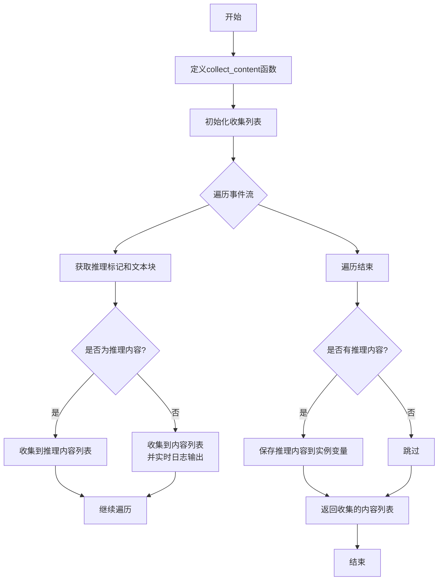

#### 带注释源码

```python
async def _get_stream_response_body(self, stream_response) -> List[str]:
    # 定义内部函数用于同步收集内容
    def collect_content() -> str:
        # 初始化两个列表分别存储普通内容和推理内容
        collected_content = []
        collected_reasoning_content = []
        
        # 遍历事件流中的每个事件
        for event in stream_response["body"]:
            # 从事件中提取推理标记和文本块
            reasoning, chunk_text = self.__provider.get_choice_text_from_stream(event)
            
            if reasoning:
                # 如果是推理内容，收集到推理内容列表
                collected_reasoning_content.append(chunk_text)
            else:
                # 如果是普通内容，收集到内容列表并实时输出到日志
                collected_content.append(chunk_text)
                log_llm_stream(chunk_text)
        
        # 如果有收集到推理内容，保存到实例变量中
        if collected_reasoning_content:
            self.reasoning_content = "".join(collected_reasoning_content)
        
        # 返回收集的普通内容列表
        return collected_content

    # 获取当前事件循环
    loop = asyncio.get_running_loop()
    # 在线程池中执行同步的收集函数，避免阻塞事件循环
    return await loop.run_in_executor(None, collect_content)
```

### `BedrockLLM._get_usage`

该方法用于从AWS Bedrock服务的响应中提取并计算本次API调用的令牌使用量。它通过解析响应头中的特定字段来获取输入令牌数和输出令牌数，并将它们组织成一个字典返回。

参数：

- `response`：`dict`，AWS Bedrock服务返回的原始响应对象，其中包含响应元数据（ResponseMetadata）和HTTP头信息。

返回值：`dict[str, int]`，一个包含两个键值对的字典：`"prompt_tokens"`表示输入（提示）令牌数，`"completion_tokens"`表示输出（完成）令牌数。

#### 流程图

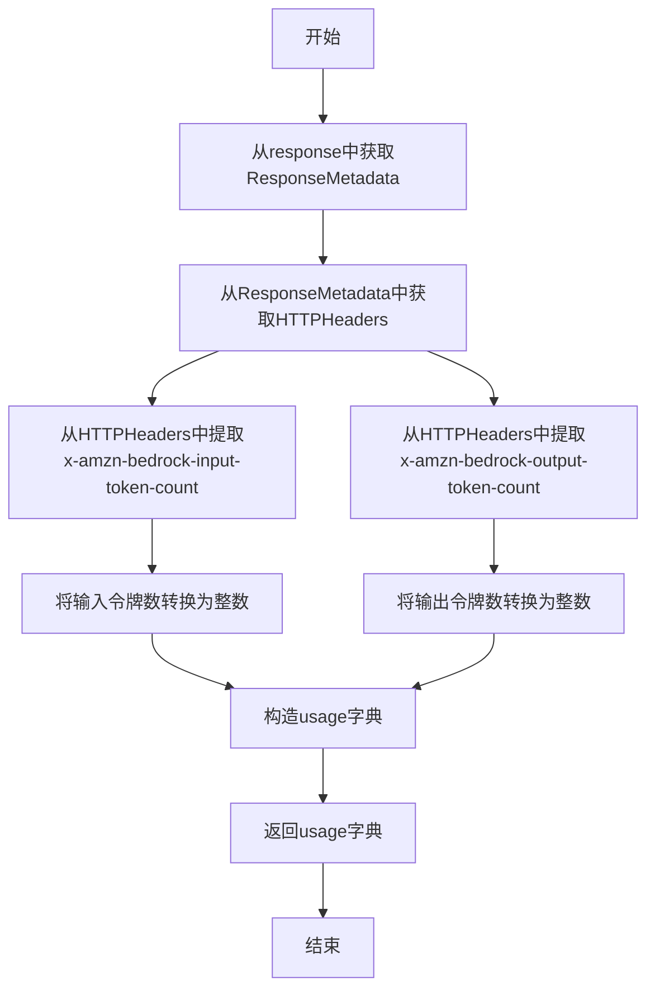

#### 带注释源码

```python
def _get_usage(self, response) -> dict[str, int]:
    # 1. 从响应对象中获取响应元数据（ResponseMetadata），如果不存在则使用空字典。
    headers = response.get("ResponseMetadata", {}).get("HTTPHeaders", {})
    # 2. 从HTTP头信息中获取输入令牌数（x-amzn-bedrock-input-token-count），如果不存在则默认为0，并转换为整数。
    prompt_tokens = int(headers.get("x-amzn-bedrock-input-token-count", 0))
    # 3. 从HTTP头信息中获取输出令牌数（x-amzn-bedrock-output-token-count），如果不存在则默认为0，并转换为整数。
    completion_tokens = int(headers.get("x-amzn-bedrock-output-token-count", 0))
    # 4. 构造并返回包含令牌使用量的字典。
    usage = {
        "prompt_tokens": prompt_tokens,
        "completion_tokens": completion_tokens,
    }
    return usage
```

## 关键组件


### 张量索引与惰性加载

代码中未直接涉及张量索引与惰性加载机制。该类主要处理与AWS Bedrock服务的HTTP API交互，不涉及底层张量操作或模型参数的延迟加载。

### 反量化支持

代码中未直接涉及反量化（Dequantization）支持。该类作为LLM服务提供商接口，负责封装对云端Bedrock模型的调用，模型内部的量化与反量化过程由AWS Bedrock服务端处理，对客户端透明。

### 量化策略

代码中未直接涉及量化策略。量化策略通常指在模型训练或推理时为了减少模型大小或加速计算而采用的数值精度转换方案（如INT8量化），这部分由底层的Bedrock模型服务管理，不在当前客户端代码的职责范围内。

### 提供商抽象层 (`BedrockProvider`)

通过 `get_provider` 函数和 `self.__provider` 字段实现，用于抽象不同Bedrock模型（如Anthropic Claude、Meta Llama、AI21 Jurassic等）在请求体构造、响应解析、流式处理等方面的差异，提供了统一的接口以支持多种模型。

### 成本管理器 (`CostManager`)

通过 `self.cost_manager` 字段实现，利用 `BEDROCK_TOKEN_COSTS` 配置，根据API响应的token使用量（从HTTP响应头获取）来计算和追踪每次模型调用的成本。

### 流式响应处理

通过 `invoke_model_with_response_stream` 方法和 `_get_stream_response_body` 方法实现，支持从Bedrock服务接收流式响应，并实时处理和拼接文本块，对于支持推理（reasoning）的模型还能分离并收集推理过程内容。

### 异步执行适配器

通过 `asyncio.get_running_loop().run_in_executor` 将同步的 `boto3` 客户端调用封装为异步操作，使得在异步框架中能够非阻塞地调用AWS SDK的同步方法。


## 问题及建议


### 已知问题

-   **异步实现不彻底**：`invoke_model` 和 `invoke_model_with_response_stream` 方法虽然标记为 `async`，但内部使用 `run_in_executor` 将同步的 `boto3` 客户端调用包装为异步。这并非真正的异步 I/O，而是将阻塞操作转移到线程池，可能导致线程池资源耗尽和额外的上下文切换开销。
-   **流式响应处理存在阻塞**：`_get_stream_response_body` 方法在收集流式响应时，同样使用 `run_in_executor` 来执行一个包含 `for` 循环的同步函数 `collect_content`。这会导致整个流式响应体在后台线程中收集完成后才返回，失去了流式处理的实时性优势，且可能因长时间循环阻塞线程。
-   **错误处理不完善**：代码中缺少对 `boto3` 客户端调用（如 `invoke_model`）可能抛出的异常（如网络错误、服务端错误、凭证错误等）的捕获和处理。这可能导致未处理的异常向上传播，使程序崩溃。
-   **配置验证缺失**：在 `__init__` 和 `_const_kwargs` 中，虽然对 `max_token` 进行了与模型上限的比较和调整，但未对 `self.config` 中的其他关键参数（如 `temperature` 的范围、必要的 `access_key` 和 `secret_key` 是否存在）进行有效性验证。
-   **`list_models` 方法设计不一致**：该方法是一个同步的实例方法，与类中其他核心的异步方法（如 `acompletion`）风格不一致。如果需要在异步上下文中调用，会引入不必要的阻塞或需要额外的包装。
-   **`reasoning_content` 属性管理不清晰**：`reasoning_content` 在 `get_choice_text` 和 `_get_stream_response_body` 中被赋值，但它是实例的一个动态属性，未在 `__init__` 中声明。这种模式使得其状态难以追踪，且在多轮对话中可能残留旧值，造成混淆。

### 优化建议

-   **采用真正的异步客户端**：调研并使用支持 `invoke_model` 等操作的异步 AWS SDK，例如 `aioboto3`。这可以消除对线程池的依赖，实现真正的非阻塞 I/O，提高并发性能和资源利用率。
-   **重构流式响应处理为异步迭代器**：将 `_get_stream_response_body` 方法重写为异步生成器（`async for`），使其能够逐块（chunk）实时地 `yield` 响应内容。这需要深入理解 `botocore.eventstream.EventStream` 的异步接口或寻找其异步包装方法。
-   **增强异常处理**：在 `invoke_model`、`invoke_model_with_response_stream`、`acompletion` 等核心方法中，使用 `try-except` 块捕获 `boto3` 和 `botocore` 可能抛出的特定异常（如 `ClientError`），并转换为框架内统一的异常类型或进行适当的日志记录和错误恢复。
-   **增加配置验证**：在 `__init__` 方法中添加参数验证逻辑，确保必要的配置项存在且有效。例如，检查 `access_key` 和 `secret_key`，验证 `temperature` 是否在合理区间（如 0.0 到 2.0）。可以抛出清晰的 `ValueError`。
-   **统一方法风格或明确职责**：考虑将 `list_models` 改为异步方法（如果底层客户端调用支持），或者将其移出此类，作为一个独立的工具函数。如果保留为同步方法，应在文档中明确说明其用途和调用上下文。
-   **明确化 `reasoning_content` 状态管理**：在 `__init__` 中将其初始化为 `None`。在 `get_choice_text` 和流式处理中赋值后，考虑在每次对话开始前（例如在 `acompletion` 或 `_achat_completion` 的开头）将其重置为 `None`，以避免状态污染。或者，将其作为相关方法的返回值的一部分返回，而不是存储在实例属性中。
-   **考虑连接池与客户端复用**：评估 `__init_client` 中创建的 `boto3.Session` 和 `client` 的复用策略。确保在长时间运行的应用中，客户端连接得到有效管理，避免不必要的创建开销。
-   **添加更详细的日志**：在关键步骤（如发起请求、收到响应、更新成本）添加 `DEBUG` 或 `INFO` 级别的日志，便于问题排查和监控。


## 其它


### 设计目标与约束

本模块的核心设计目标是提供一个与 AWS Bedrock 服务交互的、符合 MetaGPT 框架规范的 LLM 提供者实现。主要约束包括：1) 必须继承自 `BaseLLM` 基类，实现其定义的异步聊天接口 (`_achat_completion`, `_achat_completion_stream`)。2) 需要适配 AWS Bedrock 的特定 API 调用方式（同步 boto3 客户端）和响应格式。3) 需要处理不同 Bedrock 模型提供商（如 Anthropic, Meta, AI21）在请求体构造、响应解析和流式处理上的差异，通过 `BedrockProvider` 抽象层进行解耦。4) 需要集成成本管理和令牌计数功能。

### 错误处理与异常设计

代码中显式的错误处理较少，主要依赖底层 `boto3` 库和 `asyncio` 抛出异常。潜在需要处理的异常包括：1) `botocore.exceptions` 中的各种异常（如 `ClientError`， 可能因凭证无效、模型不可用、请求超限或请求格式错误引发）。2) `json.JSONDecodeError`，在解析非流式响应体时可能发生。3) `KeyError`，在从响应字典中提取特定字段时，如果模型响应格式与预期不符可能发生。当前设计将大部分异常向上层调用者传递。对于流式模型不支持的情况，使用了 `logger.warning` 进行记录。`__init__` 方法中环境变量和配置的优先级处理也隐含了配置缺失时的回退逻辑。

### 数据流与状态机

主要数据流始于外部调用 `aask` 等方法，传入消息列表 (`messages`)。1) **请求构建流**：`messages` 和配置参数 (`_const_kwargs`) 被传递给当前模型对应的 `provider.get_request_body` 方法，生成符合该模型 API 规范的 JSON 字符串 (`request_body`)。2) **API 调用流**：根据是否流式输出，`request_body` 被传递给 `invoke_model` 或 `invoke_model_with_response_stream` 方法。这些方法使用 `asyncio.run_in_executor` 包装同步的 boto3 客户端调用，以避免阻塞事件循环。3) **响应解析流**：对于非流式响应，通过 `_get_response_body` 解析 JSON，然后通过 `provider.get_choice_text` 提取文本内容，可能分离出推理内容 (`reasoning_content`)。对于流式响应，通过 `_get_stream_response_body` 方法迭代事件流，并调用 `provider.get_choice_text_from_stream` 逐块解析和输出文本，同时收集可能的推理内容。4) **成本更新流**：在每次 API 调用后，从响应头 (`_get_usage`) 或 `provider` 中获取令牌使用量，通过 `_update_costs` 方法更新 `CostManager`。模块内部状态主要包括 `self.reasoning_content`（存储模型可能返回的推理过程）和 `CostManager` 实例维护的累计成本。

### 外部依赖与接口契约

1.  **AWS Bedrock 服务**：核心外部服务，通过其 `InvokeModel` 和 `InvokeModelWithResponseStream` API 提供 LLM 能力。模块需遵守其认证、请求格式和速率限制。
2.  **boto3 (aws-sdk-python)**：用于与 AWS 服务交互的官方 SDK。本模块依赖其 `boto3.Session` 和 `bedrock-runtime` 客户端。
3.  **MetaGPT 框架内部合约**：
    *   **基类**：必须实现 `BaseLLM` 定义的抽象方法，特别是 `_achat_completion` 和 `_achat_completion_stream`。
    *   **配置**：依赖 `LLMConfig` 对象提供模型、密钥、区域、温度等参数。
    *   **提供者注册**：通过 `@register_provider([LLMType.BEDROCK])` 装饰器向 `llm_provider_registry` 注册自身。
    *   **工具函数**：依赖 `get_provider`, `get_max_tokens`, `NOT_SUPPORT_STREAM_MODELS`, `BEDROCK_TOKEN_COSTS` 等来自 `metagpt.provider.bedrock` 和 `metagpt.utils` 的模块。
    *   **日志与常量**：使用 `logger` 和 `log_llm_stream` 进行日志记录，使用 `USE_CONFIG_TIMEOUT` 常量。
4.  **环境变量**：作为备选的认证来源 (`AWS_ACCESS_KEY_ID`, `AWS_SECRET_ACCESS_KEY`, `AWS_SESSION_TOKEN`, `AWS_DEFAULT_REGION`)，优先级低于 `LLMConfig` 中的显式配置。

### 并发与异步设计

模块面临的核心挑战是 AWS boto3 SDK 本质上是同步的。解决方案是使用 `asyncio.run_in_executor` 将同步的 `client.invoke_model` 调用转移到线程池中执行，避免阻塞异步事件循环。这体现在 `invoke_model` 和 `invoke_model_with_response_stream` 方法中。对于流式响应的事件迭代 (`collect_content`)，同样使用了 `run_in_executor`。这种“包装”模式使得上层可以完全使用 `async/await` 语法进行调用。注释中提到了 `aioboto3` 作为异步替代方案，但因不支持 `invoke_model` 而未被采用。

### 安全与合规考虑

1.  **凭证管理**：支持通过环境变量和 `LLMConfig` 对象传递 AWS 访问密钥、秘密密钥和会话令牌。代码遵循了环境变量优先于配置的常见模式，但实际部署中应使用 IAM 角色或更安全的凭证管理服务（如 AWS Secrets Manager）。
2.  **数据传输**：依赖 boto3 和 AWS SDK 的默认 HTTPS 传输加密。
3.  **模型与区域**：用户通过配置指定使用的模型 (`model`) 和 AWS 区域 (`region_name`)，这决定了数据驻留和处理的物理位置，可能涉及数据主权合规要求。
4.  **输入/输出过滤**：当前模块未对输入 (`messages`) 或模型输出进行内容过滤或审查，此责任可能由上游调用方或 Bedrock 模型本身的安全机制承担。

    