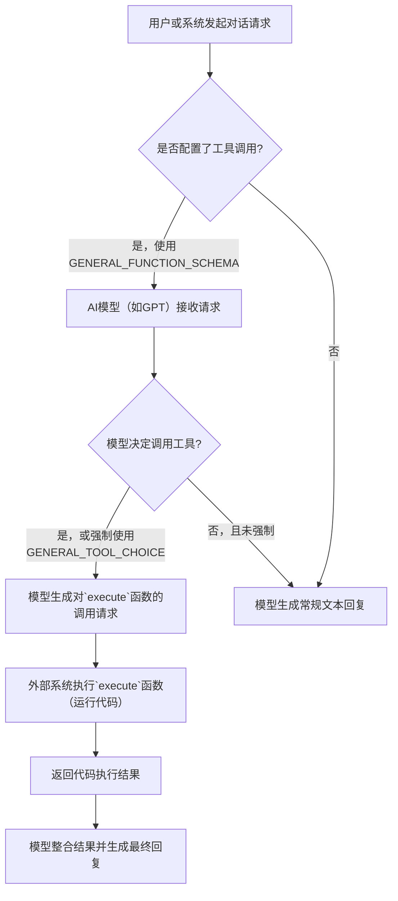

# `.\MetaGPT\metagpt\provider\constant.py` 详细设计文档

该文件定义了一个用于配置OpenAI API工具调用（Tools/Tool Calling）的模块，主要包含一个通用的代码执行函数模式（`GENERAL_FUNCTION_SCHEMA`）、其对应的强制工具选择配置（`GENERAL_TOOL_CHOICE`）以及一个支持多模态功能的大语言模型列表（`MULTI_MODAL_MODELS`）。这些配置旨在引导或强制AI模型（如GPT）在对话中调用一个名为`execute`的函数来在用户本地环境中执行代码。

## 整体流程



## 类结构

```
本文件不包含类定义，仅包含全局配置变量。
├── 全局常量 (Global Constants)
│   ├── GENERAL_FUNCTION_SCHEMA (字典)
│   ├── GENERAL_TOOL_CHOICE (字典)
│   └── MULTI_MODAL_MODELS (列表)
```

## 全局变量及字段


### `GENERAL_FUNCTION_SCHEMA`
    
一个定义了名为 'execute' 的通用工具/函数模式的字典，用于描述如何在用户本地环境中执行代码。

类型：`dict`
    


### `GENERAL_TOOL_CHOICE`
    
一个指定强制使用 `GENERAL_FUNCTION_SCHEMA` 中定义的 'execute' 函数的工具选择配置字典。

类型：`dict`
    


### `MULTI_MODAL_MODELS`
    
一个包含支持多模态（如图像、文本等）输入的大语言模型（LLM）标识符的列表。

类型：`list`
    


    

## 全局函数及方法


## 关键组件


### GENERAL_FUNCTION_SCHEMA

定义了用于在用户本地环境中执行代码的通用工具函数（OpenAI API 中的 `tools` 参数）的 JSON Schema，指定了函数名、描述以及必需的参数（编程语言和代码）。

### GENERAL_TOOL_CHOICE

定义了与 `GENERAL_FUNCTION_SCHEMA` 对应的工具选择（OpenAI API 中的 `tool_choice` 参数），强制要求模型调用名为 `execute` 的函数。

### MULTI_MODAL_MODELS

一个包含多模态模型标识符的列表，用于识别或筛选支持多模态输入（如图像、文本）的 AI 模型。


## 问题及建议


### 已知问题

-   **硬编码的模型列表**：`MULTI_MODAL_MODELS` 列表被硬编码在代码中。当新的多模态模型发布或现有模型名称变更时，需要手动更新此列表，这可能导致代码维护滞后，并可能引发运行时错误（如果使用了未在列表中的有效模型）。
-   **缺乏配置化**：关键配置（如支持的编程语言枚举、工具选择模式）直接以常量形式定义在代码中，而非通过配置文件或环境变量管理。这使得在不修改代码的情况下调整行为（例如，为特定部署环境添加或移除语言支持）变得困难。
-   **模式定义与工具选择耦合**：`GENERAL_TOOL_CHOICE` 常量直接引用了 `GENERAL_FUNCTION_SCHEMA` 中的函数名 `"execute"`。虽然目前是匹配的，但这种硬编码的引用关系在模式或函数名需要变更时，容易导致不一致，需要同步修改多个地方。
-   **潜在的安全与权限问题**：`GENERAL_FUNCTION_SCHEMA` 的描述强调在“用户本地环境”中执行代码，但该模式本身并未对可执行的代码内容（如禁止访问特定文件系统、网络等）或执行上下文（如沙箱）做出任何约束定义。这依赖于调用方的实现来保证安全，模式定义层面存在安全责任不清晰的隐患。
-   **枚举值维护性差**：`GENERAL_FUNCTION_SCHEMA` 中 `language` 的 `enum` 列表是硬编码的。添加或删除一种支持的语言需要直接修改模式定义，不利于扩展。

### 优化建议

-   **外部化配置**：将 `MULTI_MODAL_MODELS` 列表、`GENERAL_FUNCTION_SCHEMA` 中的 `language.enum` 等可配置项移至外部配置文件（如 YAML、JSON）或通过环境变量注入。这样可以实现部署时动态调整，无需重新部署代码。
-   **建立模型能力检测机制**：替代或补充硬编码的模型列表，可以考虑通过查询模型服务提供商的 API 来动态获取模型列表及其能力（如是否支持多模态）。或者，至少提供一个接口允许运行时注册新的模型标识符。
-   **解耦模式与工具选择**：避免在 `GENERAL_TOOL_CHOICE` 中硬编码函数名。可以定义一个常量表示函数名（如 `EXECUTE_FUNCTION_NAME = "execute"`），并在模式和工具选择常量中都引用它。或者，设计一个根据函数模式动态生成工具选择配置的辅助函数。
-   **增强模式的安全约束描述**：在 `GENERAL_FUNCTION_SCHEMA` 的 `description` 或考虑扩展 `parameters` 的属性，增加关于安全执行环境的说明或约束提示（例如，提示调用方应在沙箱中运行）。虽然这不能强制执行，但能提升文档的清晰度和对安全问题的警示。
-   **使用集中式的常量管理**：为语言枚举、函数名等定义统一的常量，并在代码中引用这些常量，而不是散落的字符串字面量。这有助于减少拼写错误，并使得未来的变更更加集中和容易。
-   **考虑模式版本化**：如果此函数模式是面向 API 的契约，考虑引入版本字段或通过命名来管理不同版本的模式，以便未来进行不兼容的更新时能平滑过渡。


## 其它


### 设计目标与约束

该代码模块的设计目标是提供一个标准化的、可扩展的接口定义，用于支持在用户本地环境中执行代码的AI代理功能。其核心约束包括：1) 严格遵循OpenAI的Function Calling工具模式规范，确保与主流大语言模型API的兼容性；2) 定义明确的执行语言枚举，以限制可安全执行的代码类型；3) 标识支持多模态输入（如图像、文件）的模型列表，为上层调用者提供模型选择依据。模块本身不包含任何执行逻辑，仅作为配置和契约定义存在。

### 错误处理与异常设计

当前代码模块不包含运行时逻辑，因此没有内置的错误处理机制。其定义的常量（如`GENERAL_FUNCTION_SCHEMA`、`MULTI_MODAL_MODELS`）在导入和使用时，如果格式不符合上游API（如OpenAI SDK）的要求，错误将由调用方捕获和处理。例如，如果`GENERAL_FUNCTION_SCHEMA`中的`enum`列表包含了不被执行引擎支持的语言，执行失败的错误将在实际调用`execute`函数时抛出。模块的设计将错误责任边界清晰地划分给了配置的使用方。

### 数据流与状态机

本模块不涉及动态数据流或状态机。它定义的是静态的配置数据和接口契约。主要的数据结构是`GENERAL_FUNCTION_SCHEMA`字典，它作为一份“蓝图”或“协议”，描述了从AI模型生成的`execute`函数调用请求所必须遵循的格式（包括参数`language`和`code`）。`MULTI_MODAL_MODELS`列表则是一份静态的模型名称白名单。这些数据在系统初始化时被加载，并在整个会话中作为只读的引用数据。

### 外部依赖与接口契约

1.  **OpenAI API 契约**：`GENERAL_FUNCTION_SCHEMA`的结构严格遵循[OpenAI Tools](https://platform.openai.com/docs/api-reference/chat/create#chat-create-tools)的JSON Schema格式。`GENERAL_TOOL_CHOICE`的值严格遵循[`tool_choice`](https://platform.openai.com/docs/api-reference/chat/create#chat-create-tool_choice)参数的规范。任何对这些常量的修改都必须确保与官方文档的兼容性。
2.  **执行引擎契约**：`GENERAL_FUNCTION_SCHEMA`中`language`参数的`enum`列表定义了一个隐含的契约，即下游必须存在能够执行这些语言代码的执行引擎（如Python解释器、Shell环境等）。列表的增减意味着执行引擎能力集的变更。
3.  **模型提供商契约**：`MULTI_MODAL_MODELS`列表中的模型名称标识符（如`"gpt-4o"`, `"anthropic/claude-3.5-sonnet"`）依赖于对应的AI服务提供商（OpenAI, Anthropic等）的模型命名规范。该列表的维护需要与各提供商发布的模型列表同步。

### 安全与权限考量

代码通过`language`枚举显式地限制了可执行的代码语言类型，这是一种基础的安全边界设计，旨在防止执行未知或潜在危险的指令。然而，此模块仅定义了契约，实际的安全控制（如代码沙箱、资源限制、用户确认、敏感操作过滤等）必须在实现`execute`函数的具体服务中完成。`MULTI_MODAL_MODELS`列表的维护也涉及安全考量，需要确保所列模型来自可信的提供商，以防止供应链攻击。

### 配置管理与可维护性

当前所有配置均以模块级常量的形式硬编码在Python源码中。这提供了简单性和明确性，但在需要频繁更新（如支持新的语言或模型）或根据不同部署环境进行差异化配置时，会降低可维护性。建议的优化方向是将这些配置外部化，例如迁移到JSON/YAML配置文件或环境变量中，并通过一个配置管理类在应用启动时加载和验证，从而提高系统的灵活性和可配置性。

    