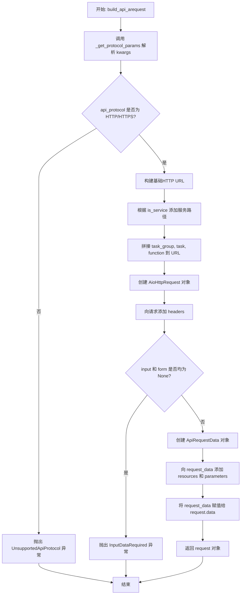
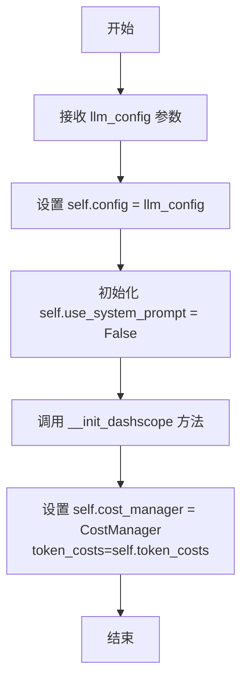
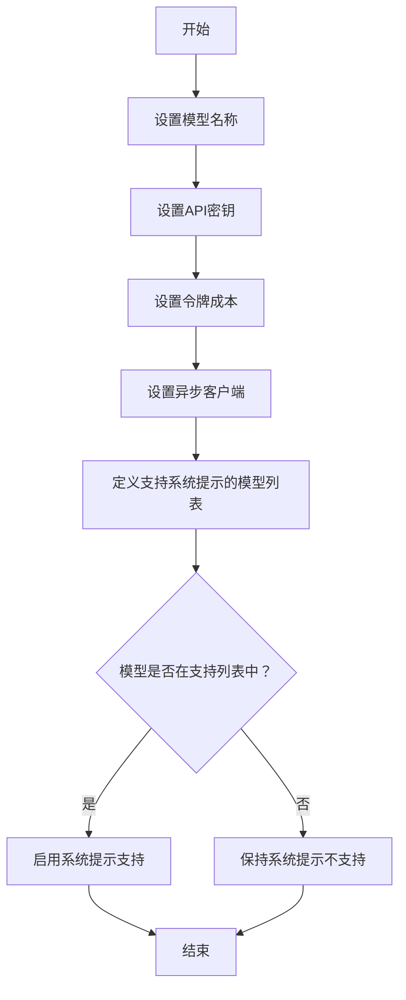
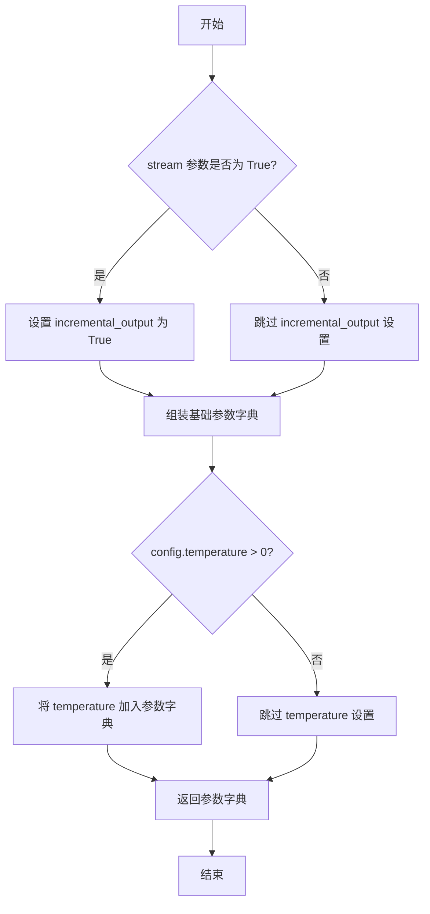
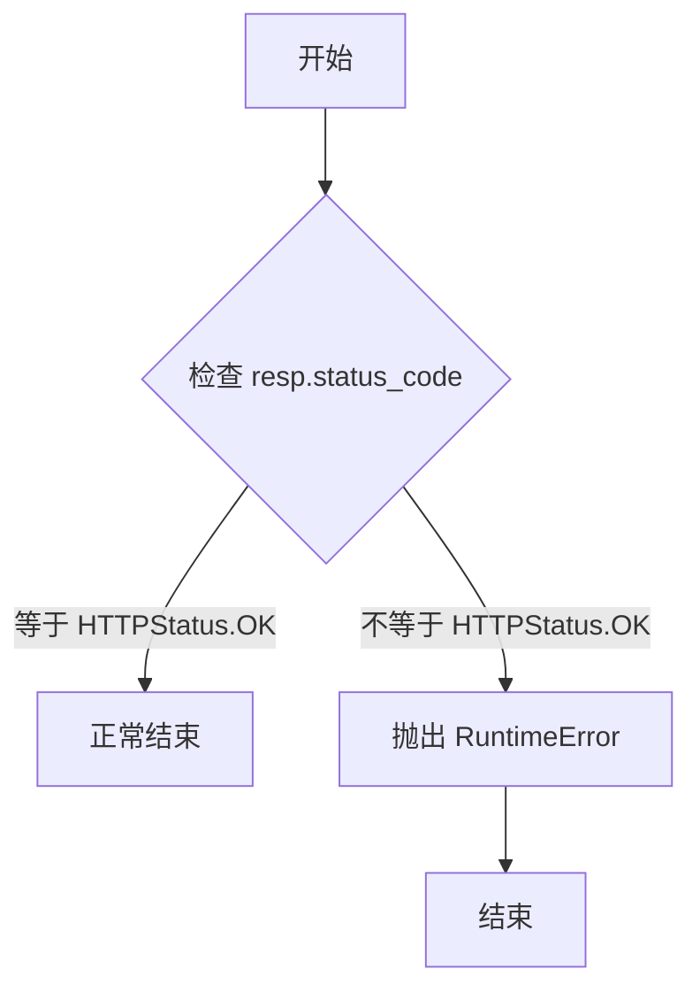
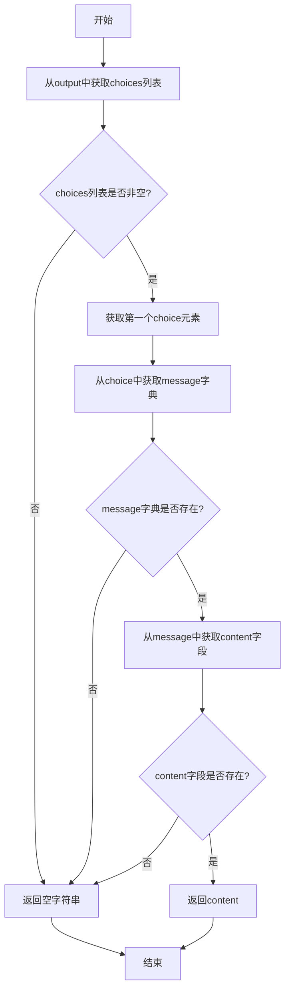
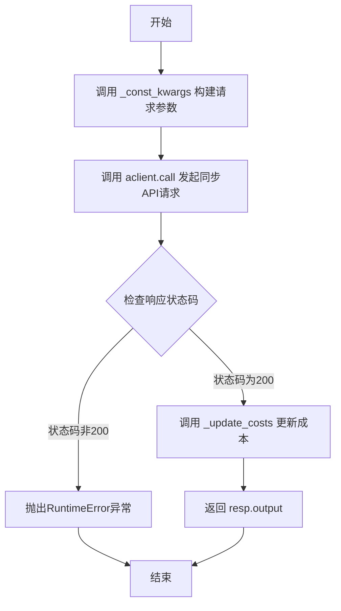
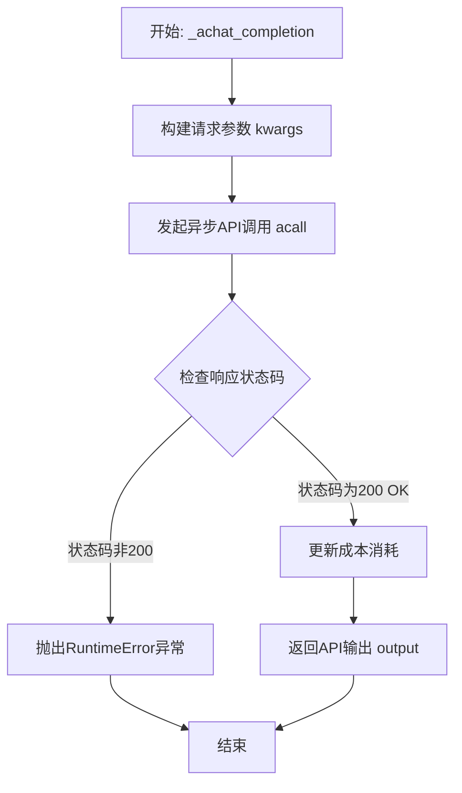
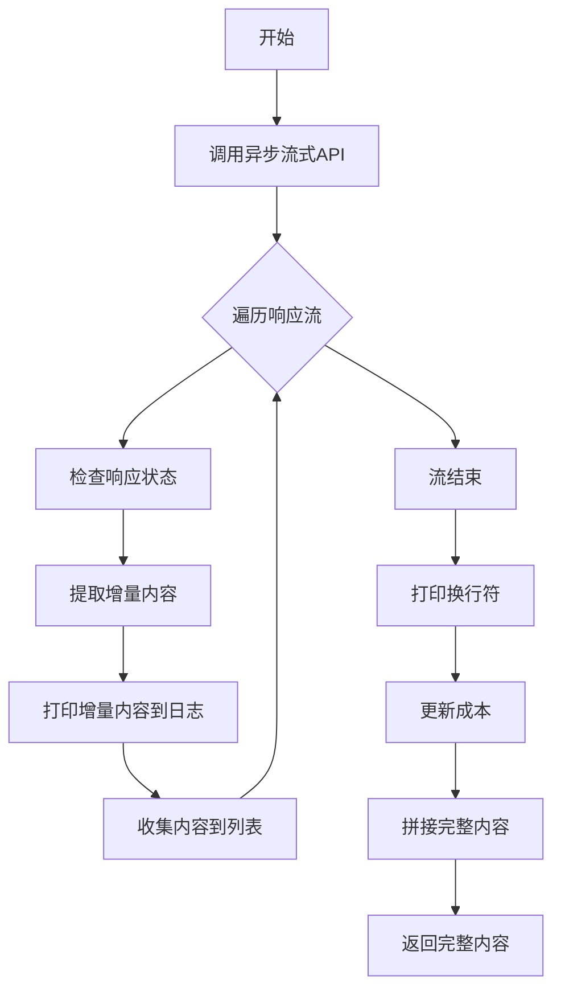
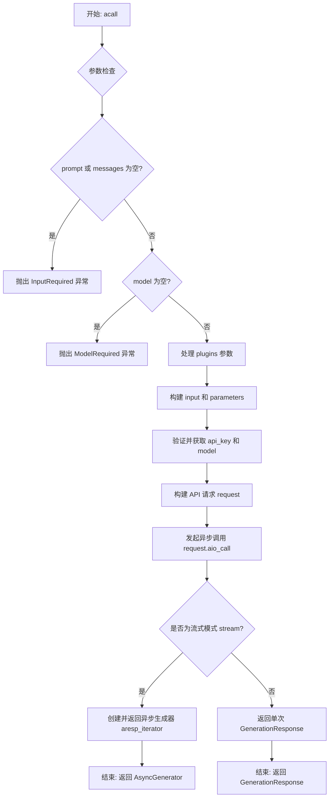

# `.\MetaGPT\metagpt\provider\dashscope_api.py` 详细设计文档

该代码是 MetaGPT 框架中用于集成阿里云灵积（DashScope）大语言模型服务的提供者模块。它定义了一个 `DashScopeLLM` 类，继承自 `BaseLLM`，封装了与 DashScope API 的同步和异步交互逻辑，包括模型调用、流式响应处理、成本管理和错误检查等功能。

## 整体流程

```mermaid
graph TD
    A[DashScopeLLM 初始化] --> B[配置API密钥、模型、成本管理器]
    B --> C{调用 completion 或 acompletion?}
    C -- 同步调用 --> D[调用 AGeneration.call]
    C -- 异步调用 --> E[调用 AGeneration.acall]
    D --> F[构建请求参数 (_const_kwargs)]
    E --> F
    F --> G[发送请求到 DashScope API]
    G --> H{是否为流式响应?}
    H -- 否 --> I[接收完整响应]
    H -- 是 --> J[迭代接收流式响应块]
    I --> K[检查响应状态 (_check_response)]
    J --> K
    K --> L[更新使用成本 (_update_costs)]
    L --> M[返回生成的文本或输出对象]
```

## 类结构

```
BaseLLM (来自 metagpt.provider.base_llm)
└── DashScopeLLM
AGeneration (继承自 Generation 和 BaseAioApi)
```

## 全局变量及字段


### `DASHSCOPE_TOKEN_COSTS`
    
存储不同模型对应的token成本价格映射，用于计算API调用费用。

类型：`Dict[str, float]`
    


### `USE_CONFIG_TIMEOUT`
    
默认的超时时间常量，用于异步API调用时的超时设置。

类型：`int`
    


### `DashScopeLLM.config`
    
LLM配置对象，包含模型名称、API密钥、温度等配置参数。

类型：`LLMConfig`
    


### `DashScopeLLM.use_system_prompt`
    
标识当前模型是否支持系统提示词（system prompt）功能。

类型：`bool`
    


### `DashScopeLLM.model`
    
当前使用的模型名称，从配置中提取并存储。

类型：`str`
    


### `DashScopeLLM.api_key`
    
DashScope API的访问密钥，用于身份验证。

类型：`str`
    


### `DashScopeLLM.token_costs`
    
从DASHSCOPE_TOKEN_COSTS导入的token成本映射，用于费用计算。

类型：`Dict[str, float]`
    


### `DashScopeLLM.acclient`
    
异步生成客户端实例，用于调用DashScope的异步生成API。

类型：`AGeneration`
    


### `DashScopeLLM.cost_manager`
    
成本管理器实例，用于跟踪和计算API调用的token消耗和费用。

类型：`CostManager`
    
    

## 全局函数及方法

### `build_api_arequest`

该函数用于构建一个面向阿里云DashScope API的异步HTTP请求对象（`AioHttpRequest`）。它根据传入的参数（如模型、输入数据、任务组、任务、函数等）以及通过`_get_protocol_params`解析出的协议参数（如API协议、流模式、超时等），组装完整的请求URL、请求头和请求体数据，最终返回一个配置好的请求对象，为后续的异步API调用做好准备。

参数：

- `model`：`str`，指定要使用的AI模型名称。
- `input`：`object`，API调用的主要输入数据。
- `task_group`：`str`，API任务的分组标识，例如`"aigc"`。
- `task`：`str`，具体的任务名称，例如`"generation"`。
- `function`：`str`，API端点函数名。
- `api_key`：`str`，用于认证的API密钥。
- `is_service`：`bool`，默认为`True`，指示是否在URL中添加服务API路径前缀。
- `**kwargs`：`Any`，其他关键字参数，用于传递协议参数（如`stream`、`timeout`）和API请求参数。

返回值：`AioHttpRequest`，返回一个配置完整的异步HTTP请求对象，包含了URL、API密钥、方法、数据等所有必要信息。

#### 流程图



#### 带注释源码

```python
def build_api_arequest(
    model: str, input: object, task_group: str, task: str, function: str, api_key: str, is_service=True, **kwargs
):
    # 1. 从 kwargs 中解析出协议相关的参数，如使用的协议、是否流式、超时时间等。
    (
        api_protocol,
        ws_stream_mode,
        is_binary_input,
        http_method,
        stream,
        async_request,
        query,
        headers,
        request_timeout,
        form,
        resources,
        base_address,
        _,
    ) = _get_protocol_params(kwargs)
    
    # 2. 从 kwargs 中弹出 task_id 参数（如果存在）。
    task_id = kwargs.pop("task_id", None)
    
    # 3. 检查 API 协议，目前仅支持 HTTP/HTTPS。
    if api_protocol in [ApiProtocol.HTTP, ApiProtocol.HTTPS]:
        # 4. 确定请求的基础地址。如果未提供，则使用 dashscope 模块的默认地址。
        if base_address is None:
            base_address = dashscope.base_http_api_url
        # 5. 确保基础地址以 '/' 结尾，便于后续路径拼接。
        if not base_address.endswith("/"):
            http_url = base_address + "/"
        else:
            http_url = base_address

        # 6. 如果 is_service 为 True，在 URL 中添加服务 API 的固定路径。
        if is_service:
            http_url = http_url + SERVICE_API_PATH + "/"

        # 7. 将任务组、任务、函数名依次拼接到 URL 中，形成完整的 API 端点路径。
        if task_group:
            http_url += "%s/" % task_group
        if task:
            http_url += "%s/" % task
        if function:
            http_url += function
            
        # 8. 使用组装好的参数创建 AioHttpRequest 异步请求对象。
        request = AioHttpRequest(
            url=http_url,
            api_key=api_key,
            http_method=http_method,
            stream=stream,
            async_request=async_request,
            query=query,
            timeout=request_timeout,
            task_id=task_id,
        )
    else:
        # 9. 如果协议不支持，抛出异常。
        raise UnsupportedApiProtocol("Unsupported protocol: %s, support [http, https, websocket]" % api_protocol)

    # 10. 如果解析出了额外的 headers，将其添加到请求对象中。
    if headers is not None:
        request.add_headers(headers=headers)

    # 11. 安全检查：输入数据（input）和表单数据（form）不能同时为空。
    if input is None and form is None:
        raise InputDataRequired("There is no input data and form data")

    # 12. 创建 ApiRequestData 对象，用于封装请求体数据，包括模型、任务信息和输入等。
    request_data = ApiRequestData(
        model,
        task_group=task_group,
        task=task,
        function=function,
        input=input,
        form=form,
        is_binary_input=is_binary_input,
        api_protocol=api_protocol,
    )
    # 13. 向请求数据中添加资源（如文件）和其他参数字段。
    request_data.add_resources(resources)
    request_data.add_parameters(**kwargs)
    # 14. 将构建好的请求数据对象赋值给请求对象的 data 属性。
    request.data = request_data
    # 15. 返回最终配置好的请求对象。
    return request
```

### `DashScopeLLM.__init__`

初始化 DashScopeLLM 类实例，配置模型参数、API 密钥、成本管理器，并检查模型是否支持系统提示。

参数：

- `llm_config`：`LLMConfig`，LLM 配置对象，包含模型名称、API 密钥、温度等配置信息

返回值：`None`，无返回值

#### 流程图



#### 带注释源码

```python
def __init__(self, llm_config: LLMConfig):
    # 将传入的 LLM 配置对象保存到实例变量中
    self.config = llm_config
    # 初始化标志，表示是否使用系统提示，默认为 False
    self.use_system_prompt = False  # only some models support system_prompt
    # 调用私有方法初始化 DashScope 相关配置
    self.__init_dashscope()
    # 创建成本管理器实例，用于跟踪 API 调用成本
    self.cost_manager = CostManager(token_costs=self.token_costs)
```

### `DashScopeLLM.__init_dashscope`

该方法用于初始化DashScopeLLM类的内部状态，包括设置模型、API密钥、令牌成本以及检查当前模型是否支持系统提示。

参数：
- `self`：`DashScopeLLM`，当前类的实例

返回值：`None`，无返回值

#### 流程图



#### 带注释源码

```python
def __init_dashscope(self):
    # 从配置中获取模型名称并赋值给实例变量
    self.model = self.config.model
    # 从配置中获取API密钥并赋值给实例变量
    self.api_key = self.config.api_key
    # 设置令牌成本，使用预定义的DASHSCOPE_TOKEN_COSTS
    self.token_costs = DASHSCOPE_TOKEN_COSTS
    # 设置异步客户端为AGeneration类
    self.aclient: AGeneration = AGeneration

    # 定义支持系统提示的模型前缀或名称列表
    support_system_models = [
        "qwen-",  # 所有以"qwen-"开头的模型都支持
        "llama2-",  # 所有以"llama2-"开头的模型都支持
        "baichuan2-7b-chat-v1",  # 特定模型支持
        "chatglm3-6b",  # 特定模型支持
    ]
    # 遍历支持系统提示的模型列表
    for support_model in support_system_models:
        # 检查当前模型是否包含支持的系统提示模型前缀或名称
        if support_model in self.model:
            # 如果匹配，启用系统提示支持
            self.use_system_prompt = True
```

### `DashScopeLLM._const_kwargs`

该方法用于构建调用 DashScope API 时所需的固定关键字参数字典。它根据类配置（如模型、API密钥、温度）和传入的消息列表，组装一个标准的请求参数集，并处理流式输出等特定选项。

参数：

- `messages`：`list[dict]`，包含对话历史的消息列表，每个消息是一个字典。
- `stream`：`bool`，默认为 `False`，指示是否启用流式响应。

返回值：`dict`，返回一个包含调用 DashScope API 所需参数的字典。

#### 流程图



#### 带注释源码

```python
def _const_kwargs(self, messages: list[dict], stream: bool = False) -> dict:
    # 基础参数字典，包含API调用必需和常用的参数
    kwargs = {
        "api_key": self.api_key,          # 从配置中获取的API密钥
        "model": self.model,              # 从配置中获取的模型名称
        "messages": messages,             # 传入的对话消息列表
        "stream": stream,                 # 是否启用流式输出
        "result_format": "message",       # 指定响应格式为消息格式
    }
    # 如果配置的温度大于0，则添加到参数中（某些模型有默认温度，仅在指定时设置）
    if self.config.temperature > 0:
        kwargs["temperature"] = self.config.temperature
    # 如果启用流式输出，则设置增量输出模式
    if stream:
        kwargs["incremental_output"] = True
    return kwargs
```

### `DashScopeLLM._check_response`

该方法用于检查DashScope API的响应状态。如果响应的状态码不是HTTP 200 OK，则抛出一个运行时异常，包含错误码、请求ID和错误消息。

参数：

- `resp`：`GenerationResponse`，DashScope API的响应对象，包含状态码、错误码、请求ID和消息等信息。

返回值：`None`，无返回值，仅在响应状态码非200时抛出异常。

#### 流程图



#### 带注释源码

```python
def _check_response(self, resp: GenerationResponse):
    # 检查响应状态码是否为 HTTP 200 OK
    if resp.status_code != HTTPStatus.OK:
        # 如果状态码不是200，抛出运行时异常，包含错误码、请求ID和错误消息
        raise RuntimeError(f"code: {resp.code}, request_id: {resp.request_id}, message: {resp.message}")
```

### `DashScopeLLM.get_choice_text`

该方法用于从DashScope LLM API的生成输出（`GenerationOutput`）中提取第一个选择（choice）的文本内容。它通过安全地访问嵌套字典结构来获取`content`字段，如果路径中的任何键不存在，则返回空字符串。

参数：

- `output`：`GenerationOutput`，DashScope API返回的生成输出对象，通常是一个包含`choices`列表的字典。

返回值：`str`，提取到的文本内容，如果路径不存在则返回空字符串。

#### 流程图



#### 带注释源码

```python
def get_choice_text(self, output: GenerationOutput) -> str:
    # 从output字典中获取'choices'键对应的列表，如果不存在则返回空列表
    # 从该列表中获取第一个元素（字典），如果列表为空则返回空字典
    # 从该字典中获取'message'键对应的字典，如果不存在则返回空字典
    # 最后从'message'字典中获取'content'键对应的字符串值，如果不存在则返回空字符串
    return output.get("choices", [{}])[0].get("message", {}).get("content", "")
```

### `DashScopeLLM.completion`

该方法用于调用阿里云DashScope API进行同步文本补全（Completion），接收消息列表作为输入，返回模型生成的输出结果。

参数：

- `messages`：`list[dict]`，包含对话历史的消息列表，每个消息是一个字典，通常包含"role"和"content"字段。

返回值：`GenerationOutput`，DashScope API返回的生成输出对象，包含模型生成的文本内容和其他元数据。

#### 流程图



#### 带注释源码

```python
def completion(self, messages: list[dict]) -> GenerationOutput:
    # 构建API调用所需的参数字典，stream参数设为False表示同步调用
    resp: GenerationResponse = self.aclient.call(**self._const_kwargs(messages, stream=False))
    # 检查API响应状态，如果非200则抛出异常
    self._check_response(resp)

    # 根据API返回的token使用量更新成本管理
    self._update_costs(dict(resp.usage))
    # 返回API的生成输出结果
    return resp.output
```

### `DashScopeLLM._achat_completion`

该方法是一个异步方法，用于向阿里云DashScope API发起非流式（一次性返回完整结果）的聊天补全请求。它封装了底层API调用，处理了请求参数构建、响应验证、成本计算等逻辑，是`DashScopeLLM`类中实现异步对话功能的核心方法。

参数：

- `messages`：`list[dict]`，包含对话历史和当前请求的消息列表，每个消息是一个字典，通常包含`role`和`content`键。
- `timeout`：`int`，请求的超时时间（秒）。默认值为`USE_CONFIG_TIMEOUT`。

返回值：`GenerationOutput`，DashScope API返回的生成结果对象，其中包含模型生成的文本内容（通常在`choices`字段中）。

#### 流程图



#### 带注释源码

```python
async def _achat_completion(self, messages: list[dict], timeout: int = USE_CONFIG_TIMEOUT) -> GenerationOutput:
    # 1. 使用内部方法构建API调用所需的关键字参数。
    #    参数包括API密钥、模型名称、消息列表，并明确指定为非流式模式（stream=False）。
    resp: GenerationResponse = await self.aclient.acall(**self._const_kwargs(messages, stream=False))
    
    # 2. 检查API响应状态。如果HTTP状态码不是200 OK，则抛出运行时异常。
    self._check_response(resp)
    
    # 3. 从响应中提取使用量信息（如token数量），并更新成本管理器。
    self._update_costs(dict(resp.usage))
    
    # 4. 返回API响应中的`output`字段，该字段包含模型生成的主要结果。
    return resp.output
```

### `DashScopeLLM.acompletion`

该方法是一个异步方法，用于向阿里云DashScope API发起非流式（一次性返回完整结果）的聊天补全请求。它是对底层异步调用`_achat_completion`的简单封装，主要增加了超时时间的处理逻辑。

参数：

- `messages`：`list[dict]`，包含对话历史和当前请求的消息列表。每个字典通常包含`role`（如`user`、`assistant`、`system`）和`content`字段。
- `timeout`：`int`，可选参数，指定请求的超时时间（秒）。默认值为`USE_CONFIG_TIMEOUT`。

返回值：`GenerationOutput`，DashScope API返回的生成结果对象，其中包含模型生成的文本内容（通常在`choices`字段中）。

#### 流程图

```mermaid
graph TD
    A[开始: acompletion] --> B{timeout 参数是否提供?};
    B -- 是 --> C[调用 self.get_timeout(timeout) 计算最终超时];
    B -- 否 --> D[使用默认值 USE_CONFIG_TIMEOUT];
    C --> E;
    D --> E;
    E[调用 _achat_completion<br/>传入 messages 和 timeout] --> F{等待异步调用完成};
    F --> G[返回 GenerationOutput 结果];
    G --> H[结束];
```

#### 带注释源码

```python
async def acompletion(self, messages: list[dict], timeout=USE_CONFIG_TIMEOUT) -> GenerationOutput:
    # 调用内部的异步聊天补全方法 `_achat_completion`。
    # `self.get_timeout(timeout)` 方法用于处理超时逻辑，可能将传入的 `timeout` 与配置中的默认值进行合并或选择。
    return await self._achat_completion(messages, timeout=self.get_timeout(timeout))
```

### `DashScopeLLM._achat_completion_stream`

该方法用于异步调用DashScope的流式生成API，以增量方式获取大语言模型的生成结果，并实时打印到日志中，最后将完整的生成内容拼接返回。

参数：

- `messages`：`list[dict]`，包含对话历史和当前请求的消息列表。
- `timeout`：`int`，请求的超时时间（秒），默认使用配置中的超时时间。

返回值：`str`，模型生成的完整文本内容。

#### 流程图



#### 带注释源码

```python
async def _achat_completion_stream(self, messages: list[dict], timeout: int = USE_CONFIG_TIMEOUT) -> str:
    # 1. 调用异步流式API，传入消息和流式参数
    resp = await self.aclient.acall(**self._const_kwargs(messages, stream=True))
    collected_content = []  # 用于收集所有增量内容的列表
    usage = {}  # 用于存储最后一次使用的token统计信息
    # 2. 异步遍历流式响应的每一个数据块
    async for chunk in resp:
        # 3. 检查当前数据块的响应状态，如果非成功则抛出异常
        self._check_response(chunk)
        # 4. 从数据块中提取模型生成的增量文本内容
        content = chunk.output.choices[0]["message"]["content"]
        # 5. 更新token使用情况（每个数据块都包含usage信息，这里取最后一个）
        usage = dict(chunk.usage)
        # 6. 将增量内容实时打印到日志流中，实现打字机效果
        log_llm_stream(content)
        # 7. 将增量内容收集到列表中
        collected_content.append(content)
    # 8. 流结束后，在日志中打印一个换行符
    log_llm_stream("\n")
    # 9. 根据最后一次的usage信息更新本次调用的成本
    self._update_costs(usage)
    # 10. 将所有收集到的增量内容拼接成完整的回复文本
    full_content = "".join(collected_content)
    # 11. 返回完整的回复内容
    return full_content
```

### `AGeneration.acall`

`AGeneration.acall` 是 DashScope AIGC 异步生成 API 的类方法。它负责构建一个异步请求，调用 DashScope 的生成服务，并处理响应。该方法支持流式和非流式两种响应模式，并能处理插件配置。

参数：

- `model`：`str`，必需，指定要使用的模型名称。
- `prompt`：`Any`，可选，直接输入的提示文本。与 `messages` 参数互斥。
- `history`：`list`，可选，对话历史记录。
- `api_key`：`str`，可选，用于 API 认证的密钥。如果未提供，将尝试从环境或配置中获取。
- `messages`：`List[Message]`，可选，结构化的消息列表，通常用于多轮对话。与 `prompt` 参数互斥。
- `plugins`：`Union[str, Dict[str, Any]]`，可选，指定要使用的插件，可以是插件名称字符串或插件配置字典。
- `**kwargs`：`Any`，可选，其他传递给底层 API 调用的参数，例如 `stream`（是否流式输出）、`temperature`（温度参数）等。

返回值：`Union[GenerationResponse, AsyncGenerator[GenerationResponse, None]]`，返回一个 `GenerationResponse` 对象（非流式模式）或一个生成 `GenerationResponse` 的异步生成器（流式模式）。

#### 流程图



#### 带注释源码

```python
    @classmethod
    async def acall(
        cls,
        model: str,
        prompt: Any = None,
        history: list = None,
        api_key: str = None,
        messages: List[Message] = None,
        plugins: Union[str, Dict[str, Any]] = None,
        **kwargs,
    ) -> Union[GenerationResponse, AsyncGenerator[GenerationResponse, None]]:
        # 1. 参数校验：确保提供了必要的输入（prompt 或 messages）和模型名称。
        if (prompt is None or not prompt) and (messages is None or not messages):
            raise InputRequired("prompt or messages is required!")
        if model is None or not model:
            raise ModelRequired("Model is required!")
        
        # 2. 设置固定的 API 路径参数。
        task_group, function = "aigc", "generation"  # fixed value
        
        # 3. 处理插件配置：如果提供了 plugins 参数，将其编码到 HTTP 请求头中。
        if plugins is not None:
            headers = kwargs.pop("headers", {})
            if isinstance(plugins, str):
                headers["X-DashScope-Plugin"] = plugins
            else:
                headers["X-DashScope-Plugin"] = json.dumps(plugins)
            kwargs["headers"] = headers
        
        # 4. 根据输入参数（prompt/history/messages）构建 API 所需的 input 和 parameters 数据结构。
        input, parameters = cls._build_input_parameters(model, prompt, history, messages, **kwargs)
        
        # 5. 验证并最终确定 api_key 和 model 参数（例如，从环境变量填充默认值）。
        api_key, model = BaseAioApi._validate_params(api_key, model)
        
        # 6. 使用辅助函数构建一个完整的异步 HTTP API 请求对象。
        request = build_api_arequest(
            model=model,
            input=input,
            task_group=task_group,
            task=Generation.task,  # 从父类 Generation 获取 task 值
            function=function,
            api_key=api_key,
            **kwargs,
        )
        
        # 7. 执行异步网络请求。
        response = await request.aio_call()
        
        # 8. 根据调用方是否要求流式输出，返回不同类型的响应。
        is_stream = kwargs.get("stream", False)
        if is_stream:
            # 8.1 流式模式：返回一个异步生成器，逐个生成服务端返回的数据块。
            async def aresp_iterator(response):
                async for resp in response:
                    yield GenerationResponse.from_api_response(resp)
            return aresp_iterator(response)
        else:
            # 8.2 非流式模式：等待完整响应，一次性返回。
            return GenerationResponse.from_api_response(response)
```

## 关键组件


### 异步API请求构建器 (`build_api_arequest`)

该函数是DashScope API异步调用的核心构造器，负责根据传入的参数（如模型、输入、任务组、API密钥等）构建一个完整的异步HTTP请求对象 (`AioHttpRequest`)。它处理了URL拼接、协议选择（目前仅支持HTTP/HTTPS）、请求头设置、请求数据封装 (`ApiRequestData`) 以及参数验证（如检查输入数据是否存在），是连接上层LLM调用与底层网络通信的关键桥梁。

### 异步生成类 (`AGeneration`)

`AGeneration` 类是DashScope官方同步 `Generation` 类与项目自定义异步基类 `BaseAioApi` 的混合子类。它通过重写 `acall` 类方法，提供了对DashScope生成式AI服务的异步调用支持。该方法封装了请求参数准备（包括插件处理）、调用 `build_api_arequest` 构建请求、执行异步网络调用，并根据是否为流式输出，将响应转换为标准的 `GenerationResponse` 对象或一个生成该对象的异步生成器。

### DashScope LLM 提供商 (`DashScopeLLM`)

`DashScopeLLM` 类是 `BaseLLM` 抽象基类的具体实现，作为MetaGPT框架中与阿里云DashScope LLM服务对接的提供商。它负责初始化配置（如API密钥、模型名称）、管理调用成本 (`CostManager`）、构建符合DashScope API规范的请求参数、处理同步 (`completion`) 和异步 (`acompletion`, `_achat_completion_stream`) 的文本生成请求，并对响应进行统一的状态检查和成本更新。

### 系统提示支持检测

这是一个内置于 `DashScopeLLM.__init_dashscope` 方法中的逻辑组件。它通过检查配置的模型名称是否包含特定前缀（如 `qwen-`, `llama2-`）来判断当前模型是否支持 `system` 角色的提示词。此检测结果决定了在构建请求消息时是否可以使用系统提示，从而实现了对不同模型API能力的适配。

### 流式响应处理

该组件体现在 `DashScopeLLM._achat_completion_stream` 方法和 `AGeneration.acall` 方法的流式分支中。它负责处理服务器返回的流式响应数据（SSE或类似技术），通过异步迭代器逐块接收、解析响应内容、实时日志输出，并最终将碎片化的内容拼接成完整的回复文本，同时累计计算整个流式交互的token消耗。


## 问题及建议


### 已知问题

-   **系统提示词支持检测逻辑不严谨**：`__init_dashscope` 方法中通过检查模型名称是否包含特定前缀（如 `"qwen-"`）来判断是否支持系统提示词。这种硬编码的字符串匹配方式不够健壮，当模型列表更新或模型命名规则改变时，容易出错或遗漏。例如，`"qwen-"` 可能匹配到不相关的模型，而新出的支持系统提示的模型可能因未在列表中而无法启用该功能。
-   **流式响应处理中的潜在成本计算误差**：在 `_achat_completion_stream` 方法中，成本更新依赖于流式响应最后一个数据块的 `usage` 信息。虽然通常最后一个块会包含累计用量，但这依赖于上游API的实现保证。如果上游实现有变或出现异常，可能导致成本计算不准确。
-   **异常处理粒度较粗**：`_check_response` 方法仅检查 HTTP 状态码是否为 `200`，对于非 `200` 状态码统一抛出 `RuntimeError`。这丢失了原始错误响应中的详细信息（如 `code`, `request_id`, `message`），不利于上层进行更精细的错误分类、处理和日志记录。
-   **`acompletion` 方法参数传递冗余**：`acompletion` 方法接收 `timeout` 参数，但仅将其传递给 `self.get_timeout` 处理后，再传递给 `_achat_completion`。而 `_achat_completion` 方法本身也定义了 `timeout` 参数，这造成了参数在接口层和实现层之间的不必要传递，增加了理解复杂度。
-   **对 `AGeneration.acall` 的强依赖**：`DashScopeLLM` 的核心方法（如 `completion`, `_achat_completion`）都直接调用了 `AGeneration` 类的 `call` 或 `acall` 方法。这导致与 `dashscope` SDK 的特定版本和内部类 `AGeneration` 的实现细节紧密耦合，如果上游库的接口或 `AGeneration` 类的可用性发生变化，适配成本较高。

### 优化建议

-   **重构系统提示词支持检测**：建议将支持系统提示词的模型列表配置化，例如从配置文件、环境变量或一个中心化的模型能力注册表中读取。或者，更优雅的方式是通过一个专门的模型能力查询接口（如果上游提供）来动态判断，提高代码的维护性和扩展性。
-   **增强流式响应的成本计算健壮性**：在 `_achat_completion_stream` 方法中，考虑对 `usage` 字段进行校验，确保其包含有效的 token 计数信息后再进行成本更新。可以添加日志记录每个块的用量，或在无法获取有效用量时采用估算策略并记录警告。
-   **细化异常处理**：修改 `_check_response` 方法，使其能够抛出更具体的异常类型（例如，继承自 `BaseLLMException` 的自定义异常），并在异常信息中完整包含 `resp.code`, `resp.request_id`, `resp.message` 等字段。这有助于调用方进行差异化处理（如重试、降级）和问题排查。
-   **简化 `acompletion` 方法签名**：考虑移除 `acompletion` 方法的 `timeout` 参数，让 `_achat_completion` 直接使用类配置或默认超时。如果确实需要外部指定，可以在 `__init__` 或配置中设置，避免在调用链中层层传递。这可以使公共接口更清晰。
-   **降低与上游SDK的耦合度**：考虑在 `DashScopeLLM` 和 `AGeneration` 之间引入一个轻量的适配层或封装函数。将直接的方法调用封装起来，这样当上游接口变更时，只需修改适配层，而不必改动 `DashScopeLLM` 的主要业务逻辑。同时，可以对 `AGeneration` 的依赖进行更明确的声明和隔离测试。
-   **补充类型注解**：代码中部分变量（如 `collected_content`）和返回值缺少精确的类型注解。建议补充完整，特别是对于 `AsyncGenerator` 等复杂类型，以提高代码的可读性和静态检查工具（如 mypy）的有效性。
-   **考虑连接池与性能优化**：当前每次调用都可能创建新的网络连接。对于高并发场景，可以考虑引入 aiohttp 的连接池管理，复用HTTP连接，以降低延迟和资源消耗。


## 其它


### 设计目标与约束

本模块的核心设计目标是提供一个与阿里云DashScope大语言模型服务交互的标准化、可扩展的Python客户端。它旨在无缝集成到MetaGPT框架中，作为其LLM（大语言模型）提供商之一。主要约束包括：1) 必须遵循DashScope官方SDK的接口规范和数据格式；2) 需要适配MetaGPT框架定义的`BaseLLM`抽象基类，实现其约定的方法（如`completion`, `acompletion`）；3) 需要处理同步和异步两种调用模式；4) 需要集成成本管理和流式响应处理功能。

### 错误处理与异常设计

模块的错误处理分为几个层次：
1.  **参数验证错误**：在`AGeneration.acall`和`build_api_arequest`函数中，对必要的输入参数（如`model`, `prompt/messages`, `input data`）进行校验，缺失时会抛出DashScope SDK定义的特定异常（如`InputRequired`, `ModelRequired`, `InputDataRequired`）。这些异常继承自Python内置异常，便于捕获。
2.  **API请求错误**：HTTP请求层面的错误（如网络问题）由底层`AioHttpRequest.aio_call`处理。业务逻辑错误（如模型不可用、参数错误、额度不足）通过HTTP状态码和响应体中的`code`、`message`字段体现。
3.  **响应状态检查**：`DashScopeLLM._check_response`方法统一检查`GenerationResponse`的`status_code`。如果状态码不是`HTTPStatus.OK`，则构造一个包含错误码、请求ID和错误信息的`RuntimeError`抛出，将API错误转化为框架内可处理的异常。
4.  **协议不支持错误**：`build_api_arequest`函数检查`api_protocol`，如果非HTTP/HTTPS，则抛出`UnsupportedApiProtocol`异常。

### 数据流与状态机

1.  **初始化数据流**：
    *   用户配置（`LLMConfig`，包含`model`, `api_key`, `temperature`等）传入`DashScopeLLM.__init__`。
    *   `__init_dashscope`方法根据配置初始化实例属性，并基于模型名称判断是否支持系统提示（`system_prompt`）。
    *   初始化`CostManager`用于令牌成本核算。

2.  **请求构建数据流**：
    *   `DashScopeLLM`的`completion`或`acompletion`方法接收消息列表（`messages`）。
    *   `_const_kwargs`方法将消息列表和配置参数（如`temperature`）组装成调用DashScope API所需的参数字典。
    *   对于流式请求，会设置`stream=True`和`incremental_output=True`。

3.  **API调用与响应处理数据流**：
    *   **同步非流式**：`completion` -> `self.aclient.call` (`Generation.call`) -> `build_api_arequest` -> 底层HTTP调用 -> `GenerationResponse` -> `_check_response` -> 提取`output` -> `_update_costs`。
    *   **异步非流式**：`acompletion` -> `_achat_completion` -> `self.aclient.acall` (`AGeneration.acall`) -> `build_api_arequest` -> 底层异步HTTP调用 -> `GenerationResponse` -> `_check_response` -> 提取`output` -> `_update_costs`。
    *   **异步流式**：`_achat_completion_stream` -> `self.aclient.acall` (`AGeneration.acall` with `stream=True`) -> `build_api_arequest` -> 底层异步HTTP流式调用 -> 异步迭代器返回多个`GenerationResponse`分块 -> 对每个分块`_check_response`并收集内容 -> 合并内容 -> 用最后一个分块的usage信息`_update_costs`。

4.  **状态**：模块本身是无状态的（Stateless）。每次调用都是独立的。成本状态由`CostManager`实例内部维护。

### 外部依赖与接口契约

1.  **外部库依赖**：
    *   `dashscope`: 阿里云灵积模型服务的官方Python SDK。本模块深度依赖其`Generation`类、`AioHttpRequest`、`ApiRequestData`、`GenerationResponse`等数据结构和工具函数（`_get_protocol_params`）。这是最核心的外部依赖。
    *   `http.HTTPStatus`: 用于HTTP状态码常量。
    *   `json`: 用于序列化插件配置。

2.  **项目内部依赖（MetaGPT框架契约）**：
    *   `metagpt.provider.base_llm.BaseLLM`: 必须继承并实现`completion`和`acompletion`方法。
    *   `metagpt.provider.llm_provider_registry.register_provider`: 使用此装饰器将本类注册为`LLMType.DASHSCOPE`类型的提供商。
    *   `metagpt.utils.cost_manager.CostManager`: 依赖其进行API调用成本计算。
    *   `metagpt.utils.token_counter.DASHSCOPE_TOKEN_COSTS`: 依赖其获取不同DashScope模型的令牌成本定义。
    *   `metagpt.const.USE_CONFIG_TIMEOUT`: 使用框架定义的默认超时常量。
    *   `metagpt.logs.log_llm_stream`: 用于流式输出时打印日志。

3.  **接口契约**：
    *   **输入**：`completion`/`acompletion`方法接受`list[dict]`类型的`messages`参数，每个字典需符合OpenAI消息格式（`role`, `content`）。
    *   **输出**：`completion`/`acompletion`方法返回`GenerationOutput`类型（来自`dashscope`）或字符串（流式）。`GenerationOutput`需包含`choices`列表，其中包含`message`。
    *   **异步支持**：必须提供`acompletion`异步方法。
    *   **配置**：通过`LLMConfig`对象传递模型、API密钥等配置。

    