# `.\MetaGPT\metagpt\provider\general_api_base.py` 详细设计文档

该代码是一个OpenAI SDK的兼容层实现，主要功能是封装HTTP请求逻辑，支持同步和异步方式调用OpenAI API、Azure OpenAI API以及Azure AD API。它提供了API请求的构建、发送、响应解析、错误处理、日志记录和流式响应处理等核心功能，旨在为上层提供一个统一、稳定的接口来访问不同的LLM服务。

## 整体流程

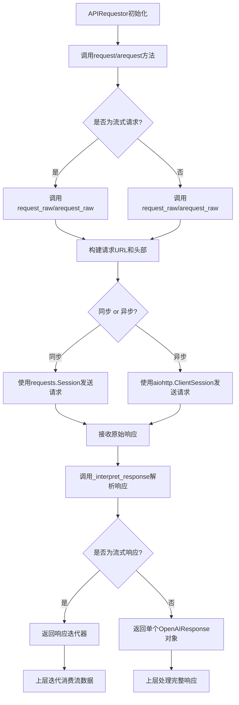

## 类结构

```
APIRequestor (核心请求类)
├── request (同步请求方法)
├── arequest (异步请求方法)
├── request_raw (同步原始请求)
├── arequest_raw (异步原始请求)
├── _prepare_request_raw (请求预处理)
├── _interpret_response (响应解析)
└── _interpret_async_response (异步响应解析)
OpenAIResponse (响应包装类)
├── data (响应数据)
├── _headers (响应头部)
└── decode_asjson (JSON解码)
ApiType (枚举类)
├── AZURE
├── OPEN_AI
└── AZURE_AD
全局辅助函数
├── api_key_to_header
├── log_debug
├── log_info
├── log_warn
├── logfmt
├── _build_api_url
├── _requests_proxies_arg
├── _aiohttp_proxies_arg
├── _make_session
├── parse_stream
├── parse_stream_async
└── aiohttp_session
```

## 全局变量及字段


### `TIMEOUT_SECS`
    
HTTP请求的默认超时时间（秒），用于同步和异步请求的超时设置。

类型：`int`
    


### `MAX_SESSION_LIFETIME_SECS`
    
线程局部会话的最大生命周期（秒），超过此时间会重新创建会话以保持连接健康。

类型：`int`
    


### `MAX_CONNECTION_RETRIES`
    
HTTP适配器的最大连接重试次数，用于处理网络波动导致的连接失败。

类型：`int`
    


### `_thread_context`
    
线程局部存储对象，用于在每个线程中维护独立的HTTP会话和会话创建时间。

类型：`threading.local`
    


### `LLM_LOG`
    
环境变量控制的日志级别，用于决定控制台输出的详细程度（debug/info/其他）。

类型：`str`
    


### `logger`
    
模块级别的日志记录器实例，用于记录OpenAI SDK相关的调试、信息和警告日志。

类型：`logging.Logger`
    


### `OpenAIResponse._headers`
    
HTTP响应头字典，存储从OpenAI API返回的原始响应头信息。

类型：`dict`
    


### `OpenAIResponse.data`
    
HTTP响应体数据，可以是原始字节流或已解析的对象，包含API返回的主要内容。

类型：`Union[bytes, Any]`
    


### `APIRequestor.base_url`
    
API请求的基础URL，用于构建完整的请求端点地址。

类型：`str`
    


### `APIRequestor.api_key`
    
用于身份验证的API密钥，根据API类型被转换为相应的请求头。

类型：`str`
    


### `APIRequestor.api_type`
    
API类型枚举值，决定身份验证头格式和API版本头的使用（如OpenAI、Azure等）。

类型：`ApiType`
    


### `APIRequestor.api_version`
    
API版本字符串，用于OpenAI API类型的版本控制请求头。

类型：`str`
    


### `APIRequestor.organization`
    
组织标识符，用于多组织账户的请求头，以区分不同组织的API使用。

类型：`str`
    
    

## 全局函数及方法

### `api_key_to_header`

一个lambda函数，用于根据API类型（`ApiType`）将API密钥转换为HTTP请求头字典。对于OpenAI和Azure AD类型的API，生成标准的Bearer Token授权头；对于Azure API，则生成使用`api-key`字段的授权头。

参数：

- `api`：`ApiType`，API类型枚举值，决定生成哪种格式的授权头。
- `key`：`str`，API密钥字符串。

返回值：`Dict[str, str]`，包含一个键值对的字典，键为授权头字段名（`"Authorization"`或`"api-key"`），值为格式化后的密钥字符串。

#### 流程图

```mermaid
flowchart TD
    A[开始: api_key_to_header(api, key)] --> B{api 类型?};
    B -- "ApiType.OPEN_AI 或 ApiType.AZURE_AD" --> C[返回 {"Authorization": f"Bearer {key}"}];
    B -- "其他 (ApiType.AZURE)" --> D[返回 {"api-key": f"{key}"}];
    C --> E[结束];
    D --> E;
```

#### 带注释源码

```
# 这是一个lambda函数，根据API类型将API密钥转换为对应的HTTP请求头。
# 参数:
#   api: ApiType枚举，标识API服务提供商类型。
#   key: str，用户的API密钥。
# 返回值:
#   Dict[str, str]: 包含单个键值对的字典，用于HTTP请求的Authorization或api-key头。
api_key_to_header = (
    lambda api, key: {"Authorization": f"Bearer {key}"}  # 对于OpenAI和Azure AD API，使用Bearer Token格式。
    if api in (ApiType.OPEN_AI, ApiType.AZURE_AD)
    else {"api-key": f"{key}"}  # 对于Azure API，使用api-key格式。
)
```

### `_console_log_level`

该函数用于根据环境变量 `LLM_LOG` 的值，确定是否在控制台输出日志以及输出的日志级别。如果 `LLM_LOG` 的值为 "debug" 或 "info"，则返回相应的字符串；否则返回 `None`，表示不在控制台输出日志。

参数：无

返回值：`Optional[str]`，返回日志级别字符串（"debug" 或 "info"）或 `None`。

#### 流程图

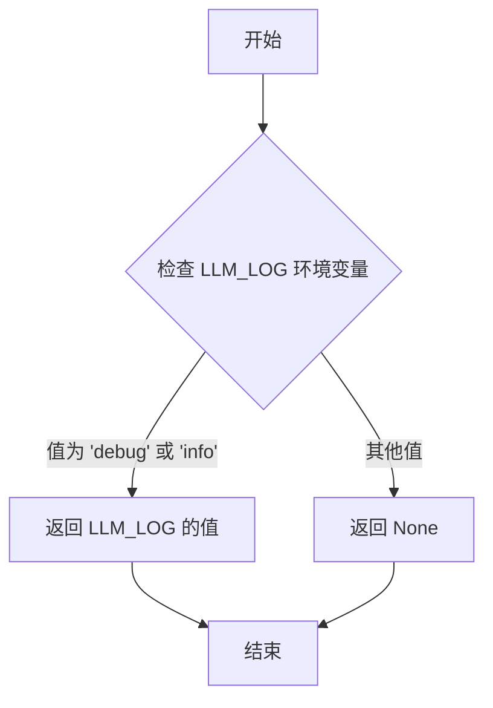

#### 带注释源码

```python
def _console_log_level():
    # 检查环境变量 LLM_LOG 的值
    if LLM_LOG in ["debug", "info"]:
        # 如果值为 "debug" 或 "info"，则返回该值
        return LLM_LOG
    else:
        # 否则返回 None，表示不在控制台输出日志
        return None
```

### `log_debug`

`log_debug` 是一个全局函数，用于输出调试级别的日志信息。它首先将传入的消息和参数格式化为一个结构化的日志字符串，然后根据环境变量 `LLM_LOG` 的设置决定是否将日志输出到标准错误流（stderr），同时也会将日志记录到名为 "openai" 的 Python 日志记录器中。

参数：

- `message`：`str`，要记录的主要日志消息。
- `**params`：`Any`，可选的关键字参数，用于提供额外的上下文信息，这些信息将被格式化为键值对并附加到日志消息中。

返回值：`None`，该函数不返回任何值。

#### 流程图

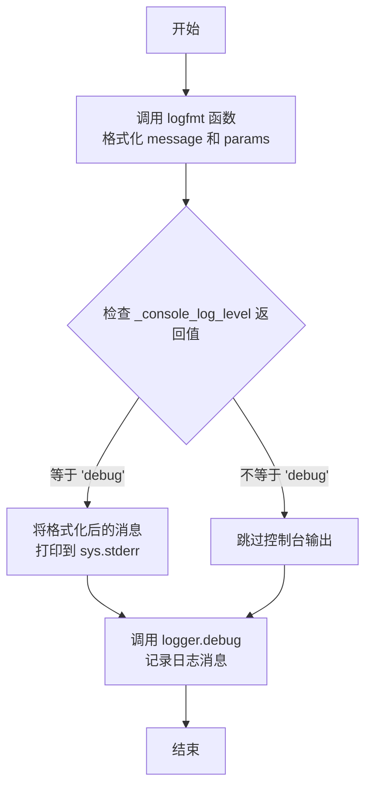

#### 带注释源码

```python
def log_debug(message, **params):
    # 调用 logfmt 函数，将 message 和 params 字典格式化为一个结构化的日志字符串。
    # 格式类似于 "key1=value1 key2=value2 message=your_message"。
    msg = logfmt(dict(message=message, **params))
    
    # 检查全局日志级别设置。_console_log_level() 函数读取环境变量 LLM_LOG。
    # 如果 LLM_LOG 设置为 'debug'，则返回 'debug'，否则返回 None。
    if _console_log_level() == "debug":
        # 如果控制台日志级别是 'debug'，则将格式化后的消息打印到标准错误流。
        print(msg, file=sys.stderr)
    
    # 无论控制台输出如何，都将调试级别的日志消息记录到名为 "openai" 的日志记录器中。
    # 这确保了日志始终会被捕获（例如，写入文件或发送到日志服务），
    # 而控制台输出只是一个可选的、供人阅读的辅助功能。
    logger.debug(msg)
```

### `log_info`

`log_info` 是一个全局函数，用于记录信息级别的日志。它接受一个消息字符串和任意数量的关键字参数，将这些参数格式化为日志字符串，并根据环境变量 `LLM_LOG` 的设置决定是否将日志输出到标准错误流（stderr）。同时，它也会使用 Python 的 `logging` 模块记录信息级别的日志。

参数：

- `message`：`str`，要记录的信息消息。
- `**params`：`Any`，任意数量的关键字参数，用于提供额外的上下文信息。

返回值：`None`，该函数没有返回值。

#### 流程图

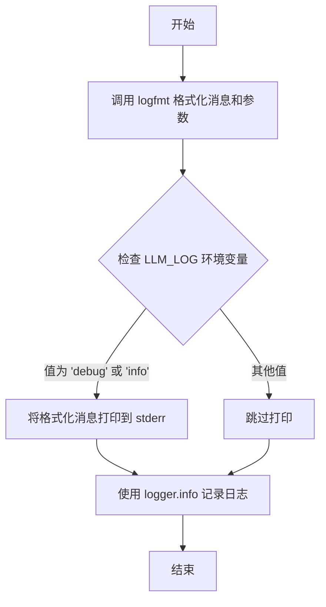

#### 带注释源码

```python
def log_info(message, **params):
    # 调用 logfmt 函数，将消息和额外参数格式化为一个结构化的日志字符串。
    msg = logfmt(dict(message=message, **params))
    # 检查环境变量 LLM_LOG 的值，如果为 'debug' 或 'info'，则将日志消息打印到标准错误流。
    if _console_log_level() in ["debug", "info"]:
        print(msg, file=sys.stderr)
    # 使用配置的 logger 对象记录信息级别的日志。
    logger.info(msg)
```

### `log_warn`

该函数用于记录警告级别的日志信息。它将传入的消息和参数格式化为日志字符串，并同时输出到标准错误流（stderr）和配置的日志记录器（logger）中，确保警告信息在控制台和日志文件中都能被看到。

参数：

- `message`：`str`，要记录的主要警告消息。
- `**params`：`Any`，可变关键字参数，用于提供额外的上下文信息，这些信息将被格式化为键值对并附加到日志消息中。

返回值：`None`，该函数不返回任何值。

#### 流程图

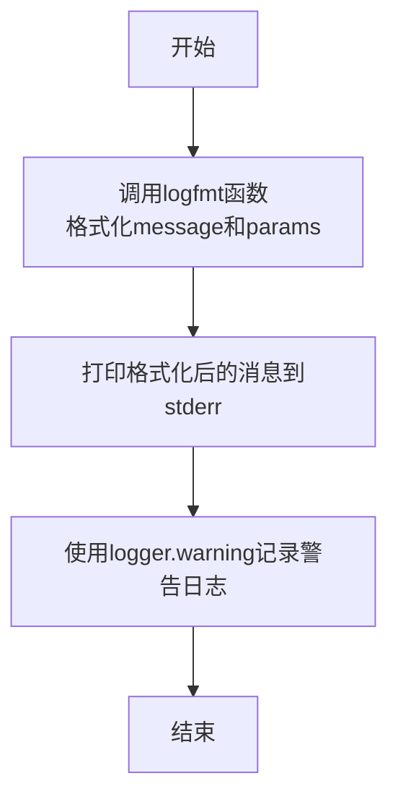

#### 带注释源码

```python
def log_warn(message, **params):
    # 调用logfmt函数，将message和params格式化为一个结构化的日志字符串。
    # logfmt函数会处理键值对，确保它们以“key=value”的形式呈现，并处理包含空格的值。
    msg = logfmt(dict(message=message, **params))
    
    # 将格式化后的消息打印到标准错误流（stderr），确保在控制台中可见。
    print(msg, file=sys.stderr)
    
    # 使用配置的日志记录器（logger）记录警告级别的日志。
    # 这会将日志写入到配置的日志文件或处理程序中。
    logger.warning(msg)
```

### `logfmt`

`logfmt` 函数是一个日志格式化工具，它将一个字典（键值对）转换为符合 `logfmt` 格式的字符串。`logfmt` 是一种简单的日志格式，常用于结构化日志记录，其中每个键值对以 `key=value` 的形式表示，并用空格分隔。该函数会处理键和值中的空格，确保输出的字符串格式正确。

参数：

- `props`：`dict`，包含要格式化的键值对的字典。

返回值：`str`，格式化后的 `logfmt` 字符串。

#### 流程图

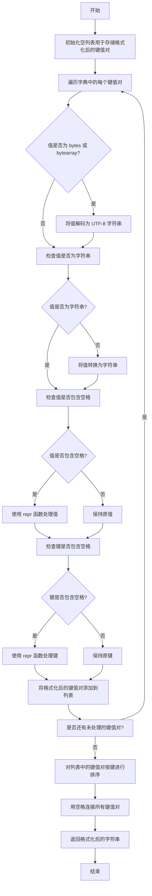

#### 带注释源码

```python
def logfmt(props):
    # 定义一个内部函数 fmt，用于格式化单个键值对
    def fmt(key, val):
        # 处理值是否为 bytes 或 bytearray 类型，如果是则解码为 UTF-8 字符串
        if hasattr(val, "decode"):
            val = val.decode("utf-8")
        # 检查值是否为字符串，如果不是则转换为字符串
        if not isinstance(val, str):
            val = str(val)
        # 如果值中包含空格，使用 repr 函数处理，确保在 logfmt 格式中正确表示
        if re.search(r"\s", val):
            val = repr(val)
        # 键应该已经是字符串，但如果包含空格，同样使用 repr 函数处理
        if re.search(r"\s", key):
            key = repr(key)
        # 返回格式化后的键值对字符串，格式为 key=val
        return "{key}={val}".format(key=key, val=val)

    # 遍历字典中的所有键值对，使用 fmt 函数格式化，并按键排序后连接成字符串
    return " ".join([fmt(key, val) for key, val in sorted(props.items())])
```

### `_build_api_url`

该函数用于构建完整的API URL。它接收一个基础URL和一个查询字符串，将查询字符串与基础URL中可能已存在的查询参数合并，然后返回一个新的完整URL。

参数：

- `url`：`str`，基础URL，可能包含查询参数
- `query`：`str`，要附加到URL的查询字符串

返回值：`str`，合并查询参数后的完整URL

#### 流程图

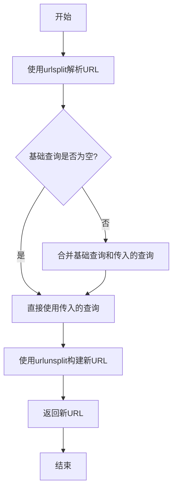

#### 带注释源码

```python
def _build_api_url(url, query):
    # 使用urlsplit将URL拆分为五个部分：scheme, netloc, path, query, fragment
    scheme, netloc, path, base_query, fragment = urlsplit(url)

    # 如果基础URL中已经包含查询参数，则将新查询参数与原有参数合并
    if base_query:
        query = "%s&%s" % (base_query, query)

    # 使用urlunsplit将五个部分重新组合成完整的URL
    return urlunsplit((scheme, netloc, path, query, fragment))
```

### `_requests_proxies_arg`

该函数用于将代理配置参数转换为适合 `requests.request` 方法 `proxies` 参数的格式。它支持字符串类型的代理 URL 和字典类型的代理配置，确保代理设置能够正确应用于 HTTP 和 HTTPS 请求。

参数：

- `proxy`：`Union[str, dict, None]`，代理配置，可以是字符串 URL、字典（包含 'http' 和/或 'https' 键）或 None。

返回值：`Optional[Dict[str, str]]`，返回一个字典，键为协议（'http' 和 'https'），值为代理 URL；如果输入为 None，则返回 None。

#### 流程图

```mermaid
graph TD
    A[开始] --> B{proxy 是否为 None?}
    B -->|是| C[返回 None]
    B -->|否| D{proxy 是否为字符串?}
    D -->|是| E[返回 {'http': proxy, 'https': proxy}]
    D -->|否| F{proxy 是否为字典?}
    F -->|是| G[返回 proxy 的副本]
    F -->|否| H[抛出 ValueError 异常]
```

#### 带注释源码

```python
def _requests_proxies_arg(proxy) -> Optional[Dict[str, str]]:
    """Returns a value suitable for the 'proxies' argument to 'requests.request."""
    if proxy is None:
        # 如果代理为 None，直接返回 None
        return None
    elif isinstance(proxy, str):
        # 如果代理是字符串，将其同时应用于 HTTP 和 HTTPS 协议
        return {"http": proxy, "https": proxy}
    elif isinstance(proxy, dict):
        # 如果代理是字典，返回其副本，避免修改原始配置
        return proxy.copy()
    else:
        # 如果代理既不是字符串也不是字典，抛出异常
        raise ValueError(
            "'openai.proxy' must be specified as either a string URL or a dict with string URL under the https and/or http keys."
        )
```

### `_aiohttp_proxies_arg`

该函数用于处理并转换代理配置，使其适用于 `aiohttp.ClientSession.request` 方法的 `proxies` 参数。它接受不同类型的代理输入（`None`、字符串 URL 或字典），并返回一个字符串形式的代理 URL 或 `None`。

参数：

- `proxy`：`Any`，代理配置，可以是 `None`、字符串 URL 或包含 `'http'` 和/或 `'https'` 键的字典。

返回值：`Optional[str]`，适用于 `aiohttp` 的代理字符串 URL，如果代理为 `None` 则返回 `None`。

#### 流程图

```mermaid
flowchart TD
    A[开始: 输入 proxy] --> B{proxy 类型判断};
    B -- "proxy is None" --> C[返回 None];
    B -- "proxy is str" --> D[返回 proxy 字符串];
    B -- "proxy is dict" --> E{字典中是否有 'https' 键?};
    E -- 是 --> F[返回 proxy['https']];
    E -- 否 --> G[返回 proxy['http']];
    B -- "其他类型" --> H[抛出 ValueError 异常];
    C --> I[结束];
    D --> I;
    F --> I;
    G --> I;
    H --> I;
```

#### 带注释源码

```python
def _aiohttp_proxies_arg(proxy) -> Optional[str]:
    """Returns a value suitable for the 'proxies' argument to 'aiohttp.ClientSession.request."""
    # 如果代理配置为 None，直接返回 None
    if proxy is None:
        return None
    # 如果代理配置是字符串，直接返回该字符串（aiohttp 接受字符串 URL）
    elif isinstance(proxy, str):
        return proxy
    # 如果代理配置是字典，优先返回 'https' 键对应的值，否则返回 'http' 键对应的值
    elif isinstance(proxy, dict):
        return proxy["https"] if "https" in proxy else proxy["http"]
    # 如果代理配置是其他类型，抛出 ValueError 异常，提示用户正确的格式
    else:
        raise ValueError(
            "'openai.proxy' must be specified as either a string URL or a dict with string URL under the https and/or http keys."
        )
```

### `_make_session`

该函数用于创建并配置一个 `requests.Session` 对象，主要用于 HTTP 请求。它配置了会话的适配器，以支持 HTTPS 连接的最大重试次数，确保在网络不稳定时能够自动重试，提高请求的可靠性。

参数：

- 无参数

返回值：`requests.Session`，返回一个配置好的 `requests.Session` 对象，用于执行 HTTP 请求。

#### 流程图

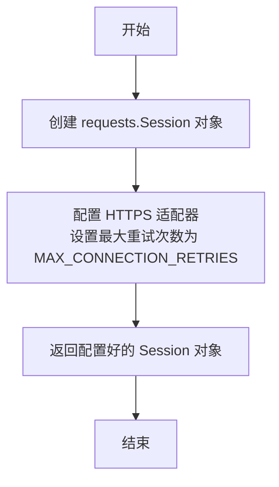

#### 带注释源码

```python
def _make_session() -> requests.Session:
    # 创建一个新的 requests.Session 对象
    s = requests.Session()
    # 为 HTTPS 协议配置适配器，设置最大重试次数为 MAX_CONNECTION_RETRIES
    s.mount(
        "https://",
        requests.adapters.HTTPAdapter(max_retries=MAX_CONNECTION_RETRIES),
    )
    # 返回配置好的 Session 对象
    return s
```

### `parse_stream_helper`

该函数用于解析服务器端事件流（Server-Sent Events, SSE）中的单行数据。它检查传入的字节行是否包含有效的事件数据，并返回解码后的字符串。如果行是流结束标记或无效格式，则返回 `None`。

参数：

- `line`：`bytes`，从事件流中读取的单行字节数据。

返回值：`Optional[str]`，如果行包含有效的事件数据，则返回解码后的字符串；否则返回 `None`。

#### 流程图

```mermaid
flowchart TD
    A[开始] --> B{line 是否为空?}
    B -->|是| C[返回 None]
    B -->|否| D{line 是否为 'data: [DONE]'?}
    D -->|是| E[返回 None]
    D -->|否| F{line 是否以 'data: ' 开头?}
    F -->|是| G[移除 'data: ' 前缀并解码为 UTF-8 字符串]
    G --> H[返回解码后的字符串]
    F -->|否| I[返回 None]
```

#### 带注释源码

```python
def parse_stream_helper(line: bytes) -> Optional[str]:
    if line:  # 检查行是否非空
        if line.strip() == b"data: [DONE]":  # 检查是否为流结束标记
            # 返回 None 会导致 urllib3 中的 GeneratorExit 异常
            # 这将使用 TCP Reset 关闭 HTTP 连接
            return None
        if line.startswith(b"data: "):  # 检查是否以 'data: ' 开头
            line = line[len(b"data: "):]  # 移除 'data: ' 前缀
            return line.decode("utf-8")  # 解码为 UTF-8 字符串并返回
        else:
            return None  # 如果不是有效的事件数据，返回 None
    return None  # 如果行为空，返回 None
```

### `parse_stream`

`parse_stream` 是一个全局函数，用于解析服务器端事件流（Server-Sent Events, SSE）的响应体。它接收一个字节迭代器，逐行处理，提取以 "data: " 开头的行，并解码为 UTF-8 字符串，最终返回一个字符串迭代器。

参数：

- `rbody`：`Iterator[bytes]`，一个字节迭代器，通常来自 HTTP 响应的流式响应体。

返回值：`Iterator[str]`，返回一个字符串迭代器，每个字符串是解析出的有效事件数据行。

#### 流程图

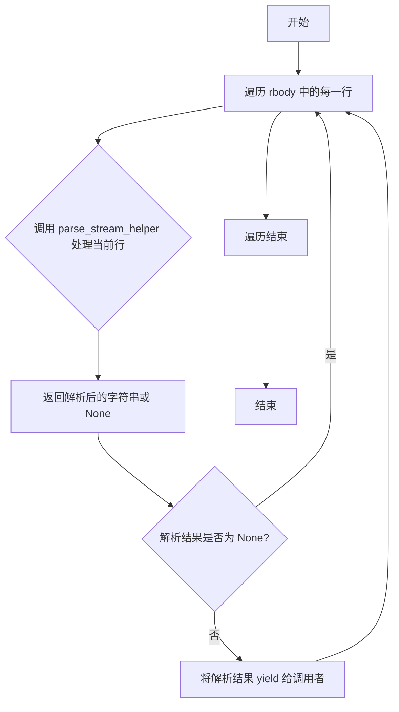

#### 带注释源码

```python
def parse_stream(rbody: Iterator[bytes]) -> Iterator[str]:
    # 遍历响应体中的每一行字节数据
    for line in rbody:
        # 调用辅助函数 parse_stream_helper 处理当前行
        _line = parse_stream_helper(line)
        # 如果辅助函数返回非 None 值（即有效数据行），则将其 yield 给调用者
        if _line is not None:
            yield _line
```

### `parse_stream_async`

`parse_stream_async` 是一个异步生成器函数，用于解析来自 `aiohttp.StreamReader` 的流式响应数据。它逐行读取数据流，过滤掉非数据行和结束标记，并将有效的 JSON 数据行解码为字符串后异步生成。

参数：

- `rbody`：`aiohttp.StreamReader`，表示一个异步的 HTTP 响应体流读取器，用于逐行读取服务器发送的流式数据。

返回值：`AsyncIterator[str]`，一个异步迭代器，每次迭代返回一个从流中解析出的 JSON 字符串（已解码为 UTF-8 字符串）。

#### 流程图

```mermaid
flowchart TD
    A[开始: parse_stream_async(rbody)] --> B{异步迭代 rbody 中的每一行};
    B --> C[读取一行数据 line];
    C --> D{调用 parse_stream_helper(line)};
    D --> E[返回解析后的字符串 _line 或 None];
    E --> F{_line 是否为 None?};
    F -- 是 --> B;
    F -- 否 --> G[异步生成 _line];
    G --> B;
    B -- 流结束 --> H[函数结束];
```

#### 带注释源码

```python
async def parse_stream_async(rbody: aiohttp.StreamReader):
    # 异步迭代流读取器 `rbody` 中的每一行数据。
    async for line in rbody:
        # 调用辅助函数 `parse_stream_helper` 处理当前行。
        # 该函数会检查行是否为有效的数据行（以 "data: " 开头），
        # 并过滤掉流结束标记 "data: [DONE]"。
        _line = parse_stream_helper(line)
        # 如果辅助函数返回了非 None 的值（即有效的 JSON 字符串），
        # 则通过 `yield` 异步生成该字符串。
        if _line is not None:
            yield _line
```

### `aiohttp_session`

这是一个异步上下文管理器，用于创建和管理一个 `aiohttp.ClientSession` 实例。它确保了会话在使用完毕后能够被正确关闭，从而避免资源泄漏。该函数主要用于异步 HTTP 请求，特别是在与 OpenAI API 进行异步交互时，为 `APIRequestor.arequest_raw` 方法提供会话管理。

参数：
- 无显式参数。

返回值：`AsyncIterator[aiohttp.ClientSession]`，返回一个异步迭代器，每次迭代产生一个 `aiohttp.ClientSession` 实例。

#### 流程图

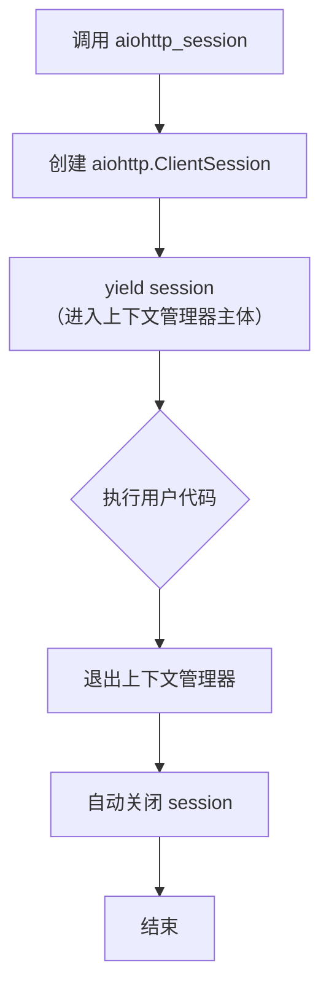

#### 带注释源码

```python
@asynccontextmanager  # 装饰器，将一个异步生成器函数转换为异步上下文管理器
async def aiohttp_session() -> AsyncIterator[aiohttp.ClientSession]:
    """
    异步上下文管理器，用于创建和管理 aiohttp.ClientSession。
    它确保在退出上下文时自动关闭会话，以释放网络连接等资源。
    这是处理异步HTTP请求时的最佳实践。
    """
    async with aiohttp.ClientSession() as session:  # 创建 aiohttp 客户端会话
        yield session  # 将会话对象提供给 `async with` 块内的代码使用
    # 当 `async with` 块执行完毕或发生异常时，上下文管理器会自动调用 `session.close()` 来清理资源。
```

### `ApiType.from_str`

`ApiType.from_str` 是一个静态方法，用于将字符串形式的 API 类型标识符转换为对应的 `ApiType` 枚举值。它支持多种常见的字符串变体（如大小写不敏感、下划线或连字符变体），并在遇到无效输入时抛出 `OpenAIError` 异常。

参数：

- `label`：`str`，表示 API 类型的字符串，例如 `"azure"`、`"openai"` 或 `"azure_ad"`。

返回值：`ApiType`，与输入字符串对应的 `ApiType` 枚举值。

#### 流程图

```mermaid
flowchart TD
    A[开始: 输入字符串 label] --> B{label 转换为小写};
    B --> C{匹配小写字符串};
    C -- "azure" --> D[返回 ApiType.AZURE];
    C -- "azure_ad" 或 "azuread" --> E[返回 ApiType.AZURE_AD];
    C -- "open_ai" 或 "openai" --> F[返回 ApiType.OPEN_AI];
    C -- 其他 --> G[抛出 OpenAIError 异常];
    D --> H[结束];
    E --> H;
    F --> H;
    G --> H;
```

#### 带注释源码

```python
    @staticmethod
    def from_str(label):
        # 将输入字符串转换为小写，以实现大小写不敏感的匹配
        if label.lower() == "azure":
            # 匹配 Azure API 类型
            return ApiType.AZURE
        elif label.lower() in ("azure_ad", "azuread"):
            # 匹配 Azure AD API 类型，支持两种常见变体
            return ApiType.AZURE_AD
        elif label.lower() in ("open_ai", "openai"):
            # 匹配 OpenAI API 类型，支持两种常见变体
            return ApiType.OPEN_AI
        else:
            # 如果输入字符串不匹配任何已知类型，抛出异常
            raise openai.OpenAIError(
                "The API type provided in invalid. Please select one of the supported API types: 'azure', 'azure_ad', 'open_ai'"
            )
```

### `OpenAIResponse.request_id`

这是一个只读属性，用于从HTTP响应头中获取请求的唯一标识符（request-id）。它封装了对内部 `_headers` 字典的访问，提供了一种类型安全且便捷的方式来获取这个常用于追踪和调试的请求ID。

参数：
- 无

返回值：`Optional[str]`，如果响应头中包含 `request-id` 字段，则返回其字符串值；否则返回 `None`。

#### 流程图

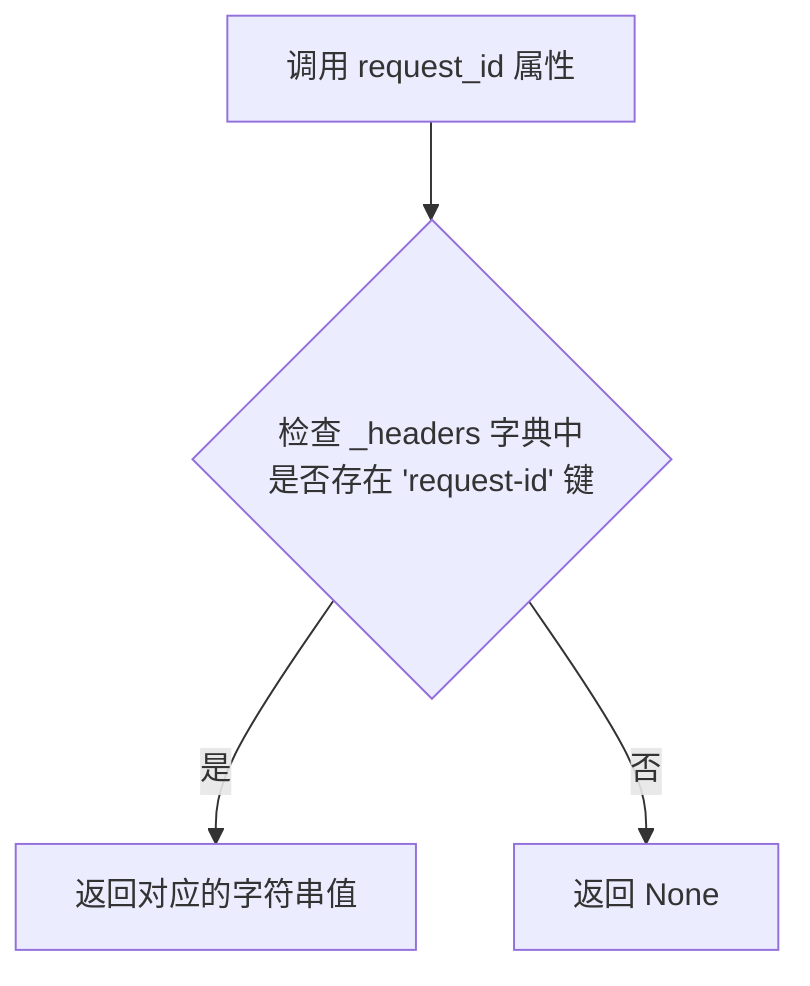

#### 带注释源码

```python
    @property
    def request_id(self) -> Optional[str]:
        # 使用 `get` 方法从 `_headers` 字典中安全地获取 'request-id' 键对应的值。
        # 如果键不存在，`get` 方法将返回 `None`，这与方法的返回类型 `Optional[str]` 一致。
        return self._headers.get("request-id")
```

### `OpenAIResponse.retry_after`

该方法用于从HTTP响应头中提取`retry-after`字段的值，并将其转换为整数。如果该字段不存在或无法转换为整数，则返回`None`。这通常用于处理API速率限制或服务器过载时的重试逻辑。

参数：

- `self`：`OpenAIResponse`，当前`OpenAIResponse`实例，包含响应头和响应数据。

返回值：`Optional[int]`，返回`retry-after`头字段的整数值，如果不存在或转换失败则返回`None`。

#### 流程图

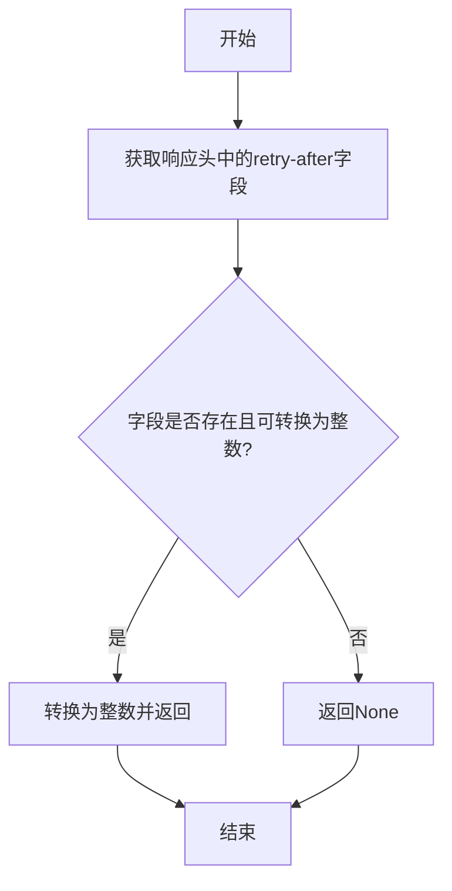

#### 带注释源码

```python
@property
def retry_after(self) -> Optional[int]:
    """
    从响应头中提取retry-after字段的值。
    如果字段存在且可以转换为整数，则返回该整数值；否则返回None。
    """
    try:
        # 尝试从响应头中获取retry-after字段并转换为整数
        return int(self._headers.get("retry-after"))
    except TypeError:
        # 如果字段不存在或转换失败（例如值为None），则返回None
        return None
```

### `OpenAIResponse.operation_location`

这是一个只读属性，用于从HTTP响应头中获取`operation-location`字段的值。该字段通常用于标识异步操作的跟踪URL，客户端可以通过此URL查询异步任务的状态或结果。

参数：
- 无

返回值：`Optional[str]`，如果响应头中包含`operation-location`字段，则返回其字符串值；否则返回`None`。

#### 流程图

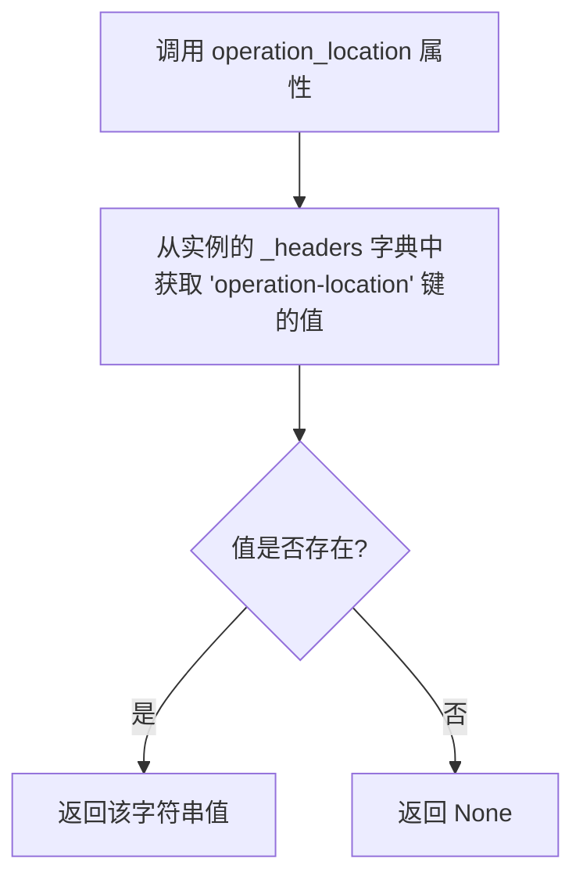

#### 带注释源码

```python
    @property
    def operation_location(self) -> Optional[str]:
        # 使用 `get` 方法从 `_headers` 字典中安全地获取 `operation-location` 键对应的值。
        # 如果键不存在，`get` 方法将返回 `None`。
        return self._headers.get("operation-location")
```

### `OpenAIResponse.organization`

这是一个只读属性，用于从HTTP响应头中获取与请求关联的组织标识符。它封装了对特定响应头`LLM-Organization`的访问，如果该头不存在则返回`None`。

参数：
- `self`：`OpenAIResponse`，当前`OpenAIResponse`实例的引用。

返回值：`Optional[str]`，返回响应头`LLM-Organization`的值（字符串类型），如果该头不存在则返回`None`。

#### 流程图

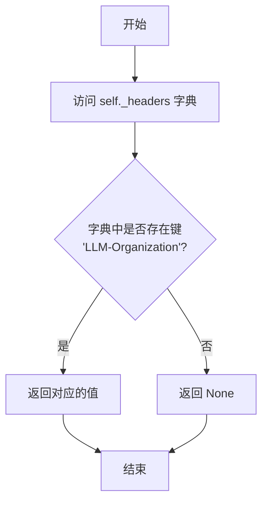

#### 带注释源码

```python
    @property
    def organization(self) -> Optional[str]:
        # 使用 `self._headers` 字典的 `get` 方法安全地获取键为 'LLM-Organization' 的值。
        # 如果键不存在，`get` 方法将返回 `None`。
        return self._headers.get("LLM-Organization")
```

### `OpenAIResponse.response_ms`

这是一个只读属性，用于从HTTP响应头中提取并处理OpenAI API服务器处理请求所花费的时间（以毫秒为单位）。

参数：
- 无（这是一个属性，没有显式参数）

返回值：`Optional[int]`，返回一个整数，表示服务器处理请求的毫秒数。如果响应头中不存在 `Openai-Processing-Ms` 字段或其值为 `None`，则返回 `None`。

#### 流程图

```mermaid
flowchart TD
    A[开始] --> B[从实例的_headers字典中<br>获取'Openai-Processing-Ms'的值]
    B --> C{值是否为None?}
    C -- 是 --> D[返回 None]
    C -- 否 --> E[将字符串值转换为浮点数]
    E --> F[使用round函数对浮点数进行四舍五入]
    F --> G[返回整数结果]
    D --> H[结束]
    G --> H
```

#### 带注释源码

```python
    @property
    def response_ms(self) -> Optional[int]:
        # 从实例的_headers字典中获取'Openai-Processing-Ms'键对应的值
        h = self._headers.get("Openai-Processing-Ms")
        # 如果获取到的值为None，则直接返回None
        # 否则，将字符串值转换为浮点数，并使用round函数进行四舍五入后返回整数
        return None if h is None else round(float(h))
```

### `OpenAIResponse.decode_asjson`

该方法用于将 `OpenAIResponse` 实例中的原始响应数据（`self.data`）解码为 JSON 格式的 Python 字典。它首先检查数据是否为有效的 JSON 对象（以 `{` 开头并以 `}` 结尾），如果是则直接解码；否则，会尝试通过 `parse_stream_helper` 函数处理流式响应数据，然后再进行 JSON 解析。

参数：
- `self`：`OpenAIResponse` 实例，包含需要解码的原始响应数据。

返回值：`Optional[dict]`，如果解码成功则返回 JSON 字典，否则返回 `None`。

#### 流程图

```mermaid
graph TD
    A[开始] --> B{self.data 是否以 '{' 开头并以 '}' 结尾?};
    B -- 是 --> C[将 self.data 解码为 UTF-8 字符串];
    B -- 否 --> D[调用 parse_stream_helper 处理 self.data];
    C --> E[使用 json.loads 解析字符串为字典];
    D --> F{parse_stream_helper 返回结果是否有效?};
    F -- 是 --> E;
    F -- 否 --> G[返回 None];
    E --> H[返回解析后的字典];
    G --> I[结束];
    H --> I;
```

#### 带注释源码

```python
def decode_asjson(self) -> Optional[dict]:
    # 去除 self.data 两端的空白字符
    bstr = self.data.strip()
    # 检查数据是否以 '{' 开头并以 '}' 结尾，即是否为有效的 JSON 对象
    if bstr.startswith(b"{") and bstr.endswith(b"}"):
        # 如果是，将字节串解码为 UTF-8 字符串
        bstr = bstr.decode("utf-8")
    else:
        # 否则，调用 parse_stream_helper 处理流式响应数据
        bstr = parse_stream_helper(bstr)
    # 如果 bstr 不为空，使用 json.loads 解析为字典，否则返回 None
    return json.loads(bstr) if bstr else None
```

### `APIRequestor.request`

该方法用于向 OpenAI API 发起同步 HTTP 请求，支持普通请求和流式响应。它负责构建请求 URL、设置请求头、处理参数和文件上传，并返回解析后的响应对象或响应迭代器。

参数：

- `method`：`str`，HTTP 请求方法（如 "get"、"post"、"put"、"delete"）。
- `url`：`str`，API 端点路径（相对于基础 URL）。
- `params`：`Optional[Dict[str, Any]]`，请求参数，对于 GET/DELETE 请求会编码到 URL 查询字符串中，对于 POST/PUT 请求会作为 JSON 请求体。
- `headers`：`Optional[Dict[str, str]]`，自定义请求头，会与默认请求头合并。
- `files`：`Optional[Dict[str, Any]]`，要上传的文件，用于 multipart/form-data 请求。
- `stream`：`bool`，是否启用流式响应，默认为 False。
- `request_id`：`Optional[str]`，自定义请求 ID，会添加到请求头中。
- `request_timeout`：`Optional[Union[float, Tuple[float, float]]]`，请求超时时间（秒），可以是单个浮点数（总超时）或元组（连接超时，总超时）。

返回值：`Tuple[Union[OpenAIResponse, Iterator[OpenAIResponse]], bool, str]`，返回一个三元组，包含：
  1. 响应对象（`OpenAIResponse`）或响应迭代器（`Iterator[OpenAIResponse]`，当 `stream=True` 时）。
  2. 布尔值，表示是否为流式响应。
  3. 字符串，使用的 API 密钥。

#### 流程图

```mermaid
flowchart TD
    A[开始] --> B[调用 request_raw 方法]
    B --> C{是否流式请求?}
    C -- 是 --> D[返回响应迭代器]
    C -- 否 --> E[返回单个响应对象]
    D --> F[返回三元组<br>响应迭代器, True, API密钥]
    E --> G[返回三元组<br>响应对象, False, API密钥]
    F --> H[结束]
    G --> H
```

#### 带注释源码

```python
def request(
    self,
    method,
    url,
    params=None,
    headers=None,
    files=None,
    stream: bool = False,
    request_id: Optional[str] = None,
    request_timeout: Optional[Union[float, Tuple[float, float]]] = None,
) -> Tuple[Union[OpenAIResponse, Iterator[OpenAIResponse]], bool, str]:
    # 调用 request_raw 方法发送原始 HTTP 请求
    result = self.request_raw(
        method.lower(),
        url,
        params=params,
        supplied_headers=headers,
        files=files,
        stream=stream,
        request_id=request_id,
        request_timeout=request_timeout,
    )
    # 解析原始响应，判断是否为流式响应
    resp, got_stream = self._interpret_response(result, stream)
    # 返回解析后的响应、流式标志和 API 密钥
    return resp, got_stream, self.api_key
```

### `APIRequestor.arequest`

异步执行HTTP请求到OpenAI API，支持流式和非流式响应。它负责构建请求、发送请求、处理响应，并管理异步HTTP会话的生命周期。对于流式响应，它会返回一个异步生成器；对于非流式响应，它会返回一个`OpenAIResponse`对象。

参数：

- `method`：`str`，HTTP方法，如"get"、"post"等。
- `url`：`str`，请求的URL路径（相对于base_url）。
- `params`：`Optional[Dict[str, Any]]`，请求参数，对于GET/DELETE请求会编码到URL中，对于POST/PUT请求会作为JSON body。
- `headers`：`Optional[Dict[str, str]]`，自定义请求头，会与默认头合并。
- `files`：`Optional[Dict[str, Any]]`，要上传的文件，用于multipart/form-data请求。
- `stream`：`bool`，是否以流式方式接收响应。默认为False。
- `request_id`：`Optional[str]`，自定义请求ID，会添加到请求头中。
- `request_timeout`：`Optional[Union[float, Tuple[float, float]]]`，请求超时时间。可以是总超时时间（秒），或一个(连接超时, 总超时)的元组。

返回值：`Tuple[Union[OpenAIResponse, AsyncGenerator[OpenAIResponse, None]], bool, str]`，返回一个三元组，包含：1) 响应对象（非流式）或异步生成器（流式），2) 布尔值表示是否为流式响应，3) 使用的API密钥。

#### 流程图

```mermaid
flowchart TD
    A[开始: arequest] --> B[创建aiohttp会话]
    B --> C[调用arequest_raw发送请求]
    C --> D{请求是否成功?}
    D -- 是 --> E[调用_interpret_async_response解析响应]
    D -- 否 --> F[关闭会话并抛出异常]
    F --> G[结束]
    E --> H{是否为流式响应?}
    H -- 是 --> I[创建包装的异步生成器]
    I --> J[返回生成器, True, api_key]
    H -- 否 --> K[关闭会话]
    K --> L[返回OpenAIResponse, False, api_key]
    J --> M[结束]
    L --> M
```

#### 带注释源码

```python
async def arequest(
    self,
    method,
    url,
    params=None,
    headers=None,
    files=None,
    stream: bool = False,
    request_id: Optional[str] = None,
    request_timeout: Optional[Union[float, Tuple[float, float]]] = None,
) -> Tuple[Union[OpenAIResponse, AsyncGenerator[OpenAIResponse, None]], bool, str]:
    # 使用异步上下文管理器创建并管理aiohttp会话的生命周期
    ctx = aiohttp_session()
    session = await ctx.__aenter__()
    try:
        # 调用arequest_raw方法发送原始HTTP请求，获取aiohttp.ClientResponse对象
        result = await self.arequest_raw(
            method.lower(),
            url,
            session,
            params=params,
            supplied_headers=headers,
            files=files,
            request_id=request_id,
            request_timeout=request_timeout,
        )
        # 解析原始响应，根据stream参数决定返回单个响应还是异步生成器
        resp, got_stream = await self._interpret_async_response(result, stream)
    except Exception:
        # 如果发生任何异常，确保关闭aiohttp会话，然后重新抛出异常
        await ctx.__aexit__(None, None, None)
        raise
    if got_stream:
        # 如果是流式响应，resp是一个异步生成器。创建一个包装函数，
        # 在生成器耗尽或发生异常时，确保关闭aiohttp会话。
        async def wrap_resp():
            assert isinstance(resp, AsyncGenerator)
            try:
                async for r in resp:
                    yield r
            finally:
                await ctx.__aexit__(None, None, None)

        # 返回包装后的生成器、流式标志和API密钥
        return wrap_resp(), got_stream, self.api_key
    else:
        # 如果是非流式响应，直接关闭会话，然后返回响应对象、流式标志和API密钥
        await ctx.__aexit__(None, None, None)
        return resp, got_stream, self.api_key
```

### `APIRequestor.request_headers`

该方法用于构建并返回发送到 OpenAI API 的 HTTP 请求头。它整合了用户代理信息、API 密钥、组织标识、API 版本以及自定义的额外请求头，确保请求符合 OpenAI 的接口规范。

参数：

- `method`：`str`，HTTP 请求方法（例如 "GET"、"POST"），用于构建用户代理字符串。
- `extra`：`Dict[str, str]`，需要添加到请求头中的额外键值对。
- `request_id`：`Optional[str]`，可选的请求标识符，如果提供，会添加到请求头中。

返回值：`Dict[str, str]`，一个包含所有必要请求头的字典。

#### 流程图

```mermaid
flowchart TD
    A[开始] --> B[构建基础用户代理信息]
    B --> C[添加API密钥认证头]
    C --> D{是否存在组织标识?}
    D -- 是 --> E[添加组织头]
    D -- 否 --> F{是否为OpenAI API类型且<br>存在API版本?}
    E --> F
    F -- 是 --> G[添加API版本头]
    F -- 否 --> H{是否存在请求ID?}
    G --> H
    H -- 是 --> I[添加请求ID头]
    H -- 否 --> J[合并额外请求头]
    I --> J
    J --> K[返回请求头字典]
    K --> L[结束]
```

#### 带注释源码

```python
def request_headers(self, method: str, extra, request_id: Optional[str]) -> Dict[str, str]:
    # 构建用户代理字符串，包含SDK版本
    user_agent = "LLM/v1 PythonBindings/%s" % (version.VERSION,)

    # 获取系统信息（排除节点名），用于构建详细的用户代理元数据
    uname_without_node = " ".join(v for k, v in platform.uname()._asdict().items() if k != "node")
    ua = {
        "bindings_version": version.VERSION,
        "httplib": "requests",          # 使用的HTTP库
        "lang": "python",               # 编程语言
        "lang_version": platform.python_version(), # Python版本
        "platform": platform.platform(), # 操作系统平台
        "publisher": "openai",          # 发布者
        "uname": uname_without_node,    # 系统信息
    }

    # 初始化基础请求头
    headers = {
        "X-LLM-Client-User-Agent": json.dumps(ua), # 客户端用户代理信息（JSON格式）
        "User-Agent": user_agent,                  # 标准用户代理字符串
    }
    # 如果存在API密钥，根据API类型添加相应的认证头
    if self.api_key:
        headers.update(api_key_to_header(self.api_type, self.api_key))

    # 如果存在组织标识，添加到请求头
    if self.organization:
        headers["LLM-Organization"] = self.organization

    # 如果是OpenAI API类型且指定了API版本，添加版本头
    if self.api_version is not None and self.api_type == ApiType.OPEN_AI:
        headers["LLM-Version"] = self.api_version
    # 如果提供了请求ID，添加到请求头
    if request_id is not None:
        headers["X-Request-Id"] = request_id
    # 合并调用者提供的额外请求头
    headers.update(extra)

    return headers
```

### `APIRequestor._validate_headers`

该方法用于验证并处理传入的HTTP请求头字典。它确保传入的`supplied_headers`是一个字典，并且其中的键和值都是字符串类型。如果验证通过，它会返回一个经过清理的头部字典；如果验证失败，则会抛出`TypeError`异常。

参数：

- `supplied_headers`：`Optional[Dict[str, str]]`，传入的HTTP请求头字典，可以为None。

返回值：`Dict[str, str]`，返回一个经过验证的HTTP请求头字典，如果传入的`supplied_headers`为None，则返回空字典。

#### 流程图

```mermaid
flowchart TD
    A[开始] --> B{检查 supplied_headers 是否为 None?}
    B -->|是| C[返回空字典]
    B -->|否| D{检查 supplied_headers 是否为字典?}
    D -->|否| E[抛出 TypeError 异常]
    D -->|是| F[遍历 supplied_headers 的键值对]
    F --> G{检查键是否为字符串?}
    G -->|否| H[抛出 TypeError 异常]
    G -->|是| I{检查值是否为字符串?}
    I -->|否| J[抛出 TypeError 异常]
    I -->|是| K[将键值对添加到 headers 字典]
    K --> F
    F --> L[遍历结束]
    L --> M[返回 headers 字典]
    M --> N[结束]
```

#### 带注释源码

```python
def _validate_headers(self, supplied_headers: Optional[Dict[str, str]]) -> Dict[str, str]:
    # 初始化一个空字典用于存储验证后的头部
    headers: Dict[str, str] = {}
    # 如果传入的头部为None，直接返回空字典
    if supplied_headers is None:
        return headers

    # 检查传入的头部是否为字典类型，如果不是则抛出TypeError异常
    if not isinstance(supplied_headers, dict):
        raise TypeError("Headers must be a dictionary")

    # 遍历传入头部的所有键值对
    for k, v in supplied_headers.items():
        # 检查键是否为字符串类型，如果不是则抛出TypeError异常
        if not isinstance(k, str):
            raise TypeError("Header keys must be strings")
        # 检查值是否为字符串类型，如果不是则抛出TypeError异常
        if not isinstance(v, str):
            raise TypeError("Header values must be strings")
        # 将验证通过的键值对添加到headers字典中
        headers[k] = v

    # 注意：这里可以进行更多的头部验证，但由于用户可能手动向API发送无效头部，
    # 因此服务器端也需要处理这些情况。

    # 返回验证后的头部字典
    return headers
```

### `APIRequestor._prepare_request_raw`

该方法负责准备HTTP请求的原始数据，包括构建完整的请求URL、设置请求头以及序列化请求体数据。它根据HTTP方法（GET、DELETE、POST、PUT）的不同，对参数进行相应的处理，并最终返回请求所需的URL、头部和数据。

参数：

- `url`：`str`，请求的相对路径或端点。
- `supplied_headers`：`Optional[Dict[str, str]]`，外部提供的额外请求头。
- `method`：`str`，HTTP方法，如"get"、"post"、"put"、"delete"。
- `params`：`Optional[Dict[str, Any]]`，请求参数，可以是查询参数或请求体数据。
- `files`：`Optional[Dict[str, Any]]`，上传的文件数据。
- `request_id`：`Optional[str]`，可选的请求ID，用于跟踪请求。

返回值：`Tuple[str, Dict[str, str], Optional[bytes]]`，返回一个三元组，包含完整的请求URL、请求头字典和可选的请求体数据（字节形式）。

#### 流程图

```mermaid
graph TD
    A[开始] --> B[构建完整URL]
    B --> C{验证请求头}
    C --> D[初始化数据为None]
    D --> E{判断HTTP方法}
    E -- GET/DELETE --> F[参数编码到URL]
    E -- POST/PUT --> G{是否有文件上传?}
    G -- 是 --> H[数据为参数]
    G -- 否 --> I[序列化参数为JSON]
    I --> J[设置Content-Type为application/json]
    F --> K[生成最终请求头]
    H --> K
    J --> K
    K --> L[返回URL, 头部, 数据]
    L --> M[结束]
```

#### 带注释源码

```python
def _prepare_request_raw(
    self,
    url,
    supplied_headers,
    method,
    params,
    files,
    request_id: Optional[str],
) -> Tuple[str, Dict[str, str], Optional[bytes]]:
    # 构建完整的请求URL，基于基础URL和提供的相对路径
    abs_url = "%s%s" % (self.base_url, url)
    # 验证并处理外部提供的请求头
    headers = self._validate_headers(supplied_headers)

    # 初始化请求体数据为None
    data = None
    # 根据HTTP方法处理参数
    if method == "get" or method == "delete":
        # 对于GET和DELETE请求，将参数编码到URL查询字符串中
        if params:
            encoded_params = urlencode([(k, v) for k, v in params.items() if v is not None])
            abs_url = _build_api_url(abs_url, encoded_params)
    elif method in {"post", "put"}:
        # 对于POST和PUT请求，如果有文件上传，则参数作为表单数据
        if params and files:
            data = params
        # 如果没有文件上传，则将参数序列化为JSON作为请求体
        if params and not files:
            data = json.dumps(params).encode()
            headers["Content-Type"] = "application/json"
    else:
        # 如果是不支持的HTTP方法，抛出异常
        raise openai.APIConnectionError(
            message=f"Unrecognized HTTP method {method}. This may indicate a bug in the LLM bindings.",
            request=None,
        )

    # 生成最终的请求头，包括认证信息、用户代理等
    headers = self.request_headers(method, headers, request_id)

    # 返回构建好的请求URL、请求头和请求体数据
    return abs_url, headers, data
```

### `APIRequestor.request_raw`

该方法负责执行同步的HTTP请求，是`APIRequestor`类中处理底层网络通信的核心方法。它根据给定的参数（如方法、URL、请求头、数据体等）构建并发送HTTP请求，处理会话管理、超时和代理设置，并返回原始的`requests.Response`对象。该方法内部管理线程局部存储中的会话，以复用连接并控制会话生命周期。

参数：

- `method`：`str`，HTTP请求方法，如`'get'`、`'post'`、`'put'`、`'delete'`。
- `url`：`str`，请求的相对路径，将与`base_url`拼接成完整URL。
- `params`：`Optional[Dict[str, Any]]`，请求参数，对于GET/DELETE请求将编码到URL查询字符串中，对于POST/PUT请求将作为JSON数据体。
- `supplied_headers`：`Optional[Dict[str, str]]`，用户提供的额外请求头，将与默认请求头合并。
- `files`：`Optional[Any]`，需要上传的文件，用于multipart/form-data请求。
- `stream`：`bool`，指示是否以流模式接收响应。若为`True`，响应体将作为流式迭代器返回。
- `request_id`：`Optional[str]`，用于请求追踪的ID，将添加到请求头`X-Request-Id`中。
- `request_timeout`：`Optional[Union[float, Tuple[float, float]]]`，请求超时时间（秒）。可以是单个浮点数（总超时）或元组（连接超时，总超时）。若未提供，使用默认的`TIMEOUT_SECS`。

返回值：`requests.Response`，返回原始的HTTP响应对象，包含状态码、响应头和响应体等信息。

#### 流程图

```mermaid
graph TD
    A[开始] --> B[调用 _prepare_request_raw 准备请求]
    B --> C{检查线程局部存储中是否有会话}
    C -->|无| D[创建新会话并记录创建时间]
    C -->|有| E{会话是否过期?}
    E -->|是| F[关闭旧会话，创建新会话并记录时间]
    E -->|否| G[使用现有会话]
    D --> H
    F --> H
    G --> H[使用会话发送请求]
    H --> I{请求是否成功?}
    I -->|是| J[返回响应对象]
    I -->|超时| K[抛出 APITimeoutError]
    I -->|其他异常| L[抛出 APIConnectionError]
    K --> M[结束]
    L --> M
    J --> M
```

#### 带注释源码

```python
def request_raw(
    self,
    method,
    url,
    *,
    params=None,
    supplied_headers: Optional[Dict[str, str]] = None,
    files=None,
    stream: bool = False,
    request_id: Optional[str] = None,
    request_timeout: Optional[Union[float, Tuple[float, float]]] = None,
) -> requests.Response:
    # 1. 准备请求：构建完整URL、请求头和请求体数据
    abs_url, headers, data = self._prepare_request_raw(url, supplied_headers, method, params, files, request_id)

    # 2. 会话管理：使用线程局部存储(_thread_context)来管理requests.Session
    #    检查当前线程是否已有会话，若无则创建。
    if not hasattr(_thread_context, "session"):
        _thread_context.session = _make_session()
        _thread_context.session_create_time = time.time()
    #    若会话存在但已超过最大生命周期(MAX_SESSION_LIFETIME_SECS)，则关闭旧会话并创建新会话。
    elif time.time() - getattr(_thread_context, "session_create_time", 0) >= MAX_SESSION_LIFETIME_SECS:
        _thread_context.session.close()
        _thread_context.session = _make_session()
        _thread_context.session_create_time = time.time()

    try:
        # 3. 发送请求：使用配置好的会话发送HTTP请求。
        #    - method: HTTP方法
        #    - abs_url: 完整的请求URL
        #    - headers: 合并后的请求头
        #    - data: 请求体数据（对于POST/PUT）
        #    - files: 上传的文件
        #    - stream: 是否流式传输响应
        #    - timeout: 请求超时设置
        #    - proxies: 代理设置（从会话中获取）
        result = _thread_context.session.request(
            method,
            abs_url,
            headers=headers,
            data=data,
            files=files,
            stream=stream,
            timeout=request_timeout if request_timeout else TIMEOUT_SECS,
            proxies=_thread_context.session.proxies,
        )
    # 4. 异常处理：捕获并转换requests库可能抛出的异常为OpenAI SDK定义的错误类型。
    except requests.exceptions.Timeout as e:
        # 请求超时异常
        raise openai.APITimeoutError("Request timed out: {}".format(e)) from e
    except requests.exceptions.RequestException as e:
        # 其他请求相关异常（如连接错误）
        raise openai.APIConnectionError(message="Error communicating with LLM: {}".format(e), request=None) from e
    # 5. 返回原始响应对象。
    #    （注：原代码中的日志调试语句被注释掉了）
    # log_debug(
    #     "LLM API response",
    #     path=abs_url,
    #     response_code=result.status_code,
    #     processing_ms=result.headers.get("LLM-Processing-Ms"),
    #     request_id=result.headers.get("X-Request-Id"),
    # )
    return result
```

### `APIRequestor.arequest_raw`

`APIRequestor.arequest_raw` 是 `APIRequestor` 类的异步方法，用于向 OpenAI API 发送异步 HTTP 请求。它负责构建请求 URL、设置请求头、处理请求参数和文件，并通过 `aiohttp` 会话发送请求。该方法还处理请求超时和网络错误，将底层异常转换为 OpenAI SDK 定义的异常类型。

参数：

- `method`：`str`，HTTP 请求方法（如 "get"、"post"、"put"、"delete"）。
- `url`：`str`，API 端点路径（相对于基础 URL）。
- `session`：`aiohttp.ClientSession`，用于发送 HTTP 请求的异步会话对象。
- `params`：`Optional[Dict[str, Any]]`，请求参数，对于 GET/DELETE 请求会编码到 URL 查询字符串中，对于 POST/PUT 请求会作为 JSON 请求体。
- `supplied_headers`：`Optional[Dict[str, str]]`，用户提供的额外请求头，会与默认请求头合并。
- `files`：`Optional[Dict[str, Any]]`，要上传的文件，用于 multipart/form-data 请求。
- `request_id`：`Optional[str]`，可选的请求 ID，会添加到请求头中用于跟踪。
- `request_timeout`：`Optional[Union[float, Tuple[float, float]]]`，请求超时时间。可以是单个浮点数（总超时）或元组（连接超时, 总超时）。

返回值：`aiohttp.ClientResponse`，返回 `aiohttp` 库的原始响应对象，包含状态码、响应头和响应体等。

#### 流程图

```mermaid
graph TD
    A[开始] --> B[调用 _prepare_request_raw 准备请求]
    B --> C{是否传入了文件?}
    C -->|是| D[使用 requests 私有方法编码文件和数据]
    D --> E[设置 Content-Type 为 multipart/form-data]
    C -->|否| F[直接使用 data 和 headers]
    E --> G[构建请求参数字典]
    F --> G
    G --> H[发送异步请求]
    H --> I{请求是否成功?}
    I -->|是| J[返回 aiohttp.ClientResponse]
    I -->|超时| K[抛出 APITimeoutError]
    I -->|其他网络错误| L[抛出 APIConnectionError]
    K --> M[结束]
    L --> M
    J --> M
```

#### 带注释源码

```python
async def arequest_raw(
    self,
    method,
    url,
    session,
    *,
    params=None,
    supplied_headers: Optional[Dict[str, str]] = None,
    files=None,
    request_id: Optional[str] = None,
    request_timeout: Optional[Union[float, Tuple[float, float]]] = None,
) -> aiohttp.ClientResponse:
    # 调用内部方法准备请求的绝对URL、请求头和请求体数据
    abs_url, headers, data = self._prepare_request_raw(url, supplied_headers, method, params, files, request_id)

    # 处理请求超时参数，支持总超时或（连接超时，总超时）两种格式
    if isinstance(request_timeout, tuple):
        timeout = aiohttp.ClientTimeout(
            connect=request_timeout[0],
            total=request_timeout[1],
        )
    else:
        timeout = aiohttp.ClientTimeout(total=request_timeout or TIMEOUT_SECS)

    # 如果请求包含文件，需要特殊处理为 multipart/form-data 格式
    if files:
        # TODO: 未来应使用 `aiohttp.MultipartWriter` 来构建 multipart 数据
        # 当前使用 requests 库的私有方法进行编码，这是一个临时的实现方式
        data, content_type = requests.models.RequestEncodingMixin._encode_files(files, data)  # type: ignore
        headers["Content-Type"] = content_type  # 设置正确的 Content-Type

    # 构建请求参数字典
    request_kwargs = {
        "method": method,
        "url": abs_url,
        "headers": headers,
        "data": data,
        "timeout": timeout,
    }
    try:
        # 使用传入的 aiohttp 会话发送异步请求
        result = await session.request(**request_kwargs)
        return result  # 返回原始的 aiohttp 响应对象
    except (aiohttp.ServerTimeoutError, asyncio.TimeoutError) as e:
        # 捕获超时异常，转换为 SDK 定义的 APITimeoutError
        raise openai.APITimeoutError("Request timed out") from e
    except aiohttp.ClientError as e:
        # 捕获其他 aiohttp 客户端错误，转换为 SDK 定义的 APIConnectionError
        raise openai.APIConnectionError(message="Error communicating with LLM", request=None) from e
```

### `APIRequestor._interpret_response`

该方法负责解析HTTP响应，根据响应状态码和内容类型（是否流式响应）返回适当的响应对象。它处理成功响应、错误响应以及流式与非流式响应的区分。

参数：

- `result`：`requests.Response`，原始的HTTP响应对象，包含状态码、头部和响应体。
- `stream`：`bool`，指示请求是否为流式请求的标志。

返回值：`Tuple[Union[OpenAIResponse, Iterator[OpenAIResponse]], bool]`，返回一个元组，第一个元素是响应对象（单个响应或响应迭代器），第二个元素是布尔值，指示是否为流式响应。

#### 流程图

```mermaid
flowchart TD
    A[开始] --> B{检查响应状态码}
    B -- 200 <= 状态码 < 300 --> C{是否为流式响应?}
    B -- 状态码 >= 300 --> D[抛出APIError异常]
    C -- 是 --> E[返回流式响应迭代器]
    C -- 否 --> F[返回单个OpenAIResponse对象]
    E --> G[结束]
    F --> G
    D --> G
```

#### 带注释源码

```python
def _interpret_response(
    self, result: requests.Response, stream: bool
) -> Tuple[Union[OpenAIResponse, Iterator[OpenAIResponse]], bool]:
    """Returns the response(s) and a bool indicating whether it is a stream."""
    # 检查响应状态码，如果状态码在200到299之间，表示成功
    if result.status_code < 200 or result.status_code >= 300:
        # 如果状态码不在成功范围内，抛出APIError异常
        raise openai.APIError(
            message=f"API request failed with status code {result.status_code}",
            request=None,
            code=result.status_code,
        )
    # 检查响应内容类型是否为流式响应
    content_type = result.headers.get("content-type", "")
    if stream and "text/event-stream" in content_type:
        # 如果是流式响应，返回一个响应迭代器
        return (self._interpret_response_line(line, result.status_code, result.headers, stream) for line in parse_stream(result.iter_lines())), True
    else:
        # 如果是非流式响应，返回单个OpenAIResponse对象
        return OpenAIResponse(result.content, result.headers), False
```

### `APIRequestor._interpret_async_response`

该方法用于异步解析从 OpenAI API 返回的 HTTP 响应。它根据响应的状态码和内容类型，决定是返回一个单一的 `OpenAIResponse` 对象，还是一个异步生成器（用于流式响应）。该方法还处理错误响应，将其转换为适当的异常。

参数：

- `result`：`aiohttp.ClientResponse`，从 `aiohttp` 请求返回的原始 HTTP 响应对象。
- `stream`：`bool`，指示是否期望流式响应。

返回值：`Tuple[Union[OpenAIResponse, AsyncGenerator[OpenAIResponse, None]], bool]`，返回一个元组，包含解析后的响应（或响应生成器）和一个布尔值，指示是否为流式响应。

#### 流程图

```mermaid
graph TD
    A[开始] --> B{stream 是否为 True?};
    B -- 是 --> C{响应状态码是否为 200?};
    B -- 否 --> D{响应状态码是否为 200?};
    C -- 是 --> E[返回异步生成器];
    C -- 否 --> F[抛出异常];
    D -- 是 --> G[返回 OpenAIResponse 对象];
    D -- 否 --> F;
    E --> H[结束];
    F --> H;
    G --> H;
```

#### 带注释源码

```python
async def _interpret_async_response(
    self, result: aiohttp.ClientResponse, stream: bool
) -> Tuple[Union[OpenAIResponse, AsyncGenerator[OpenAIResponse, None]], bool]:
    """Returns the response(s) and a bool indicating whether it is a stream."""
    # 检查响应状态码，如果不是 200，则抛出异常
    if result.status != 200:
        # 读取响应体并解析为 JSON
        body = (await result.read()).decode("utf-8")
        rbody = json.loads(body) if body else {}
        # 抛出 OpenAIError 异常，包含错误信息
        raise openai.OpenAIError(
            message=rbody.get("error", {}).get("message", "Unknown error"),
            code=result.status,
            response=rbody,
        )
    # 获取响应头
    headers = dict(result.headers)
    # 如果期望流式响应
    if stream:
        # 检查响应内容类型是否为 text/event-stream
        if not result.headers.get("Content-Type", "").startswith("text/event-stream"):
            # 如果不是，抛出 APIConnectionError 异常
            raise openai.APIConnectionError(
                message="Stream response expected but received non-stream response",
                request=None,
            )
        # 定义异步生成器函数
        async def generate() -> AsyncGenerator[OpenAIResponse, None]:
            # 异步解析流式响应
            async for line in parse_stream_async(result.content):
                # 解析每一行数据
                parsed_line = json.loads(line) if line else {}
                # 生成 OpenAIResponse 对象
                yield OpenAIResponse(data=parsed_line, headers=headers)
        # 返回生成器和 True（表示是流式响应）
        return generate(), True
    else:
        # 如果不是流式响应，读取整个响应体
        body = await result.read()
        # 创建 OpenAIResponse 对象
        resp = OpenAIResponse(data=body, headers=headers)
        # 返回响应对象和 False（表示不是流式响应）
        return resp, False
```

### `APIRequestor._interpret_response_line`

该方法用于解析HTTP响应中的单行数据，根据响应状态码和内容构建并返回一个`OpenAIResponse`对象。它处理常规响应和流式响应，确保数据格式正确，并提取响应头信息。

参数：

- `rbody`：`str`，响应体内容，通常是JSON字符串或流式数据块。
- `rcode`：`int`，HTTP响应状态码。
- `rheaders`：`dict`，响应头信息。
- `stream`：`bool`，指示是否为流式响应。

返回值：`OpenAIResponse`，包含解析后的响应数据和头信息。

#### 流程图

```mermaid
graph TD
    A[开始] --> B{是否为流式响应?}
    B -- 是 --> C{响应体是否以'data: '开头?}
    C -- 是 --> D[移除'data: '前缀]
    C -- 否 --> E[保持原样]
    D --> F[解码为UTF-8字符串]
    E --> F
    B -- 否 --> G[直接使用响应体]
    F --> H[构建OpenAIResponse对象]
    G --> H
    H --> I[返回OpenAIResponse对象]
```

#### 带注释源码

```python
def _interpret_response_line(self, rbody: str, rcode: int, rheaders, stream: bool) -> OpenAIResponse:
    # 如果是流式响应，需要处理可能的'data: '前缀
    if stream:
        if rbody.startswith("data: "):
            # 移除流式响应中的'data: '前缀
            rbody = rbody[len("data: "):]
        # 将响应体解码为UTF-8字符串（如果尚未解码）
        rbody = rbody.encode("utf-8") if isinstance(rbody, str) else rbody
    else:
        # 非流式响应，直接使用原始响应体
        rbody = rbody.encode("utf-8") if isinstance(rbody, str) else rbody

    # 构建并返回OpenAIResponse对象，包含响应体和头信息
    return OpenAIResponse(rbody, rheaders)
```

## 关键组件


### API请求器 (APIRequestor)

负责封装与OpenAI API的HTTP通信，包括同步和异步请求的发送、请求头构建、URL准备、响应处理以及流式响应解析。它是客户端与远程API交互的核心组件。

### 响应处理与解析 (OpenAIResponse & parse_stream)

`OpenAIResponse` 类封装了API的原始响应数据（字节流或JSON）和响应头，并提供了解析为JSON、提取特定头部信息（如请求ID、重试间隔）的方法。`parse_stream` 和 `parse_stream_async` 函数专门用于处理服务器端事件流（Server-Sent Events, SSE）格式的响应，将其解析为可迭代的JSON字符串。

### 会话管理与连接池 (Thread-local Session & aiohttp_session)

通过线程局部存储 (`threading.local`) 管理 `requests.Session` 对象，实现同步HTTP连接的复用和生命周期管理（通过 `MAX_SESSION_LIFETIME_SECS` 控制）。异步上下文管理器 `aiohttp_session` 则用于创建和管理 `aiohttp.ClientSession`，确保异步HTTP连接的资源正确释放。

### API类型与认证头映射 (ApiType & api_key_to_header)

`ApiType` 枚举定义了支持的API类型（如OpenAI、Azure、Azure AD）。`api_key_to_header` 函数根据不同的API类型，将API密钥映射为正确的HTTP认证头部（例如 `Authorization: Bearer {key}` 或 `api-key: {key}`），以适配不同云服务提供商的认证机制。

### 日志记录与格式化 (log_debug, log_info, log_warn, logfmt)

提供了一套结构化的日志记录工具，支持不同级别（debug, info, warn）的日志输出到控制台和Python标准日志系统。`logfmt` 函数将键值对格式化为适合日志记录的字符串，自动处理包含空格的值和字节数据。

### 代理配置支持 (_requests_proxies_arg & _aiohttp_proxies_arg)

提供了将用户配置的代理设置（字符串或字典）转换为 `requests` 和 `aiohttp` 库各自所需的格式的功能，确保HTTP请求能够通过指定的代理服务器进行。

### 超时与重试配置 (TIMEOUT_SECS, MAX_CONNECTION_RETRIES)

定义了全局的请求超时时间（`TIMEOUT_SECS`）和最大连接重试次数（`MAX_CONNECTION_RETRIES`），用于控制网络请求的稳定性和可靠性。

### 请求准备与验证 (_prepare_request_raw & _validate_headers)

`_prepare_request_raw` 方法负责构建完整的请求URL、请求头和请求体，根据HTTP方法（GET, POST等）正确处理查询参数和JSON数据。`_validate_headers` 方法对用户提供的自定义请求头进行类型检查，确保其符合HTTP协议规范。


## 问题及建议

### 已知问题

-   **线程局部存储（`threading.local`）的潜在问题**：`_thread_context` 用于管理每个线程的 `requests.Session`。在多线程环境中，如果线程被复用（例如线程池），旧的会话可能因超时（`MAX_SESSION_LIFETIME_SECS`）被关闭，但新任务可能期望一个新的会话。此外，如果线程意外终止，会话可能不会被正确关闭，导致资源泄漏。
-   **异步会话管理存在资源泄漏风险**：`arequest` 方法使用 `aiohttp_session` 上下文管理器创建会话。在流式响应（`stream=True`）的情况下，通过 `wrap_resp` 异步生成器返回响应。如果在迭代生成器过程中发生异常，`ctx.__aexit__` 会被调用以清理资源。然而，这种包装逻辑增加了复杂性，且依赖于调用者正确消费完整个流，否则可能无法触发 `__aexit__`，导致会话和连接未关闭。
-   **`_interpret_response` 和 `_interpret_async_response` 方法未实现**：这两个关键方法目前只有文档字符串，没有实际代码。这意味着同步和异步的请求响应处理逻辑缺失，`request` 和 `arequest` 方法无法正常返回解析后的响应对象。
-   **`_interpret_response_line` 方法未实现**：该方法同样只有占位符（`...`），用于处理响应行的逻辑缺失，会影响流式和非流式响应的具体解析。
-   **文件上传（`files`）处理在异步路径中不完整**：`arequest_raw` 方法中处理 `files` 参数时，注释提到使用 `requests.models.RequestEncodingMixin._encode_files`（一个私有方法）。这存在两个问题：1) 依赖于 `requests` 库的私有API，该API可能在不通知的情况下发生变化，导致兼容性问题。2) 异步路径中同步调用此方法可能阻塞事件循环，影响性能。
-   **错误处理和日志记录不完整**：代码中多处有被注释掉的日志记录调用（例如 `log_debug("Request to LLM API"...)`）。这降低了运行时调试和监控的可见性。同时，异常处理虽然捕获了超时和连接错误，但可能未覆盖所有潜在的网络或序列化异常。
-   **硬编码的常量与配置**：`TIMEOUT_SECS`、`MAX_SESSION_LIFETIME_SECS` 等常量被硬编码在模块顶部。这使得在不修改代码的情况下调整这些参数变得困难，缺乏灵活性。
-   **API类型和版本处理逻辑可能不健壮**：`ApiType.from_str` 方法对输入字符串的大小写和格式比较敏感。虽然进行了标准化（`label.lower()`），但错误信息中提到的类型（如 `'open_ai'`）与比较值（`'open_ai'` 和 `'openai'`）存在不一致，可能造成混淆。
-   **`api_key_to_header` 函数定义风格**：使用 `lambda` 表达式定义 `api_key_to_header`，虽然简洁，但对于复杂的逻辑或未来需要扩展的情况，可读性和可维护性不如使用完整的 `def` 函数定义。

### 优化建议

-   **重构会话管理机制**：考虑使用更健壮的会话池或连接池来管理 HTTP 会话，替代当前的线程局部存储方案。对于异步部分，确保 `aiohttp.ClientSession` 的生命周期得到严格管理，或许可以设计为在 `APIRequestor` 实例生命周期内复用单个会话（注意不同事件循环的问题），并使用明确的 `close` 方法。
-   **实现缺失的核心方法**：立即补全 `_interpret_response`、`_interpret_async_response` 和 `_interpret_response_line` 方法的实现。这些方法是连接原始HTTP响应和业务逻辑 `OpenAIResponse` 对象的关键。
-   **改进异步文件上传处理**：移除对 `requests` 私有方法的依赖。实现一个原生的、基于 `aiohttp` 的 `MultipartWriter` 逻辑来处理 `files` 和 `data` 参数的编码，确保异步非阻塞。
-   **完善日志记录系统**：取消注释掉的关键日志点，并根据环境变量 `LLM_LOG` 实现更细粒度的日志级别控制（如 DEBUG, INFO, WARN）。确保请求URL、头部（敏感信息如API密钥需脱敏）、响应状态码、耗时等关键信息被记录。
-   **将硬编码常量参数化**：允许通过配置对象、环境变量或构造函数参数来设置超时、最大会话生命周期、重试次数等。这提高了代码的适应性和可测试性。
-   **增强错误处理和异常类型**：除了网络超时和连接错误，考虑添加对HTTP状态码错误（如4xx, 5xx）的特定异常处理。确保所有可能的 `json` 解析错误都被捕获并包装成适当的客户端异常。
-   **统一和清理API类型逻辑**：规范 `ApiType` 枚举的字符串表示和 `from_str` 方法的匹配逻辑，确保错误信息清晰一致。考虑使用更安全的字符串匹配方式。
-   **将 `api_key_to_header` 转换为正式函数**：将 `api_key_to_header` 重写为带有清晰参数和返回类型注解的常规函数，并添加文档字符串，以提高代码清晰度。
-   **添加单元测试和集成测试**：为 `APIRequestor` 类，特别是其请求构建、头部生成、响应解析（待实现）和错误处理逻辑，编写全面的测试。使用 mocking 来模拟网络调用，并测试同步和异步路径。
-   **考虑依赖注入以提高可测试性**：当前 `APIRequestor` 直接依赖全局配置（`openai.api_key` 等）。考虑在构造函数中强制传入所有必要配置，减少对全局状态的依赖，使类更容易进行单元测试和独立使用。
-   **优化流式响应处理**：检查 `parse_stream` 和 `parse_stream_async` 辅助函数的健壮性，确保它们能正确处理各种边缘情况，例如不完整的行、编码错误等。在异步流式响应包装器（`wrap_resp`）中，考虑增加更强大的异常安全保证。

## 其它


### 设计目标与约束

本模块的核心设计目标是提供一个与 OpenAI API 交互的底层 HTTP 客户端，支持同步和异步调用，并兼容 Azure OpenAI 服务。主要约束包括：
1.  **向后兼容性**：需兼容旧版（0.x）OpenAI Python SDK 的接口和行为。
2.  **多环境支持**：需支持标准 OpenAI 端点、Azure OpenAI 端点及 Azure AD 认证。
3.  **性能与资源管理**：通过线程局部存储管理同步会话生命周期，避免频繁创建连接；支持流式响应以处理大模型输出。
4.  **可观测性**：提供结构化的日志输出，可通过环境变量控制日志级别。

### 错误处理与异常设计

模块定义了明确的异常层次结构（继承自 `openai.OpenAIError`）来处理不同类别的故障：
1.  **`openai.APITimeoutError`**: 处理请求超时情况，包括同步请求的 `requests.exceptions.Timeout` 和异步请求的 `aiohttp.ServerTimeoutError`/`asyncio.TimeoutError`。
2.  **`openai.APIConnectionError`**: 处理网络层或连接级别的错误，如 `requests.exceptions.RequestException` 和 `aiohttp.ClientError`。
3.  **`openai.OpenAIError`**: 作为其他业务逻辑错误的基类，例如在 `ApiType.from_str` 方法中传入无效的 API 类型字符串时抛出。
4.  **`ValueError`**: 用于参数验证错误，例如在 `_requests_proxies_arg` 和 `_aiohttp_proxies_arg` 函数中代理参数格式不正确时抛出。
5.  **`TypeError`**: 用于类型检查错误，例如在 `_validate_headers` 方法中验证请求头格式时抛出。

错误信息力求清晰，包含上下文（如原始异常信息），并记录到日志中。对于 API 返回的非 2xx 状态码，本模块未直接处理，预计由上层调用者根据 `OpenAIResponse` 进行解析和处理。

### 数据流与状态机

模块的核心数据流围绕 `APIRequestor.request` 和 `APIRequestor.arequest` 方法展开：
1.  **请求准备**：`_prepare_request_raw` 方法根据方法（GET/POST/PUT/DELETE）和参数，构建最终的 URL、请求头和请求体（JSON 编码或表单数据）。此过程整合了 API 密钥、组织 ID、API 版本等配置。
2.  **请求执行**：
    *   **同步**：`request_raw` 方法从线程局部存储 `_thread_context` 获取或创建 `requests.Session`，执行 HTTP 请求。会话具有最大生命周期（`MAX_SESSION_LIFETIME_SECS`），到期重建以释放资源。
    *   **异步**：`arequest_raw` 方法使用通过 `aiohttp_session` 上下文管理器获得的 `aiohttp.ClientSession` 执行请求。流式响应时，会话生命周期与响应迭代器绑定。
3.  **响应解析**：`_interpret_response` 和 `_interpret_async_response` 方法（当前为存根）负责将原始 HTTP 响应转换为 `OpenAIResponse` 对象或对应的流式迭代器。对于流式响应，使用 `parse_stream` 或 `parse_stream_async` 辅助函数逐行解析 Server-Sent Events (SSE) 数据。
4.  **日志记录**：关键步骤（如请求发出、响应收到）会触发日志记录（当前部分日志行被注释），数据通过 `logfmt` 函数格式化为键值对形式。

模块内部维护了一个简单的状态：`_thread_context` 中存储的 `session` 和 `session_create_time`，用于管理同步 HTTP 会话的生命周期。

### 外部依赖与接口契约

1.  **外部库依赖**:
    *   `requests` & `aiohttp`: 用于同步和异步 HTTP 通信。
    *   `openai` (特定版本): 用于获取默认配置（如 `api_key`, `base_url`）和引用异常类、版本号。
    *   `typing_extensions` (Python < 3.8): 用于向后兼容 `Literal` 类型提示。
2.  **环境变量依赖**:
    *   `LLM_LOG`: 控制控制台日志输出级别（`debug`/`info`/其他）。
3.  **接口契约（对上游调用者）**:
    *   `APIRequestor` 类：提供 `request` 和 `arequest` 方法作为主要交互接口。调用者需提供 HTTP 方法、URL、参数等，并处理返回的 `OpenAIResponse` 或迭代器。
    *   `OpenAIResponse` 类：封装了 HTTP 响应体（`data`）和头部（`_headers`），并提供如 `request_id`、`response_ms` 等属性以及 `decode_asjson()` 方法供调用者解析内容。
    *   工具函数：如 `log_debug`, `log_info`, `api_key_to_header` 等，供模块内部或上层有选择地使用。
4.  **接口契约（对下游-OpenAI API）**:
    *   **认证**：通过 `Authorization: Bearer {key}` 或 `api-key: {key}` 请求头传递。
    *   **请求格式**：根据 `Content-Type` 头，支持 `application/json` 或 `multipart/form-data`（用于文件上传）。
    *   **流式响应**：遵循 Server-Sent Events (SSE) 协议，以 `data: ` 为前缀的行传输 JSON 数据，以 `data: [DONE]` 结束。
    *   **特定头部**：遵守 OpenAI/Azure OpenAI 对 `LLM-Organization`, `LLM-Version`, `X-Request-Id` 等头部的约定。

### 并发与线程安全设计

1.  **同步请求的线程安全**：同步 HTTP 客户端使用 `threading.local()` 对象 `_thread_context` 为每个线程存储独立的 `requests.Session` 实例。这确保了在多线程环境中，每个线程拥有自己的会话和连接池，避免了资源共享导致的竞争条件，是线程安全的。会话的生命周期由 `MAX_SESSION_LIFETIME_SECS` 控制。
2.  **异步请求的并发**：异步 HTTP 客户端依赖于 `aiohttp.ClientSession`。通过 `aiohttp_session` 异步上下文管理器，可以为每个协程或任务提供会话管理。在流式响应场景下，`arequest` 方法返回的异步生成器会负责在迭代完成后自动清理会话。`aiohttp` 本身设计用于高效处理大量并发连接。
3.  **共享状态与锁**：模块级别的配置（如 `openai.api_key`）和常量是只读的，不存在修改竞争。`_thread_context` 是线程隔离的，因此不存在需要显式锁保护的共享可变状态。`APIRequestor` 实例本身通常也不在多个线程/协程间共享其可变字段（如 `self.api_key`），若共享则需要调用者自行保证安全。

### 配置管理与默认值

1.  **配置来源**:
    *   **构造函数参数**：`APIRequestor` 的 `key`, `base_url`, `api_type`, `api_version`, `organization` 参数具有最高优先级。
    *   **模块级全局变量**：通过 `openai` 模块导入的 `api_key`, `base_url`, `api_version`, `organization` 作为备用默认值。
    *   **环境变量**：`LLM_LOG` 控制日志输出行为。
    *   **硬编码常量**：如 `TIMEOUT_SECS` (600), `MAX_SESSION_LIFETIME_SECS` (180), `MAX_CONNECTION_RETRIES` (2) 等。
2.  **配置解析与合并**：在 `APIRequestor.__init__` 中，逻辑是“如果提供了参数则用参数，否则回退到 `openai` 模块中的全局设置”。`ApiType` 通过 `ApiType.from_str` 方法从字符串解析，并提供了明确的错误信息。
3.  **运行时行为配置**：代理设置通过 `_requests_proxies_arg` 和 `_aiohttp_proxies_arg` 函数处理，支持字符串 URL 或字典格式，并集成到会话的请求参数中。

### 测试策略与可测试性

1.  **可测试性设计**:
    *   **依赖注入**：`APIRequestor` 的依赖（如 API 密钥、基础 URL）可通过构造函数注入，便于在测试中使用模拟值或测试配置。
    *   **接口分离**：HTTP 客户端调用（`requests.Session.request`, `aiohttp.ClientSession.request`）被封装在 `request_raw` 和 `arequest_raw` 方法中，这些方法可以被模拟（Mock）以隔离网络 I/O 进行单元测试。
    *   **存根方法**：`_interpret_response` 和 `_interpret_async_response` 目前是存根，其具体实现可以被单独测试。
2.  **建议的测试重点**:
    *   **单元测试**：`_prepare_request_raw` 的 URL/头/体构建逻辑；`_validate_headers` 的输入验证；`ApiType.from_str` 和代理参数转换函数的各种输入；`parse_stream_helper` 对 SSE 数据行的解析。
    *   **集成测试**：使用真实或模拟的 OpenAI/Azure 端点测试 `APIRequestor.request` 和 `arequest` 的完整流程，包括成功响应、错误响应（超时、网络错误、API 错误）和流式响应。
    *   **并发测试**：验证多线程下同步请求的会话隔离性，以及异步请求在高并发下的正确性和资源管理（如会话是否正确关闭）。
3.  **测试工具**：建议使用 `pytest`、`pytest-asyncio`、`unittest.mock`（或 `pytest-mock`）来创建模拟对象和异步测试。


    