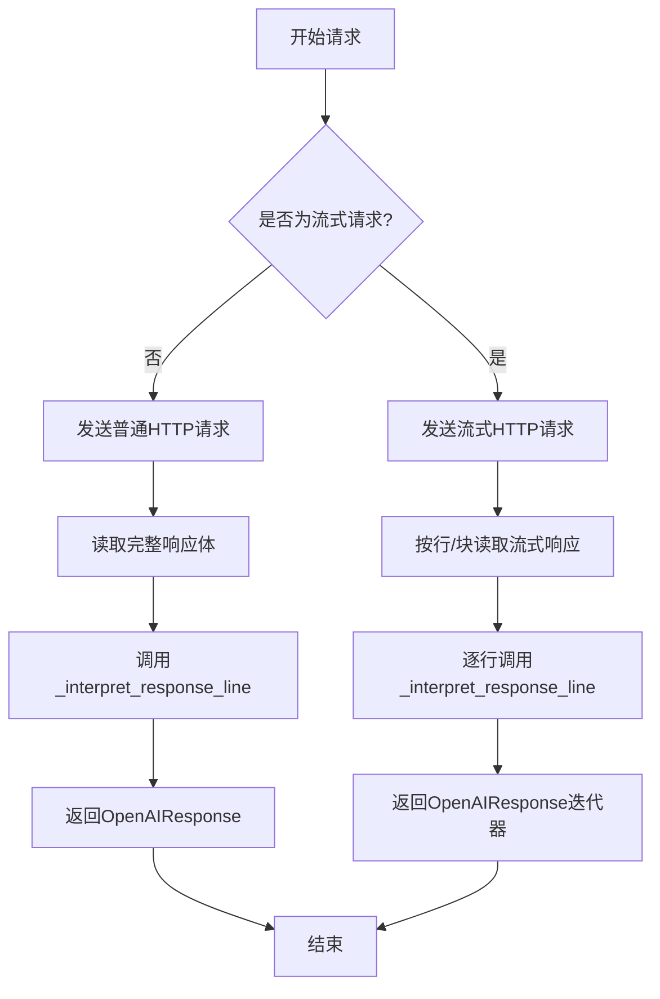
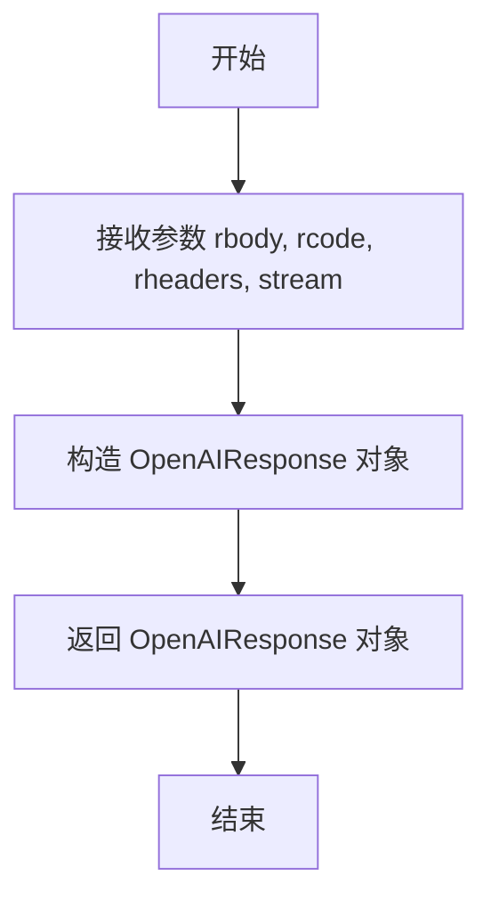
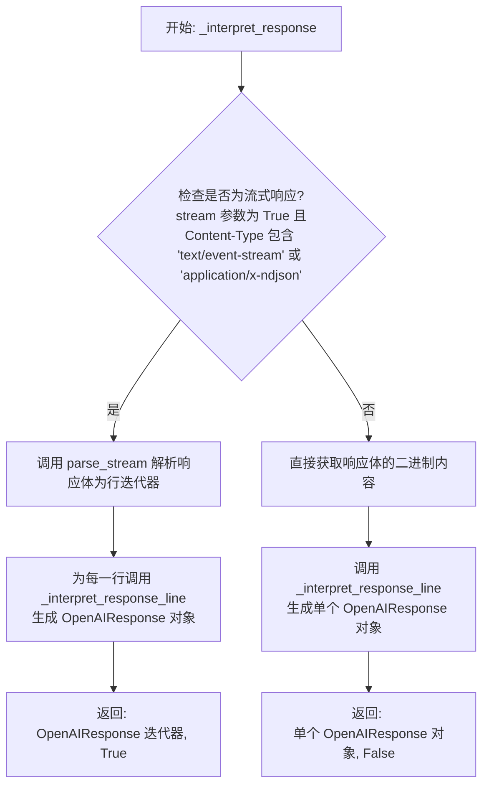

# `.\MetaGPT\metagpt\provider\general_api_requestor.py` 详细设计文档

该代码实现了一个通用的异步HTTP API请求器，专门用于与基于HTTP的LLM模型进行交互。它继承自APIRequestor基类，提供了同步和异步两种方式来处理HTTP响应，特别支持服务器发送事件（SSE）流式响应，并将响应封装为OpenAIResponse对象，以便于统一处理不同LLM提供商的API返回结果。

## 整体流程



## 类结构

```
APIRequestor (基类)
└── GeneralAPIRequestor (通用API请求器)
    ├── _interpret_response_line (处理单行响应)
    ├── _interpret_response (处理同步响应)
    └── _interpret_async_response (处理异步响应)
```

## 全局变量及字段


### `logger`
    
用于记录日志的日志记录器实例。

类型：`metagpt.logs.logger`
    


    

## 全局函数及方法


### `parse_stream_helper`

该函数用于解析 Server-Sent Events (SSE) 数据流中的单行数据。它检查传入的字节行是否以 "data:" 开头，如果是，则提取有效的数据部分。如果数据是结束标记 "[DONE]"，则返回 `None` 以指示流结束；否则，返回提取出的数据字节。如果行不以 "data:" 开头，则返回 `None`。

参数：

- `line`：`bytes`，从 SSE 流中读取到的一行字节数据。

返回值：`Optional[bytes]`，如果该行是有效的 SSE 数据行，则返回提取出的数据字节；如果是结束标记 "[DONE]"，则返回 `None`；如果该行不是有效的 SSE 数据行，也返回 `None`。

#### 流程图

```mermaid
flowchart TD
    A[开始: 输入 line] --> B{line 存在且以 'data:' 开头?}
    B -- 否 --> C[返回 None]
    B -- 是 --> D{line 以 'data: ' 开头?}
    D -- 是 --> E[移除前缀 'data: ']
    D -- 否 --> F[移除前缀 'data:']
    E --> G
    F --> G
    G{line.strip() == '[DONE]'?}
    G -- 是 --> H[返回 None]
    G -- 否 --> I[返回 line]
```

#### 带注释源码

```python
def parse_stream_helper(line: bytes) -> Optional[bytes]:
    # 检查行是否存在且是否以 "data:" 开头，这是 SSE 数据行的标准前缀
    if line and line.startswith(b"data:"):
        # 进一步检查前缀是 "data: " 还是 "data:"，以正确处理可能存在的空格
        if line.startswith(b"data: "):
            # 如果前缀是 "data: "，则移除这个前缀（包括空格），获取数据部分
            line = line[len(b"data: ") :]
        else:
            # 如果前缀是 "data:"（没有空格），则移除这个前缀
            line = line[len(b"data:") :]
        # 检查处理后的行内容是否为结束标记 "[DONE]"
        if line.strip() == b"[DONE]":
            # 如果是结束标记，返回 None 以通知调用者流已结束
            return None
        else:
            # 如果不是结束标记，返回提取出的数据字节
            return line
    # 如果行不以 "data:" 开头，则不是有效的 SSE 数据行，返回 None
    return None
```


### `parse_stream`

`parse_stream` 函数用于解析 HTTP 流式响应（Server-Sent Events, SSE），逐行处理响应体，提取有效的数据行，并过滤掉非数据行和结束标记。

参数：

- `rbody`：`Iterator[bytes]`，一个字节迭代器，通常来自 HTTP 响应的 `iter_lines()` 方法，表示原始的流式响应体。

返回值：`Iterator[bytes]`，返回一个迭代器，每次迭代产生一个有效的、已剥离前缀的 SSE 数据行（字节串）。当遇到结束标记 `[DONE]` 时，迭代停止。

#### 流程图

```mermaid
flowchart TD
    A[开始] --> B{遍历 rbody 的每一行 line}
    B --> C[调用 parse_stream_helper(line)]
    C --> D{helper 返回 _line}
    D -- _line 为 None --> B
    D -- _line 为 bytes --> E[yield _line]
    E --> B
    B -- 遍历结束 --> F[结束]
```

#### 带注释源码

```python
def parse_stream(rbody: Iterator[bytes]) -> Iterator[bytes]:
    # 遍历传入的字节迭代器（通常是响应体的行）
    for line in rbody:
        # 调用辅助函数处理当前行，提取有效数据或判断结束
        _line = parse_stream_helper(line)
        # 如果辅助函数返回了有效的字节数据（非None）
        if _line is not None:
            # 使用 yield 将处理后的数据行返回给调用者，实现生成器模式
            yield _line
```

### `GeneralAPIRequestor._interpret_response_line`

该方法用于处理并返回包装在 `OpenAIResponse` 对象中的响应数据。它接收原始的响应体、状态码、头部信息以及流式传输标志，并直接构造一个 `OpenAIResponse` 对象返回。该方法本身不进行复杂的逻辑判断或数据转换，主要职责是将原始响应数据封装成统一的响应对象。

参数：

- `rbody`：`bytes`，原始的响应体字节数据。
- `rcode`：`int`，HTTP响应状态码。
- `rheaders`：`dict`，HTTP响应头部信息。
- `stream`：`bool`，指示响应是否为流式传输。

返回值：`OpenAIResponse`，封装了响应体、响应头等信息的响应对象。

#### 流程图



#### 带注释源码

```python
def _interpret_response_line(self, rbody: bytes, rcode: int, rheaders: dict, stream: bool) -> OpenAIResponse:
    """
    Process and return the response data wrapped in OpenAIResponse.

    Args:
        rbody (bytes): The response body.
        rcode (int): The response status code.
        rheaders (dict): The response headers.
        stream (bool): Whether the response is a stream.

    Returns:
        OpenAIResponse: The response data wrapped in OpenAIResponse.
    """
    # 直接使用传入的响应体、状态码和头部信息构造一个 OpenAIResponse 对象。
    # 该方法不进行额外的处理或判断，仅负责封装。
    return OpenAIResponse(rbody, rheaders)
```

### `GeneralAPIRequestor._interpret_response`

该方法用于解释同步HTTP响应，根据响应内容类型（是否为流式响应）和`stream`参数，将响应体解析为`OpenAIResponse`对象或`OpenAIResponse`对象的迭代器。

参数：

- `result`：`requests.Response`，同步HTTP响应对象，包含状态码、头部和响应体。
- `stream`：`bool`，指示是否期望或处理流式响应。

返回值：`Tuple[Union[OpenAIResponse, Iterator[OpenAIResponse]], bool]`，返回一个元组。第一个元素是解析后的响应内容，如果`stream`为`True`且响应内容类型是流式类型，则是一个`OpenAIResponse`对象的迭代器；否则是一个单一的`OpenAIResponse`对象。第二个元素是一个布尔值，指示返回的响应内容是否为流式。

#### 流程图



#### 带注释源码

```python
def _interpret_response(
    self, result: requests.Response, stream: bool
) -> Tuple[Union[OpenAIResponse, Iterator[OpenAIResponse]], bool]:
    """
    解释一个同步响应。

    参数:
        result (requests.Response): 响应对象。
        stream (bool): 响应是否为流式。

    返回:
        Tuple[Union[OpenAIResponse, Iterator[OpenAIResponse]], bool]: 一个元组，包含响应内容和一个指示是否为流式的布尔值。
    """
    # 1. 获取响应头的 Content-Type，默认为空字符串
    content_type = result.headers.get("Content-Type", "")
    # 2. 判断是否为流式响应：stream 参数为 True 且 Content-Type 指示为流式类型
    if stream and ("text/event-stream" in content_type or "application/x-ndjson" in content_type):
        # 3. 对于流式响应：
        #    a. 使用 parse_stream 函数将响应体的行迭代器转换为事件流数据行的迭代器。
        #    b. 为每一行数据生成一个 OpenAIResponse 对象（通过 _interpret_response_line）。
        #    c. 返回一个生成器表达式（惰性迭代器）和 True。
        return (
            (
                self._interpret_response_line(line, result.status_code, result.headers, stream=True)
                for line in parse_stream(result.iter_lines())
            ),
            True,
        )
    else:
        # 4. 对于非流式响应：
        #    a. 直接获取响应体的二进制内容（result.content）。
        #    b. 调用 _interpret_response_line 生成一个单一的 OpenAIResponse 对象。
        #    c. 返回这个对象和 False。
        return (
            self._interpret_response_line(
                result.content,  # 让调用者解码消息
                result.status_code,
                result.headers,
                stream=False,
            ),
            False,
        )
```


### `GeneralAPIRequestor._interpret_async_response`

该方法用于解释异步HTTP响应。它根据响应的`Content-Type`头部和`stream`参数，判断响应是否为流式响应（如Server-Sent Events）。如果是流式响应，则返回一个异步生成器，逐行生成`OpenAIResponse`对象；否则，读取完整的响应体，返回单个`OpenAIResponse`对象。方法还处理了读取响应体时可能发生的超时和客户端错误。

参数：

-  `result`：`aiohttp.ClientResponse`，异步HTTP响应对象，包含响应状态、头部和内容。
-  `stream`：`bool`，指示请求是否期望流式响应。

返回值：`Tuple[Union[OpenAIResponse, AsyncGenerator[OpenAIResponse, None]], bool]`，返回一个元组。第一个元素是响应内容：如果`stream`为`True`且响应是流式类型，则为一个异步生成器，每次迭代返回一个`OpenAIResponse`对象；否则为一个`OpenAIResponse`对象。第二个元素是一个布尔值，指示返回的内容是否为流式响应。

#### 流程图

```mermaid
flowchart TD
    A[开始: _interpret_async_response] --> B{stream为True且\nContent-Type是流式类型?}
    B -- 是 --> C[返回异步生成器<br/>逐行生成OpenAIResponse]
    C --> D[返回: (生成器, True)]
    B -- 否 --> E[尝试读取完整响应体]
    E --> F{读取成功?}
    F -- 是 --> G[返回单个OpenAIResponse对象]
    G --> H[返回: (OpenAIResponse, False)]
    F -- 否<br/>（超时或客户端错误） --> I[记录警告，设置响应体为空字节]
    I --> G
```

#### 带注释源码

```python
async def _interpret_async_response(
    self, result: aiohttp.ClientResponse, stream: bool
) -> Tuple[Union[OpenAIResponse, AsyncGenerator[OpenAIResponse, None]], bool]:
    """
    Interpret an asynchronous response.

    Args:
        result (aiohttp.ClientResponse): The response object.
        stream (bool): Whether the response is a stream.

    Returns:
        Tuple[Union[OpenAIResponse, AsyncGenerator[OpenAIResponse, None]], bool]: A tuple containing the response content and a boolean indicating if it is a stream.
    """
    # 获取响应头的Content-Type，默认为空字符串
    content_type = result.headers.get("Content-Type", "")
    # 判断是否为流式响应：stream参数为True，且Content-Type包含特定标识或为空（某些流式接口可能不设置）
    if stream and (
        "text/event-stream" in content_type or "application/x-ndjson" in content_type or content_type == ""
    ):
        # 返回一个异步生成器，该生成器异步迭代响应的内容（行）
        # 对每一行调用_interpret_response_line方法生成OpenAIResponse对象
        return (
            (
                self._interpret_response_line(line, result.status, result.headers, stream=True)
                async for line in result.content
            ),
            True,  # 第二个返回值为True，表示是流式响应
        )
    else:
        # 非流式响应，需要读取完整的响应体
        try:
            # 异步读取整个响应体内容
            response_content = await result.read()
        except (aiohttp.ServerTimeoutError, asyncio.TimeoutError) as e:
            # 处理读取超时异常，转换为标准的TimeoutError并抛出
            raise TimeoutError("Request timed out") from e
        except aiohttp.ClientError as exp:
            # 处理其他客户端错误（如连接错误），记录警告并将响应体设为空
            logger.warning(f"response: {result}, exp: {exp}")
            response_content = b""
        # 返回单个OpenAIResponse对象，第二个返回值为False表示非流式响应
        return (
            self._interpret_response_line(
                response_content,  # 将读取的字节内容传递给解释器，由调用者解码
                result.status,
                result.headers,
                stream=False,
            ),
            False,
        )
```


## 关键组件


### 异步HTTP请求处理

提供基于HTTP的LLM模型的通用异步API请求能力，支持同步和异步两种调用方式，并处理流式和非流式响应。

### 流式响应解析

解析服务器发送事件（SSE）格式的流式响应，将原始字节流转换为可迭代的数据行，并处理流结束标记。

### 响应解释器

根据响应内容类型（如`text/event-stream`）和请求的流式标志，将原始HTTP响应解释为统一的`OpenAIResponse`对象或该对象的迭代器/异步生成器。

### 错误处理与超时控制

在异步响应处理中捕获网络超时和客户端错误，进行适当的异常转换和日志记录，确保请求的健壮性。


## 问题及建议


### 已知问题

-   **流式响应解析逻辑不一致**：`_interpret_response` 方法（同步）和 `_interpret_async_response` 方法（异步）对于流式响应（SSE）的解析逻辑存在差异。同步方法使用 `parse_stream` 函数处理 `result.iter_lines()`，而异步方法直接异步迭代 `result.content`。这可能导致两种模式下对相同数据流的解析行为不同，增加了维护复杂性和潜在的bug风险。
-   **异常处理不完整**：在 `_interpret_async_response` 方法的非流式响应分支中，仅捕获了 `aiohttp.ServerTimeoutError`、`asyncio.TimeoutError` 和 `aiohttp.ClientError`。对于其他可能的异常（如网络连接错误、服务器内部错误等），没有进行捕获和处理，可能导致程序意外崩溃。
-   **硬编码的超时错误信息**：在 `_interpret_async_response` 方法中，捕获超时异常后抛出的 `TimeoutError` 异常信息是硬编码的字符串 `"Request timed out"`。这不利于调用者根据不同的上下文进行更精细的错误处理或日志记录。
-   **日志记录级别可能不当**：在 `_interpret_async_response` 方法中，当捕获到 `aiohttp.ClientError` 时，使用 `logger.warning` 记录日志。然而，某些 `ClientError`（如连接被拒绝）可能代表更严重的问题，使用 `warning` 级别可能不足以引起重视。同时，日志信息 `f"response: {result}, exp: {exp}"` 可能包含敏感信息（如URL、headers），直接记录存在安全风险。
-   **空内容类型处理不一致**：在 `_interpret_async_response` 方法中，判断是否为流式响应的条件包含了 `content_type == ""`，而同步方法 `_interpret_response` 中没有此判断。这可能导致在内容类型为空时，同步和异步请求对响应类型的判断结果不一致。

### 优化建议

-   **统一流式响应解析逻辑**：重构代码，将流式响应的解析逻辑提取到一个公共的函数或方法中（例如，增强 `parse_stream` 函数使其同时支持同步和异步迭代器），然后在 `_interpret_response` 和 `_interpret_async_response` 中调用这个统一的解析器。这可以提高代码复用性，并确保行为一致性。
-   **增强异常处理**：在 `_interpret_async_response` 方法中，考虑使用更广泛的异常捕获（例如使用 `except Exception` 作为兜底），并在捕获后根据异常类型进行更恰当的处理（如记录错误日志、抛出更具信息量的自定义异常等）。同时，应避免在日志中记录可能包含敏感信息的完整响应对象。
-   **提供可配置的超时错误信息**：考虑将超时错误信息作为参数传递给 `_interpret_async_response` 方法或其所属的类，或者允许调用者通过继承并重写方法来定制错误信息。这样可以使错误处理更加灵活。
-   **改进日志策略**：重新评估日志级别，对于不同的 `ClientError` 子类型使用不同的日志级别（例如，连接错误使用 `error`，其他客户端错误使用 `warning`）。在记录日志前，应对响应对象进行脱敏处理，避免泄露敏感信息。
-   **明确内容类型处理策略**：审查并统一同步和异步方法中对于空内容类型或未知内容类型的处理逻辑。明确在何种情况下应将响应视为流式响应，并确保两种模式下的判断标准一致。可以考虑将内容类型判断逻辑也提取为独立的辅助函数。
-   **添加类型注解和文档**：为 `parse_stream_helper` 和 `parse_stream` 函数添加更详细的类型注解和文档字符串，说明其输入输出格式及在流解析中的作用。这有助于提高代码的可读性和可维护性。
-   **考虑性能优化**：对于流式响应，当前的异步解析是逐行（或逐块）进行的。如果响应体非常大，这种逐行处理的方式可能不是最高效的。可以评估是否需要进行缓冲或使用更高效的流处理模式，但需注意权衡内存使用和响应延迟。


## 其它


### 设计目标与约束

本模块旨在为基于HTTP协议的大语言模型（LLM）提供一个通用的异步API请求抽象层。其核心设计目标包括：1) 提供统一的接口，以支持同步和异步两种调用模式，适配不同的后端LLM服务；2) 支持流式（Server-Sent Events, SSE）和非流式两种响应处理模式；3) 封装底层HTTP请求细节（如使用`requests`和`aiohttp`库），向上层提供简洁、一致的响应对象（`OpenAIResponse`）。主要约束包括：需要兼容遵循OpenAI API响应格式或类似SSE流式协议的服务；异步实现依赖于`asyncio`和`aiohttp`；同步实现依赖于`requests`。

### 错误处理与异常设计

模块的错误处理主要围绕HTTP请求和响应过程。在同步路径中，异常可能由`requests`库抛出（如连接错误、超时），需要由调用者捕获。在异步路径的`_interpret_async_response`方法中，明确处理了几种特定异常：`aiohttp.ServerTimeoutError`和`asyncio.TimeoutError`被捕获并转换为标准的`TimeoutError`向上抛出；其他`aiohttp.ClientError`（如连接错误）被捕获并记录警告日志，同时将响应内容设为空字节串，允许流程继续但返回空内容。对于流式响应，逐行解析时若遇到`[DONE]`标记则正常结束，解析逻辑本身不抛出业务异常。总体策略是将网络层异常转化或记录，保持接口的简洁性，由调用方决定最终的错误处理策略。

### 数据流与状态机

模块的数据流始于调用`arequest`（异步）或`request`（继承自父类`APIRequestor`，代码中未展示）方法。根据`stream`参数和响应头`Content-Type`，流程分叉：
1.  **非流式路径**：读取完整的响应体（`result.content`或`await result.read()`），通过`_interpret_response_line`方法包装成单个`OpenAIResponse`对象返回。
2.  **流式路径**：通过`parse_stream`（同步）或直接异步迭代`result.content`（异步）逐行读取SSE格式的数据。每一行数据（非`[DONE]`）通过`_interpret_response_line`方法包装成一个`OpenAIResponse`对象，并以生成器或异步生成器的形式返回给调用者。这是一个简单的线性处理流程，没有复杂的状态转换。状态主要体现在HTTP请求的生命周期（未开始、进行中、完成/错误）以及流式响应的迭代状态（进行中、结束）。

### 外部依赖与接口契约

1.  **外部库依赖**:
    *   `aiohttp`: 用于执行异步HTTP请求和处理异步响应流。
    *   `requests`: 用于执行同步HTTP请求（相关方法继承自父类`APIRequestor`）。
    *   `asyncio`: 提供异步运行时支持。
    *   `metagpt.provider.general_api_base.APIRequestor`: 父类，提供基础请求逻辑（如重试、认证等，假设已存在）。
    *   `metagpt.provider.general_api_base.OpenAIResponse`: 用于封装响应数据的类。
    *   `metagpt.logs.logger`: 用于记录警告日志。

2.  **接口契约（对调用者）**:
    *   `arequest`方法（继承并可能重写，代码中未展示完整签名）是主要的异步入口点，预期接收方法、URL、头部、流标志等参数，并返回一个元组`(result, _, api_key)`，其中`result`可能是`OpenAIResponse`或它的迭代器/异步生成器。
    *   响应处理契约：调用者需要根据返回的布尔值（指示是否为流）和结果类型，采用相应方式（直接访问或迭代）处理`OpenAIResponse`对象。

3.  **对上游服务的协议契约**:
    *   期望上游LLM服务的HTTP端点支持标准的HTTP语义。
    *   对于流式响应，期望服务端发送`Content-Type: text/event-stream`（或`application/x-ndjson`）的SSE格式数据，每行以`data: `开头，以`[DONE]`标记结束。

    