# `.\MetaGPT\metagpt\provider\google_gemini_api.py` 详细设计文档

该代码实现了一个用于与Google Gemini大语言模型进行交互的客户端类。它封装了模型调用、消息格式化、令牌计数、成本计算以及同步/异步的文本生成功能，是MetaGPT框架中LLM提供商的一个具体实现。

## 整体流程

```mermaid
graph TD
    A[用户调用] --> B{调用类型?}
    B -- 同步生成 --> C[调用 completion 方法]
    B -- 异步生成 --> D[调用 acompletion 方法]
    B -- 异步流式生成 --> E[调用 _achat_completion_stream 方法]
    C --> F[调用 llm.generate_content]
    D --> G[调用 llm.generate_content_async]
    E --> H[调用 llm.generate_content_async(stream=True)]
    F --> I[获取响应文本]
    G --> I
    H --> J[逐块收集流式响应]
    I --> K[调用 get_usage 计算令牌用量]
    J --> K
    K --> L[调用 _update_costs 更新成本]
    L --> M[返回结果]
```

## 类结构

```
BaseLLM (抽象基类)
└── GeminiLLM (Google Gemini 具体实现)
    └── GeminiGenerativeModel (对原生 GenerativeModel 的包装)
```

## 全局变量及字段


### `GeminiLLM.use_system_prompt`
    
指示是否使用系统提示的标志，由于Google Gemini API不支持系统提示，因此默认设置为False。

类型：`bool`
    


### `GeminiLLM.config`
    
包含LLM配置信息的对象，如API密钥、代理设置、模型名称等。

类型：`LLMConfig`
    


### `GeminiLLM.model`
    
指定要使用的Gemini模型名称，从配置中获取。

类型：`str`
    


### `GeminiLLM.pricing_plan`
    
定价计划标识符，优先使用配置中的pricing_plan，否则使用模型名称。

类型：`str`
    


### `GeminiLLM.llm`
    
GeminiGenerativeModel的实例，用于与Google Gemini API进行交互的核心对象。

类型：`GeminiGenerativeModel`
    
    

## 全局函数及方法

### `GeminiGenerativeModel.count_tokens`

该方法用于调用 Gemini API 的 `count_tokens` 端点，计算给定内容（`contents`）的令牌数量。它是 Google Generative AI Python SDK 中 `GenerativeModel` 类的一个补丁方法，旨在解决特定版本中 `count_tokens` 方法可能存在的问题。

参数：

- `contents`：`content_types.ContentsType`，需要计算令牌数的内容。它可以是字符串、字典或列表等格式，最终会被 `content_types.to_contents` 函数转换为 API 所需的格式。

返回值：`glm.CountTokensResponse`，一个包含令牌计数结果（如 `total_tokens`）的响应对象。

#### 流程图

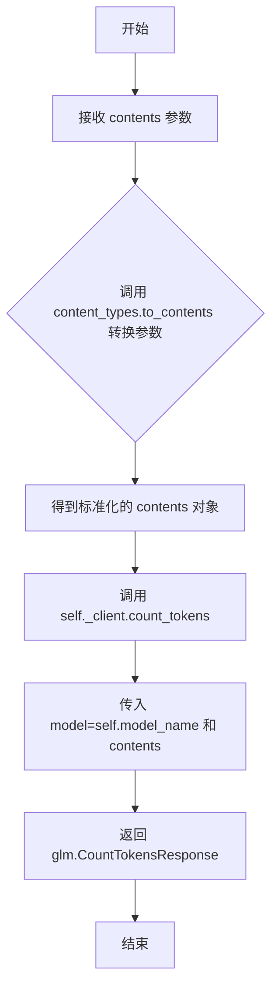

#### 带注释源码

```python
def count_tokens(self, contents: content_types.ContentsType) -> glm.CountTokensResponse:
    # 将输入的 contents 参数（可能是多种格式）转换为 API 所需的标准化格式。
    contents = content_types.to_contents(contents)
    # 调用底层客户端的 count_tokens 方法，传入模型名称和标准化后的内容，以计算令牌数。
    return self._client.count_tokens(model=self.model_name, contents=contents)
```

### `GeminiGenerativeModel.count_tokens_async`

该方法是一个异步方法，用于调用Google Gemini API的`count_tokens`接口，以异步方式计算给定消息内容（`contents`）所消耗的令牌数量。它首先将输入内容转换为Gemini API要求的格式，然后通过异步客户端向指定模型发起请求，并返回包含令牌计数信息的响应对象。

参数：

- `contents`：`content_types.ContentsType`，需要计算令牌数的消息内容。它可以是字符串、字典或列表等形式，方法内部会将其统一转换为API所需的`glm.Content`对象列表格式。

返回值：`glm.CountTokensResponse`，一个包含令牌计数结果（如总令牌数`total_tokens`）的响应对象。

#### 流程图

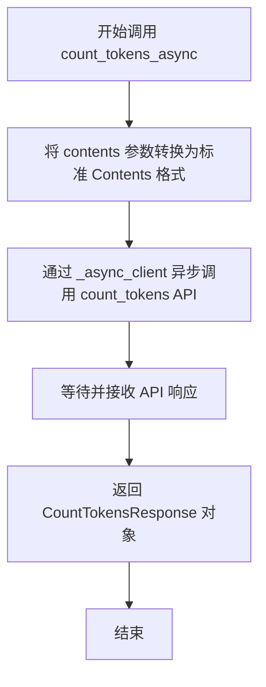

#### 带注释源码

```python
async def count_tokens_async(self, contents: content_types.ContentsType) -> glm.CountTokensResponse:
    # 将用户传入的多种格式的contents参数，统一转换为Gemini API内部处理所需的glm.Content对象列表。
    contents = content_types.to_contents(contents)
    # 通过异步客户端，向指定的模型（self.model_name）发起计算令牌数的请求，并等待返回结果。
    # 返回的响应对象中包含了输入内容的总令牌数等信息。
    return await self._async_client.count_tokens(model=self.model_name, contents=contents)
```

### `GeminiLLM.__init__`

初始化GeminiLLM类实例，配置Google Gemini API连接参数并创建生成模型。

参数：

- `config`：`LLMConfig`，包含API密钥、代理设置、模型名称等LLM配置信息

返回值：`None`，构造函数无返回值

#### 流程图

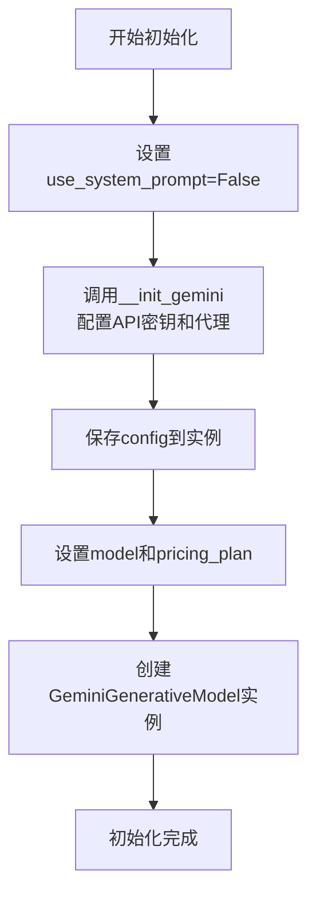

#### 带注释源码

```python
def __init__(self, config: LLMConfig):
    # 标记Gemini API不支持系统提示词
    self.use_system_prompt = False  # google gemini has no system prompt when use api

    # 初始化Gemini API配置（设置代理和API密钥）
    self.__init_gemini(config)
    
    # 保存配置对象到实例变量
    self.config = config
    
    # 设置模型名称
    self.model = config.model
    
    # 设置计费方案，优先使用config中的pricing_plan，否则使用模型名称
    self.pricing_plan = self.config.pricing_plan or self.model
    
    # 创建Gemini生成模型实例
    self.llm = GeminiGenerativeModel(model_name=self.model)
```

### `GeminiLLM.__init_gemini`

该方法用于初始化Google Gemini LLM的配置，包括设置代理（如果提供）和配置API密钥。

参数：

- `config`：`LLMConfig`，包含LLM配置信息的对象，如API密钥和代理设置。

返回值：`None`，无返回值。

#### 流程图

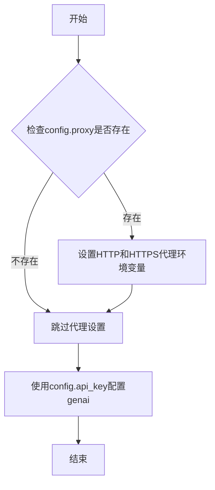

#### 带注释源码

```python
def __init_gemini(self, config: LLMConfig):
    # 检查配置中是否提供了代理设置
    if config.proxy:
        # 如果提供了代理，记录代理信息并设置环境变量
        logger.info(f"Use proxy: {config.proxy}")
        os.environ["http_proxy"] = config.proxy
        os.environ["https_proxy"] = config.proxy
    # 使用配置中的API密钥初始化Google Gemini API
    genai.configure(api_key=config.api_key)
```

### `GeminiLLM._user_msg`

该方法用于将用户消息和可选的图片信息格式化为符合Google Gemini API要求的消息字典。它遵循Gemini对话格式，其中消息是一个包含`role`和`parts`键的字典。`role`固定为`"user"`，`parts`是一个列表，当前仅包含文本消息。虽然参数支持图片，但当前实现未处理图片，仅将文本消息放入`parts`中。

参数：

- `msg`：`str`，用户输入的文本消息内容。
- `images`：`Optional[Union[str, list[str]]]`，可选的图片信息（可以是单个图片路径字符串或图片路径列表）。当前实现未使用此参数。

返回值：`dict[str, str]`，返回一个符合Gemini API格式的字典，包含`role`和`parts`键。`role`为`"user"`，`parts`为包含输入消息的列表。

#### 流程图

```mermaid
flowchart TD
    A[开始] --> B{输入参数: msg, images}
    B --> C[创建字典]
    C --> D[设置 role 为 'user']
    D --> E[设置 parts 为 [msg]]
    E --> F[返回字典]
    F --> G[结束]
```

#### 带注释源码

```python
def _user_msg(self, msg: str, images: Optional[Union[str, list[str]]] = None) -> dict[str, str]:
    # Not to change BaseLLM default functions but update with Gemini's conversation format.
    # You should follow the format.
    return {"role": "user", "parts": [msg]}
```

### `GeminiLLM._assistant_msg`

该方法用于将模型生成的文本消息，格式化为符合Google Gemini API要求的消息字典格式。它构造一个代表“模型”角色的字典，其中包含消息内容。

参数：

- `msg`：`str`，模型生成的文本消息内容。

返回值：`dict[str, str]`，一个包含`role`和`parts`两个键的字典。`role`的值为`"model"`，表示消息来自模型；`parts`是一个列表，其第一个元素是传入的`msg`字符串。

#### 流程图

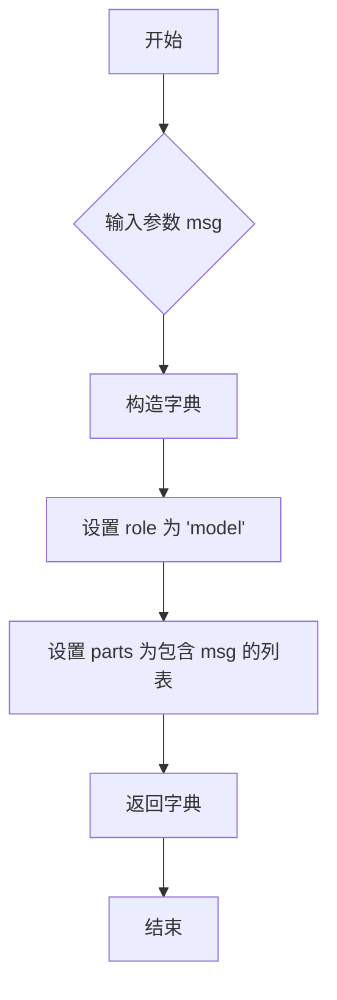

#### 带注释源码

```python
def _assistant_msg(self, msg: str) -> dict[str, str]:
    # 返回一个符合Gemini API格式的字典，表示来自模型（AI助手）的消息。
    # 键 `role` 固定为 `"model"`。
    # 键 `parts` 的值是一个列表，其中第一个元素是传入的文本消息 `msg`。
    return {"role": "model", "parts": [msg]}
```

### `GeminiLLM._system_msg`

该方法用于将系统消息转换为 Gemini API 所需的格式。由于 Gemini API 本身不支持独立的系统消息角色，该方法将系统消息转换为一个用户角色的消息，以便在对话中使用。

参数：

- `msg`：`str`，系统消息的内容。

返回值：`dict[str, str]`，返回一个字典，包含角色（`role`）为 `"user"` 和消息内容（`parts`）为包含输入消息的列表。

#### 流程图

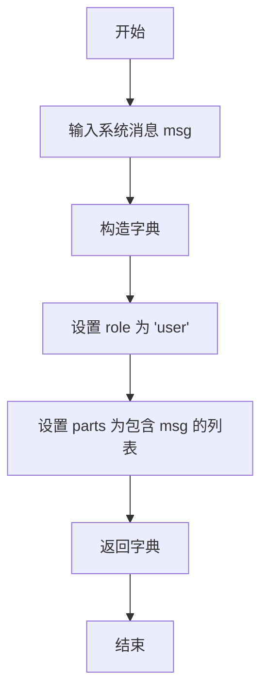

#### 带注释源码

```python
def _system_msg(self, msg: str) -> dict[str, str]:
    # 将系统消息转换为 Gemini API 所需的格式。
    # 由于 Gemini API 不支持独立的系统消息角色，这里将其转换为用户角色的消息。
    return {"role": "user", "parts": [msg]}
```

### `GeminiLLM.format_msg`

将不同类型的消息（字符串、字典、Message对象或它们的列表）统一转换为符合Google Gemini API要求的消息格式列表。每个消息都是一个字典，包含`role`（"user"或"model"）和`parts`（内容列表）两个键。

参数：

- `messages`：`Union[str, "Message", list[dict], list["Message"], list[str]]`，需要格式化的消息，可以是单个消息或消息列表。支持字符串、字典、Message对象或它们的列表。

返回值：`list[dict]`，格式化后的消息列表，每个元素是一个包含`role`和`parts`键的字典。

#### 流程图

```mermaid
flowchart TD
    A[开始: format_msg(messages)] --> B{messages 是否为列表?}
    B -->|否| C[将 messages 转换为列表 [messages]]
    B -->|是| D[保持 messages 为列表]
    C --> E
    D --> E[初始化 processed_messages 为空列表]
    E --> F[遍历 messages 列表中的每个 msg]
    F --> G{判断 msg 类型}
    G -->|str| H[转换为字典: role='user', parts=[msg]]
    G -->|dict| I[验证键为 'role' 和 'parts'<br>并直接添加]
    G -->|Message 对象| J[根据 msg.role 映射 role<br>（'user' 或 'model'）, parts=[msg.content]]
    G -->|其他类型| K[抛出 ValueError 异常]
    H --> L[将字典添加到 processed_messages]
    I --> L
    J --> L
    L --> M{是否遍历完所有 msg?}
    M -->|否| F
    M -->|是| N[返回 processed_messages]
    K --> O[结束: 抛出异常]
```

#### 带注释源码

```python
def format_msg(self, messages: Union[str, "Message", list[dict], list["Message"], list[str]]) -> list[dict]:
    """convert messages to list[dict]."""
    from metagpt.schema import Message  # 延迟导入，避免循环依赖

    if not isinstance(messages, list):
        messages = [messages]  # 将单个消息包装成列表，统一处理流程

    # REF: https://ai.google.dev/tutorials/python_quickstart
    # As a dictionary, the message requires `role` and `parts` keys.
    # The role in a conversation can either be the `user`, which provides the prompts,
    # or `model`, which provides the responses.
    processed_messages = []  # 存储格式化后的消息列表
    for msg in messages:
        if isinstance(msg, str):
            # 情况1: 输入为字符串，视为用户消息
            processed_messages.append({"role": "user", "parts": [msg]})
        elif isinstance(msg, dict):
            # 情况2: 输入为字典，直接使用，但验证其结构
            assert set(msg.keys()) == set(["role", "parts"])  # 确保字典格式正确
            processed_messages.append(msg)
        elif isinstance(msg, Message):
            # 情况3: 输入为Message对象，将其内容映射为Gemini格式
            # 将Message的role映射为Gemini的role（'user'或'model'）
            processed_messages.append({"role": "user" if msg.role == "user" else "model", "parts": [msg.content]})
        else:
            # 情况4: 不支持的消息类型，抛出异常
            raise ValueError(
                f"Only support message type are: str, Message, dict, but got {type(messages).__name__}!"
            )
    return processed_messages  # 返回格式化后的消息列表
```

### `GeminiLLM._const_kwargs`

该方法用于构建调用Google Gemini API生成内容时所需的关键字参数（kwargs）。它接收格式化后的消息列表和一个流式传输标志，返回一个包含`contents`（对话内容）、`generation_config`（生成配置，如温度）和`stream`（是否流式输出）的字典。这是将内部消息格式转换为Gemini API所需调用格式的关键步骤。

参数：

- `messages`：`list[dict]`，已格式化的消息列表，每条消息是一个包含`role`和`parts`键的字典。
- `stream`：`bool`，默认为`False`，指示是否启用流式响应。

返回值：`dict`，一个包含调用Gemini `generate_content` 或 `generate_content_async` 方法所需参数的字典。

#### 流程图

```mermaid
graph TD
    A[开始] --> B{输入: messages, stream}
    B --> C[初始化kwargs字典]
    C --> D[设置kwargs['contents'] = messages]
    D --> E[设置kwargs['generation_config'] = GenerationConfig(temperature=0.3)]
    E --> F[设置kwargs['stream'] = stream]
    F --> G[返回kwargs字典]
    G --> H[结束]
```

#### 带注释源码

```python
def _const_kwargs(self, messages: list[dict], stream: bool = False) -> dict:
    # 初始化关键字参数字典，用于传递给Gemini API的生成函数
    kwargs = {
        # 核心参数：对话内容，格式为list[dict]，每个dict包含'role'和'parts'
        "contents": messages,
        # 生成配置：这里固定设置温度(temperature)为0.3，控制输出的随机性
        "generation_config": GenerationConfig(temperature=0.3),
        # 流式控制：根据调用方传入的stream参数决定是否启用流式响应
        "stream": stream
    }
    # 返回构建好的参数字典
    return kwargs
```

### `GeminiLLM.get_choice_text`

该方法用于从Google Gemini LLM的响应对象中提取生成的文本内容。

参数：

- `resp`：`GenerateContentResponse`，Google Gemini LLM API调用后返回的响应对象。

返回值：`str`，从响应对象中提取出的纯文本内容。

#### 流程图

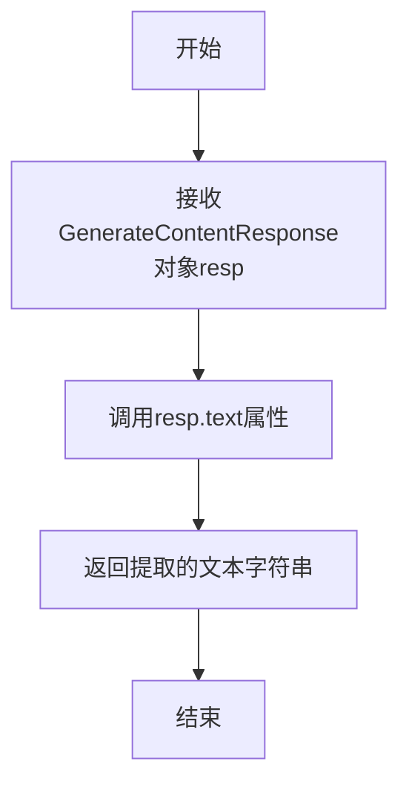

#### 带注释源码

```python
def get_choice_text(self, resp: GenerateContentResponse) -> str:
    # 直接访问响应对象`resp`的`text`属性，该属性包含了模型生成的文本内容。
    # 这是一个简单的属性访问操作，将响应中的文本部分作为字符串返回。
    return resp.text
```

### `GeminiLLM.get_usage`

该方法用于计算给定消息列表和模型响应文本的令牌使用量。它通过调用Gemini API的`count_tokens`方法，分别计算用户请求（prompt）和模型响应（completion）的令牌数，并返回一个包含`prompt_tokens`和`completion_tokens`的字典。

参数：

- `messages`：`list[dict]`，包含对话历史的消息列表，每条消息是一个字典，包含`role`和`parts`键。
- `resp_text`：`str`，模型生成的响应文本。

返回值：`dict`，包含两个键值对：`prompt_tokens`（用户请求的令牌数）和`completion_tokens`（模型响应的令牌数）。

#### 流程图

```mermaid
graph TD
    A[开始] --> B{消息列表是否为空?};
    B -- 是 --> C[设置req_text为空字符串];
    B -- 否 --> D[获取最后一条消息的parts[0]作为req_text];
    C --> E[调用llm.count_tokens计算prompt令牌数];
    D --> E;
    E --> F[调用llm.count_tokens计算completion令牌数];
    F --> G[构造并返回usage字典];
    G --> H[结束];
```

#### 带注释源码

```python
def get_usage(self, messages: list[dict], resp_text: str) -> dict:
    # 从消息列表中提取用户请求文本。如果消息列表为空，则使用空字符串。
    req_text = messages[-1]["parts"][0] if messages else ""
    
    # 调用Gemini API的count_tokens方法，计算用户请求（prompt）的令牌数。
    # 请求内容格式化为包含角色和文本部分的字典。
    prompt_resp = self.llm.count_tokens(contents={"role": "user", "parts": [{"text": req_text}]})
    
    # 调用Gemini API的count_tokens方法，计算模型响应（completion）的令牌数。
    # 响应内容格式化为包含角色和文本部分的字典。
    completion_resp = self.llm.count_tokens(contents={"role": "model", "parts": [{"text": resp_text}]})
    
    # 构造并返回包含prompt_tokens和completion_tokens的字典。
    usage = {"prompt_tokens": prompt_resp.total_tokens, "completion_tokens": completion_resp.total_tokens}
    return usage
```

### `GeminiLLM.aget_usage`

该方法用于异步计算给定消息列表和模型响应文本的令牌使用量。它通过调用 Gemini API 的异步令牌计数功能，分别计算用户提示（prompt）和模型完成（completion）的令牌数，并返回一个包含详细使用情况的字典。

参数：

- `messages`：`list[dict]`，包含对话历史的消息列表，每个消息是一个字典，包含 `role` 和 `parts` 键。
- `resp_text`：`str`，模型生成的响应文本。

返回值：`dict`，一个包含 `prompt_tokens` 和 `completion_tokens` 键的字典，分别表示提示令牌数和完成令牌数。

#### 流程图

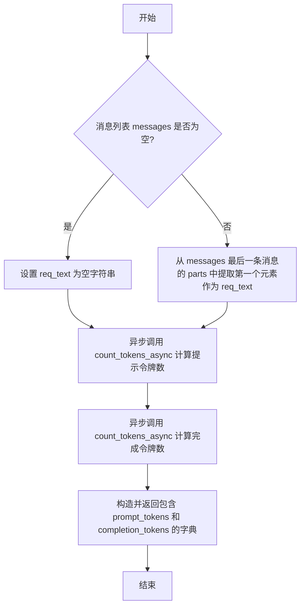

#### 带注释源码

```python
async def aget_usage(self, messages: list[dict], resp_text: str) -> dict:
    # 从消息列表中提取最后一个用户消息的文本内容。如果消息列表为空，则使用空字符串。
    req_text = messages[-1]["parts"][0] if messages else ""
    
    # 异步调用 Gemini API 的 count_tokens_async 方法，计算用户提示（prompt）的令牌数。
    # 构造一个符合 API 要求的 content 字典，包含角色和文本部分。
    prompt_resp = await self.llm.count_tokens_async(contents={"role": "user", "parts": [{"text": req_text}]})
    
    # 异步调用 Gemini API 的 count_tokens_async 方法，计算模型响应（completion）的令牌数。
    # 构造一个符合 API 要求的 content 字典，角色为模型，文本部分为传入的 resp_text。
    completion_resp = await self.llm.count_tokens_async(contents={"role": "model", "parts": [{"text": resp_text}]})
    
    # 从两个响应对象中提取 total_tokens 字段，构造一个包含提示令牌数和完成令牌数的字典。
    usage = {"prompt_tokens": prompt_resp.total_tokens, "completion_tokens": completion_resp.total_tokens}
    
    # 返回令牌使用情况字典。
    return usage
```

### `GeminiLLM.completion`

该方法用于向Google Gemini模型发起同步请求，获取模型生成的文本内容。它通过调用底层的`generate_content`方法，并处理返回的响应，包括计算token使用量并更新成本。

参数：

- `messages`：`list[dict]`，一个字典列表，代表对话历史。每个字典应包含`role`（"user"或"model"）和`parts`（内容列表）两个键。

返回值：`GenerateContentResponse`，Google Gemini API返回的原始响应对象，包含生成的文本、候选结果等信息。

#### 流程图

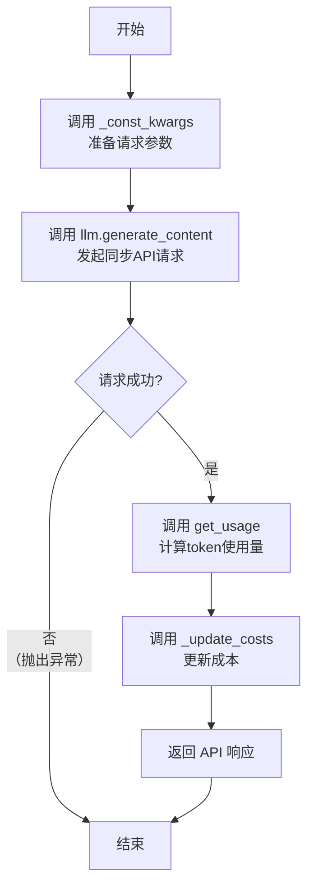

#### 带注释源码

```python
def completion(self, messages: list[dict]) -> "GenerateContentResponse":
    """
    同步调用Gemini模型生成内容。
    
    参数:
        messages (list[dict]): 格式化的消息列表，用于构建对话上下文。
        
    返回:
        GenerateContentResponse: Gemini API返回的原始响应对象。
    """
    # 1. 准备请求参数：将消息、生成配置等打包成字典。
    #    _const_kwargs 方法默认设置 temperature=0.3, stream=False。
    resp: GenerateContentResponse = self.llm.generate_content(**self._const_kwargs(messages))
    
    # 2. 计算本次请求和响应的token使用量。
    #    get_usage 方法通过调用 count_tokens API 分别计算 prompt 和 completion 的 token 数。
    usage = self.get_usage(messages, resp.text)
    
    # 3. 根据token使用量更新内部成本统计。
    #    _update_costs 是继承自 BaseLLM 的方法，用于累计开销。
    self._update_costs(usage)
    
    # 4. 返回API的原始响应，调用方可通过 resp.text 获取生成的文本。
    return resp
```

### `GeminiLLM._achat_completion`

该方法用于异步调用 Google Gemini 大语言模型的生成内容接口，处理用户输入的消息列表，并返回模型的响应。在内部，它会计算请求和响应的令牌使用量以更新成本，并处理超时配置。

参数：

- `messages`：`list[dict]`，一个字典列表，其中每个字典代表一条消息，必须包含 `role`（“user”或“model”）和 `parts`（内容部分列表）键。
- `timeout`：`int`，请求的超时时间（秒），默认使用配置中的超时时间。

返回值：`AsyncGenerateContentResponse`，Google Gemini API 返回的异步生成内容响应对象，其中包含模型生成的文本和其他元数据。

#### 流程图

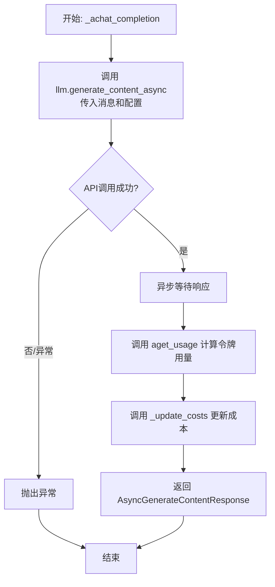

#### 带注释源码

```python
async def _achat_completion(
    self, messages: list[dict], timeout: int = USE_CONFIG_TIMEOUT
) -> "AsyncGenerateContentResponse":
    # 调用 Gemini 模型的异步生成内容接口，传入格式化后的消息和生成配置（如温度等）
    resp: AsyncGenerateContentResponse = await self.llm.generate_content_async(**self._const_kwargs(messages))
    # 异步计算本次请求和响应的令牌使用量
    usage = await self.aget_usage(messages, resp.text)
    # 根据令牌使用量更新内部成本记录
    self._update_costs(usage)
    # 返回原始的 API 响应对象
    return resp
```

### `GeminiLLM.acompletion`

该方法是一个异步方法，用于向Google Gemini LLM发送一个非流式（一次性）的聊天补全请求。它接收格式化后的消息列表，调用底层的异步生成方法，并处理响应和成本计算。

参数：

- `messages`：`list[dict]`，一个字典列表，每个字典代表一条消息，必须包含`role`（`"user"`或`"model"`）和`parts`（内容列表）键。
- `timeout`：`int`，请求的超时时间（秒），默认使用配置中的`USE_CONFIG_TIMEOUT`。

返回值：`dict`，返回一个字典，实际上是`AsyncGenerateContentResponse`对象，包含了LLM生成的完整响应内容。

#### 流程图

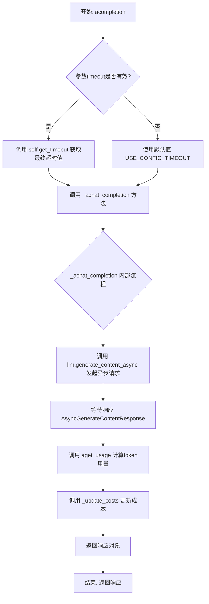

#### 带注释源码

```python
async def acompletion(self, messages: list[dict], timeout=USE_CONFIG_TIMEOUT) -> dict:
    """
    异步聊天补全方法。
    1. 处理超时参数。
    2. 调用内部异步聊天方法获取响应。
    3. 该方法内部会计算token使用量并更新成本。
    4. 返回原始的异步响应对象（在类型注解中为dict，实际是AsyncGenerateContentResponse）。

    Args:
        messages (list[dict]): 格式化后的消息列表，用于构建对话上下文。
        timeout (int, optional): 请求超时时间。默认为配置中的USE_CONFIG_TIMEOUT。

    Returns:
        dict: Google Gemini API返回的异步生成内容响应对象。
    """
    # 调用内部异步聊天方法，并传入处理后的超时时间。
    # self.get_timeout(timeout) 用于确定最终使用的超时值。
    return await self._achat_completion(messages, timeout=self.get_timeout(timeout))
```

### `GeminiLLM._achat_completion_stream`

该方法用于与Google Gemini LLM进行异步流式对话，接收消息列表，以流式方式生成回复，并最终返回完整的回复文本。在流式生成过程中，它会实时记录每个文本块，并在生成结束后计算并更新token使用成本。

参数：

- `messages`：`list[dict]`，包含对话消息的列表，每个消息是一个字典，包含`role`和`parts`键。
- `timeout`：`int`，请求超时时间，默认为`USE_CONFIG_TIMEOUT`。

返回值：`str`，模型生成的完整回复文本。

#### 流程图

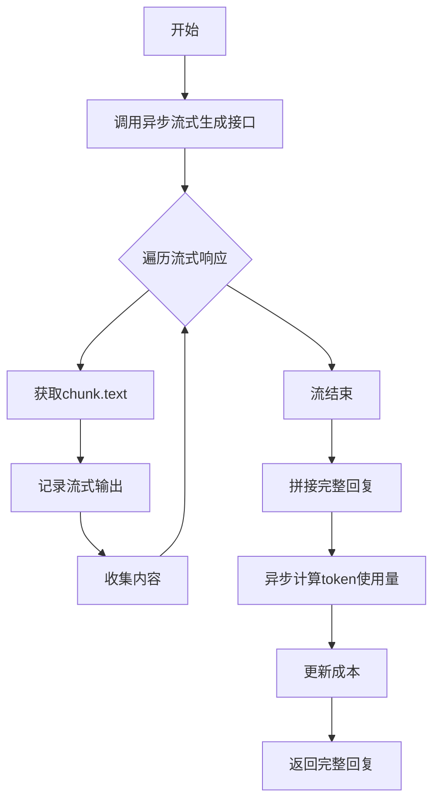

#### 带注释源码

```python
async def _achat_completion_stream(self, messages: list[dict], timeout: int = USE_CONFIG_TIMEOUT) -> str:
    # 调用Gemini的异步流式生成接口，传入消息和流式参数
    resp: AsyncGenerateContentResponse = await self.llm.generate_content_async(
        **self._const_kwargs(messages, stream=True)
    )
    collected_content = []  # 用于收集流式生成的文本块
    # 异步遍历流式响应的每个chunk
    async for chunk in resp:
        try:
            content = chunk.text  # 尝试从chunk中提取文本内容
        except Exception as e:
            # 如果提取失败，记录警告日志并抛出BlockedPromptException异常
            logger.warning(f"messages: {messages}\nerrors: {e}\n{BlockedPromptException(str(chunk))}")
            raise BlockedPromptException(str(chunk))
        log_llm_stream(content)  # 实时记录流式输出的内容
        collected_content.append(content)  # 将文本块添加到收集列表中
    log_llm_stream("\n")  # 流式输出结束后换行

    full_content = "".join(collected_content)  # 将所有文本块拼接成完整的回复
    usage = await self.aget_usage(messages, full_content)  # 异步计算token使用量
    self._update_costs(usage)  # 更新成本信息
    return full_content  # 返回完整的回复文本
```

### `GeminiLLM.list_models`

该方法用于列出当前Google Gemini API密钥下所有可用的模型信息，并将这些信息以字典列表的形式返回，同时将结果以JSON格式记录到日志中。

参数：
-  `self`：`GeminiLLM`，当前`GeminiLLM`类的实例。

返回值：`List`，一个包含所有可用模型信息的字典列表。

#### 流程图

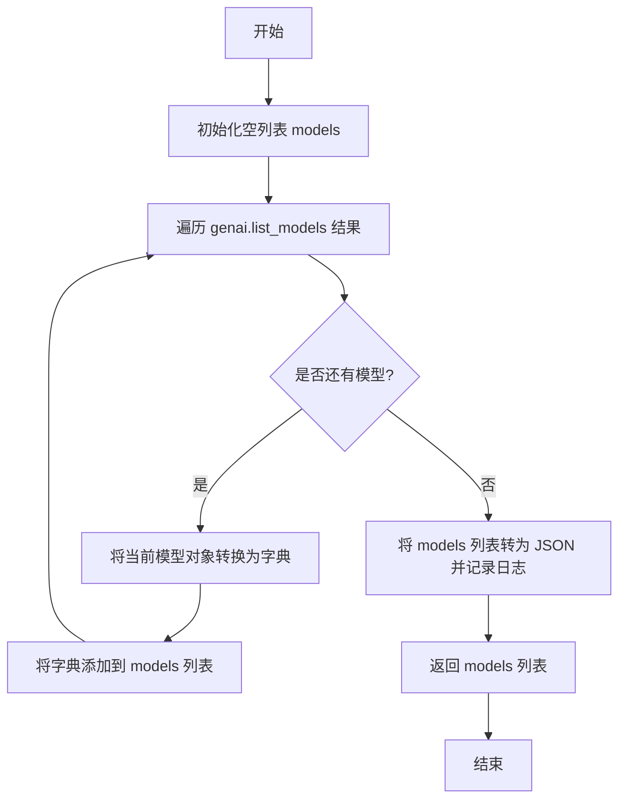

#### 带注释源码

```python
def list_models(self) -> List:
    # 初始化一个空列表，用于存储模型信息
    models = []
    # 遍历 genai.list_models 返回的模型生成器，page_size 参数指定每页获取的模型数量
    for model in genai.list_models(page_size=100):
        # 使用 dataclasses.asdict 将模型对象转换为字典，以便于序列化和记录
        models.append(asdict(model))
    # 将 models 列表转换为 JSON 格式的字符串，并记录到 INFO 级别的日志中
    logger.info(json.dumps(models))
    # 返回包含所有模型信息的字典列表
    return models
```

## 关键组件


### GeminiGenerativeModel 类

继承自 `google.generativeai.generative_models.GenerativeModel` 的自定义类，用于解决官方库特定版本中 `count_tokens` 方法缺失的问题，提供了同步和异步的令牌计数功能。

### 消息格式化与角色映射

定义了 `_user_msg`、`_assistant_msg`、`_system_msg` 方法以及 `format_msg` 函数，用于将内部通用的消息格式（如字符串、`Message` 对象、字典）统一转换为符合 Gemini API 要求的 `list[dict]` 格式，其中每个字典包含 `role`（`"user"` 或 `"model"`）和 `parts` 键。

### 令牌计数与成本计算

通过 `get_usage` 和 `aget_usage` 方法，利用 `GeminiGenerativeModel.count_tokens` 和 `count_tokens_async` 方法分别计算请求（prompt）和响应（completion）的令牌数量，并据此更新成本记录。

### 请求参数构造

`_const_kwargs` 方法负责构建调用 Gemini API 所需的核心参数字典，包括消息内容（`contents`）、生成配置（如 `temperature`）以及是否流式输出（`stream`）等。

### 流式响应处理

`_achat_completion_stream` 方法实现了异步流式响应处理，它逐个接收响应块（`chunk`），拼接成完整内容，并在过程中实时输出日志，最后计算总令牌使用量并更新成本。

### 模型列表获取

`list_models` 方法通过调用 `genai.list_models` 获取可用的 Gemini 模型列表，并将其转换为字典列表格式后记录日志。


## 问题及建议


### 已知问题

-   **系统提示处理不一致**：`GeminiLLM` 类中的 `use_system_prompt` 属性被硬编码为 `False`，并注释说明 Gemini API 不支持系统提示。然而，`_system_msg` 方法却将系统消息转换为 `role: "user"` 的消息。这种处理方式可能导致语义混淆，并且与基类 `BaseLLM` 或其他 LLM 提供商的系统提示处理逻辑不一致，增加了代码的理解和维护成本。
-   **消息格式转换逻辑存在潜在错误**：`format_msg` 方法在处理 `Message` 对象时，简单地将 `msg.role` 为 `"user"` 以外的所有情况都映射为 `role: "model"`。这假设了 `Message` 对象的角色只有 `"user"` 和 `"assistant"`（或其他非用户角色）。如果 `Message` 对象的角色定义更加复杂（例如包含 `"system"`），此映射逻辑将不正确，可能导致生成的消息格式不符合 Gemini API 的预期。
-   **令牌计数可能不准确**：`get_usage` 和 `aget_usage` 方法在计算 `prompt_tokens` 时，仅提取了消息列表中最后一个用户消息 (`messages[-1]["parts"][0]`) 的文本内容。这忽略了对话历史中所有之前的消息，导致计算的提示令牌数远低于实际值，进而使得成本计算 (`_update_costs`) 不准确。
-   **异常处理不完整**：在 `_achat_completion_stream` 方法的流式响应处理中，当捕获到异常时，代码直接 `raise BlockedPromptException(str(chunk))`。这虽然抛出了异常，但丢失了原始异常 `e` 的上下文信息，不利于调试和问题定位。
-   **配置初始化与环境变量副作用**：`__init_gemini` 方法直接设置了 `os.environ["http_proxy"]` 和 `os.environ["https_proxy"]`。这会修改全局进程的环境变量，可能对该进程内其他不相关部分的网络请求产生意外的副作用，是一种具有侵入性的配置方式。
-   **`GeminiGenerativeModel` 类的临时性**：创建 `GeminiGenerativeModel` 子类是为了解决上游库的一个特定问题（引用了一个 GitHub PR 链接）。这是一个临时性的补丁。如果上游库修复了该问题，此子类可能变得多余，但代码中缺乏相应的切换机制或版本检测来在未来回归到默认的 `GenerativeModel`。

### 优化建议

-   **重构消息角色映射逻辑**：明确 `GeminiLLM` 对系统消息的处理策略。建议移除 `_system_msg` 方法，或在 `format_msg` 方法中明确处理 `Message` 对象中 `role` 为 `"system"` 的情况，例如将其转换为一个特殊的用户提示（如“System: {msg}”），并在文档中清晰说明。同时，确保 `format_msg` 对 `Message.role` 的映射逻辑健壮，可以定义一个从内部角色到 Gemini API 角色的明确映射字典。
-   **修正令牌计数逻辑**：`get_usage` 和 `aget_usage` 方法应计算整个 `messages` 列表（而不仅仅是最后一条）的令牌数。需要将完整的 `messages` 列表传递给 `count_tokens` 方法。同时，确保用于计算 `completion_tokens` 的 `resp_text` 格式正确（目前是字符串，可能需要包装成 `{"role": "model", "parts": [{"text": resp_text}]}` 的格式，具体取决于 `count_tokens` 方法的要求）。
-   **改进异常处理**：在 `_achat_completion_stream` 中，当捕获到处理 `chunk.text` 的异常时，应该将原始异常 `e` 的信息也包含在抛出的新异常中，或者直接重新抛出原始异常（如果 `BlockedPromptException` 不是必须的）。例如：`raise BlockedPromptException(f"Failed to process chunk: {e}. Chunk data: {chunk}") from e`。
-   **使用更安全的配置方式**：避免直接修改 `os.environ`。可以为 `genai.configure` 或底层的 HTTP 客户端（如果支持）提供代理配置参数。如果必须设置环境变量，应考虑在局部作用域内临时修改（例如使用 `unittest.mock.patch.dict` 在测试中），并明确其影响范围。在生产代码中，应优先寻找库本身支持的配置接口。
-   **为临时补丁添加回归条件**：为 `GeminiGenerativeModel` 类添加一个版本检查或功能标志。可以检查 `google.generativeai` 的版本号，如果版本高于修复了相关问题的版本，则直接使用原生的 `GenerativeModel` 类。这样可以确保代码在未来上游库更新后能自动优化。
-   **增强类型注解与文档**：为所有方法参数和返回值添加更精确的类型注解（例如，`messages` 参数的具体结构）。在 `format_msg` 等关键方法上添加详细的文档字符串，说明其输入输出的具体格式和转换规则，特别是关于角色映射的约定。
-   **考虑异步初始化**：如果 `genai.configure` 或模型加载有潜在的 I/O 操作，考虑将 `__init_gemini` 中的部分逻辑移至一个异步初始化方法中，以避免在同步构造函数中执行可能阻塞的操作。


## 其它


### 设计目标与约束

本模块的核心设计目标是提供一个与Google Gemini大语言模型API交互的标准化、可扩展的封装层，作为MetaGPT框架中`BaseLLM`抽象基类的具体实现。主要约束包括：1) 必须兼容Gemini API特定的消息格式（`role`和`parts`键）和流式/非流式调用方式；2) 需要适配MetaGPT框架的`LLMConfig`统一配置模型、异步接口规范及成本计算机制；3) 需处理Gemini API不支持独立系统提示（system prompt）的特性，通过变通方式整合系统信息；4) 需通过`register_provider`机制实现与框架的插件化集成。

### 错误处理与异常设计

模块的错误处理主要围绕API调用异常和内容生成异常展开。对于网络超时、认证失败等底层API异常，依赖`google.generativeai`库抛出原生异常。对于内容生成过程中因安全策略导致的`BlockedPromptException`，在`_achat_completion_stream`方法中进行了显式捕获和日志记录，并重新抛出以通知上游调用者。在`format_msg`方法中对非法消息格式进行了校验，会抛出`ValueError`。成本计算（`get_usage`, `aget_usage`）和消息转换过程中的异常未做显式处理，依赖调用链上层的通用错误处理机制。整体错误处理策略偏向于“快速失败”，将具体异常传递给框架统一处理。

### 数据流与状态机

模块的数据流始于外部调用（如同步`completion`或异步`acompletion`方法），输入为经过`format_msg`方法标准化后的消息列表（`list[dict]`）。核心处理路径为：通过`_const_kwargs`方法组装API调用参数 -> 调用`GeminiGenerativeModel.generate_content`（或异步版本） -> 接收`GenerateContentResponse` -> 通过`get_choice_text`提取文本 -> 通过`get_usage`/`aget_usage`计算令牌消耗 -> 调用`_update_costs`（继承自`BaseLLM`）更新成本。对于流式响应（`_achat_completion_stream`），数据流变为异步迭代`AsyncGenerateContentResponse`，逐块收集文本并实时日志输出，最后聚合计算用量。模块本身是无状态的，所有配置和模型实例在初始化时确定。

### 外部依赖与接口契约

**外部依赖：**
1.  **`google.generativeai` (genai)**: 核心SDK，用于配置API密钥、调用模型、管理会话。
2.  **`google.ai.generativelanguage` (glm)**: 提供底层数据类型（如`CountTokensResponse`）。
3.  **`metagpt`框架内部模块**:
    *   `metagpt.configs.llm_config.LLMConfig`: 提供统一的LLM配置（API密钥、模型、代理等）。
    *   `metagpt.provider.base_llm.BaseLLM`: 定义LLM提供商的抽象接口（如`completion`, `acompletion`, `_update_costs`）。
    *   `metagpt.provider.llm_provider_registry.register_provider`: 用于向框架注册此提供商。
    *   `metagpt.schema.Message`: 框架内部的消息结构体。
    *   `metagpt.const.USE_CONFIG_TIMEOUT`: 默认超时常量。
    *   `metagpt.logs`: 日志工具。

**接口契约：**
1.  **对上游（MetaGPT框架）的契约**：实现`BaseLLM`定义的抽象方法（如`completion`, `acompletion`, `format_msg`等），确保返回类型（`GenerateContentResponse`或`dict`）和错误行为符合框架预期。
2.  **对下游（Gemini API）的契约**：严格按照Gemini API要求的格式（如`contents`结构、`role`枚举值）构造请求，并正确解析其响应对象（`GenerateContentResponse`, `AsyncGenerateContentResponse`, `CountTokensResponse`）。
3.  **`GeminiGenerativeModel`类的存在**：是对官方`GenerativeModel`的一个临时补丁，旨在修复一个特定的令牌计数方法缺失问题（参考代码注释中的GitHub链接）。这是一个脆弱的依赖点，未来官方库修复后应移除。

### 安全与合规考虑

模块通过`LLMConfig`接收API密钥，并在`__init_gemini`中通过`genai.configure`进行配置。支持通过`config.proxy`设置网络代理，可能用于满足企业网络策略或区域访问要求。代码中显式处理了`BlockedPromptException`，这表明模块已意识到并准备处理因内容安全策略（如生成有害内容）导致的API拒绝，这是大语言模型应用的重要合规环节。令牌用量计算和成本跟踪功能有助于监控和优化API使用，避免意外开销。模块未包含对话历史持久化或用户数据本地处理逻辑，数据隐私责任主要在于上游调用方和Gemini服务本身。

    