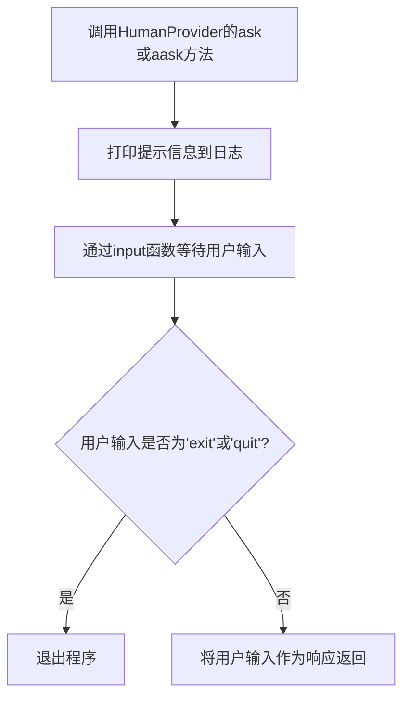
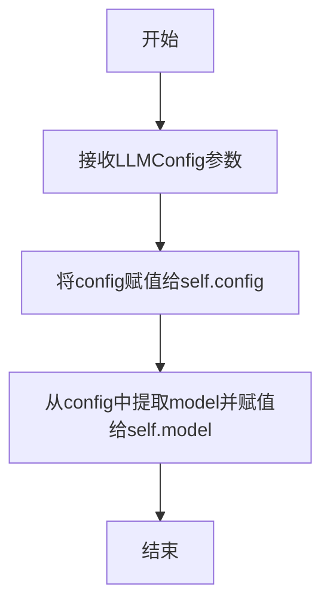
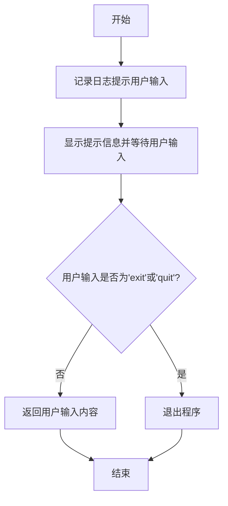
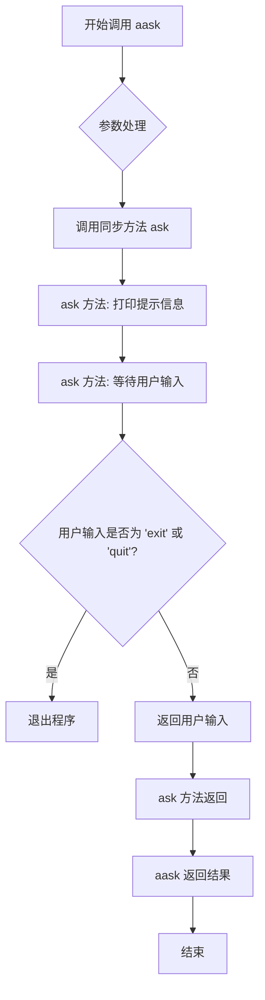
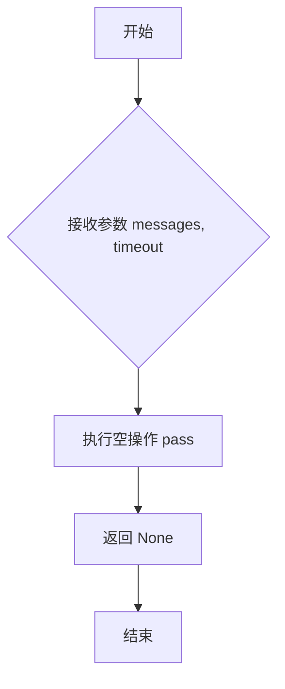
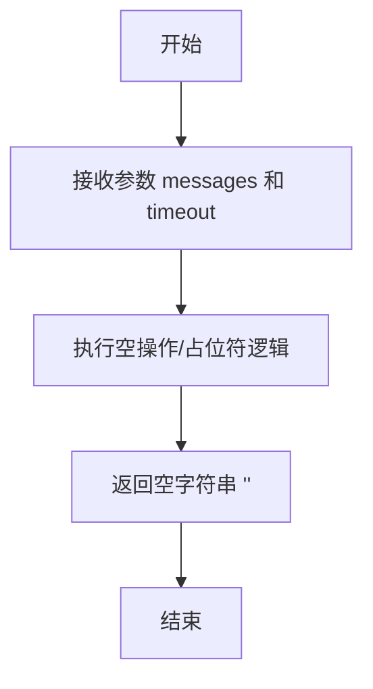
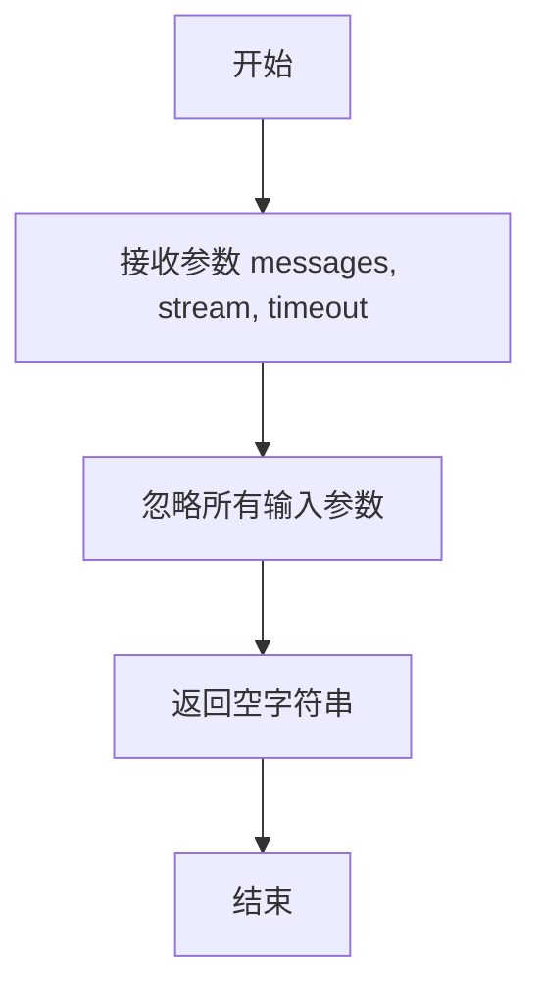

# `.\MetaGPT\metagpt\provider\human_provider.py` 详细设计文档

该代码实现了一个名为 `HumanProvider` 的类，它继承自 `BaseLLM`。其核心功能是作为一个“人类模型”提供者，在需要LLM（大语言模型）响应的框架中，允许用户通过命令行输入来手动提供响应，从而在自动化流程中引入人工交互环节。

## 整体流程



## 类结构

```
BaseLLM (抽象基类)
└── HumanProvider (人类交互提供者)
```

## 全局变量及字段


### `HumanProvider.config`
    
LLM配置对象，包含模型、API密钥等配置信息

类型：`LLMConfig`
    


### `HumanProvider.model`
    
模型名称，从config.model中获取，标识当前使用的模型

类型：`str`
    
    

## 全局函数及方法

### `HumanProvider.__init__`

该方法用于初始化`HumanProvider`类的实例，主要功能是接收一个`LLMConfig`配置对象，并将其赋值给实例的`config`属性，同时从配置中提取模型名称并赋值给`model`属性。这使得`HumanProvider`能够模拟一个LLM（大语言模型）的配置接口，但实际上是通过人类输入来提供响应。

参数：

- `config`：`LLMConfig`，一个包含LLM配置信息的对象，用于初始化人类提供者的配置。

返回值：`None`，该方法没有返回值。

#### 流程图



#### 带注释源码

```python
def __init__(self, config: LLMConfig):
    # 将传入的LLMConfig对象赋值给实例的config属性
    self.config = config
    # 从config对象中提取model字段的值，并赋值给实例的model属性
    self.model = config.model
```

### `HumanProvider.ask`

该方法用于在控制台向用户显示提示信息，并等待用户输入。用户输入的内容将作为响应返回。如果用户输入"exit"或"quit"，程序将退出。

参数：

- `msg`：`str`，显示给用户的提示信息
- `timeout`：`int`，超时时间（此参数在此方法中未使用，仅为了保持接口一致性）

返回值：`str`，用户输入的响应内容

#### 流程图



#### 带注释源码

```python
def ask(self, msg: str, timeout=USE_CONFIG_TIMEOUT) -> str:
    # 记录日志，提示用户输入响应
    logger.info("It's your turn, please type in your response. You may also refer to the context below")
    
    # 显示提示信息并等待用户输入
    rsp = input(msg)
    
    # 检查用户输入是否为退出命令
    if rsp in ["exit", "quit"]:
        exit()  # 如果是退出命令，则退出程序
    
    # 返回用户输入的内容作为响应
    return rsp
```

### `HumanProvider.aask`

该方法允许在异步上下文中获取人类用户的输入作为响应，本质上是通过同步的 `ask` 方法实现，用于在需要人类交互的场景中模拟或替代LLM的响应。

参数：

- `msg`：`str`，提示信息，将作为输入提示显示给用户。
- `system_msgs`：`Optional[list[str]]`，系统消息列表，在此方法中未使用。
- `format_msgs`：`Optional[list[dict[str, str]]]`，格式化消息列表，在此方法中未使用。
- `generator`：`bool`，指示是否以生成器模式返回，在此方法中未使用。
- `timeout`：`int`，超时时间，默认使用配置中的超时设置。
- `**kwargs`：`Any`，其他关键字参数，在此方法中未使用。

返回值：`str`，用户通过命令行输入的内容。

#### 流程图



#### 带注释源码

```python
async def aask(
    self,
    msg: str,
    system_msgs: Optional[list[str]] = None,
    format_msgs: Optional[list[dict[str, str]]] = None,
    generator: bool = False,
    timeout=USE_CONFIG_TIMEOUT,
    **kwargs
) -> str:
    # 调用同步的 ask 方法，传入提示信息 msg 和经过 get_timeout 处理后的超时时间
    return self.ask(msg, timeout=self.get_timeout(timeout))
```


### `HumanProvider._achat_completion`

该方法是一个异步占位符方法，旨在实现与AI模型进行异步聊天补全的接口，但在`HumanProvider`类中，其核心功能是通过人类输入来模拟AI响应，因此该方法没有实际的异步网络请求逻辑，直接返回`None`。

参数：

-  `messages`：`list[dict]`，一个字典列表，通常包含对话的历史消息，格式为`[{"role": "user", "content": "..."}, ...]`。在此人类提供者实现中，此参数未被使用。
-  `timeout`：`int`，请求的超时时间（秒）。默认值为`USE_CONFIG_TIMEOUT`。在此实现中，此参数未被使用。

返回值：`None`，该方法不返回任何值。

#### 流程图



#### 带注释源码

```
    async def _achat_completion(self, messages: list[dict], timeout=USE_CONFIG_TIMEOUT):
        # 这是一个占位符方法。
        # 在HumanProvider中，真正的“模型”是人类用户，因此不需要实现标准的异步聊天补全。
        # 该方法直接返回None，表示没有进行任何AI模型调用。
        pass
```


### `HumanProvider.acompletion`

该方法是一个占位实现，用于满足基类 `BaseLLM` 中定义的抽象方法 `acompletion` 的接口要求。在 `HumanProvider` 类中，此方法不执行任何实际的大语言模型调用逻辑，而是直接返回一个空列表，因为该类旨在将人类输入作为“模型”响应，而非调用外部API。

参数：

- `messages`：`list[dict]`，一个字典列表，通常包含对话历史或提示信息。在此实现中，该参数被忽略。
- `timeout`：`int`，默认值为 `USE_CONFIG_TIMEOUT`，表示请求的超时时间。在此实现中，该参数被忽略。

返回值：`list`，一个空列表。

#### 流程图

```mermaid
flowchart TD
    A[开始] --> B[接收参数 messages 和 timeout]
    B --> C[忽略参数，不执行任何处理]
    C --> D[返回空列表 []]
    D --> E[结束]
```

#### 带注释源码

```python
async def acompletion(self, messages: list[dict], timeout=USE_CONFIG_TIMEOUT):
    """dummy implementation of abstract method in base"""
    # 该方法是一个占位实现，直接返回空列表。
    # 参数 `messages` 和 `timeout` 在此实现中均被忽略。
    return []
```

### `HumanProvider._achat_completion_stream`

该方法是一个异步占位符方法，旨在模拟大语言模型（LLM）的流式聊天完成功能，但在`HumanProvider`类中，其核心功能是通过人类输入来模拟AI响应，因此该方法并未实现流式输出逻辑，直接返回一个空字符串。

参数：

-  `messages`：`list[dict]`，表示对话历史的消息列表，每个消息是一个字典。
-  `timeout`：`int`，表示请求的超时时间，默认值为`USE_CONFIG_TIMEOUT`。

返回值：`str`，返回一个空字符串，表示没有流式内容生成。

#### 流程图



#### 带注释源码

```python
async def _achat_completion_stream(self, messages: list[dict], timeout: int = USE_CONFIG_TIMEOUT) -> str:
    # 这是一个占位符方法，用于满足父类 BaseLLM 的接口要求。
    # 在 HumanProvider 中，流式响应并不适用，因为响应来自人类输入，而非AI模型生成。
    # 因此，该方法直接返回一个空字符串，不执行任何实际的消息处理或流式生成逻辑。
    pass
```

### `HumanProvider.acompletion_text`

该方法是一个占位实现，用于满足基类 `BaseLLM` 中定义的抽象方法 `acompletion_text` 的接口要求。在 `HumanProvider` 类中，此方法不执行任何实际的文本生成逻辑，而是直接返回一个空字符串。它的主要作用是允许 `HumanProvider` 类在不实现完整 LLM 功能的情况下，能够被集成到框架中，作为人类交互的替代接口。

参数：

- `messages`：`list[dict]`，一个字典列表，通常包含对话历史或提示信息。在此实现中，该参数被忽略。
- `stream`：`bool`，一个布尔值，指示是否以流式方式返回结果。在此实现中，该参数被忽略。
- `timeout`：`int`，请求的超时时间（秒）。在此实现中，该参数被忽略。

返回值：`str`，一个空字符串。

#### 流程图



#### 带注释源码

```python
async def acompletion_text(self, messages: list[dict], stream=False, timeout=USE_CONFIG_TIMEOUT) -> str:
    """dummy implementation of abstract method in base"""
    # 这是一个占位符方法，用于满足基类 `BaseLLM` 的接口要求。
    # 它不处理任何输入参数（messages, stream, timeout），直接返回一个空字符串。
    # 这使得 HumanProvider 类可以在需要调用 LLM 生成文本的上下文中被使用，
    # 但实际上是通过人类输入（ask/aask 方法）来获取响应。
    return ""
```


### `HumanProvider.get_timeout`

该方法用于确定最终的超时时间。它接收一个超时参数，如果该参数为假值（例如 `0` 或 `None`），则返回一个预定义的默认超时时间；否则，直接返回传入的超时参数。

参数：

-  `timeout`：`int`，调用方指定的超时时间（秒）。如果为假值（如 `0` 或 `None`），将使用默认值。

返回值：`int`，最终确定的超时时间（秒）。

#### 流程图

```mermaid
flowchart TD
    A[开始: get_timeout(timeout)] --> B{timeout 是否为真?}
    B -- 是 --> C[返回 timeout]
    B -- 否 --> D[返回 LLM_API_TIMEOUT]
    C --> E[结束]
    D --> E
```

#### 带注释源码

```python
def get_timeout(self, timeout: int) -> int:
    # 如果传入的 timeout 参数为真（非零且非 None），则直接返回该值。
    # 否则，返回从常量 LLM_API_TIMEOUT 导入的默认超时时间。
    return timeout or LLM_API_TIMEOUT
```


## 关键组件


### HumanProvider 类

作为 `BaseLLM` 的子类，`HumanProvider` 的核心功能是将人类用户模拟为一个“语言模型”，通过标准输入（`input`）接收用户的文本输入作为模型的响应，从而在框架的任何需要 LLM 的地方引入人工交互。

### 配置与初始化

`HumanProvider` 的初始化依赖于 `LLMConfig` 配置对象，该配置决定了“模型”的行为参数（尽管在此实现中大部分参数未被使用，但保持了与框架其他 LLM 提供者一致的接口）。

### 同步交互方法 (`ask`)

`ask` 方法是 `HumanProvider` 的核心同步交互接口。它向用户打印提示信息，然后通过 `input(msg)` 阻塞等待用户输入。用户输入 `"exit"` 或 `"quit"` 将直接退出程序，否则将用户输入作为“模型”的响应返回。

### 异步交互方法 (`aask`)

`aask` 方法是 `HumanProvider` 的核心异步交互接口。为了保持与异步框架的兼容性，它内部直接调用了同步的 `ask` 方法。它接受与框架中其他 LLM 提供者相似的参数（如 `system_msgs`, `format_msgs`），但在当前实现中并未使用这些参数来格式化或影响用户提示。

### 占位/虚拟实现方法

`_achat_completion`、`acompletion`、`_achat_completion_stream` 和 `acompletion_text` 这些方法是 `BaseLLM` 抽象基类要求的接口。在 `HumanProvider` 中，它们被实现为不执行实际操作的“虚拟”方法（返回空列表、空字符串或直接 `pass`），以满足接口契约，同时表明 `HumanProvider` 不支持这些高级的、通常与远程 API 调用相关的功能（如流式响应、结构化补全）。

### 超时控制 (`get_timeout`)

`get_timeout` 方法提供了一个简单的超时值解析逻辑：如果调用方提供了明确的超时值，则使用该值；否则，使用框架定义的默认超时常量 `LLM_API_TIMEOUT`。这保持了与框架中其他 LLM 提供者超时处理逻辑的一致性。


## 问题及建议


### 已知问题

-   **异步方法实现不完整或不一致**：`HumanProvider` 类中的多个异步方法（如 `_achat_completion`、`acompletion`、`_achat_completion_stream`、`acompletion_text`）仅包含 `pass` 语句或返回空值/默认值。这违反了其父类 `BaseLLM` 的接口契约，可能导致依赖这些异步方法进行实际LLM交互的调用方出现运行时错误或行为异常。
-   **同步与异步方法逻辑割裂**：核心的 `ask` 方法是同步的，而 `aask` 方法虽然标记为异步，但其内部直接调用了同步的 `ask` 方法，并未实现真正的异步操作（如等待用户输入时不阻塞事件循环）。这可能导致在异步上下文中使用此类时，用户体验不佳或性能问题。
-   **异常处理缺失**：`ask` 方法中，当用户输入 `"exit"` 或 `"quit"` 时，直接调用 `exit()`。这会强制终止整个Python进程，是一种非常粗暴的错误处理方式，不利于上层调用者进行资源清理或优雅降级。
-   **配置参数未充分利用**：在 `__init__` 中接收了 `LLMConfig` 配置对象，但除了将其 `model` 字段赋值给实例变量外，未在其他方法（如 `ask`, `aask`）中利用配置中的其他潜在参数（如 `timeout` 的默认值逻辑已由 `get_timeout` 处理，但配置中可能还有其他相关设置）。
-   **`generator` 参数被忽略**：`aask` 方法的 `generator` 参数在签名中被定义，但在实现中完全未被使用。如果调用方期望根据此参数获得一个生成器（流式响应），当前实现无法满足。

### 优化建议

-   **完善异步方法实现或明确其定位**：
    -   **方案A（推荐）**：如果 `HumanProvider` 的设计目标仅是用于同步交互或测试场景，应重写或移除这些异步的抽象方法，或者将其实现为抛出明确的 `NotImplementedError` 并附上说明，防止误用。同时，考虑将 `BaseLLM` 拆分为同步基类和异步基类，使 `HumanProvider` 仅继承所需的部分。
    -   **方案B**：如果需要支持真正的异步人机交互（例如，在GUI或Web应用中等待输入），应使用异步I/O库（如 `asyncio` 的 `run_in_executor` 或专用异步输入库）重构 `ask` 和 `aask` 方法，使其在等待用户输入时不阻塞事件循环。
-   **重构异常处理逻辑**：
    -   将 `ask` 方法中的 `exit()` 调用改为抛出一个自定义的、易于识别的异常（例如 `HumanInteractionExit`）。这样，上层调用者可以捕获此异常并决定如何处理（例如，结束当前任务、记录日志、或向用户反馈），而不是整个进程意外终止。
-   **增强方法实现的健壮性与一致性**：
    -   在 `aask` 方法中，应考虑对 `system_msgs` 和 `format_msgs` 参数进行处理或至少记录日志，以保持与LLM提供商接口行为的一致性，即使当前实现不直接使用它们。
    -   移除或实现 `generator` 参数的功能。如果支持流式响应，则需修改 `aask` 和 `acompletion_text` 的返回逻辑；如果不支持，应从方法签名中移除该参数，或在文档中明确说明其被忽略。
-   **考虑配置的扩展性**：
    -   评估 `LLMConfig` 中是否包含适用于人类交互的配置项（例如，提示语模板、输入验证规则、超时提示信息等）。如果有，应在 `__init__` 或相关方法中加载并使用这些配置，使人类交互行为更具可配置性。
-   **补充文档与类型注解**：
    -   在类和方法层级添加更详细的文档字符串，明确说明 `HumanProvider` 的适用场景（如测试、演示、特定的人机协作环节）、其与标准LLM提供商的差异（如同步本质、不支持流式响应等），以及关键方法的行为。
    -   确保所有方法参数和返回值的类型注解完整且准确。


## 其它


### 设计目标与约束

本模块的核心设计目标是提供一个`BaseLLM`抽象基类的具体实现，该实现将人类用户模拟为一个“语言模型”，从而允许在框架的任何需要LLM的地方引入人工交互。主要约束包括：1) 必须完全实现`BaseLLM`定义的异步接口，即使部分功能对人类交互不适用（如流式输出），也需要提供符合接口契约的“空”实现；2) 交互过程需保持简洁，通过标准输入输出与用户通信；3) 需正确处理超时配置，尽管在同步输入场景下超时可能不强制执行，但接口需保持一致性。

### 错误处理与异常设计

当前代码的错误处理较为简单。主要设计点包括：1) 在`ask`方法中，如果用户输入“exit”或“quit”，程序将直接退出(`exit()`)，这是一种较为强硬的流程控制，而非通过异常机制。2) 其他方法（如`_achat_completion`, `acompletion_text`）为实现接口契约而提供的空实现或返回默认值，并未定义或抛出特定的异常。潜在的改进是定义一个自定义异常（如`HumanInteractionExit`）来替代直接调用`exit()`，允许上层调用者捕获并处理退出请求，提高代码的健壮性和可测试性。

### 数据流与状态机

本模块不涉及复杂的状态管理。数据流是线性的：1) 调用者（通常是框架中的`Action`或其它组件）通过`ask`或`aask`方法传入提示信息(`msg`)。2) 方法将提示信息输出到控制台，并阻塞等待用户通过标准输入(`input`)提供响应。3) 用户的输入字符串被直接作为“模型响应”返回给调用者。整个过程中，`HumanProvider`实例本身无内部状态变化，是一个无状态的适配器。

### 外部依赖与接口契约

1.  **继承与实现契约**：本类继承自`metagpt.provider.base_llm.BaseLLM`，必须实现其所有抽象方法（如`_achat_completion`, `acompletion`等），即使部分方法对人类提供者无实际意义。
2.  **配置依赖**：依赖`metagpt.configs.llm_config.LLMConfig`作为初始化参数，虽然其中大部分配置项（如API Key, Base URL）对人类模式无用，但保持了与其它LLM提供商（如OpenAI）一致的初始化接口。
3.  **常量依赖**：依赖`metagpt.const`中定义的`LLM_API_TIMEOUT`和`USE_CONFIG_TIMEOUT`常量，用于超时逻辑的默认值处理。
4.  **日志依赖**：依赖`metagpt.logs.logger`进行运行信息记录。
5.  **标准I/O**：核心功能依赖Python内置的`input`函数和`print`（通过`logger.info`间接实现）进行人机交互，这是与运行环境的主要交互点。

    