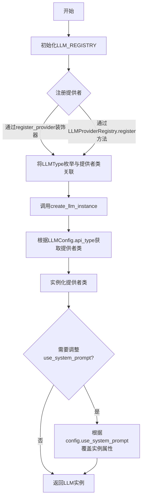
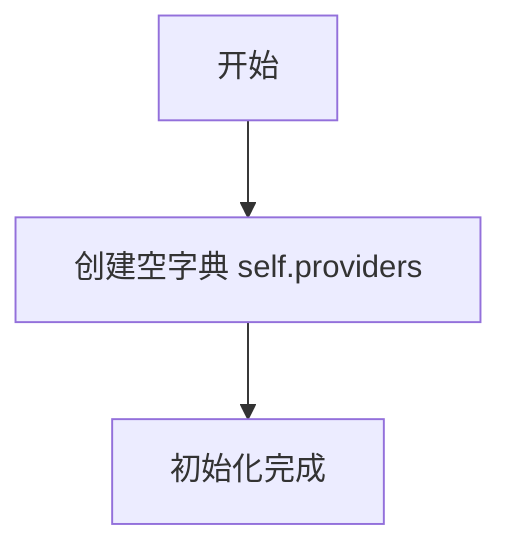

# `.\MetaGPT\metagpt\provider\llm_provider_registry.py` 详细设计文档

该代码实现了一个LLM（大语言模型）提供者注册表，用于管理和创建不同LLM类型的实例。它通过注册机制将LLM类型枚举映射到具体的提供者类，并根据配置动态创建相应的LLM实例，同时支持对特定模型（如OpenAI的o1系列）进行系统提示的配置覆盖。

## 整体流程



## 类结构

```
LLMProviderRegistry
├── 字段: providers
├── 方法: __init__
├── 方法: register
└── 方法: get_provider

全局函数:
├── register_provider
└── create_llm_instance

全局变量:
└── LLM_REGISTRY
```

## 全局变量及字段


### `LLM_REGISTRY`
    
全局的LLM提供者注册表单例实例，用于管理和获取不同LLM类型的提供者类。

类型：`LLMProviderRegistry`
    


### `LLMProviderRegistry.providers`
    
一个字典，用于存储注册的LLM提供者类，键为LLM类型枚举，值为对应的提供者类。

类型：`dict`
    
    

## 全局函数及方法

### `register_provider`

`register_provider` 是一个装饰器函数，用于将一个或多个键（`keys`）与一个 LLM 提供者类（`cls`）注册到全局注册表 `LLM_REGISTRY` 中。它支持传入单个键或键列表，并返回装饰后的类，确保类在定义时即完成注册。

参数：

- `keys`：`Union[str, List[str]]`，一个字符串或字符串列表，代表要注册到提供者类的键。这些键通常是 `LLMType` 枚举值，用于后续查找和实例化对应的 LLM 提供者。

返回值：`Callable[[Type[BaseLLM]], Type[BaseLLM]]`，返回一个装饰器函数，该装饰器接受一个类（`cls`）作为参数，将其注册到 `LLM_REGISTRY` 中，然后返回该类本身。

#### 流程图

```mermaid
flowchart TD
    A[调用 register_provider(keys)] --> B{keys 是否为列表?};
    B -- 是 --> C[遍历 keys 列表];
    C --> D[对每个 key 调用<br>LLM_REGISTRY.register(key, cls)];
    B -- 否 --> E[直接调用<br>LLM_REGISTRY.register(keys, cls)];
    D --> F[返回装饰后的类 cls];
    E --> F;
```

#### 带注释源码

```python
def register_provider(keys):
    """register provider to registry"""

    def decorator(cls):
        # 判断传入的 keys 参数是单个键还是列表
        if isinstance(keys, list):
            # 如果是列表，则遍历列表，将每个键与类 cls 注册到全局注册表中
            for key in keys:
                LLM_REGISTRY.register(key, cls)
        else:
            # 如果是单个键，则直接将该键与类 cls 注册到全局注册表中
            LLM_REGISTRY.register(keys, cls)
        # 返回被装饰的类本身，允许其正常使用
        return cls

    # 返回内部定义的装饰器函数
    return decorator
```


### `create_llm_instance`

该函数是LLM（大语言模型）提供者的工厂函数。它根据传入的配置对象（`LLMConfig`），从全局注册表（`LLM_REGISTRY`）中查找对应的提供者类，并实例化一个具体的LLM对象。在实例化后，它会根据配置调整实例的`use_system_prompt`属性，以确保模型行为与配置一致，最后返回该实例。

参数：

-  `config`：`LLMConfig`，包含LLM配置信息的对象，例如API类型、API密钥、基础URL以及是否使用系统提示等。

返回值：`BaseLLM`，一个实例化的、符合`BaseLLM`接口的特定LLM提供者对象（如OpenAI、Anthropic等）。

#### 流程图

```mermaid
flowchart TD
    A[开始: 调用 create_llm_instance(config)] --> B[从LLM_REGISTRY获取提供者类<br>LLM_REGISTRY.get_provider(config.api_type)]
    B --> C[实例化提供者<br>ProviderClass(config)]
    C --> D{llm.use_system_prompt 为 True<br>且 config.use_system_prompt 为 False?}
    D -- 是 --> E[将 llm.use_system_prompt 设为 False]
    D -- 否 --> F[保持 llm.use_system_prompt 不变]
    E --> G
    F --> G[返回 llm 实例]
    G --> H[结束]
```

#### 带注释源码

```python
def create_llm_instance(config: LLMConfig) -> BaseLLM:
    """get the default llm provider"""
    # 1. 根据配置中的 api_type (LLMType枚举)，从全局注册表 LLM_REGISTRY 中获取对应的提供者类。
    # 2. 使用获取到的提供者类和传入的 config 参数，实例化一个具体的 LLM 对象。
    llm = LLM_REGISTRY.get_provider(config.api_type)(config)

    # 3. 处理系统提示符使用的特殊情况：
    #    - 某些模型（如OpenAI的o1系列）在其提供者类中默认将 `use_system_prompt` 设为 True。
    #    - 但如果用户配置（config.use_system_prompt）明确指定为 False，则需要覆盖实例的默认值。
    #    这个检查确保实例的行为与用户的配置意图保持一致。
    if llm.use_system_prompt and not config.use_system_prompt:
        # for models like o1-series, default openai provider.use_system_prompt is True, but it should be False for o1-*
        llm.use_system_prompt = config.use_system_prompt

    # 4. 返回最终配置好的 LLM 实例。
    return llm
```


### `LLMProviderRegistry.__init__`

初始化 `LLMProviderRegistry` 类的实例，创建一个空的提供者字典，用于后续注册和获取不同的 LLM 提供者类。

参数：
-  `self`：`LLMProviderRegistry`，表示 `LLMProviderRegistry` 类的当前实例。

返回值：`None`，此方法为构造函数，不返回任何值。

#### 流程图



#### 带注释源码

```
def __init__(self):
    # 初始化一个空字典，用于存储注册的LLM提供者。
    # 键（key）通常是LLMType枚举值，值（value）是对应的提供者类。
    self.providers = {}
```


### `LLMProviderRegistry.register`

该方法用于向 `LLMProviderRegistry` 的注册表中注册一个 LLM 提供者类。它将一个键（通常是 `LLMType` 枚举值）与一个具体的提供者类（`BaseLLM` 的子类）关联起来，以便后续可以通过键来实例化对应的提供者。

参数：
- `key`：`Any`，用于标识和查找 LLM 提供者类的键，通常是 `LLMType` 枚举值。
- `provider_cls`：`Type[BaseLLM]`，要注册的 LLM 提供者类，必须是 `BaseLLM` 的子类。

返回值：`None`，该方法不返回任何值，其作用是将键值对存储到内部的 `providers` 字典中。

#### 流程图

```mermaid
flowchart TD
    A[开始：调用 register 方法] --> B{参数 key 和 provider_cls 是否有效？}
    B -- 是 --> C[执行注册：self.providers[key] = provider_cls]
    C --> D[结束：方法返回 None]
    B -- 否 --> E[引发异常或静默失败<br>（代码中未显式处理）]
    E --> D
```

#### 带注释源码

```python
def register(self, key, provider_cls):
    # 将传入的键（key）和提供者类（provider_cls）存储到实例的 providers 字典中。
    # 这使得后续可以通过 key 来获取对应的 provider_cls 并创建实例。
    self.providers[key] = provider_cls
```


### `LLMProviderRegistry.get_provider`

该方法根据传入的`LLMType`枚举值，从注册表中查找并返回对应的LLM提供者类。

参数：

-  `enum`：`LLMType`，表示要获取的LLM提供者类型的枚举值。

返回值：`type`，返回注册表中与`enum`键对应的LLM提供者类（`BaseLLM`的子类）。

#### 流程图

```mermaid
flowchart TD
    A[开始: 调用 get_provider(enum)] --> B{检查 providers 字典中<br>是否存在键 enum?}
    B -- 是 --> C[返回 providers[enum]]
    B -- 否 --> D[抛出 KeyError 异常]
    C --> E[结束: 返回提供者类]
    D --> E
```

#### 带注释源码

```python
def get_provider(self, enum: LLMType):
    """get provider instance according to the enum"""
    # 根据传入的枚举值 `enum` 作为键，从 `self.providers` 字典中查找对应的值。
    # 返回值是注册在该键下的 LLM 提供者类（例如，OpenAI、Anthropic 等）。
    return self.providers[enum]
```


## 关键组件

### LLMProviderRegistry

一个简单的提供者注册表，用于注册和根据枚举键获取不同的LLM提供者类。

### register_provider 装饰器

一个装饰器函数，用于将LLM提供者类注册到全局注册表 `LLM_REGISTRY` 中，支持单个键或键列表。

### create_llm_instance 函数

根据传入的 `LLMConfig` 配置，从全局注册表 `LLM_REGISTRY` 中获取对应的提供者类并实例化，同时根据配置调整实例的 `use_system_prompt` 属性。

### LLM_REGISTRY 全局实例

`LLMProviderRegistry` 类的全局单例实例，作为整个模块的中央注册表。

## 问题及建议


### 已知问题

-   **注册逻辑对`LLMType`枚举的强依赖**：`LLMProviderRegistry.get_provider`方法直接使用`LLMType`枚举作为键来查找提供者。如果未来需要支持动态或字符串类型的键（例如，从配置文件中读取的模型名称），当前的强类型枚举设计会限制扩展性。
-   **缺少提供者存在性检查**：`get_provider`方法直接通过键访问字典，如果传入的键未注册，会抛出`KeyError`异常。这可能导致运行时错误，而不是更友好的、可预期的处理方式。
-   **`create_llm_instance`中的条件逻辑可能不完整**：代码中仅针对`llm.use_system_prompt`为`True`而`config.use_system_prompt`为`False`的情况进行了覆盖。可能存在其他需要根据配置覆盖的LLM实例属性，当前逻辑可能不全面或未来容易遗漏。
-   **全局变量`LLM_REGISTRY`的实例化时机**：`LLM_REGISTRY`在模块级别被实例化。虽然简单，但在某些复杂的导入场景或测试环境中，可能需要更可控的实例生命周期管理。
-   **`register_provider`装饰器对`keys`参数的类型处理**：装饰器内部通过`isinstance(keys, list)`来判断，如果传入的是其他可迭代类型（如`tuple`, `set`），则会被当作单个键处理，可能导致注册行为与预期不符。

### 优化建议

-   **解耦注册键与枚举**：考虑让`LLMProviderRegistry`支持更通用的键类型（如字符串），同时保留对`LLMType`枚举的支持（例如，通过将枚举值转换为字符串）。可以在`get_provider`方法内部增加键的标准化处理逻辑。
-   **增强`get_provider`方法的健壮性**：在`get_provider`方法中，使用`self.providers.get(key)`替代直接字典索引访问，并处理键不存在的情况。可以返回`None`、抛出更具业务含义的异常、或返回一个默认的提供者。
-   **重构属性覆盖逻辑**：考虑将`create_llm_instance`中根据配置覆盖LLM实例属性的逻辑抽象成一个独立的方法或策略模式。可以定义一个配置与实例属性的映射关系，使得属性的同步更加清晰和可维护。
-   **将注册表实例化封装在函数中**：可以提供`get_llm_registry()`函数来返回单例的`LLM_REGISTRY`，而不是直接暴露全局变量。这可以提高代码的可测试性和对实例生命周期的控制。
-   **改进`register_provider`装饰器的类型检查**：将`isinstance(keys, list)`检查改为更通用的`isinstance(keys, (list, tuple, set))`或检查是否为`collections.abc.Iterable`但非字符串的类型，以提高容错性和灵活性。
-   **考虑线程安全**：如果应用是多线程环境，对`LLMProviderRegistry.providers`字典的并发读写可能存在风险。可以考虑使用线程安全的数据结构（如`threading.Lock`）来保护`register`和`get_provider`操作。


## 其它


### 设计目标与约束

该模块的核心设计目标是提供一个灵活、可扩展的LLM（大语言模型）提供者注册与创建机制。它旨在将LLM提供者的具体实现与使用它们的业务逻辑解耦，使得系统能够轻松支持新的LLM服务（如OpenAI、Anthropic、本地模型等）而无需修改核心调用代码。主要约束包括：1) 必须与现有的`LLMConfig`配置结构和`BaseLLM`抽象基类兼容；2) 注册机制需要支持通过枚举（`LLMType`）或字符串等多种键值来查找提供者；3) 实例创建过程需要能够根据配置动态调整提供者的某些属性（如`use_system_prompt`）。

### 错误处理与异常设计

当前代码中的错误处理较为基础。`LLMProviderRegistry.get_provider`方法直接使用字典键查找（`self.providers[enum]`），如果传入的`enum`值未注册，将抛出`KeyError`异常。`create_llm_instance`函数依赖此方法，因此也存在同样的风险。建议的改进是：在`get_provider`方法中捕获`KeyError`，并抛出一个更具业务语义的自定义异常（如`ProviderNotFoundError`），其中包含未找到的提供者键信息。此外，`create_llm_instance`中在创建实例后对`use_system_prompt`属性的调整是静默进行的，如果未来有更多类似的配置覆盖逻辑，应考虑集中到一个初始化方法中，并进行参数有效性验证。

### 数据流与状态机

该模块的数据流相对简单直接，不涉及复杂的状态机。
1.  **初始化阶段**：模块加载时，全局变量`LLM_REGISTRY`被实例化。随后，各个LLM提供者类（如`OpenAILLM`）通过`@register_provider`装饰器将自己注册到该注册表中。这是一个静态的、启动时完成的过程。
2.  **运行时阶段**：当业务代码需要LLM实例时，调用`create_llm_instance(config)`函数。该函数内部通过`LLM_REGISTRY.get_provider(config.api_type)`根据配置中的`api_type`（`LLMType`枚举）查找对应的提供者类，然后实例化该类（传入`config`对象）。实例化后，有一个可选的、针对特定模型（如o1-series）的`use_system_prompt`属性校正步骤。最终，返回一个具体的`BaseLLM`子类实例给调用者。

### 外部依赖与接口契约

1.  **输入依赖**：
    *   `metagpt.configs.llm_config.LLMConfig`：作为创建LLM实例的核心配置输入，必须包含`api_type`等关键字段。
    *   `metagpt.configs.llm_config.LLMType`：作为在注册表中查找提供者的键类型。
2.  **输出/实现依赖**：
    *   `metagpt.provider.base_llm.BaseLLM`：所有通过本模块创建的LLM实例都必须继承自此抽象基类，保证了返回对象具有统一的接口（如`ask`, `aask`等方法）。
3.  **接口契约**：
    *   任何希望通过本模块被创建和使用的LLM提供者类，必须：a) 继承自`BaseLLM`；b) 其构造函数接受一个`LLMConfig`参数；c) 使用`@register_provider`装饰器将自己注册到一个或多个键（`LLMType`枚举值或字符串）上。`create_llm_instance`函数保证返回一个符合`BaseLLM`接口的可用对象。

### 并发与线程安全

当前实现未显式考虑并发安全。`LLMProviderRegistry`中的`providers`字典在模块初始化阶段（通过装饰器）被写入，在运行时阶段仅进行读取操作。如果整个应用的生命周期中，提供者注册仅在启动时发生一次，那么这种“初始化后只读”的模式在并发读取下是安全的。然而，如果设计上允许在运行时动态注册或注销提供者（当前代码支持但不鼓励），则对`providers`字典的读写操作需要使用锁（如`threading.RLock`）进行保护，以防止数据竞争和不一致。`create_llm_instance`函数本身是无状态的，其操作是线程安全的。

### 配置管理与环境变量

LLM实例的创建严重依赖于外部传入的`LLMConfig`对象。该配置对象本身应负责从环境变量、配置文件等处加载配置（如API Key、Base URL、模型名称、超时设置等）。本模块（`llm_provider_registry.py`）不直接处理环境变量或配置文件，它只接受一个已经构建好的`LLMConfig`实例。这是一种关注点分离的良好设计，将配置的获取与解析和提供者的注册与实例化分离。配置的验证逻辑（如必要的API Key是否存在）应在`LLMConfig`的构建过程中或`BaseLLM`子类的初始化方法中完成。

### 测试策略建议

1.  **单元测试**：
    *   `LLMProviderRegistry`：测试`register`和`get_provider`方法，包括正常注册查找、查找未注册键时是否抛出预期异常。
    *   `register_provider`装饰器：测试其能否正确地将类注册到单键和键列表。
    *   `create_llm_instance`：使用模拟（Mock）对象测试其能否根据不同的`LLMConfig`正确选择提供者类并实例化，以及属性覆盖逻辑（`use_system_prompt`）是否正确执行。
2.  **集成测试**：测试从读取配置开始，到通过`create_llm_instance`成功创建一个真实或模拟的LLM提供者实例的完整流程。
3.  **模拟（Mock）**：在测试依赖于外部LLM API的代码时，应利用本注册机制，注册一个模拟的LLM提供者类，用于返回可控的响应，避免调用真实API并产生费用。


    