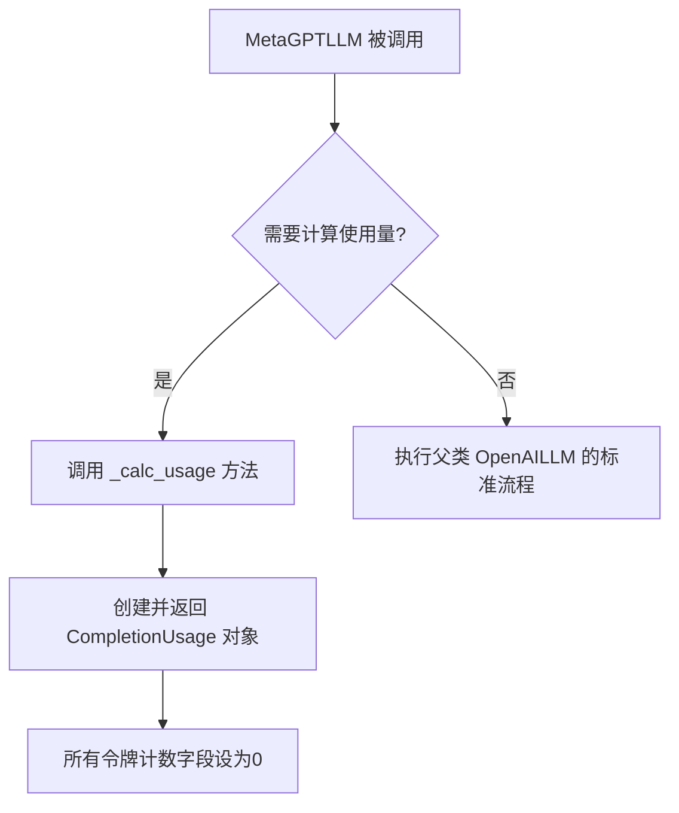
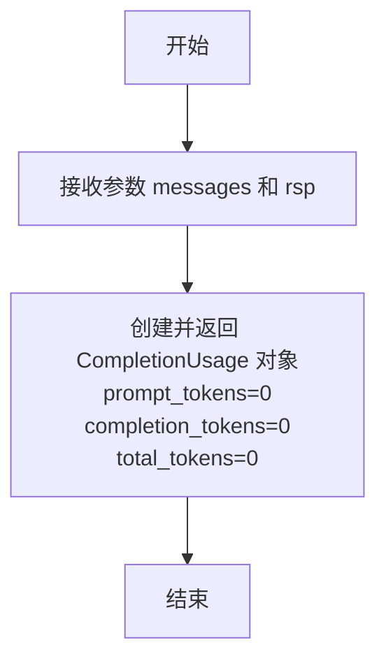

# `.\MetaGPT\metagpt\provider\metagpt_api.py` 详细设计文档

该文件定义了一个名为 MetaGPTLLM 的 LLM 提供者类，它继承自 OpenAILLM。其核心功能是作为 MetaGPT 框架中特定类型（LLMType.METAGPT）的大语言模型接口，并重写了计算令牌使用量的方法，当前实现返回零值，为未来可能的基于令牌数量的计费逻辑预留了扩展点。

## 整体流程



## 类结构

```
OpenAILLM (父类，来自 metagpt.provider)
└── MetaGPTLLM (子类，本文件定义)
    └── _calc_usage (重写方法)
```

## 全局变量及字段


    

## 全局函数及方法

### `register_provider`

`register_provider` 是一个装饰器函数，用于将特定的 LLM（大语言模型）提供者类注册到全局的提供者注册表中。它接收一个 LLM 类型标识符作为参数，并将被装饰的类与该标识符关联起来，使得系统能够根据类型标识符动态地查找和实例化对应的 LLM 提供者。

参数：

- `llm_type`：`LLMType`，一个枚举类型，用于标识要注册的 LLM 提供者的类型。

返回值：`Callable[[Type], Type]`，返回一个装饰器函数，该函数接收一个类作为参数并返回同一个类，在返回之前完成注册逻辑。

#### 流程图

```mermaid
flowchart TD
    A[调用 register_provider<br>传入 llm_type] --> B{llm_type 是否已注册？}
    B -- 是 --> C[抛出 ValueError 异常]
    B -- 否 --> D[定义内部装饰器函数 decorator]
    D --> E[接收被装饰的类 cls]
    E --> F[将 (llm_type, cls) 对<br>存入全局注册表]
    F --> G[返回类 cls]
    G --> H[装饰器应用完成]
```

#### 带注释源码

```python
def register_provider(llm_type: LLMType) -> Callable[[Type], Type]:
    """
    装饰器函数，用于注册一个 LLM 提供者类。
    
    参数:
        llm_type (LLMType): LLM 提供者的类型标识符。
        
    返回:
        Callable[[Type], Type]: 一个装饰器，它接收一个类并将其注册到全局注册表中。
        
    异常:
        ValueError: 如果 llm_type 已经被注册过。
    """
    def decorator(cls: Type) -> Type:
        # 检查 llm_type 是否已被注册，避免重复注册
        if llm_type in LLM_PROVIDERS:
            raise ValueError(f"LLM type {llm_type} is already registered.")
        # 将 llm_type 和对应的类关联起来，注册到全局字典中
        LLM_PROVIDERS[llm_type] = cls
        # 返回原始的类，装饰器不改变类的行为
        return cls
    return decorator
```


### `MetaGPTLLM._calc_usage`

该方法用于计算给定消息列表和模型响应所消耗的令牌数量。在当前实现中，由于计费逻辑基于使用频率而非令牌数，因此该方法返回一个所有字段均为零的`CompletionUsage`对象。注释指出，如果未来引入基于令牌数量的计费逻辑，需要在此处完善相应的计算逻辑。

参数：

-  `messages`：`list[dict]`，发送给语言模型的提示消息列表。
-  `rsp`：`str`，语言模型返回的响应文本。

返回值：`openai.types.CompletionUsage`，一个包含`prompt_tokens`、`completion_tokens`和`total_tokens`三个字段的对象，分别表示提示令牌数、完成令牌数和总令牌数。当前实现中这三个值均为0。

#### 流程图



#### 带注释源码

```
def _calc_usage(self, messages: list[dict], rsp: str) -> CompletionUsage:
    # The current billing is based on usage frequency. If there is a future billing logic based on the
    # number of tokens, please refine the logic here accordingly.
    # 当前计费基于使用频率。如果未来有基于令牌数量的计费逻辑，请相应地在此处完善逻辑。
    return CompletionUsage(prompt_tokens=0, completion_tokens=0, total_tokens=0)
```


## 关键组件


### 张量索引与惰性加载

当前代码中未直接涉及张量索引与惰性加载机制。

### 反量化支持

当前代码中未直接涉及反量化支持机制。

### 量化策略

当前代码中未直接涉及量化策略。

### LLM提供商注册机制

通过装饰器 `@register_provider(LLMType.METAGPT)` 将 `MetaGPTLLM` 类注册为 `LLMType.METAGPT` 类型的LLM提供商，实现了提供商的可插拔式管理。

### 令牌用量计算占位

`_calc_usage` 方法当前返回一个所有字段为零的 `CompletionUsage` 对象，作为未来可能实现的基于令牌数量计费逻辑的占位符。


## 问题及建议


### 已知问题

-   **计费逻辑不准确**：`_calc_usage` 方法当前返回固定的零值（`prompt_tokens=0, completion_tokens=0, total_tokens=0`）。这会导致基于令牌使用量的计费、成本监控、使用量统计等功能完全失效，无法反映真实的资源消耗。
-   **功能与父类不一致**：`MetaGPTLLM` 继承自 `OpenAILLM`。父类的 `_calc_usage` 方法很可能实现了正确的令牌计算逻辑。子类重写后返回固定零值，破坏了父类的预期行为，可能导致依赖于准确使用量数据的上游功能出现错误或数据失真。
-   **代码注释暗示未完成状态**：代码中的注释（`“The current billing is based on usage frequency... please refine the logic here accordingly.”`）明确表明这是一个临时的、未完成的实现，存在已知的技术债务。

### 优化建议

-   **实现正确的令牌计算逻辑**：移除当前返回固定零值的实现。应集成或调用一个可靠的令牌计算库（例如 `tiktoken` 用于 OpenAI 模型）来根据输入的 `messages` 和输出的 `rsp` 准确计算 `prompt_tokens` 和 `completion_tokens`。这是最核心的优化。
-   **复用或修正父类逻辑**：首先检查父类 `OpenAILLM` 的 `_calc_usage` 方法是否已实现有效逻辑。如果父类实现是正确或更合适的，应考虑删除子类的重写方法，直接继承父类行为。如果父类逻辑不适用于 MetaGPT 的特定模型，则应在子类中实现适配逻辑，但仍需确保计算准确。
-   **移除或更新过时注释**：在实现了正确的令牌计算逻辑后，应删除或更新现有的注释，以反映代码的当前状态和计费依据，避免给后续开发者造成困惑。
-   **考虑配置化**：如果未来计费策略可能变化（如注释中所说），可以考虑将计费模式（按次 vs 按令牌）设计为可配置项，使 `_calc_usage` 方法能根据配置返回相应的使用量结构，提高代码的灵活性和可维护性。


## 其它


### 设计目标与约束

该代码的设计目标是创建一个名为 `MetaGPTLLM` 的 LLM 提供者类，作为 `OpenAILLM` 的子类，并注册到 MetaGPT 框架的 LLM 提供者注册表中。其核心约束是：在继承 `OpenAILLM` 基础功能的同时，重写 `_calc_usage` 方法，以适配 MetaGPT 框架当前基于使用频率而非令牌数量的计费逻辑。这要求该类必须与 `LLMType.METAGPT` 枚举值关联，并确保计费计算逻辑返回零值令牌消耗。

### 错误处理与异常设计

当前代码未显式定义新的错误处理逻辑。它继承了父类 `OpenAILLM` 的异常处理机制。`_calc_usage` 方法被设计为总是成功返回一个 `CompletionUsage` 对象，其所有令牌字段均为 0。潜在的异常可能来自父类方法的调用（例如，网络请求失败、API密钥错误等），这些异常会沿调用栈向上传播。未来如果计费逻辑变更，需要在此方法内添加相应的输入验证和错误处理，例如处理消息列表为空或响应字符串解析失败的情况。

### 数据流与状态机

数据流起始于外部调用者（例如框架中的其他组件）通过 `MetaGPTLLM` 实例发起 LLM 请求。请求数据（`messages`）和 LLM 配置（通过父类初始化）流入。在父类 `OpenAILLM` 的处理流程中，会调用 `_calc_usage` 方法。该方法接收请求消息列表和 LLM 生成的响应字符串作为输入，按照当前“按使用频率计费”的业务规则，直接生成并返回一个所有令牌计数为零的 `CompletionUsage` 对象。该对象随后被父类用于可能的计费或统计记录。该类本身无内部状态变化，行为是确定性的。

### 外部依赖与接口契约

1.  **继承依赖**：强依赖于 `metagpt.provider.OpenAILLM` 类，继承其所有公共接口和实现逻辑。
2.  **注册契约**：必须使用 `@register_provider(LLMType.METAGPT)` 装饰器进行注册，以将此类与特定的 `LLMType` 枚举值绑定，这是 MetaGPT 框架识别和使用该提供者的关键契约。
3.  **类型依赖**：依赖于 `openai.types.CompletionUsage` 类型来构造返回值。
4.  **框架依赖**：依赖于 `metagpt.provider.llm_provider_registry.register_provider` 装饰器函数和 `metagpt.configs.llm_config.LLMType` 枚举，这些是 MetaGPT 框架基础设施的一部分。
5.  **方法重写契约**：必须实现 `_calc_usage` 方法，其函数签名（参数类型、返回类型）必须与父类中的定义严格一致，以确保多态性正确工作。

    