```mermaid
graph TD
    A[开始] --> B[获取第一个消息的内容]
    B --> C{内容是否为列表?}
    C -->|是| D[遍历列表中的每个消息]
    D --> E[解析消息，提取文本]
    E --> F[将文本添加到提示列表]
    F --> D
    C -->|否| G[将内容作为单个提示添加到列表]
    D --> H[遍历结束]
    G --> H
    H --> I[构建请求体字典]
    I --> J[添加模型名称和提示文本]
    J --> K[更新额外参数]
    K --> L[返回请求体字典]
    L --> M[结束]
```

# `.\MetaGPT\metagpt\provider\ollama_api.py` 详细设计文档

该代码实现了一个用于集成 Ollama 自托管大语言模型的提供者（Provider），它通过适配器模式将 Ollama 的非标准 API 封装成与 OpenAI API 兼容的接口，支持聊天、文本生成和嵌入向量生成等多种功能，并集成了流式响应处理和成本管理。

## 整体流程


## 类结构

```
OllamaMessageBase (抽象基类)
├── OllamaMessageChat (聊天接口)
├── OllamaMessageGenerate (文本生成接口)
├── OllamaMessageEmbeddings (嵌入向量接口 - /embeddings)
└── OllamaMessageEmbed (嵌入向量接口 - /embed)

OllamaMessageMeta (元类，用于注册消息处理器)

BaseLLM (来自 metagpt.provider.base_llm)
└── OllamaLLM (Ollama 主提供者类)
    ├── OllamaGenerate (文本生成专用提供者)
    ├── OllamaEmbeddings (嵌入向量专用提供者 - /embeddings)
    └── OllamaEmbed (嵌入向量专用提供者 - /embed)
```

## 全局变量及字段


### `OllamaMessageAPI.CHAT`
    
表示使用Ollama的聊天API端点。

类型：`OllamaMessageAPI`
    


### `OllamaMessageAPI.GENERATE`
    
表示使用Ollama的生成API端点。

类型：`OllamaMessageAPI`
    


### `OllamaMessageAPI.EMBED`
    
表示使用Ollama的嵌入API端点（旧版）。

类型：`OllamaMessageAPI`
    


### `OllamaMessageAPI.EMBEDDINGS`
    
表示使用Ollama的嵌入API端点（新版）。

类型：`OllamaMessageAPI`
    


### `OllamaMessageBase.api_type`
    
标识此消息类处理的Ollama API类型。

类型：`OllamaMessageAPI`
    


### `OllamaMessageBase.model`
    
要使用的Ollama模型名称。

类型：`str`
    


### `OllamaMessageBase.additional_kwargs`
    
传递给Ollama API的额外参数。

类型：`dict`
    


### `OllamaMessageBase._image_b64_rms`
    
用于从base64编码的图片URL中移除前缀的长度。

类型：`int`
    


### `OllamaMessageMeta.registed_message`
    
注册表，映射API类型到对应的消息处理类。

类型：`dict[OllamaMessageAPI, type[OllamaMessageBase]]`
    


### `OllamaLLM.client`
    
用于向Ollama API发送HTTP请求的通用请求器。

类型：`GeneralAPIRequestor`
    


### `OllamaLLM.config`
    
LLM的配置对象，包含模型、API密钥、基础URL等信息。

类型：`LLMConfig`
    


### `OllamaLLM.model`
    
当前使用的Ollama模型名称。

类型：`str`
    


### `OllamaLLM.http_method`
    
用于API请求的HTTP方法，默认为'post'。

类型：`str`
    


### `OllamaLLM.use_system_prompt`
    
指示是否使用系统提示，对于Ollama默认为False。

类型：`bool`
    


### `OllamaLLM.cost_manager`
    
用于跟踪和管理API调用令牌成本的组件。

类型：`TokenCostManager`
    


### `OllamaLLM.ollama_message`
    
根据配置的API类型实例化的Ollama消息处理对象。

类型：`OllamaMessageBase`
    


### `OllamaLLM.pricing_plan`
    
用于成本计算的定价计划标识符，通常设置为模型名称。

类型：`str`
    
    

## 全局函数及方法

### `register_provider`

`register_provider` 是一个装饰器函数，用于将特定的 LLM（大语言模型）提供者类注册到全局的提供者注册表中。它接收一个 `LLMType` 枚举值作为参数，并将被装饰的类与该类型关联起来，使得系统能够根据配置动态地实例化相应的 LLM 提供者。

参数：

- `llm_type`：`LLMType`，一个枚举值，表示要注册的 LLM 提供者类型（例如 `LLMType.OLLAMA`）。

返回值：`Callable[[Type[BaseLLM]], Type[BaseLLM]]`，返回一个装饰器函数，该函数接收一个 `BaseLLM` 的子类作为参数，并将其注册到提供者注册表中，然后返回该类本身。

#### 流程图

```mermaid
flowchart TD
    A[开始：调用 register_provider(llm_type)] --> B[定义内部装饰器函数 decorator]
    B --> C[接收被装饰的类 cls]
    C --> D[将 cls 注册到全局注册表<br>键为 llm_type]
    D --> E[返回 cls]
    E --> F[结束]
```

#### 带注释源码

```python
def register_provider(llm_type: LLMType) -> Callable[[Type[BaseLLM]], Type[BaseLLM]]:
    """
    装饰器函数，用于将 LLM 提供者类注册到全局注册表中。
    
    参数:
        llm_type (LLMType): LLM 提供者的类型标识。
    
    返回:
        Callable[[Type[BaseLLM]], Type[BaseLLM]]: 一个装饰器，它接收一个 BaseLLM 的子类，
        将其注册到注册表中，然后返回该类。
    """
    def decorator(cls: Type[BaseLLM]) -> Type[BaseLLM]:
        # 将提供的类 cls 与给定的 llm_type 关联起来，存储到全局的 PROVIDER_REGISTRY 中。
        # 这使得系统可以通过 LLMType 来查找和实例化对应的 LLM 提供者。
        PROVIDER_REGISTRY[llm_type] = cls
        return cls
    return decorator
```

### `OllamaMessageBase.__init__`

初始化 `OllamaMessageBase` 类的实例，设置模型名称和额外参数，并计算用于解析 base64 图像 URL 的前缀长度。

参数：

- `model`：`str`，要使用的 Ollama 模型名称。
- `additional_kwargs`：`**dict`，传递给 Ollama API 的额外关键字参数。

返回值：`None`，此方法不返回任何值。

#### 流程图


#### 带注释源码

```python
def __init__(self, model: str, **additional_kwargs) -> None:
    # 设置实例属性：模型名称和额外参数
    self.model, self.additional_kwargs = model, additional_kwargs
    # 计算 base64 图像 URL 中前缀 "data:image/jpeg;base64," 的长度，用于后续解析
    self._image_b64_rms = len("data:image/jpeg;base64,")
```

### `OllamaMessageBase.api_suffix`

这是一个抽象属性（property），用于定义不同Ollama API类型对应的URL路径后缀。它由`OllamaMessageBase`的子类（如`OllamaMessageChat`、`OllamaMessageGenerate`等）具体实现，以返回各自API端点所需的特定后缀字符串。

参数：
- 无

返回值：`str`，返回一个字符串，表示特定Ollama API（如聊天、生成文本、生成嵌入向量）的URL路径后缀。

#### 流程图


#### 带注释源码

```python
    @property
    def api_suffix(self) -> str:
        # 这是一个抽象属性，必须在子类中实现。
        # 它应该返回一个字符串，表示对应Ollama API的URL路径后缀。
        # 例如，聊天API可能返回'/chat'，文本生成API可能返回'/generate'。
        raise NotImplementedError
```

### `OllamaMessageBase.apply`

该方法是一个抽象方法，用于将输入的消息列表转换为特定Ollama API所需的请求体格式。由于它是一个抽象方法，具体的实现逻辑由其子类（如`OllamaMessageChat`、`OllamaMessageGenerate`等）提供，以适配不同的API端点（如聊天、生成文本、生成嵌入向量等）。

参数：

- `messages`：`list[dict]`，一个字典列表，表示输入的消息。通常包含角色（如"user"、"assistant"）和内容（文本或图像URL）。

返回值：`dict`，返回一个字典，表示格式化后的请求体，可以直接用于发送给Ollama API。

#### 流程图


#### 带注释源码

```python
def apply(self, messages: list[dict]) -> dict:
    raise NotImplementedError
```

### `OllamaMessageBase.decode`

该方法用于解码来自Ollama API的响应，将`OpenAIResponse`对象中的二进制数据转换为Python字典。

参数：

- `response`：`OpenAIResponse`，包含从Ollama API返回的原始响应数据。

返回值：`dict`，解码后的响应数据，以字典形式表示。

#### 流程图


#### 带注释源码

```python
def decode(self, response: OpenAIResponse) -> dict:
    # 将OpenAIResponse对象中的二进制数据解码为UTF-8字符串，然后解析为JSON字典
    return json.loads(response.data.decode("utf-8"))
```

### `OllamaMessageBase.get_choice`

该方法是一个抽象方法，用于从Ollama API的响应字典中提取出模型生成的文本内容。具体的提取逻辑由子类根据不同的API类型（如聊天、生成、嵌入等）来实现。

参数：

- `to_choice_dict`：`dict`，包含Ollama API响应的字典，其结构取决于具体的API类型。

返回值：`str`，从响应字典中提取出的模型生成的文本内容。

#### 流程图


#### 带注释源码

```python
def get_choice(self, to_choice_dict: dict) -> str:
    """
    从Ollama API响应字典中提取模型生成的文本内容。
    这是一个抽象方法，必须由子类根据具体的API类型实现。

    参数:
        to_choice_dict (dict): Ollama API的响应字典。

    返回:
        str: 提取出的文本内容。

    异常:
        NotImplementedError: 如果子类没有实现此方法。
    """
    raise NotImplementedError
```

### `OllamaMessageBase._parse_input_msg`

该方法用于解析输入消息字典，根据消息类型提取文本内容或图像URL的base64编码部分。

参数：

- `msg`：`dict`，包含消息内容的字典，可能包含"type"字段来标识消息类型。

返回值：`Tuple[Optional[str], Optional[str]]`，返回一个元组，第一个元素为文本内容（如果存在），第二个元素为图像URL的base64编码部分（如果存在）。如果消息类型不支持或缺少"type"字段，抛出`ValueError`异常。

#### 流程图

```mermaid
flowchart TD
    A[开始] --> B{msg中是否包含'type'字段?}
    B -->|是| C{type的值是什么?}
    B -->|否| D[抛出ValueError异常]
    C -->|'text'| E[返回msg['text'], None]
    C -->|'image_url'| F[返回None, msg['image_url']['url'][_image_b64_rms:]]
    C -->|其他| D
```

#### 带注释源码

```python
def _parse_input_msg(self, msg: dict) -> Tuple[Optional[str], Optional[str]]:
    # 检查消息字典中是否包含'type'字段
    if "type" in msg:
        tpe = msg["type"]
        # 如果消息类型为'text'，则返回文本内容，图像部分为None
        if tpe == "text":
            return msg["text"], None
        # 如果消息类型为'image_url'，则返回图像URL的base64编码部分，文本部分为None
        elif tpe == "image_url":
            return None, msg["image_url"]["url"][self._image_b64_rms :]
        # 如果消息类型不支持，抛出ValueError异常
        else:
            raise ValueError
    # 如果消息字典中不包含'type'字段，抛出ValueError异常
    else:
        raise ValueError
```

### `OllamaMessageMeta.__init__`

`OllamaMessageMeta.__init__` 是元类 `OllamaMessageMeta` 的初始化方法。当使用 `OllamaMessageMeta` 作为元类创建新类时，此方法会被调用。它的主要功能是检查新创建的类是否继承自 `OllamaMessageBase`，如果是，则将其 `api_type` 注册到 `OllamaMessageMeta.registed_message` 字典中，确保每个 `api_type` 唯一对应一个消息处理类。

参数：

- `cls`：`type`，正在被初始化的类对象。
- `name`：`str`，正在被初始化的类的名称。
- `bases`：`tuple`，正在被初始化的类的基类元组。
- `attrs`：`dict`，正在被初始化的类的属性字典。

返回值：`None`，此方法不返回任何值，仅执行注册逻辑。

#### 流程图


#### 带注释源码

```python
    def __init__(cls, name, bases, attrs):
        # 调用父类 type 的 __init__ 方法，完成类的标准创建过程
        super().__init__(name, bases, attrs)
        # 遍历新创建类的所有基类
        for base in bases:
            # 检查基类是否是 OllamaMessageBase 的子类
            if issubclass(base, OllamaMessageBase):
                # 从新类的属性中获取 api_type 的值
                api_type = attrs["api_type"]
                # 断言：确保此 api_type 尚未被注册，避免重复
                assert api_type not in OllamaMessageMeta.registed_message, "api_type already exist"
                # 断言：确保 api_type 是 OllamaMessageAPI 枚举类型
                assert isinstance(api_type, OllamaMessageAPI), "api_type not support"
                # 将 api_type 和当前类 cls 注册到类变量 registed_message 字典中
                OllamaMessageMeta.registed_message[api_type] = cls
```

### `OllamaMessageMeta.get_message`

该方法是一个类方法，用于根据给定的 `OllamaMessageAPI` 枚举类型，从注册表中获取对应的消息处理类。它通过 `OllamaMessageMeta` 元类在子类初始化时自动注册，实现了 API 类型到具体消息处理类的映射。

参数：

- `input_type`：`OllamaMessageAPI`，指定要获取的消息处理类对应的 API 类型。

返回值：`type[OllamaMessageBase]`，返回与输入 API 类型对应的消息处理类（类对象）。

#### 流程图


#### 带注释源码

```python
    @classmethod
    def get_message(cls, input_type: OllamaMessageAPI) -> type[OllamaMessageBase]:
        # 从类属性 registed_message 字典中，根据 input_type 键查找并返回对应的消息处理类。
        # registed_message 字典在元类的 __init__ 方法中，当子类（如 OllamaMessageChat）被创建时自动填充。
        # 键是 OllamaMessageAPI 枚举值，值是对应的消息处理类。
        return cls.registed_message[input_type]
```

### `OllamaMessageChat.api_suffix`

该属性返回Ollama聊天API的URL后缀路径。

参数：无

返回值：`str`，返回Ollama聊天API的URL后缀字符串"/chat"。

#### 流程图


#### 带注释源码

```python
@property
def api_suffix(self) -> str:
    # 返回Ollama聊天API的URL后缀路径
    return "/chat"
```

### `OllamaMessageChat.apply`

该方法用于将输入的对话消息列表转换为Ollama聊天API所需的请求体格式。它处理文本和图像内容，构建符合Ollama API规范的JSON结构。

参数：

- `messages`：`list[dict]`，包含对话消息的列表，每个消息是一个字典，通常包含"role"和"content"字段。

返回值：`dict`，构建好的请求体字典，可直接用于Ollama聊天API调用。

#### 流程图


#### 带注释源码

```python
def apply(self, messages: list[dict]) -> dict:
    # 获取第一条消息的内容部分
    content = messages[0]["content"]
    prompts = []  # 存储文本提示
    images = []   # 存储图像数据
    
    # 检查内容是否为列表（可能包含混合类型）
    if isinstance(content, list):
        # 遍历内容列表中的每个元素
        for msg in content:
            # 解析消息，返回文本和图像数据
            prompt, image = self._parse_input_msg(msg)
            if prompt:
                prompts.append(prompt)  # 收集文本提示
            if image:
                images.append(image)    # 收集图像数据
    else:
        # 如果内容不是列表，直接作为文本提示
        prompts.append(content)
    
    # 构建消息列表
    messes = []
    for prompt in prompts:
        if len(images) > 0:
            # 如果有图像，构建包含图像的消息
            messes.append({"role": "user", "content": prompt, "images": images})
        else:
            # 否则构建普通文本消息
            messes.append({"role": "user", "content": prompt})
    
    # 构建最终请求体
    sends = {"model": self.model, "messages": messes}
    # 添加额外的配置参数
    sends.update(self.additional_kwargs)
    return sends
```

### `OllamaMessageChat.get_choice`

该方法用于从Ollama聊天API的响应字典中提取助手生成的内容。

参数：

- `to_choice_dict`：`dict`，包含Ollama聊天API响应的字典，通常包含一个`message`键，其值是一个包含`role`和`content`的字典。

返回值：`str`，助手生成的内容字符串。

#### 流程图

```mermaid
flowchart TD
    A[开始] --> B{检查message角色是否为'assistant'}
    B -- 是 --> C[返回message['content']]
    B -- 否 --> D[抛出ValueError异常]
    C --> E[结束]
    D --> E
```

#### 带注释源码

```python
def get_choice(self, to_choice_dict: dict) -> str:
    # 从响应字典中获取'message'字段
    message = to_choice_dict["message"]
    # 检查消息角色是否为'assistant'
    if message["role"] == "assistant":
        # 如果是助手消息，返回其内容
        return message["content"]
    else:
        # 如果不是助手消息，抛出异常
        raise ValueError
```

### `OllamaMessageGenerate.api_suffix`

该属性返回Ollama API的生成端点后缀字符串。

参数：无

返回值：`str`，返回Ollama API的生成端点后缀字符串"/generate"

#### 流程图

```mermaid
flowchart TD
    Start[开始] --> GetProperty[获取api_suffix属性]
    GetProperty --> ReturnValue[返回字符串"/generate"]
    ReturnValue --> End[结束]
```

#### 带注释源码

```python
@property
def api_suffix(self) -> str:
    # 返回Ollama API的生成端点后缀
    return "/generate"
```

### `OllamaMessageGenerate.apply`

该方法用于将输入的消息列表转换为Ollama `/generate` API所需的请求体格式。它从消息内容中提取文本提示和图像数据，并构建一个包含模型名称、提示文本和可选图像数据的字典。

参数：

- `messages`：`list[dict]`，包含消息内容的字典列表，通常第一个元素包含要处理的文本和图像数据。

返回值：`dict`，包含模型名称、提示文本和可选图像数据的字典，用于Ollama `/generate` API请求。

#### 流程图


#### 带注释源码

```python
def apply(self, messages: list[dict]) -> dict:
    # 获取第一个消息的内容
    content = messages[0]["content"]
    prompts = []
    images = []
    # 检查内容是否为列表（可能包含文本和图像）
    if isinstance(content, list):
        # 遍历内容列表中的每个元素
        for msg in content:
            # 解析元素，提取文本提示和图像数据
            prompt, image = self._parse_input_msg(msg)
            if prompt:
                prompts.append(prompt)
            if image:
                images.append(image)
    else:
        # 如果内容不是列表，直接作为文本提示
        prompts.append(content)
    # 根据是否有图像数据构建发送字典
    if len(images) > 0:
        sends = {"model": self.model, "prompt": "\n".join(prompts), "images": images}
    else:
        sends = {"model": self.model, "prompt": "\n".join(prompts)}
    # 更新额外参数
    sends.update(self.additional_kwargs)
    return sends
```

### `OllamaMessageGenerate.get_choice`

该方法用于从Ollama生成式API的响应字典中提取生成的文本内容。

参数：

- `to_choice_dict`：`dict`，包含Ollama生成式API响应的字典

返回值：`str`，从响应中提取的生成文本内容

#### 流程图

```mermaid
graph TD
    A[开始] --> B[接收to_choice_dict参数]
    B --> C{检查字典中是否有'response'键}
    C -->|有| D[返回to_choice_dict['response']]
    C -->|无| E[抛出异常或返回空字符串]
    D --> F[结束]
    E --> F
```

#### 带注释源码

```python
def get_choice(self, to_choice_dict: dict) -> str:
    # 从响应字典中直接提取'response'字段的值
    # 在Ollama的生成式API中，生成的文本内容存储在'response'键下
    return to_choice_dict["response"]
```

### `OllamaMessageEmbeddings.api_suffix`

该属性是 `OllamaMessageEmbeddings` 类的一个只读属性，用于返回与 Ollama API 中嵌入（embeddings）功能对应的端点后缀。

参数：
- 无参数。

返回值：`str`，返回字符串 `"/embeddings"`，该字符串用于构建向 Ollama 服务请求生成嵌入向量的完整 API URL。

#### 流程图


#### 带注释源码

```python
    @property
    def api_suffix(self) -> str:
        # 返回与 Ollama API 的嵌入（embeddings）功能对应的端点路径后缀。
        # 此属性用于在构建完整 API 请求 URL 时，与基础 URL 拼接。
        return "/embeddings"
```

### `OllamaMessageEmbeddings.apply`

该方法用于处理嵌入（embeddings）请求，将输入的消息列表转换为Ollama API所需的请求体格式。它从消息中提取文本内容，忽略图像信息，并构建包含模型名称和提示文本的字典。

参数：

- `messages`：`list[dict]`，包含消息内容的列表，每个消息是一个字典，可能包含文本或图像信息。

返回值：`dict`，返回一个字典，包含模型名称和提示文本，用于发送到Ollama API的嵌入端点。

#### 流程图



#### 带注释源码

```python
def apply(self, messages: list[dict]) -> dict:
    # 获取第一个消息的内容
    content = messages[0]["content"]
    prompts = []  # 存储提取的文本提示，不支持图像嵌入
    # 检查内容是否为列表（多部分消息）
    if isinstance(content, list):
        # 遍历列表中的每个消息部分
        for msg in content:
            # 解析消息，提取文本和图像（图像被忽略）
            prompt, _ = self._parse_input_msg(msg)
            if prompt:
                # 如果有文本内容，添加到提示列表
                prompts.append(prompt)
    else:
        # 如果内容不是列表，直接作为单个提示添加
        prompts.append(content)
    # 构建请求体字典，包含模型名称和连接后的提示文本
    sends = {"model": self.model, "prompt": "\n".join(prompts)}
    # 更新额外参数（如温度等）
    sends.update(self.additional_kwargs)
    # 返回构建的请求体
    return sends
```

### `OllamaMessageEmbed.api_suffix`

该属性用于获取Ollama Embed API的URL后缀路径。

参数：无

返回值：`str`，返回Ollama Embed API的URL后缀路径"/embed"

#### 流程图

```mermaid
flowchart TD
    Start[开始] --> GetProperty[获取api_suffix属性]
    GetProperty --> ReturnValue[返回字符串"/embed"]
    ReturnValue --> End[结束]
```

#### 带注释源码

```python
@property
def api_suffix(self) -> str:
    # 返回Ollama Embed API的URL后缀路径
    return "/embed"
```

### `OllamaMessageEmbed.apply`

该方法用于处理嵌入请求的消息内容，将输入的消息列表转换为Ollama API所需的格式，特别适用于文本嵌入任务。它从消息中提取文本内容，忽略图像数据，并将文本内容组织成适合嵌入请求的格式。

参数：

- `messages`：`list[dict]`，包含消息内容的字典列表，通常第一个字典的`content`字段包含待处理的文本或多媒体内容。

返回值：`dict`，包含模型名称和提取的文本内容（作为`input`字段）的字典，用于Ollama嵌入API的请求体。

#### 流程图


#### 带注释源码

```python
def apply(self, messages: list[dict]) -> dict:
    # 获取第一个消息的内容，通常是用户输入的文本或多媒体数据
    content = messages[0]["content"]
    prompts = []  # 初始化文本内容列表，用于存储提取的文本
    # 注意：当前实现不支持图像嵌入，因此忽略图像数据

    # 检查content是否为列表（例如，包含文本和图像的混合内容）
    if isinstance(content, list):
        # 遍历content列表中的每个元素
        for msg in content:
            # 调用_parse_input_msg方法解析消息，提取文本和图像数据
            prompt, _ = self._parse_input_msg(msg)
            # 如果提取到文本内容，则添加到prompts列表中
            if prompt:
                prompts.append(prompt)
    else:
        # 如果content不是列表，直接将其作为文本添加到prompts列表
        prompts.append(content)

    # 构建请求字典，包含模型名称和提取的文本内容（作为input字段）
    sends = {"model": self.model, "input": prompts}
    # 更新额外的请求参数（例如，温度、流式传输等）
    sends.update(self.additional_kwargs)
    # 返回构建的请求字典
    return sends
```

### `OllamaLLM.__init__`

初始化OllamaLLM类实例，配置Ollama模型的基础URL、API密钥、模型名称等参数，并初始化Ollama消息处理器。

参数：

- `config`：`LLMConfig`，包含Ollama模型配置信息的对象，如基础URL、API密钥、模型名称等。

返回值：`None`，无返回值。

#### 流程图

```mermaid
flowchart TD
    A[开始] --> B[接收LLMConfig参数]
    B --> C[初始化GeneralAPIRequestor客户端]
    C --> D[设置配置、模型、HTTP方法等属性]
    D --> E[初始化TokenCostManager]
    E --> F[调用__init_ollama方法]
    F --> G[验证基础URL]
    G --> H[设置模型和定价计划]
    H --> I[获取Ollama消息处理器]
    I --> J[初始化Ollama消息处理器]
    J --> K[结束]
```

#### 带注释源码

```python
def __init__(self, config: LLMConfig):
    # 初始化GeneralAPIRequestor客户端，用于发送HTTP请求
    self.client = GeneralAPIRequestor(base_url=config.base_url, key=config.api_key)
    # 保存配置对象
    self.config = config
    # 设置模型名称
    self.model = config.model
    # 设置HTTP方法为POST
    self.http_method = "post"
    # 标记是否使用系统提示（Ollama不支持系统提示）
    self.use_system_prompt = False
    # 初始化TokenCostManager，用于管理token成本
    self.cost_manager = TokenCostManager()
    # 调用私有方法初始化Ollama相关配置
    self.__init_ollama(config)
```

### `OllamaLLM._llama_api_inuse`

这是一个只读属性，用于标识当前 `OllamaLLM` 实例所使用的 Ollama API 类型。它返回一个 `OllamaMessageAPI` 枚举值，默认为 `OllamaMessageAPI.CHAT`，表示使用聊天补全接口。该属性定义了与后端 Ollama 服务交互时使用的具体 API 端点（如 `/chat`, `/generate`, `/embeddings` 等），是 `OllamaLLM` 及其子类（如 `OllamaGenerate`, `OllamaEmbeddings`）进行功能分化的核心配置点。

参数：
- 无

返回值：`OllamaMessageAPI`，表示当前实例配置使用的 Ollama API 类型。

#### 流程图

```mermaid
flowchart TD
    Start[调用属性] --> Return[返回 OllamaMessageAPI.CHAT]
    Return --> End[结束]
```

#### 带注释源码

```python
    @property
    def _llama_api_inuse(self) -> OllamaMessageAPI:
        # 返回当前实例使用的 Ollama API 类型。
        # 基类 `OllamaLLM` 默认使用聊天补全 API (`OllamaMessageAPI.CHAT`)。
        # 子类（如 `OllamaGenerate`, `OllamaEmbeddings`）通过重写此属性来指定不同的 API 类型。
        return OllamaMessageAPI.CHAT
```

### `OllamaLLM._llama_api_kwargs`

这是一个只读属性（property），用于定义调用Ollama API时的默认参数。它返回一个字典，其中包含Ollama模型生成文本时的配置选项，如温度（temperature）和是否启用流式响应（stream）。

参数：
- 无显式参数。此属性通过`self`访问类的实例属性`config`。

返回值：`dict`，一个包含Ollama API调用默认参数的字典。默认返回`{"options": {"temperature": 0.3}, "stream": self.config.stream}`，其中`temperature`控制生成文本的随机性（值越低输出越确定），`stream`是一个布尔值，指示是否启用流式响应。

#### 流程图

```mermaid
flowchart TD
    A[开始] --> B[访问属性 _llama_api_kwargs]
    B --> C[构造参数字典]
    C --> D[设置 options.temperature = 0.3]
    D --> E[设置 stream = self.config.stream]
    E --> F[返回参数字典]
    F --> G[结束]
```

#### 带注释源码

```python
    @property
    def _llama_api_kwargs(self) -> dict:
        # 返回一个字典，包含调用Ollama API时的默认参数。
        # `options` 字典用于设置模型生成参数，这里将温度（temperature）设为0.3，以平衡创造性和一致性。
        # `stream` 参数从实例的配置（self.config.stream）中获取，决定是否使用流式响应。
        return {"options": {"temperature": 0.3}, "stream": self.config.stream}
```

### `OllamaLLM.__init_ollama`

该方法用于初始化OllamaLLM类的Ollama相关配置，包括设置模型名称、定价计划，并根据当前使用的API类型创建相应的消息处理对象。

参数：

- `config`：`LLMConfig`，包含LLM配置信息的对象，用于获取模型名称和基础URL等配置。

返回值：`None`，无返回值。

#### 流程图

```mermaid
flowchart TD
    A[开始] --> B{检查config.base_url是否有效}
    B -- 无效 --> C[抛出断言错误]
    B -- 有效 --> D[设置self.model为config.model]
    D --> E[设置self.pricing_plan为self.model]
    E --> F[获取当前使用的API类型]
    F --> G[根据API类型创建对应的OllamaMessage对象]
    G --> H[将对象赋值给self.ollama_message]
    H --> I[结束]
```

#### 带注释源码

```python
def __init_ollama(self, config: LLMConfig):
    # 断言检查：确保配置中提供了Ollama的基础URL，否则抛出错误
    assert config.base_url, "ollama base_url is required!"
    
    # 设置当前实例的模型名称，从配置中获取
    self.model = config.model
    
    # 设置定价计划为当前模型名称，用于成本管理
    self.pricing_plan = self.model
    
    # 获取当前使用的Ollama API类型（如CHAT、GENERATE等）
    # 通过_llama_api_inuse属性动态确定
    ollama_message = OllamaMessageMeta.get_message(self._llama_api_inuse)
    
    # 创建对应API类型的消息处理对象，传入模型名称和额外参数
    # 额外参数通过_llama_api_kwargs属性获取（如温度设置、流式传输标志等）
    self.ollama_message = ollama_message(model=self.model, **self._llama_api_kwargs)
```

### `OllamaLLM.get_usage`

该方法用于从Ollama API的响应中提取令牌使用情况，包括提示令牌和完成令牌的数量。

参数：

- `resp`：`dict`，Ollama API的响应字典，通常包含`prompt_eval_count`和`eval_count`字段。

返回值：`dict`，包含两个键值对：`"prompt_tokens"`（提示令牌数量）和`"completion_tokens"`（完成令牌数量）。如果响应中缺少相应字段，则默认值为0。

#### 流程图

```mermaid
graph TD
    A[开始] --> B[获取响应中的prompt_eval_count]
    B --> C[获取响应中的eval_count]
    C --> D[构建返回字典]
    D --> E[返回字典]
```

#### 带注释源码

```python
def get_usage(self, resp: dict) -> dict:
    # 从响应字典中提取prompt_eval_count字段，如果不存在则默认为0
    prompt_tokens = resp.get("prompt_eval_count", 0)
    # 从响应字典中提取eval_count字段，如果不存在则默认为0
    completion_tokens = resp.get("eval_count", 0)
    # 返回包含提示令牌和完成令牌数量的字典
    return {"prompt_tokens": prompt_tokens, "completion_tokens": completion_tokens}
```

### `OllamaLLM._achat_completion`

该方法用于异步调用Ollama API以获取聊天补全结果。它根据配置的API类型（聊天、生成或嵌入）构建请求，发送到Ollama服务，并处理响应。支持流式和非流式响应，并管理令牌成本。

参数：

- `messages`：`list[dict]`，包含用户输入消息的列表，每个消息是一个字典，通常包含"role"和"content"字段。
- `timeout`：`int`，请求的超时时间，单位为秒。默认使用配置中的超时时间。

返回值：`dict`，返回处理后的API响应。对于非流式响应，返回完整的响应字典；对于流式响应，返回拼接后的完整文本内容。

#### 流程图

```mermaid
graph TD
    A[开始] --> B[构建请求参数]
    B --> C[发送异步请求到Ollama API]
    C --> D{响应类型判断}
    D -- AsyncGenerator --> E[处理流式响应]
    D -- OpenAIResponse --> F[处理非流式响应]
    D -- 其他 --> G[抛出ValueError]
    E --> H[收集流式内容并记录日志]
    H --> I[更新成本]
    I --> J[返回完整内容]
    F --> K[解码响应并更新成本]
    K --> L[返回响应字典]
    G --> M[结束]
```

#### 带注释源码

```python
async def _achat_completion(self, messages: list[dict], timeout: int = USE_CONFIG_TIMEOUT) -> dict:
    # 使用配置的HTTP方法、API后缀和消息参数发送异步请求
    resp, _, _ = await self.client.arequest(
        method=self.http_method,
        url=self.ollama_message.api_suffix,
        params=self.ollama_message.apply(messages=messages),
        request_timeout=self.get_timeout(timeout),
    )
    # 根据响应类型选择不同的处理方式
    if isinstance(resp, AsyncGenerator):
        # 处理流式响应
        return await self._processing_openai_response_async_generator(resp)
    elif isinstance(resp, OpenAIResponse):
        # 处理非流式响应
        return self._processing_openai_response(resp)
    else:
        # 如果响应类型不符合预期，抛出异常
        raise ValueError
```

### `OllamaLLM.get_choice_text`

该方法用于从Ollama API的响应中提取出模型生成的文本内容。它通过调用当前配置的`ollama_message`对象的`get_choice`方法来实现，该方法会根据不同的API类型（如聊天、生成、嵌入）从响应字典中解析出相应的文本。

参数：

- `rsp`：`dict`，Ollama API返回的响应字典，包含了模型生成的结果信息。

返回值：`str`，从响应中提取出的模型生成的文本内容。

#### 流程图

```mermaid
flowchart TD
    A[开始] --> B[调用ollama_message.get_choice方法]
    B --> C[从响应字典中提取文本]
    C --> D[返回提取的文本]
    D --> E[结束]
```

#### 带注释源码

```python
def get_choice_text(self, rsp):
    # 调用当前配置的ollama_message对象的get_choice方法
    # 该方法根据不同的API类型从响应字典rsp中提取出文本内容
    return self.ollama_message.get_choice(rsp)
```

### `OllamaLLM.acompletion`

该方法用于异步调用Ollama模型的聊天补全功能，根据配置的API类型（聊天或生成）发送请求并处理响应。

参数：

- `messages`：`list[dict]`，包含对话消息的列表，每个消息是一个字典，通常包含"role"和"content"字段。
- `timeout`：`int`，请求超时时间，默认为`USE_CONFIG_TIMEOUT`。

返回值：`dict`，返回Ollama API的响应结果，包含生成的文本内容、使用情况等信息。

#### 流程图

```mermaid
graph TD
    A[开始] --> B[调用 _achat_completion 方法]
    B --> C[发送HTTP请求到Ollama API]
    C --> D{响应类型判断}
    D -->|AsyncGenerator| E[处理异步流式响应]
    D -->|OpenAIResponse| F[处理普通响应]
    E --> G[收集流式响应内容]
    G --> H[更新成本]
    H --> I[返回完整内容]
    F --> J[解码响应]
    J --> K[更新成本]
    K --> L[返回响应字典]
    I --> M[结束]
    L --> M
```

#### 带注释源码

```python
async def acompletion(self, messages: list[dict], timeout=USE_CONFIG_TIMEOUT) -> dict:
    """
    异步调用Ollama模型的聊天补全功能。
    
    参数:
        messages: 包含对话消息的列表，每个消息是一个字典。
        timeout: 请求超时时间，默认为配置的超时时间。
    
    返回:
        dict: Ollama API的响应结果。
    """
    # 调用内部方法 _achat_completion 处理请求
    return await self._achat_completion(messages, timeout=self.get_timeout(timeout))
```

### `OllamaLLM._achat_completion_stream`

该方法用于向Ollama API发起异步流式聊天补全请求，处理返回的流式响应，并将所有流式返回的内容片段拼接成一个完整的字符串返回。

参数：

- `messages`：`list[dict]`，包含聊天消息的列表，每个消息是一个字典，通常包含`role`和`content`字段。
- `timeout`：`int`，请求的超时时间，单位为秒。默认值为`USE_CONFIG_TIMEOUT`。

返回值：`str`，从流式响应中收集并拼接的所有内容片段组成的完整字符串。

#### 流程图

```mermaid
graph TD
    A[开始] --> B[调用client.arequest发起流式请求]
    B --> C{响应类型判断}
    C -->|AsyncGenerator| D[处理异步生成器响应]
    C -->|OpenAIResponse| E[处理普通响应]
    C -->|其他| F[抛出ValueError]
    D --> G[初始化收集列表和用量字典]
    G --> H[遍历异步生成器]
    H --> I[解码每个原始块]
    I --> J{检查是否完成}
    J -->|未完成| K[提取内容并收集]
    K --> L[记录日志流]
    L --> H
    J -->|已完成| M[获取用量信息]
    M --> N[记录换行日志]
    N --> O[更新成本]
    O --> P[拼接完整内容]
    P --> Q[返回完整内容]
    E --> R[解码响应]
    R --> S[获取用量信息]
    S --> T[更新成本]
    T --> U[返回响应字典]
    F --> V[结束]
    Q --> V
    U --> V
```

#### 带注释源码

```python
async def _achat_completion_stream(self, messages: list[dict], timeout: int = USE_CONFIG_TIMEOUT) -> str:
    # 使用配置的HTTP方法、API后缀和消息参数，发起一个异步流式请求。
    # `stream=True` 参数指示请求返回流式响应。
    resp, _, _ = await self.client.arequest(
        method=self.http_method,
        url=self.ollama_message.api_suffix,
        params=self.ollama_message.apply(messages=messages),
        request_timeout=self.get_timeout(timeout),
        stream=True,
    )
    # 根据返回的响应类型，调用不同的处理方法。
    if isinstance(resp, AsyncGenerator):
        # 如果响应是异步生成器，则调用处理异步生成器的方法。
        return await self._processing_openai_response_async_generator(resp)
    elif isinstance(resp, OpenAIResponse):
        # 如果响应是普通的OpenAIResponse对象，则调用处理普通响应的方法。
        return self._processing_openai_response(resp)
    else:
        # 如果响应类型不符合预期，抛出异常。
        raise ValueError
```

### `OllamaLLM._processing_openai_response`

该方法用于处理来自Ollama API的同步响应。它接收一个`OpenAIResponse`对象，将其解码为JSON格式，提取使用量信息（如令牌计数），更新成本管理器，并返回解码后的响应字典。

参数：

- `openai_resp`：`OpenAIResponse`，包含从Ollama API返回的原始响应数据。

返回值：`dict`，解码后的响应字典，包含模型生成的完整内容和使用量信息。

#### 流程图

```mermaid
flowchart TD
    A[开始] --> B[解码 OpenAIResponse 为 JSON]
    B --> C[提取使用量信息]
    C --> D[更新成本管理器]
    D --> E[返回解码后的响应字典]
    E --> F[结束]
```

#### 带注释源码

```python
def _processing_openai_response(self, openai_resp: OpenAIResponse):
    # 解码 OpenAIResponse 对象为 JSON 格式的字典
    resp = self.ollama_message.decode(openai_resp)
    # 从响应中提取使用量信息（如提示令牌和完成令牌）
    usage = self.get_usage(resp)
    # 更新成本管理器，记录本次请求的令牌使用成本
    self._update_costs(usage)
    # 返回解码后的完整响应字典
    return resp
```

### `OllamaLLM._processing_openai_response_async_generator`

该方法用于异步处理从Ollama API返回的流式响应（AsyncGenerator），逐块解析响应内容，收集完整的文本响应，并更新token使用成本。

参数：

- `ag_openai_resp`：`AsyncGenerator[OpenAIResponse, None]`，从Ollama API返回的异步生成器，包含流式响应数据。

返回值：`str`，从流式响应中收集并拼接的完整文本内容。

#### 流程图

```mermaid
graph TD
    A[开始] --> B[初始化collected_content和usage]
    B --> C{是否有下一个chunk?}
    C -->|是| D[获取并解码chunk]
    D --> E{chunk是否完成?}
    E -->|否| F[提取内容并收集]
    F --> G[记录日志]
    G --> C
    E -->|是| H[提取usage信息]
    H --> I[记录换行日志]
    I --> J[更新成本]
    J --> K[拼接完整内容]
    K --> L[返回完整内容]
    C -->|否| L
```

#### 带注释源码

```python
async def _processing_openai_response_async_generator(self, ag_openai_resp: AsyncGenerator[OpenAIResponse, None]):
    # 初始化收集内容的列表和usage字典
    collected_content = []
    usage = {}
    
    # 异步迭代处理每个流式响应块
    async for raw_chunk in ag_openai_resp:
        # 解码原始响应块为字典格式
        chunk = self.ollama_message.decode(raw_chunk)

        # 检查当前块是否表示流式响应已完成
        if not chunk.get("done", False):
            # 从chunk中提取文本内容
            content = self.ollama_message.get_choice(chunk)
            # 收集内容到列表中
            collected_content.append(content)
            # 记录流式日志
            log_llm_stream(content)
        else:
            # 流式响应完成，提取usage信息
            usage = self.get_usage(chunk)
    
    # 流式响应结束后记录换行日志
    log_llm_stream("\n")

    # 根据usage信息更新token成本
    self._update_costs(usage)
    
    # 拼接所有收集到的内容为完整字符串
    full_content = "".join(collected_content)
    
    # 返回完整内容
    return full_content
```

### `OllamaGenerate._llama_api_inuse`

该方法是一个属性访问器，用于返回当前OllamaGenerate类实例所使用的Ollama API类型。它重写了父类OllamaLLM中的同名属性，明确指定使用`OllamaMessageAPI.GENERATE`类型，这对应于Ollama的`/generate` API端点，用于生成文本补全。

参数：
- 无参数

返回值：`OllamaMessageAPI`，返回一个枚举值`OllamaMessageAPI.GENERATE`，表示当前实例配置为使用Ollama的生成（generate）API。

#### 流程图

```mermaid
flowchart TD
    Start[开始] --> GetProperty[获取属性 _llama_api_inuse]
    GetProperty --> ReturnValue[返回 OllamaMessageAPI.GENERATE]
    ReturnValue --> End[结束]
```

#### 带注释源码

```python
    @property
    def _llama_api_inuse(self) -> OllamaMessageAPI:
        # 返回OllamaMessageAPI枚举中的GENERATE类型
        # 这决定了OllamaLLM基类将使用OllamaMessageGenerate消息处理器
        # 来调用Ollama的/generate API端点
        return OllamaMessageAPI.GENERATE
```

### `OllamaGenerate._llama_api_kwargs`

该属性是 `OllamaGenerate` 类的一个只读属性，用于定义调用 Ollama 的 `/generate` API 时使用的默认参数。它返回一个字典，其中包含 `options` 和 `stream` 两个键。`options` 用于设置模型生成文本时的参数（如温度），`stream` 用于控制是否启用流式响应。

参数：
- 无参数。

返回值：`dict`，一个包含默认 API 调用参数的字典。具体包含：
    - `"options"`: `dict`，模型生成选项，例如 `{"temperature": 0.3}`。
    - `"stream"`: `bool`，是否启用流式响应，其值继承自 `self.config.stream`。

#### 流程图

```mermaid
flowchart TD
    A[开始] --> B[访问属性 _llama_api_kwargs]
    B --> C[构造参数字典]
    C --> D[返回字典<br>{"options": {"temperature": 0.3},<br>"stream": self.config.stream}]
    D --> E[结束]
```

#### 带注释源码

```python
    @property
    def _llama_api_kwargs(self) -> dict:
        # 返回一个字典，包含调用 Ollama /generate API 的默认参数。
        # `options` 键用于设置模型参数，例如温度设为 0.3。
        # `stream` 键用于控制是否流式返回结果，其值来自配置。
        return {"options": {"temperature": 0.3}, "stream": self.config.stream}
```

### `OllamaEmbeddings._llama_api_inuse`

该方法是一个属性访问器，用于返回当前OllamaEmbeddings类实例所使用的Ollama API类型。它重写了父类OllamaLLM中的同名属性，明确指定使用EMBEDDINGS类型的API，这是专门用于生成文本嵌入向量的接口。

参数：
- 无参数

返回值：`OllamaMessageAPI`，返回一个OllamaMessageAPI枚举值，具体为OllamaMessageAPI.EMBEDDINGS，表示当前实例配置为使用Ollama的文本嵌入API。

#### 流程图

```mermaid
flowchart TD
    Start[开始] --> GetProperty[获取 _llama_api_inuse 属性]
    GetProperty --> ReturnValue[返回 OllamaMessageAPI.EMBEDDINGS]
    ReturnValue --> End[结束]
```

#### 带注释源码

```python
    @property
    def _llama_api_inuse(self) -> OllamaMessageAPI:
        # 返回一个OllamaMessageAPI枚举值，指定当前类使用EMBEDDINGS类型的API。
        # 这个API用于将文本转换为向量表示（嵌入）。
        return OllamaMessageAPI.EMBEDDINGS
```

### `OllamaEmbeddings._llama_api_kwargs`

该方法是一个属性访问器，用于返回OllamaEmbeddings类调用Ollama API进行嵌入（embeddings）操作时的默认请求参数。

参数：
- 无

返回值：`dict`，返回一个字典，包含调用Ollama嵌入API时的默认配置参数。具体为`{"options": {"temperature": 0.3}}`，表示设置生成选项中的温度为0.3。与父类OllamaLLM的默认参数相比，此方法移除了`"stream"`参数，因为嵌入操作通常不支持流式输出。

#### 流程图

```mermaid
flowchart TD
    Start[开始] --> GetProperty[访问属性 _llama_api_kwargs]
    GetProperty --> ReturnDict[返回固定字典<br/>{'options': {'temperature': 0.3}}]
    ReturnDict --> End[结束]
```

#### 带注释源码

```python
    @property
    def _llama_api_kwargs(self) -> dict:
        # 返回一个字典，作为调用Ollama嵌入API时的默认参数。
        # 与聊天/生成API不同，嵌入API通常不需要流式输出，因此不包含 `stream` 参数。
        # 这里固定设置了 `temperature` 为 0.3。
        return {"options": {"temperature": 0.3}}
```

### `OllamaEmbeddings._llama_embedding_key`

这是一个只读属性，用于返回Ollama Embeddings API响应中嵌入向量的键名。

参数：
- 无参数

返回值：`str`，返回字符串`"embedding"`，该字符串是Ollama `/embeddings` API端点返回的JSON对象中，包含嵌入向量数据的字段名。

#### 流程图

```mermaid
flowchart TD
    A[开始] --> B[返回字符串 'embedding']
    B --> C[结束]
```

#### 带注释源码

```python
    @property
    def _llama_embedding_key(self) -> str:
        # 定义只读属性，返回Ollama /embeddings API响应中
        # 包含嵌入向量数据的字段键名。
        return "embedding"
```

### `OllamaEmbeddings._achat_completion`

该方法用于向Ollama服务发送异步请求以获取文本的嵌入向量。它通过调用Ollama的`/embeddings` API端点，将输入消息转换为嵌入向量，并返回该向量。

参数：

- `messages`：`list[dict]`，包含要转换为嵌入向量的文本消息列表。
- `timeout`：`int`，请求的超时时间，默认为配置的超时时间。

返回值：`list[float]`，返回文本的嵌入向量列表。

#### 流程图

```mermaid
graph TD
    A[开始] --> B[调用client.arequest发送异步请求]
    B --> C{请求是否成功?}
    C -->|是| D[解析响应数据]
    D --> E[提取嵌入向量]
    E --> F[返回嵌入向量]
    C -->|否| G[抛出异常]
    G --> H[结束]
    F --> H
```

#### 带注释源码

```python
async def _achat_completion(self, messages: list[dict], timeout: int = USE_CONFIG_TIMEOUT) -> dict:
    # 发送异步请求到Ollama的/embeddings端点
    resp, _, _ = await self.client.arequest(
        method=self.http_method,  # HTTP方法，默认为POST
        url=self.ollama_message.api_suffix,  # API后缀，例如/embeddings
        params=self.ollama_message.apply(messages=messages),  # 应用消息处理逻辑
        request_timeout=self.get_timeout(timeout),  # 设置请求超时时间
    )
    # 解析响应并提取嵌入向量
    return self.ollama_message.decode(resp)[self._llama_embedding_key]
```

### `OllamaEmbeddings._achat_completion_stream`

该方法用于异步流式处理Ollama嵌入模型的请求，但实际实现中禁用了流式处理，直接调用非流式嵌入方法。

参数：

- `messages`：`list[dict]`，包含待处理消息的列表，通常包含需要生成嵌入向量的文本内容。
- `timeout`：`int`，请求的超时时间，默认为`USE_CONFIG_TIMEOUT`。

返回值：`str`，返回嵌入向量的字符串表示，实际为嵌入向量列表的字符串形式。

#### 流程图

```mermaid
graph TD
    A[开始] --> B[调用 _achat_completion 方法]
    B --> C[返回嵌入向量结果]
    C --> D[结束]
```

#### 带注释源码

```python
async def _achat_completion_stream(self, messages: list[dict], timeout: int = USE_CONFIG_TIMEOUT) -> str:
    # 直接调用 _achat_completion 方法，忽略流式处理参数
    return await self._achat_completion(messages, timeout=self.get_timeout(timeout))
```

### `OllamaEmbeddings.get_choice_text`

该方法用于从Ollama嵌入模型的响应中提取嵌入向量。由于嵌入模型的响应直接返回嵌入向量，因此该方法直接返回传入的响应对象。

参数：

- `rsp`：`Any`，Ollama嵌入模型的响应对象，通常是一个包含嵌入向量的列表或数组。

返回值：`Any`，直接返回传入的响应对象，即嵌入向量。

#### 流程图

```mermaid
graph TD
    A[开始] --> B[接收响应对象 rsp]
    B --> C[直接返回 rsp]
    C --> D[结束]
```

#### 带注释源码

```python
def get_choice_text(self, rsp):
    # 由于嵌入模型的响应直接是嵌入向量，因此直接返回响应对象
    return rsp
```

### `OllamaEmbed._llama_api_inuse`

这是一个只读属性，用于标识当前OllamaEmbed类实例所使用的Ollama API类型。它返回一个`OllamaMessageAPI`枚举值，具体为`OllamaMessageAPI.EMBED`，表明该实例专用于调用Ollama的`/embed`端点来生成嵌入向量。

参数：
- 无参数。

返回值：`OllamaMessageAPI`，返回`OllamaMessageAPI.EMBED`枚举值，表示使用Ollama的`/embed` API。

#### 流程图

```mermaid
flowchart TD
    Start[调用属性] --> Return[返回 OllamaMessageAPI.EMBED]
    Return --> End[结束]
```

#### 带注释源码

```
    @property
    def _llama_api_inuse(self) -> OllamaMessageAPI:
        # 返回固定的API类型枚举值，指定使用Ollama的EMBED API。
        return OllamaMessageAPI.EMBED
```

### `OllamaEmbed._llama_embedding_key`

这是一个只读属性，用于返回Ollama Embed API响应中嵌入向量数据对应的键名。

参数：
- 无参数

返回值：`str`，返回字符串"embeddings"，该字符串对应Ollama Embed API响应中嵌入向量数组的键名。

#### 流程图

```mermaid
flowchart TD
    Start[开始] --> GetKey[获取嵌入向量键名]
    GetKey --> Return[返回"embeddings"]
    Return --> End[结束]
```

#### 带注释源码

```python
@property
def _llama_embedding_key(self) -> str:
    # 返回Ollama Embed API响应中嵌入向量数据对应的键名
    # 对于OllamaEmbed类，使用"embeddings"作为键名
    return "embeddings"
```

## 关键组件

### OllamaMessageAPI 枚举

定义了 Ollama API 支持的四种操作类型：聊天（CHAT）、生成（GENERATE）、嵌入（EMBED）和嵌入列表（EMBEDDINGS），用于区分不同的 API 端点。

### OllamaMessageBase 基类

作为所有具体消息处理类的抽象基类，定义了与 Ollama API 交互的通用接口，包括消息构建、发送和响应解析的核心方法。

### OllamaMessageMeta 元类

一个自定义元类，用于自动注册所有继承自 `OllamaMessageBase` 的具体消息处理类，并通过 `api_type` 建立映射关系，实现基于枚举类型的动态类查找。

### OllamaMessageChat 类

处理 Ollama `/chat` API 端点的消息类，负责将标准化的对话消息列表转换为 Ollama 聊天 API 所需的请求格式，并支持多模态输入（文本和图像）。

### OllamaMessageGenerate 类

处理 Ollama `/generate` API 端点的消息类，负责将标准化的对话消息列表转换为 Ollama 生成 API 所需的请求格式，同样支持多模态输入。

### OllamaMessageEmbeddings 类

处理 Ollama `/embeddings` API 端点的消息类，负责将文本内容转换为 Ollama 嵌入 API 所需的请求格式，用于获取文本的向量表示。

### OllamaMessageEmbed 类

处理 Ollama `/embed` API 端点的消息类，功能与 `OllamaMessageEmbeddings` 类似，但请求和响应的数据结构略有不同。

### OllamaLLM 类

`BaseLLM` 的具体实现，作为与 Ollama 服务交互的主入口。它封装了 API 请求的发起、响应处理、成本管理以及流式与非流式响应的统一处理逻辑。

### OllamaGenerate 类

`OllamaLLM` 的子类，专门用于调用 Ollama 的 `/generate` API 端点，覆盖了父类的 `_llama_api_inuse` 属性以指定 API 类型。

### OllamaEmbeddings 类

`OllamaLLM` 的子类，专门用于调用 Ollama 的 `/embeddings` API 端点，覆盖了父类的 `_llama_api_inuse` 属性和 `_achat_completion` 等方法，以适配嵌入 API 的特定数据格式。

### OllamaEmbed 类

`OllamaEmbeddings` 的子类，专门用于调用 Ollama 的 `/embed` API 端点，覆盖了父类的 `_llama_api_inuse` 和 `_llama_embedding_key` 属性，以适配该端点的特定数据格式。

## 问题及建议


### 已知问题

-   **代码重复度高**：`OllamaMessageChat`、`OllamaMessageGenerate`、`OllamaMessageEmbeddings` 和 `OllamaMessageEmbed` 类中的 `apply` 方法存在大量重复逻辑，特别是处理消息内容、解析文本和图像的部分。这违反了 DRY（Don't Repeat Yourself）原则，增加了维护成本和出错风险。
-   **错误处理不完善**：`_parse_input_msg` 方法在遇到未知的 `msg["type"]` 或消息格式不符合预期时，仅抛出通用的 `ValueError`，没有提供更具体的错误信息，不利于调试和问题定位。
-   **硬编码的常量**：`_image_b64_rms` 字段的值 `len("data:image/jpeg;base64,")` 是硬编码的，假设所有图片都是 JPEG 格式且使用 `data:image/jpeg;base64,` 前缀。如果图片格式不同（如 PNG）或前缀格式变化，代码将无法正确解析。
-   **流式响应处理逻辑不一致**：`OllamaLLM._achat_completion` 和 `OllamaLLM._achat_completion_stream` 方法在处理 `AsyncGenerator` 和 `OpenAIResponse` 类型响应时，逻辑几乎相同，但被重复实现。同时，`OllamaEmbeddings` 和 `OllamaEmbed` 类覆盖了 `_achat_completion_stream` 方法，但只是简单地调用了 `_achat_completion`，这可能与父类或其它子类的流式处理逻辑不一致，造成混淆。
-   **类型注解不精确**：部分方法的返回值类型注解不够精确。例如，`OllamaEmbeddings._achat_completion` 的返回类型注解为 `dict`，但实际返回的是列表（`list`），即 `resp[self._llama_embedding_key]`。
-   **潜在的配置混淆**：`OllamaLLM.__init_ollama` 方法中，`self.pricing_plan = self.model` 的赋值可能没有实际意义或与成本管理逻辑不匹配，如果 `TokenCostManager` 依赖 `pricing_plan` 进行计费，这可能是一个问题。
-   **枚举值使用不一致**：定义了 `OllamaMessageAPI.EMBED` 和 `OllamaMessageAPI.EMBEDDINGS`，但在代码中，`OllamaMessageEmbed` 继承自 `OllamaMessageEmbeddings`，而 `OllamaMessageEmbeddings` 的 `api_type` 是 `EMBEDDINGS`。这种设计可能令人困惑，且 `EMBED` 和 `EMBEDDINGS` 的区分和用途不够清晰。

### 优化建议

-   **重构消息处理逻辑，消除重复代码**：可以创建一个基类方法或工具函数来统一处理消息内容的解析（文本、图像分离），让各个 `OllamaMessage*` 子类的 `apply` 方法专注于构建其特定的请求参数。例如，将 `_parse_input_msg` 和内容遍历逻辑提取到 `OllamaMessageBase` 的一个新方法中。
-   **增强错误处理与日志**：在 `_parse_input_msg` 等方法中，抛出更具体的异常类型或包含上下文信息的异常消息。例如，可以定义自定义异常类 `InvalidMessageFormatError`。同时，在关键步骤添加更详细的日志记录，便于追踪问题。
-   **改进图片 Base64 前缀处理**：不要硬编码前缀长度，而是使用更健壮的方法来移除已知的 Base64 数据 URL 前缀。可以使用正则表达式或字符串查找（如 `url.split(',', 1)[-1]`）来提取实际的 Base64 数据部分，这样能兼容不同的图片格式（如 `data:image/png;base64,`）。
-   **统一流式响应处理**：将 `_achat_completion` 和 `_achat_completion_stream` 中共同的响应处理逻辑（判断 `AsyncGenerator` 或 `OpenAIResponse`）提取到一个辅助方法中。重新审视 `OllamaEmbeddings` 的流式处理方法，确保其行为符合预期，或者明确说明该类不支持流式响应。
-   **完善类型注解**：修正 `OllamaEmbeddings._achat_completion` 等方法的返回值类型注解，使其与实际返回的数据类型（如 `List[float]`）保持一致。使用 `typing` 模块中的 `List`、`Union` 等类型来提供更精确的注解。
-   **明确配置与成本管理**：审查 `pricing_plan` 的用途。如果 `TokenCostManager` 确实需要它，应确保其值有明确来源（如从配置中读取或根据模型映射）。否则，考虑移除或重命名该属性以避免误解。
-   **重新审视 API 枚举与类设计**：评估 `OllamaMessageAPI.EMBED` 和 `OllamaMessageAPI.EMBEDDINGS` 是否都是必要的，或者是否可以合并。确保每个枚举值都有清晰、唯一的用途，并且对应的消息类继承关系简洁明了。考虑使用更明确的类名来区分不同用途。
-   **增加单元测试**：为各个 `OllamaMessage*` 类的 `apply`、`get_choice` 等方法编写单元测试，覆盖正常情况和各种边界情况（如纯文本、混合内容、空消息、错误格式等）。这有助于在重构时保持功能正确性，并提前发现潜在问题。
-   **考虑性能优化**：在流式响应处理 `_processing_openai_response_async_generator` 中，如果处理大量数据，`collected_content.append(content)` 可能不是最高效的方式。对于非常大的响应，可以考虑使用 `io.StringIO` 或直接进行增量处理。


## 其它


### 设计目标与约束

本模块的设计目标是为MetaGPT框架提供对Ollama自托管大语言模型的集成支持。核心约束包括：1) 必须适配MetaGPT现有的`BaseLLM`抽象基类和LLM配置体系；2) 需要处理Ollama API与OpenAI API在接口格式上的不兼容性；3) 需要支持Ollama提供的多种端点（聊天、生成、嵌入），并允许未来扩展；4) 需要同时支持同步和异步流式响应处理。

### 错误处理与异常设计

模块的错误处理主要分为几个层面：
1.  **配置验证**：在`__init_ollama`方法中，通过断言确保配置中提供了必需的`base_url`。
2.  **输入解析**：在`_parse_input_msg`方法中，对输入消息的`type`字段进行校验，遇到不支持的类型或格式时抛出`ValueError`。
3.  **API响应处理**：在`_achat_completion`等方法中，对`GeneralAPIRequestor`返回的响应类型进行判断，如果不是预期的`AsyncGenerator`或`OpenAIResponse`类型，则抛出`ValueError`。
4.  **结果提取**：在`get_choice`等方法中，对Ollama返回的字典结构进行解析，如果结构不符合预期（例如在聊天响应中未找到`assistant`角色的消息），则抛出`ValueError`。
5.  **元类注册**：在`OllamaMessageMeta`的`__init__`中，确保注册的`api_type`不重复且类型正确，否则抛出断言错误。
模块未显式定义自定义异常类，而是复用Python内置异常。更复杂的生产环境可能需要定义更细粒度的异常类以提升可调试性。

### 数据流与状态机

模块的核心数据流始于用户调用`OllamaLLM`（或其子类）的`acompletion`或`_achat_completion_stream`方法。
1.  **请求构建**：方法接收`messages`列表，传递给当前实例的`ollama_message`对象（具体类型由`_llama_api_inuse`属性决定）的`apply`方法。`apply`方法将标准化的`messages`格式转换为对应Ollama API端点所需的请求体字典。
2.  **网络请求**：构建好的参数字典与API后缀（`api_suffix`）一起，通过`GeneralAPIRequestor`实例发送HTTP POST请求到配置的Ollama服务地址。
3.  **响应处理**：
    *   **非流式**：响应体通过`ollama_message`的`decode`方法解析为字典，然后通过`get_usage`计算token消耗，最后通过`_update_costs`更新成本管理器。
    *   **流式**：响应是一个`AsyncGenerator`。迭代每个数据块，通过`decode`解析，并通过`get_choice`提取内容片段进行实时日志输出和收集。流结束时，从最后一个数据块中提取使用量并更新成本。
4.  **结果返回**：处理后的响应（完整字典或拼接后的文本）返回给调用者。
模块本身不维护复杂的内部状态，其行为主要由配置（`LLMConfig`）和当前选择的API类型（通过`_llama_api_inuse`属性体现）决定。`OllamaMessageMeta`元类在类定义时维护了一个全局的`api_type`到具体消息处理类的映射，这是一个类级别的注册表状态。

### 外部依赖与接口契约

1.  **Ollama服务**：模块的核心外部依赖是本地或远程运行的Ollama服务。它通过HTTP接口与之通信，契约基于[Ollama官方API文档](https://github.com/jmorganca/ollama/blob/main/docs/api.md)。代码中实现了`/chat`、`/generate`、`/embeddings`、`/embed`四个端点的适配器。
2.  **MetaGPT框架内部依赖**：
    *   `BaseLLM`：必须实现的抽象基类，定义了`acompletion`等接口契约。
    *   `LLMConfig`, `LLMType`：配置模型和提供商类型。
    *   `GeneralAPIRequestor`, `OpenAIResponse`：用于发送HTTP请求和处理响应。
    *   `USE_CONFIG_TIMEOUT`：默认超时常量。
    *   `TokenCostManager`：用于计算和记录token消耗成本。
    *   `register_provider`：提供商注册装饰器，用于将本模块注册到MetaGPT的LLM提供商工厂中。
3.  **接口契约**：
    *   输入：`acompletion`等方法期望的`messages`参数格式与OpenAI ChatCompletion API的格式兼容（例如，包含`role`和`content`的字典列表，`content`可以是字符串或复杂列表）。这是与MetaGPT框架其他部分交互的契约。
    *   输出：对于非嵌入任务，最终返回给框架的是包含Ollama原始响应的字典或流式拼接后的文本。对于嵌入任务（`OllamaEmbeddings`/`OllamaEmbed`），直接返回嵌入向量列表或列表的列表。

### 安全与合规考虑

1.  **网络通信**：依赖`GeneralAPIRequestor`处理HTTP请求，其实现应确保连接的安全性（如支持HTTPS）。当前代码未显式强制使用TLS，这依赖于配置的`base_url`（如`https://...`）和底层请求库。
2.  **敏感信息**：API Key（`config.api_key`）被传递给`GeneralAPIRequestor`。Ollama本地部署通常不需要API Key，但设计上保留了该字段以兼容可能的需要认证的代理或托管服务。密钥的管理和安全性依赖于框架的配置管理机制。
3.  **输入验证**：对输入消息的解析（`_parse_input_msg`）进行了基本的格式检查，但未对内容进行深度清理或过滤。防止Prompt注入等攻击需要在更高层的应用逻辑中处理。
4.  **资源消耗**：通过`TokenCostManager`进行使用量统计，有助于监控和成本控制。流式响应处理可以降低大响应时的内存峰值。
模块本身不涉及模型权重、训练数据等内容的合规性问题，这些是Ollama服务及其所加载模型需要关注的事项。

    