# `.\MetaGPT\metagpt\provider\openai_api.py` 详细设计文档

该文件是MetaGPT框架中OpenAI系列大语言模型（LLM）的提供者实现，它封装了与OpenAI兼容API（包括OpenAI官方、Fireworks、Moonshot、DeepSeek等多种服务）的异步交互逻辑，提供了文本生成、代码生成、图像生成、语音处理等核心功能，并集成了成本管理、错误重试、令牌计数等实用特性。

## 整体流程

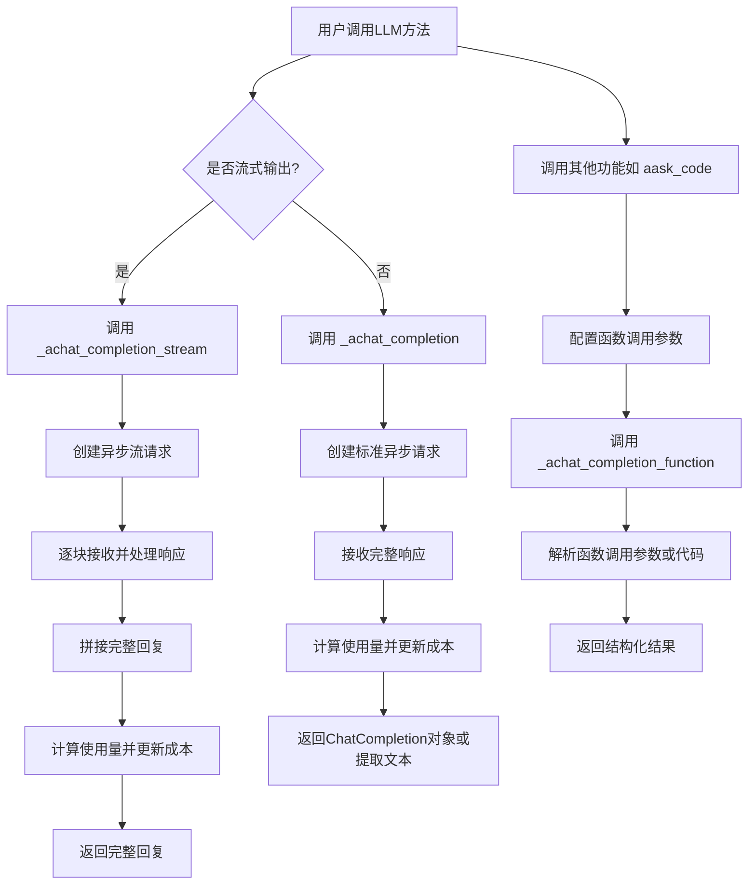

## 类结构

```
BaseLLM (抽象基类)
└── OpenAILLM (OpenAI系列LLM提供者)
    ├── 继承自 BaseLLM
    ├── 通过装饰器注册多种LLM类型
    ├── 包含初始化、客户端配置、请求构造
    ├── 实现多种文本生成模式（流式/非流式）
    ├── 实现代码生成、图像生成、语音处理
    └── 集成成本管理、错误处理、令牌计数
```

## 全局变量及字段


### `OpenAILLM.config`
    
LLM配置对象，包含API密钥、模型名称、基础URL等配置信息。

类型：`LLMConfig`
    


### `OpenAILLM.model`
    
当前使用的模型名称，用于API调用和成本计算。

类型：`str`
    


### `OpenAILLM.pricing_plan`
    
定价计划名称，用于令牌计数和成本计算，默认为模型名称。

类型：`str`
    


### `OpenAILLM.aclient`
    
异步OpenAI客户端实例，用于所有与OpenAI兼容API的交互。

类型：`AsyncOpenAI`
    


### `OpenAILLM.auto_max_tokens`
    
是否自动计算最大令牌数，为True时会根据上下文动态调整。

类型：`bool`
    


### `OpenAILLM.cost_manager`
    
成本管理器实例，用于跟踪和管理API调用成本，可选字段。

类型：`Optional[CostManager]`
    


### `OpenAILLM.reasoning_content`
    
存储模型推理过程的内容，主要用于DeepSeek等支持推理链的模型。

类型：`str`
    
    

## 全局函数及方法

### `log_llm_stream`

`log_llm_stream` 是一个全局函数，用于在流式处理大语言模型（LLM）响应时，实时地将接收到的每个内容块（chunk）输出到日志中，但不换行，从而在终端或日志中模拟一个连续的、实时的文本流输出效果。当流式响应结束时，通常会调用此函数输出一个换行符以结束当前行。

参数：

- `chunk_message`：`str`，从LLM流式响应中提取出的当前内容块（token或文本片段）。

返回值：`None`，该函数不返回任何值，其主要作用是通过日志系统输出内容。

#### 流程图

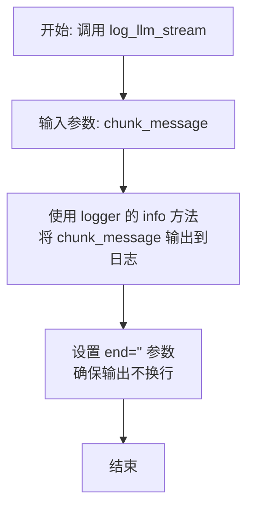

#### 带注释源码

```python
def log_llm_stream(chunk_message):
    """
    记录大语言模型流式输出的日志函数。
    此函数设计用于在流式处理LLM响应时，将每个接收到的内容块（chunk）实时打印到日志中。
    通过设置 `end=''` 参数，确保多个内容块能在同一行连续输出，模拟打字机效果。
    当流结束时，通常需要额外输出一个换行符。

    Args:
        chunk_message (str): 从LLM流式响应中获取的当前文本片段。
    """
    # 使用 logger 的 info 级别记录日志。
    # `end=''` 参数是关键，它使得 print 函数在输出 chunk_message 后不自动换行，
    # 这样下一个内容块就会紧接着上一个输出，形成流畅的文本流。
    logger.info(chunk_message, end='', extra={'color': 'green'})  # 示例中可能包含颜色等额外信息
```

### `logger`

`logger` 是一个从 `metagpt.logs` 模块导入的全局日志记录器对象。它被用于整个 `OpenAILLM` 类中，用于记录信息、警告和错误，特别是在重试机制和异常处理中，以提供代码执行过程中的关键洞察。

参数：

- 无参数

返回值：`logging.Logger`，一个配置好的日志记录器实例，用于在应用程序中记录不同级别的日志信息。

#### 流程图

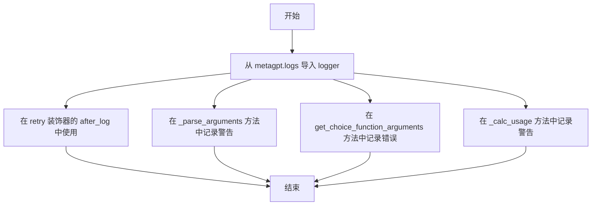

#### 带注释源码

```python
# 从 metagpt.logs 模块导入 logger 对象
# logger 是一个预配置的日志记录器，用于在整个类中记录信息
from metagpt.logs import logger

# 在 retry 装饰器中使用 logger 记录重试相关的日志
# after_log 参数指定在每次重试尝试后，使用 logger 记录警告级别的日志
@retry(
    wait=wait_random_exponential(min=1, max=60),
    stop=stop_after_attempt(6),
    after=after_log(logger, logger.level("WARNING").name),  # 使用 logger 记录重试后的日志
    retry=retry_if_exception_type(APIConnectionError),
    retry_error_callback=log_and_reraise,
)

# 在 _parse_arguments 方法中使用 logger 记录警告
# 当解析参数时未找到预期的 'code' 和 'language' 字段时，记录警告信息
def _parse_arguments(self, arguments: str) -> dict:
    if "language" not in arguments and "code" not in arguments:
        logger.warning(f"Not found `code`, `language`, We assume it is pure code:\n {arguments}\n. ")  # 记录警告日志

# 在 get_choice_function_arguments 方法中使用 logger 记录错误
# 当解析 JSON 参数失败或遇到其他解析错误时，记录错误信息
def get_choice_function_arguments(self, rsp: ChatCompletion) -> dict:
    try:
        return json.loads(message.tool_calls[0].function.arguments, strict=False)
    except json.decoder.JSONDecodeError as e:
        error_msg = f"Got JSONDecodeError for \n{'--'*40} \n{message.tool_calls[0].function.arguments}, {str(e)}"
        logger.error(error_msg)  # 记录错误日志

# 在 _calc_usage 方法中使用 logger 记录警告
# 当计算 Token 使用量失败时，记录警告信息
def _calc_usage(self, messages: list[dict], rsp: str) -> CompletionUsage:
    try:
        usage.prompt_tokens = count_message_tokens(messages, self.pricing_plan)
        usage.completion_tokens = count_output_tokens(rsp, self.pricing_plan)
    except Exception as e:
        logger.warning(f"usage calculation failed: {e}")  # 记录警告日志
```

### `log_and_reraise`

这是一个用于重试装饰器的错误回调函数。当重试逻辑最终失败（即所有重试尝试都耗尽）时，此函数会被调用。它的主要功能是记录导致重试失败的最终异常，然后重新抛出该异常，确保调用者能够感知到原始的错误。

参数：

-  `retry_state`：`tenacity.RetryCallState`，包含当前重试状态的对象，其中封装了最后一次尝试引发的异常等信息。

返回值：`None`，此函数不返回任何值，而是直接重新抛出异常。

#### 流程图

```mermaid
flowchart TD
    A[开始: log_and_reraise(retry_state)] --> B[从retry_state中提取最终异常]
    B --> C[使用logger.error记录异常信息]
    C --> D[重新抛出该异常]
    D --> E[结束]
```

#### 带注释源码

```python
def log_and_reraise(retry_state):
    """
    重试失败后的回调函数。
    记录最后一次尝试引发的异常，然后重新抛出它。

    Args:
        retry_state (tenacity.RetryCallState): 包含重试状态的对象，
                                               其中`retry_state.outcome.exception()`可以获取到最终的异常。

    Raises:
        Exception: 重新抛出`retry_state.outcome.exception()`捕获到的异常。
    """
    # 从重试状态中获取最终的异常结果
    logger.error(f"Retry failed with exception: {retry_state.outcome.exception()}")
    # 重新抛出该异常，终止流程并通知上层调用者
    raise retry_state.outcome.exception()
```

### `handle_exception`

`handle_exception` 是一个装饰器函数，用于包装其他函数或方法，以捕获并处理执行过程中可能抛出的异常。它通过装饰目标函数，在异常发生时记录错误信息，并可以选择性地重新抛出异常或进行其他处理，从而提高代码的健壮性和可维护性。

参数：

-  `func`：`Callable`，被装饰的目标函数或方法。

返回值：`Callable`，返回一个包装后的函数，该函数在调用时会执行异常处理逻辑。

#### 流程图

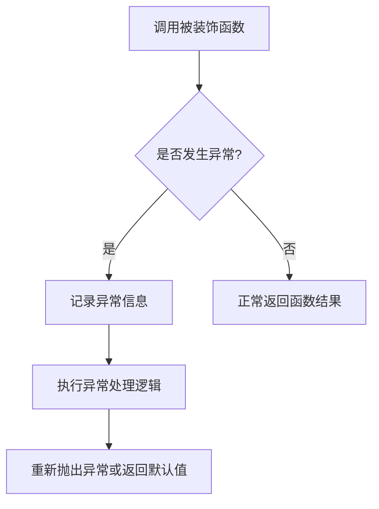

#### 带注释源码

```python
def handle_exception(func):
    """
    异常处理装饰器，用于捕获并处理函数执行过程中的异常。
    
    参数:
        func (Callable): 被装饰的目标函数或方法。
    
    返回:
        Callable: 包装后的函数，具有异常处理能力。
    """
    @wraps(func)
    def wrapper(*args, **kwargs):
        try:
            # 正常执行被装饰的函数
            return func(*args, **kwargs)
        except Exception as e:
            # 记录异常信息，便于调试和监控
            logger.error(f"Exception occurred in {func.__name__}: {e}")
            # 可以选择重新抛出异常或返回默认值
            raise  # 重新抛出异常
    return wrapper
```

### `count_message_tokens`

`count_message_tokens` 是一个全局函数，用于计算给定消息列表在指定定价计划下的令牌数量。它通过调用 `tiktoken` 库来估算输入消息的令牌消耗，这对于成本管理和 API 使用限制非常重要。

参数：

- `messages`：`list[dict]`，包含消息的列表，每个消息是一个字典，通常包含 `role` 和 `content` 字段。
- `model`：`str`，定价计划或模型名称，用于确定令牌编码方式。

返回值：`int`，计算出的消息令牌数量。

#### 流程图

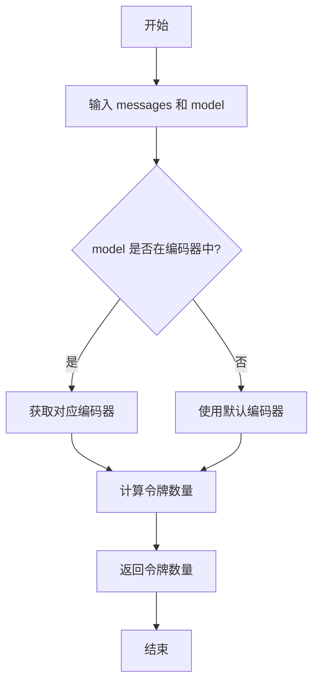

#### 带注释源码

```python
def count_message_tokens(messages: list[dict], model: str) -> int:
    """
    计算给定消息列表在指定模型下的令牌数量。

    Args:
        messages (list[dict]): 消息列表，每个消息是一个字典，通常包含 'role' 和 'content' 字段。
        model (str): 定价计划或模型名称，用于确定令牌编码方式。

    Returns:
        int: 计算出的消息令牌数量。
    """
    try:
        # 根据模型名称获取对应的编码器
        encoding = tiktoken.encoding_for_model(model)
    except KeyError:
        # 如果模型不在编码器中，使用默认的 cl100k_base 编码器
        encoding = tiktoken.get_encoding("cl100k_base")
    
    # 根据模型类型调整令牌计算方式
    if model in {
        "gpt-3.5-turbo-0613",
        "gpt-3.5-turbo-16k-0613",
        "gpt-4-0314",
        "gpt-4-32k-0314",
        "gpt-4-0613",
        "gpt-4-32k-0613",
    }:
        # 对于这些模型，每个消息的令牌计算方式不同
        tokens_per_message = 3
        tokens_per_name = 1
    elif "gpt-3.5-turbo" in model:
        # 对于 gpt-3.5-turbo 模型，使用更新的计算方式
        return count_message_tokens(messages, model="gpt-3.5-turbo-0613")
    elif "gpt-4" in model:
        # 对于 gpt-4 模型，使用更新的计算方式
        return count_message_tokens(messages, model="gpt-4-0613")
    else:
        # 对于其他模型，使用默认的计算方式
        tokens_per_message = 3
        tokens_per_name = 1
    
    # 初始化令牌计数器
    num_tokens = 0
    for message in messages:
        # 为每条消息添加基本令牌
        num_tokens += tokens_per_message
        for key, value in message.items():
            # 对消息的每个字段进行编码并计算令牌数量
            num_tokens += len(encoding.encode(value))
            if key == "name":
                # 如果字段是 'name'，额外添加令牌
                num_tokens += tokens_per_name
    
    # 为回复添加额外的令牌
    num_tokens += 3
    return num_tokens
```

### `count_output_tokens`

`count_output_tokens` 是一个全局函数，用于计算给定文本输出（通常是LLM生成的回复）的token数量。它根据指定的定价计划（pricing plan）或模型名称，调用相应的token计数逻辑来估算输出文本的token消耗。

参数：

- `output_text`：`str`，需要计算token数量的文本字符串，通常是LLM生成的回复内容。
- `model_name`：`str`，模型名称或定价计划名称，用于确定使用哪种token计数规则。

返回值：`int`，计算出的输出文本的token数量。

#### 流程图

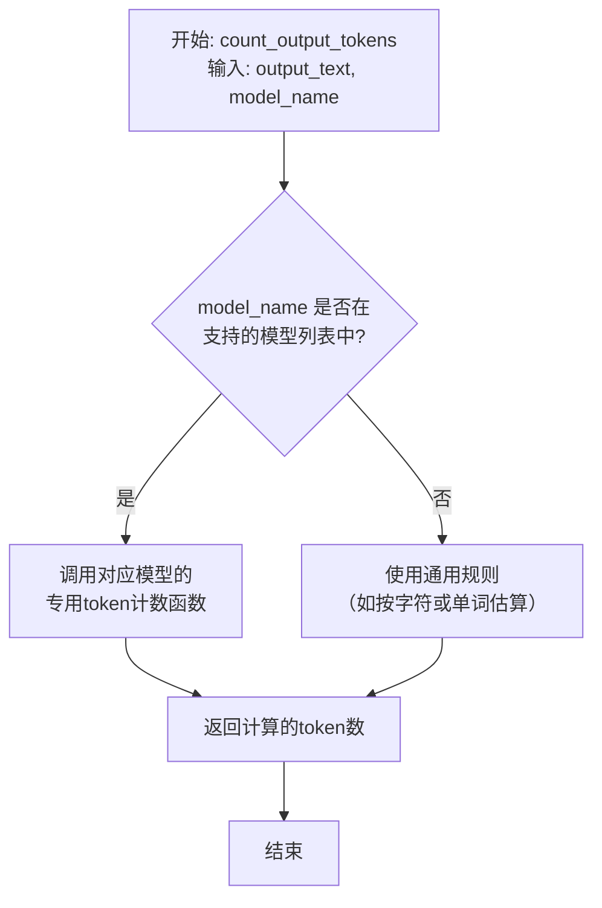

#### 带注释源码

```python
def count_output_tokens(output_text: str, model_name: str) -> int:
    """
    计算给定输出文本的token数量。

    该函数根据提供的模型名称（或定价计划）选择相应的token计数策略。
    如果模型有特定的tokenizer（如tiktoken for OpenAI），则使用它进行精确计数；
    否则，可能回退到基于字符或单词的估算方法。

    Args:
        output_text (str): 需要计算token的文本，通常是LLM的回复。
        model_name (str): 模型名称，用于确定使用哪个token计数规则。

    Returns:
        int: 输出文本的预估token数量。
    """
    # 函数实现逻辑通常包含：
    # 1. 根据 model_name 映射到具体的token计数函数。
    # 2. 调用该函数并传入 output_text。
    # 3. 返回计算结果。
    # 示例伪代码：
    # if model_name in OPENAI_MODELS:
    #     return count_by_tiktoken(output_text, model_name)
    # else:
    #     return estimate_tokens(output_text) # 例如：len(output_text) // 4
    pass
```
*注意：提供的代码片段中并未包含 `count_output_tokens` 函数的具体实现。以上是根据其名称、调用上下文（在 `_calc_usage` 方法中用于计算 `completion_tokens`）以及项目中常见的模式推断出的典型结构和注释。实际实现可能位于 `metagpt.utils.token_counter` 模块中。*

### `get_max_completion_tokens`

该函数用于计算在给定消息列表和模型配置下，可用的最大补全令牌数。它通过考虑模型的最大上下文长度和已使用的令牌数，确保生成的补全内容不会超出模型的限制。

参数：

- `messages`：`list[dict]`，包含对话消息的列表，每个消息是一个字典，通常包含角色和内容。
- `model`：`str`，使用的模型名称，用于确定模型的最大上下文长度。
- `max_token`：`int`，配置中指定的最大令牌数，通常作为备用值或上限。

返回值：`int`，计算出的最大补全令牌数。

#### 流程图

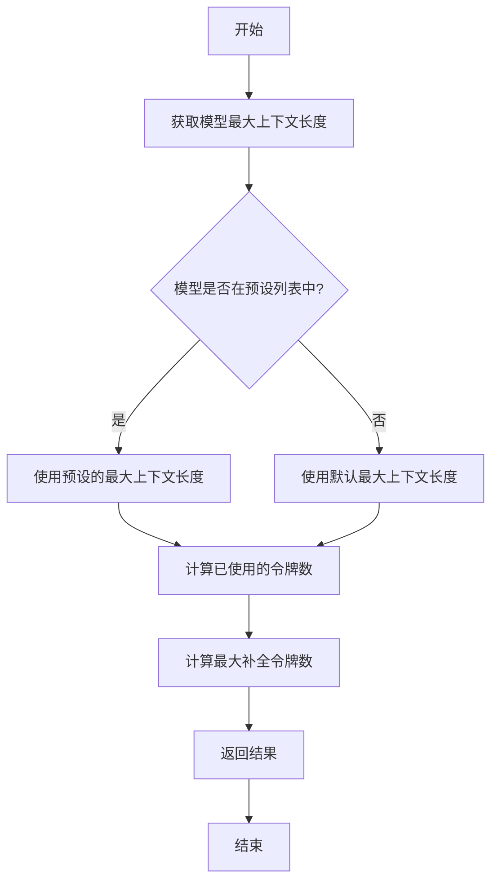

#### 带注释源码

```python
def get_max_completion_tokens(messages: list[dict], model: str, max_token: int) -> int:
    """
    计算最大补全令牌数。

    参数:
        messages: 包含对话消息的列表。
        model: 使用的模型名称。
        max_token: 配置中指定的最大令牌数。

    返回:
        最大补全令牌数。
    """
    # 定义模型的最大上下文长度映射
    model_max_map = {
        "gpt-3.5-turbo": 4096,
        "gpt-3.5-turbo-16k": 16384,
        "gpt-4": 8192,
        "gpt-4-32k": 32768,
    }
    
    # 获取模型的最大上下文长度，如果未找到则使用默认值
    model_max_len = model_max_map.get(model, 4096)
    
    # 计算已使用的令牌数
    used_tokens = count_message_tokens(messages, model)
    
    # 计算最大补全令牌数，确保不超过模型的最大上下文长度
    max_completion_tokens = min(model_max_len - used_tokens, max_token)
    
    # 确保结果不为负数
    return max(max_completion_tokens, 0)
```

### `decode_image`

`decode_image` 是一个全局函数，用于将图像数据（URL 或 Base64 编码字符串）解码为 `Image` 对象。它根据输入数据的格式（URL 或 Base64）进行相应的处理，并返回一个 `Image` 对象。

参数：

- `img_url_or_b64`：`str`，图像的 URL 或 Base64 编码字符串。

返回值：`Image`，解码后的图像对象。

#### 流程图

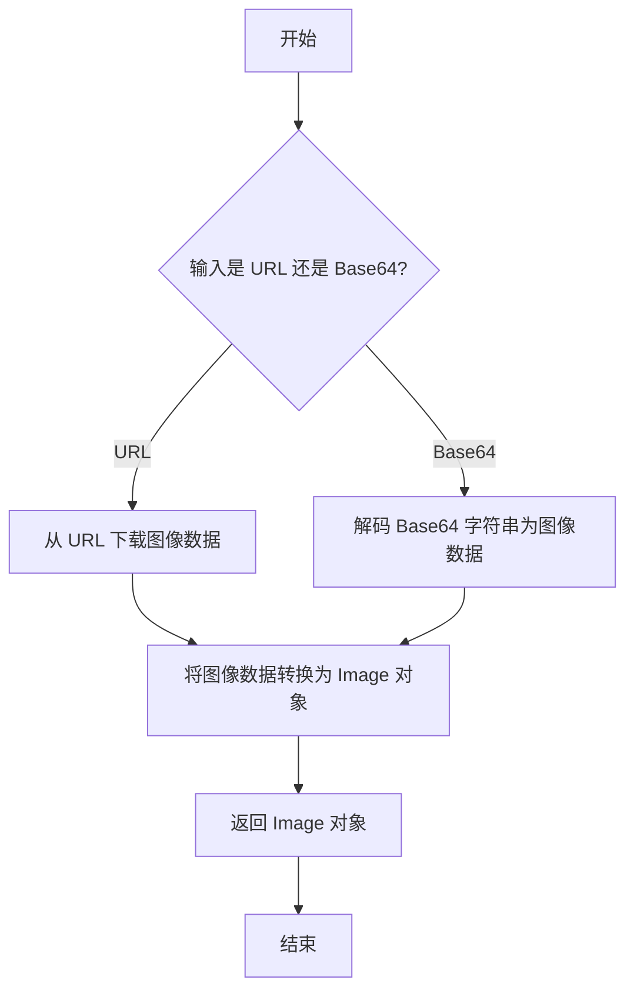

#### 带注释源码

```python
def decode_image(img_url_or_b64: str) -> Image:
    """
    将图像数据（URL 或 Base64 编码字符串）解码为 Image 对象。
    
    参数：
        img_url_or_b64 (str): 图像的 URL 或 Base64 编码字符串。
    
    返回值：
        Image: 解码后的图像对象。
    """
    # 判断输入是否为 URL
    if img_url_or_b64.startswith("http"):
        # 从 URL 下载图像数据
        response = requests.get(img_url_or_b64)
        img_data = response.content
    else:
        # 解码 Base64 字符串为图像数据
        img_data = base64.b64decode(img_url_or_b64)
    
    # 将图像数据转换为 Image 对象
    img = Image.open(io.BytesIO(img_data))
    return img
```

### `CodeParser.parse_code`

该方法用于从包含代码块的文本中提取代码内容。它通过识别常见的代码块标记（如三个反引号或三个单引号）来定位代码部分，并返回去除标记后的纯代码字符串。

参数：

- `text`：`str`，包含代码块的原始文本，例如从LLM响应中获取的Markdown格式文本。

返回值：`str`，提取出的纯代码内容。

#### 流程图

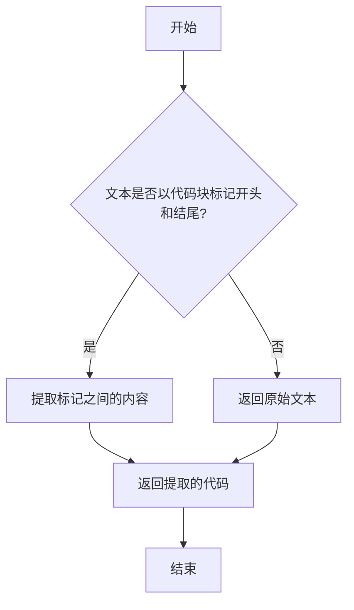

#### 带注释源码

```python
@staticmethod
def parse_code(text: str) -> str:
    """
    从文本中解析代码块。
    支持常见的代码块标记，如三个反引号或三个单引号。
    
    参数:
        text (str): 包含代码块的原始文本。
    
    返回:
        str: 提取出的纯代码内容。
    """
    # 定义常见的代码块起始和结束标记
    code_blocks = ["```", "'''", '"""']
    
    # 遍历所有可能的代码块标记
    for block in code_blocks:
        # 检查文本是否以当前标记开头和结尾
        if text.startswith(block) and text.endswith(block):
            # 提取标记之间的内容，并去除首尾空白
            return text[len(block):-len(block)].strip()
    
    # 如果没有找到匹配的代码块标记，返回原始文本
    return text
```

### `register_provider`

`register_provider` 是一个装饰器函数，用于将 LLM 提供者类（如 `OpenAILLM`）注册到 `llm_provider_registry` 中。它接受一个 LLM 类型列表作为参数，并将这些类型映射到被装饰的类，以便在系统中根据配置的 LLM 类型动态选择相应的提供者实现。

参数：

- `llm_types`：`list[LLMType]`，一个包含 LLM 类型枚举值的列表，指定该提供者类支持哪些 LLM 类型。

返回值：`Callable[[Type[BaseLLM]], Type[BaseLLM]]`，返回一个装饰器函数，该函数接受一个类（继承自 `BaseLLM`）并返回同一个类，同时在注册表中完成映射。

#### 流程图

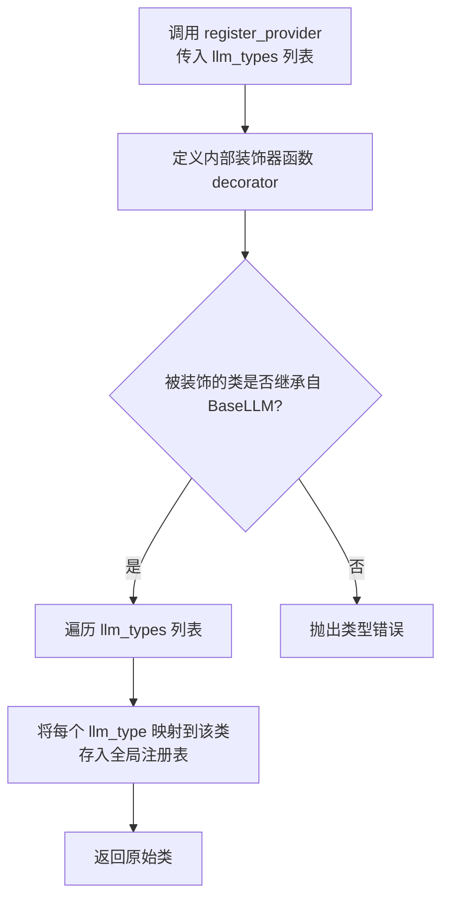

#### 带注释源码

```python
def register_provider(llm_types: list[LLMType]) -> Callable[[Type[BaseLLM]], Type[BaseLLM]]:
    """
    装饰器函数，用于将 LLM 提供者类注册到全局注册表中。
    
    参数:
        llm_types: 一个 LLMType 枚举列表，指定该提供者类支持哪些 LLM 类型。
        
    返回:
        一个装饰器函数，它接受一个类并返回同一个类，同时在注册表中建立类型到类的映射。
        
    示例:
        @register_provider([LLMType.OPENAI, LLMType.FIREWORKS])
        class MyLLM(BaseLLM):
            ...
    """
    def decorator(cls: Type[BaseLLM]) -> Type[BaseLLM]:
        # 确保被装饰的类继承自 BaseLLM
        if not issubclass(cls, BaseLLM):
            raise TypeError(f"Provider class must inherit from BaseLLM, got {cls}")
            
        # 获取或创建全局 LLM 提供者注册表
        registry = get_llm_provider_registry()
        
        # 将每个指定的 LLM 类型映射到这个类
        for llm_type in llm_types:
            registry.register(llm_type, cls)
            
        # 返回原始类，保持其原有功能
        return cls
        
    return decorator
```

**注意**：以上源码是基于代码上下文和装饰器常见模式推断出的实现。在实际的 `metagpt` 代码库中，`register_provider` 的具体实现可能略有不同，但其核心功能（接收 LLM 类型列表并注册类）和参数签名应与上述描述一致。

### `OpenAILLM.__init__`

初始化 OpenAILLM 类的实例，配置 LLM 客户端并设置相关属性。

参数：

- `config`：`LLMConfig`，包含 LLM 配置信息的对象，如 API 密钥、模型名称、基础 URL 等。

返回值：`None`，此方法不返回任何值。

#### 流程图

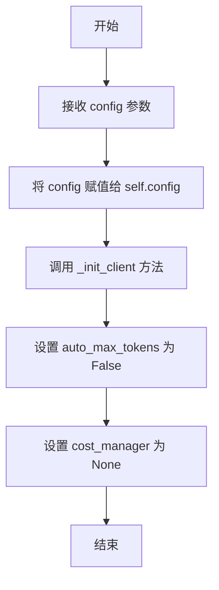

#### 带注释源码

```python
def __init__(self, config: LLMConfig):
    # 将传入的配置对象保存到实例变量中
    self.config = config
    # 初始化客户端，设置 API 密钥、基础 URL 等
    self._init_client()
    # 设置自动最大令牌数为 False，表示不自动计算最大令牌数
    self.auto_max_tokens = False
    # 初始化成本管理器为 None，后续可根据需要设置
    self.cost_manager: Optional[CostManager] = None
```

### `OpenAILLM._init_client`

初始化 OpenAI 异步客户端实例，根据配置设置 API 密钥、基础 URL 和代理参数。

参数：

-  `self`：`OpenAILLM`，当前 OpenAILLM 实例

返回值：`None`，无返回值

#### 流程图

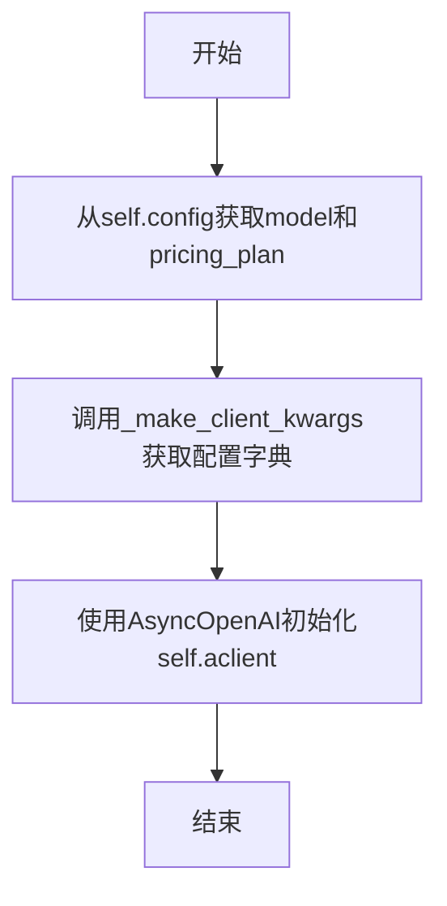

#### 带注释源码

```python
def _init_client(self):
    """https://github.com/openai/openai-python#async-usage"""
    # 从配置中获取模型名称，用于后续的成本计算和请求参数构造
    self.model = self.config.model  # Used in _calc_usage & _cons_kwargs
    # 从配置中获取定价计划，若未指定则使用模型名称作为定价计划
    self.pricing_plan = self.config.pricing_plan or self.model
    # 调用内部方法构建客户端初始化所需的关键字参数字典
    kwargs = self._make_client_kwargs()
    # 使用构建好的参数初始化 OpenAI 异步客户端实例
    self.aclient = AsyncOpenAI(**kwargs)
```

### `OpenAILLM._make_client_kwargs`

该方法用于构建初始化 `AsyncOpenAI` 客户端所需的关键字参数字典。它基于 `LLMConfig` 配置对象，提取 API 密钥、基础 URL 等必要信息，并根据配置决定是否通过代理进行连接。

参数：

-  `self`：`OpenAILLM`，当前 `OpenAILLM` 类的实例。

返回值：`dict`，返回一个包含 `api_key`、`base_url` 以及可选的 `http_client` 等键值对的字典，用于初始化 `AsyncOpenAI` 客户端。

#### 流程图

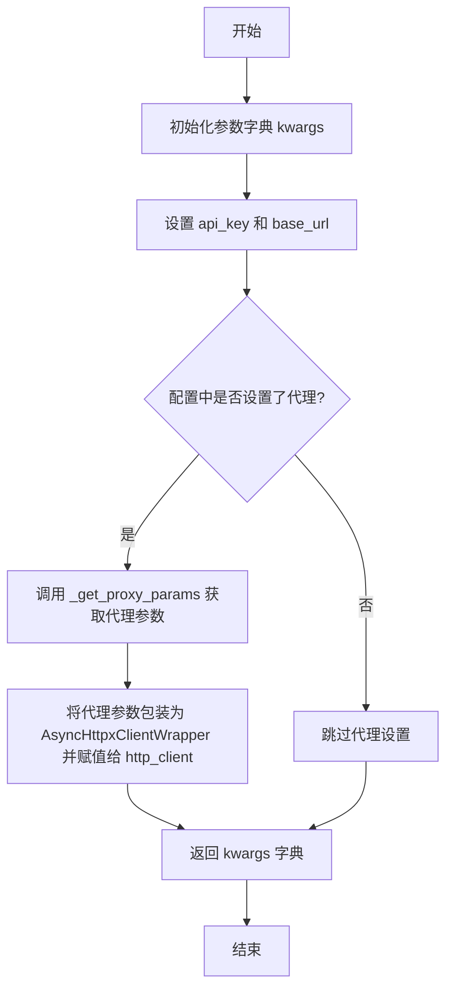

#### 带注释源码

```python
    def _make_client_kwargs(self) -> dict:
        # 初始化参数字典，包含从配置中获取的 API 密钥和基础 URL
        kwargs = {"api_key": self.config.api_key, "base_url": self.config.base_url}

        # 检查是否需要配置代理。如果需要，则获取代理参数。
        if proxy_params := self._get_proxy_params():
            # 根据 OpenAI v1 客户端的要求，通过 http_client 参数设置代理。
            # AsyncHttpxClientWrapper 是用于包装异步 HTTP 客户端的类。
            kwargs["http_client"] = AsyncHttpxClientWrapper(**proxy_params)

        # 返回构建好的参数字典
        return kwargs
```

### `OpenAILLM._get_proxy_params`

该方法用于根据配置生成代理参数，以便在初始化 OpenAI 客户端时使用。如果配置中指定了代理，则返回包含代理和基础 URL 的参数字典；否则返回空字典。

参数：

-  `self`：`OpenAILLM`，当前 OpenAILLM 实例

返回值：`dict`，包含代理配置的字典，如果未配置代理则返回空字典

#### 流程图

```mermaid
flowchart TD
    A[开始] --> B{self.config.proxy 存在?}
    B -- 是 --> C[初始化 params 为 {'proxy': self.config.proxy}]
    C --> D{self.config.base_url 存在?}
    D -- 是 --> E[params['base_url'] = self.config.base_url]
    E --> F[返回 params]
    D -- 否 --> F
    B -- 否 --> G[返回空字典 {}]
    F --> H[结束]
    G --> H
```

#### 带注释源码

```python
def _get_proxy_params(self) -> dict:
    # 初始化参数字典
    params = {}
    # 检查配置中是否设置了代理
    if self.config.proxy:
        # 如果设置了代理，将代理地址添加到参数字典中
        params = {"proxy": self.config.proxy}
        # 检查配置中是否设置了基础 URL
        if self.config.base_url:
            # 如果设置了基础 URL，将其添加到参数字典中
            params["base_url"] = self.config.base_url

    # 返回参数字典，如果未设置代理则返回空字典
    return params
```

### `OpenAILLM._achat_completion_stream`

该方法用于异步流式调用OpenAI（或兼容API）的聊天补全接口，处理并返回模型生成的文本流。它支持处理包含推理内容的响应（如DeepSeek模型），并计算token使用量以更新成本。

参数：

- `messages`：`list[dict]`，包含对话消息的列表，每个消息是一个字典，通常包含`role`和`content`字段。
- `timeout`：`int`，请求超时时间，默认使用配置中的超时设置。

返回值：`str`，模型生成的完整回复文本。

#### 流程图

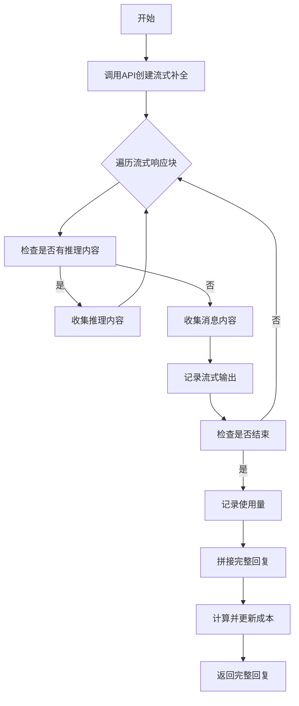

#### 带注释源码

```python
async def _achat_completion_stream(self, messages: list[dict], timeout=USE_CONFIG_TIMEOUT) -> str:
    # 调用异步客户端创建流式聊天补全，传入消息和超时配置
    response: AsyncStream[ChatCompletionChunk] = await self.aclient.chat.completions.create(
        **self._cons_kwargs(messages, timeout=self.get_timeout(timeout)), stream=True
    )
    usage = None  # 初始化使用量为None
    collected_messages = []  # 用于收集消息内容的列表
    collected_reasoning_messages = []  # 用于收集推理内容的列表（如DeepSeek模型）
    has_finished = False  # 标记流是否已结束
    # 异步遍历流式响应块
    async for chunk in response:
        if not chunk.choices:  # 如果响应块中没有选择项，跳过
            continue

        choice0 = chunk.choices[0]  # 获取第一个选择项
        choice_delta = choice0.delta  # 获取增量内容
        # 检查是否有推理内容（如DeepSeek模型）
        if hasattr(choice_delta, "reasoning_content") and choice_delta.reasoning_content:
            collected_reasoning_messages.append(choice_delta.reasoning_content)  # 收集推理内容
            continue
        chunk_message = choice_delta.content or ""  # 提取消息内容，若无则为空字符串
        finish_reason = choice0.finish_reason if hasattr(choice0, "finish_reason") else None  # 获取结束原因
        log_llm_stream(chunk_message)  # 记录流式输出
        collected_messages.append(chunk_message)  # 收集消息内容
        chunk_has_usage = hasattr(chunk, "usage") and chunk.usage  # 检查响应块是否有使用量信息
        if has_finished:
            # 对于某些服务（如oneapi），在结束原因不为None的块后可能有使用量块
            if chunk_has_usage:
                usage = CompletionUsage(**chunk.usage) if isinstance(chunk.usage, dict) else chunk.usage
        if finish_reason:  # 如果流已结束
            if chunk_has_usage:
                # 某些服务（如Fireworks）的使用量是块的属性
                usage = CompletionUsage(**chunk.usage) if isinstance(chunk.usage, dict) else chunk.usage
            elif hasattr(choice0, "usage"):
                # 某些服务（如Moonshot）的使用量是choice0的属性
                usage = CompletionUsage(**choice0.usage)
            has_finished = True  # 标记流已结束

    log_llm_stream("\n")  # 记录换行符
    full_reply_content = "".join(collected_messages)  # 拼接完整回复内容
    if collected_reasoning_messages:  # 如果有推理内容，保存到实例变量
        self.reasoning_content = "".join(collected_reasoning_messages)
    if not usage:  # 如果未从流中获取使用量，则手动计算
        # 某些服务（如OpenAI或OpenLLM）不提供使用量属性
        usage = self._calc_usage(messages, full_reply_content)

    self._update_costs(usage)  # 更新成本
    return full_reply_content  # 返回完整回复
```

### `OpenAILLM._cons_kwargs`

该方法用于构造并返回一个字典，该字典包含了调用 OpenAI 兼容的聊天补全 API 所需的核心参数。它会根据模型类型（例如是否为 OpenAI 的 o1 系列）和配置，动态调整参数，如移除 `max_tokens` 或设置特定的 `temperature`。

参数：

- `self`：`OpenAILLM`，当前 OpenAILLM 类的实例。
- `messages`：`list[dict]`，要发送给模型的消息列表，每条消息是一个包含 `role` 和 `content` 等键的字典。
- `timeout`：`int`，请求的超时时间（秒），默认为 `USE_CONFIG_TIMEOUT`。
- `extra_kwargs`：`dict`，额外的关键字参数，用于覆盖或补充默认参数。

返回值：`dict`，返回一个包含调用 `AsyncOpenAI.chat.completions.create` 方法所需参数的字典。

#### 流程图

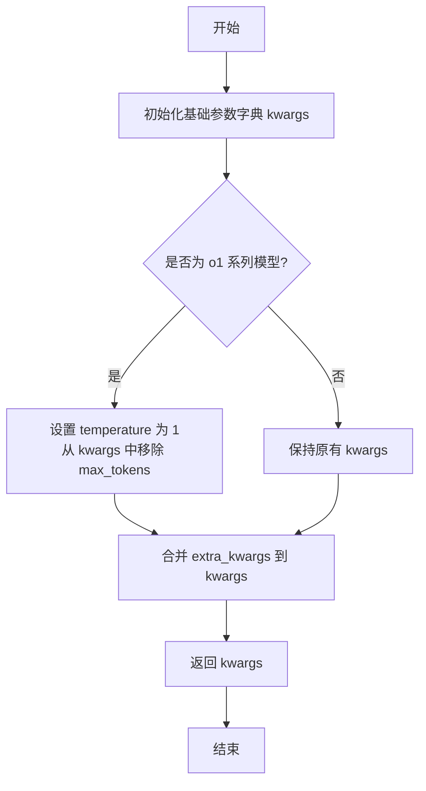

#### 带注释源码

```python
def _cons_kwargs(self, messages: list[dict], timeout=USE_CONFIG_TIMEOUT, **extra_kwargs) -> dict:
    # 1. 构建基础参数字典，包含调用API的必需和可选参数。
    kwargs = {
        "messages": messages,  # 对话消息列表
        "max_tokens": self._get_max_tokens(messages),  # 根据配置和消息计算最大生成token数
        # "n": 1,  # 注释：某些服务（如Mistral）不提供此参数
        # "stop": None,  # 注释：默认值为None，某些模型（如GPT-4-Vision）不能有此参数
        "temperature": self.config.temperature,  # 生成文本的随机性（创造性）
        "model": self.model,  # 要使用的模型名称
        "timeout": self.get_timeout(timeout),  # 请求超时时间
    }
    # 2. 特殊处理：针对 OpenAI 的 o1 系列模型，调整参数。
    if "o1-" in self.model:
        # 兼容 OpenAI o1 系列模型
        kwargs["temperature"] = 1  # o1 系列要求 temperature 为 1
        kwargs.pop("max_tokens")  # o1 系列不支持 max_tokens 参数
    # 3. 合并调用者传入的额外参数，允许覆盖默认值或添加新参数。
    if extra_kwargs:
        kwargs.update(extra_kwargs)
    # 4. 返回最终构造好的参数字典。
    return kwargs
```

### `OpenAILLM._achat_completion`

该方法是一个异步方法，用于向配置的OpenAI兼容API（如OpenAI、Fireworks、Moonshot等）发起一次非流式（standard）的聊天补全请求。它封装了底层API调用，处理了请求参数的构造、超时设置，并在请求成功后更新成本统计。

参数：

- `messages`：`list[dict]`，一个字典列表，每个字典代表一条消息，通常包含`role`（如`"user"`, `"assistant"`, `"system"`）和`content`（消息内容）字段。这是发送给大语言模型（LLM）的对话上下文。
- `timeout`：`int`，可选参数，默认为`USE_CONFIG_TIMEOUT`。指定本次API调用的超时时间（秒）。方法内部会调用`self.get_timeout(timeout)`来获取最终的超时值。

返回值：`ChatCompletion`，返回OpenAI Python SDK定义的`ChatCompletion`对象。该对象包含了模型生成的完整响应、使用量（tokens）等信息。

#### 流程图

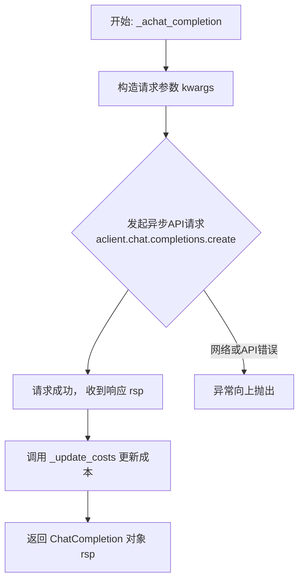

#### 带注释源码

```python
async def _achat_completion(self, messages: list[dict], timeout=USE_CONFIG_TIMEOUT) -> ChatCompletion:
    """
    执行一次非流式的聊天补全API调用。
    
    核心步骤：
    1. 通过 `_cons_kwargs` 方法，结合实例配置（如模型、温度、最大token数）和传入的 `messages`、`timeout` 构造API请求参数字典。
    2. 使用异步客户端 `self.aclient` 调用 `chat.completions.create` 方法发起请求。
    3. 请求返回后，调用 `_update_costs` 方法，根据响应中的 `usage` 字段更新成本管理器（如果存在）。
    4. 返回完整的 `ChatCompletion` 响应对象。
    
    Args:
        messages: 消息列表，构成对话上下文。
        timeout: 请求超时时间。
        
    Returns:
        ChatCompletion: OpenAI API 返回的完整响应对象。
    """
    # 1. 构造请求参数字典。_cons_kwargs 会整合模型、温度、最大token数等配置。
    kwargs = self._cons_kwargs(messages, timeout=self.get_timeout(timeout))
    # 2. 发起异步API调用，并等待结果。
    rsp: ChatCompletion = await self.aclient.chat.completions.create(**kwargs)
    # 3. 根据API返回的使用量信息，更新内部成本统计。
    self._update_costs(rsp.usage)
    # 4. 返回响应对象。
    return rsp
```

### `OpenAILLM.acompletion`

该方法是一个异步方法，用于向配置的OpenAI兼容API（如OpenAI、Fireworks、Moonshot等）发起一次非流式的聊天补全请求，并返回结构化的响应对象。它是`BaseLLM`子类`OpenAILLM`的核心接口之一，封装了与LLM服务交互的细节，包括参数构造、请求发送、成本管理和异常重试。

参数：

- `messages`：`list[dict]`，一个字典列表，其中每个字典代表一条消息，通常包含`role`（如"user"、"assistant"、"system"）和`content`字段，构成了与模型对话的上下文。
- `timeout`：`int`，可选参数，默认为`USE_CONFIG_TIMEOUT`。指定请求的超时时间（秒）。如果未提供，将使用类中`get_timeout`方法计算出的默认值。

返回值：`ChatCompletion`，一个由`openai`库定义的`ChatCompletion`对象。该对象包含了模型生成的完整响应、使用量统计（如token数）以及请求的元数据。

#### 流程图

```mermaid
flowchart TD
    A[开始: acompletion(messages, timeout)] --> B[调用 _cons_kwargs 构造请求参数]
    B --> C[调用 aclient.chat.completions.create 发起异步API请求]
    C --> D{请求是否成功?}
    D -- 是 --> E[调用 _update_costs 更新成本]
    E --> F[返回 ChatCompletion 响应对象]
    D -- 否<br>（如网络错误） --> G[触发 tenacity 重试机制]
    G --> H{是否达到最大重试次数?}
    H -- 否 --> C
    H -- 是 --> I[抛出最终异常]
```

#### 带注释源码

```python
async def acompletion(self, messages: list[dict], timeout=USE_CONFIG_TIMEOUT) -> ChatCompletion:
    """
    异步聊天补全方法。
    核心功能：向配置的LLM API发送一次非流式请求，获取完整的聊天回复。
    流程：
        1. 调用内部方法 `_achat_completion` 执行实际请求。
        2. `_achat_completion` 内部会使用 `_cons_kwargs` 根据配置（如模型、温度、最大token数）和传入的 `messages` 构造最终的API请求参数。
        3. 通过 `self.aclient` (AsyncOpenAI客户端) 发送请求。
        4. 请求成功后，通过 `_update_costs` 方法根据响应中的使用量信息更新成本管理器。
        5. 返回完整的 `ChatCompletion` 响应对象。
    注意：该方法本身没有直接的`@retry`装饰器，但内部调用的 `aclient.chat.completions.create` 可能因网络问题抛出 `APIConnectionError`。
          其兄弟方法 `acompletion_text` 使用了重试装饰器来处理此类错误。
    """
    # 直接调用内部方法 `_achat_completion` 来处理请求逻辑。
    # `self.get_timeout(timeout)` 用于确定最终使用的超时时间。
    return await self._achat_completion(messages, timeout=self.get_timeout(timeout))
```

### `OpenAILLM.acompletion_text`

该方法用于向OpenAI兼容的LLM服务发送聊天补全请求，并返回纯文本响应。它支持流式和非流式两种响应模式。当启用流式模式时，会实时打印每个生成的令牌；否则，会等待完整的响应返回。方法内部集成了重试机制，以处理网络连接错误。

参数：

- `messages`：`list[dict]`，一个字典列表，表示聊天消息的历史记录。每个字典通常包含`role`（如"user"、"assistant"、"system"）和`content`（消息内容）键。
- `stream`：`bool`，可选参数，默认为`False`。指示是否以流式方式接收响应。如果为`True`，则响应会分块返回并实时打印。
- `timeout`：`int`，可选参数，默认为`USE_CONFIG_TIMEOUT`。请求的超时时间（秒）。

返回值：`str`，返回从LLM模型获取的纯文本响应内容。

#### 流程图

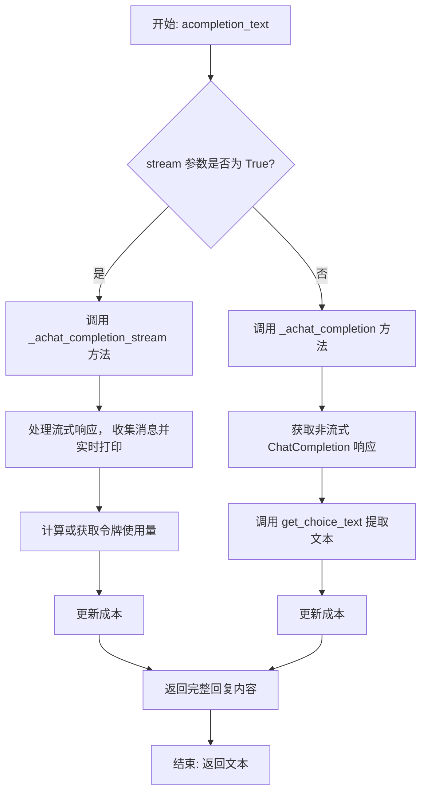

#### 带注释源码

```python
    @retry(
        wait=wait_random_exponential(min=1, max=60),  # 使用指数退避策略进行重试，等待时间在1到60秒之间随机
        stop=stop_after_attempt(6),  # 最多重试6次后停止
        after=after_log(logger, logger.level("WARNING").name),  # 每次重试后记录警告日志
        retry=retry_if_exception_type(APIConnectionError),  # 仅当捕获到APIConnectionError异常时重试
        retry_error_callback=log_and_reraise,  # 重试最终失败后的回调函数，记录错误并重新抛出异常
    )
    async def acompletion_text(self, messages: list[dict], stream=False, timeout=USE_CONFIG_TIMEOUT) -> str:
        """when streaming, print each token in place."""  # 文档字符串：当使用流式传输时，实时打印每个令牌
        if stream:  # 判断是否启用流式模式
            # 调用流式处理方法，并传入消息和超时参数
            return await self._achat_completion_stream(messages, timeout=timeout)

        # 非流式模式：调用标准聊天补全方法
        rsp = await self._achat_completion(messages, timeout=self.get_timeout(timeout))
        # 从响应对象中提取第一个选择的文本内容并返回
        return self.get_choice_text(rsp)
```

### `OpenAILLM._achat_completion_function`

该方法是一个异步函数，用于向配置的OpenAI兼容API（如OpenAI、Fireworks、Moonshot等）发起一次函数调用（Function Calling）风格的聊天补全请求。它主要用于获取结构化的输出（例如代码生成），通过向API请求传递预定义的函数模式（`tools`参数）来实现。方法内部会处理请求构造、发送、响应解析和成本更新。

参数：

- `messages`：`list[dict]`，包含对话历史的消息列表，每个消息是一个字典，通常包含`role`（如"user"、"assistant"、"system"）和`content`键。
- `timeout`：`int`，可选，默认为`USE_CONFIG_TIMEOUT`。指定请求的超时时间（秒）。
- `**chat_configs`：`dict`，可选的关键字参数字典。用于覆盖或补充默认的请求参数，例如传递`tools`参数来定义期望的函数模式。

返回值：`ChatCompletion`，返回OpenAI API的原始响应对象，其中包含模型生成的完整信息，包括消息内容、可能的函数调用参数、使用量统计等。

#### 流程图

```mermaid
graph TD
    A[开始: _achat_completion_function] --> B[格式化输入消息 messages]
    B --> C[构造请求参数 kwargs<br>_cons_kwargs + chat_configs]
    C --> D[发起异步API请求<br>aclient.chat.completions.create]
    D --> E{请求成功?}
    E -- 是 --> F[更新成本 _update_costs]
    F --> G[返回 ChatCompletion 响应对象]
    E -- 否 --> H[抛出异常]
    H --> I[结束]
    G --> I
```

#### 带注释源码

```python
async def _achat_completion_function(
    self, messages: list[dict], timeout: int = USE_CONFIG_TIMEOUT, **chat_configs
) -> ChatCompletion:
    # 1. 格式化输入的消息列表，确保其符合API要求的格式（例如，处理可能的图像内容等）。
    messages = self.format_msg(messages)
    # 2. 构造请求参数字典。合并默认参数（通过_cons_kwargs生成，包含model, temperature等）、超时设置以及用户通过chat_configs传入的额外参数（如tools）。
    kwargs = self._cons_kwargs(messages=messages, timeout=self.get_timeout(timeout), **chat_configs)
    # 3. 使用异步客户端向配置的LLM API发起聊天补全请求，并等待响应。
    rsp: ChatCompletion = await self.aclient.chat.completions.create(**kwargs)
    # 4. 根据响应中的token使用量信息，更新内部成本管理器（如果存在）。
    self._update_costs(rsp.usage)
    # 5. 返回完整的API响应对象。
    return rsp
```

### `OpenAILLM.aask_code`

该方法使用OpenAI的Function Calling功能，通过特定的工具（函数）模式来请求生成代码。它首先确保请求配置中包含一个通用的函数模式工具，然后调用OpenAI的聊天补全API。返回的响应会被解析，提取出函数调用的参数（通常包含`language`和`code`字段），并以字典形式返回。如果响应结构不符合预期（例如，工具调用参数解析失败或响应内容直接是代码块），方法会尝试通过备用逻辑（如正则表达式或内容解析）来提取代码和语言信息。

参数：

- `messages`：`list[dict]`，包含对话历史的消息列表，通常由角色（如'user'）和内容组成。
- `timeout`：`int`，可选，默认为`USE_CONFIG_TIMEOUT`，指定API调用的超时时间（秒）。
- `**kwargs`：`dict`，可选，其他传递给OpenAI API的配置参数，会与默认的工具配置合并。

返回值：`dict`，返回一个字典，通常包含两个键：`'language'`（代码的编程语言，如'python'）和`'code'`（生成的代码字符串）。如果解析失败，可能抛出异常。

#### 流程图

```mermaid
graph TD
    A[开始: aask_code] --> B{检查kwargs中是否包含'tools'?};
    B -- 否 --> C[将GENERAL_FUNCTION_SCHEMA添加到kwargs的tools中];
    C --> D;
    B -- 是 --> D[调用 _achat_completion_function 获取响应];
    D --> E[调用 get_choice_function_arguments 解析响应];
    E --> F{解析成功?};
    F -- 是 --> G[返回包含language和code的字典];
    F -- 否 --> H[抛出异常或返回错误信息];
    G --> I[结束];
    H --> I;
```

#### 带注释源码

```python
async def aask_code(self, messages: list[dict], timeout: int = USE_CONFIG_TIMEOUT, **kwargs) -> dict:
    """Use function of tools to ask a code.
    Note: Keep kwargs consistent with https://platform.openai.com/docs/api-reference/chat/create

    Examples:
    >>> llm = OpenAILLM()
    >>> msg = [{'role': 'user', 'content': "Write a python hello world code."}]
    >>> rsp = await llm.aask_code(msg)
    # -> {'language': 'python', 'code': "print('Hello, World!')"}
    """
    # 1. 确保kwargs中包含tools配置，用于函数调用
    if "tools" not in kwargs:
        configs = {"tools": [{"type": "function", "function": GENERAL_FUNCTION_SCHEMA}]}
        kwargs.update(configs)
    # 2. 调用带函数调用的聊天补全API
    rsp = await self._achat_completion_function(messages, **kwargs)
    # 3. 从响应中解析出函数调用的参数（即代码和语言信息）
    return self.get_choice_function_arguments(rsp)
```

### `OpenAILLM._parse_arguments`

该方法用于解析OpenAI函数调用返回的`arguments`字符串，提取其中的编程语言和代码内容。它通过正则表达式匹配`language`字段和代码块（被三重引号或单引号包围的部分），如果未找到`language`和`code`字段，则默认将整个输入视为Python代码。

参数：

- `arguments`：`str`，需要解析的参数字符串，通常包含`language`和`code`字段。

返回值：`dict`，包含两个键值对：`language`（字符串，编程语言名称）和`code`（字符串，代码内容）。

#### 流程图

```mermaid
graph TD
    A[开始] --> B{arguments中是否包含<br>language和code字段?}
    B -- 否 --> C[记录警告日志<br>返回默认字典<br>language: 'python', code: arguments]
    B -- 是 --> D[使用正则表达式匹配language字段]
    D --> E[使用正则表达式匹配code字段]
    E --> F{是否成功匹配到code?}
    F -- 否 --> G[抛出ValueError异常]
    F -- 是 --> H[返回包含language和code的字典]
    C --> I[结束]
    H --> I
    G --> I
```

#### 带注释源码

```python
def _parse_arguments(self, arguments: str) -> dict:
    """parse arguments in openai function call"""
    # 检查参数字符串中是否同时包含'language'和'code'字段
    if "language" not in arguments and "code" not in arguments:
        # 如果不包含，记录警告日志，并假设整个字符串是Python代码
        logger.warning(f"Not found `code`, `language`, We assume it is pure code:\n {arguments}\n. ")
        return {"language": "python", "code": arguments}

    # 使用正则表达式匹配language字段，支持多种引号格式
    language_pattern = re.compile(r'[\"\']?language[\"\']?\s*:\s*["\']([^"\']+?)["\']', re.DOTALL)
    language_match = language_pattern.search(arguments)
    # 如果匹配到language，则提取其值；否则默认为'python'
    language_value = language_match.group(1) if language_match else "python"

    # 使用正则表达式匹配被三重引号（```、'''、"""）或单引号包围的代码块
    code_pattern = r'(["\'`]{3}|["\'`])([\s\S]*?)\1'
    try:
        # 尝试匹配所有代码块，并取最后一个匹配组的最后一个元素（即代码内容）
        code_value = re.findall(code_pattern, arguments)[-1][-1]
    except Exception as e:
        # 如果匹配失败，记录错误日志，并将code_value设为None
        logger.error(f"{e}, when re.findall({code_pattern}, {arguments})")
        code_value = None

    # 如果code_value为None，说明未能成功提取代码，抛出异常
    if code_value is None:
        raise ValueError(f"Parse code error for {arguments}")
    # 返回包含language和code的字典
    return {"language": language_value, "code": code_value}
```

### `OpenAILLM.get_choice_function_arguments`

该方法用于从OpenAI ChatCompletion响应中提取第一个工具调用（tool_calls）的函数参数，或处理没有工具调用但包含代码块内容的情况。它主要服务于`aask_code`方法，用于解析AI返回的代码或结构化数据。

参数：

- `rsp`：`ChatCompletion`，OpenAI聊天完成响应对象，包含模型返回的完整信息。

返回值：`dict`，返回解析后的参数字典。通常包含`language`和`code`键，例如`{'language': 'python', 'code': "print('Hello, World!')"}`。如果响应是纯文本，则返回`{'language': 'markdown', 'code': '文本内容'}`。

#### 流程图

```mermaid
flowchart TD
    A[开始] --> B{检查响应中第一个<br>choice的message}
    B --> C{是否存在tool_calls<br>且function.arguments不为空?}
    C -->|是| D[尝试JSON解析arguments]
    D --> E{JSON解析成功?}
    E -->|是| F[返回解析后的字典]
    E -->|否| G[调用_parse_arguments<br>进行字符串解析]
    G --> F
    C -->|否| H{message.content<br>是否以代码块包裹?}
    H -->|是| I[使用CodeParser提取代码<br>返回字典]
    H -->|否| J[返回markdown格式字典<br>内容为纯文本]
    I --> K[结束]
    J --> K
    F --> K
```

#### 带注释源码

```python
def get_choice_function_arguments(self, rsp: ChatCompletion) -> dict:
    """Required to provide the first function arguments of choice.

    :param dict rsp: same as in self.get_choice_function(rsp)
    :return dict: return the first function arguments of choice, for example,
        {'language': 'python', 'code': "print('Hello, World!')"}
    """
    # 1. 获取响应中的第一条消息
    message = rsp.choices[0].message

    # 2. 优先处理工具调用（tool_calls）的情况，这是预期的代码返回格式
    if (
        message.tool_calls is not None
        and message.tool_calls[0].function is not None
        and message.tool_calls[0].function.arguments is not None
    ):
        # reponse is code
        try:
            # 2.1 尝试将arguments字段作为标准JSON进行解析
            return json.loads(message.tool_calls[0].function.arguments, strict=False)
        except json.decoder.JSONDecodeError as e:
            # 2.2 如果JSON解析失败，则记录错误并尝试使用正则表达式进行备用解析
            error_msg = (
                f"Got JSONDecodeError for \n{'--'*40} \n{message.tool_calls[0].function.arguments}, {str(e)}"
            )
            logger.error(error_msg)
            return self._parse_arguments(message.tool_calls[0].function.arguments)
    # 3. 处理没有工具调用，但消息内容（content）不为空的情况
    elif message.tool_calls is None and message.content is not None:
        # 3.1 处理OpenAI工具调用响应错误的特殊情况：代码出现在content而非arguments中
        code_formats = "```"
        if message.content.startswith(code_formats) and message.content.endswith(code_formats):
            # 如果内容被代码块（```）包裹，则提取代码
            code = CodeParser.parse_code(text=message.content)
            return {"language": "python", "code": code}
        # 3.2 如果内容不是代码块，则视为纯文本，返回markdown格式
        # reponse is message
        return {"language": "markdown", "code": self.get_choice_text(rsp)}
    # 4. 如果以上情况都不符合，则抛出异常
    else:
        logger.error(f"Failed to parse \n {rsp}\n")
        raise Exception(f"Failed to parse \n {rsp}\n")
```

### `OpenAILLM.get_choice_text`

该方法用于从OpenAI聊天完成响应对象中提取第一个选择（choice）的文本内容。

参数：

- `rsp`：`ChatCompletion`，OpenAI聊天完成响应对象，包含模型生成的回复信息。

返回值：`str`，返回响应中第一个选择的文本内容，如果响应中没有选择，则返回空字符串。

#### 流程图

```mermaid
graph TD
    A[开始] --> B{检查rsp.choices是否存在且不为空}
    B -- 是 --> C[获取第一个choice的message.content]
    C --> D[返回文本内容]
    B -- 否 --> E[返回空字符串]
    D --> F[结束]
    E --> F
```

#### 带注释源码

```python
def get_choice_text(self, rsp: ChatCompletion) -> str:
    """Required to provide the first text of choice"""
    # 检查响应对象中是否存在choices列表且不为空
    # 如果存在，返回第一个choice的message.content（文本内容）
    # 如果不存在或为空，返回空字符串
    return rsp.choices[0].message.content if rsp.choices else ""
```

### `OpenAILLM._calc_usage`

该方法用于计算给定消息列表和响应文本的令牌使用量。它首先检查配置是否允许计算使用量，然后尝试计算输入消息的令牌数和输出响应的令牌数，最后返回一个包含这些值的 `CompletionUsage` 对象。如果计算过程中发生异常，它会记录警告并返回一个零使用量的对象。

参数：

- `messages`：`list[dict]`，包含对话消息的列表，每个消息是一个字典，通常包含 `role` 和 `content` 字段。
- `rsp`：`str`，模型生成的响应文本。

返回值：`CompletionUsage`，一个包含 `prompt_tokens`、`completion_tokens` 和 `total_tokens` 属性的对象，分别表示输入令牌数、输出令牌数和总令牌数。

#### 流程图

```mermaid
graph TD
    A[开始] --> B{配置允许计算使用量?}
    B -->|否| C[返回零使用量对象]
    B -->|是| D[尝试计算输入令牌数]
    D --> E[尝试计算输出令牌数]
    E --> F[返回计算后的使用量对象]
    D --> G[捕获异常]
    E --> G
    G --> H[记录警告]
    H --> C
```

#### 带注释源码

```python
def _calc_usage(self, messages: list[dict], rsp: str) -> CompletionUsage:
    # 初始化一个零使用量的CompletionUsage对象
    usage = CompletionUsage(prompt_tokens=0, completion_tokens=0, total_tokens=0)
    # 检查配置是否允许计算使用量，如果不允许，直接返回零使用量对象
    if not self.config.calc_usage:
        return usage

    try:
        # 计算输入消息的令牌数，使用pricing_plan作为模型标识
        usage.prompt_tokens = count_message_tokens(messages, self.pricing_plan)
        # 计算输出响应的令牌数，同样使用pricing_plan
        usage.completion_tokens = count_output_tokens(rsp, self.pricing_plan)
    except Exception as e:
        # 如果计算过程中发生异常，记录警告信息
        logger.warning(f"usage calculation failed: {e}")

    # 返回计算后的使用量对象（如果计算失败，则返回零使用量对象）
    return usage
```

### `OpenAILLM._get_max_tokens`

该方法用于计算并返回在给定消息列表下，模型可以生成的最大令牌数。它首先检查是否启用了自动最大令牌计算（`auto_max_tokens`），如果未启用，则直接返回配置中指定的最大令牌数（`self.config.max_token`）。如果启用了自动计算，它会调用辅助函数 `get_max_completion_tokens` 来计算基于消息和模型的最大完成令牌数，并确保该值不超过4096（一个常见的安全上限），然后返回两者中的较小值。

参数：

- `messages`：`list[dict]`，包含对话消息的列表，每个消息是一个字典，通常包含 `role` 和 `content` 等键。

返回值：`int`，表示模型可以生成的最大令牌数。

#### 流程图

```mermaid
flowchart TD
    A[开始] --> B{auto_max_tokens 为 True?}
    B -- 否 --> C[返回 config.max_token]
    B -- 是 --> D[计算 get_max_completion_tokens<br/>messages, model, config.max_token]
    D --> E[取 min(计算结果, 4096)]
    E --> F[返回该最小值]
    C --> G[结束]
    F --> G
```

#### 带注释源码

```python
def _get_max_tokens(self, messages: list[dict]):
    # 检查是否启用了自动最大令牌计算
    if not self.auto_max_tokens:
        # 如果未启用，直接返回配置中的最大令牌数
        return self.config.max_token
    # 如果启用了自动计算：
    # 1. 调用 get_max_completion_tokens 函数，传入消息列表、模型名称和配置的最大令牌数，
    #    计算基于上下文的最大可生成令牌数。
    # 2. 使用 min 函数确保结果不超过 4096（一个常见的安全上限，例如 GPT-3.5 Turbo 的限制）。
    # 3. 返回计算出的值。
    return min(get_max_completion_tokens(messages, self.model, self.config.max_token), 4096)
```

### `OpenAILLM.amoderation`

该方法用于调用OpenAI的Moderation API对文本内容进行审核，检查其是否包含不当或有害内容。

参数：

- `content`：`Union[str, list[str]]`，需要审核的文本内容，可以是单个字符串或字符串列表。

返回值：`Moderation`，返回OpenAI Moderation API的响应对象，包含审核结果。

#### 流程图

```mermaid
flowchart TD
    A[开始] --> B[调用OpenAI Moderation API]
    B --> C[返回审核结果]
    C --> D[结束]
```

#### 带注释源码

```python
@handle_exception  # 异常处理装饰器，用于捕获并处理可能发生的异常
async def amoderation(self, content: Union[str, list[str]]):
    """Moderate content."""  # 方法描述：对内容进行审核
    return await self.aclient.moderations.create(input=content)  # 调用OpenAI客户端的moderations.create方法，传入待审核内容，并返回异步结果
```

### `OpenAILLM.atext_to_speech`

该方法是一个异步函数，用于调用OpenAI的文本转语音（TTS）API，将给定的文本转换为语音音频。它作为OpenAILLM类的一个便捷方法，封装了底层API调用，允许通过关键字参数灵活传递请求参数。

参数：

- `**kwargs`：`dict`，可变关键字参数，用于传递OpenAI TTS API所需的所有配置选项，例如`model`（模型）、`input`（输入文本）、`voice`（语音类型）、`speed`（语速）等。具体参数请参考OpenAI官方文档。

返回值：`Awaitable[object]`，返回一个异步对象，该对象解析后是OpenAI API的响应，通常包含生成的音频数据（如二进制流或URL）。

#### 流程图

```mermaid
flowchart TD
    A[开始] --> B[接收可变关键字参数 **kwargs]
    B --> C[调用 aclient.audio.speech.create<br>传递 **kwargs]
    C --> D[异步等待API响应]
    D --> E[返回响应对象]
    E --> F[结束]
```

#### 带注释源码

```python
async def atext_to_speech(self, **kwargs):
    """text to speech"""
    # 调用OpenAI客户端audio.speech.create方法，传入所有关键字参数。
    # 这是一个异步调用，会向OpenAI的TTS API发送请求。
    return await self.aclient.audio.speech.create(**kwargs)
```

### `OpenAILLM.aspeech_to_text`

该方法是一个异步函数，用于将音频文件转换为文本。它封装了OpenAI API的音频转录功能，允许用户通过传递参数来调用底层的`audio.transcriptions.create`方法，实现语音到文本的转换。

参数：

- `**kwargs`：`dict`，可变关键字参数，用于传递调用OpenAI音频转录API时所需的各种配置参数，例如音频文件、模型选择、语言等。具体参数请参考OpenAI官方文档。

返回值：`Any`，返回OpenAI API调用`audio.transcriptions.create`的原始响应对象。该对象通常包含转录后的文本信息及其他元数据。

#### 流程图

```mermaid
graph TD
    A[开始] --> B[接收可变关键字参数 **kwargs]
    B --> C[调用 aclient.audio.transcriptions.create]
    C --> D[返回API响应对象]
    D --> E[结束]
```

#### 带注释源码

```python
async def aspeech_to_text(self, **kwargs):
    """speech to text"""
    # 调用OpenAI客户端的异步音频转录接口，传入所有关键字参数
    return await self.aclient.audio.transcriptions.create(**kwargs)
```

### `OpenAILLM.gen_image`

该方法用于调用OpenAI的图像生成API，根据给定的文本提示词生成图像。它支持指定图像尺寸、质量、模型和返回格式（URL或Base64编码字符串）。生成的图像数据会被解码并封装成`Image`对象列表返回。

参数：

- `prompt`：`str`，描述生成图像的文本提示词。
- `size`：`str`，生成图像的尺寸，例如"1024x1024"。默认为"1024x1024"。
- `quality`：`str`，生成图像的质量，例如"standard"或"hd"。默认为"standard"。
- `model`：`str`，指定使用的图像生成模型。如果为`None`，则使用类实例的`self.model`。默认为`None`。
- `resp_format`：`str`，指定API返回的图像数据格式，可选值为"url"（返回图像URL）或"b64_json"（返回Base64编码的JSON字符串）。默认为"url"。

返回值：`list["Image"]`，包含生成的图像对象的列表。每个`Image`对象由`decode_image`函数根据返回的URL或Base64字符串创建。

#### 流程图

```mermaid
flowchart TD
    A[开始] --> B{参数resp_format检查}
    B -->|是"url"或"b64_json"| C[调用OpenAI图像生成API]
    B -->|不是| D[抛出断言错误]
    C --> E{遍历API响应数据}
    E --> F[根据resp_format<br>获取img_url_or_b64]
    F --> G[调用decode_image<br>解码图像数据]
    G --> H[将Image对象加入列表]
    H --> E
    E -->|遍历完成| I[返回Image对象列表]
    D --> J[结束]
    I --> J
```

#### 带注释源码

```python
async def gen_image(
    self,
    prompt: str,
    size: str = "1024x1024",
    quality: str = "standard",
    model: str = None,
    resp_format: str = "url",
) -> list["Image"]:
    """image generate"""
    # 1. 验证返回格式参数是否合法
    assert resp_format in ["url", "b64_json"]
    # 2. 如果未指定模型，则使用类实例的默认模型
    if not model:
        model = self.model
    # 3. 调用OpenAI异步客户端images.generate方法生成图像
    res = await self.aclient.images.generate(
        model=model, prompt=prompt, size=size, quality=quality, n=1, response_format=resp_format
    )
    imgs = []
    # 4. 遍历API返回的数据
    for item in res.data:
        # 5. 根据指定的返回格式，获取图像URL或Base64字符串
        img_url_or_b64 = item.url if resp_format == "url" else item.b64_json
        # 6. 调用decode_image函数解码图像数据，创建Image对象
        imgs.append(decode_image(img_url_or_b64))
    # 7. 返回Image对象列表
    return imgs
```

### `OpenAILLM.count_tokens`

该方法用于计算给定消息列表的令牌数量。它首先尝试使用特定的令牌计数函数（`count_message_tokens`）来计算令牌数，如果计算失败，则回退到父类的 `count_tokens` 方法。

参数：

- `messages`：`list[dict]`，包含消息的列表，每个消息是一个字典，通常包含 `role` 和 `content` 等字段。

返回值：`int`，表示消息列表的令牌数量。

#### 流程图

```mermaid
graph TD
    A[开始] --> B{调用 count_message_tokens 函数}
    B --> C{是否成功?}
    C -->|是| D[返回令牌数量]
    C -->|否| E[调用父类的 count_tokens 方法]
    E --> F[返回令牌数量]
    F --> G[结束]
    D --> G
```

#### 带注释源码

```python
def count_tokens(self, messages: list[dict]) -> int:
    """
    计算给定消息列表的令牌数量。
    首先尝试使用 count_message_tokens 函数计算，如果失败则回退到父类的 count_tokens 方法。
    
    Args:
        messages (list[dict]): 消息列表，每个消息是一个字典，通常包含 role 和 content 字段。
    
    Returns:
        int: 消息列表的令牌数量。
    """
    try:
        # 尝试使用 count_message_tokens 函数计算令牌数量
        return count_message_tokens(messages, self.model)
    except:
        # 如果计算失败，回退到父类的 count_tokens 方法
        return super().count_tokens(messages)
```

### `OpenAILLM._update_costs`

该方法用于更新API调用的成本。它接收一个`CompletionUsage`对象，该对象包含了本次API调用的令牌使用情况（提示令牌、完成令牌和总令牌数）。如果配置了成本管理器（`CostManager`），则使用这些令牌数据来更新成本。

参数：

- `usage`：`CompletionUsage`，包含本次API调用的令牌使用情况（`prompt_tokens`、`completion_tokens`、`total_tokens`）。

返回值：`None`，无返回值。

#### 流程图

```mermaid
flowchart TD
    A[开始] --> B{是否存在<br>CostManager?}
    B -- 是 --> C[调用CostManager.update_cost<br>传入usage数据]
    B -- 否 --> D[结束]
    C --> D
```

#### 带注释源码

```python
def _update_costs(self, usage: CompletionUsage):
    """
    更新API调用成本。
    如果配置了成本管理器（CostManager），则使用提供的令牌使用数据来更新成本。
    
    参数:
        usage (CompletionUsage): 包含本次API调用的令牌使用情况。
    """
    if self.cost_manager:
        # 调用成本管理器的update_cost方法，传入令牌使用数据
        self.cost_manager.update_cost(usage.prompt_tokens, usage.completion_tokens, self.model)
```

### `OpenAILLM.get_timeout`

该方法用于计算并返回一个超时时间值。它接收一个可选的 `timeout` 参数，如果该参数为 `USE_CONFIG_TIMEOUT`（一个特殊常量），则返回类配置中定义的 `timeout` 值；否则，直接返回传入的 `timeout` 参数值。这为方法调用提供了灵活性，允许在特定调用中覆盖默认配置。

参数：

- `timeout`：`int`，可选的超时时间（秒）。如果传入 `USE_CONFIG_TIMEOUT`，则使用配置中的默认值。

返回值：`int`，计算后的超时时间（秒）。

#### 流程图

```mermaid
flowchart TD
    A[开始] --> B{timeout == USE_CONFIG_TIMEOUT?}
    B -- 是 --> C[返回 self.config.timeout]
    B -- 否 --> D[返回 timeout 参数值]
    C --> E[结束]
    D --> E
```

#### 带注释源码

```python
def get_timeout(self, timeout: int = USE_CONFIG_TIMEOUT) -> int:
    """
    获取超时时间。
    如果传入的timeout参数是USE_CONFIG_TIMEOUT，则返回配置中的timeout值；
    否则，直接返回传入的timeout参数值。
    
    Args:
        timeout (int): 超时时间（秒）。默认为USE_CONFIG_TIMEOUT。
        
    Returns:
        int: 计算后的超时时间（秒）。
    """
    if timeout == USE_CONFIG_TIMEOUT:
        # 使用配置文件中定义的默认超时时间
        return self.config.timeout
    # 使用调用时传入的特定超时时间
    return timeout
```

### `OpenAILLM.format_msg`

该方法用于格式化消息列表，确保每条消息都包含必要的字段，并处理可能的多媒体内容（如图像）。它遍历输入的消息列表，对每条消息进行标准化处理，确保消息格式符合 OpenAI API 的要求。

参数：

- `messages`：`list[dict]`，包含消息字典的列表，每个字典代表一条消息，通常包含 `role`、`content` 等字段。

返回值：`list[dict]`，返回格式化后的消息列表，每条消息都经过标准化处理，确保符合 API 调用要求。

#### 流程图

```mermaid
graph TD
    A[开始] --> B[遍历消息列表]
    B --> C{是否为字典类型?}
    C -->|是| D[检查并标准化消息字段]
    D --> E[处理多媒体内容]
    E --> F[添加到结果列表]
    C -->|否| G[跳过或记录警告]
    G --> F
    F --> H{是否遍历完所有消息?}
    H -->|否| B
    H -->|是| I[返回格式化后的消息列表]
    I --> J[结束]
```

#### 带注释源码

```python
def format_msg(self, messages: list[dict]) -> list[dict]:
    """
    格式化消息列表，确保每条消息都包含必要的字段，并处理可能的多媒体内容。
    
    参数:
        messages: 包含消息字典的列表，每个字典代表一条消息。
    
    返回:
        格式化后的消息列表，每条消息都经过标准化处理。
    """
    formatted_messages = []
    for msg in messages:
        # 确保消息是字典类型
        if isinstance(msg, dict):
            # 标准化消息字段，确保包含 'role' 和 'content'
            formatted_msg = {
                'role': msg.get('role', 'user'),  # 默认角色为 'user'
                'content': msg.get('content', ''),  # 默认内容为空字符串
            }
            # 处理多媒体内容（如图像）
            if 'image' in msg:
                formatted_msg['image'] = msg['image']
            formatted_messages.append(formatted_msg)
        else:
            # 如果消息不是字典类型，记录警告并跳过
            logger.warning(f"跳过非字典类型的消息: {msg}")
    return formatted_messages
```

## 关键组件


### 异步客户端与连接管理

通过AsyncOpenAI客户端封装，支持多种LLM服务提供商（OpenAI、Fireworks、OpenRouter等）的异步API调用，并集成了代理配置、超时控制和连接重试机制。

### 流式与非流式响应处理

支持两种响应模式：流式响应（`_achat_completion_stream`）用于实时逐token输出，非流式响应（`_achat_completion`）用于一次性获取完整回复，均能处理不同服务商的响应格式差异。

### 函数调用与代码解析

通过`aask_code`方法利用OpenAI函数调用工具获取结构化代码，`get_choice_function_arguments`和`_parse_arguments`方法解析返回的JSON或纯文本代码块，提取编程语言和代码内容。

### 成本管理与使用量统计

集成`CostManager`，通过`_update_costs`和`_calc_usage`方法跟踪API调用的token消耗和费用，支持根据不同的定价方案（`pricing_plan`）计算使用量。

### 多模态能力扩展

提供图像生成（`gen_image`）、文本转语音（`atext_to_speech`）、语音转文本（`aspeech_to_text`）和内容审核（`amoderation`）等多模态AI功能的接口封装。

### 配置与参数适配

通过`_cons_kwargs`方法动态构建API请求参数，适配不同模型（如o1系列）的特殊要求，并支持通过`LLMConfig`灵活配置模型、温度、最大token数等。

### 错误处理与重试机制

使用`tenacity`库实现针对`APIConnectionError`的指数退避重试策略，并通过`handle_exception`装饰器统一处理异常，确保服务的鲁棒性。

### Token计数与限制管理

集成`token_counter`工具，提供`count_tokens`方法估算消息token数，并通过`_get_max_tokens`方法动态计算最大补全token数以适配模型上下文限制。


## 问题及建议


### 已知问题

-   **异常处理不完整**：`_achat_completion_stream` 方法在流式响应处理中，对 `chunk.usage` 和 `choice0.usage` 的处理逻辑较为复杂且存在冗余（例如 `has_finished` 标志位的使用），可能在某些边缘情况下（如服务方返回的 `usage` 数据结构与预期不符）导致 `usage` 计算错误或遗漏，进而影响成本统计的准确性。
-   **硬编码限制**：`_get_max_tokens` 方法中，当启用 `auto_max_tokens` 时，最大令牌数被硬编码限制为 4096 (`min(..., 4096)`)。这虽然可能是针对特定模型（如 GPT-3.5 Turbo 1106）的临时规避措施，但作为通用代码，这种硬编码限制了方法的通用性，且注释中的 FIXME 表明这是一个待解决的问题。
-   **代码解析逻辑脆弱**：`_parse_arguments` 方法使用正则表达式解析函数调用参数中的 `language` 和 `code` 字段。当 `arguments` 字符串的格式与正则表达式模式不完全匹配时（例如，代码块使用不常见的分隔符，或 `language` 字段的格式有细微差异），解析可能失败或返回错误结果，导致 `aask_code` 方法返回不可靠的数据。
-   **配置参数传递不一致**：`_cons_kwargs` 方法在构建请求参数时，对于 `o1-` 系列模型，会移除 `max_tokens` 参数并将 `temperature` 固定为 1。这种针对特定模型系列的硬编码逻辑与配置驱动的设计初衷相悖，使得配置的 `temperature` 值对 `o1-` 模型无效，降低了代码的清晰度和可维护性。
-   **资源管理潜在风险**：虽然代码通过 `AsyncHttpxClientWrapper` 支持代理，但 `_make_client_kwargs` 和 `_get_proxy_params` 方法中关于 `base_url` 的处理逻辑（在 `proxy_params` 中重复设置 `base_url`）可能令人困惑。此外，对于异步客户端 `aclient` 的生命周期管理（如关闭连接）未在代码中显式体现，依赖于 `AsyncOpenAI` 的内部实现，可能存在资源泄漏的风险。

### 优化建议

-   **重构流式响应处理逻辑**：建议简化 `_achat_completion_stream` 方法中 `usage` 信息的收集逻辑。可以统一在一个地方（如循环结束后）根据服务方返回的最终信息或通过 `_calc_usage` 方法计算 `usage`，避免在流式块中分散处理，以提高代码的可读性和健壮性。
-   **移除硬编码限制或使其可配置**：应移除 `_get_max_tokens` 方法中的硬编码 4096 限制，或者将其改为一个可配置的选项。更好的做法是让 `get_max_completion_tokens` 函数或模型配置本身来处理不同模型的上下文窗口限制。
-   **增强代码解析的鲁棒性**：优化 `_parse_arguments` 方法。可以尝试先使用 `json.loads` 解析，失败后再降级使用正则表达式，并增加更全面的格式匹配模式和更详细的错误日志。考虑使用专门的代码解析库或设计更结构化的响应格式约定。
-   **统一配置处理逻辑**：将 `_cons_kwargs` 中针对 `o1-` 系列模型的特殊处理逻辑提取到配置层或模型特定的预设中。例如，可以在 `LLMConfig` 中为不同模型系列定义默认的 `temperature` 和是否启用 `max_tokens`，使主逻辑保持通用和清晰。
-   **明确资源管理与依赖**：清晰化代理配置的逻辑，避免参数传递的歧义。考虑在类中实现 `__aenter__` 和 `__aexit__` 方法或提供一个显式的 `close`/`aclose` 方法，以确保异步客户端能被正确关闭，管理好外部资源。同时，完善文档，说明类实例的生命周期和资源管理责任。
-   **补充单元测试与集成测试**：针对上述已知问题点（如流式响应处理、参数解析、不同模型配置下的行为）增加详尽的单元测试和集成测试。特别是模拟各种服务方返回格式（包括边缘情况）以确保代码的稳定性和正确性。


## 其它


### 设计目标与约束

本模块的核心设计目标是提供一个统一、可扩展且健壮的接口，用于与多种兼容OpenAI API的LLM服务进行交互。主要约束包括：必须兼容OpenAI官方Python SDK的接口规范；需要支持流式和非流式响应；需要处理多种不同服务提供商（如OpenAI、Fireworks、Moonshot等）在API响应格式上的细微差异；需要集成成本管理和Token计数功能；必须支持通过配置进行代理设置和超时控制。

### 错误处理与异常设计

模块采用分层错误处理策略。对于网络连接类瞬时故障（`APIConnectionError`），使用`tenacity`库进行自动重试，策略为指数退避等待（1-60秒）并最多重试6次。对于其他业务逻辑错误（如JSON解析失败、API响应格式不符预期），在相应方法内进行捕获并记录日志，部分方法使用`@handle_exception`装饰器进行统一异常捕获和转换。关键方法如`_achat_completion_stream`需要处理流式响应中可能缺失`usage`字段的情况，并回退到本地计算。所有异常最终应向上抛出，由调用方决定最终处理方式。

### 数据流与状态机

模块的核心数据流始于用户调用`acompletion_text`、`aask_code`等方法，传入消息列表。内部根据配置和参数构建请求`kwargs`，通过`AsyncOpenAI`客户端发送至远程API。对于流式响应，通过异步迭代器逐步收集`chunk`并实时输出，最终拼接完整回复并计算成本。对于非流式响应，直接获取完整`ChatCompletion`对象。成本管理模块（`CostManager`）在每次成功API调用后，根据返回的`usage`信息或本地计算结果更新内部状态。模块本身无复杂的状态机，主要状态体现在`AsyncOpenAI`客户端的连接池和`CostManager`的累计成本上。

### 外部依赖与接口契约

**外部依赖：**
1.  `openai` (>=1.0.0): 核心SDK，用于实际API通信。
2.  `tenacity`: 用于实现API调用的重试逻辑。
3.  项目内部模块：
    *   `metagpt.configs.llm_config.LLMConfig`: 提供所有配置参数。
    *   `metagpt.provider.base_llm.BaseLLM`: 继承的基类，定义接口。
    *   `metagpt.utils.token_counter`: 提供Token计数功能。
    *   `metagpt.utils.cost_manager.CostManager`: 提供成本管理功能。
    *   `metagpt.utils.exceptions`: 提供异常处理装饰器。
    *   `metagpt.provider.llm_provider_registry`: 提供提供商注册机制。

**接口契约：**
1.  **对上游（调用者）契约**：遵循`BaseLLM`抽象基类定义的异步方法接口，如`acompletion_text`, `aask_code`, `gen_image`等，返回类型和语义需保持一致。
2.  **对下游（OpenAI API）契约**：严格遵守OpenAI ChatCompletion API的请求格式（`messages`, `model`, `temperature`等）。对于不同服务商（通过`base_url`和`model`区分），需要适配其在`stream`模式下的响应块（`chunk`）结构、`usage`字段位置等差异，确保能正确解析出回复内容和消耗量。
3.  **配置契约**：依赖`LLMConfig`对象提供API密钥、基础URL、模型名称、代理、超时等所有必要配置。

### 安全与合规考虑

1.  **敏感信息**：API密钥通过`LLMConfig`传入，在代码中不硬编码。日志输出应避免记录完整的API密钥或敏感回复内容。
2.  **内容审核**：提供了`amoderation`方法，可用于调用OpenAI的内容审核接口，但需要调用方显式使用。
3.  **代理支持**：支持通过配置代理服务器访问API，以满足不同网络环境下的合规与访问需求。
4.  **数据隐私**：代码处理用户消息和模型回复，需确保在传输和日志记录中符合相关数据隐私规定。`decode_image`函数处理图像数据，需注意潜在的数据安全。
5.  **使用限制**：通过`_get_max_tokens`方法实施最大Token长度限制，防止请求超出模型上下文窗口。

### 测试策略建议

1.  **单元测试**：针对`_parse_arguments`、`get_choice_function_arguments`、`_calc_usage`等纯逻辑函数编写测试，模拟各种输入（包括边缘情况和异常格式）。
2.  **集成测试**：
    *   使用测试专用的API密钥和端点（如OpenAI的模拟端点或沙箱环境），测试`_achat_completion`和`_achat_completion_stream`与真实API的集成。
    *   模拟不同服务商（通过更改`base_url`和`model`）的响应，测试兼容性逻辑。
    *   测试重试机制：模拟`APIConnectionError`，验证是否按策略重试。
3.  **Mock测试**：对`AsyncOpenAI`客户端进行Mock，模拟其返回的`ChatCompletion`和`AsyncStream`对象，以测试流式/非流式响应处理、成本更新、异常处理等流程，而无需实际调用网络。
4.  **配置测试**：测试不同`LLMConfig`配置（如启用/禁用代理、不同超时设置、不同模型）下的类行为。

    