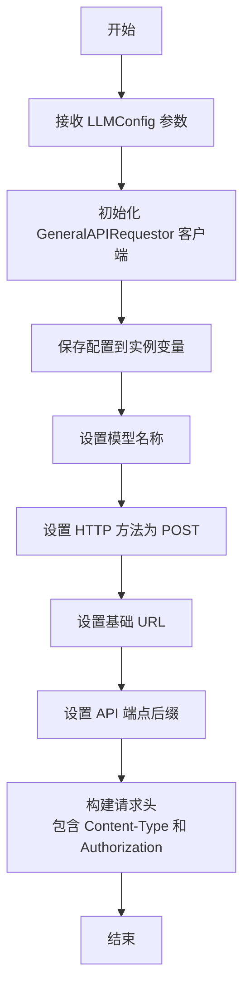
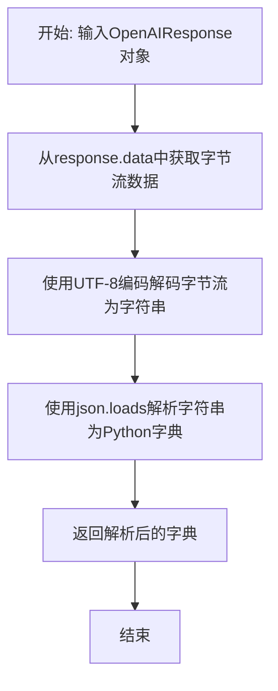
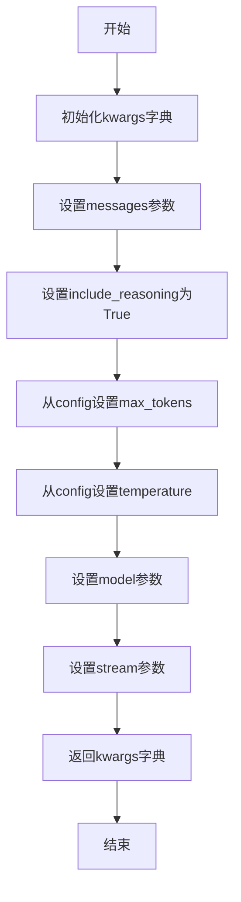
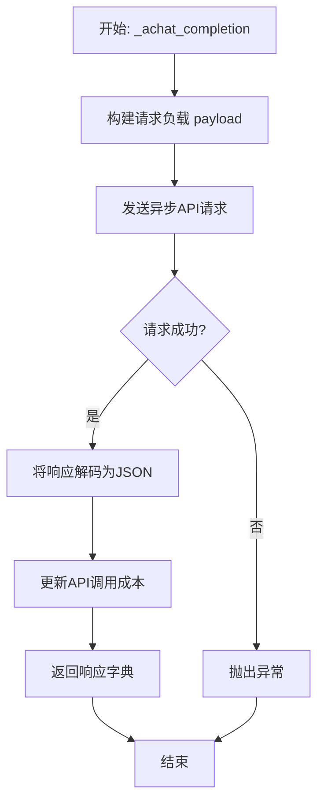
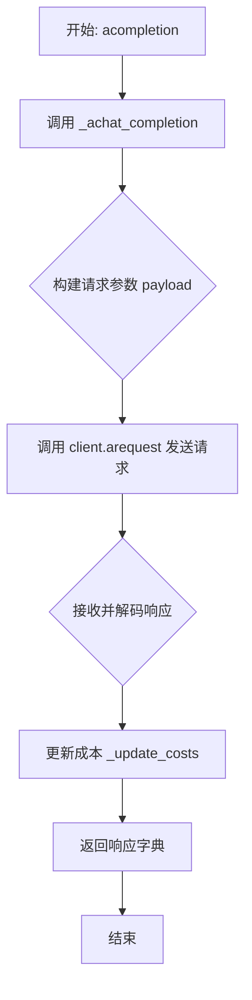
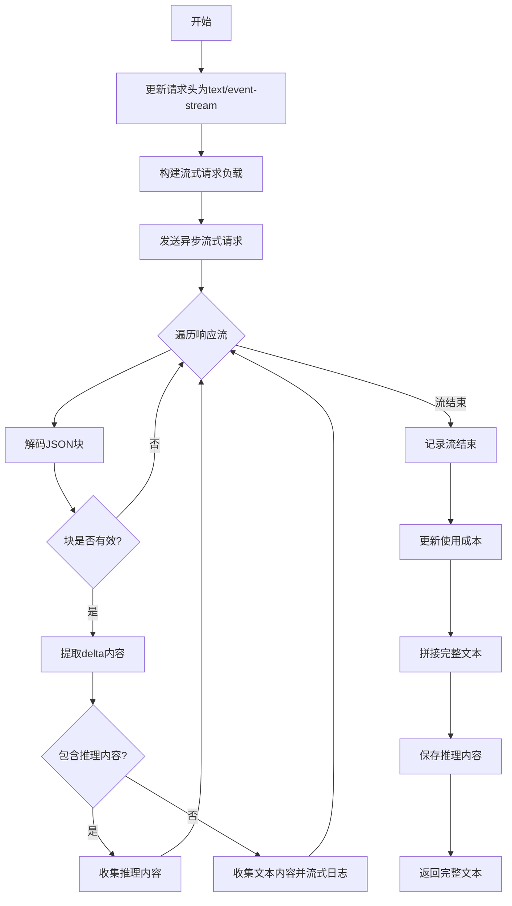

# `.\MetaGPT\metagpt\provider\openrouter_reasoning.py` 详细设计文档

该代码实现了一个名为 OpenrouterReasoningLLM 的类，它是 MetaGPT 框架中 BaseLLM 的一个具体实现，专门用于与 OpenRouter AI 的推理模型 API 进行交互。其核心功能是封装了对 OpenRouter 推理模型的异步调用，支持流式和非流式响应，并能从响应中提取模型的推理过程和最终答案。

## 整体流程

```mermaid
graph TD
    A[用户调用 acompletion 或 _achat_completion_stream] --> B{是否为流式调用?}
    B -- 否 --> C[_achat_completion]
    C --> D[构建请求参数 (_const_kwargs)]
    D --> E[通过 GeneralAPIRequestor 发送异步 POST 请求]
    E --> F[解码响应 (decode)]
    F --> G[更新使用成本 (_update_costs)]
    G --> H[返回完整的响应字典]
    B -- 是 --> I[_achat_completion_stream]
    I --> J[构建流式请求参数 (_const_kwargs)]
    J --> K[通过 GeneralAPIRequestor 发送异步流式 POST 请求]
    K --> L[迭代处理流式响应块]
    L --> M{响应块包含推理内容?}
    M -- 是 --> N[收集到 reasoning_content]
    M -- 否 --> O[收集到 content 并流式打印]
    N --> P[继续迭代]
    O --> P
    P --> Q[流结束，更新使用成本]
    Q --> R[拼接并返回最终内容]
```

## 类结构

```
BaseLLM (抽象基类)
└── OpenrouterReasoningLLM (OpenRouter 推理模型实现类)
```

## 全局变量及字段


### `OpenrouterReasoningLLM.client`
    
用于向OpenRouter API发送HTTP请求的通用请求客户端。

类型：`GeneralAPIRequestor`
    


### `OpenrouterReasoningLLM.config`
    
包含LLM配置信息的对象，如API密钥、模型名称、超时设置等。

类型：`LLMConfig`
    


### `OpenrouterReasoningLLM.model`
    
指定要使用的OpenRouter推理模型名称。

类型：`str`
    


### `OpenrouterReasoningLLM.http_method`
    
用于API请求的HTTP方法，固定为'post'。

类型：`str`
    


### `OpenrouterReasoningLLM.base_url`
    
OpenRouter API的基础URL端点。

类型：`str`
    


### `OpenrouterReasoningLLM.url_suffix`
    
附加到基础URL的路径后缀，用于指定聊天补全端点。

类型：`str`
    


### `OpenrouterReasoningLLM.headers`
    
包含认证和内容类型的HTTP请求头字典。

类型：`dict[str, str]`
    


### `OpenrouterReasoningLLM.reasoning_content`
    
存储从模型响应中提取的推理过程内容。

类型：`str`
    
    

## 全局函数及方法

### `OpenrouterReasoningLLM.__init__`

初始化 `OpenrouterReasoningLLM` 类的实例，设置与 OpenRouter Reasoning API 交互所需的基础配置，包括客户端、模型信息、HTTP 方法和请求头等。

参数：

- `config`：`LLMConfig`，包含大语言模型（LLM）的配置信息，如 API 密钥、基础 URL、模型名称等。

返回值：`None`，此方法为构造函数，不返回任何值。

#### 流程图



#### 带注释源码

```python
def __init__(self, config: LLMConfig):
    # 使用配置中的基础 URL 初始化通用 API 请求客户端
    self.client = GeneralAPIRequestor(base_url=config.base_url)
    # 保存传入的配置对象，以便后续使用
    self.config = config
    # 从配置中提取并保存模型名称
    self.model = self.config.model
    # 设置 HTTP 请求方法为 POST
    self.http_method = "post"
    # 设置 OpenRouter API 的基础 URL
    self.base_url = "https://openrouter.ai/api/v1"
    # 设置聊天补全 API 的端点后缀
    self.url_suffix = "/chat/completions"
    # 构建请求头，包含 JSON 内容类型和 Bearer Token 认证
    self.headers = {"Content-Type": "application/json", "Authorization": f"Bearer {self.config.api_key}"}
```


### `OpenrouterReasoningLLM.decode`

该方法用于解码来自OpenRouter API的原始响应。它接收一个`OpenAIResponse`对象，该对象内部包含原始的字节流数据，并将其解码为UTF-8字符串，然后解析为Python字典（通常是JSON格式），以便后续处理。

参数：

-  `response`：`OpenAIResponse`，来自OpenRouter API的原始响应对象，其`data`属性包含待解码的字节流。

返回值：`dict`，解码并解析后的响应数据，通常是一个包含`choices`、`usage`等键的字典。

#### 流程图



#### 带注释源码

```python
def decode(self, response: OpenAIResponse) -> dict:
    # 1. 从response对象中获取原始字节流数据（response.data）
    # 2. 使用UTF-8编码将字节流解码为字符串
    # 3. 使用json.loads将JSON格式的字符串解析为Python字典
    # 4. 返回该字典，供调用者（如get_choice_text方法）提取所需信息
    return json.loads(response.data.decode("utf-8"))
```


### `OpenrouterReasoningLLM._const_kwargs`

该方法用于构建调用OpenRouter推理模型API所需的参数字典。它整合了类配置中的模型参数（如最大token数、温度）和传入的对话消息，并强制启用推理功能（`include_reasoning: True`）。

参数：

- `messages`：`list[dict]`，包含对话历史和当前请求的消息列表。
- `stream`：`bool`，默认为`False`，指示是否启用流式响应。
- `timeout`：`int`，默认为`USE_CONFIG_TIMEOUT`，请求超时时间。
- `**extra_kwargs`：`dict`，额外的关键字参数（在本方法中未使用）。

返回值：`dict`，返回一个包含API调用所需所有参数的字典。

#### 流程图



#### 带注释源码

```python
def _const_kwargs(
    self, messages: list[dict], stream: bool = False, timeout=USE_CONFIG_TIMEOUT, **extra_kwargs
) -> dict:
    # 构建参数字典，用于OpenRouter API调用
    kwargs = {
        "messages": messages,  # 对话消息列表
        "include_reasoning": True,  # 强制启用推理输出
        "max_tokens": self.config.max_token,  # 从配置获取最大token数
        "temperature": self.config.temperature,  # 从配置获取温度参数
        "model": self.model,  # 使用的模型名称
        "stream": stream,  # 是否启用流式响应
    }
    return kwargs  # 返回构建好的参数字典
```


### `OpenrouterReasoningLLM.get_choice_text`

该方法用于从OpenRouter推理模型返回的响应字典中，提取出模型生成的最终文本内容（`content`）。如果响应中包含推理过程（`reasoning`），该方法还会将其保存到实例的 `reasoning_content` 属性中，以便后续使用。

参数：

-  `rsp`：`dict`，OpenRouter API返回的响应字典，通常包含 `choices` 等字段。

返回值：`str`，模型生成的最终文本内容（`content`）。

#### 流程图

```mermaid
flowchart TD
    A[开始: get_choice_text(rsp)] --> B{响应字典中\n是否存在 reasoning?};
    B -- 是 --> C[将 reasoning 内容保存到\nself.reasoning_content];
    B -- 否 --> D[跳过保存 reasoning];
    C --> E;
    D --> E;
    E[返回 choices[0].message.content] --> F[结束];
```

#### 带注释源码

```python
def get_choice_text(self, rsp: dict) -> str:
    # 检查响应中第一个选择的消息里是否包含 'reasoning' 字段
    if "reasoning" in rsp["choices"][0]["message"]:
        # 如果包含，则将推理内容保存到实例变量 self.reasoning_content 中
        self.reasoning_content = rsp["choices"][0]["message"]["reasoning"]
    # 返回模型生成的主要文本内容 (content)
    return rsp["choices"][0]["message"]["content"]
```


### `OpenrouterReasoningLLM._achat_completion`

该方法是一个异步方法，用于向OpenRouter推理模型的API端点发起一次非流式的聊天补全请求。它负责构建请求负载、发送HTTP请求、处理响应、更新使用成本，并返回API的原始响应字典。

参数：

-  `messages`：`list[dict]`，包含对话历史和当前请求消息的列表，每个元素是一个字典，通常包含`role`和`content`键。
-  `timeout`：`int`，请求的超时时间（秒）。默认值为`USE_CONFIG_TIMEOUT`。

返回值：`dict`，OpenRouter API返回的原始响应字典，通常包含`id`, `choices`, `usage`等字段。

#### 流程图



#### 带注释源码

```python
async def _achat_completion(self, messages: list[dict], timeout: int = USE_CONFIG_TIMEOUT) -> dict:
    # 1. 调用_const_kwargs方法，根据传入的messages和其他默认配置（如max_tokens, temperature）构建请求体payload。
    payload = self._const_kwargs(messages)
    # 2. 使用配置好的client（GeneralAPIRequestor实例）发起异步HTTP POST请求。
    #    - url: 使用类属性self.url_suffix（即"/chat/completions"）。
    #    - method: 使用类属性self.http_method（即"post"）。
    #    - params: 传入构建好的payload。
    #    - headers: 传入包含认证信息的类属性self.headers。
    #    该方法返回一个三元组(resp, _, _)，这里只关心第一个元素resp（响应对象）。
    resp, _, _ = await self.client.arequest(
        url=self.url_suffix, method=self.http_method, params=payload, headers=self.headers  # empty
    )
    # 3. 将响应对象resp解码为JSON格式的字典。decode_asjson()是GeneralAPIRequestor响应对象的方法。
    resp = resp.decode_asjson()
    # 4. 从响应字典中提取`usage`字段（包含token使用量），并调用`_update_costs`方法更新内部成本统计。
    self._update_costs(resp["usage"], model=self.model)
    # 5. 返回完整的API响应字典给调用者。
    return resp
```


### `OpenrouterReasoningLLM.acompletion`

该方法是一个异步方法，用于向OpenRouter推理模型的API端点发起一次非流式（即标准）的聊天补全请求。它封装了请求的构建、发送、响应处理和成本计算等逻辑，是调用OpenRouter推理模型的核心接口。

参数：

-  `messages`：`list[dict]`，一个字典列表，表示对话的历史消息。每个字典通常包含`role`（如"user", "assistant", "system"）和`content`（消息内容）等键。
-  `timeout`：`int`，请求的超时时间（秒）。默认值为`USE_CONFIG_TIMEOUT`，表示使用配置中定义的超时时间。

返回值：`dict`，返回一个字典，包含了OpenRouter API的完整响应。该字典通常包含`id`, `choices`, `usage`等字段，其中`choices[0].message.content`是模型生成的主要回复文本，`choices[0].message.reasoning`（如果存在）是模型的推理过程。

#### 流程图



#### 带注释源码

```python
async def acompletion(self, messages: list[dict], timeout=USE_CONFIG_TIMEOUT) -> dict:
    # 调用内部的异步聊天补全方法 `_achat_completion`。
    # 将 `messages` 参数直接传递下去。
    # 通过 `self.get_timeout(timeout)` 方法处理超时参数，可能将配置值或传入值转换为最终的超时时间。
    return await self._achat_completion(messages, timeout=self.get_timeout(timeout))
```


### `OpenrouterReasoningLLM._achat_completion_stream`

该方法用于与OpenRouter推理模型的API进行异步流式聊天补全交互。它发送一个包含消息列表的请求，并以流式方式接收响应，实时处理并收集模型生成的内容和推理过程，最后返回完整的生成文本。

参数：

- `messages`：`list[dict]`，包含对话历史的消息列表，每个消息是一个字典，通常包含"role"和"content"键。
- `timeout`：`int`，请求的超时时间，默认为`USE_CONFIG_TIMEOUT`。

返回值：`str`，模型生成的完整文本内容。

#### 流程图



#### 带注释源码

```python
async def _achat_completion_stream(self, messages: list[dict], timeout: int = USE_CONFIG_TIMEOUT) -> str:
    # 更新请求头以适应流式响应
    self.headers["Content-Type"] = "text/event-stream"
    # 构建包含流式标志的请求参数
    payload = self._const_kwargs(messages, stream=True)
    # 发送异步流式HTTP请求
    resp, _, _ = await self.client.arequest(
        url=self.url_suffix, method=self.http_method, params=payload, headers=self.headers, stream=True  # empty
    )
    # 初始化收集容器
    collected_content = []
    collected_reasoning_content = []
    usage = {}
    # 异步迭代响应流中的每个数据块
    async for chunk in resp:
        # 将数据块解码为JSON
        chunk = chunk.decode_asjson()
        if not chunk:
            continue
        # 提取模型输出的增量部分
        delta = chunk["choices"][0]["delta"]
        # 检查增量中是否包含推理内容
        if "reasoning" in delta and delta["reasoning"]:
            collected_reasoning_content.append(delta["reasoning"])
        elif delta["content"]:
            # 收集文本内容并实时打印日志
            collected_content.append(delta["content"])
            log_llm_stream(delta["content"])
        # 记录API使用情况（如token计数）
        usage = chunk.get("usage")
    # 流式日志结束标记
    log_llm_stream("\n")
    # 根据使用情况更新成本
    self._update_costs(usage, model=self.model)
    # 拼接所有收集到的文本内容
    full_content = "".join(collected_content)
    # 如果收集到推理内容，保存到实例变量
    if collected_reasoning_content:
        self.reasoning_content = "".join(collected_reasoning_content)
    # 返回完整的生成文本
    return full_content
```

## 关键组件


### OpenrouterReasoningLLM 类

这是用于与 OpenRouter Reasoning API 进行交互的核心 LLM 提供者类，继承自 `BaseLLM`，专门处理支持推理（reasoning）功能的模型调用。

### 推理内容处理

代码通过 `include_reasoning: True` 参数请求模型输出推理过程，并在 `get_choice_text` 和 `_achat_completion_stream` 方法中分别处理非流式和流式响应，将推理内容（`reasoning`）与最终回复内容（`content`）分离存储。

### 流式响应处理

`_achat_completion_stream` 方法实现了对服务器发送的 Server-Sent Events (SSE) 流式响应的处理，能够实时接收并拼接模型生成的内容块和推理内容块，同时通过 `log_llm_stream` 函数进行流式日志输出。

### 通用 API 请求器 (GeneralAPIRequestor)

代码通过 `self.client = GeneralAPIRequestor(...)` 使用一个通用的 API 请求客户端来处理 HTTP 通信，这提供了与不同 LLM API 端点交互的统一抽象层。

### 提供者注册机制

通过 `@register_provider([LLMType.OPENROUTER_REASONING])` 装饰器，该类被注册到 LLM 提供者注册表中，使得系统能够根据配置动态选择和使用该提供者。


## 问题及建议


### 已知问题

-   **流式响应处理逻辑不健壮**：`_achat_completion_stream` 方法中，假设响应块 (`chunk`) 的 `choices[0].delta` 字典中 `"reasoning"` 和 `"content"` 字段是互斥的（使用 `if...elif` 判断）。如果 API 响应中同时包含这两个字段，`"content"` 字段可能会被忽略，导致最终生成的内容不完整。
-   **硬编码的 URL 和 Header**：`base_url` 和 `headers` 在 `__init__` 方法中被部分硬编码（例如 `self.base_url = "https://openrouter.ai/api/v1"` 和 `self.headers["Content-Type"] = "application/json"`），这降低了代码的灵活性，使得适配不同配置或未来 API 变更时可能需要修改源码。
-   **潜在的属性未定义错误**：`get_choice_text` 和 `_achat_completion_stream` 方法中直接给 `self.reasoning_content` 赋值，但该类并未在 `__init__` 或其他地方显式声明此属性。虽然 Python 允许动态添加属性，但这可能导致在读取该属性前未赋值时引发 `AttributeError`，降低了代码的可读性和健壮性。
-   **错误处理缺失**：代码中缺乏对网络请求失败、API 返回错误状态码、响应数据结构异常（如缺少预期的 `choices` 或 `usage` 字段）等情况的显式错误处理。这可能导致程序在异常情况下崩溃或产生难以调试的问题。
-   **流式响应 Header 设置副作用**：在 `_achat_completion_stream` 方法中，直接修改了实例的 `self.headers` 字典（`self.headers["Content-Type"] = "text/event-stream"`）。这会改变对象的状态，如果同一个实例后续用于非流式请求，可能会因为 Header 不正确而导致请求失败。

### 优化建议

-   **重构流式响应处理逻辑**：修改 `_achat_completion_stream` 方法中处理 `delta` 的逻辑，分别独立地检查 `"reasoning"` 和 `"content"` 字段是否存在，而不是使用互斥的 `if...elif`。例如，可以使用两个独立的 `if` 语句。
-   **配置化 URL 和 Header**：将 `base_url` 和默认的 `headers` 内容（如 `Content-Type`）作为可配置项，优先从传入的 `LLMConfig` 配置对象中读取。如果配置中未提供，再使用合理的默认值。这提高了代码的灵活性和可维护性。
-   **显式定义实例属性**：在 `__init__` 方法中初始化 `self.reasoning_content = None`。这样能明确该属性的存在，并在方法中先检查再使用或赋值，避免潜在的 `AttributeError`。
-   **增强错误处理机制**：
    -   在 `_achat_completion` 和 `_achat_completion_stream` 方法中，使用 `try...except` 包裹网络请求和响应解码逻辑，捕获可能出现的异常（如 `aiohttp.ClientError`, `json.JSONDecodeError` 等）。
    -   检查 API 响应中是否包含错误信息（例如，检查响应字典中是否有 `"error"` 字段），并抛出更具体的异常。
    -   在访问 `rsp["choices"][0]` 等深层嵌套结构前，添加条件判断或使用 `.get()` 方法，防止 `KeyError` 或 `IndexError`。
-   **避免修改共享的 Headers**：在 `_achat_completion_stream` 方法中，不要直接修改 `self.headers`。可以创建一个新的 headers 字典副本用于当前流式请求，例如 `stream_headers = {**self.headers, "Content-Type": "text/event-stream"}`，然后将 `stream_headers` 传递给 `arequest` 方法。
-   **考虑添加类型提示**：为方法返回值（如 `_achat_completion_stream` 返回 `str`）和关键变量添加更精确的类型提示，并使用 `TypedDict` 或 `Pydantic` 模型来定义 API 请求和响应的数据结构，这能提升代码的清晰度和 IDE 支持。
-   **提取常量**：将魔法字符串如 `"reasoning"`、`"content"`、`"choices"`、`"/chat/completions"` 等提取为类常量或模块级常量，方便统一管理和修改。


## 其它


### 设计目标与约束

本模块的设计目标是提供一个与OpenRouter Reasoning API交互的LLM（大语言模型）客户端实现，作为`BaseLLM`抽象基类的具体子类。其核心约束包括：
1.  **接口兼容性**：必须实现`BaseLLM`定义的异步聊天完成接口（`acompletion`）和流式接口（`_achat_completion_stream`），以无缝集成到上层框架的LLM调用流程中。
2.  **协议适配性**：必须遵循OpenRouter Reasoning API特定的HTTP请求格式、头部要求（如`Authorization`、`Content-Type`）和请求/响应体结构（特别是包含`reasoning`字段）。
3.  **配置驱动**：所有连接参数（如API密钥、基础URL、模型名称）和生成参数（如温度、最大token数）必须从统一的`LLMConfig`配置对象中获取，确保可配置性和一致性。
4.  **成本跟踪**：必须通过`_update_costs`方法记录每次API调用的token使用情况，以支持使用量统计和成本控制。
5.  **流式处理**：必须支持以Server-Sent Events (SSE) 流的形式接收响应，并能够实时处理和拼接流中的`content`与`reasoning`内容。

### 错误处理与异常设计

模块的错误处理主要依赖于其底层组件`GeneralAPIRequestor`抛出的异常，自身未定义新的异常类型。其设计包括：
1.  **异常传递**：`_achat_completion`和`_achat_completion_stream`方法中，`GeneralAPIRequestor.arequest`调用可能抛出的网络异常（如连接超时、HTTP错误）或API错误（如认证失败、额度不足）会直接向上层传播，由调用者捕获和处理。
2.  **响应解码容错**：`decode`方法使用`json.loads`解析响应体，若响应体不是有效的JSON格式，将抛出`json.JSONDecodeError`。`_achat_completion`方法中的`resp.decode_asjson()`调用也可能包含类似的解码逻辑。
3.  **数据缺失处理**：
    *   `get_choice_text`方法在访问`rsp["choices"][0]["message"]`字典时，假设该结构存在。若API响应格式意外变更或为空，可能引发`KeyError`或`IndexError`。
    *   流式处理循环中，代码假设`chunk["choices"][0]["delta"]`存在，并检查`"reasoning"`和`"content"`键。这种防御性检查避免了因字段缺失导致的崩溃，但未对更根本的结构错误进行处理。
4.  **资源清理**：代码中未显式处理网络连接或流资源的关闭。这依赖于`GeneralAPIRequestor`和底层HTTP客户端库的正确实现。

### 数据流与状态机

模块的核心数据流围绕HTTP请求-响应展开，涉及以下状态转换和数据传递：
1.  **初始化状态**：`__init__`方法根据`LLMConfig`设置`client`、`headers`、`model`等实例属性，完成客户端准备。
2.  **请求构建**：
    *   `_const_kwargs`方法将输入的消息列表(`messages`)和配置参数组合成符合OpenRouter API规范的请求载荷(`payload`)。
    *   对于流式请求，会设置`stream=True`并更新`headers["Content-Type"]`为`"text/event-stream"`。
3.  **请求执行与响应接收**：
    *   **非流式**：`_achat_completion`调用`client.arequest`发送请求，同步等待并接收完整的JSON响应。响应通过`decode_asjson()`（内部可能调用`decode`）转换为字典。
    *   **流式**：`_achat_completion_stream`调用`client.arequest`并设置`stream=True`，获取一个异步响应流。随后进入异步迭代循环，逐块(`chunk`)接收、解码和处理SSE事件。
4.  **响应处理与状态更新**：
    *   **内容提取**：从响应字典中提取最终的`content`文本（`get_choice_text`）或从流中拼接`content`与`reasoning`文本。
    *   **成本更新**：从响应或流结束时的`usage`字段中获取token计数，调用`_update_costs`更新内部成本统计状态（该状态可能位于父类`BaseLLM`中）。
    *   **推理内容存储**：如果响应中包含`reasoning`内容，则将其存储在实例属性`self.reasoning_content`中，供后续可能的查询或记录使用。
5.  **输出**：最终将处理好的`content`字符串返回给调用者。

### 外部依赖与接口契约

模块严重依赖外部组件和服务，其接口契约如下：
1.  **OpenRouter Reasoning API (外部服务)**：
    *   **接口**：RESTful API端点 (`POST https://openrouter.ai/api/v1/chat/completions`)。
    *   **契约**：期望接收特定JSON格式的请求体（包含`messages`、`model`、`include_reasoning`等字段），并返回特定JSON格式的响应（包含`choices`、`usage`等字段，且`choices[0].message`可能包含`reasoning`和`content`）。对于流式请求，返回遵循SSE格式的数据流。
2.  **`GeneralAPIRequestor` (内部依赖组件)**：
    *   **接口**：提供`arequest`异步方法，用于发送HTTP请求。
    *   **契约**：期望接收`url`、`method`、`params`、`headers`、`stream`等参数，并返回一个三元组`(response, _, _)`，其中`response`对象需具有`decode_asjson()`方法（对于流式响应，该对象应为可异步迭代的）。
3.  **`BaseLLM` 抽象基类 (父类/框架契约)**：
    *   **接口**：定义了`acompletion`、`_achat_completion_stream`、`_update_costs`、`get_choice_text`等方法。
    *   **契约**：本类作为具体实现，必须遵守这些方法的签名和预期行为，确保能被框架的LLM调用机制正确使用。
4.  **`LLMConfig` 配置类 (数据契约)**：
    *   **接口**：作为`__init__`方法的参数。
    *   **契约**：必须提供`api_key`、`base_url`、`model`、`max_token`、`temperature`等属性，以配置本客户端。
5.  **`register_provider` 装饰器 (框架注册契约)**：
    *   **接口**：用于注册LLM提供者。
    *   **契约**：本类通过该装饰器与`LLMType.OPENROUTER_REASONING`关联，告知框架存在此类型的LLM实现。

    