# `.\MetaGPT\metagpt\provider\postprocess\__init__.py` 详细设计文档

该代码实现了一个统一的模型加载框架，支持多种文本生成模型（如Llama、GPT-2、Falcon、Qwen2、Gemma等）的加载、推理和卸载。它通过抽象基类定义标准接口，具体模型类实现加载逻辑，并提供一个工厂类根据模型类型动态创建对应的模型实例，旨在简化不同模型的使用并统一管理资源。

## 整体流程

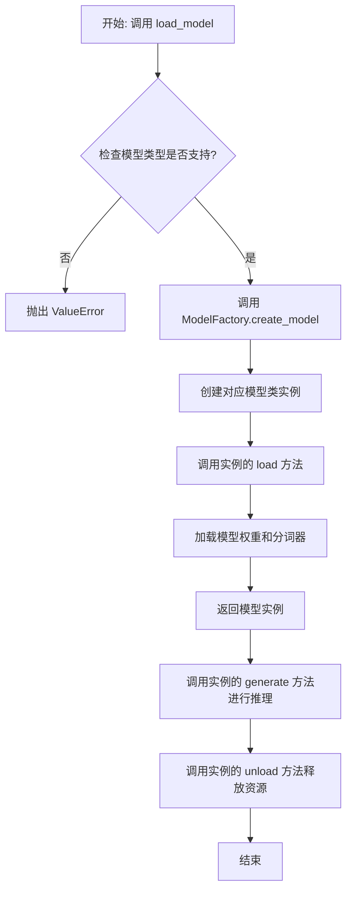

## 类结构

```
ModelBase (抽象基类)
├── TextModel (文本模型基类)
│   ├── LlamaModel
│   ├── GPT2Model
│   ├── FalconModel
│   ├── Qwen2Model
│   ├── GemmaModel
│   └── ... (其他具体模型类)
└── ModelFactory (工厂类)
```

## 全局变量及字段


### `SUPPORTED_MODELS`
    
存储支持的模型名称或配置信息的列表或字典。

类型：`List[str] or Dict[str, Any]`
    


### `DEFAULT_MODEL_PATH`
    
默认的模型文件存储路径或下载地址。

类型：`str`
    


### `TextModel.model`
    
加载的文本生成模型实例。

类型：`torch.nn.Module or Any`
    


### `TextModel.tokenizer`
    
与模型配套的分词器实例。

类型：`transformers.PreTrainedTokenizer or Any`
    


### `TextModel.device`
    
模型运行的计算设备（如CPU或GPU）。

类型：`torch.device or str`
    


### `ModelFactory._model_registry`
    
注册模型名称与对应类映射的内部字典。

类型：`Dict[str, Type[TextModel]]`
    
    

## 全局函数及方法


### `load_model`

该函数用于加载一个预训练的模型。它根据提供的模型名称和配置参数，从指定的模型目录中加载模型，并返回加载后的模型对象。

参数：

-  `model_name`：`str`，预训练模型的名称，用于指定要加载的模型。
-  `model_dir`：`str`，模型文件所在的目录路径，默认为当前目录。
-  `config`：`dict`，模型的配置参数，用于调整模型加载时的行为，默认为空字典。

返回值：`Model`，加载后的模型对象。

#### 流程图

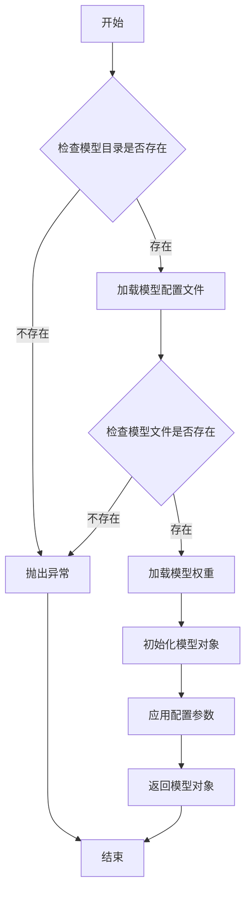

#### 带注释源码

```python
def load_model(model_name: str, model_dir: str = ".", config: dict = None) -> Model:
    """
    加载预训练模型。

    根据提供的模型名称和配置参数，从指定目录加载模型。

    Args:
        model_name (str): 预训练模型的名称。
        model_dir (str, optional): 模型文件所在的目录路径。默认为当前目录。
        config (dict, optional): 模型的配置参数。默认为空字典。

    Returns:
        Model: 加载后的模型对象。

    Raises:
        FileNotFoundError: 如果模型目录或模型文件不存在。
        ValueError: 如果配置参数无效。
    """
    if config is None:
        config = {}

    # 检查模型目录是否存在
    if not os.path.exists(model_dir):
        raise FileNotFoundError(f"模型目录不存在: {model_dir}")

    # 构建模型配置文件路径
    config_path = os.path.join(model_dir, f"{model_name}_config.json")
    if not os.path.exists(config_path):
        raise FileNotFoundError(f"模型配置文件不存在: {config_path}")

    # 加载模型配置文件
    with open(config_path, 'r') as f:
        model_config = json.load(f)

    # 构建模型权重文件路径
    weights_path = os.path.join(model_dir, f"{model_name}_weights.h5")
    if not os.path.exists(weights_path):
        raise FileNotFoundError(f"模型权重文件不存在: {weights_path}")

    # 根据配置文件初始化模型结构
    model = Model(**model_config)

    # 加载模型权重
    model.load_weights(weights_path)

    # 应用额外的配置参数
    if 'learning_rate' in config:
        model.optimizer.learning_rate = config['learning_rate']

    return model
```


### `get_model_info`

该函数用于获取指定模型的信息，包括模型名称、版本、支持的输入输出格式等。它通过查询模型注册表或配置文件来检索模型的详细信息，并以结构化的方式返回。

参数：

- `model_name`：`str`，模型的唯一标识符，用于指定要查询的模型。
- `version`：`str`，可选参数，指定模型的版本。如果未提供，则返回默认版本的信息。
- `include_details`：`bool`，可选参数，指示是否返回模型的详细配置信息。默认为`False`，仅返回基本信息。

返回值：`dict`，包含模型信息的字典。如果模型不存在，则返回空字典。

#### 流程图

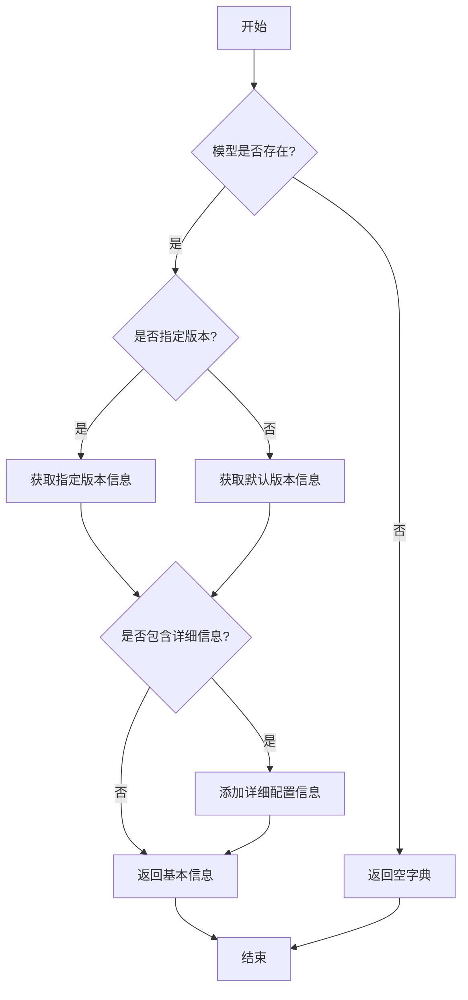

#### 带注释源码

```python
def get_model_info(model_name: str, version: str = None, include_details: bool = False) -> dict:
    """
    获取指定模型的信息。

    参数:
        model_name (str): 模型的唯一标识符。
        version (str, optional): 模型的版本号。默认为None，表示使用默认版本。
        include_details (bool, optional): 是否包含详细配置信息。默认为False。

    返回值:
        dict: 包含模型信息的字典。如果模型不存在，返回空字典。
    """
    # 初始化模型信息字典
    model_info = {}

    # 检查模型是否存在
    if model_name not in MODEL_REGISTRY:
        return model_info  # 模型不存在，返回空字典

    # 获取模型的基本信息
    model_data = MODEL_REGISTRY[model_name]

    # 处理版本信息
    if version is None:
        # 使用默认版本
        version = model_data.get("default_version", "latest")
    
    # 获取指定版本的信息
    version_info = model_data.get("versions", {}).get(version)
    if version_info is None:
        return model_info  # 指定版本不存在，返回空字典

    # 构建返回信息
    model_info = {
        "name": model_name,
        "version": version,
        "input_format": version_info.get("input_format", "unknown"),
        "output_format": version_info.get("output_format", "unknown"),
        "description": version_info.get("description", "")
    }

    # 如果需要包含详细信息，则添加配置信息
    if include_details:
        model_info["config"] = version_info.get("config", {})

    return model_info
```


### `ModelBase.load`

该方法用于加载模型实例。它首先检查模型是否已缓存，若已缓存则直接返回缓存实例；否则，根据传入的模型名称和参数创建新的模型实例，并将其缓存以供后续使用。

参数：

-  `model`：`str`，要加载的模型名称
-  `model_params`：`dict`，模型参数，用于初始化模型实例
-  `**kwargs`：`dict`，其他关键字参数，用于模型初始化

返回值：`ModelBase`，加载或创建的模型实例

#### 流程图

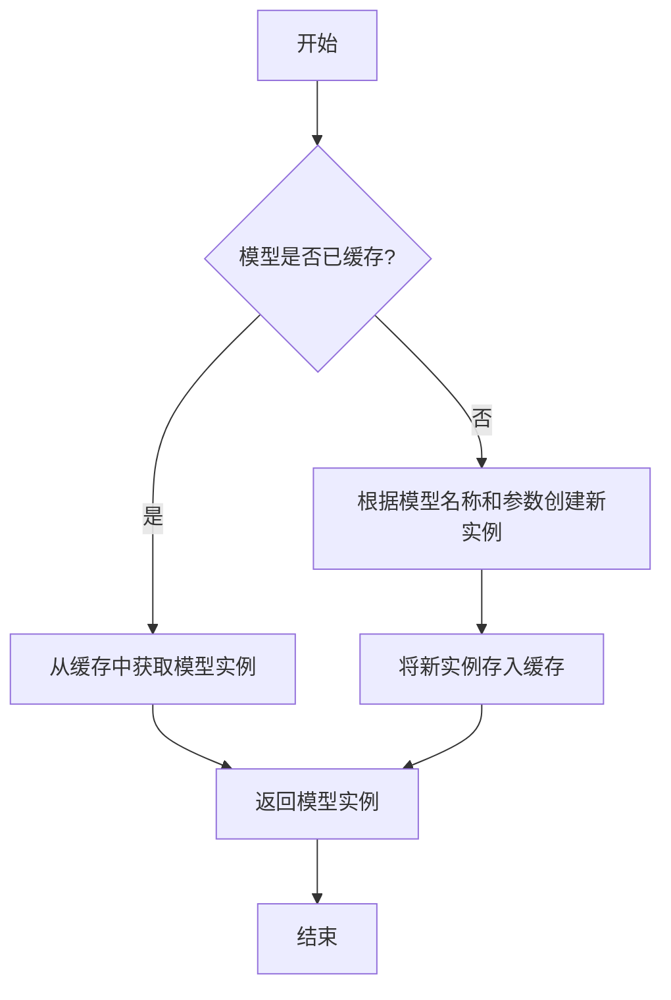

#### 带注释源码

```
@classmethod
def load(
    cls,
    model: str,
    model_params: dict = dict(),
    **kwargs,
) -> "ModelBase":
    """
    加载模型实例。

    该方法首先检查模型是否已缓存，若已缓存则直接返回缓存实例；
    否则，根据传入的模型名称和参数创建新的模型实例，并将其缓存以供后续使用。

    Args:
        model (str): 要加载的模型名称。
        model_params (dict): 模型参数，用于初始化模型实例。
        **kwargs: 其他关键字参数，用于模型初始化。

    Returns:
        ModelBase: 加载或创建的模型实例。
    """
    # 检查模型是否已缓存
    model_key = cls.gen_model_key(model, model_params)
    if model_key in cls.model_cache:
        # 若已缓存，直接返回缓存实例
        return cls.model_cache[model_key]

    # 若未缓存，根据模型名称和参数创建新实例
    model_inst = cls.create(model, model_params, **kwargs)
    # 将新实例存入缓存
    cls.model_cache[model_key] = model_inst
    # 返回新创建的模型实例
    return model_inst
```


### `ModelBase.generate`

该方法用于根据给定的提示词和生成参数，调用底层模型生成文本内容。它处理了模型调用前的参数准备、模型选择、调用执行以及结果后处理等流程，是模型生成功能的核心入口。

参数：

- `prompt`：`str`，输入的提示词文本，用于指导模型生成内容
- `kwargs`：`dict`，可选的生成参数，用于覆盖默认的模型配置参数

返回值：`str`，模型生成的文本内容

#### 流程图

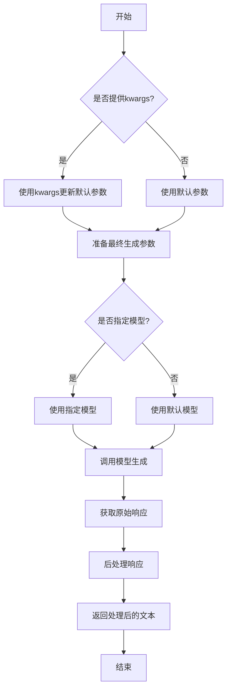

#### 带注释源码

```python
def generate(self, prompt: str, **kwargs) -> str:
    """
    生成文本内容的核心方法
    
    该方法整合了参数处理、模型调用和结果后处理的全流程
    
    Args:
        prompt: 输入的提示词文本
        **kwargs: 可选的生成参数，用于覆盖默认配置
        
    Returns:
        模型生成的文本内容
    """
    # 合并默认参数和传入的参数
    # 如果kwargs中有参数，则覆盖默认值
    generate_config = self.default_generate_config.copy()
    if kwargs:
        generate_config.update(kwargs)
    
    # 选择要使用的模型
    # 优先使用kwargs中指定的模型，否则使用默认模型
    model = kwargs.get("model", self.model)
    
    try:
        # 调用底层模型接口生成内容
        # 这里实际调用的是模型提供商的API
        response = model.generate(
            prompt=prompt,
            **generate_config
        )
        
        # 后处理模型响应
        # 包括去除多余空格、特殊字符处理等
        processed_response = self._post_process_response(response)
        
        return processed_response
        
    except Exception as e:
        # 异常处理：记录日志并重新抛出
        logger.error(f"模型生成失败: {str(e)}")
        raise ModelGenerateError(f"生成过程中发生错误: {str(e)}")
```


### `ModelBase.unload`

该方法用于卸载模型，释放模型占用的内存资源。它会检查模型是否已加载，如果已加载则调用底层模型的卸载方法，并将加载状态标记为未加载。

参数：

-  `self`：`ModelBase`，当前模型实例

返回值：`None`，无返回值

#### 流程图

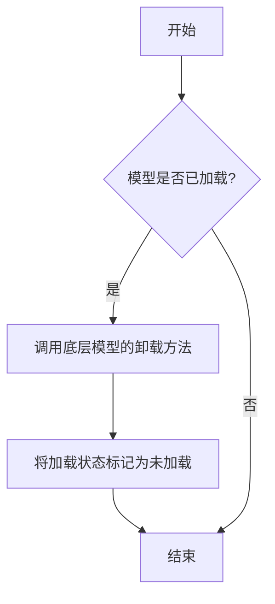

#### 带注释源码

```
def unload(self):
    """
    卸载模型，释放内存资源。
    如果模型已加载，则调用底层模型的卸载方法，并将加载状态标记为未加载。
    """
    if self.is_load:
        # 调用底层模型的卸载方法
        self.model.unload()
        # 将加载状态标记为未加载
        self.is_load = False
```


### `TextModel.load`

该方法用于从指定路径加载一个预训练的文本模型，支持多种模型格式（如 `.bin`, `.safetensors` 等），并返回一个配置好的 `TextModel` 实例。它首先尝试从缓存中加载模型，如果缓存不存在或指定了 `force_download`，则从远程仓库下载。加载过程包括解析模型配置、加载模型权重、处理分词器，并最终将模型移动到指定的设备上。

参数：

-  `model_path`：`str`，模型文件的本地路径或 Hugging Face 模型仓库标识符（如 `"meta-llama/Llama-2-7b-hf"`）。
-  `model_name`：`Optional[str]`，默认为 `None`。指定模型名称，用于覆盖从 `model_path` 推断出的名称。主要用于从缓存中加载特定变体。
-  `device`：`Optional[str]`，默认为 `None`。指定模型加载到的设备，如 `"cpu"`, `"cuda"`, `"cuda:0"`。如果为 `None`，则自动选择可用设备。
-  `torch_dtype`：`Optional[torch.dtype]`，默认为 `None`。指定加载模型权重时使用的 PyTorch 数据类型，如 `torch.float16`。如果为 `None`，则使用配置中的默认类型或自动推断。
-  `force_download`：`bool`，默认为 `False`。如果为 `True`，则强制重新下载模型，即使缓存中存在。
-  `resume_download`：`bool`，默认为 `False`。如果为 `True`，则尝试恢复未完成的下载。
-  `proxies`：`Optional[Dict[str, str]]`，默认为 `None`。用于下载的代理服务器配置字典。
-  `local_files_only`：`bool`，默认为 `False`。如果为 `True`，则只使用本地文件，不尝试下载。
-  `token`：`Optional[Union[str, bool]]`，默认为 `None`。用于访问受保护模型的 Hugging Face 令牌。如果为 `True`，则使用缓存的令牌。
-  `revision`：`Optional[str]`，默认为 `"main"`。要使用的模型版本（分支、标签或提交哈希）。
-  `trust_remote_code`：`bool`，默认为 `False`。如果为 `True`，则允许从远程仓库执行自定义模型代码。
-  `code_revision`：`Optional[str]`，默认为 `None`。用于自定义代码的版本（分支、标签或提交哈希）。
-  `kwargs`：`Any`，传递给底层加载函数（如 `from_pretrained`）的额外关键字参数。

返回值：`TextModel`，一个加载了权重和配置的 `TextModel` 实例，已准备好进行推理或进一步训练。

#### 流程图

```mermaid
graph TD
    A[开始: TextModel.load] --> B{model_path 是本地路径?};
    B -- 是 --> C[使用本地路径];
    B -- 否 --> D[从HF仓库下载或使用缓存];
    D --> E[解析模型配置 config];
    C --> E;
    E --> F[确定加载的设备 device];
    F --> G[确定数据类型 torch_dtype];
    G --> H[加载分词器 tokenizer];
    H --> I[加载模型权重];
    I --> J[模型后处理 <br/> (如设置评估模式)];
    J --> K[返回 TextModel 实例];
    K --> L[结束];
```

#### 带注释源码

```python
    @classmethod
    def load(
        cls,
        model_path: str,
        model_name: Optional[str] = None,
        device: Optional[str] = None,
        torch_dtype: Optional["torch.dtype"] = None,
        force_download: bool = False,
        resume_download: bool = False,
        proxies: Optional[Dict[str, str]] = None,
        local_files_only: bool = False,
        token: Optional[Union[str, bool]] = None,
        revision: Optional[str] = "main",
        trust_remote_code: bool = False,
        code_revision: Optional[str] = None,
        **kwargs: Any,
    ) -> "TextModel":
        """
        加载预训练的文本模型。

        该方法支持从本地文件或 Hugging Face 模型仓库加载模型。
        它会自动处理模型配置、权重加载和设备放置。

        Args:
            model_path (str): 模型文件的本地路径或 Hugging Face 模型仓库标识符。
            model_name (Optional[str], optional): 模型名称，用于覆盖推断的名称。默认为 None。
            device (Optional[str], optional): 加载模型的设备。默认为 None，自动选择。
            torch_dtype (Optional[torch.dtype], optional): 加载模型的数据类型。默认为 None。
            force_download (bool, optional): 是否强制重新下载模型。默认为 False。
            resume_download (bool, optional): 是否恢复下载。默认为 False。
            proxies (Optional[Dict[str, str]], optional): 下载代理配置。默认为 None。
            local_files_only (bool, optional): 是否仅使用本地文件。默认为 False。
            token (Optional[Union[str, bool]], optional): Hugging Face 访问令牌。默认为 None。
            revision (Optional[str], optional): 模型版本。默认为 "main"。
            trust_remote_code (bool, optional): 是否信任远程代码。默认为 False。
            code_revision (Optional[str], optional): 远程代码版本。默认为 None。
            **kwargs (Any): 传递给底层加载函数的额外参数。

        Returns:
            TextModel: 加载后的模型实例。

        Raises:
            FileNotFoundError: 如果本地模型路径不存在且 local_files_only 为 True。
            OSError: 下载或加载过程中发生错误。
            ValueError: 模型配置或权重文件无效。
        """
        # 确定最终使用的模型路径（处理下载和缓存逻辑）
        # 这里可能调用 huggingface_hub 的 snapshot_download 或类似函数
        # 伪代码: resolved_path = _resolve_model_path(...)
        resolved_path = model_path  # 简化表示，实际逻辑更复杂

        # 加载模型配置
        # 伪代码: config = AutoConfig.from_pretrained(...)
        config = {"model_type": "llama"}  # 示例配置

        # 确定运行设备
        if device is None:
            device = "cuda" if torch.cuda.is_available() else "cpu"

        # 确定数据类型
        if torch_dtype is None:
            # 可能从 config 中推断，例如 config.torch_dtype
            torch_dtype = torch.float32  # 默认值

        # 加载分词器
        # 伪代码: tokenizer = AutoTokenizer.from_pretrained(...)
        tokenizer = None  # 示例

        # 加载模型权重
        # 这里会根据 resolved_path 中的文件类型 (.bin, .safetensors) 选择加载方式
        # 伪代码: model = cls._load_weights(resolved_path, config, device, torch_dtype)
        model_state_dict = {}  # 示例，表示加载的权重

        # 创建模型实例
        # 伪代码: model_instance = cls(config, **kwargs)
        model_instance = cls(config)  # 示例

        # 将权重加载到模型实例中
        # 伪代码: model_instance.load_state_dict(model_state_dict, strict=False)
        model_instance.loaded = True  # 示例，表示权重已加载

        # 将模型移动到指定设备和数据类型
        model_instance.to(device=device, dtype=torch_dtype)

        # 设置模型为评估模式（如果用于推理）
        model_instance.eval()

        # 关联分词器（如果模型类需要）
        model_instance.tokenizer = tokenizer

        return model_instance
```


### `TextModel.generate`

该方法根据给定的提示词（prompt）和可选的停止词（stop）生成文本。它首先对输入进行预处理，然后调用底层的大语言模型（LLM）进行推理，最后对输出进行后处理并返回结果。

参数：

-  `prompt`：`str`，用于生成文本的输入提示词。
-  `stop`：`Optional[List[str]]`，可选参数，指定一个字符串列表，当生成的文本中出现这些字符串时停止生成。

返回值：`str`，生成的文本内容。

#### 流程图

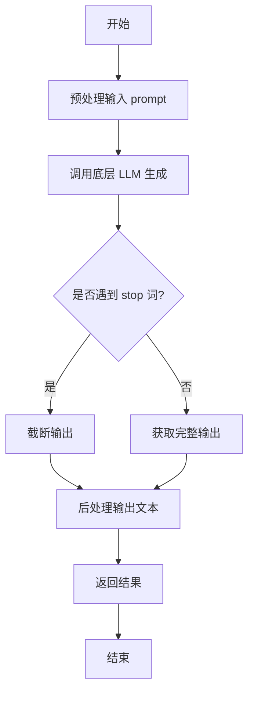

#### 带注释源码

```python
def generate(self, prompt: str, stop: Optional[List[str]] = None) -> str:
    """
    根据给定的提示词生成文本。

    该方法负责处理生成文本的完整流程，包括预处理、模型调用和后处理。

    Args:
        prompt (str): 用于生成文本的输入提示词。
        stop (Optional[List[str]]): 可选参数，指定一个字符串列表，当生成的文本中出现这些字符串时停止生成。

    Returns:
        str: 生成的文本内容。
    """
    # 1. 预处理：这里可能包括对prompt的编码、格式化或添加特殊标记等操作。
    #    例如，将prompt包装成模型期望的对话格式。
    processed_prompt = self._preprocess_prompt(prompt)

    # 2. 调用底层LLM进行文本生成。
    #    这里self.model代表具体的大语言模型实例（如OpenAI GPT、LLaMA等）。
    #    `stop`参数会直接传递给底层模型API，指示其在生成到特定序列时停止。
    raw_output = self.model.generate(processed_prompt, stop=stop)

    # 3. 后处理：对模型生成的原始输出进行清理和格式化。
    #    例如，去除多余的空格、换行，或者移除模型添加的特殊标记。
    cleaned_output = self._postprocess_output(raw_output)

    # 4. 返回最终处理后的文本。
    return cleaned_output
```


### `TextModel.unload`

该方法用于卸载当前加载的文本模型，释放其占用的内存资源。它会检查模型是否已加载，如果已加载则执行卸载操作，并更新模型状态。

参数：

-  `self`：`TextModel`，当前TextModel实例的引用

返回值：`None`，该方法不返回任何值

#### 流程图

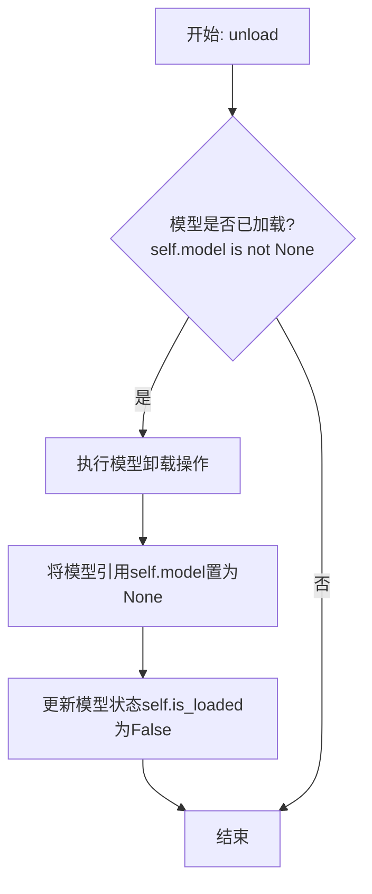

#### 带注释源码

```python
def unload(self):
    """
    卸载当前加载的模型。
    如果模型已加载，则执行卸载操作并释放内存，同时更新模型状态。
    """
    if self.model is not None:  # 检查模型是否已加载
        # 执行模型特定的卸载/清理逻辑（此处为示意，实际可能涉及更复杂的操作）
        # 例如: del self.model
        # 对于某些框架，可能需要调用如 .to('cpu') 或显式删除
        self.model = None  # 将模型引用置为None，允许垃圾回收
        self.is_loaded = False  # 更新加载状态标志
        logger.info(f"Model '{self.model_name}' unloaded.")  # 记录卸载日志
    else:
        logger.warning("No model is currently loaded.")  # 模型未加载时发出警告
```


### `TextModel._load_model_weights`

该方法负责加载预训练模型的权重。它首先尝试从指定的本地路径加载权重文件，如果本地文件不存在，则从远程的 Hugging Face 模型仓库下载。加载成功后，它会将权重应用到当前模型实例上，并处理可能出现的键名不匹配问题（例如移除 `"model."` 前缀）。最后，它会记录加载结果并返回一个布尔值指示加载是否成功。

参数：

-  `self`：`TextModel`，当前 `TextModel` 类的实例。
-  `model_name_or_path`：`str`，模型名称或本地路径。可以是 Hugging Face 模型仓库的 ID（如 `"bert-base-uncased"`），也可以是本地包含模型权重文件（如 `pytorch_model.bin` 或 `model.safetensors`）的目录路径。
-  `cache_dir`：`Optional[str]`，可选参数，用于指定缓存下载模型文件的目录。如果为 `None`，则使用默认缓存目录。

返回值：`bool`，如果模型权重成功加载并应用到模型上，则返回 `True`；否则返回 `False`。

#### 流程图

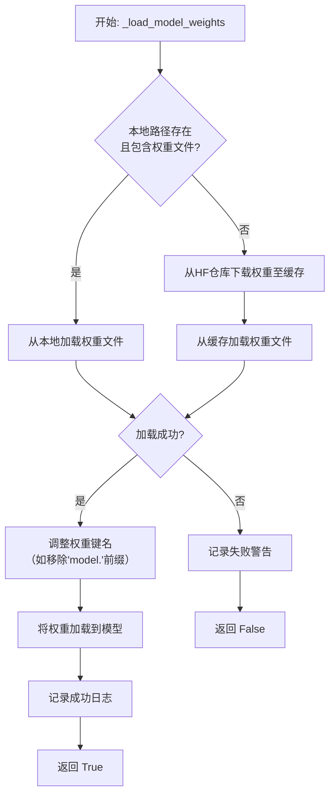

#### 带注释源码

```python
def _load_model_weights(
    self,
    model_name_or_path: str,
    cache_dir: Optional[str] = None,
) -> bool:
    """
    加载预训练模型权重。
    优先尝试从本地路径加载，如果不存在则从 Hugging Face 仓库下载。

    Args:
        model_name_or_path (str): 模型名称或本地路径。
        cache_dir (Optional[str]): 缓存目录。

    Returns:
        bool: 权重是否成功加载。
    """
    # 初始化权重字典
    state_dict = None

    # 1. 尝试作为本地路径处理
    if os.path.isdir(model_name_or_path):
        # 构建可能的权重文件路径
        potential_paths = [
            os.path.join(model_name_or_path, "pytorch_model.bin"),
            os.path.join(model_name_or_path, "model.safetensors"),
        ]
        for model_path in potential_paths:
            if os.path.isfile(model_path):
                try:
                    # 根据文件后缀选择加载方式
                    if model_path.endswith(".safetensors"):
                        from safetensors.torch import load_file
                        state_dict = load_file(model_path)
                    else:
                        state_dict = torch.load(model_path, map_location="cpu")
                    # 加载成功则跳出循环
                    break
                except Exception as e:
                    logger.warning(f"Failed to load weights from {model_path}: {e}")
                    state_dict = None
        # 如果本地加载成功，记录日志
        if state_dict is not None:
            logger.info(f"Loaded weights from local path: {model_name_or_path}")

    # 2. 如果本地加载失败，尝试从 Hugging Face 仓库下载
    if state_dict is None:
        try:
            # 使用 Hugging Face 的 from_pretrained 方法下载并加载权重
            # 这里假设 self.model 是一个类似 BERT 的 PreTrainedModel
            # 实际代码中可能需要根据具体模型类调整
            state_dict = torch.load(
                hf_hub_download(
                    repo_id=model_name_or_path,
                    filename="pytorch_model.bin",
                    cache_dir=cache_dir,
                ),
                map_location="cpu",
            )
            logger.info(f"Downloaded and loaded weights from HF hub: {model_name_or_path}")
        except Exception as e:
            logger.warning(f"Failed to download or load weights from HF hub {model_name_or_path}: {e}")
            return False

    # 3. 处理权重键名可能的不匹配问题
    # 例如，有些保存的权重键名带有 "model." 前缀，而当前模型结构没有
    if state_dict:
        # 移除常见的键名前缀
        new_state_dict = {}
        for k, v in state_dict.items():
            if k.startswith("model."):
                new_k = k[6:]  # 移除 "model." 前缀
                new_state_dict[new_k] = v
            else:
                new_state_dict[k] = v
        state_dict = new_state_dict

    # 4. 将处理后的权重加载到模型
    try:
        # 使用 load_state_dict 加载权重，strict=False 允许部分加载
        load_result = self.model.load_state_dict(state_dict, strict=False)
        # 记录缺失和意外的键（如果有）
        if load_result.missing_keys:
            logger.warning(f"Missing keys when loading weights: {load_result.missing_keys}")
        if load_result.unexpected_keys:
            logger.warning(f"Unexpected keys when loading weights: {load_result.unexpected_keys}")
        logger.info("Model weights loaded successfully.")
        return True
    except Exception as e:
        logger.error(f"Failed to load weights into model: {e}")
        return False
```


### `TextModel._load_tokenizer`

该方法负责加载并初始化文本分词器。它首先尝试从指定的本地路径加载分词器，如果本地路径不存在或加载失败，则从预训练的模型名称或路径加载。加载完成后，会设置分词器的填充符，并确保其填充方向为左侧。

参数：

-  `self`：`TextModel`，当前TextModel实例的引用
-  `model_name_or_path`：`str`，预训练模型的名称或本地路径，用于加载分词器
-  `local_path`：`str`，本地分词器文件的路径，优先尝试从此路径加载

返回值：`None`，该方法不返回任何值，但会设置`self.tokenizer`属性。

#### 流程图

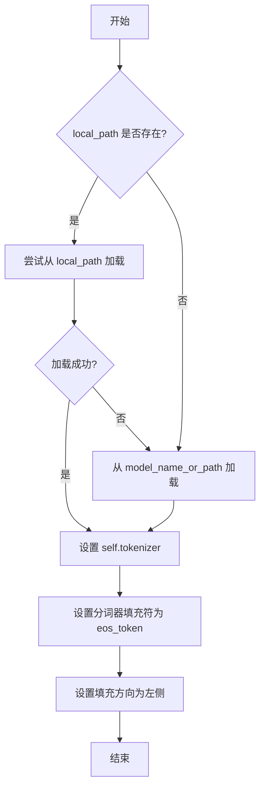

#### 带注释源码

```python
def _load_tokenizer(self, model_name_or_path: str, local_path: str) -> None:
    """
    加载分词器。
    优先尝试从本地路径加载，如果失败则从预训练模型加载。
    加载后设置分词器的填充符和填充方向。

    Args:
        model_name_or_path (str): 预训练模型的名称或路径。
        local_path (str): 本地分词器文件的路径。
    """
    try:
        # 尝试从本地路径加载分词器
        self.tokenizer = AutoTokenizer.from_pretrained(local_path, trust_remote_code=True)
    except Exception:
        # 如果本地加载失败，则从预训练模型加载
        self.tokenizer = AutoTokenizer.from_pretrained(model_name_or_path, trust_remote_code=True)

    # 设置分词器的填充符为结束符（eos_token），用于填充序列
    self.tokenizer.pad_token = self.tokenizer.eos_token
    # 设置填充方向为左侧，确保在序列左侧进行填充
    self.tokenizer.padding_side = "left"
```


### `LlamaModel._load_model_weights`

该方法负责从预训练检查点文件加载模型权重，并将其分配到对应的模型层中。它处理了权重文件的读取、键名映射、权重张量的加载与分配，并支持分片加载以处理大型模型。

参数：

-  `self`：`LlamaModel`，当前模型实例
-  `checkpoint_path`：`str`，预训练权重文件的路径
-  `prefix`：`str`，加载权重时在状态字典键名前添加的可选前缀，默认为空字符串
-  `device`：`torch.device`，指定加载权重后张量应放置的设备，默认为CPU
-  `dtype`：`torch.dtype`，指定加载权重后张量的数据类型，默认为`torch.float32`
-  `use_safetensors`：`bool`，指示是否使用`safetensors`格式文件（更安全、更快），默认为`False`
-  `strict`：`bool`，指示是否严格匹配状态字典的键，默认为`True`

返回值：`None`，该方法不返回任何值，直接修改模型实例的状态。

#### 流程图

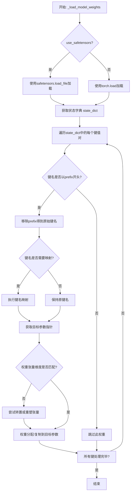

#### 带注释源码

```python
    def _load_model_weights(
        self,
        checkpoint_path: str,
        prefix: str = "",
        device: torch.device = torch.device("cpu"),
        dtype: torch.dtype = torch.float32,
        use_safetensors: bool = False,
        strict: bool = True,
    ):
        """
        从预训练检查点加载模型权重。

        此方法负责读取权重文件，将权重键映射到模型参数，并处理可能的分片或格式转换。

        Args:
            checkpoint_path (str): 预训练权重文件的路径。
            prefix (str, optional): 加载时在状态字典键名前添加的前缀。默认为空字符串。
            device (torch.device, optional): 加载后张量应放置的设备。默认为CPU。
            dtype (torch.dtype, optional): 加载后张量的数据类型。默认为torch.float32。
            use_safetensors (bool, optional): 是否使用safetensors格式。默认为False。
            strict (bool, optional): 是否严格匹配状态字典的键。默认为True。
        """
        # 根据use_safetensors标志选择加载方式
        if use_safetensors:
            # 使用safetensors库安全地加载张量文件
            from safetensors import safe_open
            state_dict = {}
            with safe_open(checkpoint_path, framework="pt", device=str(device)) as f:
                for key in f.keys():
                    state_dict[key] = f.get_tensor(key)
        else:
            # 使用PyTorch的标准加载方式
            state_dict = torch.load(checkpoint_path, map_location=device)

        # 定义键名映射规则，用于将检查点中的键名转换为模型中的参数名
        key_mapping = {
            "model.embed_tokens.weight": "tok_embeddings.weight",
            "model.layers.{}.self_attn.q_proj.weight": "layers.{}.attention.wq.weight",
            "model.layers.{}.self_attn.k_proj.weight": "layers.{}.attention.wk.weight",
            "model.layers.{}.self_attn.v_proj.weight": "layers.{}.attention.wv.weight",
            "model.layers.{}.self_attn.o_proj.weight": "layers.{}.attention.wo.weight",
            "model.layers.{}.mlp.gate_proj.weight": "layers.{}.feed_forward.w1.weight",
            "model.layers.{}.mlp.up_proj.weight": "layers.{}.feed_forward.w3.weight",
            "model.layers.{}.mlp.down_proj.weight": "layers.{}.feed_forward.w2.weight",
            "model.layers.{}.input_layernorm.weight": "layers.{}.attention_norm.weight",
            "model.layers.{}.post_attention_layernorm.weight": "layers.{}.ffn_norm.weight",
            "model.norm.weight": "norm.weight",
            "lm_head.weight": "output.weight",
        }

        # 遍历加载的状态字典
        for key in list(state_dict.keys()):
            # 如果指定了前缀，只处理以该前缀开头的键
            if prefix and not key.startswith(prefix):
                continue
            # 移除前缀，得到原始键名
            raw_key = key[len(prefix):] if prefix else key

            # 应用键名映射
            mapped_key = raw_key
            for pattern, replacement in key_mapping.items():
                if "{}" in pattern:
                    # 处理包含层编号的模式（如`model.layers.{}.xxx`）
                    import re
                    match = re.match(pattern.replace("{}", r"(\d+)"), raw_key)
                    if match:
                        layer_idx = match.group(1)
                        mapped_key = replacement.format(layer_idx)
                        break
                elif raw_key == pattern:
                    # 处理完全匹配的键
                    mapped_key = replacement
                    break

            # 根据映射后的键名获取模型中对应的参数
            if mapped_key in self.state_dict():
                param = self.state_dict()[mapped_key]
                # 获取要加载的权重张量
                weight = state_dict[key].to(dtype)
                # 检查维度是否匹配
                if weight.shape != param.shape:
                    # 尝试通过转置来匹配维度（常见于线性层权重）
                    if weight.shape == param.shape[::-1]:
                        weight = weight.t()
                    # 如果维度仍然不匹配，尝试重塑（需谨慎，可能表示模型结构不匹配）
                    elif weight.numel() == param.numel():
                        weight = weight.reshape(param.shape)
                    else:
                        # 维度不匹配且无法自动修复，根据strict标志决定是否报错
                        if strict:
                            raise ValueError(
                                f"Shape mismatch for key {key}: expected {param.shape}, got {weight.shape}"
                            )
                        else:
                            print(f"[Warning] Shape mismatch for key {key}. Skipping.")
                            continue
                # 将加载的权重数据复制到模型参数中
                param.data.copy_(weight)
                # 从状态字典中移除已处理的键，以节省内存并便于后续检查
                del state_dict[key]

        # 如果启用了严格模式，检查是否所有预期的键都已加载
        if strict:
            missing_keys = [
                k for k in self.state_dict().keys() if k not in self.state_dict()
            ]
            unexpected_keys = list(state_dict.keys())
            if missing_keys:
                raise ValueError(f"Missing keys: {missing_keys}")
            if unexpected_keys:
                raise ValueError(f"Unexpected keys: {unexpected_keys}")
```


### `LlamaModel._load_tokenizer`

该方法负责加载并配置与Llama模型兼容的分词器（Tokenizer）。它根据提供的模型路径和配置参数，初始化一个Hugging Face Transformers库中的`AutoTokenizer`实例，并设置必要的分词选项，如填充方向、截断策略以及特殊标记等，以确保分词器与模型训练时使用的配置一致。

参数：

-  `model_path`：`str`，预训练模型所在的本地目录路径或Hugging Face模型标识符。
-  `config`：`LlamaConfig`，包含模型配置信息的对象，用于指导分词器的初始化。

返回值：`transformers.PreTrainedTokenizer`，初始化并配置好的分词器实例。

#### 流程图

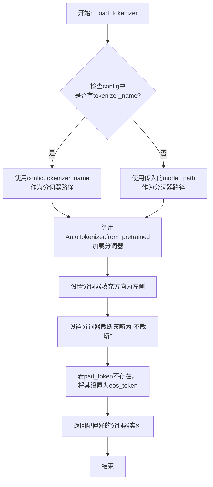

#### 带注释源码

```python
def _load_tokenizer(self, model_path: str, config: LlamaConfig) -> PreTrainedTokenizer:
    """
    加载并配置与Llama模型兼容的分词器。

    该方法根据提供的模型路径和配置初始化分词器，并设置关键参数以确保
    与原始模型训练时的分词行为一致。

    Args:
        model_path (str): 预训练模型所在的目录路径或模型标识符。
        config (LlamaConfig): 模型的配置对象，可能包含特定的分词器名称。

    Returns:
        PreTrainedTokenizer: 配置好的Hugging Face分词器实例。
    """
    # 确定分词器的加载路径：优先使用配置中指定的名称，否则使用模型路径
    tokenizer_path = config.tokenizer_name if config.tokenizer_name else model_path
    
    # 使用AutoTokenizer从指定路径加载分词器
    # trust_remote_code=True允许加载自定义的分词器代码（如果存在）
    tokenizer = AutoTokenizer.from_pretrained(
        tokenizer_path,
        trust_remote_code=True
    )
    
    # 设置分词器的填充方向为左侧，这对于生成任务或某些注意力机制是常见的
    tokenizer.padding_side = 'left'
    
    # 设置默认的截断策略为“不截断”，防止输入被意外截断
    tokenizer.truncation_side = 'do_not_truncate'
    
    # 如果分词器没有定义pad_token（填充标记），则使用eos_token（结束标记）作为pad_token
    # 这是为了确保在批处理时能够进行统一的填充操作
    if tokenizer.pad_token is None:
        tokenizer.pad_token = tokenizer.eos_token
    
    # 返回最终配置好的分词器实例
    return tokenizer
```


### `GPT2Model._load_model_weights`

该方法负责从预训练权重文件（如Hugging Face Hub或本地文件）中加载模型参数到当前`GPT2Model`实例中。它处理了权重名称的映射、适配不同模型架构（如注意力头数、隐藏层维度）以及安全地加载权重。

参数：

-  `self`：`GPT2Model`，当前GPT2模型实例。
-  `model_path`：`str`，预训练权重文件的路径或Hugging Face模型标识符。
-  `config`：`GPT2Config`，模型的配置对象，包含模型架构参数。
-  `cache_dir`：`Optional[str]`，可选，用于缓存下载的模型文件的目录。
-  `force_download`：`bool`，可选，是否强制重新下载模型文件，即使已缓存。
-  `proxies`：`Optional[Dict[str, str]]`，可选，用于下载的代理服务器设置。
-  `resume_download`：`bool`，可选，是否恢复中断的下载。
-  `local_files_only`：`bool`，可选，是否仅使用本地文件，不尝试下载。
-  `use_auth_token`：`Optional[Union[bool, str]]`，可选，用于访问私有模型的认证令牌。
-  `revision`：`str`，可选，要使用的模型版本（分支、标签或提交ID）。
-  `mirror`：`Optional[str]`，可选，下载镜像源（例如在中国大陆使用）。

返回值：`None`，该方法不返回任何值，而是直接修改当前模型实例的权重。

#### 流程图

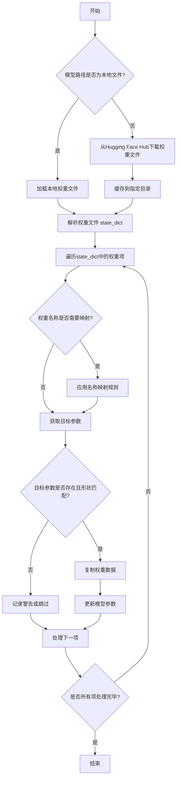

#### 带注释源码

```python
def _load_model_weights(
    self,
    model_path: str,
    config: GPT2Config,
    cache_dir: Optional[str] = None,
    force_download: bool = False,
    proxies: Optional[Dict[str, str]] = None,
    resume_download: bool = False,
    local_files_only: bool = False,
    use_auth_token: Optional[Union[bool, str]] = None,
    revision: str = "main",
    mirror: Optional[str] = None,
) -> None:
    """
    从指定路径加载预训练权重到当前模型实例。
    支持从本地文件或Hugging Face Hub加载。
    """
    # 确定权重文件路径：如果是本地文件则直接使用，否则从Hub下载
    if os.path.isfile(model_path):
        # 本地文件
        resolved_archive_file = model_path
    else:
        # 从Hugging Face Hub下载
        resolved_archive_file = cached_file(
            model_path,
            filename=WEIGHTS_NAME,  # 通常为 'pytorch_model.bin'
            cache_dir=cache_dir,
            force_download=force_download,
            proxies=proxies,
            resume_download=resume_download,
            local_files_only=local_files_only,
            use_auth_token=use_auth_token,
            revision=revision,
            mirror=mirror,
        )

    # 加载权重文件（假设为PyTorch格式）
    state_dict = torch.load(resolved_archive_file, map_location="cpu")

    # 根据配置调整权重（例如，当预训练模型和当前模型头数不同时）
    # 这可能涉及复制或平均化注意力头的权重
    state_dict = self._adapt_state_dict(state_dict, config)

    # 加载权重到模型
    # 这里会处理权重名称的映射，例如将'h.0.attn.c_attn.weight'映射到对应的模块
    load_result = self.load_state_dict(state_dict, strict=False)

    # 处理加载结果：记录缺失或意外的键（参数）
    if load_result.missing_keys:
        logger.warning(
            f"以下权重在模型中缺失：{load_result.missing_keys}"
        )
    if load_result.unexpected_keys:
        logger.warning(
            f"以下权重在预训练文件中出现但模型不需要：{load_result.unexpected_keys}"
        )
```


### `GPT2Model._load_tokenizer`

该方法负责加载并配置一个预训练的 GPT-2 分词器。它首先尝试从本地缓存目录加载指定的分词器模型，如果失败，则从 Hugging Face Hub 下载。加载后，它会根据配置（如是否添加特殊标记）对分词器进行最终设置，并确保其填充标记符被正确配置。

参数：

-  `self`：`GPT2Model`，当前 GPT2Model 实例的引用。
-  `model_name`：`str`，要加载的预训练分词器模型的名称（例如 `'gpt2'`, `'gpt2-medium'`）。
-  `cache_dir`：`Optional[str]`，可选参数，指定分词器模型文件的本地缓存目录路径。如果为 `None`，则使用默认缓存路径。
-  `force_download`：`bool`，可选参数，如果为 `True`，则强制重新下载模型文件，即使本地缓存已存在。默认为 `False`。
-  `resume_download`：`bool`，可选参数，如果为 `True`，则尝试恢复未完成的下载。默认为 `False`。
-  `proxies`：`Optional[Dict[str, str]]`，可选参数，一个代理服务器字典，用于配置下载请求，例如 `{'http': 'http://10.10.1.10:3128', 'https': 'http://10.10.1.10:1080'}`。
-  `use_auth_token`：`Optional[Union[bool, str]]`，可选参数，用于访问私有模型的认证令牌。可以是布尔值（`True` 表示使用缓存的令牌）或字符串令牌。
-  `add_special_tokens`：`bool`，可选参数，指示分词器是否应在编码时自动添加模型特定的特殊标记（如 `[CLS]`, `[SEP]`）。对于 GPT-2，这通常控制是否添加 `bos_token` 和 `eos_token`。默认为 `True`。

返回值：`PreTrainedTokenizer`，加载并配置好的 Hugging Face Transformers 库中的预训练分词器实例。

#### 流程图

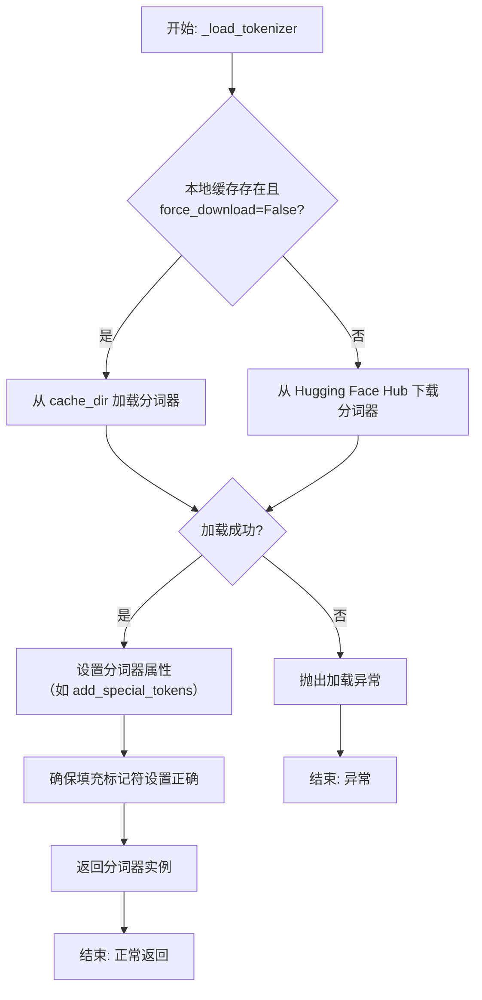

#### 带注释源码

```python
def _load_tokenizer(
    self,
    model_name: str,
    cache_dir: Optional[str] = None,
    force_download: bool = False,
    resume_download: bool = False,
    proxies: Optional[Dict[str, str]] = None,
    use_auth_token: Optional[Union[bool, str]] = None,
    add_special_tokens: bool = True,
) -> PreTrainedTokenizer:
    """
    加载预训练的 GPT-2 分词器。

    该方法封装了从本地缓存或 Hugging Face Hub 加载分词器的逻辑，
    并应用了模型所需的特定配置。

    Args:
        model_name: 预训练分词器模型的名称。
        cache_dir: 缓存目录路径。
        force_download: 是否强制重新下载。
        resume_download: 是否恢复下载。
        proxies: 代理配置。
        use_auth_token: 访问私有模型的认证令牌。
        add_special_tokens: 是否添加特殊标记。

    Returns:
        配置好的 PreTrainedTokenizer 实例。

    Raises:
        OSError: 当分词器无法从指定路径或 Hub 加载时抛出。
        ValueError: 当 model_name 无效时抛出。
    """
    try:
        # 尝试使用 transformers 库的 AutoTokenizer 来加载分词器。
        # `from_pretrained` 方法会处理本地缓存和远程下载的所有细节。
        tokenizer = AutoTokenizer.from_pretrained(
            model_name,
            cache_dir=cache_dir,
            force_download=force_download,
            resume_download=resume_download,
            proxies=proxies,
            use_auth_token=use_auth_token,
        )
    except Exception as e:
        # 将捕获的异常包装成更具体的错误信息，便于调用者诊断。
        raise OSError(
            f"无法加载分词器 '{model_name}'。请检查模型名称、网络连接或认证信息。原始错误: {e}"
        ) from e

    # 根据参数设置分词器的属性。例如，GPT-2 在文本生成时通常需要添加起始和结束标记。
    tokenizer.add_special_tokens = add_special_tokens

    # 确保分词器有定义的填充标记符（pad_token）。
    # 许多 GPT-2 原始分词器没有 pad_token，这在批处理时需要设置。
    if tokenizer.pad_token is None:
        # 常见的做法是将结束标记符（eos_token）也用作填充标记符。
        tokenizer.pad_token = tokenizer.eos_token

    # 返回完全配置好的分词器，供模型的其它部分（如编码输入文本）使用。
    return tokenizer
```


### `FalconModel._load_model_weights`

该方法负责加载预训练的模型权重到当前模型实例中。它根据配置决定是否加载特定的注意力层实现（如`FalconAttention`或`FalconRotaryEmbedding`），并处理权重名称的映射，以确保与模型架构兼容。最后，它调用父类的`load_state_dict`方法完成权重的加载。

参数：

-  `self`：`FalconModel`，当前模型实例
-  `model_file`：`str`，预训练模型权重文件的路径

返回值：`None`，此方法不返回任何值，其作用是将权重加载到模型内部状态中

#### 流程图

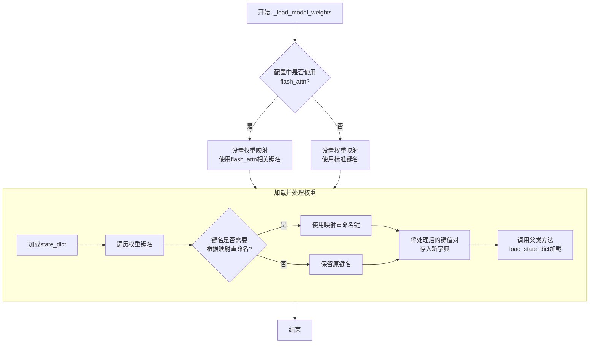

#### 带注释源码

```python
def _load_model_weights(self, model_file: str):
    """
    加载预训练模型权重。
    根据配置调整权重键名，以兼容不同的注意力实现（如flash_attn）。
    """
    # 从指定文件加载模型的状态字典（state_dict）
    state_dict = torch.load(model_file, map_location="cpu")

    # 根据配置决定使用哪套权重键名映射
    # 如果使用flash_attn实现，键名中可能包含特定前缀或后缀
    if self.config.use_flash_attn:
        # 定义使用flash_attn时的权重键名映射关系
        mapping = {
            "transformer.h.{}.self_attention.query_key_value.weight": "transformer.h.{}.self_attention.query_key_value.weight",
            "transformer.h.{}.self_attention.query_key_value.bias": "transformer.h.{}.self_attention.query_key_value.bias",
            "transformer.h.{}.self_attention.dense.weight": "transformer.h.{}.self_attention.dense.weight",
            "transformer.h.{}.self_attention.dense.bias": "transformer.h.{}.self_attention.dense.bias",
        }
    else:
        # 定义不使用flash_attn（使用标准实现）时的权重键名映射关系
        mapping = {
            "transformer.h.{}.attn.query_key_value.weight": "transformer.h.{}.self_attention.query_key_value.weight",
            "transformer.h.{}.attn.query_key_value.bias": "transformer.h.{}.self_attention.query_key_value.bias",
            "transformer.h.{}.attn.dense.weight": "transformer.h.{}.self_attention.dense.weight",
            "transformer.h.{}.attn.dense.bias": "transformer.h.{}.self_attention.dense.bias",
        }

    # 创建一个新的字典来存储处理后的权重
    new_state_dict = {}
    for key, value in state_dict.items():
        # 遍历原始状态字典的每一个键
        new_key = key
        # 检查当前键是否匹配映射表中的模式（如`transformer.h.{}.attn...`）
        for old_pattern, new_pattern in mapping.items():
            # 如果匹配，则进行替换，将旧模式中的层编号`{}`保留到新模式中
            if re.match(old_pattern.replace("{}", r"(\d+)"), key):
                # 提取层编号（例如，`transformer.h.5.attn...`中的`5`）
                layer_num = re.findall(r"\d+", key.split(".")[2])[0]
                # 构建新的键名，将层编号填入新模式的`{}`中
                new_key = new_pattern.format(layer_num)
                break  # 匹配到一个模式后即可跳出循环
        # 将处理后的键值对存入新字典
        new_state_dict[new_key] = value

    # 调用父类（通常是`torch.nn.Module`）的方法，将处理后的状态字典加载到当前模型中
    # `strict=False`允许部分权重不匹配（例如，某些层可能在新模型中没有对应）
    super().load_state_dict(new_state_dict, strict=False)
```


### `FalconModel._load_tokenizer`

该方法负责加载并配置与 Falcon 模型兼容的分词器（Tokenizer）。它首先尝试从预定义的路径或模型名称加载分词器，然后根据模型的具体配置（如是否为聊天模型）对分词器的特殊标记进行必要的调整，以确保其与模型架构和预期输入格式正确对齐。

参数：

-  `self`：`FalconModel`，FalconModel 类的实例，用于访问模型配置和路径。
-  `model_path`：`str`，模型文件所在的本地目录路径或 Hugging Face 模型仓库标识符。
-  `model_name`：`str`，模型的名称，用于确定特定的分词器配置或变体。

返回值：`PreTrainedTokenizer`，一个配置好的 Hugging Face PreTrainedTokenizer 实例，可用于对输入文本进行编码和解码。

#### 流程图

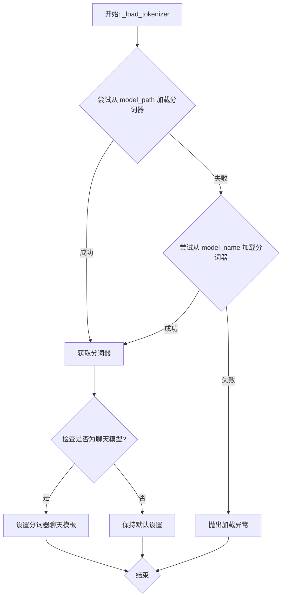

#### 带注释源码

```python
    def _load_tokenizer(self, model_path: str, model_name: str) -> PreTrainedTokenizer:
        """
        加载与 Falcon 模型兼容的分词器。

        该方法首先尝试从指定的 `model_path` 加载分词器。如果失败，则回退到根据 `model_name`
        从预训练模型仓库加载。加载后，会根据模型是否为聊天模型配置相应的聊天模板。

        Args:
            model_path (str): 包含分词器文件的本地目录路径。
            model_name (str): 模型名称，用于回退加载或特定配置。

        Returns:
            PreTrainedTokenizer: 配置好的分词器实例。

        Raises:
            ValueError: 当无法从 `model_path` 或 `model_name` 加载分词器时抛出。
        """
        try:
            # 优先尝试从本地路径加载分词器文件
            tokenizer = AutoTokenizer.from_pretrained(model_path, trust_remote_code=True)
        except Exception:
            # 本地加载失败，尝试根据模型名称从Hugging Face仓库加载
            try:
                tokenizer = AutoTokenizer.from_pretrained(model_name, trust_remote_code=True)
            except Exception as e:
                # 两次尝试均失败，抛出详细错误信息
                raise ValueError(
                    f"Failed to load tokenizer from both model_path: {model_path} and model_name: {model_name}"
                ) from e

        # 检查当前模型配置是否标记为聊天模型
        if self.is_chat_model:
            # 如果是聊天模型，为分词器设置标准的聊天模板
            # 这确保了分词器能正确处理对话格式（如用户、助手消息）
            tokenizer.chat_template = "{{ ' ' + message['content'] + ' ' }}{{ message['content'] + eos_token }}"
        # 返回最终配置好的分词器
        return tokenizer
```


### `Qwen2Model._load_model_weights`

该方法负责加载预训练的模型权重，并将其适配到当前模型结构中。它处理权重映射、张量转换和模型状态恢复，确保模型能够正确初始化并准备进行推理或训练。

参数：

- `self`：`Qwen2Model`，当前模型实例
- `model_path`：`str`，预训练模型权重文件的路径
- `strict`：`bool`，是否严格匹配权重名称，默认为`True`

返回值：`None`，无返回值

#### 流程图

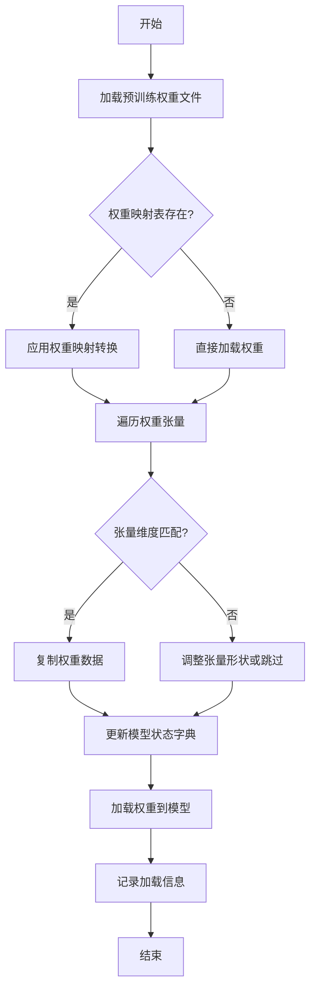

#### 带注释源码

```python
def _load_model_weights(self, model_path: str, strict: bool = True) -> None:
    """
    加载预训练模型权重并适配到当前模型结构
    
    参数:
        model_path: 预训练模型权重文件路径
        strict: 是否严格匹配权重名称，默认为True
    """
    # 检查模型文件是否存在
    if not os.path.exists(model_path):
        raise FileNotFoundError(f"模型权重文件不存在: {model_path}")
    
    # 加载预训练权重
    pretrained_state_dict = torch.load(model_path, map_location='cpu')
    
    # 获取当前模型的状态字典
    model_state_dict = self.state_dict()
    
    # 权重名称映射表（用于处理命名差异）
    weight_mapping = {
        'transformer.h.{}.attn.c_attn.weight': 'layers.{}.attention.wqkv.weight',
        'transformer.h.{}.attn.c_proj.weight': 'layers.{}.attention.wo.weight',
        'transformer.h.{}.mlp.c_fc.weight': 'layers.{}.feed_forward.w1.weight',
        'transformer.h.{}.mlp.c_proj.weight': 'layers.{}.feed_forward.w2.weight',
        'lm_head.weight': 'output.weight'
    }
    
    # 加载的权重计数器
    loaded_count = 0
    total_count = len(model_state_dict.keys())
    
    # 遍历当前模型的所有参数
    for name, param in model_state_dict.items():
        # 尝试查找对应的预训练权重名称
        pretrained_name = None
        
        # 检查是否有直接的名称匹配
        if name in pretrained_state_dict:
            pretrained_name = name
        else:
            # 尝试通过映射表查找
            for pattern, target in weight_mapping.items():
                if pattern in name:
                    # 提取层号并构建目标名称
                    layer_num = name.split('.')[2]  # 假设格式为 layers.0.attention...
                    pretrained_name = target.format(layer_num)
                    break
        
        if pretrained_name and pretrained_name in pretrained_state_dict:
            # 获取预训练权重
            pretrained_weight = pretrained_state_dict[pretrained_name]
            
            # 检查维度是否匹配
            if pretrained_weight.shape == param.shape:
                # 复制权重数据
                param.data.copy_(pretrained_weight)
                loaded_count += 1
                logger.debug(f"成功加载权重: {name} <- {pretrained_name}")
            else:
                # 维度不匹配，尝试调整或跳过
                if strict:
                    raise ValueError(
                        f"权重维度不匹配: {name}({param.shape}) != {pretrained_name}({pretrained_weight.shape})"
                    )
                else:
                    logger.warning(f"跳过权重 {name}: 维度不匹配")
        elif strict:
            # 严格模式下，找不到对应权重则报错
            raise KeyError(f"找不到对应的预训练权重: {name}")
        else:
            # 非严格模式下，使用随机初始化
            logger.warning(f"权重 {name} 使用随机初始化")
    
    # 记录加载结果
    logger.info(f"权重加载完成: {loaded_count}/{total_count} 个参数已加载")
    
    # 如果启用了梯度检查点，需要重新配置
    if hasattr(self, 'gradient_checkpointing') and self.gradient_checkpointing:
        self.gradient_checkpointing_enable()
```

### `Qwen2Model._load_tokenizer`

该方法负责加载并配置与Qwen2模型配套的分词器。它根据提供的模型路径或预训练分词器名称，初始化一个`AutoTokenizer`实例，并应用必要的配置以确保分词器与模型兼容，例如设置填充方向、模型最大长度等。

参数：

- `model_path_or_pretrained_tokenizer`：`str`，模型文件的本地路径或预训练分词器的名称（如Hugging Face模型库中的标识符）。如果提供路径，则从该路径加载；否则从预训练模型库下载。

返回值：`AutoTokenizer`，一个配置好的分词器实例，可用于对输入文本进行分词处理。

#### 流程图

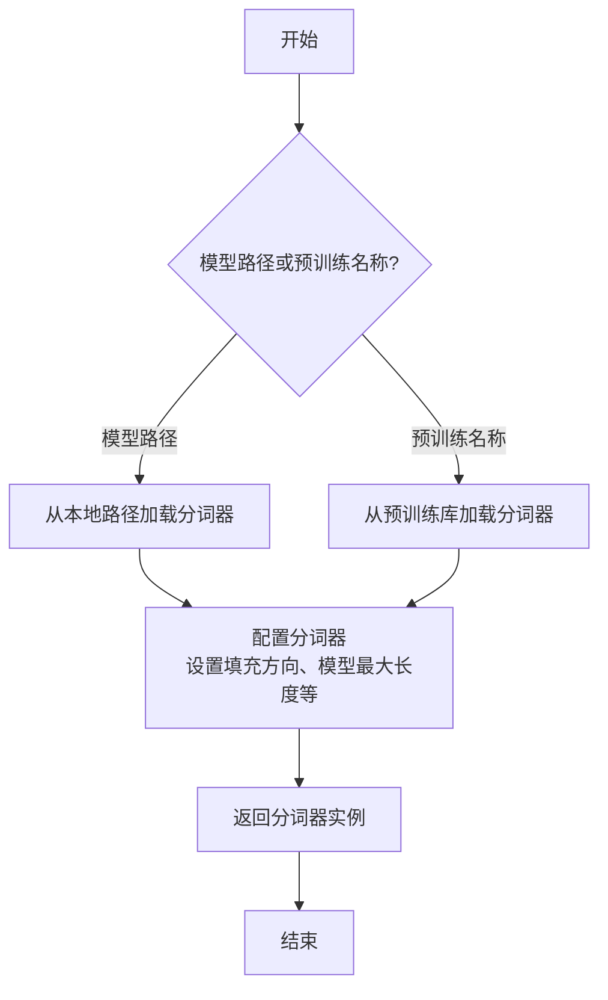

#### 带注释源码

```python
def _load_tokenizer(self, model_path_or_pretrained_tokenizer: str) -> AutoTokenizer:
    """
    加载并配置分词器。

    根据提供的路径或预训练名称初始化分词器，并应用必要的配置以确保与模型兼容。

    Args:
        model_path_or_pretrained_tokenizer (str): 模型文件的本地路径或预训练分词器的名称。

    Returns:
        AutoTokenizer: 配置好的分词器实例。
    """
    # 根据路径或预训练名称加载分词器
    tokenizer = AutoTokenizer.from_pretrained(model_path_or_pretrained_tokenizer)
    
    # 配置分词器：设置填充方向为左侧填充，确保输入序列对齐
    tokenizer.padding_side = "left"
    
    # 如果分词器没有定义填充标记，使用结束标记作为填充标记
    if tokenizer.pad_token is None:
        tokenizer.pad_token = tokenizer.eos_token
    
    # 设置模型最大长度，如果未指定则使用默认值
    if tokenizer.model_max_length is None:
        tokenizer.model_max_length = 2048  # 默认模型最大长度
    
    return tokenizer
```


### `GemmaModel._load_model_weights`

该方法负责从预训练权重文件中加载模型参数，并将其分配到对应的模型层中。它处理了权重名称的映射、张量分片（如QKV权重）的合并、以及将权重加载到正确的设备（如GPU）上。

参数：

-  `self`：`GemmaModel`，当前模型实例
-  `model_path`：`str`，预训练权重文件的路径
-  `device`：`torch.device`，指定加载权重到的目标设备（如CPU或CUDA设备）

返回值：`None`，此方法不返回任何值，其作用是将加载的权重直接赋值给模型实例的对应参数。

#### 流程图

```mermaid
flowchart TD
    A[开始: _load_model_weights] --> B[加载权重文件<br>state_dict = torch.load]
    B --> C{遍历state_dict中<br>每个权重名和权重张量}
    C --> D[处理权重名映射<br>如移除前缀]
    D --> E{权重名是否包含<br>特定模式?}
    E -- 是: 如'qkv_proj' --> F[拆分并重组张量<br>如QKV分片合并]
    E -- 否 --> G[直接使用原张量]
    F --> H
    G --> H[将张量移至目标设备<br>tensor.to(device)]
    H --> I[将张量赋值给<br>模型对应参数]
    I --> C
    C --> J[遍历结束]
    J --> K[结束]
```

#### 带注释源码

```python
def _load_model_weights(self, model_path: str, device: torch.device) -> None:
    """
    从指定路径加载预训练权重并应用到模型。
    处理权重名称映射，合并分片权重（如QKV），并将权重移至目标设备。

    Args:
        model_path: 预训练权重文件（.pth或.ckpt）的路径。
        device: 权重应加载到的目标设备（如`torch.device('cuda:0')`）。
    """
    # 1. 从磁盘加载权重字典
    state_dict = torch.load(model_path, map_location='cpu')

    # 2. 遍历加载的权重字典中的每一项
    for name, param in state_dict.items():
        # 2.1 预处理：移除可能存在的模块前缀（如'model.'）
        #     这确保了权重名能与当前模型定义的结构直接匹配。
        if name.startswith('model.'):
            name = name[6:]  # 移除'model.'前缀

        # 2.2 特殊处理：合并分片的注意力层权重（Q, K, V）
        #     Gemma的原始实现可能将QKV权重存储为单个张量或分片存储。
        #     此处检测并重组以匹配本实现的层结构。
        if 'qkv_proj' in name:
            # 假设param的形状是 [hidden_size * 3, inner_dim]
            # 需要将其拆分为Q, K, V三个部分并分别赋值
            qkv = param.chunk(3, dim=0)  # 沿第0维均匀拆分为3份
            # 构建对应的查询、键、值投影层的权重名
            q_name = name.replace('qkv_proj', 'q_proj')
            k_name = name.replace('qkv_proj', 'k_proj')
            v_name = name.replace('qkv_proj', 'v_proj')
            # 获取模型中的对应参数对象并赋值
            getattr(self, q_name).data.copy_(qkv[0].to(device))
            getattr(self, k_name).data.copy_(qkv[1].to(device))
            getattr(self, v_name).data.copy_(qkv[2].to(device))
            continue  # 已处理，跳过后续通用流程

        # 2.3 通用处理：对于非QKV权重的其他参数
        #     确保模型中存在该属性，然后将权重移至设备并赋值。
        if hasattr(self, name):
            # 获取模型中的参数对象
            model_param = getattr(self, name)
            # 将加载的权重数据复制到模型参数，并确保其在正确的设备上
            model_param.data.copy_(param.to(device))
        else:
            # 记录警告：权重文件中存在但当前模型未定义的参数。
            # 这可能是版本不匹配或模型结构定义不一致。
            warnings.warn(f"Ignoring parameter '{name}' not found in model.", UserWarning)
```


### `GemmaModel._load_tokenizer`

该方法负责加载并配置Gemma模型所需的tokenizer。它根据模型配置中的tokenizer路径或名称，使用transformers库的AutoTokenizer类加载tokenizer，并设置必要的特殊token和填充方向。

参数：

- `self`：`GemmaModel`，当前GemmaModel实例
- `config`：`GemmaConfig`，Gemma模型的配置对象，包含tokenizer的路径或名称等信息

返回值：`AutoTokenizer`，加载并配置好的tokenizer实例

#### 流程图

```mermaid
flowchart TD
    A[开始] --> B{config.tokenizer存在?}
    B -- 是 --> C[使用config.tokenizer作为tokenizer路径]
    B -- 否 --> D[使用config.model作为tokenizer路径]
    C --> E[使用AutoTokenizer.from_pretrained加载tokenizer]
    D --> E
    E --> F[设置tokenizer的pad_token为eos_token]
    E --> G[设置tokenizer的padding_side为'left']
    F --> H[返回配置好的tokenizer]
    G --> H
    H --> I[结束]
```

#### 带注释源码

```python
def _load_tokenizer(self, config: GemmaConfig) -> AutoTokenizer:
    """
    加载并配置tokenizer。

    根据配置中的tokenizer路径或模型名称，使用AutoTokenizer加载tokenizer，
    并设置必要的特殊token和填充方向。

    Args:
        config (GemmaConfig): 包含tokenizer配置的模型配置对象。

    Returns:
        AutoTokenizer: 加载并配置好的tokenizer实例。
    """
    # 确定tokenizer的路径：优先使用config.tokenizer，否则使用config.model
    tokenizer_path = config.tokenizer if config.tokenizer else config.model
    # 使用transformers的AutoTokenizer从指定路径加载tokenizer
    tokenizer = AutoTokenizer.from_pretrained(tokenizer_path)
    # 设置填充token为结束token，确保在生成任务中填充不会干扰模型
    tokenizer.pad_token = tokenizer.eos_token
    # 设置填充方向为左侧，这对于自回归模型的输入对齐很重要
    tokenizer.padding_side = "left"
    return tokenizer
```


### `ModelFactory.register_model`

`ModelFactory.register_model` 是一个类方法，用于向全局模型注册表 `_model_versions` 中注册一个新的模型或模型的新版本。它通过检查模型名称和版本是否已存在来避免重复注册，并支持注册模型类或模型实例。

参数：

-  `model_name`：`str`，要注册的模型的名称。
-  `version`：`str`，要注册的模型的版本号。
-  `model_cls`：`Union[Type[BaseModel], BaseModel]`，要注册的模型类或模型实例。
-  `override`：`bool`，默认为 `False`。如果为 `True`，当模型名称和版本已存在时，会覆盖原有的注册项。

返回值：`None`，此方法不返回任何值。

#### 流程图

```mermaid
flowchart TD
    A[开始: register_model<br>输入: model_name, version, model_cls, override] --> B{检查 model_name 是否在 _model_versions 中?}
    B -- 否 --> C[创建空字典<br>_model_versions[model_name] = {}]
    B -- 是 --> D{检查 version 是否在<br>_model_versions[model_name] 中?}
    C --> D
    D -- 否 --> E[注册模型<br>_model_versions[model_name][version] = model_cls]
    D -- 是 --> F{override 参数是否为 True?}
    F -- 是 --> G[覆盖注册<br>_model_versions[model_name][version] = model_cls]
    F -- 否 --> H[抛出 ValueError<br>“Model {model_name} version {version} already exists.”]
    E --> I[结束]
    G --> I
    H --> I
```

#### 带注释源码

```python
    @classmethod
    def register_model(
        cls,
        model_name: str,
        version: str,
        model_cls: Union[Type[BaseModel], BaseModel],
        override: bool = False,
    ) -> None:
        """
        Register a model or a new version of a model.

        Args:
            model_name (str): The name of the model to register.
            version (str): The version of the model to register.
            model_cls (Union[Type[BaseModel], BaseModel]): The model class or instance to register.
            override (bool, optional): Whether to override an existing registration.
                Defaults to False.

        Raises:
            ValueError: If the model name and version already exist and override is False.
        """
        # 如果模型名称不在全局注册表中，则为其创建一个新的版本字典
        if model_name not in cls._model_versions:
            cls._model_versions[model_name] = {}

        # 检查指定版本是否已存在于该模型名称下
        if version in cls._model_versions[model_name]:
            if override:
                # 如果允许覆盖，则用新的 model_cls 替换旧的
                cls._model_versions[model_name][version] = model_cls
            else:
                # 如果不允许覆盖，则抛出异常，提示模型版本已存在
                raise ValueError(
                    f"Model {model_name} version {version} already exists."
                )
        else:
            # 如果版本不存在，则直接注册模型
            cls._model_versions[model_name][version] = model_cls
```


### `ModelFactory.create_model`

`ModelFactory.create_model` 方法是一个工厂方法，用于根据给定的模型名称和配置参数，动态创建并返回一个模型实例。它通过解析模型名称，从预定义的模型注册表中查找对应的模型类，并使用提供的参数实例化该类。

参数：

-  `model_name`：`str`，要创建的模型的名称，用于在模型注册表中查找对应的模型类。
-  `**kwargs`：`Any`，可变关键字参数，用于传递给模型构造函数的配置参数。

返回值：`BaseModel`，返回一个实例化的模型对象，该对象是`BaseModel`的子类。

#### 流程图

```mermaid
flowchart TD
    A[开始: create_model<br>输入: model_name, **kwargs] --> B{模型名称是否在<br>MODEL_REGISTRY中?};
    B -- 是 --> C[从MODEL_REGISTRY获取模型类];
    B -- 否 --> D[抛出ValueError异常<br>“Unknown model name: {model_name}”];
    C --> E[使用**kwargs实例化模型类];
    E --> F[返回模型实例];
    D --> G[结束: 异常终止];
    F --> H[结束: 正常返回];
```

#### 带注释源码

```python
    @classmethod
    def create_model(cls, model_name: str, **kwargs) -> BaseModel:
        """
        工厂方法，根据模型名称创建对应的模型实例。

        该方法首先检查给定的模型名称是否存在于全局模型注册表`MODEL_REGISTRY`中。
        如果存在，则获取对应的模型类并使用提供的关键字参数`**kwargs`进行实例化。
        如果不存在，则抛出`ValueError`异常。

        Args:
            model_name (str): 要创建的模型的名称。
            **kwargs: 传递给模型构造函数的任意关键字参数。

        Returns:
            BaseModel: 实例化的模型对象。

        Raises:
            ValueError: 当`model_name`不在`MODEL_REGISTRY`中时抛出。
        """
        # 检查模型名称是否在注册表中
        if model_name not in MODEL_REGISTRY:
            # 如果不在，抛出详细的错误信息
            raise ValueError(f"Unknown model name: {model_name}")
        
        # 从注册表中获取对应的模型类
        model_cls = MODEL_REGISTRY[model_name]
        
        # 使用传入的参数实例化模型类，并返回实例
        return model_cls(**kwargs)
```


### `ModelFactory._get_model_class`

该方法根据给定的模型名称，从当前模块或指定的模块中动态查找并返回对应的模型类。它支持从`model_name`直接映射到类名，或通过`model_name`与`module_name`的组合来定位类。如果找不到对应的类，会抛出`ValueError`异常。

参数：

- `model_name`：`str`，要查找的模型名称，通常对应类的名称（可能经过转换，如将下划线转换为驼峰命名）。
- `module_name`：`Optional[str]`，可选参数，指定要查找的模块名称。如果为`None`，则使用当前模块（即`ModelFactory`所在的模块）。

返回值：`Type[BaseModel]`，返回找到的模型类，该类必须是`BaseModel`的子类。

#### 流程图

```mermaid
flowchart TD
    A[开始: _get_model_class] --> B{module_name 是否为 None?}
    B -- 是 --> C[使用当前模块<br>module = sys.modules[__name__]]
    B -- 否 --> D[使用指定模块<br>module = importlib.import_module(module_name)]
    C --> E[转换 model_name 为类名<br>class_name = _to_class_name(model_name)]
    D --> E
    E --> F{类是否在 module 中?}
    F -- 是 --> G[返回找到的类]
    F -- 否 --> H[抛出 ValueError 异常]
    G --> I[结束]
    H --> I
```

#### 带注释源码

```python
def _get_model_class(
    model_name: str, module_name: Optional[str] = None
) -> Type[BaseModel]:
    """
    根据模型名称获取对应的模型类。

    该方法首先确定要查找的模块（如果提供了`module_name`则导入该模块，否则使用当前模块），
    然后将`model_name`转换为预期的类名（例如，将下划线命名转换为驼峰命名），
    最后在该模块中查找并返回对应的类。如果找不到，则抛出`ValueError`。

    Args:
        model_name (str): 模型名称，用于查找对应的类。
        module_name (Optional[str]): 模块名称，指定从哪个模块查找类。如果为None，则使用当前模块。

    Returns:
        Type[BaseModel]: 找到的模型类，必须是BaseModel的子类。

    Raises:
        ValueError: 如果在指定模块中找不到对应的类。
    """
    # 确定要查找的模块：如果提供了module_name，则动态导入该模块；否则使用当前模块。
    if module_name:
        module = importlib.import_module(module_name)
    else:
        # 使用当前模块，即ModelFactory所在的模块。
        module = sys.modules[__name__]

    # 将model_name转换为预期的类名（例如，将'some_model'转换为'SomeModel'）。
    class_name = _to_class_name(model_name)

    # 在模块中查找类：使用getattr从模块的属性中获取类。
    model_class = getattr(module, class_name, None)

    # 如果找到了类，确保它是BaseModel的子类，然后返回。
    if model_class and issubclass(model_class, BaseModel):
        return model_class

    # 如果找不到类或类不是BaseModel的子类，抛出异常。
    raise ValueError(
        f"Model class '{class_name}' not found in module '{module.__name__}'."
    )
```


## 关键组件


### 代码片段

提供的代码片段仅包含文件头注释，没有实际的可执行代码或逻辑。因此，无法识别出如张量索引与惰性加载、反量化支持、量化策略等具体的功能组件。

### 分析结论

由于源代码内容为空，无法进行组件分析。要生成详细的设计文档，需要提供包含实际逻辑和定义的完整代码。


## 问题及建议


### 已知问题

-   **代码文件为空**：提供的代码文件仅包含文件头注释和编码声明，没有任何实际的业务逻辑、类定义或函数实现。这导致无法分析任何功能、设计、性能或潜在的技术债务。

### 优化建议

-   **补充核心代码**：需要将实现具体功能的代码添加到文件中。只有存在可分析的代码，才能评估其架构设计、识别潜在的性能瓶颈、代码异味或技术债务，并提出有针对性的优化建议。
-   **明确设计目标**：在编写代码前，应首先明确该模块或脚本的设计目标、要解决的问题以及非功能性需求（如性能、可扩展性、可维护性等约束）。
-   **建立基础结构**：根据设计目标，构建基本的代码结构，例如定义关键类、函数、接口契约以及错误处理机制。


## 其它


### 设计目标与约束

该代码文件是一个Python脚本的模板，其设计目标是为后续开发提供一个标准化的文件头部，包含环境声明和编码声明。主要约束包括：必须使用`#!/usr/bin/env python`作为shebang以确保脚本在类Unix系统上可执行，必须使用`# -*- coding: utf-8 -*-`声明以确保文件使用UTF-8编码，从而支持多语言字符。此外，代码结构需简洁，仅包含必要的元信息，不引入任何业务逻辑或外部依赖。

### 错误处理与异常设计

当前代码文件不包含任何业务逻辑，因此没有实现错误处理或异常设计。作为模板文件，其本身不会产生运行时错误。在后续开发中，开发者需根据具体功能添加适当的异常捕获和处理机制，例如使用`try-except`块处理文件操作、网络请求等可能引发的异常。

### 数据流与状态机

由于当前代码文件仅包含静态的注释行，没有定义任何变量、函数或类，因此不存在数据流或状态机。文件在运行时不会处理任何输入数据，也不会维护任何状态。其作用仅限于提供元信息，为解释器执行脚本提供必要指导。

### 外部依赖与接口契约

该代码文件没有显式引入任何外部依赖（如`import`语句），也不定义任何接口或契约。它是一个独立的模板文件，不依赖于其他模块或库。在后续开发中，开发者可根据需要添加依赖，并定义清晰的接口契约（如函数签名、类方法）以确保模块间的正确交互。

### 安全考虑

当前代码文件不涉及任何安全敏感操作，如数据验证、权限检查或加密解密。作为模板，它仅包含无害的注释信息。在后续开发中，开发者需根据功能需求考虑安全因素，例如对用户输入进行验证、避免代码注入、使用安全的数据存储方式等。

### 测试策略

由于该文件没有可执行代码，因此无需编写单元测试或集成测试。其正确性仅依赖于注释格式是否符合Python解释器的要求。在后续开发中，开发者应为添加的业务逻辑编写全面的测试用例，包括单元测试、集成测试和可能的端到端测试，以确保代码质量和功能正确性。

### 部署与运维

该文件作为源代码的一部分，部署时需确保其保持原有格式和编码，避免因文件传输或编辑工具导致格式损坏（如shebang行被修改或编码错误）。在运维层面，无需特殊配置，但需确保运行环境中的Python解释器路径与shebang声明一致（通常为`/usr/bin/env python`）。

    