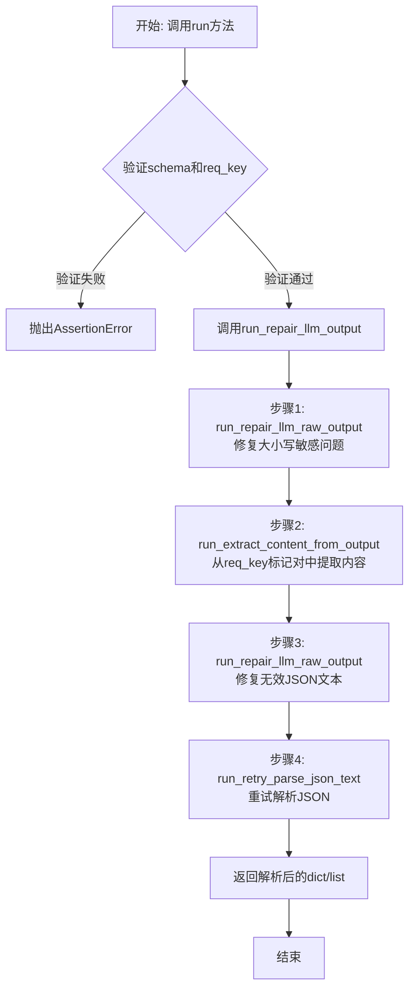
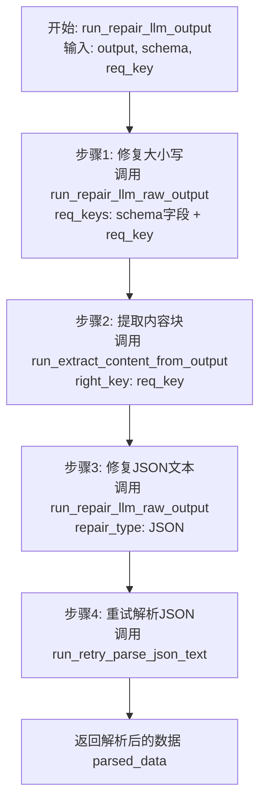
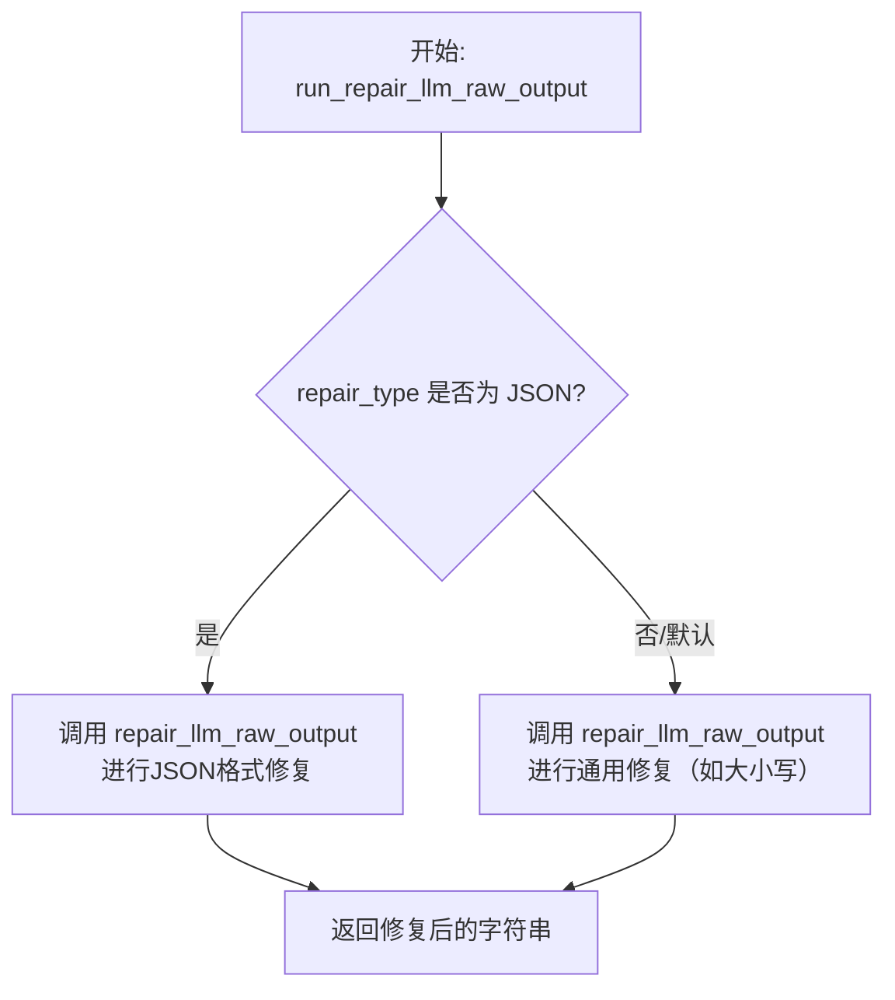
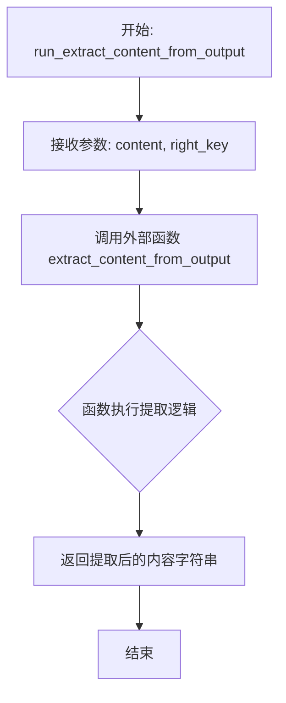
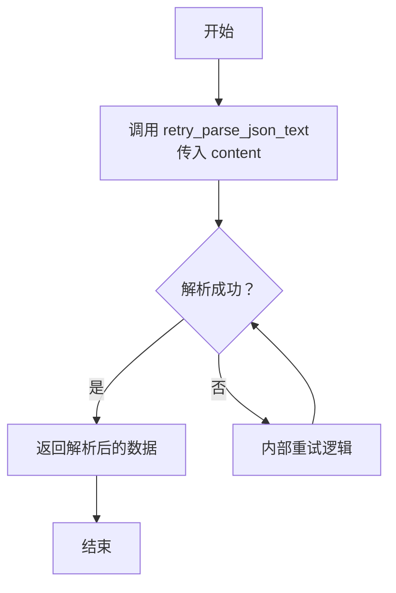

# `.\MetaGPT\metagpt\provider\postprocess\base_postprocess_plugin.py` 详细设计文档

该代码定义了一个基础后处理插件基类 `BasePostProcessPlugin`，其核心功能是修复和解析大语言模型（LLM）的原始输出。它通过一系列步骤处理包含JSON格式要求的LLM输出，包括修复大小写敏感问题、从特定标记对中提取内容、修复无效的JSON文本，并通过重试机制解析JSON，最终返回结构化的字典或列表数据。

## 整体流程



## 类结构

```
BasePostProcessPlugin
├── 类字段: model
├── 类方法: run_repair_llm_output
├── 类方法: run_repair_llm_raw_output
├── 类方法: run_extract_content_from_output
├── 类方法: run_retry_parse_json_text
└── 类方法: run
```

## 全局变量及字段


### `BasePostProcessPlugin.model`
    
用于在`llm_postprocess`中判断当前应使用哪个插件的模型标识符，通常为字符串或None。

类型：`Any`
    
    

## 全局函数及方法


### `BasePostProcessPlugin.run_repair_llm_output`

该方法是一个LLM输出后处理流程的核心协调器。它接收原始的、可能格式不规范的LLM输出文本，并按照一个预定义的、多步骤的“修复”流程进行处理，最终将其解析并返回为一个结构化的Python字典或列表对象。该流程旨在处理LLM输出中常见的格式错误、大小写不一致、JSON无效等问题，确保下游代码能够可靠地使用解析后的数据。

参数：

-  `output`：`str`，原始的、未经处理的LLM模型输出文本。
-  `schema`：`dict`，描述期望输出JSON结构的模式字典，用于指导修复过程（例如，提供合法的字段名列表）。
-  `req_key`：`str`，默认为`"[/CONTENT]"`，用于标识和提取输出文本中目标JSON内容块的结束标记（通常与开始标记`[CONTENT]`配对使用）。

返回值：`Union[dict, list]`，经过修复和解析后得到的结构化数据，通常是一个字典（对应JSON对象）或列表（对应JSON数组）。

#### 流程图



#### 带注释源码

```python
def run_repair_llm_output(self, output: str, schema: dict, req_key: str = "[/CONTENT]") -> Union[dict, list]:
    """
    repair steps
        1. repair the case sensitive problem using the schema's fields
        2. extract the content from the req_key pair( xx[REQ_KEY]xxx[/REQ_KEY]xx )
        3. repair the invalid json text in the content
        4. parse the json text and repair it according to the exception with retry loop
    """
    # 从提供的schema中获取期望的JSON对象字段名列表，用于第一步的大小写修复。
    output_class_fields = list(schema["properties"].keys())  # Custom ActionOutput's fields

    # 步骤1: 初步修复。使用schema字段和req_key作为关键词，修复输出文本中的大小写问题。
    content = self.run_repair_llm_raw_output(output, req_keys=output_class_fields + [req_key])
    # 步骤2: 提取内容。根据结束标记req_key，从修复后的文本中提取出目标JSON内容块。
    content = self.run_extract_content_from_output(content, right_key=req_key)
    # 步骤3: JSON专项修复。对提取出的纯JSON文本内容进行修复（如补全引号、括号等）。
    # # req_keys mocked
    content = self.run_repair_llm_raw_output(content, req_keys=[None], repair_type=RepairType.JSON)
    # 步骤4: 解析与重试。尝试解析修复后的JSON文本，如果失败则进入重试循环，根据异常信息进一步修复。
    parsed_data = self.run_retry_parse_json_text(content)

    # 返回最终解析成功的结构化数据。
    return parsed_data
```


### `BasePostProcessPlugin.run_repair_llm_raw_output`

该方法是一个受保护的核心方法，用于修复大语言模型（LLM）的原始输出文本。它主要处理大小写敏感问题和JSON格式错误，是`BasePostProcessPlugin`插件修复流程中的第一步。子类可以通过重写此方法来定制具体的修复逻辑。

参数：

-  `content`：`str`，需要修复的原始文本内容。
-  `req_keys`：`list[str]`，一个字符串列表，包含需要检查或修复的关键词。通常包括目标JSON模式（schema）的属性字段名和外部包装标签（如`[/CONTENT]`），用于指导修复过程。
-  `repair_type`：`str`，可选参数，指定修复类型。当传入`RepairType.JSON`时，会进行JSON相关的修复。默认为`None`。

返回值：`str`，返回经过初步修复后的文本字符串。

#### 流程图



#### 带注释源码

```python
def run_repair_llm_raw_output(self, content: str, req_keys: list[str], repair_type: str = None) -> str:
    """inherited class can re-implement the function"""
    # 调用外部的 `repair_llm_raw_output` 工具函数执行实际的修复工作。
    # 本方法作为包装器，提供了子类重写的灵活性。
    return repair_llm_raw_output(content, req_keys=req_keys, repair_type=repair_type)
```


### `BasePostProcessPlugin.run_extract_content_from_output`

该方法是一个用于从大语言模型（LLM）的原始输出文本中，根据指定的右侧结束标记（`right_key`）提取核心内容片段的插件方法。它是`BasePostProcessPlugin`类中LLM输出后处理流程的一个关键步骤，旨在剥离输出文本中可能存在的包装标记（如`[CONTENT]...[/CONTENT]`），获取内部真正需要解析的结构化数据（通常是JSON字符串）。该方法设计为可被子类重写，以支持自定义的提取逻辑。

参数：

-  `content`：`str`，待处理的原始文本内容，通常包含由特定标记包裹的目标内容。
-  `right_key`：`str`，用于标识内容结束的右侧标记（例如 `"[/CONTENT]"`）。方法将寻找此标记来定位内容的结束边界。

返回值：`str`，从原始`content`中提取出的、位于`right_key`标记之前的核心内容字符串。如果未找到`right_key`，则可能返回原始内容或经过其他处理的字符串（具体行为取决于`extract_content_from_output`函数的实现）。

#### 流程图



#### 带注释源码

```python
def run_extract_content_from_output(self, content: str, right_key: str) -> str:
    """inherited class can re-implement the function"""
    # 调用独立的工具函数 `extract_content_from_output` 执行实际的提取操作。
    # 当前类作为插件基类，提供了这个默认实现。
    # 子类可以通过重写此方法来改变提取行为，例如支持不同的标记格式或提取算法。
    return extract_content_from_output(content, right_key=right_key)
```


### `BasePostProcessPlugin.run_retry_parse_json_text`

该方法用于对给定的文本内容进行JSON解析，并在解析失败时进行重试。它封装了`retry_parse_json_text`函数，是LLM输出后处理流程中修复JSON格式的关键一步。

参数：

- `content`：`str`，需要被解析为JSON的文本内容。

返回值：`Union[dict, list]`，解析成功后的JSON数据，通常是一个字典或列表。

#### 流程图



#### 带注释源码

```python
def run_retry_parse_json_text(self, content: str) -> Union[dict, list]:
    """inherited class can re-implement the function"""
    # logger.info(f"extracted json CONTENT from output:\n{content}")
    # 调用核心的JSON重试解析函数，传入待处理的文本内容
    parsed_data = retry_parse_json_text(output=content)  # should use output=content
    # 返回解析成功后的JSON数据（字典或列表）
    return parsed_data
```


### `BasePostProcessPlugin.run`

该方法是一个LLM后处理插件的主入口，负责对原始LLM输出进行一系列修复和解析操作，最终将其转换为符合给定JSON Schema的字典或列表。它主要处理那些要求JSON格式输出并被特定标签（如`[CONTENT]`...`[/CONTENT]`）包裹的LLM响应。

参数：

-  `output`：`str`，原始的LLM输出文本。
-  `schema`：`dict`，定义期望输出JSON结构的模式（Schema），用于指导修复过程。
-  `req_key`：`str`，默认为`"[/CONTENT]"`，用于标识和提取目标JSON内容的外部包裹标签的右半部分（闭合标签）。

返回值：`Union[dict, list]`，修复并解析后得到的结构化数据，其格式由`schema`定义。

#### 流程图

```mermaid
flowchart TD
    A[开始: run(output, schema, req_key)] --> B{参数校验<br>schema有属性且req_key含'/'};
    B -- 是 --> C[调用 run_repair_llm_output];
    B -- 否 --> D[抛出断言错误];
    C --> E[返回修复解析后的数据];
    D --> F[结束];
    E --> F;

    subgraph C [run_repair_llm_output 子流程]
        C1[获取schema字段列表] --> C2[调用 run_repair_llm_raw_output<br>修复大小写等];
        C2 --> C3[调用 run_extract_content_from_output<br>提取req_key间内容];
        C3 --> C4[调用 run_repair_llm_raw_output<br>修复JSON文本];
        C4 --> C5[调用 run_retry_parse_json_text<br>解析并重试修复JSON];
        C5 --> C6[返回 parsed_data];
    end
```

#### 带注释源码

```python
def run(self, output: str, schema: dict, req_key: str = "[/CONTENT]") -> Union[dict, list]:
    """
    这是用于处理要求JSON格式输出且被外部标签对包裹的提示词的主方法。
    例如：
        [REQ_KEY]
            {
                "Key": "value"
            }
        [/REQ_KEY]

    Args
        output (str): 原始的LLM输出。
        schema: 输出JSON的模式定义。
        req_key: 外部标签对的右半部分（闭合标签），通常格式为 `[/REQ_KEY]`。
    """
    # 参数校验：确保schema定义了属性，并且req_key是一个闭合标签（包含'/'）
    assert len(schema.get("properties")) > 0
    assert "/" in req_key

    # 当前，后处理仅处理LLM原始输出的修复逻辑
    # 调用核心的修复流程方法
    new_output = self.run_repair_llm_output(output=output, schema=schema, req_key=req_key)
    # 返回修复并解析后的结构化数据
    return new_output
```


## 关键组件


### 修复LLM原始输出流程

一个分步骤的流程，用于修复和提取大型语言模型（LLM）的原始输出，使其符合指定的JSON模式。该流程包括：修复大小写敏感性问题、从指定的标签对中提取内容、修复无效的JSON文本，并通过重试循环解析JSON。

### 修复与提取函数

一组核心工具函数，包括`repair_llm_raw_output`、`extract_content_from_output`和`retry_parse_json_text`，分别负责执行大小写修复、内容提取和JSON解析重试。这些函数是后处理逻辑的基础。

### 可扩展的后处理插件基类

一个名为`BasePostProcessPlugin`的基类，定义了修复LLM输出的标准流程。它通过`run_repair_llm_output`、`run_repair_llm_raw_output`、`run_extract_content_from_output`和`run_retry_parse_json_text`等方法组织流程，并允许子类重写这些方法以实现自定义的后处理逻辑。

### 修复类型枚举

一个`RepairType`枚举（从外部模块导入），用于指定`repair_llm_raw_output`函数执行的修复类型，例如`JSON`类型，以指导函数进行特定于JSON格式的修复操作。

### 结构化输出模式

一个`schema`字典参数，用于定义期望的输出JSON结构（特别是其`properties`字段）。该模式用于指导修复过程，例如在修复大小写时，将输出中的键与模式中的键进行匹配和校正。


## 问题及建议


### 已知问题

-   **`model` 类字段语义不明确且未使用**：`BasePostProcessPlugin` 类中定义的 `model` 字段被注释为“用于在 `llm_postprocess` 中判断的插件”，但该字段在类内部从未被使用，其具体用途和赋值方式不明确，可能是一个未完成的设计或遗留代码。
-   **`run_repair_llm_raw_output` 方法参数 `repair_type` 默认值不一致**：在 `run_repair_llm_output` 方法中调用 `run_repair_llm_raw_output` 时，第三次调用传入了 `repair_type=RepairType.JSON`。然而，`run_repair_llm_raw_output` 方法自身的默认参数是 `repair_type = None`。这种不一致可能导致对默认行为的误解，特别是当子类重写该方法时。
-   **`run_retry_parse_json_text` 方法参数传递有误**：在 `run_retry_parse_json_text` 方法中，调用 `retry_parse_json_text(output=content)` 时使用了关键字参数 `output`。虽然这能工作，但查看 `retry_parse_json_text` 的函数签名（通常第一个参数是待解析的文本），这里的命名 `output=content` 可能造成混淆，暗示 `content` 是 `retry_parse_json_text` 函数的 `output` 参数，而实际上它应该是主要的输入文本。
-   **`run` 方法中的断言可能过于严格**：`assert "/" in req_key` 断言要求 `req_key` 必须包含 “/”，这强制了 `[/CONTENT]` 这种格式。虽然这符合当前设计，但限制了插件的通用性。如果未来需要处理不同格式的标记（如 XML 标签 `<CONTENT>`），此断言将成为障碍。
-   **缺乏日志记录**：代码中注释掉了一行日志记录 (`# logger.info(f"extracted json CONTENT from output:\n{content}")`)。在处理 LLM 输出、解析 JSON 这种容易出错且需要调试的场景中，缺乏有效的日志记录会使得问题诊断变得困难。

### 优化建议

-   **明确或移除未使用的 `model` 字段**：如果 `model` 字段确实用于外部判断（如在 `llm_postprocess` 函数中），应在类文档字符串中明确其目的和预期类型（例如，一个字符串标识符）。如果当前无用，应考虑将其移除，以避免混淆。
-   **统一 `repair_type` 参数的默认值逻辑**：考虑在 `run_repair_llm_raw_output` 方法中设置一个更有意义的默认值，例如 `RepairType.DEFAULT` 或 `None`，并在文档中明确每种 `repair_type` 的行为。确保调用方（如 `run_repair_llm_output`）的传参逻辑与基类默认行为保持一致。
-   **修正 `run_retry_parse_json_text` 的参数命名**：将调用改为 `retry_parse_json_text(content)`，使用位置参数，以提高代码可读性并与被调用函数的常见签名保持一致。同时，可以添加更详细的文档说明。
-   **将硬编码的断言改为更灵活的验证或配置**：考虑将 `assert "/" in req_key` 替换为更通用的验证逻辑，或者使其成为可配置的选项。例如，可以接受一个 `left_key` 和 `right_key` 对，而不是单个 `req_key`，以支持更多格式。
-   **引入结构化的日志记录**：取消注释日志行，并引入不同级别的日志（如 DEBUG、INFO、WARNING）。在关键步骤，如开始修复、提取内容、尝试解析 JSON 以及成功/失败时，记录相关信息。这极大地有助于监控和调试。
-   **考虑增加输入验证和更友好的错误处理**：`run` 方法中的 `assert` 语句在 Python 优化模式下 (`-O` 标志) 会被忽略。建议将其改为明确的 `if` 检查并抛出更具体的异常（如 `ValueError`），以提供更清晰的错误信息。同时，可以对 `schema` 的结构进行更全面的验证。
-   **提升代码可测试性**：目前类的方法严重依赖外部函数（`repair_llm_raw_output`, `extract_content_from_output`, `retry_parse_json_text`）。考虑将这些依赖通过初始化方法 (`__init__`) 注入，而不是硬编码在方法内部。这样在单元测试中可以轻松地模拟（mock）这些依赖。
-   **为公共方法添加更详细的类型注解和文档字符串**：例如，`run` 方法的 `schema` 参数类型可以更精确地标注为 `Dict[str, Any]`。文档字符串可以详细说明 `req_key` 的格式约定以及整个处理流程的预期输入和输出。


## 其它


### 设计目标与约束

本模块的核心设计目标是提供一个可扩展的、用于后处理大语言模型（LLM）原始输出的基础框架。其主要约束包括：1) 必须能够处理包含在特定标记（如 `[CONTENT]`...`[/CONTENT]`）内的JSON格式文本；2) 需要修复LLM输出中常见的格式错误，如大小写不一致、JSON语法错误等；3) 设计需遵循开闭原则，核心流程固定，但具体的修复、提取、解析逻辑允许子类通过重写方法进行定制和扩展。

### 错误处理与异常设计

模块的错误处理主要内嵌在 `retry_parse_json_text` 函数中，该函数会尝试解析JSON，并在失败时根据预定义的修复策略（`RepairType`）进行重试。当前 `BasePostProcessPlugin.run` 方法入口处通过 `assert` 语句对输入参数（`schema` 和 `req_key`）进行基本校验，但这在生产环境中应替换为更健壮的异常抛出机制。整体上，模块将解析失败视为可修复的异常，并通过重试机制处理，而非立即向上抛出，这体现了其“修复”而非“验证”的设计倾向。

### 数据流与状态机

数据流清晰且线性：原始文本输出 -> 初步修复（大小写、标记） -> 内容提取（基于 `req_key`） -> JSON文本修复 -> JSON解析与重试修复 -> 返回解析后的字典或列表。整个过程不涉及复杂的状态转换，是一个无状态的、管道式的处理流程。`run_repair_llm_output` 方法定义了该流程的固定步骤。

### 外部依赖与接口契约

1.  **内部依赖**：严重依赖 `metagpt.utils.repair_llm_raw_output` 模块中的四个组件（`RepairType` 枚举、`repair_llm_raw_output`、`extract_content_from_output`、`retry_parse_json_text` 函数）。这些函数的具体实现决定了修复和解析的能力边界。
2.  **上游契约（输入）**：调用者需提供：a) 符合特定格式要求的LLM原始输出字符串（预期包含 `req_key` 标记对）；b) 一个描述期望输出JSON结构的 `schema` 字典（至少包含 `properties` 键）；c) 一个用于提取内容的右标记 `req_key`。
3.  **下游契约（输出）**：返回一个解析成功的Python字典或列表。如果经过内部重试机制后仍无法解析，底层函数可能抛出异常。

### 安全与合规考虑

本模块处理的是LLM生成的文本，需注意：1) **输入验证**：当前对输入文本的内容安全性（如恶意代码、敏感信息）未做检查，若处理来自不可信源的LLM输出，存在注入风险。2) **资源消耗**：`retry_parse_json_text` 的重试循环若无明确上限或超时控制，在解析极端畸形文本时可能导致线程阻塞。3) **数据隐私**：如果处理的文本包含个人或敏感数据，模块本身不具备匿名化或脱敏功能，需在更早的流程中确保合规。

### 测试策略建议

1.  **单元测试**：应针对 `run_repair_llm_raw_output`、`run_extract_content_from_output`、`run_retry_parse_json_text` 等可重写方法分别设计测试用例，覆盖正常、边界及异常输入（如缺失标记、非法JSON、大小写错误等）。
2.  **集成测试**：测试完整的 `run` 方法流程，模拟真实的LLM输出，验证从原始文本到结构化数据的端到端转换。
3.  **插件测试**：为继承 `BasePostProcessPlugin` 的子类编写测试，验证其重写的方法是否按预期改变了默认行为。
4.  **性能测试**：针对超长文本或深度嵌套的JSON，测试解析的耗时和内存使用，确保重试逻辑不会导致性能劣化。

### 部署与运维考量

1.  **无状态性**：该插件类无实例字段（`model` 为类变量且默认为None），所有处理依赖输入参数，因此实例是线程安全的，可以池化或单例使用。
2.  **监控与日志**：关键步骤（如开始修复、提取内容、重试解析）应添加详细日志，便于在生成错误结果时追踪问题根源。当前代码中有一处注释掉的 `logger.info` 应被实现。
3.  **配置化**：修复策略（如重试次数、超时时间、`RepairType` 的选择）目前硬编码在底层函数或调用中。考虑将其作为插件或运行时的可配置项，以增加灵活性。

    