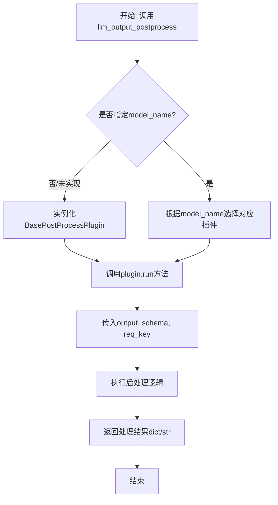
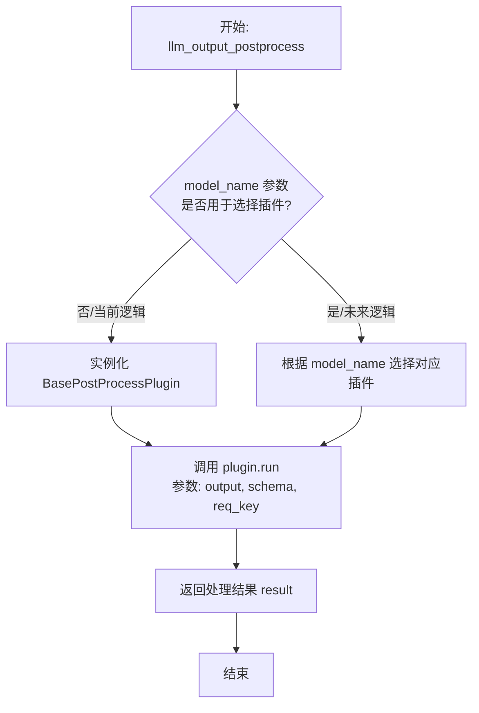
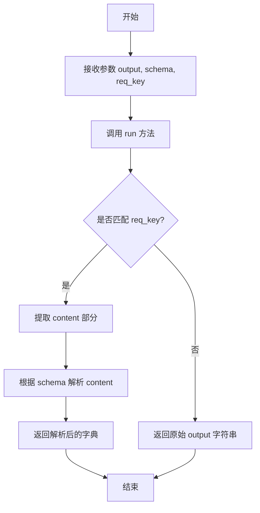

# `.\MetaGPT\metagpt\provider\postprocess\llm_output_postprocess.py` 详细设计文档

该文件是LLM（大语言模型）输出后处理的入口点，其核心功能是根据传入的模型名称（model_name）选择对应的后处理插件（PostProcessPlugin），对原始LLM输出文本（output）按照指定的模式（schema）和请求键（req_key）进行结构化处理，最终返回处理后的字典或字符串。当前版本默认使用基础后处理插件（BasePostProcessPlugin），为未来按模型选择特定插件预留了扩展接口。

## 整体流程



## 类结构

```
BasePostProcessPlugin (抽象基类/基础实现)
└── (未来可扩展) SpecificModelPostProcessPlugin
```

## 全局变量及字段


    

## 全局函数及方法


### `llm_output_postprocess`

该函数是处理特定LLM模型输出的入口点。它根据提供的模型名称（当前未实现选择逻辑）选择相应的后处理插件，默认使用基础后处理插件（`BasePostProcessPlugin`）来处理原始输出字符串，并根据给定的`schema`和`req_key`进行解析和格式化。

参数：

-  `output`：`str`，需要被后处理的原始LLM输出字符串。
-  `schema`：`dict`，一个定义了期望输出结构的字典，用于指导后处理插件如何解析和格式化`output`。
-  `req_key`：`str`，可选参数，默认为`"[/CONTENT]"`。用于在`output`中定位需要提取内容的关键标识符。
-  `model_name`：`str`，可选参数，默认为`None`。指定LLM模型的名称，理论上用于选择对应的后处理插件，但当前实现中此功能尚未完成（TODO）。

返回值：`Union[dict, str]`，返回经过后处理插件处理后的结果。根据`schema`和插件的处理逻辑，返回值可能是一个结构化的字典，也可能是一个字符串。

#### 流程图



#### 带注释源码

```python
def llm_output_postprocess(
    output: str, schema: dict, req_key: str = "[/CONTENT]", model_name: str = None
) -> Union[dict, str]:
    """
    default use BasePostProcessPlugin if there is not matched plugin.
    """
    # TODO choose different model's plugin according to the model
    # 当前代码中，model_name 参数未被使用，始终使用基础插件。
    # 这是一个待实现的功能点，未来应根据 model_name 动态选择对应的后处理插件。
    postprocess_plugin = BasePostProcessPlugin()

    # 调用后处理插件的核心方法，传入原始输出、结构定义和内容提取键。
    result = postprocess_plugin.run(output=output, schema=schema, req_key=req_key)
    return result
```


### `BasePostProcessPlugin.run`

该方法用于处理特定LLM模型的输出，根据提供的schema和请求键（req_key）对原始输出字符串进行解析和结构化，最终返回一个字典或字符串。

参数：

- `output`：`str`，LLM模型的原始输出字符串。
- `schema`：`dict`，定义输出结构的模式，用于指导解析过程。
- `req_key`：`str`，用于标识内容开始或结束的请求键，默认为"[/CONTENT]"。

返回值：`Union[dict, str]`，解析后的结构化数据（字典）或原始字符串（如果解析失败或不需要进一步处理）。

#### 流程图



#### 带注释源码

```python
def run(self, output: str, schema: dict, req_key: str = "[/CONTENT]") -> Union[dict, str]:
    """
    运行后处理插件，解析LLM输出。

    参数:
        output (str): LLM的原始输出字符串。
        schema (dict): 定义输出结构的模式。
        req_key (str): 用于标识内容开始或结束的请求键。

    返回:
        Union[dict, str]: 解析后的结构化数据或原始字符串。
    """
    # 检查输出中是否包含请求键
    if req_key in output:
        # 提取请求键之后的内容部分
        content = output.split(req_key)[1].strip()
        # 根据schema解析内容，返回结构化字典
        return self._parse_content(content, schema)
    else:
        # 如果不包含请求键，直接返回原始输出字符串
        return output
```

## 关键组件


### BasePostProcessPlugin

一个基础的后处理插件基类，用于处理特定LLM模型的输出，提供默认的后处理逻辑。

### llm_output_postprocess 函数

一个入口函数，根据模型名称选择相应的后处理插件来处理LLM的输出，默认使用BasePostProcessPlugin。

### 模型特定插件选择机制

一个待实现的功能，用于根据传入的模型名称动态选择对应的后处理插件，目前代码中通过TODO标记。


## 问题及建议


### 已知问题

-   **插件选择逻辑缺失**：当前代码中有一个 `TODO` 注释，表明尚未实现根据 `model_name` 参数选择不同后处理插件的逻辑。目前无论传入什么模型名称，都固定使用 `BasePostProcessPlugin`，这违背了函数设计的初衷，限制了代码的扩展性和对不同模型输出的适配能力。
-   **硬编码默认参数**：函数内部直接实例化 `BasePostProcessPlugin`，而不是通过一个可配置的工厂或映射机制来获取。这使得未来添加新插件时，需要修改此函数的核心逻辑，违反了开闭原则。
-   **参数 `model_name` 未被使用**：函数签名中定义了 `model_name` 参数，但在函数体内完全没有使用它，这可能导致调用者困惑，并使得代码的意图不清晰。
-   **缺乏插件注册或发现机制**：没有定义一个清晰的方式来注册新的 `PostProcessPlugin` 或让系统自动发现它们。随着支持的模型增多，管理这些插件将变得困难。

### 优化建议

-   **实现插件选择机制**：移除 `TODO`，实现一个插件注册表或工厂类。可以创建一个字典，将模型名称（或模型系列标识）映射到对应的 `PostProcessPlugin` 子类。`llm_output_postprocess` 函数根据 `model_name` 从这个注册表中查找并实例化相应的插件，如果未找到则回退到 `BasePostProcessPlugin`。
-   **使用插件工厂模式**：引入一个 `PostProcessPluginFactory` 类，负责所有插件的创建和生命周期管理。工厂可以维护插件注册信息，并提供 `get_plugin(model_name: str)` 方法。这样可以将插件选择逻辑从入口函数中解耦出来，使核心函数更简洁，也便于单元测试。
-   **将 `model_name` 设为可选并赋予默认值**：明确 `model_name` 参数的行为。如果调用者未提供或提供了 `None`，可以定义一个默认的插件（如 `BasePostProcessPlugin`）或根据其他启发式方法（如从 `output` 内容推断）选择插件。同时，在函数文档中清晰说明这一点。
-   **建立插件注册接口**：定义标准的插件注册方式，例如使用装饰器或配置文件。允许其他模块方便地声明“我为模型X提供后处理插件”。这提高了系统的可扩展性，符合插件化架构的设计理念。
-   **增强错误处理与日志**：在插件选择失败或插件执行过程中，添加更详细的错误日志或抛出更具描述性的异常。这有助于调试和监控系统在集成不同模型时的行为。


## 其它


### 设计目标与约束

本模块的核心设计目标是提供一个统一、可扩展的入口点，用于对来自不同大型语言模型（LLM）的原始输出进行后处理，将其转换为符合特定`schema`要求的结构化数据（`dict`）或字符串。其核心约束包括：1. **向后兼容性**：必须提供一个默认的后处理插件（`BasePostProcessPlugin`），以确保在没有匹配特定模型的插件时，系统仍能正常工作。2. **可扩展性**：架构设计需支持未来根据`model_name`动态选择或注册不同的后处理插件，而无需修改核心入口函数`llm_output_postprocess`的逻辑。3. **接口一致性**：所有后处理插件必须遵循`BasePostProcessPlugin`定义的`run`方法接口，保证调用方式统一。

### 错误处理与异常设计

当前代码中错误处理机制较为简单。`BasePostProcessPlugin().run()`方法内部可能抛出异常（例如，当`output`无法根据`schema`解析时），这些异常会直接向上传播给`llm_output_postprocess`的调用者。这是一种“快速失败”的策略。未来设计应考虑更精细的错误处理，例如：1. 定义模块级别的特定异常类（如`PostProcessError`），以区分后处理错误与其他系统错误。2. 在插件选择逻辑（当前为TODO）加入时，处理“未找到匹配插件”的情况，可能返回默认结果或抛出明确的`PluginNotFoundError`。3. 考虑在`run`方法或本函数中增加`try-except`块，对已知的可恢复错误（如格式轻微不符）进行重试或返回降级结果，对不可恢复错误则包装后抛出。

### 数据流与状态机

本模块的数据流是线性的、无状态的：1. **输入**：原始LLM输出字符串(`output`)、目标数据模式(`schema`)、可选的内容提取键(`req_key`)和模型标识(`model_name`)。2. **处理**：数据流入后处理插件（目前固定为`BasePostProcessPlugin`）的`run`方法。3. **输出**：处理后的结构化数据(`dict`)或字符串(`str`)。整个过程中没有内部状态维持，是一个纯函数式的处理过程。未来的“插件选择”步骤可能会引入一个简单的“路由”状态，即根据`model_name`映射到对应的插件实例，但这个路由表通常是静态或初始化时配置的，不构成运行时复杂状态机。

### 外部依赖与接口契约

1.  **外部依赖**：
    *   `metagpt.provider.postprocess.base_postprocess_plugin.BasePostProcessPlugin`：这是本模块直接依赖的核心类，提供了默认的后处理逻辑。任何对其`run`方法接口或行为的更改都会直接影响本模块。
    *   （隐式依赖）未来可能依赖的、其他具体的`PostProcessPlugin`子类，它们将通过某种机制（如注册表）被本模块发现和使用。
2.  **接口契约**：
    *   **输入契约**：调用者必须提供`output`和`schema`参数。`req_key`和`model_name`具有默认值，为可选。
    *   **输出契约**：函数返回`Union[dict, str]`，具体类型由后处理插件根据`schema`决定。调用者需要知晓`schema`与返回类型的对应关系。
    *   **插件契约**：任何用于本模块的后处理插件必须实现`BasePostProcessPlugin`的接口，特别是`run(output: str, schema: dict, req_key: str) -> Union[dict, str]`方法。这是本模块与具体后处理逻辑之间的关键契约。

### 配置与扩展点

1.  **当前配置**：目前行为是硬编码的，始终使用`BasePostProcessPlugin`。`req_key`参数提供了一个有限的配置点，用于指导默认插件如何提取内容。
2.  **核心扩展点**：代码中的`# TODO`注释明确指出了最主要的扩展点——**插件选择机制**。理想的实现是引入一个“插件管理器”或“注册表”，它维护一个`model_name`到`PostProcessPlugin`子类的映射。`llm_output_postprocess`函数将查询该注册表来获取插件实例，从而实现无需修改入口函数即可支持新模型。
3.  **次要扩展点**：`BasePostProcessPlugin`类本身的设计也是一个扩展点。通过继承并重写其`run`方法，可以创建具有不同解析策略、支持不同`schema`类型或具备额外功能（如日志、校验）的插件。

### 性能考量

当前实现性能开销极低，仅为一次对象实例化和一次方法调用。主要性能瓶颈将出现在`BasePostProcessPlugin.run()`方法内部的具体解析逻辑中，尤其是处理非常长或复杂的`output`和`schema`时。未来引入插件选择机制后，需注意：1. 插件查找（如字典查询）应保持O(1)时间复杂度。2. 应避免在每次函数调用时都重新初始化插件实例，应考虑使用单例模式或缓存机制来复用插件对象。3. 如果插件本身需要加载大量资源（如模型、规则库），应有惰性加载机制。

### 测试策略建议

1.  **单元测试**：
    *   `llm_output_postprocess`函数：测试其是否正确调用默认插件并返回结果；模拟插件抛出异常时，异常是否正确传播。
    *   （未来）测试插件选择逻辑：传入不同的`model_name`，验证是否返回了正确的插件实例。
2.  **集成测试**：
    *   将`llm_output_postprocess`与具体的`BasePostProcessPlugin`（或其子类）结合，使用具有代表性的`output`和`schema`组合，验证端到端的后处理功能是否符合预期。
    *   测试与上游（LLM调用）和下游（使用处理后数据的组件）的集成。
3.  **测试用例重点**：应覆盖`output`格式正确、格式错误、边界情况（空字符串、超长字符串）、`schema`简单与复杂、`req_key`存在与不存在等多种场景，以确保后处理的鲁棒性。

    