# `.\MetaGPT\metagpt\provider\qianfan_api.py` 详细设计文档

该代码实现了一个基于百度千帆平台的LLM（大语言模型）API提供者，支持文心一言（ERNIE）系列模型和开源模型。它封装了千帆SDK，提供了统一的异步/同步接口，并集成了成本管理、令牌计数和流式响应处理功能。

## 整体流程

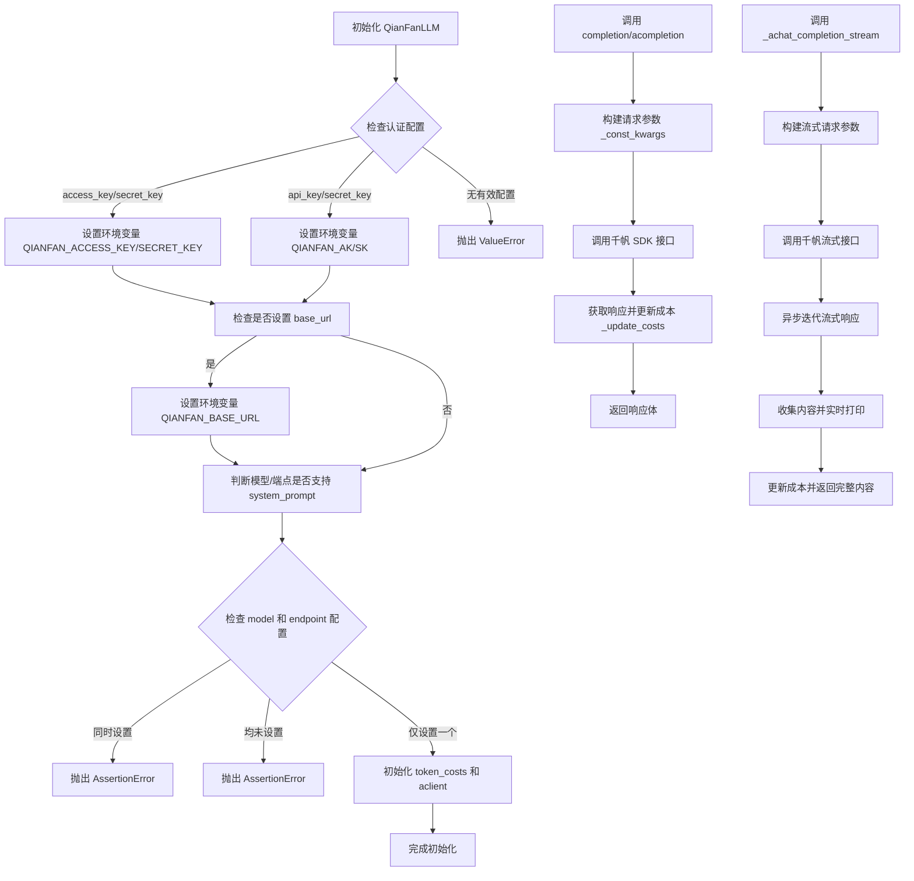

## 类结构

```
BaseLLM (抽象基类)
└── QianFanLLM (千帆平台LLM实现)
    ├── __init__
    ├── __init_qianfan
    ├── _const_kwargs
    ├── _update_costs
    ├── get_choice_text
    ├── completion
    ├── _achat_completion
    ├── acompletion
    └── _achat_completion_stream
```

## 全局变量及字段


### `QIANFAN_ENDPOINT_TOKEN_COSTS`
    
存储百度千帆平台不同API端点的输入和输出token单价（元/千token）的全局字典，用于成本计算。

类型：`dict[str, dict[str, float]]`
    


### `QIANFAN_MODEL_TOKEN_COSTS`
    
存储百度千帆平台不同模型名称的输入和输出token单价（元/千token）的全局字典，用于成本计算。

类型：`dict[str, dict[str, float]]`
    


### `USE_CONFIG_TIMEOUT`
    
一个全局常量，表示当调用方未显式指定超时时间时，应使用配置中定义的默认超时时间。

类型：`int`
    


### `QianFanLLM.config`
    
LLM的配置对象，包含模型、API密钥、端点、温度等运行时参数。

类型：`LLMConfig`
    


### `QianFanLLM.use_system_prompt`
    
指示当前配置的模型或端点是否支持系统提示词（system prompt）功能。

类型：`bool`
    


### `QianFanLLM.model`
    
当前使用的百度千帆大语言模型的名称（例如 'ERNIE-Bot-4'）。

类型：`str`
    


### `QianFanLLM.token_costs`
    
合并了模型和端点token单价后的字典，用于计算当前请求的实际token成本。

类型：`dict[str, dict[str, float]]`
    


### `QianFanLLM.calc_usage`
    
指示是否计算和记录本次API调用的token使用量及成本，对于自部署模型通常设为False。

类型：`bool`
    


### `QianFanLLM.aclinent`
    
百度千帆官方SDK的ChatCompletion客户端实例，用于发起同步和异步的聊天补全请求。

类型：`qianfan.ChatCompletion`
    


### `QianFanLLM.cost_manager`
    
成本管理器实例，负责跟踪和汇总所有API调用产生的token成本。

类型：`CostManager`
    
    

## 全局函数及方法


### `log_llm_stream`

这是一个用于记录大语言模型（LLM）流式响应内容的日志函数。它接收一个字符串参数，并将其输出到日志系统中，通常用于实时显示或记录模型生成文本的片段。

参数：

-  `content`：`str`，需要记录的大语言模型流式响应内容片段。

返回值：`None`，该函数不返回任何值。

#### 流程图

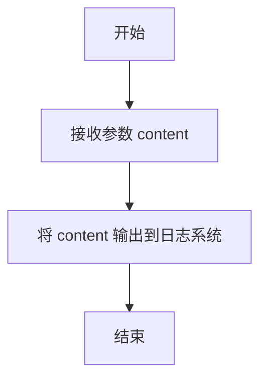

#### 带注释源码

```
# 从 metagpt.logs 模块导入 log_llm_stream 函数
from metagpt.logs import log_llm_stream

# 在异步流式响应处理循环中调用
async for chunk in resp:
    # 从响应块中提取文本内容
    content = chunk.body.get("result", "")
    # 调用 log_llm_stream 函数记录当前内容片段
    log_llm_stream(content)
    # 将内容片段收集到列表中，用于后续拼接完整响应
    collected_content.append(content)
# 在所有流式内容输出完毕后，记录一个换行符，通常用于格式化输出
log_llm_stream("\n")
```


### `register_provider`

这是一个装饰器函数，用于将特定的LLM提供商类（如`QianFanLLM`）注册到全局的提供商注册表中。它通过将提供商类与一个唯一的标识符（如`LLMType.QIANFAN`）关联起来，使得系统能够根据配置动态地实例化和使用对应的LLM服务。

参数：

-  `llm_type`：`LLMType`，一个枚举类型，用于唯一标识要注册的LLM提供商（例如：`LLMType.QIANFAN` 代表百度千帆）。

返回值：`Callable[[Type[BaseLLM]], Type[BaseLLM]]`，返回一个装饰器函数，该装饰器接收一个`BaseLLM`的子类作为参数，并将其注册后返回。

#### 流程图

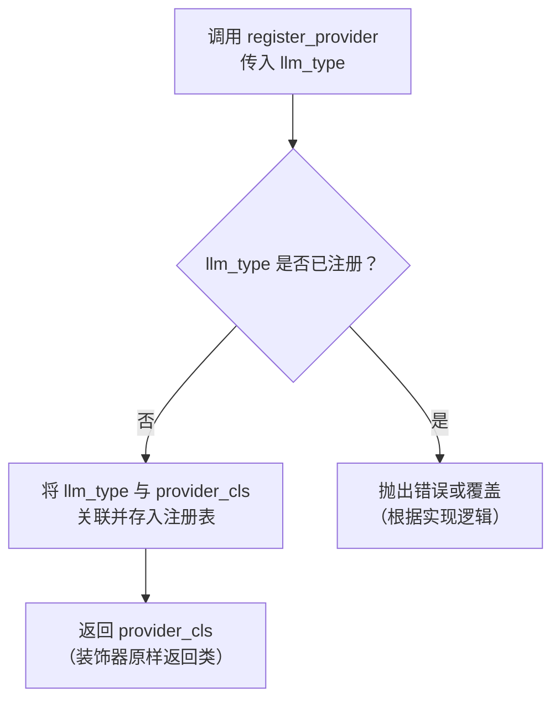

#### 带注释源码

```python
# 这是一个装饰器工厂函数，接收一个 llm_type 参数
def register_provider(llm_type: LLMType) -> Callable[[Type[BaseLLM]], Type[BaseLLM]]:
    """
    将 LLM 提供商类注册到全局注册表的装饰器。

    Args:
        llm_type (LLMType): 用于标识提供商类型的枚举值。

    Returns:
        Callable[[Type[BaseLLM]], Type[BaseLLM]]: 一个装饰器，它接收一个 BaseLLM 的子类，
        将其与 llm_type 关联并注册，然后返回该类本身。
    """
    # 定义内部装饰器函数
    def decorator(provider_cls: Type[BaseLLM]) -> Type[BaseLLM]:
        # 在此处，装饰器会将 provider_cls 和 llm_type 的映射关系
        # 存储到一个全局的注册表（例如字典）中。
        # 例如：_PROVIDER_REGISTRY[llm_type] = provider_cls
        # 这样，当系统需要创建 LLM 实例时，可以通过 llm_type 查找到对应的类。
        # 注意：实际的注册逻辑（如写入字典）在 `llm_provider_registry` 模块内部完成。
        # 装饰器最终返回原始的类，不影响其定义。
        return provider_cls
    # 返回装饰器函数
    return decorator
```


### `QianFanLLM.__init__`

该方法用于初始化 `QianFanLLM` 类，配置百度千帆大模型 API 的认证信息、模型参数、成本管理以及系统提示支持等。

参数：

- `config`：`LLMConfig`，包含大模型配置信息，如访问密钥、模型名称、端点等。

返回值：`None`，无返回值。

#### 流程图

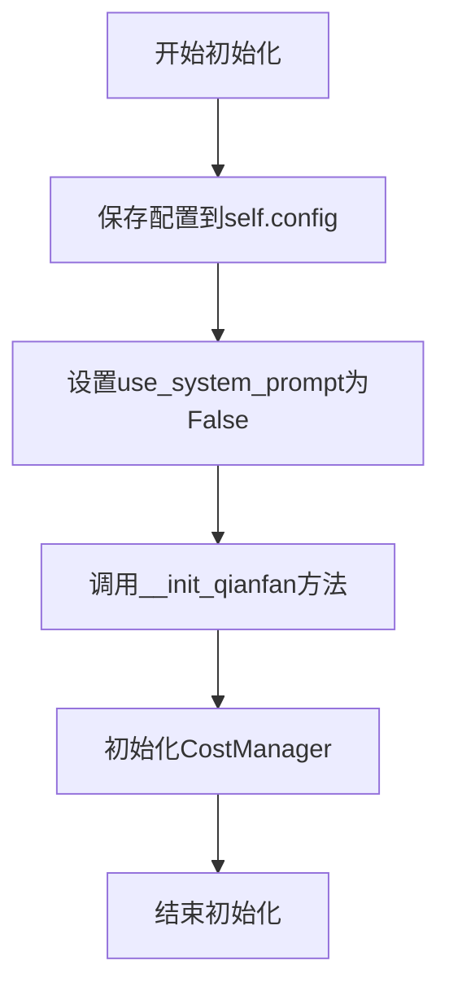

#### 带注释源码

```python
def __init__(self, config: LLMConfig):
    # 保存传入的配置对象
    self.config = config
    # 初始化时默认不支持系统提示，后续根据模型或端点判断是否支持
    self.use_system_prompt = False  # only some ERNIE-x related models support system_prompt
    # 调用私有方法进行千帆API的初始化设置
    self.__init_qianfan()
    # 初始化成本管理器，用于计算API调用的token成本
    self.cost_manager = CostManager(token_costs=self.token_costs)
```

### `QianFanLLM.__init_qianfan`

该方法用于初始化百度千帆大模型API的客户端配置。它根据传入的配置对象设置认证信息、模型或终端点参数，并确定是否支持系统提示。同时，它会初始化用于计算令牌成本的字典，并设置是否进行使用量计算的标志。

参数：
- `self`：`QianFanLLM`，当前类的实例，用于访问实例属性和方法。

返回值：`None`，该方法不返回任何值，仅用于初始化实例状态。

#### 流程图

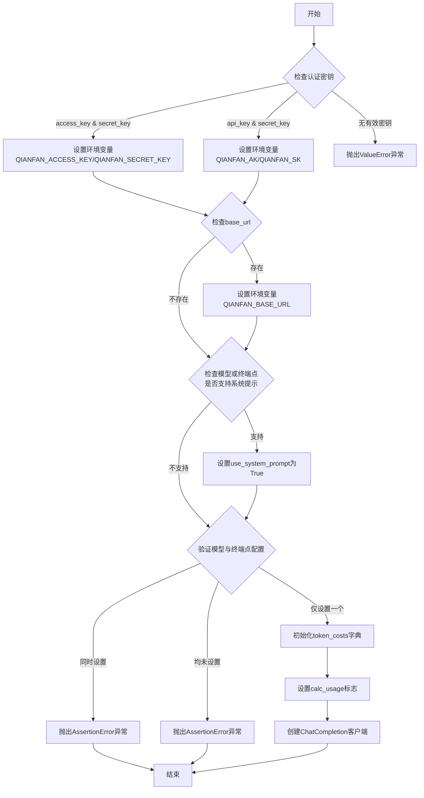

#### 带注释源码

```python
def __init_qianfan(self):
    # 从配置中获取模型名称
    self.model = self.config.model
    # 检查并设置系统级认证（推荐方式）
    if self.config.access_key and self.config.secret_key:
        # 根据官方推荐，将密钥设置为环境变量
        os.environ.setdefault("QIANFAN_ACCESS_KEY", self.config.access_key)
        os.environ.setdefault("QIANFAN_SECRET_KEY", self.config.secret_key)
    # 检查并设置应用级认证
    elif self.config.api_key and self.config.secret_key:
        # 根据官方推荐，将密钥设置为环境变量
        os.environ.setdefault("QIANFAN_AK", self.config.api_key)
        os.environ.setdefault("QIANFAN_SK", self.config.secret_key)
    else:
        # 如果未提供任何有效的密钥对，抛出异常
        raise ValueError("Set the `access_key`&`secret_key` or `api_key`&`secret_key` first")

    # 如果配置中提供了基础URL，则设置相应的环境变量
    if self.config.base_url:
        os.environ.setdefault("QIANFAN_BASE_URL", self.config.base_url)

    # 定义支持系统提示的模型与终端点对应关系
    support_system_pairs = [
        ("ERNIE-Bot-4", "completions_pro"),  # (model, corresponding-endpoint)
        ("ERNIE-Bot-8k", "ernie_bot_8k"),
        ("ERNIE-Bot", "completions"),
        ("ERNIE-Bot-turbo", "eb-instant"),
        ("ERNIE-Speed", "ernie_speed"),
        ("EB-turbo-AppBuilder", "ai_apaas"),
    ]
    # 如果当前模型在支持列表中，则启用系统提示功能
    if self.model in [pair[0] for pair in support_system_pairs]:
        self.use_system_prompt = True
    # 如果当前终端点在支持列表中，同样启用系统提示功能
    if self.config.endpoint in [pair[1] for pair in support_system_pairs]:
        self.use_system_prompt = True

    # 断言：模型和终端点不能同时设置，只能选择其一
    assert not (self.model and self.config.endpoint), "Only set `model` or `endpoint` in the config"
    # 断言：模型和终端点必须至少设置一个
    assert self.model or self.config.endpoint, "Should set one of `model` or `endpoint` in the config"

    # 初始化令牌成本字典，合并模型和终端点的成本数据
    self.token_costs = copy.deepcopy(QIANFAN_MODEL_TOKEN_COSTS)
    self.token_costs.update(QIANFAN_ENDPOINT_TOKEN_COSTS)

    # 设置是否计算使用量的标志：仅当配置要求计算且未指定终端点（即使用预定义模型）时才计算
    self.calc_usage = self.config.calc_usage and self.config.endpoint is None
    # 创建千帆聊天补全客户端实例
    self.aclient: ChatCompletion = qianfan.ChatCompletion()
```

### `QianFanLLM._const_kwargs`

该方法用于构建调用千帆大模型API时所需的参数字典。它根据类实例的配置（如模型、端点、温度）和传入的消息列表，生成一个符合千帆API调用规范的参数字典。特别地，它会处理系统提示（system prompt），如果模型支持且消息列表的第一个角色是“system”，则会将其提取出来作为独立的`system`参数。

参数：

- `messages`：`list[dict]`，包含对话消息的列表，每个消息是一个字典，通常包含`role`和`content`键。
- `stream`：`bool`，默认为`False`，指示是否使用流式响应。

返回值：`dict`，返回一个包含调用千帆API所需参数的字典。

#### 流程图

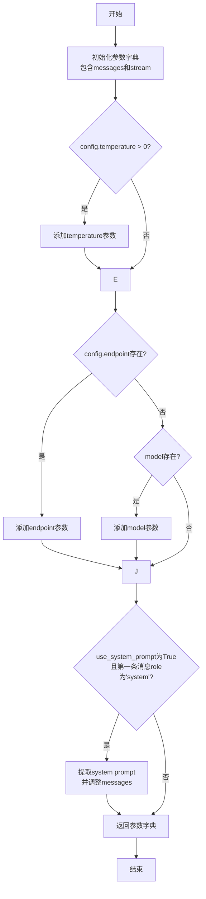

#### 带注释源码

```python
def _const_kwargs(self, messages: list[dict], stream: bool = False) -> dict:
    # 初始化基础参数字典，包含消息列表和流式控制标志
    kwargs = {
        "messages": messages,
        "stream": stream,
    }
    # 如果配置中指定了温度参数（大于0），则添加到参数字典中
    if self.config.temperature > 0:
        # different model has default temperature. only set when it's specified.
        kwargs["temperature"] = self.config.temperature
    # 如果配置中指定了端点（endpoint），则使用端点参数
    if self.config.endpoint:
        kwargs["endpoint"] = self.config.endpoint
    # 否则，如果配置中指定了模型（model），则使用模型参数
    elif self.model:
        kwargs["model"] = self.model

    # 如果当前模型支持系统提示（system prompt）
    if self.use_system_prompt:
        # 检查消息列表的第一条消息角色是否为'system'
        if messages[0]["role"] == "system":
            # 将系统提示从消息列表中移除，并作为独立的'system'参数传递
            kwargs["messages"] = messages[1:]  # 移除第一条系统消息
            kwargs["system"] = messages[0]["content"]  # 将系统消息内容设为system参数
    # 返回构建好的参数字典
    return kwargs
```

### `QianFanLLM._update_costs`

该方法用于更新每次请求的令牌成本。它根据模型或端点信息，结合本地计算使用标志，调用父类的 `_update_costs` 方法来更新成本。

参数：

- `usage`：`dict`，包含令牌使用情况（如 `prompt_tokens`、`completion_tokens`、`total_tokens`）的字典。

返回值：`None`，无返回值。

#### 流程图

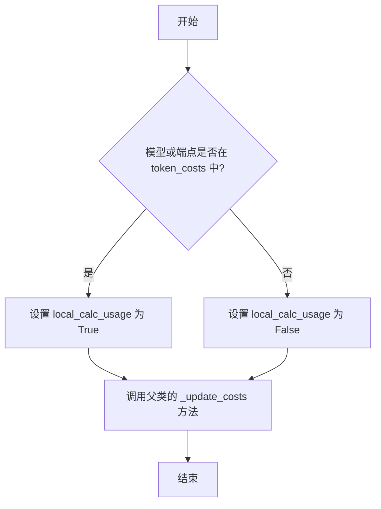

#### 带注释源码

```python
def _update_costs(self, usage: dict):
    """update each request's token cost"""
    # 确定当前使用的模型或端点
    model_or_endpoint = self.model or self.config.endpoint
    # 检查该模型或端点是否在 token_costs 字典中，以决定是否本地计算使用量
    local_calc_usage = model_or_endpoint in self.token_costs
    # 调用父类 BaseLLM 的 _update_costs 方法，传入使用量、模型/端点信息和本地计算标志
    super()._update_costs(usage, model_or_endpoint, local_calc_usage)
```

### `QianFanLLM.get_choice_text`

该方法用于从百度千帆大模型API的响应体中提取生成的文本内容。

参数：

- `resp`：`JsonBody`，百度千帆大模型API的响应体，通常是一个字典。

返回值：`str`，从响应体中提取出的文本结果。如果响应体中不存在`"result"`键，则返回空字符串。

#### 流程图

```mermaid
flowchart TD
    A[开始] --> B{resp 中是否存在 'result' 键?}
    B -- 是 --> C[返回 resp.get('result', '')]
    B -- 否 --> D[返回空字符串 '']
    C --> E[结束]
    D --> E
```

#### 带注释源码

```python
def get_choice_text(self, resp: JsonBody) -> str:
    # 从响应体字典中获取键为 "result" 的值，如果键不存在则返回空字符串。
    return resp.get("result", "")
```

### `QianFanLLM.completion`

该方法用于向百度千帆大模型平台发起同步的聊天补全请求，并返回模型的响应结果。它处理了请求参数的构建、系统提示的适配、成本计算以及响应结果的提取。

参数：

- `messages`：`list[dict]`，一个字典列表，每个字典代表一条消息，通常包含`role`（如`"user"`, `"assistant"`, `"system"`）和`content`（消息内容）字段。
- `timeout`：`int`，请求的超时时间（秒），默认值为`USE_CONFIG_TIMEOUT`。

返回值：`JsonBody`，一个字典类型，包含了千帆API返回的完整响应体，其中`result`字段通常包含模型生成的文本。

#### 流程图

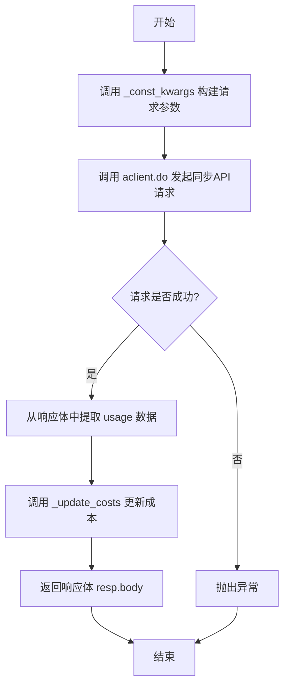

#### 带注释源码

```python
def completion(self, messages: list[dict], timeout: int = USE_CONFIG_TIMEOUT) -> JsonBody:
    # 1. 构建请求参数：调用内部方法 _const_kwargs，传入消息列表和 stream=False（非流式）。
    #    该方法会根据配置（如模型、端点、温度、是否支持系统提示）生成最终的API调用参数字典。
    resp = self.aclient.do(**self._const_kwargs(messages=messages, stream=False), request_timeout=timeout)
    # 2. 更新成本：从API响应体（resp.body）中获取本次请求的token使用情况（usage），
    #    并调用 _update_costs 方法更新成本管理器中的累计消耗。
    self._update_costs(resp.body.get("usage", {}))
    # 3. 返回结果：将API的完整响应体（一个字典）返回给调用者。
    return resp.body
```

### `QianFanLLM._achat_completion`

该方法是一个异步方法，用于向百度千帆平台发起一次非流式的聊天补全请求，处理请求参数，调用底层API，并更新本次请求的Token消耗成本。

参数：

- `messages`：`list[dict]`，包含对话历史和当前请求的消息列表，每个消息是一个字典，通常包含`role`和`content`键。
- `timeout`：`int`，请求的超时时间（秒），默认使用配置中的超时时间。

返回值：`JsonBody`，一个字典类型，包含千帆API返回的完整响应体，其中`result`字段通常包含模型生成的文本。

#### 流程图

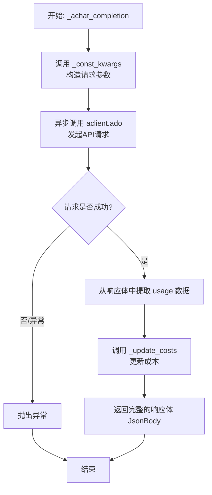

#### 带注释源码

```python
async def _achat_completion(self, messages: list[dict], timeout: int = USE_CONFIG_TIMEOUT) -> JsonBody:
    # 1. 使用内部方法 _const_kwargs 根据 messages 和 stream=False 标志构造API调用所需的关键字参数。
    #    此方法会处理模型/终端点选择、温度设置以及系统提示词（如果模型支持）的提取。
    resp = await self.aclient.ado(**self._const_kwargs(messages=messages, stream=False), request_timeout=timeout)
    
    # 2. 从API响应体（resp.body）中获取本次请求的Token使用情况（usage字典）。
    #    如果响应中没有usage字段，则使用一个空字典作为默认值。
    self._update_costs(resp.body.get("usage", {}))
    
    # 3. 将完整的API响应体返回给调用者。
    return resp.body
```

### `QianFanLLM.acompletion`

该方法用于异步调用百度千帆大模型的对话补全接口，根据传入的消息列表生成模型回复，并处理超时和成本计算。

参数：

- `messages`：`list[dict]`，包含对话历史的消息列表，每个消息是一个字典，通常包含"role"和"content"键。
- `timeout`：`int`，请求的超时时间（秒），默认使用配置中的超时时间。

返回值：`JsonBody`，千帆API返回的响应体，通常包含模型生成的回复结果和token使用信息。

#### 流程图

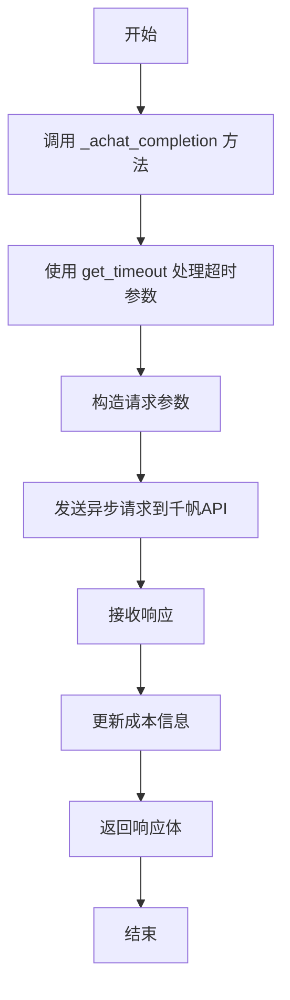

#### 带注释源码

```python
async def acompletion(self, messages: list[dict], timeout: int = USE_CONFIG_TIMEOUT) -> JsonBody:
    # 调用内部异步聊天补全方法，并传入处理后的超时时间
    return await self._achat_completion(messages, timeout=self.get_timeout(timeout))
```

### `QianFanLLM._achat_completion_stream`

该方法用于异步调用百度千帆大模型的流式对话补全接口，实时接收并处理模型返回的文本流，最终拼接成完整的回复内容。

参数：
- `messages`：`list[dict]`，对话消息列表，每个元素是一个包含`role`和`content`的字典。
- `timeout`：`int`，请求超时时间（秒），默认为配置中的超时时间。

返回值：`str`，模型返回的完整文本内容。

#### 流程图

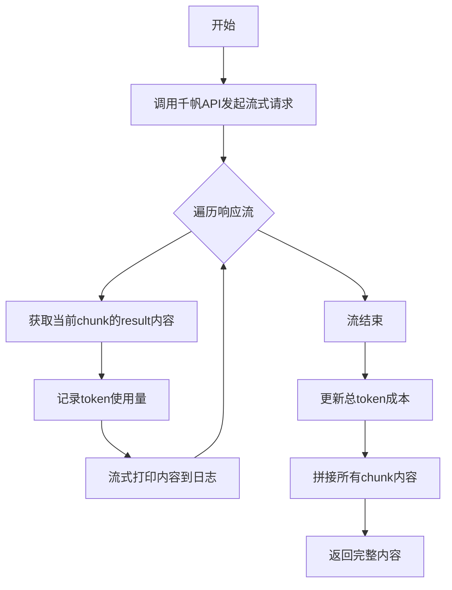

#### 带注释源码

```python
async def _achat_completion_stream(self, messages: list[dict], timeout: int = USE_CONFIG_TIMEOUT) -> str:
    # 调用千帆API的异步流式接口，传入消息和超时参数
    resp = await self.aclient.ado(**self._const_kwargs(messages=messages, stream=True), request_timeout=timeout)
    
    collected_content = []  # 用于收集每个流片段的文本内容
    usage = {}  # 用于记录token使用量，初始化为空字典
    
    # 异步迭代响应流
    async for chunk in resp:
        # 从chunk中提取result字段，即模型返回的文本片段
        content = chunk.body.get("result", "")
        # 从chunk中提取usage字段，记录token使用情况
        usage = chunk.body.get("usage", {})
        # 将当前文本片段流式打印到日志
        log_llm_stream(content)
        # 将文本片段添加到收集列表中
        collected_content.append(content)
    
    # 流结束后打印换行符，标记流结束
    log_llm_stream("\n")
    
    # 根据收集到的usage信息更新成本
    self._update_costs(usage)
    
    # 将所有收集到的文本片段拼接成完整的回复内容
    full_content = "".join(collected_content)
    
    # 返回完整的回复内容
    return full_content
```

## 关键组件


### 千帆API集成

封装了百度千帆平台的大语言模型API调用，支持文心一言（ERNIE）系列模型及开源模型，提供了同步/异步的对话补全和流式响应功能。

### 认证与配置管理

支持系统级（access_key/secret_key）和应用级（api_key/secret_key）两种认证方式，通过环境变量进行配置。同时管理模型/终端点选择、温度参数、系统提示支持等调用配置。

### 成本管理器

集成成本管理组件，根据官方定价表（`QIANFAN_MODEL_TOKEN_COSTS` 和 `QIANFAN_ENDPOINT_TOKEN_COSTS`）自动计算并累计每次API调用的Token消耗。

### 系统提示支持适配

识别并适配支持系统提示（system prompt）的特定ERNIE模型（如ERNIE-Bot-4, ERNIE-Bot等），在构造请求参数时，将消息列表中的系统角色消息提取并转换为千帆API要求的`system`参数格式。

### 流式响应处理

提供异步流式响应处理能力，能够逐块接收模型生成的内容，实时打印日志，并最终拼接成完整回复，同时从流式响应的最后一个块中提取Token使用量信息用于成本计算。


## 问题及建议


### 已知问题

-   **环境变量设置存在潜在冲突**：`__init_qianfan` 方法中，根据不同的认证方式（系统级或应用级）设置不同的环境变量（`QIANFAN_ACCESS_KEY`/`QIANFAN_SECRET_KEY` 或 `QIANFAN_AK`/`QIANFAN_SK`）。如果在一个进程中初始化多个不同配置的 `QianFanLLM` 实例，后初始化的实例会覆盖之前设置的环境变量，可能导致前一个实例的认证信息失效。
-   **系统提示词支持判断逻辑可能不完整**：`support_system_pairs` 列表定义了支持系统提示词的模型与端点的映射关系。如果百度千帆平台新增了支持系统提示词的模型或端点，此硬编码列表需要手动更新，否则新模型/端点将无法使用系统提示词功能，存在维护滞后风险。
-   **流式响应处理未考虑增量usage**：在 `_achat_completion_stream` 方法中，usage 信息是从最后一个 chunk 中获取的。根据一些LLM API的设计，usage 可能在整个流式响应完成后才在最后一个chunk中返回，或者每个chunk都包含增量usage。当前代码假设最后一个chunk包含完整的usage，如果千帆API的行为与此假设不符，可能导致成本计算不准确。
-   **异常处理不完整**：代码中（如 `__init_qianfan` 中的 `assert` 语句）在参数校验不通过时会直接抛出 `AssertionError`，以及认证信息缺失时抛出 `ValueError`。然而，在 `completion`、`_achat_completion` 和 `_achat_completion_stream` 等核心方法中，没有对底层 `qianfan` SDK 调用可能抛出的网络异常、API限流、认证失败等异常进行捕获和处理，异常会直接向上层抛出，缺乏重试、降级或友好的错误信息封装。

### 优化建议

-   **避免使用环境变量进行实例级配置**：建议直接使用 `qianfan.ChatCompletion(ak=..., sk=...)` 或 `qianfan.ChatCompletion(access_key=..., secret_key=...)` 的方式在创建 `ChatCompletion` 客户端时传入认证信息，而不是通过设置全局环境变量。这样可以实现多个实例的配置隔离，避免相互干扰。
-   **将模型能力判断外部化或可配置化**：考虑将 `support_system_pairs` 这类模型特性映射关系移至配置文件或通过一个可扩展的注册机制（如从远程API获取）来管理。这样可以提高代码的灵活性和可维护性，无需修改代码即可适配平台的能力变更。
-   **增强流式响应的成本计算健壮性**：查阅千帆API文档，确认流式响应中 `usage` 字段的返回方式。如果每个chunk包含增量usage，则应累积计算；如果只在最后返回，则维持现状。可以在代码中添加注释说明此假设，并考虑在无法获取usage时记录警告。
-   **完善异常处理与重试机制**：在核心的API调用方法周围添加 `try-except` 块，捕获 `qianfan` SDK 可能抛出的特定异常（如 `QianfanError`）。实现指数退避等重试逻辑以应对暂时的网络故障或限流。将底层异常封装为业务域的自定义异常，并提供更清晰的错误上下文。同时，将 `assert` 语句改为更友好的 `if-raise ValueError` 形式，以提供更明确的错误信息。
-   **考虑添加请求参数验证**：在 `_const_kwargs` 方法中，可以添加对 `messages` 格式（例如，必须为非空列表，包含 `role` 和 `content` 键）的基础验证，提前发现调用错误。
-   **优化 `calc_usage` 逻辑**：`calc_usage` 字段的逻辑是当 `self.config.calc_usage` 为 `True` 且 `self.config.endpoint` 为 `None` 时才计算成本。这个逻辑注释说明是针对自部署模型的。建议将此逻辑的判断条件或注释写得更清晰，或者提供一个配置项让用户明确指定是否对当前模型/端点进行成本计算。


## 其它


### 设计目标与约束

本模块的核心设计目标是提供一个与百度千帆平台大语言模型（LLM）服务对接的标准化接口，继承自`BaseLLM`抽象基类，以支持MetaGPT框架的统一LLM调用范式。主要约束包括：1) 必须兼容千帆平台两种认证方式（AK/SK与API Key/Secret Key）；2) 需适配千帆平台部分模型不支持`system`角色的特性，并做相应转换；3) 需集成成本管理功能，根据模型或终结点计算Token消耗；4) 需支持同步与异步调用、流式与非流式响应。

### 错误处理与异常设计

模块的错误处理主要分为初始化验证和运行时异常两类。初始化时，通过`assert`语句强制校验`model`和`endpoint`配置的互斥性与必填性，若配置无效则抛出`AssertionError`。当认证密钥（`access_key`/`secret_key`或`api_key`/`secret_key`）未设置时，抛出`ValueError`。运行时，依赖底层`qianfan` SDK进行API调用，其可能抛出的网络异常、认证失败、配额不足、参数错误等异常会直接向上层传递，由调用方（如MetaGPT框架）的统一错误处理机制捕获和处理。模块内部不进行复杂的重试或降级处理。

### 数据流与状态机

模块的数据流始于`LLMConfig`配置对象，包含模型、终结点、认证密钥等参数。初始化阶段，根据配置设置环境变量、初始化`qianfan.ChatCompletion`客户端、判断是否支持系统提示，并初始化成本管理器。调用阶段，用户传入`messages`列表（OpenAI格式），`_const_kwargs`方法根据配置和模型支持情况，将其转换为千帆API所需的参数格式（如处理`system`角色）。请求发送至千帆API，返回的响应体（`JsonBody`）经`get_choice_text`提取文本内容，同时`_update_costs`方法根据响应中的`usage`信息更新成本。整个过程无复杂的内部状态变迁，主要状态体现在`CostManager`中累计的Token消耗。

### 外部依赖与接口契约

**外部依赖：**
1.  **`qianfan` SDK**: 核心依赖，用于与百度千帆云服务进行实际通信。版本兼容性需遵循该SDK的更新。
2.  **`metagpt` 框架模块**: 依赖`BaseLLM`基类、配置结构体`LLMConfig`、常量`USE_CONFIG_TIMEOUT`、日志工具`log_llm_stream`、提供商注册机制`register_provider`、成本管理器`CostManager`及Token计数工具`QIANFAN_MODEL_TOKEN_COSTS`等。这定义了模块在MetaGPT生态系统中的集成契约。

**接口契约：**
1.  **对上游（调用方）契约**: 实现`BaseLLM`定义的抽象接口`completion`, `acompletion`，返回`JsonBody`（即`Dict`），提供同步/异步的文本补全能力。
2.  **对下游（千帆API）契约**: 遵循千帆平台ChatCompletion API的调用规范（参数格式、认证方式、流式响应格式）。通过环境变量传递认证信息，通过`model`或`endpoint`参数指定服务目标。
3.  **配置契约**: 依赖`LLMConfig`对象提供所有必要配置项，遵循其字段定义（如`model`, `endpoint`, `access_key`, `api_key`, `temperature`, `calc_usage`等）。

### 安全考虑

模块的安全设计主要围绕认证信息的处理。采用环境变量（`QIANFAN_ACCESS_KEY`/`QIANFAN_SECRET_KEY` 或 `QIANFAN_AK`/`QIANFAN_SK`）而非硬编码或直接传入SDK的方式来传递敏感密钥，这有助于避免密钥意外泄露在日志或代码中。然而，环境变量的生命周期管理（如设置、清除）责任在于模块的初始化代码及部署环境，需确保生产环境中这些变量的安全存储与注入。模块本身不涉及输出内容的安全过滤或用户输入验证。

### 测试策略建议

1.  **单元测试**: 应覆盖`__init_qianfan`方法对不同配置路径（AK/SK vs API Key/SK，有无`base_url`，`model` vs `endpoint`）的处理；`_const_kwargs`方法对`system`提示的提取与转换逻辑；`_update_costs`方法在不同`calc_usage`和模型/终结点下的成本计算逻辑。
2.  **集成测试**: 需要实际有效的千帆平台认证信息，测试`completion`和`acompletion`方法能否成功调用API并返回预期格式的结果。应包含对支持和不支持`system`提示的模型的测试用例。
3.  **模拟测试**: 使用`unittest.mock`模拟`qianfan.ChatCompletion`及其`do`/`ado`方法，模拟API的成功响应、异常抛出及流式响应，以验证模块的异常处理、流式数据拼接和成本更新逻辑，而无需真实网络调用。
4.  **配置验证测试**: 测试在无效配置（如两者都未设置`model`和`endpoint`，或两者都设置）下，初始化是否能正确抛出断言错误。


    