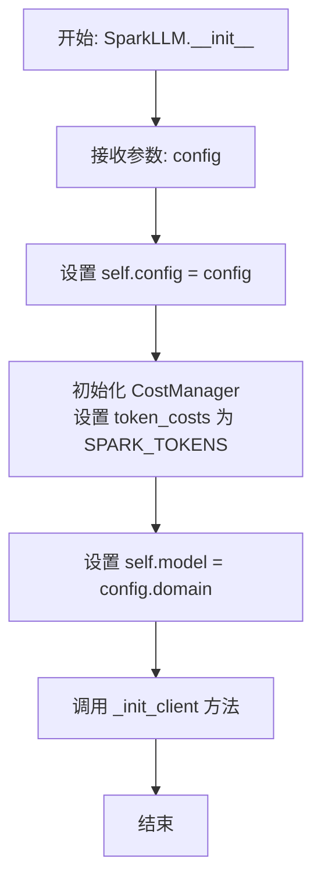
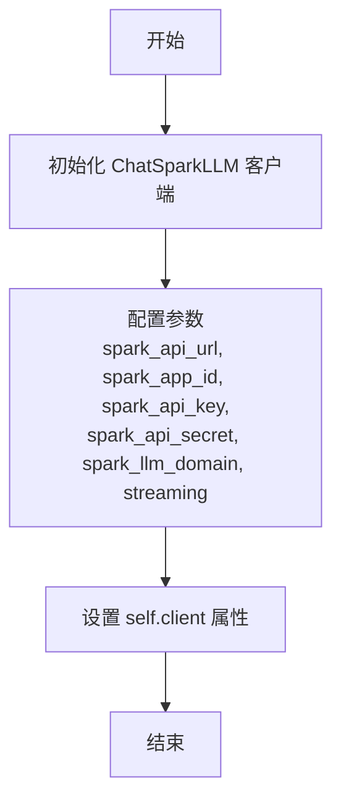
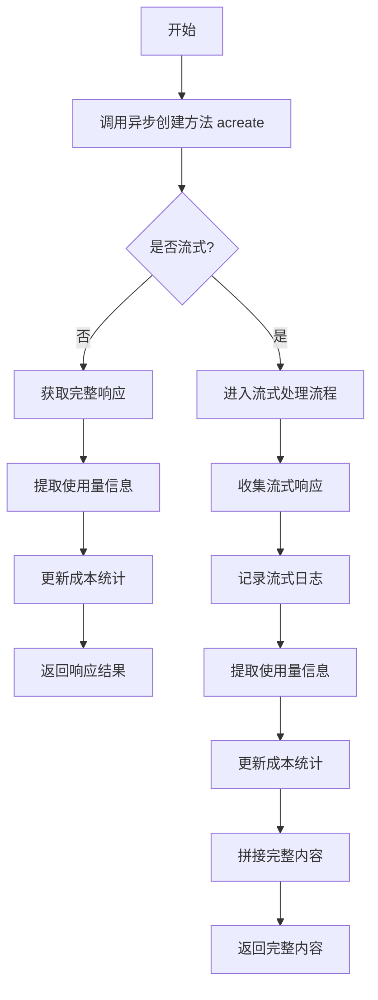
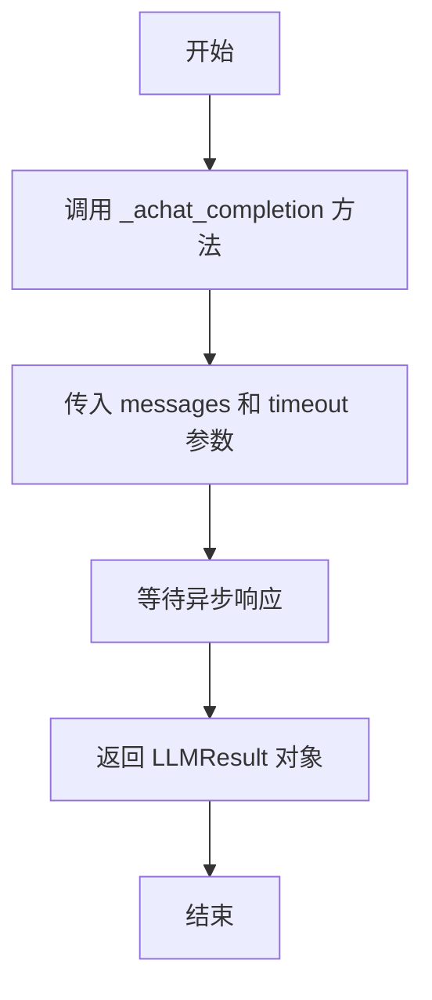
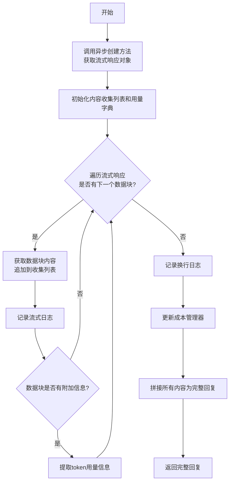
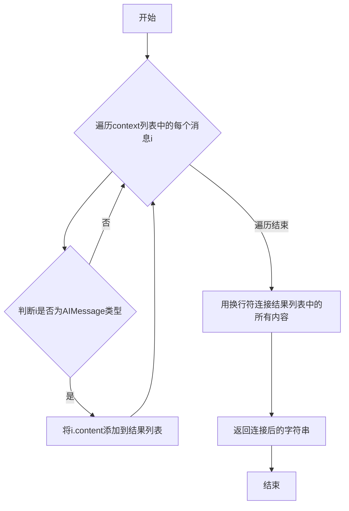
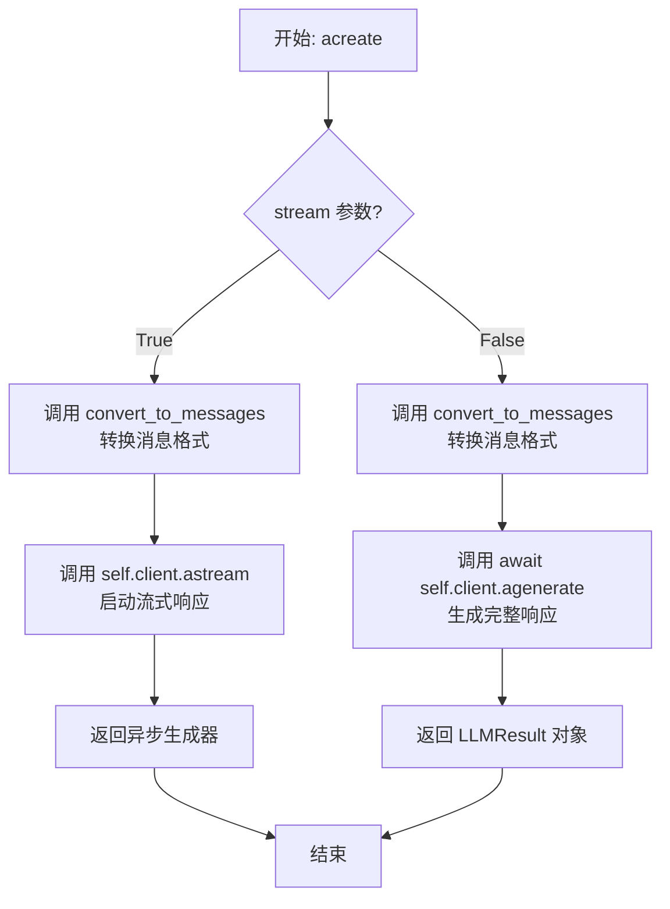

# `.\MetaGPT\metagpt\provider\spark_api.py` 详细设计文档

该代码是MetaGPT框架中用于集成讯飞星火大模型的LLM提供商实现。它继承自基础LLM类，封装了与星火API的交互逻辑，包括同步/异步聊天补全、流式响应处理、成本管理和消息格式转换等功能。

## 整体流程

```mermaid
graph TD
    A[用户调用SparkLLM] --> B{初始化配置}
    B --> C[_init_client: 创建ChatSparkLLM客户端]
    C --> D[准备就绪]
    D --> E{用户请求类型?}
    E -- 同步聊天 --> F[_achat_completion]
    F --> G[acreate(stream=False)]
    G --> H[client.agenerate]
    H --> I[获取LLMResult]
    I --> J[get_usage计算token]
    J --> K[_update_costs更新成本]
    K --> L[返回响应]
    E -- 流式聊天 --> M[_achat_completion_stream]
    M --> N[acreate(stream=True)]
    N --> O[client.astream]
    O --> P[迭代流式响应]
    P --> Q[收集内容并记录日志]
    Q --> R[获取token使用量]
    R --> S[_update_costs更新成本]
    S --> T[返回完整内容]
    E -- 消息转换 --> U[_system_msg/_user_msg/_assistant_msg]
    U --> V[_convert_to_message]
    V --> W[返回对应Message类型]
```

## 类结构

```
BaseLLM (抽象基类)
└── SparkLLM (讯飞星火实现)
    ├── 字段: config, cost_manager, model, client
    ├── 初始化: __init__, _init_client
    ├── 消息转换: _system_msg, _user_msg, _assistant_msg
    ├── 响应处理: get_choice_text, get_usage, _extract_assistant_rsp
    ├── 核心接口: _achat_completion, acompletion, _achat_completion_stream, acreate
    └── 成本管理: _update_costs (继承自BaseLLM)
```

## 全局变量及字段


### `SparkLLM.config`
    
LLM配置对象，包含星火大模型API的URL、App ID、API Key、API Secret、模型域等连接和认证信息。

类型：`LLMConfig`
    


### `SparkLLM.cost_manager`
    
成本管理器，用于跟踪和计算API调用的Token消耗和费用。

类型：`CostManager`
    


### `SparkLLM.model`
    
当前使用的星火大模型域（domain），从config.domain初始化而来。

类型：`str`
    


### `SparkLLM.client`
    
星火大模型API的底层客户端实例，用于发起实际的聊天补全请求。

类型：`ChatSparkLLM`
    
    

## 全局函数及方法


### `SparkLLM.__init__`

`SparkLLM` 类的构造函数，用于初始化讯飞星火大模型提供商的客户端。它接收一个包含所有必要配置（如API密钥、URL、应用ID等）的 `LLMConfig` 对象，并据此设置内部状态，包括配置对象、成本管理器和模型名称，最后调用 `_init_client` 方法来创建底层的 `ChatSparkLLM` 客户端实例。

参数：

-  `config`：`LLMConfig`，包含连接和配置讯飞星火大模型所需的所有参数，如 `base_url`、`app_id`、`api_key`、`api_secret`、`domain` 等。

返回值：`None`，构造函数不显式返回值。

#### 流程图



#### 带注释源码

```python
def __init__(self, config: LLMConfig):
    # 将传入的配置对象保存到实例变量中，供类内其他方法使用
    self.config = config
    # 初始化成本管理器，用于跟踪和计算API调用的token消耗成本
    # SPARK_TOKENS 是一个预定义的字典，定义了不同token类型的成本
    self.cost_manager = CostManager(token_costs=SPARK_TOKENS)
    # 将配置中的模型域名（domain）保存为当前使用的模型标识
    self.model = self.config.domain
    # 调用内部方法，根据配置创建并初始化底层的星火大模型客户端
    self._init_client()
```


### `SparkLLM._init_client`

该方法用于初始化讯飞星火大模型的客户端实例，配置必要的连接参数并启用流式响应。

参数：无

返回值：`None`，该方法不返回任何值，其作用是在类实例中设置 `self.client` 属性。

#### 流程图



#### 带注释源码

```python
def _init_client(self):
    # 使用配置中的参数创建 ChatSparkLLM 客户端实例
    self.client = ChatSparkLLM(
        # 星火 API 的基础 URL，来自配置
        spark_api_url=self.config.base_url,
        # 星火应用的 App ID，来自配置
        spark_app_id=self.config.app_id,
        # 星火 API 的密钥，来自配置
        spark_api_key=self.config.api_key,
        # 星火 API 的密钥，来自配置
        spark_api_secret=self.config.api_secret,
        # 星火大模型的领域/版本，来自配置
        spark_llm_domain=self.config.domain,
        # 启用流式响应，以便支持异步流式生成
        streaming=True,
    )
```

### `SparkLLM._system_msg`

该方法用于将输入的字符串消息转换为 `SystemMessage` 对象，作为系统角色消息在对话中使用。

参数：

- `msg`：`str`，需要转换的字符串消息

返回值：`SystemMessage`，转换后的系统消息对象

#### 流程图

```mermaid
flowchart TD
    A[开始] --> B[接收字符串参数 msg]
    B --> C[调用 _convert_to_message(msg)]
    C --> D[返回 SystemMessage 对象]
    D --> E[结束]
```

#### 带注释源码

```python
def _system_msg(self, msg: str) -> SystemMessage:
    # 调用 _convert_to_message 函数将字符串转换为消息对象
    # 该函数会根据消息内容自动判断并返回相应的消息类型
    # 对于系统消息，返回 SystemMessage 实例
    return _convert_to_message(msg)
```

### `SparkLLM._user_msg`

该方法用于将用户输入的字符串消息转换为 `HumanMessage` 对象，以便与星火大模型进行交互。

参数：

- `msg`：`str`，用户输入的文本消息。
- `**kwargs`：`Any`，可变关键字参数，用于接收额外的参数，但在当前实现中未使用。

返回值：`HumanMessage`，转换后的用户消息对象。

#### 流程图

```mermaid
flowchart TD
    A[开始] --> B[接收参数 msg 和 **kwargs]
    B --> C[调用 _convert_to_message(msg)]
    C --> D[返回 HumanMessage 对象]
    D --> E[结束]
```

#### 带注释源码

```python
def _user_msg(self, msg: str, **kwargs) -> HumanMessage:
    # 调用 _convert_to_message 函数，将字符串消息转换为 HumanMessage 对象
    return _convert_to_message(msg)
```

### `SparkLLM._assistant_msg`

该方法用于将给定的字符串消息转换为一个 `AIMessage` 对象，该对象代表来自 AI 助手的消息。这是构建与星火大模型交互所需的消息格式链中的一个环节。

参数：

- `msg`：`str`，表示 AI 助手消息内容的字符串。

返回值：`AIMessage`，一个封装了 AI 助手消息内容的对象。

#### 流程图

```mermaid
flowchart TD
    A[开始] --> B[接收字符串参数 msg]
    B --> C[调用 _convert_to_message(msg)]
    C --> D[返回 AIMessage 对象]
    D --> E[结束]
```

#### 带注释源码

```python
def _assistant_msg(self, msg: str) -> AIMessage:
    # 调用 _convert_to_message 函数，将输入的字符串 msg 转换为对应的消息对象。
    # 根据 sparkai 库的实现，当输入是普通字符串时，_convert_to_message 会将其识别并创建为 AIMessage。
    return _convert_to_message(msg)
```


### `SparkLLM.get_choice_text`

该方法用于从大语言模型（LLM）的响应结果对象 `LLMResult` 中，提取出第一个候选生成文本（即模型返回的主要回答内容）。这是处理LLM API返回结果的一个通用步骤，旨在将结构化的响应对象转换为纯文本字符串，便于后续处理或展示。

参数：

-  `rsp`：`LLMResult`，大语言模型调用后返回的完整响应结果对象，其中包含了生成文本、使用量等信息。

返回值：`str`，从响应结果中提取出的第一个候选生成文本。

#### 流程图

```mermaid
flowchart TD
    A[开始: 输入 LLMResult rsp] --> B[访问 rsp.generations 列表]
    B --> C[获取第一个元素 generations[0] <br>（类型为 List[Generation]）]
    C --> D[从该列表中获取第一个 Generation 对象 <br> generations[0][0]]
    D --> E[访问该 Generation 对象的 text 属性]
    E --> F[返回 text 字符串]
    F --> G[结束]
```

#### 带注释源码

```python
def get_choice_text(self, rsp: LLMResult) -> str:
    # 从 LLMResult 响应对象中提取文本。
    # 1. `rsp.generations` 是一个列表的列表，外层列表通常对应不同的输入提示（prompt），
    #    内层列表对应同一个提示下模型生成的多个候选回答（n>1 时）。
    # 2. `rsp.generations[0]` 获取第一个（通常也是唯一一个）输入提示对应的所有候选回答列表。
    # 3. `rsp.generations[0][0]` 获取该提示下的第一个（通常也是主要或最佳）候选回答对象（Generation）。
    # 4. `.text` 属性包含了该候选回答的纯文本内容。
    return rsp.generations[0][0].text
```


### `SparkLLM.get_usage`

该方法用于从讯飞星火大模型的响应对象中提取令牌使用量信息。

参数：

- `response`：`LLMResult`，包含大模型生成结果的响应对象。

返回值：`dict`，返回一个字典，包含令牌使用量的详细信息（如`prompt_tokens`、`completion_tokens`、`total_tokens`）。如果响应中不包含令牌使用信息，则返回空字典`{}`。

#### 流程图

```mermaid
graph TD
    A[开始] --> B{response.generations[0][0].message<br/>是否有 additional_kwargs 属性?};
    B -- 是 --> C[从 additional_kwargs 中获取 token_usage];
    B -- 否 --> D[返回空字典 {}];
    C --> E[返回 token_usage 字典];
    D --> F[结束];
    E --> F;
```

#### 带注释源码

```python
def get_usage(self, response: LLMResult):
    # 从响应结果中提取第一条生成结果的消息对象
    message = response.generations[0][0].message
    # 检查消息对象是否包含 additional_kwargs 属性
    if hasattr(message, "additional_kwargs"):
        # 如果存在，则尝试从中获取 token_usage 信息，若不存在则返回空字典
        return message.additional_kwargs.get("token_usage", {})
    else:
        # 如果消息对象没有 additional_kwargs 属性，直接返回空字典
        return {}
```

### `SparkLLM._achat_completion`

该方法用于异步调用讯飞星火大模型，执行一次非流式的聊天补全请求。它接收消息列表，调用底层API，处理响应，并更新成本统计。

参数：

- `messages`：`list[dict]`，包含对话历史的消息列表，每条消息是一个字典，通常包含`role`和`content`字段。
- `timeout`：`int`，请求超时时间，默认使用配置中的超时设置。

返回值：`LLMResult`，包含模型生成的响应结果，如生成的文本、使用量等信息。

#### 流程图



#### 带注释源码

```python
async def _achat_completion(self, messages: list[dict], timeout=USE_CONFIG_TIMEOUT):
    # 调用异步创建方法，stream=False表示非流式响应
    response = await self.acreate(messages, stream=False)
    # 从响应中提取token使用量信息
    usage = self.get_usage(response)
    # 根据使用量更新成本统计
    self._update_costs(usage)
    # 返回完整的响应结果
    return response
```

### `SparkLLM.acompletion`

该方法用于异步调用讯飞星火大模型进行非流式对话补全。它接收一个消息列表，调用底层的异步聊天完成方法，并处理返回的响应，包括更新成本统计。

参数：

- `messages`：`list[dict]`，表示对话历史的消息列表，每个消息是一个字典，通常包含角色（如"user"、"assistant"）和内容。
- `timeout`：`int`，请求的超时时间，默认使用配置中的超时设置。

返回值：`LLMResult`，包含大模型生成的响应结果，如生成的文本、使用量等信息。

#### 流程图



#### 带注释源码

```python
async def acompletion(self, messages: list[dict], timeout=USE_CONFIG_TIMEOUT):
    # 调用内部的异步聊天完成方法，传入消息列表和超时参数
    return await self._achat_completion(messages, timeout)
```

### `SparkLLM._achat_completion_stream`

该方法用于与讯飞星火大模型进行异步流式对话，接收消息列表，以流式方式获取AI的回复，并实时记录日志。最终，它将所有流式返回的内容片段拼接成一个完整的回复字符串，并更新本次调用的成本。

参数：

- `messages`：`list[dict]`，一个字典列表，每个字典代表一条消息，通常包含角色（如"user"、"assistant"、"system"）和内容。
- `timeout`：`int`，请求的超时时间，默认使用配置中的超时设置。

返回值：`str`，AI模型返回的完整回复内容。

#### 流程图



#### 带注释源码

```python
async def _achat_completion_stream(self, messages: list[dict], timeout: int = USE_CONFIG_TIMEOUT) -> str:
    # 1. 调用底层的异步创建方法，指定流式输出模式，获取响应对象。
    response = await self.acreate(messages, stream=True)
    
    # 2. 初始化变量：用于收集所有流式返回的内容片段和最终的token用量。
    collected_content = []
    usage = {}
    
    # 3. 异步迭代流式响应对象，逐个处理返回的数据块。
    async for chunk in response:
        # 3.1 将当前数据块的内容文本追加到收集列表中。
        collected_content.append(chunk.content)
        # 3.2 调用日志函数，实时输出当前内容片段（通常用于控制台显示流式效果）。
        log_llm_stream(chunk.content)
        # 3.3 检查数据块是否包含附加信息（如token用量），若有则提取并更新usage字典。
        if hasattr(chunk, "additional_kwargs"):
            usage = chunk.additional_kwargs.get("token_usage", {})
    
    # 4. 流式响应结束后，记录一个换行符，通常用于格式化日志输出。
    log_llm_stream("\n")
    # 5. 根据提取到的token用量信息，更新成本管理器中的累计成本。
    self._update_costs(usage)
    # 6. 将收集到的所有内容片段拼接成一个完整的字符串。
    full_content = "".join(collected_content)
    # 7. 返回完整的AI回复内容。
    return full_content
```

### `SparkLLM._extract_assistant_rsp`

该方法用于从对话上下文中提取所有AI助手的回复内容。它遍历传入的消息列表，筛选出类型为`AIMessage`的消息，并将这些消息的文本内容用换行符连接成一个字符串返回。

参数：

- `context`：`list[BaseMessage]`，一个包含多种类型消息（如系统消息、用户消息、AI消息）的列表，代表完整的对话上下文。

返回值：`str`，一个字符串，其中包含了所有AI助手消息的内容，每条消息内容之间用换行符分隔。

#### 流程图



#### 带注释源码

```python
def _extract_assistant_rsp(self, context: list[BaseMessage]) -> str:
    # 使用列表推导式，遍历上下文中的每条消息
    # any_to_str(i) 将消息对象转换为字符串表示，检查其中是否包含 "AIMessage"
    # 如果包含，则取出该消息的内容 i.content
    # 最后，使用换行符 "\n" 将所有筛选出的AI消息内容连接成一个字符串
    return "\n".join([i.content for i in context if "AIMessage" in any_to_str(i)])
```

### `SparkLLM.acreate`

该方法用于异步创建与讯飞星火大模型的对话交互，支持流式和非流式两种响应模式。它接收一个消息列表，将其转换为模型所需的格式，并根据`stream`参数调用底层客户端的相应方法生成响应。

参数：

- `messages`：`list[dict]`，一个字典列表，每个字典代表一条消息，通常包含角色（如"user"、"assistant"）和内容。
- `stream`：`bool`，默认为`True`。指示是否以流式方式获取响应。为`True`时返回异步生成器，为`False`时返回完整的`LLMResult`对象。

返回值：`Union[AsyncGenerator[AIMessage, None], LLMResult]`，当`stream=True`时，返回一个异步生成器，每次迭代产生一个`AIMessage`对象（包含部分响应内容）；当`stream=False`时，返回一个`LLMResult`对象，包含完整的生成结果和元数据。

#### 流程图



#### 带注释源码

```python
async def acreate(self, messages: list[dict], stream: bool = True):
    # 1. 将输入的字典列表格式的消息，转换为底层 spark-ai-python SDK 所需的 Message 对象列表。
    messages = convert_to_messages(messages)
    
    # 2. 根据 stream 参数决定调用方式。
    if stream:
        # 2.1 流式模式：返回一个异步生成器，允许客户端逐步接收响应片段。
        return self.client.astream(messages)
    else:
        # 2.2 非流式模式：异步等待并返回完整的生成结果。
        return await self.client.agenerate([messages])
```

## 关键组件


### 讯飞星火大模型客户端适配器

将MetaGPT框架的通用LLM接口适配到讯飞星火大模型（SparkAI）的Python SDK，实现了异步对话、流式响应和成本管理功能。

### 消息转换与类型映射

通过`_convert_to_message`和`convert_to_messages`函数，将框架内部的消息字典格式转换为SparkAI SDK所需的`BaseMessage`子类（如`SystemMessage`, `HumanMessage`, `AIMessage`），实现不同消息系统间的桥接。

### 异步流式响应处理

在`_achat_completion_stream`方法中，通过异步迭代器处理星火大模型返回的流式响应，实时收集内容片段并记录日志，最后拼接成完整回复，同时从响应块中提取token使用量。

### 成本管理与用量统计

利用`CostManager`类，根据预定义的`SPARK_TOKENS`成本表，在每次API调用后通过`_update_costs`方法，根据从响应中提取的`token_usage`信息，计算并累计本次调用的费用。

### 提供商注册机制

通过`@register_provider(LLMType.SPARK)`装饰器，将`SparkLLM`类注册到MetaGPT的LLM提供商注册表中，使得框架能够根据配置动态选择和使用星火大模型作为后端。


## 问题及建议


### 已知问题

-   **错误处理机制不完善**：代码中多处使用了 `hasattr` 来检查对象属性（如 `message.additional_kwargs` 和 `chunk.additional_kwargs`），但未对属性不存在或访问失败的情况提供明确的错误处理或回退方案。这可能导致在 API 响应格式与预期不符时，程序静默失败或抛出 `AttributeError`。
-   **流式响应处理逻辑存在缺陷**：在 `_achat_completion_stream` 方法中，`usage` 变量在每次循环迭代中都被覆盖。如果流式响应的最后一个 `chunk` 不包含 `token_usage` 信息，则之前收集到的用量信息会丢失，导致成本计算不准确。
-   **类型注解不完整**：部分方法（如 `_system_msg`, `_user_msg`, `_assistant_msg`）的返回类型注解为 `_convert_to_message` 的返回值，但未明确指定具体的 `BaseMessage` 子类（如 `SystemMessage`, `HumanMessage`, `AIMessage`），降低了代码的可读性和类型检查的准确性。
-   **配置超时参数未充分利用**：`acompletion` 和 `_achat_completion_stream` 方法虽然接收 `timeout` 参数，但在调用底层 `ChatSparkLLM` 客户端时并未显式传递该参数。如果客户端不支持或未配置超时，可能导致请求长时间挂起。
-   **潜在的资源泄漏风险**：在流式处理（`astream`）中，代码通过异步迭代器消费数据，但未显式处理迭代器的关闭或异常情况下的资源清理。

### 优化建议

-   **增强错误处理与日志记录**：建议在 `get_usage` 和 `_achat_completion_stream` 方法中，当 `additional_kwargs` 或 `token_usage` 不存在时，记录警告日志并返回一个空的默认字典 `{}`，而不是静默继续。同时，考虑对 `acreate` 等核心调用进行 `try-except` 包装，捕获网络异常或 API 错误，并转换为统一的业务异常。
-   **修正流式响应用量收集逻辑**：修改 `_achat_completion_stream` 方法中的 `usage` 收集逻辑。建议初始化 `usage = {}`，然后在循环中，如果当前 `chunk` 包含 `token_usage`，则使用 `dict.update()` 方法合并用量信息，而不是直接覆盖。这样可以确保收集到所有 `chunk` 中的用量数据。
-   **完善类型注解**：为 `_system_msg`, `_user_msg`, `_assistant_msg` 等方法添加更精确的返回类型注解，例如 `-> SystemMessage`, `-> HumanMessage`, `-> AIMessage`。这有助于静态类型检查工具（如 mypy）进行验证，并提升代码的清晰度。
-   **显式传递超时配置**：检查 `ChatSparkLLM` 客户端是否支持 `timeout` 参数。如果支持，在 `_init_client` 初始化或 `acreate` 调用时，将配置中的 `timeout` 值传递给客户端，确保网络请求有合理的超时控制。
-   **实现上下文管理器或资源清理**：对于流式响应，考虑使用 `async with` 上下文管理器来包装 `client.astream` 的调用（如果客户端支持），以确保在流处理结束或发生异常时，网络连接等资源能被正确关闭和释放。
-   **考虑添加请求重试机制**：对于网络波动或 API 限流导致的临时性失败，可以在 `acreate` 或更上层的方法中引入带有退避策略的重试逻辑，以提高服务的鲁棒性。
-   **统一消息转换接口**：`_system_msg`, `_user_msg`, `_assistant_msg` 目前都直接调用 `_convert_to_message`。可以评估是否需要在 `SparkLLM` 类内部提供一个统一的 `_convert_message` 方法，根据消息角色调用不同的底层函数，使内部逻辑更清晰，并便于未来扩展。


## 其它


### 设计目标与约束

本模块的设计目标是为 MetaGPT 框架提供对讯飞星火大模型（Spark AI）的适配支持，使其能够作为统一的 LLM 提供者之一被框架调用。核心约束包括：1) 必须继承并实现 `BaseLLM` 抽象基类定义的接口；2) 必须遵循 `register_provider` 注册机制，以便框架能动态发现和使用；3) 需要与 Spark AI 官方的 Python SDK (`spark-ai-python`) 进行交互，并适配其消息格式和调用方式；4) 需要集成成本管理 (`CostManager`) 和 Token 计数功能。

### 错误处理与异常设计

当前代码中显式的错误处理逻辑较少，主要依赖底层 `ChatSparkLLM` 客户端和 `BaseLLM` 基类进行异常抛出。潜在需要处理的异常包括：网络请求超时、API 密钥无效、额度不足、模型服务不可用、以及响应格式不符合预期等。`_achat_completion` 和 `_achat_completion_stream` 方法中的 `try...except` 块可以更完善，以捕获特定异常并转换为框架统一的错误类型或进行重试。`get_usage` 方法使用了 `hasattr` 来防御性检查属性，避免了因响应结构变化导致的 `AttributeError`。

### 数据流与状态机

数据流始于外部调用（如 `acompletion` 或流式调用），传入 `messages` 列表。`acreate` 方法作为核心分发点，使用 `convert_to_messages` 将通用消息格式转换为 Spark AI SDK 所需的 `BaseMessage` 列表。根据 `stream` 参数，数据流分为两支：
1.  **非流式**：调用 `client.agenerate`，返回完整的 `LLMResult`，随后通过 `get_usage` 提取 token 消耗信息，调用 `_update_costs` 更新成本，最后返回响应。
2.  **流式**：调用 `client.astream`，返回一个异步迭代器。在 `_achat_completion_stream` 中迭代该流，实时收集内容块并日志输出，同时尝试从每个块中提取累计的 `token_usage`。流结束后，汇总内容、更新成本并返回完整响应。
整个类本身是无状态的（Stateless），每次调用都是独立的。状态主要体现在 `CostManager` 实例中，它累计记录了 token 消耗和成本。

### 外部依赖与接口契约

1.  **外部库依赖**：
    *   `sparkai`：讯飞星火大模型的官方 Python SDK。本模块的核心功能依赖于 `ChatSparkLLM`、`_convert_to_message`、`convert_to_messages`、`LLMResult` 以及各类 `Message` 类。
    *   `metagpt`：框架本体。依赖其配置系统 (`LLMConfig`)、常量、基类 (`BaseLLM`)、提供者注册机制、日志工具、通用工具函数 (`any_to_str`) 以及成本管理和 Token 计数模块。

2.  **接口契约**：
    *   **对上游 (MetaGPT框架)**：必须实现 `BaseLLM` 中定义的 `_achat_completion`、`_achat_completion_stream`、`get_choice_text`、`_system_msg`、`_user_msg`、`_assistant_msg` 等抽象方法。必须通过 `@register_provider(LLMType.SPARK)` 完成注册。
    *   **对下游 (Spark AI 服务)**：通过实例化的 `ChatSparkLLM` 客户端对象，调用其 `agenerate`（非流式）或 `astream`（流式）方法，并遵循其输入（`List[BaseMessage]`）和输出（`LLMResult` 或异步流）格式约定。
    *   **内部契约**：`get_usage` 方法假设响应中的 `generations[0][0].message` 对象可能包含 `additional_kwargs` 字典，并从其中获取 `token_usage`。`_extract_assistant_rsp` 方法依赖于 `any_to_str(i)` 的结果包含类名来判断消息类型。

    