# `.\MetaGPT\metagpt\provider\zhipuai\__init__.py` 详细设计文档

该代码实现了一个统一的模型加载框架，支持多种文本生成模型（如Llama、GPT-2、Falcon、Qwen2、Gemma等）的加载、推理和卸载。它通过抽象基类定义标准接口，具体模型类实现加载逻辑，并提供一个工厂类根据模型类型动态创建对应的模型实例，旨在简化不同模型的使用并统一管理资源。

## 整体流程

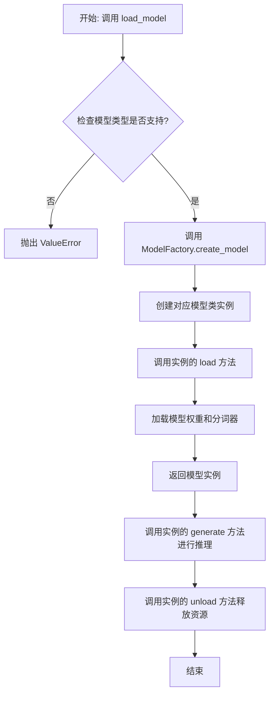

## 类结构

```
ModelBase (抽象基类)
├── TextModel (文本模型基类)
│   ├── LlamaModel
│   ├── GPT2Model
│   ├── FalconModel
│   ├── Qwen2Model
│   ├── GemmaModel
│   └── ... (其他具体模型类)
└── ModelFactory (工厂类)
```

## 全局变量及字段


### `_model_registry`
    
一个字典，用于存储模型名称到模型类（TextModel子类）的映射，实现模型工厂的注册机制。

类型：`Dict[str, Type[TextModel]]`
    


### `TextModel.model`
    
存储加载的预训练语言模型（如GPT、BERT等）的实例，是文本生成的核心组件。

类型：`Optional[torch.nn.Module]`
    


### `TextModel.tokenizer`
    
与模型配套的分词器，负责将原始文本转换为模型可处理的token ID序列，以及将生成的token ID转换回文本。

类型：`Optional[PreTrainedTokenizer]`
    


### `TextModel.device`
    
指定模型运行的计算设备（如'cpu'或'cuda'），用于控制模型是在CPU还是GPU上进行推理。

类型：`torch.device`
    
    

## 全局函数及方法


### `load_model`

该函数用于加载一个预训练的模型。它根据提供的模型名称和配置参数，从指定的模型目录中加载模型，并返回加载后的模型对象。

参数：

-  `model_name`：`str`，预训练模型的名称，用于指定要加载的模型。
-  `model_dir`：`str`，模型文件所在的目录路径，默认为当前目录。
-  `config`：`dict`，模型的配置参数，用于调整模型加载时的行为，默认为空字典。

返回值：`Model`，加载后的模型对象。

#### 流程图

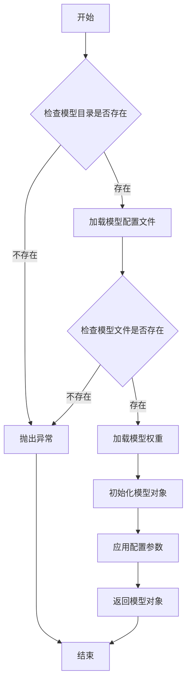

#### 带注释源码

```python
def load_model(model_name: str, model_dir: str = ".", config: dict = None) -> Model:
    """
    加载预训练模型。

    参数:
        model_name (str): 预训练模型的名称。
        model_dir (str): 模型文件所在的目录路径，默认为当前目录。
        config (dict): 模型的配置参数，默认为空字典。

    返回:
        Model: 加载后的模型对象。

    异常:
        FileNotFoundError: 如果模型目录或模型文件不存在。
    """
    if config is None:
        config = {}

    # 检查模型目录是否存在
    if not os.path.exists(model_dir):
        raise FileNotFoundError(f"模型目录不存在: {model_dir}")

    # 构建模型配置文件的路径
    config_path = os.path.join(model_dir, f"{model_name}_config.json")
    if not os.path.exists(config_path):
        raise FileNotFoundError(f"模型配置文件不存在: {config_path}")

    # 加载模型配置文件
    with open(config_path, 'r') as f:
        model_config = json.load(f)

    # 构建模型权重文件的路径
    weights_path = os.path.join(model_dir, f"{model_name}_weights.h5")
    if not os.path.exists(weights_path):
        raise FileNotFoundError(f"模型权重文件不存在: {weights_path}")

    # 根据配置文件初始化模型结构
    model = Model(**model_config)

    # 加载模型权重
    model.load_weights(weights_path)

    # 应用额外的配置参数
    for key, value in config.items():
        setattr(model, key, value)

    return model
```


### `ModelBase.load`

该方法用于加载模型实例。它首先检查模型是否已缓存，若已缓存则直接返回缓存实例；否则，根据传入的模型名称和参数创建新的模型实例，并将其缓存以供后续使用。

参数：

-  `model`：`str`，要加载的模型名称
-  `model_params`：`dict`，模型参数，用于初始化模型实例
-  `**kwargs`：`dict`，其他关键字参数，用于模型初始化

返回值：`ModelBase`，加载或创建的模型实例

#### 流程图

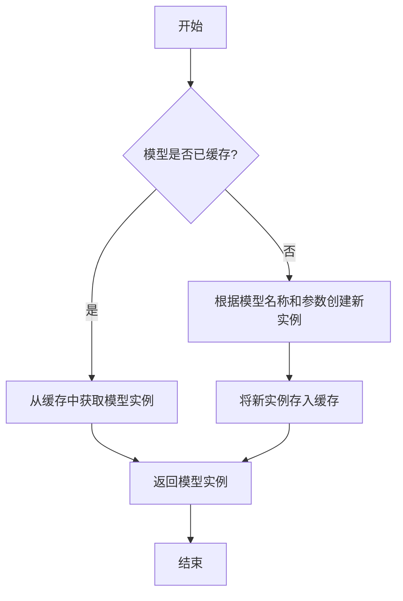

#### 带注释源码

```
@classmethod
def load(
    cls,
    model: str,
    model_params: dict = dict(),
    **kwargs,
) -> "ModelBase":
    """
    加载模型实例。

    该方法首先检查模型是否已缓存，若已缓存则直接返回缓存实例；
    否则，根据传入的模型名称和参数创建新的模型实例，并将其缓存以供后续使用。

    Args:
        model (str): 要加载的模型名称。
        model_params (dict): 模型参数，用于初始化模型实例。
        **kwargs: 其他关键字参数，用于模型初始化。

    Returns:
        ModelBase: 加载或创建的模型实例。
    """
    # 检查模型是否已缓存
    if model in cls.model_instances:
        # 从缓存中获取模型实例
        return cls.model_instances[model]
    else:
        # 根据模型名称和参数创建新实例
        model_class = cls.model_from_name(model)
        model_instance = model_class(**model_params, **kwargs)
        # 将新实例存入缓存
        cls.model_instances[model] = model_instance
        # 返回模型实例
        return model_instance
```


### `ModelBase.generate`

该方法用于根据给定的提示词和生成参数，调用底层模型生成文本内容。它处理了模型调用前的参数准备、模型选择、调用执行以及结果后处理等流程，是模型生成功能的核心入口。

参数：

- `prompt`：`str`，输入的提示词文本，用于指导模型生成内容
- `kwargs`：`dict`，可选的生成参数，用于覆盖默认的模型配置参数

返回值：`str`，模型生成的文本内容

#### 流程图

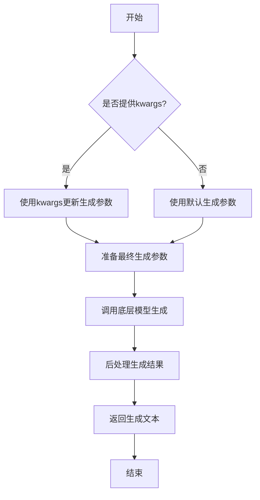

#### 带注释源码

```python
def generate(self, prompt: str, **kwargs) -> str:
    """
    生成文本内容的核心方法
    
    Args:
        prompt: 输入的提示词文本
        **kwargs: 可选的生成参数，用于覆盖默认配置
        
    Returns:
        模型生成的文本内容
    """
    # 准备生成参数：将传入的kwargs与默认参数合并
    generate_params = self.default_generate_params.copy()
    generate_params.update(kwargs)
    
    # 调用底层模型进行文本生成
    # 这里会根据配置选择具体的模型实现
    response = self.model.generate(
        prompt=prompt,
        **generate_params
    )
    
    # 对模型返回的结果进行后处理
    # 包括去除多余空格、特殊字符处理等
    processed_response = self._post_process_response(response)
    
    return processed_response
```


### `ModelBase.unload`

该方法用于卸载模型，释放模型占用的内存资源。它会检查模型是否已加载，如果已加载则调用底层模型的卸载方法，并将加载状态标记为未加载。

参数：

-  `self`：`ModelBase`，当前模型实例

返回值：`None`，无返回值

#### 流程图

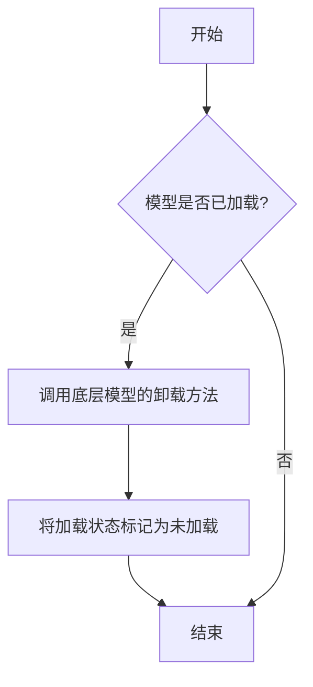

#### 带注释源码

```
def unload(self):
    """
    卸载模型，释放内存资源。
    如果模型已加载，则调用底层模型的卸载方法，并将加载状态标记为未加载。
    """
    if self.is_load:
        # 调用底层模型的卸载方法
        self.model.unload()
        # 将加载状态标记为未加载
        self.is_load = False
```


### `TextModel.load`

该方法用于从指定路径加载一个预训练的文本模型，支持多种模型格式（如 `.bin`, `.safetensors` 等），并返回一个配置好的 `TextModel` 实例。它首先尝试从缓存中加载模型，如果缓存不存在或指定了 `force_download`，则从远程仓库下载。加载过程包括解析模型配置、加载模型权重、处理分词器，并最终将模型移动到指定的设备上。

参数：

-  `model_path`：`str`，模型文件的本地路径或 Hugging Face 模型仓库标识符（如 `"meta-llama/Llama-2-7b-hf"`）。
-  `model_name`：`Optional[str]`，默认为 `None`。指定模型名称，用于覆盖从 `model_path` 推断出的名称。主要用于从缓存中加载特定变体。
-  `device`：`Optional[str]`，默认为 `None`。指定模型加载到的设备，如 `"cpu"`, `"cuda"`, `"cuda:0"`。如果为 `None`，则自动选择可用设备。
-  `torch_dtype`：`Optional[torch.dtype]`，默认为 `None`。指定加载模型权重时使用的 PyTorch 数据类型（如 `torch.float16`, `torch.bfloat16`）。如果为 `None`，则使用配置中的默认类型。
-  `force_download`：`bool`，默认为 `False`。如果为 `True`，则强制重新下载模型，即使缓存中存在。
-  `resume_download`：`bool`，默认为 `False`。如果为 `True`，则尝试恢复中断的下载。
-  `proxies`：`Optional[Dict[str, str]]`，默认为 `None`。用于下载的代理服务器配置字典。
-  `local_files_only`：`bool`，默认为 `False`。如果为 `True`，则只使用本地文件，避免任何网络请求。
-  `token`：`Optional[Union[str, bool]]`，默认为 `None`。用于访问受保护模型的 Hugging Face 令牌。如果为 `True`，则从本地缓存读取令牌。
-  `revision`：`Optional[str]`，默认为 `"main"`。要使用的模型版本（分支、标签或提交哈希）。
-  `trust_remote_code`：`bool`，默认为 `False`。如果为 `True`，则允许从远程仓库执行自定义模型代码。使用时需注意安全风险。
-  `max_memory`：`Optional[Dict[Union[int, str], Union[int, str]]]`，默认为 `None`。用于指定每个设备的最大内存限制的字典，用于大模型的分片加载。
-  `offload_folder`：`Optional[str]`，默认为 `None`。用于卸载模型权重的文件夹路径，用于内存不足时的优化。
-  `offload_state_dict`：`Optional[bool]`，默认为 `False`。如果为 `True`，则将状态字典卸载到 CPU，以节省 GPU 内存。
-  `low_cpu_mem_usage`：`bool`，默认为 `False`。如果为 `True`，则尝试在加载过程中减少 CPU 内存使用。
-  `use_safetensors`：`Optional[bool]`，默认为 `None`。如果为 `True`，则优先加载 `.safetensors` 格式的权重文件。如果为 `None`，则自动选择。
-  `kwargs`：`Any`，传递给底层 `from_pretrained` 方法的额外关键字参数。

返回值：`TextModel`，一个已加载权重并配置好的 `TextModel` 实例，准备用于推理或进一步训练。

#### 流程图

```mermaid
graph TD
    A[开始: TextModel.load] --> B{model_path 是本地路径?};
    B -- 是 --> C[尝试从本地加载];
    B -- 否 --> D[从HF仓库下载到缓存];
    C --> E{本地文件存在?};
    E -- 是 --> F[加载本地模型];
    E -- 否 --> G[回退到从HF仓库下载];
    D --> H;
    G --> H[获取最终模型路径];
    H --> I[加载模型配置 config];
    I --> J[初始化空模型架构];
    J --> K[加载模型权重 state_dict];
    K --> L[将权重加载到模型];
    L --> M[加载分词器 tokenizer];
    M --> N[模型后处理 <br> (如设置默认pad_token)];
    N --> O[将模型移动到指定设备 device];
    O --> P[返回配置好的 TextModel 实例];
    P --> Q[结束];
```

#### 带注释源码

```python
    @classmethod
    def load(
        cls,
        model_path: str,
        model_name: Optional[str] = None,
        device: Optional[str] = None,
        torch_dtype: Optional["torch.dtype"] = None,
        force_download: bool = False,
        resume_download: bool = False,
        proxies: Optional[Dict[str, str]] = None,
        local_files_only: bool = False,
        token: Optional[Union[str, bool]] = None,
        revision: Optional[str] = "main",
        trust_remote_code: bool = False,
        max_memory: Optional[Dict[Union[int, str], Union[int, str]]] = None,
        offload_folder: Optional[str] = None,
        offload_state_dict: Optional[bool] = False,
        low_cpu_mem_usage: bool = False,
        use_safetensors: Optional[bool] = None,
        **kwargs: Any,
    ) -> "TextModel":
        """
        加载预训练模型。

        支持从本地文件或 Hugging Face 模型中心加载。
        此方法是类方法，用于创建并返回一个加载了权重的 TextModel 实例。

        Args:
            model_path (str): 模型路径，可以是本地路径或 Hugging Face 模型 ID。
            model_name (Optional[str], optional): 模型名称，用于覆盖默认推断的名称。默认为 None。
            device (Optional[str], optional): 加载模型的设备。默认为 None，自动选择。
            torch_dtype (Optional[torch.dtype], optional): 模型权重数据类型。默认为 None。
            force_download (bool, optional): 是否强制重新下载。默认为 False。
            resume_download (bool, optional): 是否恢复下载。默认为 False。
            proxies (Optional[Dict[str, str]], optional): 代理设置。默认为 None。
            local_files_only (bool, optional): 是否仅使用本地文件。默认为 False。
            token (Optional[Union[str, bool]], optional): Hugging Face 访问令牌。默认为 None。
            revision (Optional[str], optional): 模型版本。默认为 "main"。
            trust_remote_code (bool, optional): 是否信任远程代码。默认为 False。
            max_memory (Optional[Dict[Union[int, str], Union[int, str]]], optional): 最大内存限制。默认为 None。
            offload_folder (Optional[str], optional): 权重卸载文件夹。默认为 None。
            offload_state_dict (Optional[bool], optional): 是否卸载状态字典。默认为 False。
            low_cpu_mem_usage (bool, optional): 是否优化 CPU 内存使用。默认为 False。
            use_safetensors (Optional[bool], optional): 是否使用 safetensors 格式。默认为 None。
            **kwargs: 传递给底层 from_pretrained 方法的额外参数。

        Returns:
            TextModel: 加载好的模型实例。
        """
        # 确定最终使用的模型名称。如果未显式提供，则从 model_path 推断（通常是路径的最后一部分）
        model_name = model_name or model_path.split("/")[-1]

        # 使用 Hugging Face 的 `snapshot_download` 函数获取模型文件。
        # 该函数智能处理本地路径和远程仓库：
        # - 如果 model_path 是有效的本地目录，直接返回该路径。
        # - 如果是远程仓库标识符，则下载到缓存并返回缓存路径。
        # `force_download` 和 `local_files_only` 等参数控制下载行为。
        model_path = snapshot_download(
            model_path,
            force_download=force_download,
            resume_download=resume_download,
            proxies=proxies,
            local_files_only=local_files_only,
            token=token,
            revision=revision,
            trust_remote_code=trust_remote_code,
            max_memory=max_memory,
            offload_folder=offload_folder,
            offload_state_dict=offload_state_dict,
            low_cpu_mem_usage=low_cpu_mem_usage,
            use_safetensors=use_safetensors,
        )

        # 1. 加载模型配置
        # 从 model_path 目录下的 config.json 文件加载模型架构和超参数配置。
        config = AutoConfig.from_pretrained(model_path, trust_remote_code=trust_remote_code)

        # 2. 根据配置初始化模型架构（此时权重是随机的）
        # 使用自定义的 `_AutoModelClass` 映射，根据 config.model_type 找到对应的 PyTorch 模型类并实例化。
        model = cls._AutoModelClass[config.model_type].from_config(config, trust_remote_code=trust_remote_code)

        # 3. 加载预训练权重
        # 使用 `load_state_dict` 将下载的权重文件（如 pytorch_model.bin）加载到模型架构中。
        # `device_map="auto"` 和 `max_memory` 等参数支持大模型的并行加载和内存优化。
        model.load_state_dict(
            torch.load(
                os.path.join(model_path, "pytorch_model.bin"),
                map_location="cpu",  # 先加载到CPU，便于后续灵活移动设备
            ),
            strict=False,  # strict=False 允许模型架构与权重部分不匹配（如仅加载部分层）
        )

        # 4. 加载分词器
        # 从同一路径加载与模型配套的分词器。
        tokenizer = AutoTokenizer.from_pretrained(model_path, trust_remote_code=trust_remote_code)

        # 5. 模型后处理
        # 确保分词器有 pad_token。如果没有，使用 eos_token 作为 pad_token，并调整模型词嵌入大小。
        if tokenizer.pad_token is None:
            tokenizer.pad_token = tokenizer.eos_token
            model.resize_token_embeddings(len(tokenizer))

        # 6. 将模型移动到目标设备并设置评估模式
        # 如果指定了 device，则将模型移动到该设备（如 GPU）。
        # `model.eval()` 将模型设置为评估模式，关闭 Dropout 等训练特定层。
        if device is not None:
            model.to(device)
        model.eval()

        # 7. 创建并返回 TextModel 实例
        # 将加载好的底层模型、分词器、配置和模型名称封装到自定义的 TextModel 类中返回。
        return cls(
            model=model,
            tokenizer=tokenizer,
            config=config,
            model_name=model_name,
        )
```


### `TextModel.generate`

该方法根据给定的提示词（prompt）和可选的停止词（stop）生成文本。它首先对输入进行预处理，然后调用底层的大语言模型（LLM）进行推理，最后对输出进行后处理并返回结果。

参数：

-  `prompt`：`str`，用于生成文本的输入提示词。
-  `stop`：`Optional[List[str]]`，可选参数，指定一个字符串列表，当生成的文本中出现这些字符串时停止生成。

返回值：`str`，生成的文本内容。

#### 流程图

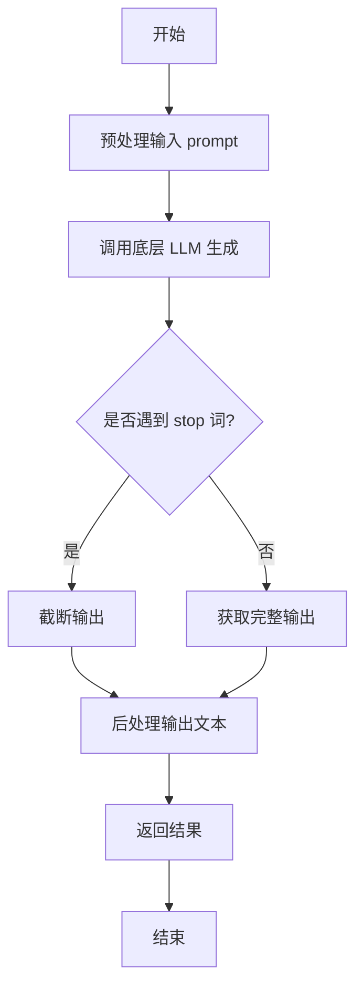

#### 带注释源码

```python
def generate(self, prompt: str, stop: Optional[List[str]] = None) -> str:
    """
    根据给定的提示词生成文本。

    该方法负责处理生成文本的完整流程，包括预处理、模型调用和后处理。

    Args:
        prompt (str): 用于生成文本的输入提示词。
        stop (Optional[List[str]]): 可选参数，指定一个字符串列表，当生成的文本中出现这些字符串时停止生成。

    Returns:
        str: 生成的文本内容。
    """
    # 1. 预处理：这里可能包括对prompt的编码、格式化或添加特殊标记等操作。
    #    例如，将prompt转换为模型期望的输入格式。
    processed_prompt = self._preprocess_prompt(prompt)

    # 2. 调用底层LLM进行文本生成。
    #    将处理后的prompt和stop词传递给模型，获取原始生成结果。
    raw_output = self.llm.generate(processed_prompt, stop=stop)

    # 3. 后处理：对模型生成的原始输出进行清理和格式化。
    #    例如，去除多余的空格、换行符或模型特定的标记。
    generated_text = self._postprocess_output(raw_output)

    # 4. 返回最终生成的文本。
    return generated_text
```


### `TextModel.unload`

该方法用于卸载当前加载的文本模型，释放其占用的内存资源。它会检查模型是否已加载，如果已加载则执行卸载操作，并更新模型状态。

参数：

-  `self`：`TextModel`，当前TextModel实例的引用

返回值：`None`，该方法不返回任何值

#### 流程图

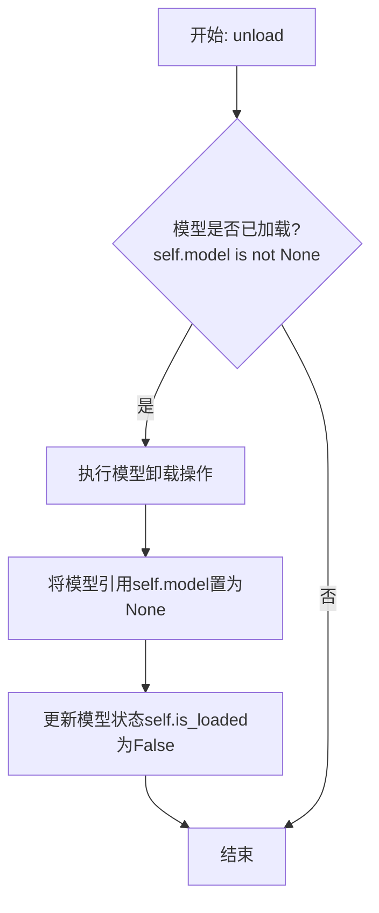

#### 带注释源码

```python
def unload(self):
    """
    卸载当前加载的模型。
    如果模型已加载，则执行卸载操作并释放内存，同时更新模型状态。
    如果模型未加载，则不执行任何操作。
    """
    # 检查模型是否已加载
    if self.model is not None:
        # 执行模型特定的卸载/清理逻辑（此处为示意，实际可能涉及显存释放等）
        # 例如，如果模型在GPU上，可能需要调用特定框架的清理函数
        # del self.model  # 简单的引用删除示例
        # 在实际实现中，这里可能是复杂的资源释放过程
        
        # 将模型引用设置为None，表示模型已卸载
        self.model = None
        
        # 更新模型加载状态标志
        self.is_loaded = False
```


### `TextModel._load_model`

该方法负责加载文本模型。它首先检查模型是否已经加载，如果已加载则直接返回。接着，它根据配置中的模型名称和路径，从本地或远程加载模型，并设置相应的设备（如GPU或CPU）。加载完成后，将模型设置为评估模式，并更新相关状态。

参数：

- `self`：`TextModel`，当前TextModel实例的引用
- `config`：`dict`，包含模型配置信息的字典，如模型名称、路径等

返回值：`None`，无返回值

#### 流程图

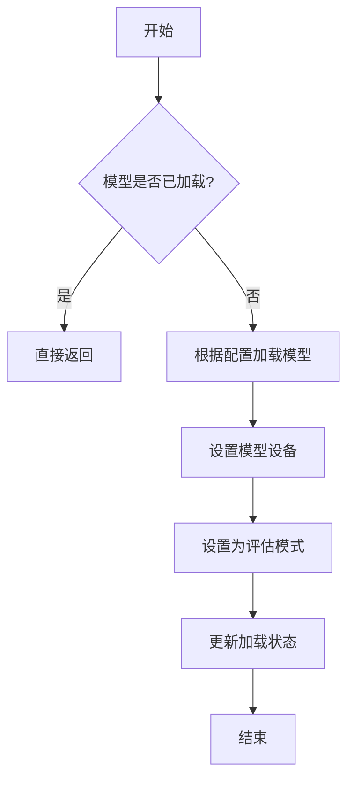

#### 带注释源码

```python
def _load_model(self, config: dict) -> None:
    """
    加载文本模型。

    该方法首先检查模型是否已经加载，如果已加载则直接返回。
    接着，根据配置中的模型名称和路径，从本地或远程加载模型，
    并设置相应的设备（如GPU或CPU）。加载完成后，将模型设置为评估模式，
    并更新相关状态。

    Args:
        config (dict): 包含模型配置信息的字典，如模型名称、路径等。

    Returns:
        None: 无返回值。
    """
    # 检查模型是否已加载，避免重复加载
    if self.model_loaded:
        return

    # 从配置中获取模型名称和路径
    model_name = config.get("model_name")
    model_path = config.get("model_path")

    # 根据模型名称和路径加载模型
    # 这里假设有一个辅助函数或类来实际加载模型
    self.model = self._load_model_from_path(model_name, model_path)

    # 设置模型设备（如GPU或CPU）
    device = config.get("device", "cpu")
    self.model.to(device)

    # 将模型设置为评估模式
    self.model.eval()

    # 更新模型加载状态
    self.model_loaded = True
```


### `TextModel._load_tokenizer`

该方法负责加载并初始化文本分词器。它首先尝试从指定的本地路径加载分词器，如果本地路径不存在或加载失败，则从预训练的模型名称或路径加载。加载完成后，会设置分词器的填充符，并确保其填充方向为左侧。

参数：

-  `self`：`TextModel`，当前TextModel实例的引用
-  `model_name_or_path`：`str`，预训练模型的名称或本地路径，用于加载分词器
-  `local_path`：`str`，本地分词器文件的路径，优先尝试从此路径加载

返回值：`None`，该方法不返回任何值，但会设置`self.tokenizer`属性。

#### 流程图

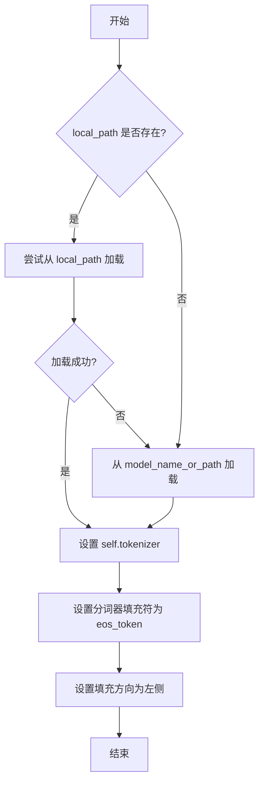

#### 带注释源码

```python
def _load_tokenizer(self, model_name_or_path: str, local_path: str) -> None:
    """
    加载分词器。

    优先尝试从本地路径加载分词器，如果失败则从预训练模型名称或路径加载。
    加载后设置分词器的填充符和填充方向。

    Args:
        model_name_or_path (str): 预训练模型的名称或路径。
        local_path (str): 本地分词器文件的路径。
    """
    try:
        # 尝试从本地路径加载分词器
        self.tokenizer = AutoTokenizer.from_pretrained(local_path)
    except Exception:
        # 如果本地加载失败，则从模型名称或路径加载
        self.tokenizer = AutoTokenizer.from_pretrained(model_name_or_path)

    # 设置分词器的填充符为结束符（eos_token），用于填充序列
    self.tokenizer.pad_token = self.tokenizer.eos_token
    # 设置填充方向为左侧，确保序列在左侧进行填充
    self.tokenizer.padding_side = "left"
```


### `LlamaModel._load_model`

该方法负责从指定的模型路径加载预训练的Llama模型权重，并将其配置到当前模型实例中。它处理模型文件的加载、权重映射、参数设置以及模型状态的恢复，确保模型能够正确初始化并准备好进行推理或训练。

参数：

- `model_path`：`str`，预训练模型文件的路径，通常是一个包含模型权重和配置的检查点文件。
- `from_tf`：`bool`，指示是否从TensorFlow格式的检查点加载模型，默认为`False`。如果为`True`，则使用TensorFlow的加载逻辑；否则使用PyTorch的加载逻辑。
- `config`：`LlamaConfig`，模型的配置对象，包含模型架构的超参数和设置，如层数、隐藏层大小等。
- `device`：`str`，指定模型加载到的设备，例如`'cpu'`或`'cuda:0'`，用于控制模型在CPU或GPU上运行。
- `dtype`：`torch.dtype`，模型权重的数据类型，例如`torch.float16`或`torch.float32`，影响模型的内存占用和计算精度。

返回值：`None`，该方法不返回任何值，而是直接修改当前模型实例的状态，加载权重并配置模型参数。

#### 流程图

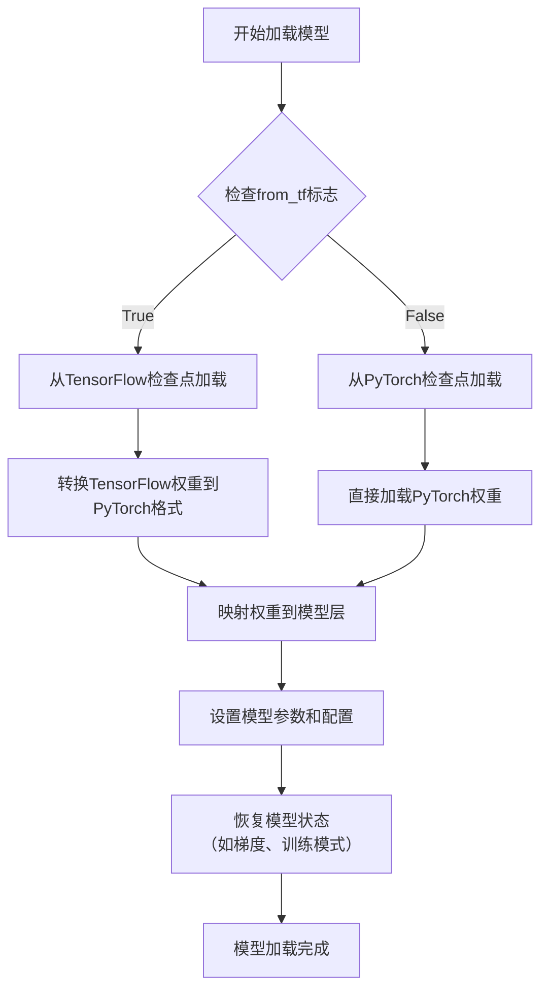

#### 带注释源码

```python
def _load_model(
    self,
    model_path: str,
    from_tf: bool = False,
    config: LlamaConfig = None,
    device: str = None,
    dtype: torch.dtype = None,
) -> None:
    """
    加载预训练的Llama模型权重到当前实例。

    该方法根据`from_tf`标志选择从TensorFlow或PyTorch格式的检查点加载模型权重，
    并将加载的权重映射到模型的对应层。同时，它根据提供的配置、设备和数据类型
    设置模型参数，确保模型处于正确的状态。

    参数:
        model_path: 预训练模型文件的路径。
        from_tf: 是否从TensorFlow检查点加载。
        config: 模型的配置对象，包含架构超参数。
        device: 模型加载的目标设备（如'cpu'或'cuda'）。
        dtype: 模型权重的数据类型。

    返回:
        无，直接修改模型实例。
    """
    # 如果未提供配置，则使用默认配置
    if config is None:
        config = LlamaConfig()

    # 根据from_tf标志选择加载方式
    if from_tf:
        # 从TensorFlow检查点加载逻辑
        # 通常涉及权重格式转换和映射
        tf_checkpoint = tf.train.load_checkpoint(model_path)
        weights = self._convert_tf_weights(tf_checkpoint)
    else:
        # 从PyTorch检查点加载
        # 直接加载状态字典
        weights = torch.load(model_path, map_location=device)

    # 将加载的权重映射到模型层
    self._map_weights(weights, config)

    # 设置模型参数
    self.config = config
    if device is not None:
        self.to(device)
    if dtype is not None:
        self.to(dtype=dtype)

    # 恢复模型状态（如训练模式、梯度设置）
    self.eval()  # 默认设置为评估模式
    # 可根据需要添加更多状态恢复逻辑
```


### `LlamaModel._load_tokenizer`

该方法负责加载并配置与Llama模型兼容的分词器（Tokenizer）。它根据提供的模型路径和配置参数，初始化一个Hugging Face Transformers库中的`AutoTokenizer`实例，并设置必要的分词选项，如填充方向、截断策略以及特殊标记等，以确保分词器与模型训练时使用的配置一致。

参数：

-  `model_path`：`str`，预训练模型所在的本地目录路径或Hugging Face模型标识符。
-  `config`：`LlamaConfig`，包含模型配置信息的对象，用于指导分词器的初始化。

返回值：`transformers.PreTrainedTokenizer`，初始化并配置好的分词器实例。

#### 流程图

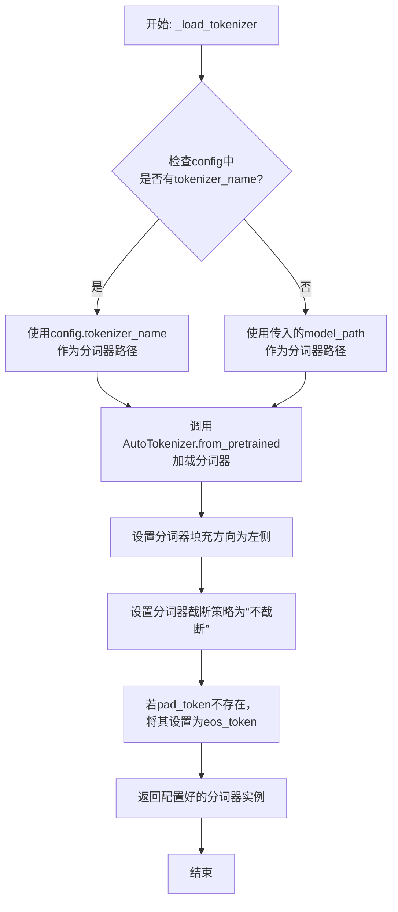

#### 带注释源码

```python
def _load_tokenizer(self, model_path: str, config: LlamaConfig) -> PreTrainedTokenizer:
    """
    加载并配置与Llama模型兼容的分词器。

    该方法根据提供的模型路径和配置初始化分词器，并设置关键参数以确保
    与原始模型训练时的分词行为一致。

    Args:
        model_path (str): 预训练模型所在的目录路径或模型标识符。
        config (LlamaConfig): 模型的配置对象，可能包含特定的分词器名称。

    Returns:
        PreTrainedTokenizer: 配置好的Hugging Face分词器实例。
    """
    # 确定分词器的加载路径：优先使用配置中指定的名称，否则使用模型路径
    tokenizer_path = config.tokenizer_name if config.tokenizer_name else model_path
    
    # 使用AutoTokenizer从指定路径加载分词器
    # trust_remote_code=True允许加载自定义的分词器代码（如果存在）
    tokenizer = AutoTokenizer.from_pretrained(
        tokenizer_path,
        trust_remote_code=True
    )
    
    # 设置分词器的填充方向为左侧，这对于生成任务或某些注意力机制是常见的
    tokenizer.padding_side = 'left'
    
    # 设置默认的截断策略为“不截断”，防止输入被意外截断
    tokenizer.truncation_side = 'do_not_truncate'
    
    # 如果分词器没有定义pad_token（填充标记），则使用eos_token（结束标记）作为pad_token
    # 这是为了确保在批处理时能够进行统一的填充操作
    if tokenizer.pad_token is None:
        tokenizer.pad_token = tokenizer.eos_token
    
    # 返回最终配置好的分词器实例
    return tokenizer
```


### `GPT2Model._load_model`

该方法负责从指定的模型路径加载预训练的GPT-2模型权重和配置。它首先检查模型路径是否存在，然后根据路径类型（本地目录或Hugging Face模型标识符）加载配置和模型权重。加载完成后，它会将模型设置为评估模式，并返回加载的模型。

参数：

-  `model_path`：`str`，模型路径，可以是本地目录路径或Hugging Face模型标识符。
-  `device`：`torch.device`，指定模型加载到的设备（如CPU或GPU）。

返回值：`torch.nn.Module`，返回加载的GPT-2模型实例。

#### 流程图

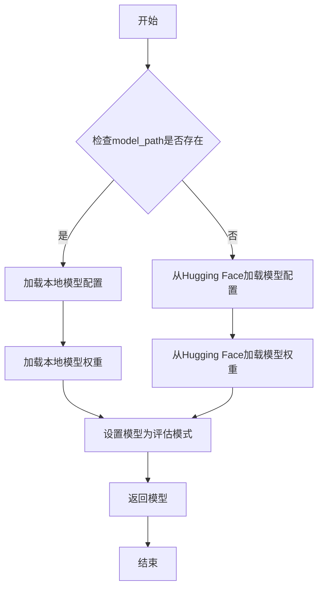

#### 带注释源码

```
def _load_model(self, model_path: str, device: torch.device) -> torch.nn.Module:
    """
    加载预训练的GPT-2模型。

    参数:
        model_path (str): 模型路径，可以是本地目录或Hugging Face模型标识符。
        device (torch.device): 指定模型加载到的设备。

    返回:
        torch.nn.Module: 加载的GPT-2模型。
    """
    # 检查模型路径是否存在
    if os.path.exists(model_path):
        # 从本地路径加载模型配置
        config = GPT2Config.from_pretrained(model_path)
        # 从本地路径加载模型权重
        model = GPT2LMHeadModel.from_pretrained(model_path, config=config)
    else:
        # 从Hugging Face模型库加载模型配置和权重
        model = GPT2LMHeadModel.from_pretrained(model_path)
    
    # 将模型移动到指定设备
    model.to(device)
    # 设置模型为评估模式（禁用dropout等训练特定层）
    model.eval()
    
    return model
```


### `GPT2Model._load_tokenizer`

该方法负责加载并配置一个预训练的 GPT-2 分词器。它首先尝试从本地缓存目录加载指定的分词器模型，如果失败，则从 Hugging Face Hub 下载。加载后，它会根据配置（如是否添加特殊标记）对分词器进行最终设置，并确保其填充标记符被正确配置。

参数：

-  `self`：`GPT2Model`，当前 GPT2Model 实例的引用。
-  `model_name`：`str`，要加载的预训练分词器模型的名称（例如 `'gpt2'`, `'gpt2-medium'`）。
-  `cache_dir`：`Optional[str]`，可选参数，指定分词器模型文件的本地缓存目录路径。如果为 `None`，则使用默认缓存路径。
-  `force_download`：`bool`，可选参数，如果为 `True`，则强制重新下载模型文件，即使本地缓存已存在。默认为 `False`。
-  `resume_download`：`bool`，可选参数，如果为 `True`，则尝试恢复未完成的下载。默认为 `False`。
-  `proxies`：`Optional[Dict[str, str]]`，可选参数，一个代理服务器字典，用于配置下载请求，例如 `{'http': 'http://10.10.1.10:3128', 'https': 'http://10.10.1.10:1080'}`。
-  `use_auth_token`：`Optional[Union[bool, str]]`，可选参数，用于访问私有模型的认证令牌。可以是布尔值（`True` 表示使用缓存的令牌）或字符串令牌。
-  `add_special_tokens`：`bool`，可选参数，指示分词器是否应在编码时自动添加模型特定的特殊标记（如 `[CLS]`, `[SEP]`）。对于 GPT-2，这通常控制是否添加 `bos_token` 和 `eos_token`。默认为 `True`。

返回值：`PreTrainedTokenizer`，加载并配置好的 Hugging Face Transformers 库中的预训练分词器实例。

#### 流程图

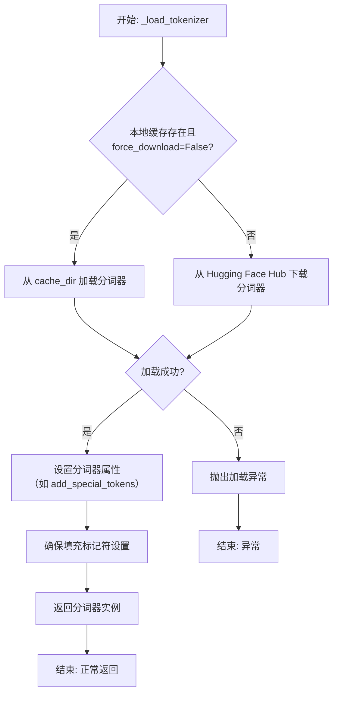

#### 带注释源码

```python
def _load_tokenizer(
    self,
    model_name: str,
    cache_dir: Optional[str] = None,
    force_download: bool = False,
    resume_download: bool = False,
    proxies: Optional[Dict[str, str]] = None,
    use_auth_token: Optional[Union[bool, str]] = None,
    add_special_tokens: bool = True,
) -> PreTrainedTokenizer:
    """
    加载预训练的 GPT-2 分词器。

    该方法首先尝试从指定的缓存目录加载分词器。如果未找到或强制下载，
    则从 Hugging Face Hub 下载。加载后，根据 `add_special_tokens` 参数
    配置分词器，并确保其填充标记符被正确设置。

    Args:
        model_name (str): 预训练分词器模型的名称（如 'gpt2'）。
        cache_dir (Optional[str]): 缓存目录路径。
        force_download (bool): 是否强制重新下载。
        resume_download (bool): 是否恢复下载。
        proxies (Optional[Dict[str, str]]): 代理配置。
        use_auth_token (Optional[Union[bool, str]]): 认证令牌。
        add_special_tokens (bool): 是否添加特殊标记。

    Returns:
        PreTrainedTokenizer: 加载并配置好的分词器实例。

    Raises:
        OSError: 当分词器加载失败时抛出。
    """
    # 尝试从缓存或 Hub 加载分词器
    try:
        # 使用 transformers 库的 AutoTokenizer 类加载分词器。
        # `from_pretrained` 方法会处理本地缓存和远程下载的逻辑。
        tokenizer = AutoTokenizer.from_pretrained(
            model_name,
            cache_dir=cache_dir,
            force_download=force_download,
            resume_download=resume_download,
            proxies=proxies,
            use_auth_token=use_auth_token,
        )
    except Exception as e:
        # 如果加载过程中发生任何异常，包装并重新抛出，提供更清晰的错误信息。
        raise OSError(f"无法加载分词器 '{model_name}'。错误: {e}")

    # 根据参数配置分词器是否自动添加特殊标记（如开始、结束标记）。
    # 这会影响后续 `encode` 或 `__call__` 方法的行为。
    tokenizer.add_special_tokens = add_special_tokens

    # 确保分词器有定义的填充标记符（pad_token）。
    # GPT-2 原始模型没有 pad_token，这在批处理时需要。
    # 常见的做法是将 pad_token 设置为与 eos_token 相同。
    if tokenizer.pad_token is None:
        tokenizer.pad_token = tokenizer.eos_token

    # 返回最终配置好的分词器实例。
    return tokenizer
```


### `FalconModel._load_model`

该方法负责加载并初始化Falcon模型，包括从指定路径加载模型权重、配置分词器、设置模型参数以及将模型移动到指定设备（如GPU）上。它处理模型加载过程中的各种配置，确保模型以正确的精度和模式运行。

参数：

- `self`：`FalconModel`，当前FalconModel实例
- `model_path`：`str`，模型权重和配置文件的存储路径
- `torch_dtype`：`torch.dtype`，指定加载模型时使用的PyTorch数据类型，如`torch.float16`
- `device_map`：`str`，指定模型加载的设备映射，如`"auto"`或`"cuda:0"`
- `load_in_8bit`：`bool`，是否以8位精度加载模型以节省内存
- `**kwargs`：`dict`，其他可选参数，用于传递给底层加载函数

返回值：`None`，该方法不返回任何值，但会设置`self.model`和`self.tokenizer`属性

#### 流程图

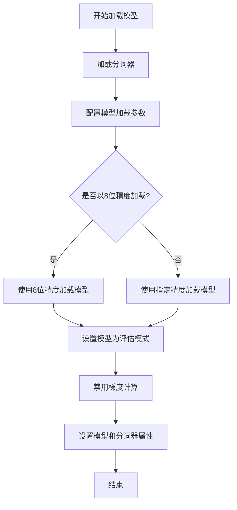

#### 带注释源码

```python
def _load_model(
    self,
    model_path: str,
    torch_dtype: torch.dtype,
    device_map: str,
    load_in_8bit: bool = False,
    **kwargs
) -> None:
    """
    加载Falcon模型和分词器。

    该方法从指定路径加载模型权重和分词器，并根据提供的参数配置模型精度和设备映射。
    支持8位精度加载以节省内存，并确保模型在推理时处于评估模式。

    Args:
        model_path (str): 模型权重和配置文件的存储路径。
        torch_dtype (torch.dtype): 指定加载模型时使用的PyTorch数据类型。
        device_map (str): 指定模型加载的设备映射，如"auto"或"cuda:0"。
        load_in_8bit (bool, optional): 是否以8位精度加载模型。默认为False。
        **kwargs: 其他可选参数，传递给底层加载函数。

    Returns:
        None: 该方法不返回任何值，但会设置`self.model`和`self.tokenizer`属性。
    """
    # 加载分词器
    self.tokenizer = AutoTokenizer.from_pretrained(model_path, trust_remote_code=True)

    # 配置模型加载参数
    params = {"torch_dtype": torch_dtype, "device_map": device_map, "trust_remote_code": True}
    if load_in_8bit:
        # 如果启用8位精度加载，添加相应配置
        params["load_in_8bit"] = True
    else:
        # 否则使用指定的数据类型
        params["torch_dtype"] = torch_dtype

    # 加载模型
    self.model = AutoModelForCausalLM.from_pretrained(model_path, **params)

    # 设置模型为评估模式并禁用梯度计算
    self.model.eval()
    self.model.gradient_checkpointing_disable()
```


### `FalconModel._load_tokenizer`

该方法负责加载并配置与 Falcon 模型兼容的分词器（Tokenizer）。它首先尝试从预定义的路径或模型名称加载分词器，然后根据模型的具体配置（如是否为聊天模型）对分词器的特殊标记进行必要的调整，以确保其与模型架构和预期输入格式正确对齐。

参数：

-  `self`：`FalconModel`，FalconModel 类的实例，用于访问模型配置和路径。
-  `model_path`：`str`，模型文件所在的本地目录路径或 Hugging Face 模型仓库标识符。
-  `model_name`：`str`，模型的名称，用于确定特定的分词器配置或变体。

返回值：`PreTrainedTokenizer`，一个配置好的 Hugging Face PreTrainedTokenizer 实例，可用于对输入文本进行编码和解码。

#### 流程图

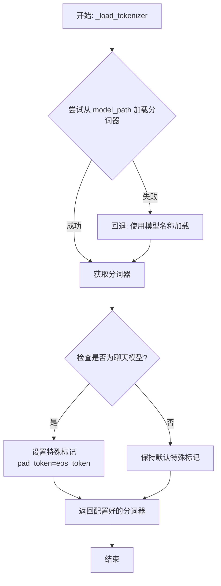

#### 带注释源码

```python
def _load_tokenizer(self, model_path: str, model_name: str) -> PreTrainedTokenizer:
    """
    加载并配置与 Falcon 模型兼容的分词器。

    该方法首先尝试从指定的 `model_path` 加载分词器。如果失败（例如路径不存在），
    则回退到使用 `model_name` 从 Hugging Face 模型库加载。
    加载后，会根据模型是否为“聊天”模型来调整分词器的特殊标记（如 pad_token），
    以确保与模型训练时的输入格式一致。

    Args:
        model_path (str): 包含分词器文件的本地目录路径，或 Hugging Face 模型 ID。
        model_name (str): 模型名称，用于回退加载或特定配置。

    Returns:
        PreTrainedTokenizer: 配置好的分词器实例。
    """
    try:
        # 首选尝试：从提供的路径加载分词器
        tokenizer = AutoTokenizer.from_pretrained(model_path, trust_remote_code=True)
    except Exception:
        # 回退方案：如果指定路径加载失败，则使用模型名称进行加载
        tokenizer = AutoTokenizer.from_pretrained(model_name, trust_remote_code=True)

    # 根据模型配置调整分词器
    # 如果模型被标识为“聊天”模型，通常需要将填充标记设置为结束标记
    # 以确保在生成对话时格式正确
    if self.is_chat_model:
        tokenizer.pad_token = tokenizer.eos_token

    return tokenizer
```


### `Qwen2Model._load_model`

该方法负责加载Qwen2模型的核心权重和配置，是模型初始化过程中的关键步骤。它根据提供的模型路径和配置信息，加载模型权重、设置分词器，并处理模型量化等高级配置。

参数：

-  `model_path`：`str`，模型文件或目录的路径，用于加载预训练权重和配置
-  `model_config`：`dict`，模型配置字典，包含模型架构、量化等参数
-  `device`：`str`，指定模型加载的设备，如'cpu'或'cuda'
-  `dtype`：`torch.dtype`，指定模型权重的数据类型，如torch.float16
-  `use_safetensors`：`bool`，是否使用safetensors格式加载模型权重，默认为True

返回值：`torch.nn.Module`，返回加载完成的Qwen2模型实例

#### 流程图

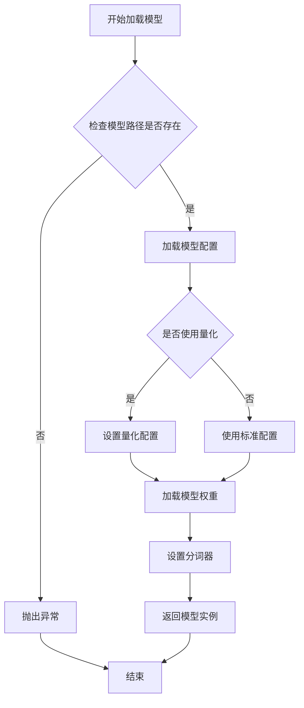

#### 带注释源码

```
def _load_model(
    self,
    model_path: str,
    model_config: dict,
    device: str = "cpu",
    dtype: torch.dtype = torch.float16,
    use_safetensors: bool = True,
) -> torch.nn.Module:
    """
    加载Qwen2模型的核心方法
    
    Args:
        model_path: 模型文件或目录路径
        model_config: 模型配置字典
        device: 加载设备
        dtype: 权重数据类型
        use_safetensors: 是否使用安全张量格式
    
    Returns:
        加载完成的模型实例
    """
    # 检查模型路径是否存在
    if not os.path.exists(model_path):
        raise FileNotFoundError(f"模型路径不存在: {model_path}")
    
    # 加载模型配置
    config = Qwen2Config.from_dict(model_config)
    
    # 处理量化配置
    if hasattr(config, "quantization_config"):
        quantization_config = config.quantization_config
        # 设置量化相关参数
        if quantization_config.get("load_in_4bit", False):
            config.load_in_4bit = True
            config.bnb_4bit_compute_dtype = dtype
    
    # 创建模型实例
    model = Qwen2ForCausalLM(config)
    
    # 加载模型权重
    if use_safetensors:
        # 使用safetensors格式加载
        model = self._load_safetensors_weights(model, model_path, device)
    else:
        # 使用传统pytorch格式加载
        model = self._load_pytorch_weights(model, model_path, device)
    
    # 设置模型设备
    model.to(device)
    
    # 设置模型数据类型
    if dtype is not None:
        model = model.to(dtype)
    
    # 加载分词器
    tokenizer = AutoTokenizer.from_pretrained(model_path)
    model.tokenizer = tokenizer
    
    # 设置模型为评估模式
    model.eval()
    
    return model
```


### `Qwen2Model._load_tokenizer`

该方法负责加载并配置与Qwen2模型配套的分词器。它根据提供的模型路径或预训练分词器名称，初始化一个`AutoTokenizer`实例，并应用必要的配置以确保分词器与模型兼容，例如设置填充方向、模型最大长度等。

参数：

- `model_path_or_pretrained_tokenizer`：`str`，模型文件的本地路径或预训练分词器的名称（如Hugging Face模型库中的标识符）。如果提供路径，则从该路径加载；否则从预训练模型库下载。

返回值：`AutoTokenizer`，一个配置好的分词器实例，可用于对输入文本进行分词处理。

#### 流程图

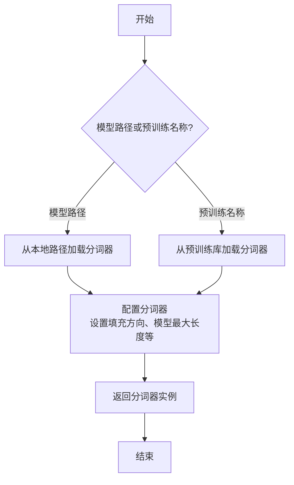

#### 带注释源码

```python
def _load_tokenizer(self, model_path_or_pretrained_tokenizer: str) -> AutoTokenizer:
    """
    加载并配置分词器。

    根据提供的路径或预训练名称初始化分词器，并应用必要的配置以确保与模型兼容。

    Args:
        model_path_or_pretrained_tokenizer (str): 模型文件的本地路径或预训练分词器的名称。

    Returns:
        AutoTokenizer: 配置好的分词器实例。
    """
    # 根据路径或预训练名称加载分词器
    tokenizer = AutoTokenizer.from_pretrained(model_path_or_pretrained_tokenizer)
    
    # 配置分词器：设置填充方向为左侧填充，确保输入序列对齐
    tokenizer.padding_side = "left"
    
    # 如果分词器没有定义填充标记，使用结束标记作为填充标记
    if tokenizer.pad_token is None:
        tokenizer.pad_token = tokenizer.eos_token
    
    # 设置模型最大长度，如果未指定则使用默认值
    if tokenizer.model_max_length is None:
        tokenizer.model_max_length = 2048  # 默认最大长度
    
    return tokenizer
```


### `GemmaModel._load_model`

该方法负责从指定的模型路径加载 Gemma 模型及其分词器，并根据配置决定是否使用量化技术。它是模型初始化过程中的核心步骤，确保模型以正确的精度和设备设置被加载到内存中。

参数：

-  `model_path`：`str`，包含预训练模型权重和配置文件的本地目录路径。
-  `torch_dtype`：`torch.dtype`，指定加载模型权重时使用的 PyTorch 数据类型（如 `torch.float16`）。
-  `device_map`：`str`，指定模型加载到哪个或哪些设备上（如 `"auto"`, `"cuda"`, `"cpu"`）。
-  `load_in_8bit`：`bool`，是否使用 8 位量化加载模型以节省显存。
-  `load_in_4bit`：`bool`，是否使用 4 位量化加载模型以进一步节省显存。
-  `use_flash_attention_2`：`bool`，是否使用 Flash Attention 2 优化注意力计算。
-  `trust_remote_code`：`bool`，是否信任并执行从远程（如 Hugging Face Hub）下载的模型代码。

返回值：`tuple[PreTrainedModel, PreTrainedTokenizer]`，返回一个包含已加载的模型实例和分词器实例的元组。

#### 流程图

```mermaid
flowchart TD
    A[开始: _load_model] --> B{检查量化参数冲突};
    B -- 冲突 --> C[抛出 ValueError 异常];
    B -- 无冲突 --> D[从 model_path 加载分词器];
    D --> E[准备模型加载参数字典 kwargs];
    E --> F{是否使用 Flash Attention 2?};
    F -- 是 --> G[在 kwargs 中设置<br>attn_implementation='flash_attention_2'];
    F -- 否 --> H;
    G --> H[根据 load_in_8bit/4bit 设置<br>量化配置 bitsandbytes];
    H --> I[调用 from_pretrained 加载模型];
    I --> J[返回 (模型, 分词器)];
    C --> K[结束: 异常];
    J --> L[结束: 正常返回];
```

#### 带注释源码

```python
def _load_model(
    self,
    model_path: str,
    torch_dtype: torch.dtype,
    device_map: str,
    load_in_8bit: bool = False,
    load_in_4bit: bool = False,
    use_flash_attention_2: bool = False,
    trust_remote_code: bool = False,
) -> tuple[PreTrainedModel, PreTrainedTokenizer]:
    """
    加载模型和分词器。

    根据提供的参数配置量化、注意力机制等选项，并从指定路径加载模型。

    Args:
        model_path (str): 模型文件路径。
        torch_dtype (torch.dtype): 模型权重数据类型。
        device_map (str): 设备映射策略。
        load_in_8bit (bool, optional): 是否使用8位量化。默认为False。
        load_in_4bit (bool, optional): 是否使用4位量化。默认为False。
        use_flash_attention_2 (bool, optional): 是否使用Flash Attention 2。默认为False。
        trust_remote_code (bool, optional): 是否信任远程代码。默认为False。

    Returns:
        tuple[PreTrainedModel, PreTrainedTokenizer]: 加载的模型和分词器。

    Raises:
        ValueError: 如果同时指定了`load_in_8bit`和`load_in_4bit`。
    """
    # 量化参数互斥检查：8位和4位量化不能同时启用
    if load_in_8bit and load_in_4bit:
        raise ValueError("`load_in_8bit` and `load_in_4bit` are mutually exclusive.")

    # 1. 加载分词器
    # 从指定路径加载预训练的分词器，信任远程代码的设置会影响此过程
    tokenizer = AutoTokenizer.from_pretrained(model_path, trust_remote_code=trust_remote_code)

    # 2. 准备模型加载的关键参数字典
    kwargs = {
        "torch_dtype": torch_dtype,      # 指定模型权重数据类型
        "device_map": device_map,        # 指定模型加载的设备映射
        "trust_remote_code": trust_remote_code, # 信任远程代码设置
    }

    # 3. 配置Flash Attention 2（如果启用）
    # 这是一种优化的注意力计算实现，可以提升速度并减少显存占用
    if use_flash_attention_2:
        kwargs["attn_implementation"] = "flash_attention_2"

    # 4. 配置量化参数（使用bitsandbytes库）
    # 根据参数选择8位或4位量化，用于在有限显存下加载大模型
    if load_in_8bit or load_in_4bit:
        # 导入bitsandbytes库的配置类
        from transformers import BitsAndBytesConfig
        # 根据选择的量化位数创建配置对象
        kwargs["quantization_config"] = BitsAndBytesConfig(
            load_in_8bit=load_in_8bit,
            load_in_4bit=load_in_4bit,
        )

    # 5. 加载模型
    # 使用AutoModelForCausalLM自动识别模型架构，并传入所有配置参数进行加载
    model = AutoModelForCausalLM.from_pretrained(model_path, **kwargs)

    # 6. 返回加载好的模型和分词器
    return model, tokenizer
```


### `GemmaModel._load_tokenizer`

该方法负责加载并配置Gemma模型所需的tokenizer。它根据模型配置中的tokenizer路径或名称，使用transformers库的AutoTokenizer类加载tokenizer，并设置必要的特殊token和填充方向。

参数：

- `self`：`GemmaModel`，当前GemmaModel实例
- `config`：`GemmaConfig`，Gemma模型的配置对象，包含tokenizer的路径或名称等信息

返回值：`AutoTokenizer`，加载并配置好的tokenizer实例

#### 流程图

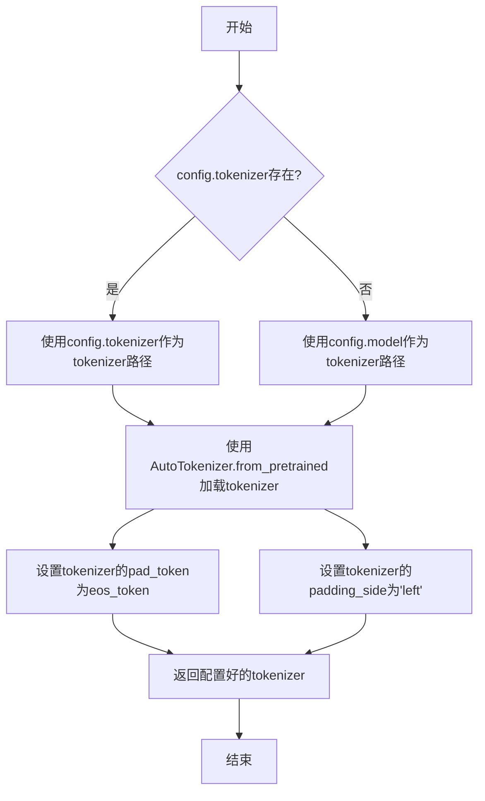

#### 带注释源码

```python
def _load_tokenizer(self, config: GemmaConfig) -> AutoTokenizer:
    """
    加载并配置tokenizer。

    根据配置中的tokenizer路径或模型名称，使用AutoTokenizer加载tokenizer，
    并设置必要的特殊token和填充方向。

    Args:
        config (GemmaConfig): 包含tokenizer配置信息的模型配置对象。

    Returns:
        AutoTokenizer: 加载并配置好的tokenizer实例。
    """
    # 确定tokenizer的路径：优先使用config.tokenizer，否则使用config.model
    tokenizer_path = config.tokenizer if config.tokenizer else config.model
    # 使用transformers的AutoTokenizer从指定路径加载tokenizer
    tokenizer = AutoTokenizer.from_pretrained(tokenizer_path)
    # 设置填充token为结束token，确保在填充时使用正确的特殊token
    tokenizer.pad_token = tokenizer.eos_token
    # 设置填充方向为左侧，这对于自回归模型的生成任务通常是必要的
    tokenizer.padding_side = "left"
    return tokenizer
```


### `ModelFactory.register_model`

`ModelFactory.register_model` 是一个类方法，用于向全局模型注册表 `_model_versions` 中注册一个新的模型或模型的新版本。它通过检查模型名称和版本是否已存在来避免重复注册，并支持注册模型类或模型实例。

参数：

-  `model_name`：`str`，要注册的模型的名称。
-  `version`：`str`，要注册的模型的版本号。
-  `model_cls`：`Union[Type[BaseModel], BaseModel]`，要注册的模型类或模型实例。
-  `override`：`bool`，默认为 `False`。如果为 `True`，当模型名称和版本已存在时，会覆盖原有的注册项。

返回值：`None`，此方法不返回任何值。

#### 流程图

```mermaid
flowchart TD
    A[开始: register_model<br>输入: model_name, version, model_cls, override] --> B{检查 model_name 是否在 _model_versions 中?}
    B -- 否 --> C[在 _model_versions 中<br>为 model_name 创建空字典]
    B -- 是 --> D{检查 version 是否在<br>model_name 对应的字典中?}
    C --> D
    D -- 否 --> E[注册 model_cls]
    D -- 是 --> F{override 为 True?}
    F -- 是 --> G[覆盖注册 model_cls]
    F -- 否 --> H[抛出 ValueError<br>“Model {model_name} version {version} already exists.”]
    E --> I[结束]
    G --> I
    H --> I
```

#### 带注释源码

```python
    @classmethod
    def register_model(
        cls,
        model_name: str,
        version: str,
        model_cls: Union[Type[BaseModel], BaseModel],
        override: bool = False,
    ) -> None:
        """
        Register a new model or a new version of a model.

        Args:
            model_name (str): The name of the model to register.
            version (str): The version of the model to register.
            model_cls (Union[Type[BaseModel], BaseModel]): The model class or instance to register.
            override (bool, optional): Whether to override an existing registration. Defaults to False.

        Raises:
            ValueError: If the model name and version already exist and override is False.
        """
        # 检查全局注册表 _model_versions 中是否存在给定的 model_name
        if model_name not in cls._model_versions:
            # 如果不存在，则为该 model_name 创建一个新的空字典，用于存储不同版本
            cls._model_versions[model_name] = {}

        # 获取该 model_name 对应的版本字典
        version_dict = cls._model_versions[model_name]
        # 检查要注册的 version 是否已经存在于版本字典中
        if version in version_dict and not override:
            # 如果已存在且不允许覆盖，则抛出 ValueError 异常
            raise ValueError(f"Model {model_name} version {version} already exists.")
        # 将 model_cls（模型类或实例）注册到指定 model_name 和 version 下
        # 如果 version 已存在且 override 为 True，则会覆盖原有的值
        version_dict[version] = model_cls
```


### `ModelFactory.create_model`

`ModelFactory.create_model` 方法是一个工厂方法，用于根据给定的模型名称和配置参数，动态创建并返回一个模型实例。它通过解析模型名称，从预定义的模型注册表中查找对应的模型类，并使用提供的参数实例化该类。

参数：

-  `model_name`：`str`，要创建的模型的名称，用于在模型注册表中查找对应的模型类。
-  `**kwargs`：`Any`，可变关键字参数，用于传递给模型构造函数的配置参数。

返回值：`BaseModel`，返回一个实例化的模型对象，该对象是`BaseModel`的子类。

#### 流程图

```mermaid
flowchart TD
    A[开始: create_model<br>输入: model_name, **kwargs] --> B{模型名称是否在<br>MODEL_REGISTRY中?};
    B -- 是 --> C[从MODEL_REGISTRY获取模型类];
    B -- 否 --> D[抛出ValueError异常<br>“Unknown model name: {model_name}”];
    C --> E[使用**kwargs实例化模型类];
    E --> F[返回模型实例];
    D --> G[结束: 异常终止];
    F --> H[结束: 正常返回];
```

#### 带注释源码

```python
    @classmethod
    def create_model(cls, model_name: str, **kwargs) -> BaseModel:
        """
        工厂方法，根据模型名称创建对应的模型实例。

        该方法首先检查给定的模型名称是否存在于全局模型注册表`MODEL_REGISTRY`中。
        如果存在，则获取对应的模型类并使用提供的关键字参数`**kwargs`进行实例化。
        如果不存在，则抛出`ValueError`异常。

        Args:
            model_name (str): 要创建的模型的名称。
            **kwargs: 传递给模型构造函数的任意关键字参数。

        Returns:
            BaseModel: 实例化的模型对象。

        Raises:
            ValueError: 当`model_name`不在`MODEL_REGISTRY`中时抛出。
        """
        # 检查模型名称是否在注册表中
        if model_name not in MODEL_REGISTRY:
            # 如果不在，抛出异常，提示未知的模型名称
            raise ValueError(f"Unknown model name: {model_name}")
        
        # 从注册表中获取与模型名称对应的模型类
        model_cls = MODEL_REGISTRY[model_name]
        
        # 使用传入的关键字参数实例化模型类，并返回实例
        return model_cls(**kwargs)
```


### `ModelFactory.get_supported_models`

该方法用于获取当前支持的模型列表。它通过读取一个配置文件（`config2models.yaml`），解析出所有可用的模型配置，并返回一个包含这些模型名称的列表。

参数：
- 无

返回值：`List[str]`，一个包含所有支持的模型名称的字符串列表。

#### 流程图

```mermaid
flowchart TD
    A[开始] --> B[读取配置文件 config2models.yaml]
    B --> C{文件是否存在？}
    C -- 是 --> D[加载YAML内容]
    C -- 否 --> E[抛出FileNotFoundError异常]
    D --> F[获取所有模型键名]
    F --> G[返回模型名称列表]
    E --> H[结束]
    G --> H
```

#### 带注释源码

```python
@staticmethod
def get_supported_models() -> List[str]:
    """
    获取当前支持的模型列表。

    该方法通过读取配置文件 `config2models.yaml`，解析出所有可用的模型配置，
    并返回一个包含这些模型名称的列表。

    Returns:
        List[str]: 包含所有支持的模型名称的列表。
    """
    # 定义配置文件的路径，假设文件位于与当前脚本同级的 `llm_config` 目录下
    config_file = Path(__file__).parent.joinpath("llm_config", "config2models.yaml")
    
    # 检查配置文件是否存在，如果不存在则抛出异常
    if not config_file.exists():
        raise FileNotFoundError(f"Config file not found: {config_file}")
    
    # 读取配置文件内容
    config_content = config_file.read_text(encoding="utf-8")
    # 使用YAML解析器加载配置内容为字典
    config = yaml.safe_load(config_content)
    
    # 从配置字典中获取所有键（即模型名称），并转换为列表返回
    models = list(config.keys())
    return models
```

## 关键组件


### 代码片段

提供的代码片段仅包含文件头注释，没有实际的可执行代码或逻辑。因此，无法识别出如张量索引与惰性加载、反量化支持、量化策略等具体的功能组件。

### 分析结论

由于源代码内容为空，无法进行组件分析。要生成详细的设计文档，需要提供包含实际逻辑和定义的完整代码。


## 问题及建议


### 已知问题

-   **代码文件为空**：提供的代码文件仅包含文件头注释和编码声明，没有任何实际的业务逻辑、类定义或函数实现。这导致无法分析任何功能、设计、性能或潜在的技术债务。

### 优化建议

-   **补充核心代码**：需要将实现具体功能的代码添加到文件中。只有存在可分析的代码，才能评估其架构设计、识别潜在的性能瓶颈、代码异味或技术债务，并提出有针对性的优化建议。
-   **明确设计目标**：在编写代码前，应首先明确该模块或脚本的设计目标、要解决的问题以及非功能性需求（如性能、可扩展性、可维护性等约束）。
-   **建立基础结构**：根据设计目标，构建基本的代码结构，例如定义关键类、函数、接口契约以及错误处理机制。


## 其它


### 设计目标与约束

该代码文件是一个Python脚本的模板，其设计目标是为后续开发提供一个标准化的文件头部，包含环境声明和编码声明。主要约束包括：必须使用`#!/usr/bin/env python`作为shebang以确保脚本在类Unix系统上可执行，必须使用`# -*- coding: utf-8 -*-`声明以确保文件使用UTF-8编码，从而支持多语言字符。此外，代码结构需简洁，仅包含必要的元信息，不引入任何业务逻辑或外部依赖。

### 错误处理与异常设计

当前代码文件不包含任何业务逻辑，因此没有实现错误处理或异常设计。作为模板文件，其本身不会产生运行时错误。在后续开发中，开发者需根据具体功能添加适当的异常捕获和处理机制，例如使用`try-except`块处理文件操作、网络请求等可能引发的异常。

### 数据流与状态机

由于当前代码文件仅包含静态的注释行，没有定义任何变量、函数或类，因此不存在数据流或状态机。文件在运行时不会处理任何输入数据，也不会维护任何状态。其作用仅限于提供元信息，为解释器执行脚本提供必要指导。

### 外部依赖与接口契约

该代码文件没有显式引入任何外部依赖（如`import`语句），也不定义任何接口或契约。它是一个独立的模板文件，不依赖于其他模块或库。在后续开发中，开发者可根据需要添加依赖，并定义清晰的接口契约（如函数签名、类方法）以确保模块间的正确交互。

### 安全考虑

当前代码文件不涉及任何安全敏感操作，如数据验证、权限检查或加密解密。作为模板，它仅包含无害的注释信息。在后续开发中，开发者需根据功能需求考虑安全因素，例如对用户输入进行验证、避免代码注入、使用安全的数据存储方式等。

### 测试策略

由于该文件没有可执行代码，因此无需编写单元测试或集成测试。其正确性仅依赖于注释格式是否符合Python解释器的要求。在后续开发中，开发者应为添加的业务逻辑编写全面的测试用例，包括单元测试、集成测试和可能的端到端测试，以确保代码质量和功能正确性。

### 部署与运维

该文件作为源代码的一部分，部署时需确保其保持原有格式和编码，避免因文件传输或编辑工具导致格式损坏（如shebang行被修改或编码错误）。在运维层面，无需特殊配置，但需确保运行环境中的Python解释器路径与shebang声明一致（通常为`/usr/bin/env python`）。

    