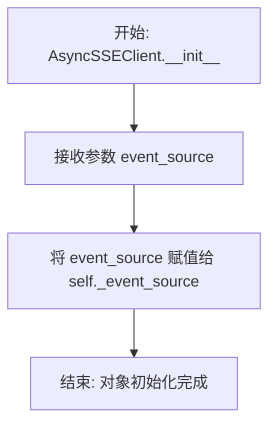

# `.\MetaGPT\metagpt\provider\zhipuai\async_sse_client.py` 详细设计文档

该代码实现了一个异步服务器发送事件（SSE）客户端，用于从事件源迭代器中解析和流式传输JSON格式的数据事件。它主要处理来自AI模型API（如智谱AI）的流式响应，过滤掉心跳信号（以冒号开头的行）和空行，提取'data'字段中的JSON数据，并在遇到终止标记'[DONE]'时停止流式传输。

## 整体流程

```mermaid
graph TD
    A[开始: 调用stream方法] --> B{检查事件源是否为bytes?}
    B -- 是 --> C[抛出RuntimeError异常]
    B -- 否 --> D[进入异步for循环遍历事件源]
    D --> E[解码chunk.data为字符串]
    E --> F{行以':'开头或为空?}
    F -- 是 --> G[返回None，跳过此行]
    F -- 否 --> H[按':'分割行，获取字段和值]
    H --> I{字段是否为'data'?}
    I -- 否 --> J[忽略非data字段，继续循环]
    I -- 是 --> K{值是否以'[DONE]'开头?}
    K -- 是 --> L[跳出循环，结束流]
    K -- 否 --> M[解析值为JSON对象]
    M --> N[生成(yield)JSON数据]
    N --> D
```

## 类结构

```
AsyncSSEClient
└── __init__
└── stream (异步生成器方法)
```

## 全局变量及字段


### `AsyncSSEClient._event_source`
    
异步事件源迭代器，用于接收服务器发送的SSE（Server-Sent Events）数据流。

类型：`Iterator[Any]`
    
    

## 全局函数及方法


### `AsyncSSEClient.__init__`

`AsyncSSEClient` 类的构造函数，用于初始化一个异步服务器发送事件（SSE）客户端。它接收一个事件源迭代器，并将其存储为实例变量，为后续的流式处理提供数据源。

参数：

-  `event_source`：`Iterator[Any]`，一个异步或同步的迭代器，用于提供原始的 SSE 数据块（通常是字节流）。

返回值：`None`，构造函数不返回任何值。

#### 流程图



#### 带注释源码

```python
def __init__(self, event_source: Iterator[Any]):
    # 将传入的事件源迭代器保存为实例变量 `_event_source`。
    # 这个迭代器是 `stream` 方法进行异步迭代和数据解析的源头。
    self._event_source = event_source
```


### `AsyncSSEClient.stream`

该方法是一个异步生成器，用于从服务器发送的 Server-Sent Events (SSE) 流中解析并提取有效的数据事件。它逐块读取事件源，跳过控制行和空行，专门处理以 `"data:"` 开头的行，将其中的 JSON 数据解析后逐个生成。当遇到表示流结束的 `"[DONE]"` 标记时，生成器会正常终止。

参数：
-   `self`：`AsyncSSEClient`，`AsyncSSEClient` 类的实例，包含要处理的事件源迭代器。

返回值：`AsyncIterator[dict]`，一个异步迭代器，每次迭代返回一个从 SSE 数据行中解析出的字典对象。

#### 流程图

```mermaid
flowchart TD
    A[开始 stream] --> B{检查事件源是否为 bytes?};
    B -- 是 --> C[抛出 RuntimeError];
    B -- 否 --> D[开始异步迭代 event_source];
    D --> E[解码 chunk.data 为字符串 line];
    E --> F{line 以 ':' 开头或为空?};
    F -- 是 --> G[跳过/返回 None];
    F -- 否 --> H[按 ':' 分割 line 为 field 和 value];
    H --> I{field 等于 'data'?};
    I -- 否 --> D;
    I -- 是 --> J{value 以 '[DONE]' 开头?};
    J -- 是 --> K[结束循环， 生成器终止];
    J -- 否 --> L[解析 value 为 JSON 字典 data];
    L --> M[生成 data];
    M --> D;
```

#### 带注释源码

```python
async def stream(self) -> dict:
    # 1. 异常检查：如果事件源是字节类型（通常意味着请求失败，错误信息在字节中），则抛出运行时错误。
    if isinstance(self._event_source, bytes):
        raise RuntimeError(
            f"Request failed, msg: {self._event_source.decode('utf-8')}, please ref to `https://open.bigmodel.cn/dev/api#error-code-v3`"
        )
    # 2. 开始异步迭代事件源（_event_source 应为一个异步迭代器）。
    async for chunk in self._event_source:
        # 3. 解码：将每个数据块（chunk）的 data 字段解码为 UTF-8 字符串。
        line = chunk.data.decode("utf-8")
        # 4. 过滤：跳过以冒号开头的注释行或空行。这里直接返回 None，生成器会忽略此值。
        if line.startswith(":") or not line:
            return

        # 5. 解析：将行按第一个冒号分割成字段名（field）和值（value）。
        field, _p, value = line.partition(":")
        # 6. 清理：如果值以空格开头（SSE 规范允许），则移除这个前导空格。
        if value.startswith(" "):
            value = value[1:]
        # 7. 处理数据事件：仅处理字段名为 "data" 的行。
        if field == "data":
            # 8. 终止检查：如果数据内容是 "[DONE]"，则跳出循环，结束生成器。
            if value.startswith("[DONE]"):
                break
            # 9. 数据转换：将值（JSON 字符串）解析为 Python 字典。
            data = json.loads(value)
            # 10. 生成数据：将解析后的字典作为生成器的下一个值产出。
            yield data
```


## 关键组件


### 异步SSE客户端 (AsyncSSEClient)

一个用于处理服务器发送事件（Server-Sent Events, SSE）流的异步客户端，能够从异步事件源中解析并逐条返回JSON格式的数据。

### 流式数据解析器 (stream 方法)

一个异步生成器方法，负责从原始SSE事件流中读取、解码、解析并过滤出有效的“data”字段，将其转换为Python字典对象后逐个产出，并在遇到结束标记“[DONE]”时终止流。

### 事件源迭代器 (event_source 字段)

一个异步迭代器，作为客户端的数据输入源，提供原始的、包含SSE格式数据的字节块（chunks）。

### 错误处理与初始化检查

在`stream`方法开始时对`event_source`进行类型检查，如果其为`bytes`类型则判定为请求失败，并抛出包含错误信息的运行时异常。


## 问题及建议


### 已知问题

-   **异常处理不完整**：`__init__` 方法接收的 `event_source` 参数类型为 `Iterator[Any]`，但在 `stream` 方法中，仅检查了它是否为 `bytes` 类型。如果传入的迭代器本身无效（例如，一个普通的列表或一个已关闭的生成器），或者迭代过程中抛出非预期的异常（如网络错误、解码错误、JSON解析错误），代码没有相应的捕获和处理机制，可能导致程序崩溃或产生难以调试的错误。
-   **资源泄漏风险**：`AsyncSSEClient` 类没有显式的 `__aenter__` 和 `__aexit__` 或 `close` 方法来管理 `_event_source` 的生命周期。如果 `_event_source` 是一个需要显式关闭的资源（如一个网络连接或文件句柄），当前设计可能导致资源泄漏。
-   **逻辑错误**：在 `stream` 方法的 `async for` 循环中，当遇到以 `:` 开头或为空的行时，代码执行 `return` 语句。这会导致生成器函数提前结束，但不会产生任何值。对于调用者来说，这可能意味着流意外终止而没有明确的指示。更合适的做法可能是 `continue` 跳过该行，或者抛出一个更明确的信号。
-   **类型注解不精确**：`__init__` 方法中的 `event_source` 参数类型为 `Iterator[Any]`，过于宽泛。更精确的类型应该是 `AsyncIterator[bytes]` 或类似，以反映其异步迭代字节数据的本质。同时，`stream` 方法的返回类型 `dict` 也不够精确，应为 `AsyncGenerator[dict, None]`。

### 优化建议

-   **增强异常处理**：在 `stream` 方法中，使用 `try...except` 块包裹 `async for` 循环和内部的关键操作（如 `decode`, `json.loads`）。捕获 `UnicodeDecodeError`, `json.JSONDecodeError`, `StopAsyncIteration` 等特定异常，并根据情况抛出更友好、更具上下文信息的自定义异常（如 `SSEDecodeError`, `SSEParseError`），或者至少记录日志。
-   **实现上下文管理协议**：为 `AsyncSSEClient` 类添加 `__aenter__` 和 `__aexit__` 方法，使其可以作为异步上下文管理器使用。在 `__aexit__` 中，确保 `_event_source` 被正确关闭（如果它支持 `aclose` 方法）。这能更安全地管理资源。
-   **修正流控制逻辑**：将遇到 `:` 开头或空行时的 `return` 改为 `continue`，以跳过这些SSE协议中的注释行或心跳行，继续处理后续的有效数据行。这符合SSE规范，并确保流能持续进行直到显式结束（如收到 `[DONE]`）。
-   **改进类型注解**：将 `__init__` 的 `event_source` 参数类型更新为 `AsyncIterator[bytes]`。将 `stream` 方法的返回类型注解更新为 `AsyncGenerator[dict, None]`。这能提供更好的IDE支持和静态类型检查。
-   **增加输入验证**：在 `__init__` 方法中，可以添加对 `event_source` 的简单验证，例如检查它是否是一个异步迭代器，如果不是则尽早抛出 `TypeError`。
-   **提高代码可读性**：考虑将 `field, _p, value = line.partition(":")` 这行代码拆解得更清晰，或者添加注释说明 `_p` 是分隔符本身（`:`），通常不会被使用。也可以将 `value.startswith(" ")` 的判断和修剪操作合并为 `value = value.lstrip()`。


## 其它


### 设计目标与约束

本模块的核心设计目标是提供一个异步的、轻量级的SSE（Server-Sent Events）客户端，用于从异步迭代器（如HTTP流式响应）中解析标准SSE格式的数据。它旨在处理来自特定AI服务提供商（如智谱AI）的流式API响应。主要约束包括：1) 仅支持UTF-8编码的SSE数据流；2) 设计为处理特定格式的`data`字段，并识别`[DONE]`作为流结束信号；3) 强依赖于传入的`event_source`参数为正确的异步迭代器类型。

### 错误处理与异常设计

当前代码的错误处理机制较为基础。主要包含两类：
1.  **输入验证错误**：在`stream`方法开始时，检查`self._event_source`是否为`bytes`类型。如果是，则假定其为错误消息，抛出`RuntimeError`。这是一种针对上游请求失败的特定处理方式。
2.  **数据解析错误**：在`json.loads(value)`处，如果`value`字段包含无效的JSON数据，将抛出`json.JSONDecodeError`异常。当前代码未显式捕获此异常，这意味着解析错误会直接传播给调用者。
整体异常设计较为简单，缺乏对网络中断、流提前关闭、编码错误等其他潜在异常情况的处理。

### 数据流与状态机

模块的数据流清晰且线性：
1.  **初始化**：客户端接收一个异步迭代器`event_source`作为输入源。
2.  **迭代**：`stream`方法异步迭代`event_source`，每次获取一个`chunk`。
3.  **解码与过滤**：将`chunk.data`解码为UTF-8字符串`line`。跳过以冒号(`:`)开头的注释行和空行。
4.  **解析**：使用`partition(":")`将行拆分为`field`和`value`。仅处理`field == "data"`的行。
5.  **终止判断**：检查`value`是否为`"[DONE]"`，若是则终止迭代。
6.  **数据产出**：将`value`解析为JSON字典并通过`yield`返回给调用者。
该过程不维护复杂的内部状态，是一个无状态的转换管道。

### 外部依赖与接口契约

1.  **输入接口契约**：`AsyncSSEClient.__init__`方法的`event_source`参数必须是一个异步迭代器（`AsyncIterator`），其迭代出的对象必须具有一个`data`属性，该属性为`bytes`类型。这是与上游HTTP客户端（如`aiohttp`）的隐式契约。
2.  **输出接口契约**：`stream`方法是一个异步生成器，返回一个`AsyncIterator[dict]`。每个产出的`dict`对应SSE事件中一个`data`字段解析后的JSON对象。
3.  **外部库依赖**：
    *   `json`：用于解析SSE数据字段中的JSON字符串。
    *   `typing`：用于类型注解。
4.  **协议依赖**：严格遵循SSE（Server-Sent Events）协议格式进行行解析，并依赖服务端发送特定的`[DONE]`标记来标识流结束。

### 并发与线程安全

当前实现设计用于在异步上下文中运行（使用`async for`）。它本身不涉及多线程操作，因此不存在传统的线程安全问题。然而，它假设传入的`event_source`迭代器是异步安全的，并且对该迭代器的消费是在单任务内顺序进行的。如果多个协程同时消费同一个`AsyncSSEClient`实例的`stream`方法，可能会导致不可预知的行为，因为`_event_source`迭代器状态会被共享和竞争。该类并非为并发消费而设计。

### 配置与可扩展性

模块几乎没有可配置项，行为是硬编码的（如解码格式UTF-8、行解析逻辑、`[DONE]`标记）。这降低了灵活性。例如，要支持不同的编码、处理其他SSE字段（如`event`、`id`）、或自定义流结束标记，都需要直接修改代码。可扩展性较差，更适合作为特定场景下的专用工具而非通用SSE客户端库。

    