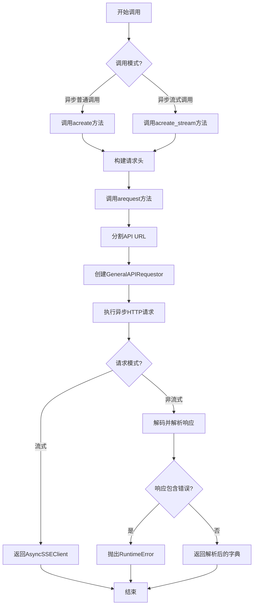
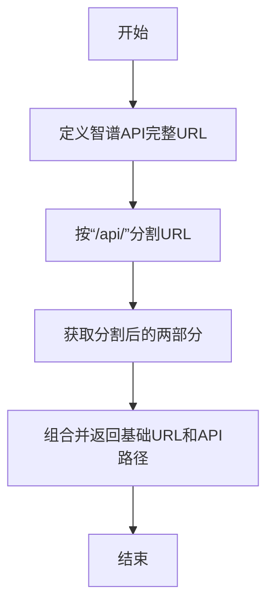
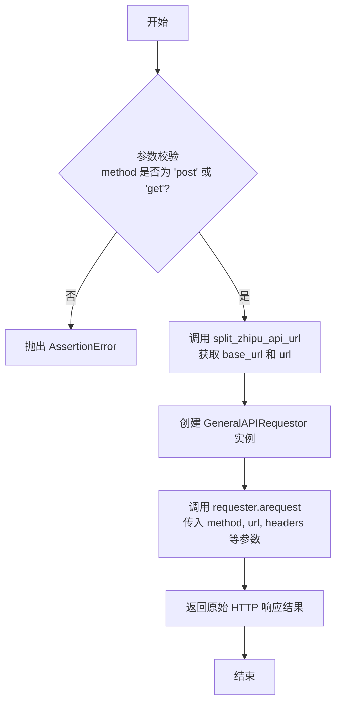
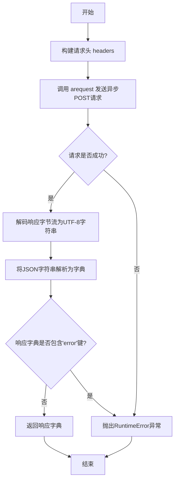
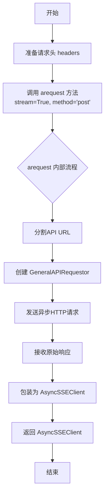

# `.\MetaGPT\metagpt\provider\zhipuai\zhipu_model_api.py` 详细设计文档

该文件为智谱AI大模型API的Python客户端封装，主要功能是提供同步和异步两种方式调用智谱AI的聊天补全接口（包括普通调用和流式调用），并对智谱AI官方SDK进行了适配和扩展，以更好地集成到MetaGPT框架中。

## 整体流程



## 类结构

```
ZhipuAI (父类，来自zhipuai库)
└── ZhiPuModelAPI (自定义封装类)
    ├── split_zhipu_api_url (实例方法)
    ├── arequest (实例方法)
    ├── acreate (实例方法)
    └── acreate_stream (实例方法)
```

## 全局变量及字段


    

## 全局函数及方法

### `ZhiPuModelAPI.split_zhipu_api_url`

该方法用于解析智谱AI的API基础URL，将其拆分为基础URL部分和API路径部分，旨在提供一个稳定的方式来构建请求URL，以应对未来API版本升级可能带来的路径变化。

参数：

- `self`：`ZhiPuModelAPI`，当前类的实例

返回值：`tuple[str, str]`，返回一个包含两个字符串的元组，第一个字符串是API的基础URL（例如 "https://open.bigmodel.cn/api"），第二个字符串是具体的API端点路径（例如 "/paas/v4/chat/completions"）

#### 流程图



#### 带注释源码

```python
def split_zhipu_api_url(self):
    # use this method to prevent zhipu api upgrading to different version.
    # and follow the GeneralAPIRequestor implemented based on openai sdk
    # 定义智谱AI聊天补全API的完整URL
    zhipu_api_url = "https://open.bigmodel.cn/api/paas/v4/chat/completions"
    # 使用“/api/”作为分隔符将完整URL分割成两部分
    arr = zhipu_api_url.split("/api/")
    # ("https://open.bigmodel.cn/api" , "/paas/v4/chat/completions")
    # 返回一个元组，第一部分是基础URL（分割后的第一部分加上“/api”），
    # 第二部分是API路径（分割后的第二部分，并在前面加上“/”）
    return f"{arr[0]}/api", f"/{arr[1]}"
```


### `ZhiPuModelAPI.arequest`

该方法是一个异步HTTP请求方法，用于向智谱AI的API端点发送请求。它封装了底层的HTTP调用，支持流式和非流式响应，是`acreate`和`acreate_stream`方法的基础。

参数：

- `stream`：`bool`，指示是否为流式请求。`True`表示流式（用于SSE），`False`表示非流式。
- `method`：`str`，HTTP请求方法，目前仅支持`"post"`或`"get"`。
- `headers`：`dict`，HTTP请求头，通常包含认证信息（如API Key）和内容类型。
- `kwargs`：`dict`，请求参数，将被作为请求体（对于POST）或查询参数（对于GET）发送。

返回值：`aiohttp.ClientResponse`，返回一个原始的、低级别的HTTP响应对象。调用者需要根据`stream`参数的值，自行处理响应体的解析（例如，对于非流式响应，解码为JSON；对于流式响应，使用`AsyncSSEClient`进行迭代）。

#### 流程图



#### 带注释源码

```python
async def arequest(self, stream: bool, method: str, headers: dict, kwargs):
    # TODO to make the async request to be more generic for models in http mode.
    # 这是一个待办事项，旨在未来使此异步请求方法能更通用地支持其他HTTP模式的模型。
    assert method in ["post", "get"]
    # 断言：确保请求方法只能是 'post' 或 'get'，这是当前实现所支持的。

    base_url, url = self.split_zhipu_api_url()
    # 调用内部方法，将智谱API的完整URL拆分为基础URL（如 https://open.bigmodel.cn/api）和路径部分（如 /paas/v4/chat/completions）。
    # 这样做是为了适配 GeneralAPIRequestor 的接口。

    requester = GeneralAPIRequestor(base_url=base_url)
    # 实例化一个通用的异步API请求器，它将负责实际的HTTP通信。

    result, _, api_key = await requester.arequest(
        method=method,
        url=url,
        headers=headers,
        stream=stream,
        params=kwargs,
        request_timeout=ZHIPUAI_DEFAULT_TIMEOUT.read,
    )
    # 发起异步请求。
    # `requester.arequest` 返回一个三元组 (result, response, api_key)。
    # 此处我们只关心 `result`（原始的 aiohttp.ClientResponse 对象），
    # 下划线 `_` 忽略第二个返回值（可能是处理后的响应对象），
    # `api_key` 是使用的API密钥，但在此上下文中未被使用。
    # `ZHIPUAI_DEFAULT_TIMEOUT.read` 提供了默认的读取超时时间。

    return result
    # 返回原始的HTTP响应对象。上层调用者（如 `acreate` 或 `acreate_stream`）负责处理这个响应。
```


### `ZhiPuModelAPI.acreate`

该方法用于异步调用智谱AI的聊天补全API，与原始的`async_invoke`方法不同，它通过单次HTTP请求直接获取最终结果，而无需通过任务ID轮询。它封装了请求的构建、发送、响应解码和错误处理。

参数：

- `**kwargs`：`dict`，可变关键字参数，用于传递API请求体，例如模型名称、消息列表、温度等参数。

返回值：`dict`，API返回的JSON响应体解码后的字典，包含聊天补全的结果或错误信息。

#### 流程图



#### 带注释源码

```python
async def acreate(self, **kwargs) -> dict:
    """async invoke different from raw method `async_invoke` which get the final result by task_id"""
    # 1. 获取默认请求头，通常包含认证信息（如API Key）
    headers = self._default_headers
    # 2. 调用内部异步请求方法arequest，发送非流式（stream=False）的POST请求
    resp = await self.arequest(stream=False, method="post", headers=headers, kwargs=kwargs)
    # 3. 将响应数据（字节流）解码为UTF-8字符串
    resp = resp.data.decode("utf-8")
    # 4. 将JSON格式的字符串解析为Python字典
    resp = json.loads(resp)
    # 5. 检查响应字典中是否包含"error"键，若存在则抛出运行时异常
    if "error" in resp:
        raise RuntimeError(
            f"Request failed, msg: {resp}, please ref to `https://open.bigmodel.cn/dev/api#error-code-v3`"
        )
    # 6. 返回成功的响应字典
    return resp
```

### `ZhiPuModelAPI.acreate_stream`

该方法用于异步调用智谱AI的流式聊天补全API，返回一个异步服务器发送事件（SSE）客户端，以便实时处理模型生成的流式响应。

参数：

- `**kwargs`：`dict`，传递给智谱AI聊天补全API的参数，例如消息列表、模型名称、温度等。

返回值：`AsyncSSEClient`，一个异步SSE客户端，用于迭代处理从智谱AI API返回的流式响应事件。

#### 流程图



#### 带注释源码

```python
async def acreate_stream(self, **kwargs) -> AsyncSSEClient:
    """async sse_invoke"""  # 异步流式调用
    headers = self._default_headers  # 获取默认请求头，通常包含认证信息
    # 调用arequest方法发起异步流式请求，并将返回的原始响应包装成AsyncSSEClient对象
    return AsyncSSEClient(await self.arequest(stream=True, method="post", headers=headers, kwargs=kwargs))
```

## 关键组件

### ZhiPuModelAPI类

封装了智谱AI的API调用，支持同步和异步的普通调用与流式调用，通过继承ZhipuAI类并重写请求方法，实现了与通用请求器GeneralAPIRequestor的集成。

### split_zhipu_api_url方法

用于拆分智谱AI的API基础URL和端点路径，目的是将URL适配到遵循OpenAI SDK风格的通用请求器GeneralAPIRequestor的调用格式，为后续的请求提供正确的URL结构。

### arequest方法

异步请求的核心方法，它使用GeneralAPIRequestor来执行HTTP请求，支持流式和非流式调用，并处理请求超时，是异步调用acreate和acreate_stream的底层实现。

### acreate方法

异步非流式调用方法，用于向智谱AI的聊天补全接口发送请求并一次性获取完整的响应结果，内部会检查响应中是否包含错误信息，并在出错时抛出异常。

### acreate_stream方法

异步流式调用方法，返回一个AsyncSSEClient对象，用于处理服务器发送事件（SSE）流，允许客户端逐步接收模型生成的响应，适用于需要实时交互或处理长文本生成的场景。

### GeneralAPIRequestor集成

作为通用的HTTP请求器，被ZhiPuModelAPI用于实际发起网络请求，它抽象了底层的HTTP客户端细节，提供了统一的请求接口，支持同步和异步操作，以及流式响应处理。

### AsyncSSEClient客户端

专门用于处理异步服务器发送事件（SSE）流的客户端，它能够从流式响应中逐步读取数据，适用于需要实时接收和处理模型生成结果的异步流式调用场景。

## 问题及建议


### 已知问题

-   **硬编码的API URL**：`split_zhipu_api_url` 方法中直接硬编码了智谱AI的API端点URL（`"https://open.bigmodel.cn/api/paas/v4/chat/completions"`）。如果智谱AI未来更改其API版本（例如从`v4`升级到`v5`）或基础域名，此代码将无法工作，需要手动修改。
-   **脆弱的URL分割逻辑**：`split_zhipu_api_url` 方法通过简单的字符串分割（`split("/api/")`）来构造 `base_url` 和 `url`。这种逻辑依赖于URL中必须包含且仅包含一个特定的`"/api/"`模式，如果智谱AI的URL结构发生变化（例如路径中增加或减少层级），此方法会失效。
-   **错误处理不充分**：在 `acreate` 方法中，仅检查响应字典中是否存在 `"error"` 键来判断请求是否失败。这依赖于智谱AI特定的错误响应格式。更健壮的做法是检查HTTP状态码或使用更通用的错误处理机制。
-   **同步与异步方法命名不一致**：父类 `ZhipuAI` 可能提供了同步的 `create` 和 `create_stream` 方法。本子类提供了异步版本 `acreate` 和 `acreate_stream`，但方法内部实现（如 `arequest`）与父类的同步请求逻辑可能不完全对应或复用，存在潜在的维护不一致风险。
-   **`arequest` 方法通用性不足**：`arequest` 方法的注释提到“TODO to make the async request to be more generic for models in http mode.”，表明开发者已意识到该方法目前主要是为智谱AI的特定端点定制的，缺乏对其他可能HTTP模型API的通用性支持。

### 优化建议

-   **将API URL配置化**：将智谱AI的API基础URL和端点路径提取为配置项（例如类属性、环境变量或配置文件参数）。这样在API变更时，只需更新配置而无需修改代码。
-   **重构URL构建逻辑**：使用 `urllib.parse` 等标准库来解析和构建URL，而不是简单的字符串分割。这可以提高代码对URL结构变化的鲁棒性。
-   **增强错误处理**：在 `arequest` 或 `acreate` 方法中，除了检查响应内容，还应处理网络异常（如超时、连接错误）和检查 `requester.arequest` 返回的HTTP状态码。可以定义一个自定义异常类来封装不同类型的错误。
-   **统一方法设计模式**：考虑重构代码，使同步和异步方法共享核心的请求逻辑（例如，通过一个内部方法处理请求构建和发送），仅在外层包装同步或异步调用。这可以减少代码重复并提高可维护性。可以研究父类 `ZhipuAI` 的同步实现以寻找复用点。
-   **提升 `arequest` 方法的通用性**：按照TODO注释的指引，将 `arequest` 方法设计得更通用。例如，使其不依赖于 `split_zhipu_api_url` 方法，而是接受完整的 `base_url` 和 `url` 参数。甚至可以将其进一步抽象，作为支持多种异步HTTP模型请求的基础工具方法。
-   **添加类型注解和文档**：为 `arequest` 方法的 `kwargs` 参数添加更详细的类型注解（例如 `Dict[str, Any]`）。为所有公共方法添加完整的文档字符串，说明其用途、参数、返回值和可能抛出的异常。
-   **考虑流式响应的错误处理**：`acreate_stream` 方法返回一个 `AsyncSSEClient`。需要考虑在流式传输过程中如果发生错误（例如服务器端错误、网络中断），客户端应如何检测和处理这些错误。目前的实现可能未包含这部分逻辑。


## 其它


### 设计目标与约束

1.  **兼容性与封装**：在智谱AI官方SDK（ZhipuAI）的基础上，提供异步（async/await）调用支持，以适配上层框架（如MetaGPT）的异步编程模型，同时保持与官方SDK同步接口的兼容性。
2.  **统一请求抽象**：通过`GeneralAPIRequestor`抽象HTTP请求细节，使本模块专注于智谱API的业务逻辑（如URL处理、错误响应解析），提高代码的可维护性和对底层HTTP库变化的抵抗力。
3.  **流式响应支持**：提供对Server-Sent Events (SSE) 流式响应的异步客户端（`AsyncSSEClient`）封装，以支持大语言模型的流式文本生成功能。
4.  **错误处理标准化**：拦截API返回的错误信息，并将其转换为标准的Python异常（`RuntimeError`），提供清晰的错误提示和官方文档链接。

### 错误处理与异常设计

1.  **输入验证**：`arequest`方法通过`assert`语句对HTTP方法进行基础验证，确保仅为`post`或`get`。在生产环境中，应考虑替换为更健壮的异常抛出。
2.  **API错误响应处理**：在`acreate`方法中，检查响应体是否包含`error`字段。若存在，则抛出`RuntimeError`异常，异常信息包含原始错误响应和官方错误码文档链接，便于调试。
3.  **网络与超时错误**：网络错误、连接超时等异常由底层的`GeneralAPIRequestor`和HTTP客户端库（如`aiohttp`）抛出，本模块不进行捕获，交由上层调用者处理。超时时间使用`ZHIPUAI_DEFAULT_TIMEOUT.read`常量定义。
4.  **数据解析错误**：对响应数据进行`json.loads`反序列化时可能抛出`JSONDecodeError`，此异常未在代码中显式捕获，将直接向上层传播。

### 数据流与状态机

1.  **同步调用数据流（`acreate`）**：
    *   **输入**：调用者传入的参数字典（`**kwargs`），通常包含`model`, `messages`, `temperature`等。
    *   **处理**：添加默认请求头，通过`arequest`发起异步POST请求（非流式）。
    *   **转换**：接收字节流响应，解码为UTF-8字符串，再反序列化为Python字典。
    *   **校验与输出**：检查字典中是否有`error`键。若无，则返回该字典作为最终结果；若有，则抛出异常。
2.  **流式调用数据流（`acreate_stream`）**：
    *   **输入**：与同步调用相同的参数字典（`**kwargs`）。
    *   **处理**：添加默认请求头，通过`arequest`发起异步POST请求（流式模式）。
    *   **封装与输出**：将返回的原始响应流对象封装到`AsyncSSEClient`实例中并返回。该客户端负责按SSE协议解析数据块，向上层提供一个异步迭代器接口。
3.  **状态**：本模块自身无复杂内部状态。其状态主要体现在与智谱API服务器的HTTP连接状态以及`AsyncSSEClient`内部对数据流的解析状态上。

### 外部依赖与接口契约

1.  **外部库依赖**：
    *   `zhipuai`：智谱AI官方SDK，用于继承`ZhipuAI`基类以获取API密钥管理和默认请求头等基础功能。
    *   `metagpt.provider.general_api_requestor.GeneralAPIRequestor`：项目内部通用的异步HTTP请求器，抽象了网络请求，是本模块与网络层的主要接口。
    *   `metagpt.provider.zhipuai.async_sse_client.AsyncSSEClient`：项目内部封装的异步SSE客户端，用于处理流式响应。
2.  **接口契约（对上游调用者）**：
    *   `acreate(**kwargs) -> dict`：异步非流式调用接口。期望接收与智谱AI聊天补全API兼容的参数，返回解析后的API响应字典。
    *   `acreate_stream(**kwargs) -> AsyncSSEClient`：异步流式调用接口。返回一个`AsyncSSEClient`实例，调用者可通过`async for`循环迭代获取流式数据块。
3.  **接口契约（对下游服务-智谱API）**：
    *   **URL**：通过`split_zhipu_api_url`方法硬编码构建 (`https://open.bigmodel.cn/api/paas/v4/chat/completions`)。此URL是智谱AI聊天补全API v4版本的端点。
    *   **HTTP方法**：POST。
    *   **Headers**：继承自`ZhipuAI._default_headers`，通常包含`Authorization: Bearer <api_key>`。
    *   **Body/Params**：调用者传入的`kwargs`字典，需符合智谱AI API文档要求。
    *   **超时**：使用`ZHIPUAI_DEFAULT_TIMEOUT.read`作为请求超时时间。

### 安全考虑

1.  **API密钥管理**：API密钥通过继承的`ZhipuAI`类进行管理，并自动添加到请求头（`Authorization`）中。密钥本身不应出现在日志或异常信息中。
2.  **数据传输**：所有与智谱API的通信均通过HTTPS协议进行，确保传输过程中的数据加密。
3.  **输入验证**：当前代码未对调用者传入的`kwargs`参数进行内容安全验证（如提示词注入、超长输入等）。此责任上移至调用方。未来可考虑增加基础的安全校验或长度限制。

### 测试策略建议

1.  **单元测试**：
    *   `split_zhipu_api_url`方法：验证其是否能正确分割硬编码的URL。
    *   `acreate`方法：使用Mock模拟`arequest`的返回，测试正常响应解析、错误响应异常抛出、JSON解析异常等场景。
    *   `acreate_stream`方法：测试其是否正确创建并返回`AsyncSSEClient`实例。
2.  **集成测试**：
    *   使用测试用的API密钥，对真实（或沙箱）智谱API端点进行小规模、低成本的调用，验证整个请求-响应链路的正确性，包括同步和流式调用。
    *   测试网络异常、超时等情况下的行为。
3.  **模拟（Mock）**：重点模拟`GeneralAPIRequestor.arequest`方法，以隔离网络依赖，使单元测试快速且稳定。


    