# `.\MetaGPT\metagpt\provider\zhipuai_api.py` 详细设计文档

该文件是智谱AI大语言模型（LLM）的提供者实现，继承自MetaGPT框架的BaseLLM基类。它封装了与智谱AI开放平台API的交互，支持同步和异步的文本补全（completion）功能，包括流式响应处理。核心功能包括根据配置初始化客户端、构建API请求参数、调用智谱AI的聊天补全接口、处理响应（包括流式与非流式）、记录token使用量以进行成本管理，并将结果集成到MetaGPT的LLM提供商注册系统中。

## 整体流程

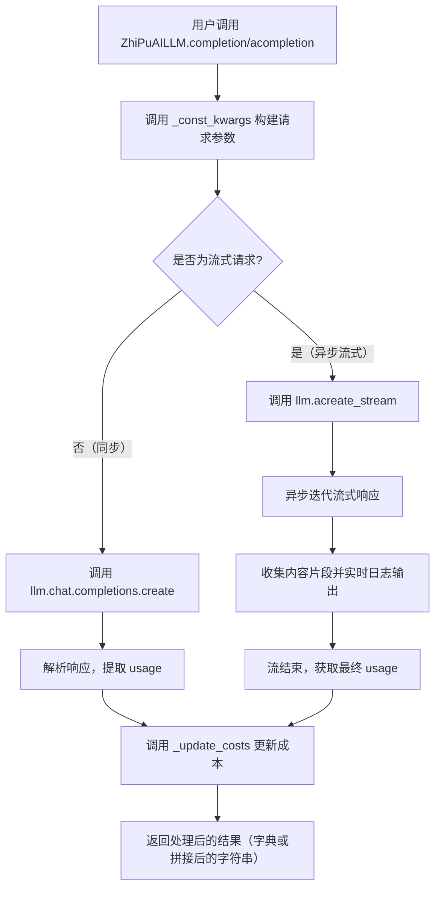

## 类结构

```
BaseLLM (抽象基类，来自 metagpt.provider.base_llm)
└── ZhiPuAILLM (智谱AI LLM 具体实现类)
    ├── __init__
    ├── __init_zhipuai
    ├── _const_kwargs
    ├── completion
    ├── _achat_completion
    ├── acompletion
    └── _achat_completion_stream

ZhiPuEvent (枚举类)
├── ADD
├── ERROR
├── INTERRUPTED
└── FINISH
```

## 全局变量及字段


### `ZhiPuAILLM.config`
    
LLM配置对象，包含API密钥、模型名称、定价计划等配置信息

类型：`LLMConfig`
    


### `ZhiPuAILLM.api_key`
    
智谱AI的API密钥，用于身份验证和API调用

类型：`str`
    


### `ZhiPuAILLM.model`
    
使用的智谱AI模型名称，如glm-3-turbo、glm-4等

类型：`str`
    


### `ZhiPuAILLM.pricing_plan`
    
定价计划，用于成本计算，默认为模型名称

类型：`str`
    


### `ZhiPuAILLM.llm`
    
智谱AI模型API客户端实例，用于实际调用智谱AI的API

类型：`ZhiPuModelAPI`
    


### `ZhiPuAILLM.cost_manager`
    
成本管理器实例，用于跟踪和管理API调用成本，初始为None

类型：`Optional[CostManager]`
    
    

## 全局函数及方法

### `register_provider`

`register_provider` 是一个全局函数，用于将特定的 LLM 提供者（如 ZhiPuAI）注册到 LLM 提供者注册表中。它通过装饰器模式，将类与一个枚举键（如 `LLMType.ZHIPUAI`）关联起来，使得系统能够根据配置动态地实例化和使用对应的 LLM 类。

参数：

- `llm_type`：`LLMType`，一个枚举值，表示要注册的 LLM 类型（例如 `LLMType.ZHIPUAI`）。

返回值：`Callable[[Type[BaseLLM]], Type[BaseLLM]]`，返回一个装饰器函数，该装饰器接受一个 `BaseLLM` 的子类作为参数，并将其注册到提供者注册表中，然后返回该类本身。

#### 流程图

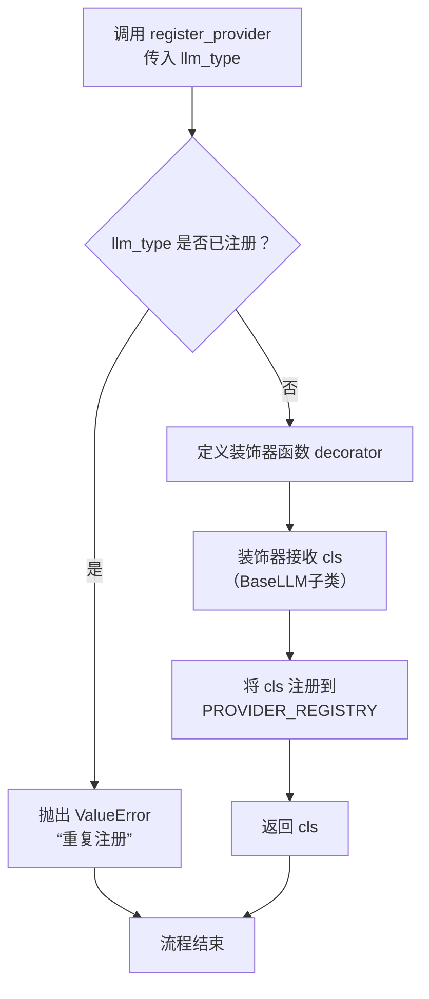

#### 带注释源码

```python
def register_provider(llm_type: LLMType) -> Callable[[Type[BaseLLM]], Type[BaseLLM]]:
    """
    注册一个 LLM 提供者类的装饰器。

    此函数用于将特定的 LLM 提供者（例如 ZhiPuAI）与一个 LLMType 枚举值关联起来。
    它通过装饰器模式，将被装饰的类（必须是 BaseLLM 的子类）注册到一个全局的
    提供者注册表（PROVIDER_REGISTRY）中。当系统需要根据配置实例化 LLM 时，
    可以通过 LLMType 查找到对应的类。

    Args:
        llm_type (LLMType): 要注册的 LLM 类型枚举值，例如 LLMType.ZHIPUAI。

    Returns:
        Callable[[Type[BaseLLM]], Type[BaseLLM]]: 一个装饰器函数，它接受一个
        BaseLLM 的子类，将其注册，然后返回该类。

    Raises:
        ValueError: 如果尝试用同一个 llm_type 重复注册不同的提供者类。

    Example:
        @register_provider(LLMType.ZHIPUAI)
        class ZhiPuAILLM(BaseLLM):
            ...
    """
    def decorator(cls: Type[BaseLLM]) -> Type[BaseLLM]:
        # 检查是否已经存在该 llm_type 的注册记录
        if llm_type in PROVIDER_REGISTRY:
            # 如果已注册的类与当前要注册的类不同，则抛出错误，防止覆盖
            registered_cls = PROVIDER_REGISTRY[llm_type]
            if registered_cls is not cls:
                raise ValueError(
                    f"Attempted to register different providers '{cls.__name__}' and "
                    f"'{registered_cls.__name__}' for the same llm_type '{llm_type.value}'."
                )
        # 将类注册到全局注册表中
        PROVIDER_REGISTRY[llm_type] = cls
        # 返回类本身，允许装饰器链式调用或保持类原有属性
        return cls
    return decorator
```

### `ZhiPuAILLM.__init__`

该方法用于初始化智谱AI大语言模型（ZhiPuAILLM）的实例。它接收一个LLMConfig配置对象，并基于该配置初始化API密钥、模型名称、定价计划以及底层的ZhiPuModelAPI客户端。同时，它还会初始化一个可选的CostManager实例，用于后续的成本管理。

参数：

- `config`：`LLMConfig`，包含大语言模型配置信息的对象，如API密钥、模型名称、定价计划等。

返回值：`None`，该方法不返回任何值。

#### 流程图

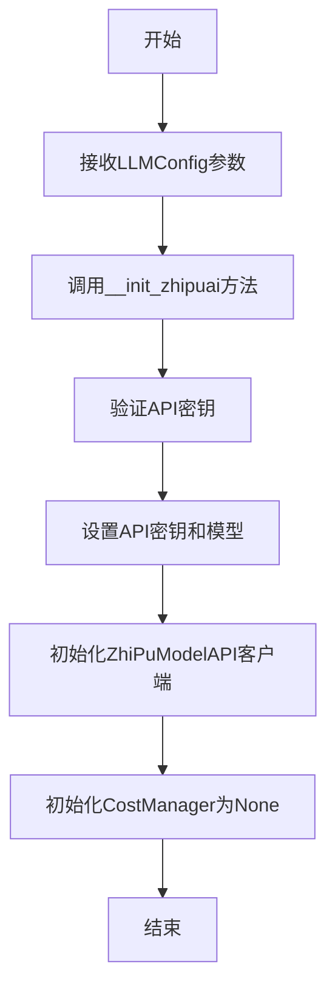

#### 带注释源码

```python
def __init__(self, config: LLMConfig):
    # 将传入的配置对象保存到实例变量中
    self.config = config
    # 调用私有方法初始化智谱AI相关的配置和客户端
    self.__init_zhipuai()
    # 初始化成本管理器，初始值为None，后续可能根据需要进行设置
    self.cost_manager: Optional[CostManager] = None
```

### `ZhiPuAILLM.__init_zhipuai`

该方法用于初始化智谱AI大语言模型（ZhiPuAILLM）的核心组件，包括设置API密钥、模型名称、定价计划以及创建底层的API客户端实例。它是类实例化过程中调用的私有方法，确保在后续使用LLM服务前完成必要的配置。

参数：
-  `self`：`ZhiPuAILLM`，当前`ZhiPuAILLM`类的实例。

返回值：`None`，该方法不返回任何值，其作用是为当前实例（`self`）设置相关属性。

#### 流程图

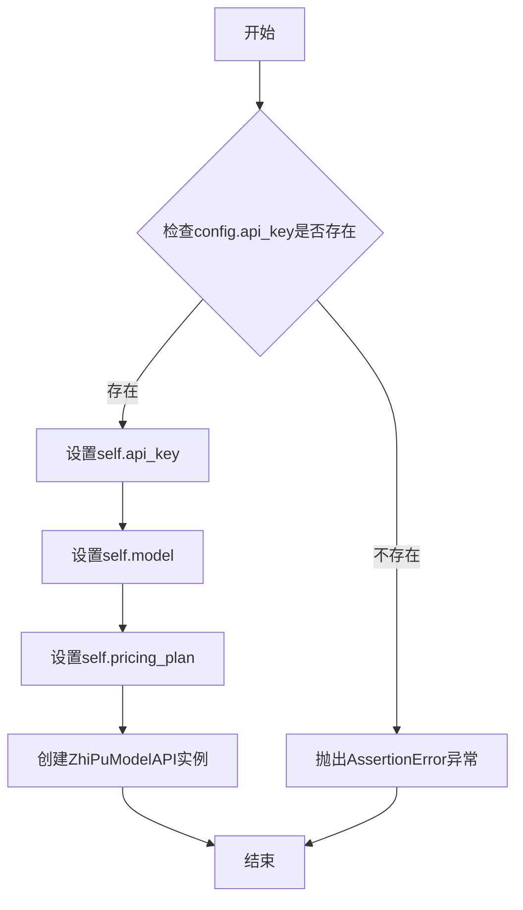

#### 带注释源码

```python
def __init_zhipuai(self):
    # 断言检查：确保配置对象（self.config）中包含了必需的API密钥。
    # 如果api_key不存在或为空，程序将在此处抛出AssertionError异常。
    assert self.config.api_key

    # 从配置中提取API密钥并赋值给实例变量，用于后续的API认证。
    self.api_key = self.config.api_key

    # 从配置中提取模型名称（例如 'glm-3-turbo' 或 'glm-4'）并赋值给实例变量。
    self.model = self.config.model  # so far, it support glm-3-turbo、glm-4

    # 设置定价计划。如果配置中指定了pricing_plan，则使用它；否则，默认使用模型名称作为定价计划。
    self.pricing_plan = self.config.pricing_plan or self.model

    # 使用上面设置的API密钥，创建智谱AI模型API的客户端实例（ZhiPuModelAPI）。
    # 这个实例（self.llm）将用于后续所有与智谱AI服务的交互，如发起聊天补全请求。
    self.llm = ZhiPuModelAPI(api_key=self.api_key)
```

### `ZhiPuAILLM._const_kwargs`

该方法用于构建调用智谱AI大模型API时所需的参数字典。它根据类实例的配置（如最大token数、温度）和传入的消息列表，生成一个包含模型、消息、流式控制等关键参数的字典，作为API调用的输入。

参数：

- `messages`：`list[dict]`，包含对话消息的列表，每个消息是一个字典，通常包含`role`和`content`字段。
- `stream`：`bool`，默认为`False`，指示是否使用流式响应。

返回值：`dict`，返回一个包含模型调用所需参数的字典，键包括`model`、`max_tokens`、`messages`、`stream`和`temperature`。

#### 流程图

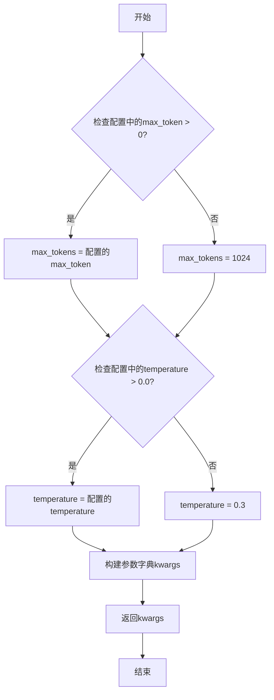

#### 带注释源码

```python
def _const_kwargs(self, messages: list[dict], stream: bool = False) -> dict:
    # 根据配置确定max_tokens，如果配置值小于等于0，则使用默认值1024
    max_tokens = self.config.max_token if self.config.max_token > 0 else 1024
    # 根据配置确定temperature，如果配置值小于等于0.0，则使用默认值0.3
    temperature = self.config.temperature if self.config.temperature > 0.0 else 0.3
    # 构建参数字典，包含模型名称、最大token数、消息列表、流式标志和温度参数
    kwargs = {
        "model": self.model,
        "max_tokens": max_tokens,
        "messages": messages,
        "stream": stream,
        "temperature": temperature,
    }
    return kwargs
```

### `ZhiPuAILLM.completion`

该方法用于同步调用智谱AI的聊天补全接口，根据传入的消息列表生成模型回复，并记录使用成本。

参数：

- `messages`：`list[dict]`，包含对话历史的消息列表，每个消息是一个字典，通常包含"role"和"content"键。
- `timeout`：`int`，请求超时时间（秒），默认使用配置中的超时设置。

返回值：`dict`，包含智谱AI API返回的完整响应数据，已转换为字典格式。

#### 流程图

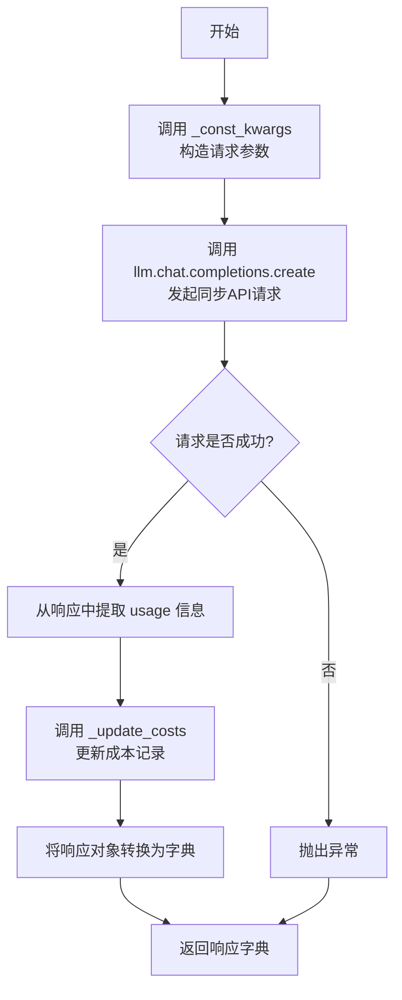

#### 带注释源码

```python
def completion(self, messages: list[dict], timeout=USE_CONFIG_TIMEOUT) -> dict:
    # 1. 调用 _const_kwargs 方法，根据配置和输入消息构造API请求参数字典。
    #    参数包括模型名称、最大token数、消息列表、流式输出标志和温度。
    resp: Completion = self.llm.chat.completions.create(**self._const_kwargs(messages))
    
    # 2. 从响应对象中提取 usage 字段（包含token使用量），并将其转换为字典。
    usage = resp.usage.model_dump()
    
    # 3. 调用内部方法 _update_costs，根据本次请求的token使用量更新成本管理器。
    self._update_costs(usage)
    
    # 4. 将整个响应对象（Completion类型）转换为字典并返回给调用者。
    return resp.model_dump()
```

### `ZhiPuAILLM._achat_completion`

该方法是一个异步方法，用于向智谱AI的聊天补全API发起异步请求，处理响应，并更新成本。

参数：

- `messages`：`list[dict]`，包含对话消息的列表，每个消息是一个字典，通常包含"role"和"content"键。
- `timeout`：`int`，请求的超时时间，默认使用配置中的超时设置。

返回值：`dict`，返回API响应的字典，包含模型生成的回复内容、使用量等信息。

#### 流程图

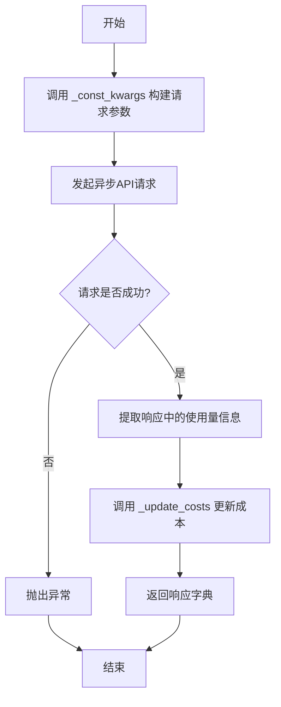

#### 带注释源码

```python
async def _achat_completion(self, messages: list[dict], timeout=USE_CONFIG_TIMEOUT) -> dict:
    # 调用 _const_kwargs 方法构建请求参数，包括模型、最大令牌数、消息列表等
    resp = await self.llm.acreate(**self._const_kwargs(messages))
    # 从响应中提取使用量信息，如果不存在则使用空字典
    usage = resp.get("usage", {})
    # 调用 _update_costs 方法更新成本管理器中的使用成本
    self._update_costs(usage)
    # 返回完整的响应字典
    return resp
```

### `ZhiPuAILLM.acompletion`

该方法是一个异步方法，用于向智谱AI的聊天模型发起非流式（一次性）的补全请求。它接收一个消息列表，调用底层的异步聊天补全接口，处理响应（包括更新成本），并返回一个包含完整响应的字典。

参数：

- `messages`：`list[dict]`，一个字典列表，其中每个字典代表一条消息，通常包含"role"（如"user"、"assistant"、"system"）和"content"字段，用于构建与模型的对话上下文。
- `timeout`：`int`，请求的超时时间（秒）。默认值为`USE_CONFIG_TIMEOUT`，表示使用配置中定义的超时时间。

返回值：`dict`，一个字典，包含了智谱AI模型对给定消息列表的完整响应。该字典的结构与智谱AI API的响应格式一致，通常包含`id`、`choices`、`usage`等字段。

#### 流程图

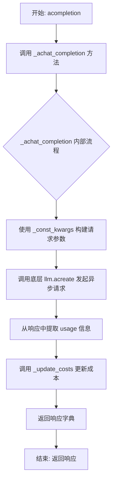

#### 带注释源码

```python
async def acompletion(self, messages: list[dict], timeout=USE_CONFIG_TIMEOUT) -> dict:
    # 调用内部的异步聊天补全方法 _achat_completion
    # 将 messages 和经过 get_timeout 方法处理后的 timeout 参数传递给它
    return await self._achat_completion(messages, timeout=self.get_timeout(timeout))
```


### `ZhiPuAILLM._achat_completion_stream`

该方法用于与智谱AI的大语言模型进行异步流式对话。它通过智谱AI的API发送请求，并以流式（stream）方式接收模型的响应。在接收过程中，它会实时收集模型返回的文本片段，并记录到日志中。当流式响应结束时，它会汇总所有收到的文本片段作为完整的回复内容，并根据API返回的用量信息更新成本。最终，该方法返回模型生成的完整文本。

参数：

-  `messages`：`list[dict]`，包含对话历史和当前请求的消息列表。每个字典通常包含`role`（如`user`、`assistant`、`system`）和`content`（消息内容）字段。
-  `timeout`：`int`，请求的超时时间（单位：秒）。默认值为`USE_CONFIG_TIMEOUT`，表示使用配置中定义的超时时间。

返回值：`str`，模型生成的完整回复文本。

#### 流程图

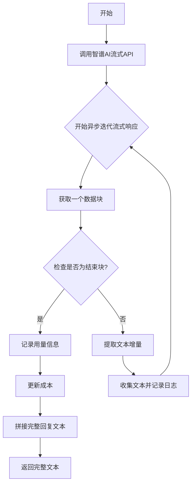

#### 带注释源码

```python
async def _achat_completion_stream(self, messages: list[dict], timeout=USE_CONFIG_TIMEOUT) -> str:
    # 调用智谱AI模型的异步流式创建方法，传入消息和流式参数
    response = await self.llm.acreate_stream(**self._const_kwargs(messages, stream=True))
    # 初始化一个列表，用于收集模型返回的文本内容片段
    collected_content = []
    # 初始化一个字典，用于存储API返回的用量信息（如token数量）
    usage = {}
    # 异步迭代流式响应的每一个数据块
    async for chunk in response.stream():
        # 从当前数据块中获取结束原因（例如，模型生成完毕会返回"stop"）
        finish_reason = chunk.get("choices")[0].get("finish_reason")
        # 判断是否为流式响应的结束块
        if finish_reason == "stop":
            # 如果是结束块，则从中提取用量信息
            usage = chunk.get("usage", {})
        else:
            # 如果不是结束块，则从数据块中提取模型生成的文本增量
            content = self.get_choice_delta_text(chunk)
            # 将提取到的文本增量添加到收集列表中
            collected_content.append(content)
            # 将文本增量记录到LLM流式日志中，便于实时观察
            log_llm_stream(content)

    # 在流式响应结束后，在日志中输出一个换行符，使日志更清晰
    log_llm_stream("\n")

    # 使用从结束块中获取的用量信息来更新本次调用的成本
    self._update_costs(usage)
    # 将收集到的所有文本片段拼接成一个完整的字符串
    full_content = "".join(collected_content)
    # 返回模型生成的完整回复内容
    return full_content
```


### `ZhiPuAILLM._update_costs`

该方法用于更新当前语言模型调用的成本。它接收一个包含本次调用使用量统计信息的字典，根据配置的定价方案和模型名称，计算出本次调用的成本，并委托给`CostManager`实例进行记录和累计。

参数：

-  `usage`：`dict`，包含本次语言模型调用使用量统计信息的字典。通常包含`prompt_tokens`（提示词令牌数）、`completion_tokens`（补全令牌数）和`total_tokens`（总令牌数）等字段。

返回值：`None`，该方法不返回任何值，其作用在于更新内部成本管理器的状态。

#### 流程图

```mermaid
flowchart TD
    A[开始: _update_costs(usage)] --> B{检查self.cost_manager<br>是否存在?};
    B -- 否 --> C[结束: 无操作];
    B -- 是 --> D[从usage字典中提取<br>prompt_tokens与completion_tokens];
    D --> E[调用self.cost_manager.update_cost<br>传入prompt_tokens, completion_tokens,<br>self.model, self.pricing_plan];
    E --> F[结束];
```

#### 带注释源码

```python
def _update_costs(self, usage: dict):
    """
    更新本次调用的成本。
    该方法从`usage`字典中提取令牌使用量，并调用成本管理器进行记录。
    如果成本管理器未初始化，则跳过更新。

    Args:
        usage (dict): 包含令牌使用量的字典，例如
                      {'prompt_tokens': 10, 'completion_tokens': 20, 'total_tokens': 30}。
    """
    # 检查成本管理器实例是否存在，如果不存在则直接返回，避免后续操作出错。
    if self.cost_manager is None:
        return
    # 从传入的`usage`字典中安全地获取提示令牌数和补全令牌数。
    # 使用`.get()`方法并提供默认值0，防止字典中缺少相应键导致KeyError。
    prompt_tokens = int(usage.get("prompt_tokens", 0))
    completion_tokens = int(usage.get("completion_tokens", 0))
    # 将提取的令牌数、当前模型名称和定价方案传递给成本管理器的`update_cost`方法。
    # 成本管理器内部会根据这些信息计算并累计成本。
    self.cost_manager.update_cost(prompt_tokens, completion_tokens, self.model, self.pricing_plan)
```


### `ZhiPuAILLM.get_choice_delta_text`

该方法用于从智谱AI流式响应（streaming response）的单个数据块（chunk）中提取增量文本内容（delta text）。它解析响应块中的`choices`字段，获取第一个选择（choice）的`delta`字段中的`content`值，该值代表了模型在当前流式响应步骤中新生成的文本片段。如果`content`不存在，则返回空字符串。

参数：

- `chunk`：`dict`，智谱AI流式响应返回的单个数据块，通常包含`choices`等字段。

返回值：`str`，从响应块中提取的增量文本内容，如果不存在则返回空字符串。

#### 流程图

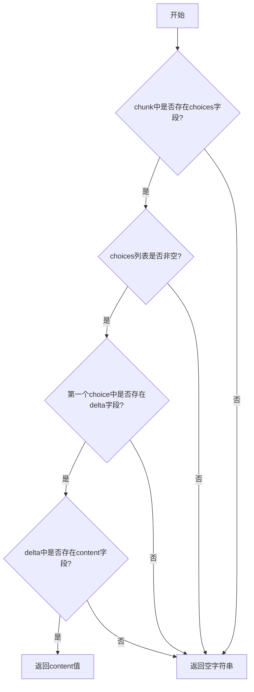

#### 带注释源码

```python
def get_choice_delta_text(self, chunk: dict) -> str:
    """
    从流式响应块中提取增量文本内容。

    该方法解析智谱AI流式响应返回的单个数据块（chunk），
    尝试从`chunk['choices'][0]['delta']['content']`路径获取内容。
    如果路径中任何一级不存在，则返回空字符串。

    Args:
        chunk (dict): 流式响应数据块，通常包含`choices`等字段。

    Returns:
        str: 提取到的增量文本内容，如果不存在则返回空字符串。
    """
    # 检查chunk中是否存在'choices'键，且其值为非空列表
    if "choices" not in chunk or len(chunk.get("choices")) == 0:
        return ""
    # 获取第一个choice
    choice = chunk.get("choices")[0]
    # 检查choice中是否存在'delta'键
    if "delta" not in choice:
        return ""
    # 获取delta字典
    delta = choice.get("delta")
    # 检查delta中是否存在'content'键，并返回其值，若不存在则返回空字符串
    return delta.get("content", "")
```


### `ZhiPuAILLM.get_timeout`

该方法用于获取或计算实际的超时时间。它接收一个可选的 `timeout` 参数，如果该参数不是 `USE_CONFIG_TIMEOUT` 常量，则直接返回该值；否则，它将从 `self.config` 中获取 `timeout` 配置并返回。这提供了一个灵活的机制，允许在方法调用时指定特定的超时时间，同时也能回退到配置中定义的默认超时设置。

参数：

- `timeout`：`int`，可选的超时时间（秒）。如果传入 `USE_CONFIG_TIMEOUT` 常量，则使用配置中的超时设置；否则使用传入的值。

返回值：`int`，计算或获取到的实际超时时间（秒）。

#### 流程图

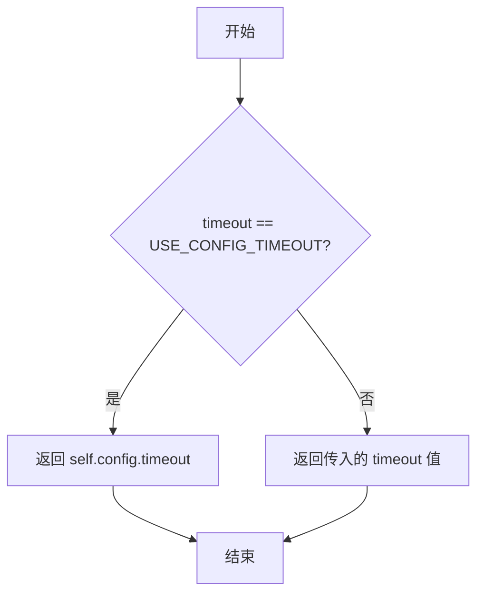

#### 带注释源码

```
def get_timeout(self, timeout: int = USE_CONFIG_TIMEOUT) -> int:
    """
    获取或计算实际的超时时间。

    如果传入的 `timeout` 参数是 `USE_CONFIG_TIMEOUT`，则返回配置中的超时设置；
    否则，直接返回传入的 `timeout` 值。

    Args:
        timeout (int): 可选的超时时间（秒）。默认为 `USE_CONFIG_TIMEOUT`。

    Returns:
        int: 实际的超时时间（秒）。
    """
    if timeout == USE_CONFIG_TIMEOUT:
        # 使用配置中定义的超时时间
        return self.config.timeout
    else:
        # 使用调用时传入的特定超时时间
        return timeout
```


## 关键组件


### ZhiPuAILLM 类

ZhiPuAILLM 类是智谱AI大语言模型（LLM）的提供者实现，继承自 BaseLLM，负责与智谱AI的API进行交互，包括同步/异步的文本补全和流式响应处理。

### ZhiPuModelAPI 组件

ZhiPuModelAPI 是封装了智谱AI官方SDK或API调用的底层客户端，由 ZhiPuAILLM 类初始化并使用，负责实际发起HTTP请求到智谱AI的服务端点。

### 配置管理 (LLMConfig)

LLMConfig 对象承载了LLM运行所需的所有配置参数，如API密钥、模型名称、最大token数、温度等，是 ZhiPuAILLM 类初始化的核心输入。

### 成本管理器 (CostManager)

CostManager 是一个可选的组件，用于跟踪和管理每次API调用的token使用量及相关成本，在每次API调用后通过 `_update_costs` 方法更新使用情况。

### 流式响应处理

`_achat_completion_stream` 方法实现了异步流式响应处理，它逐步接收API返回的数据块，实时记录并拼接内容，最终在流结束时汇总完整响应并更新成本。

### 请求参数构造 (`_const_kwargs` 方法)

`_const_kwargs` 方法根据配置和输入消息，构造出符合智谱AI API要求的请求参数字典，确保了请求格式的正确性和一致性。


## 问题及建议


### 已知问题

-   **异步流式响应处理逻辑不健壮**：`_achat_completion_stream` 方法中，`usage` 信息的获取依赖于流式响应最后一个数据块（`finish_reason == "stop"`）中包含的 `usage` 字段。如果 API 响应格式不符合预期或最后一个数据块不包含 `usage` 信息，将导致成本统计（`_update_costs`）失败或统计不准确。
-   **错误处理机制缺失**：代码中没有对 API 调用（如 `self.llm.chat.completions.create` 或 `self.llm.acreate`）可能抛出的异常（如网络错误、认证失败、额度不足、模型调用错误等）进行捕获和处理。这可能导致程序在遇到外部服务问题时直接崩溃。
-   **配置参数验证不足**：`__init_zhipuai` 方法仅验证了 `api_key` 的存在性，未对 `model` 等配置参数的有效性进行校验。如果传入不支持的模型名称，错误将在实际 API 调用时才会暴露，增加了调试成本。
-   **硬编码默认值**：`_const_kwargs` 方法中，当 `max_token` 和 `temperature` 配置值无效时，使用了硬编码的默认值（1024 和 0.3）。这些默认值可能不符合所有场景的需求，且与智谱AI官方API的默认行为可能不一致，缺乏灵活性。
-   **成本管理器可选性导致潜在空指针**：`cost_manager` 被初始化为 `Optional[CostManager]` 且默认值为 `None`。在 `_update_costs` 方法（虽然未在提供代码中展示，但从上下文推断其存在）被调用时，如果 `cost_manager` 为 `None`，可能导致运行时错误。
-   **同步与异步方法实现不一致**：`completion`（同步）方法直接调用 `self.llm.chat.completions.create` 并处理 `Completion` 对象，而 `_achat_completion`（异步）方法调用 `self.llm.acreate` 并处理字典。这种实现上的差异可能导致行为不一致，增加了维护复杂性和潜在的错误风险。
-   **流式响应文本提取逻辑脆弱**：`_achat_completion_stream` 方法中，使用 `self.get_choice_delta_text(chunk)` 来提取内容。该方法的健壮性依赖于父类 `BaseLLM` 的实现。如果响应数据格式变化或 `chunk` 结构不符合预期，此方法可能失效。

### 优化建议

-   **增强流式响应处理的健壮性**：重构 `_achat_completion_stream` 方法，不要仅依赖最后一个数据块来获取 `usage`。可以改为在流式响应结束后，单独发起一次非流式请求来获取准确的用量信息（如果API支持），或者设计一个更鲁棒的机制来累计流式响应中的 token 计数（如果流式数据块中包含部分用量信息）。
-   **引入全面的异常处理**：在所有与外部API交互的方法（如 `completion`, `_achat_completion`, `_achat_completion_stream`）中，使用 `try-except` 块捕获可能出现的异常（如 `requests.exceptions.RequestException`, `zhipuai.APIError` 等），并转换为统一的内部异常或记录日志后抛出，提高系统的容错能力。
-   **增加配置验证**：在 `__init_zhipuai` 方法中，增加对 `model` 等关键参数的验证。可以维护一个支持模型列表，或在初始化时尝试一个轻量级的API调用（如获取模型列表）来验证配置的有效性。
-   **将默认值配置化**：将 `_const_kwargs` 方法中的硬编码默认值（1024, 0.3）移除，改为从 `LLMConfig` 配置中读取。如果配置中未设置，则应遵循智谱AI官方SDK或API的默认行为，或者提供一个清晰、可配置的默认值策略。
-   **确保成本管理器的正确初始化**：在 `__init__` 方法中，根据配置或应用需求，明确初始化 `self.cost_manager` 实例，而不是让其保持为 `None`。或者，在 `_update_costs` 方法内部增加空值检查，避免空指针异常。
-   **统一同步与异步方法的实现逻辑**：审查并重构代码，确保同步 (`completion`) 和异步 (`_achat_completion`) 方法在调用底层API、处理响应对象和错误处理方面的逻辑尽可能一致。考虑使用一个公共的内部方法来封装核心的请求构造和响应处理逻辑。
-   **改进流式内容提取方法**：为 `self.get_choice_delta_text` 方法增加更详细的日志和错误处理，确保在遇到意外数据格式时能优雅降级或抛出有意义的异常。同时，考虑将流式响应处理逻辑（如内容收集、日志打印）抽象成更可测试和可复用的组件。
-   **添加类型注解与文档**：为方法参数和返回值添加更精确的类型注解（例如，`messages` 列表的具体结构）。同时，为关键方法添加详细的文档字符串，说明其功能、参数、返回值以及可能抛出的异常。
-   **考虑连接池与超时优化**：评估当前超时机制（`USE_CONFIG_TIMEOUT`）是否足够。对于生产环境，考虑配置更精细的超时策略（如连接超时、读取超时）以及HTTP连接池，以提高在高并发下的性能和稳定性。


## 其它


### 设计目标与约束

1.  **设计目标**：
    *   提供对智谱AI大模型API（特别是GLM系列模型）的统一、异步友好的访问接口。
    *   集成到MetaGPT的LLM提供商框架中，实现与`BaseLLM`基类的无缝对接。
    *   支持流式和非流式两种响应模式，以满足不同场景下的需求。
    *   集成成本管理功能，自动跟踪和计算API调用开销。
    *   提供清晰的日志输出，便于调试和监控。

2.  **设计约束**：
    *   必须继承自`BaseLLM`抽象基类，并实现其定义的接口（如`completion`, `acompletion`）。
    *   必须通过`register_provider`装饰器注册到`LLMType.ZHIPUAI`类型下，以被MetaGPT的LLM工厂识别和加载。
    *   配置（如API Key、模型名称、超时等）必须通过统一的`LLMConfig`对象进行管理。
    *   需要处理智谱AI API特定的请求参数构造和响应格式解析。
    *   异步方法需正确处理超时和异常，确保系统稳定性。

### 错误处理与异常设计

1.  **初始化阶段**：
    *   `__init_zhipuai`方法中通过`assert`检查`config.api_key`是否存在。若缺失，程序将抛出`AssertionError`。在生产环境中，建议替换为更友好的配置验证和异常抛出。

2.  **API调用阶段**：
    *   `completion`和`_achat_completion`方法直接调用底层SDK。SDK内部可能抛出网络异常（如`requests.exceptions.RequestException`或`aiohttp.ClientError`）、认证错误、配额不足或服务器错误等。这些异常会向上传播，需要调用者（如MetaGPT框架）进行捕获和处理。
    *   `_achat_completion_stream`方法在迭代流式响应时，如果流中断或发生错误，异步迭代器可能抛出异常。当前代码未显式处理流读取过程中的异常。

3.  **响应解析阶段**：
    *   代码假设API响应格式符合预期（例如，`resp.usage`存在）。如果API返回非预期格式，访问`resp.usage`或`chunk.get("choices")[0]`可能导致`KeyError`或`IndexError`。
    *   `get_choice_delta_text`方法（从父类`BaseLLM`继承）负责从流式响应块中提取文本。其内部实现需兼容智谱AI的流式数据格式。

4.  **成本更新阶段**：
    *   `_update_costs`方法（从父类`BaseLLM`继承）在更新成本时，如果`usage`字典格式不正确或`cost_manager`未初始化，可能引发异常。

5.  **建议的增强**：
    *   在关键方法（如`acompletion`, `_achat_completion_stream`）内部添加`try-except`块，捕获特定异常并转换为框架定义的统一异常类型（如果存在），或至少记录详细的错误日志。
    *   对API响应进行更健壮的校验，例如检查`resp`对象是否包含必需的字段。

### 数据流与状态机

1.  **主要数据流**：
    *   **配置加载**：`LLMConfig` -> `ZhiPuAILLM.__init__` -> `self.config` -> `__init_zhipuai` -> `self.api_key`, `self.model`, `self.llm`。
    *   **请求构造**：用户传入`messages` -> `_const_kwargs` -> 合并`self.config`中的参数（`max_token`, `temperature`）和模型标识 -> 标准化的请求参数字典。
    *   **同步调用**：`completion` -> `self.llm.chat.completions.create` -> 智谱AI API -> `Completion`对象 -> 提取`usage`并更新成本 -> 转换为字典返回。
    *   **异步非流式调用**：`acompletion` -> `_achat_completion` -> `self.llm.acreate` -> 智谱AI API -> 响应字典 -> 提取`usage`并更新成本 -> 返回响应字典。
    *   **异步流式调用**：`acompletion` (需通过框架指定流式模式) -> `_achat_completion_stream` -> `self.llm.acreate_stream` -> 智谱AI API流式响应 -> 异步迭代处理每个`chunk` -> 收集内容并实时日志输出 -> 流结束(`finish_reason == "stop"`)时提取`usage`并更新成本 -> 拼接并返回完整内容。

2.  **状态机（流式处理）**：
    *   **开始**：调用`_achat_completion_stream`，建立连接。
    *   **流中**：循环`async for chunk in response.stream()`。每个`chunk`代表一个增量响应。状态由`finish_reason`标识：
        *   `None` 或 非`"stop"`：持续收集内容(`collected_content.append(content)`)。
        *   `"stop"`：流正常结束，记录最终用量(`usage`)。
    *   **结束**：退出循环，更新成本，拼接内容并返回。如果流异常中断，`async for`循环可能提前退出并抛出异常。

### 外部依赖与接口契约

1.  **外部依赖库**：
    *   `zhipuai`：智谱AI官方Python SDK，用于发起API请求。核心依赖其`types.chat.chat_completion.Completion`类型和`ZhiPuModelAPI`类（后者可能来自项目内的封装`zhipu_model_api`）。
    *   `metagpt`：所属框架。依赖其配置系统(`LLMConfig`)、常量(`USE_CONFIG_TIMEOUT`)、日志工具(`log_llm_stream`)、基类(`BaseLLM`)、提供商注册机制(`register_provider`)、成本管理(`CostManager`)和工具函数。

2.  **接口契约（对上游调用者）**：
    *   作为`BaseLLM`的子类，必须提供`completion`和`acompletion`方法，其签名和行为与基类定义一致。
    *   `acompletion`方法应能处理流式和非流式请求，具体模式可能由框架上下文或参数决定（当前代码中，流式调用通过单独的`_achat_completion_stream`方法处理，`acompletion`直接调用非流式方法，流式调用路径可能由框架的其他部分触发）。

3.  **接口契约（对下游智谱AI API）**：
    *   请求体格式：必须符合智谱AI ChatCompletion API的规范，包含`model`, `messages`, `stream`, `temperature`, `max_tokens`等字段。`_const_kwargs`方法负责构建此契约。
    *   响应体格式：
        *   非流式：期望返回`Completion`类型对象或包含`usage`字段的字典。
        *   流式：期望返回一个异步流，其中每个块是一个字典，包含`choices`列表，列表内元素有`finish_reason`和`delta`（包含`content`）等字段。`get_choice_delta_text`方法需能从中提取文本。
    *   认证：通过`api_key`在请求头中进行认证。

4.  **配置契约**：
    *   依赖的`LLMConfig`对象必须提供`api_key`, `model`字段。`max_token`, `temperature`, `pricing_plan`, `timeout`等字段可选，并有默认值或回退逻辑。

    