```mermaid
flowchart TD
    A[开始: _load_model_weights] --> B{检查 model_weights_path 是否存在?};
    B -- 否 --> C[抛出 FileNotFoundError 异常];
    B -- 是 --> D[使用 torch.load 加载权重字典];
    D --> E[调用 _load_state_dict_into_model];
    E --> F[结束];
```

# `.\MetaGPT\metagpt\rag\__init__.py` 详细设计文档

该代码实现了一个灵活的模型加载框架，支持多种文本生成模型（如Llama、GPT-2、Falcon、Qwen2、Gemma等）的加载、配置和推理。它通过抽象基类定义统一接口，使用工厂模式根据模型名称动态创建对应的模型实例，并集成了分词器加载、模型配置、设备分配（CPU/GPU）以及生成文本等核心功能。

## 整体流程

```mermaid
graph TD
    A[开始: 调用 load_model] --> B{检查模型名称是否在支持列表中?}
    B -- 否 --> C[抛出 ValueError]
    B -- 是 --> D[根据模型名称选择对应的模型类]
    D --> E[实例化模型类，传入配置参数]
    E --> F[调用模型实例的 load 方法]
    F --> G[加载分词器]
    G --> H[加载模型配置]
    H --> I[加载模型权重]
    I --> J[设置模型为评估模式]
    J --> K[分配模型到指定设备 (CPU/GPU)]
    K --> L[返回加载好的模型和分词器]
    L --> M[结束]
```

## 类结构

```
ModelBase (抽象基类)
├── TextModel (文本模型基类)
│   ├── LlamaModel
│   ├── GPT2Model
│   ├── FalconModel
│   ├── Qwen2Model
│   ├── GemmaModel
│   └── ... (其他具体模型类)
└── ModelLoader (模型加载器，包含工厂方法)
```

## 全局变量及字段


### `SUPPORTED_MODELS`
    
一个全局字典，用于注册和映射支持的模型名称到其对应的配置信息（如类定义、参数等）。

类型：`dict[str, dict]`
    


### `TextModel.model_name`
    
存储当前加载的文本生成模型的名称标识符。

类型：`str`
    


### `TextModel.model`
    
存储加载并实例化后的PyTorch模型对象，用于执行文本生成任务。

类型：`torch.nn.Module`
    


### `TextModel.tokenizer`
    
存储与模型配套的分词器对象，用于将文本转换为模型可处理的token序列。

类型：`transformers.PreTrainedTokenizer`
    


### `TextModel.device`
    
存储模型运行的计算设备（如'cpu'或'cuda'），用于控制模型和数据的存放位置。

类型：`torch.device`
    


### `ModelLoader.model_registry`
    
存储模型名称到模型类（如TextModel）的映射，用于动态加载和实例化不同的模型。

类型：`dict[str, Type[TextModel]]`
    
    

## 全局函数及方法


### `ModelBase.load`

该方法用于从指定的文件路径加载模型数据，支持多种格式（如 `.pkl`、`.joblib`、`.json`、`.yaml`/`.yml`），并根据文件扩展名自动选择相应的反序列化方法。如果文件不存在或格式不支持，会抛出相应的异常。

参数：

-  `file_path`：`str`，模型数据文件的路径。

返回值：`Any`，返回从文件中加载并反序列化后的模型数据对象。

#### 流程图

```mermaid
flowchart TD
    A[开始: load(file_path)] --> B{文件是否存在?};
    B -- 否 --> C[抛出 FileNotFoundError];
    B -- 是 --> D{获取文件扩展名};
    D --> E{扩展名匹配?};
    E -- .pkl 或 .joblib --> F[使用 pickle.load 加载];
    E -- .json --> G[使用 json.load 加载];
    E -- .yaml 或 .yml --> H[使用 yaml.safe_load 加载];
    E -- 其他 --> I[抛出 ValueError];
    F --> J[返回模型对象];
    G --> J;
    H --> J;
    C --> K[结束];
    I --> K;
    J --> K;
```

#### 带注释源码

```python
def load(file_path: str) -> Any:
    """
    从指定路径加载模型。
    
    支持以下格式：
        - .pkl, .joblib: 使用 pickle 加载
        - .json: 使用 json 加载
        - .yaml, .yml: 使用 yaml 加载
    
    Args:
        file_path: 模型文件的路径。
    
    Returns:
        加载的模型对象。
    
    Raises:
        FileNotFoundError: 如果文件不存在。
        ValueError: 如果文件格式不支持。
    """
    # 检查文件是否存在
    if not os.path.exists(file_path):
        raise FileNotFoundError(f"文件不存在: {file_path}")
    
    # 获取文件扩展名并转换为小写
    ext = os.path.splitext(file_path)[1].lower()
    
    # 根据扩展名选择加载方法
    if ext in ['.pkl', '.joblib']:
        # 使用 pickle 加载二进制序列化文件
        with open(file_path, 'rb') as f:
            return pickle.load(f)
    elif ext == '.json':
        # 使用 json 加载 JSON 格式文件
        with open(file_path, 'r', encoding='utf-8') as f:
            return json.load(f)
    elif ext in ['.yaml', '.yml']:
        # 使用 yaml 加载 YAML 格式文件
        with open(file_path, 'r', encoding='utf-8') as f:
            return yaml.safe_load(f)
    else:
        # 如果扩展名不被支持，抛出异常
        raise ValueError(f"不支持的文件格式: {ext}")
```


### `ModelBase.generate`

该方法用于根据给定的提示词（prompt）和可选的停止词（stop）生成文本。它首先对提示词进行编码，然后调用底层模型进行推理，最后对生成的令牌（tokens）进行解码并处理停止词，返回生成的文本。

参数：

-  `prompt`：`str`，用于生成文本的输入提示词。
-  `stop`：`Optional[List[str]]`，可选的停止词列表。当生成的文本包含这些词中的任何一个时，生成过程将停止。

返回值：`str`，生成的文本。

#### 流程图


#### 带注释源码

```
def generate(self, prompt: str, stop: Optional[List[str]] = None) -> str:
    # 1. 将输入的字符串提示词编码为模型可以理解的令牌序列。
    tokens = self.encode(prompt)

    # 2. 调用内部方法 `_generate` 进行实际的模型推理，传入编码后的令牌和停止词。
    #    该方法负责与底层模型交互并返回生成的令牌序列。
    generated_tokens = self._generate(tokens, stop)

    # 3. 将模型生成的令牌序列解码回人类可读的字符串。
    generated_text = self.decode(generated_tokens)

    # 4. 如果提供了停止词列表，则处理生成的文本，确保在第一个出现的停止词处截断。
    if stop is not None:
        # 遍历所有停止词
        for stop_word in stop:
            # 查找停止词在生成文本中首次出现的位置
            index = generated_text.find(stop_word)
            if index != -1:
                # 如果找到，将文本截取到停止词出现的位置
                generated_text = generated_text[:index]
                # 注意：这里找到第一个匹配的停止词后就跳出循环，意味着如果有多个停止词，
                # 只处理最先在文本中出现的那一个。
                break

    # 5. 返回处理后的生成文本。
    return generated_text
```


### `ModelBase.forward`

由于提供的代码片段为空，无法提取 `ModelBase.forward` 方法的具体信息。该方法的名称表明它可能是一个深度学习模型基类中的前向传播方法，负责定义模型如何处理输入数据并生成输出。然而，没有具体的代码实现，无法提供其参数、返回值、流程图或带注释的源码。

参数：
-  `x`：`torch.Tensor`，模型的输入张量（假设，基于常见模式）。
-  `*args`：`Any`，可变位置参数（假设，基于常见模式）。
-  `**kwargs`：`Any`，可变关键字参数（假设，基于常见模式）。

返回值：`torch.Tensor`，模型的前向传播输出（假设，基于常见模式）。

#### 流程图


#### 带注释源码

```
# 由于提供的代码为空，此处无法提供带注释的源码。
# 一个典型的前向传播方法框架可能如下所示：
def forward(self, x, *args, **kwargs):
    """
    定义模型的前向传播逻辑。
    参数:
        x: 输入张量。
        *args: 额外的位置参数。
        **kwargs: 额外的关键字参数。
    返回:
        输出张量。
    """
    # 具体的网络层计算逻辑将在这里实现
    # 例如: x = self.layer1(x)
    #      x = self.layer2(x)
    #      return x
    raise NotImplementedError("forward method must be implemented by subclasses.")
```


### `TextModel.load`

该方法用于从指定的文件路径加载文本模型。它首先检查文件是否存在，然后读取文件内容，解析模型配置，并最终初始化模型实例。

参数：

-  `file_path`：`str`，模型文件的路径

返回值：`TextModel`，加载并初始化后的文本模型实例

#### 流程图


#### 带注释源码

```
def load(file_path):
    """
    从指定文件路径加载文本模型。

    参数:
        file_path (str): 模型文件的路径。

    返回:
        TextModel: 加载并初始化后的文本模型实例。

    异常:
        FileNotFoundError: 如果指定的文件路径不存在。
    """
    # 检查文件是否存在
    if not os.path.exists(file_path):
        raise FileNotFoundError(f"模型文件未找到: {file_path}")

    # 读取文件内容
    with open(file_path, 'r', encoding='utf-8') as file:
        content = file.read()

    # 解析模型配置（这里假设配置是 JSON 格式）
    config = json.loads(content)

    # 根据配置初始化模型实例
    model = TextModel(config)

    # 返回初始化后的模型实例
    return model
```


### `TextModel.generate`

该方法用于根据给定的输入文本生成相应的输出文本。它通过调用底层模型进行推理，并处理生成过程中的各种参数，如温度、最大长度等，以控制生成文本的质量和多样性。

参数：

- `input_text`：`str`，输入的文本内容，作为生成模型的提示。
- `temperature`：`float`，控制生成文本随机性的参数，值越高输出越随机，值越低输出越确定。
- `max_length`：`int`，生成文本的最大长度限制。
- `top_p`：`float`，核采样（nucleus sampling）参数，用于控制生成文本的多样性。
- `num_return_sequences`：`int`，指定返回的生成序列数量。

返回值：`List[str]`，返回一个字符串列表，包含生成的文本序列。

#### 流程图


#### 带注释源码

```
def generate(self, input_text: str, temperature: float = 1.0, max_length: int = 100, top_p: float = 1.0, num_return_sequences: int = 1) -> List[str]:
    """
    根据输入文本生成相应的输出文本。

    参数:
        input_text (str): 输入的文本内容，作为生成模型的提示。
        temperature (float): 控制生成文本随机性的参数，值越高输出越随机，值越低输出越确定。
        max_length (int): 生成文本的最大长度限制。
        top_p (float): 核采样（nucleus sampling）参数，用于控制生成文本的多样性。
        num_return_sequences (int): 指定返回的生成序列数量。

    返回值:
        List[str]: 包含生成的文本序列的列表。
    """
    # 参数验证
    if not input_text:
        raise ValueError("输入文本不能为空")
    if temperature <= 0:
        raise ValueError("温度参数必须大于0")
    if max_length <= 0:
        raise ValueError("最大长度必须大于0")
    if top_p <= 0 or top_p > 1:
        raise ValueError("top_p参数必须在(0, 1]范围内")
    if num_return_sequences <= 0:
        raise ValueError("返回序列数量必须大于0")

    # 预处理输入文本
    processed_input = self._preprocess_input(input_text)

    # 调用底层模型进行推理
    raw_outputs = self._model.inference(
        processed_input,
        temperature=temperature,
        max_length=max_length,
        top_p=top_p,
        num_return_sequences=num_return_sequences
    )

    # 后处理生成结果
    generated_texts = self._postprocess_output(raw_outputs)

    return generated_texts
```


### `TextModel._load_tokenizer`

该方法负责加载并初始化分词器（Tokenizer）。它首先尝试从指定的本地路径加载分词器，如果失败，则从预训练的模型名称在线下载。加载成功后，会设置分词器的填充符（pad token）和聊天模板（chat template），并返回初始化好的分词器实例。

参数：

-  `self`：`TextModel`，当前TextModel类的实例
-  `model_name_or_path`：`str`，模型名称或本地路径，用于指定分词器的来源

返回值：`PreTrainedTokenizer`，初始化并配置好的预训练分词器实例

#### 流程图


#### 带注释源码

```
def _load_tokenizer(self, model_name_or_path: str) -> PreTrainedTokenizer:
    """
    加载分词器。
    优先尝试从本地路径加载，失败则从预训练模型名称在线加载。
    加载后设置必要的属性（如pad_token和chat_template）。
    """
    try:
        # 尝试从本地路径加载分词器
        tokenizer = AutoTokenizer.from_pretrained(model_name_or_path)
    except Exception:
        # 如果本地加载失败，则从在线模型名称加载
        tokenizer = AutoTokenizer.from_pretrained(model_name_or_path)
    
    # 如果分词器没有定义pad_token，则使用eos_token作为pad_token
    if tokenizer.pad_token is None:
        tokenizer.pad_token = tokenizer.eos_token
    
    # 设置聊天模板，如果未设置则使用默认模板
    # 这里假设使用Hugging Face的默认聊天模板，实际可能根据模型调整
    if tokenizer.chat_template is None:
        # 示例：设置一个简单的对话模板
        # 实际模板应根据具体模型和任务需求定义
        tokenizer.chat_template = "{{message['role']}}: {{message['content']}}\\n"
    
    return tokenizer
```


### `TextModel._load_model_config`

此方法负责加载并解析模型配置文件。它首先尝试从指定的配置路径读取JSON格式的配置文件，然后根据配置内容初始化模型相关的参数，如模型名称、版本、输入输出格式等。如果配置文件不存在或格式错误，方法会记录错误并抛出异常。

参数：

-  `config_path`：`str`，模型配置文件的路径。

返回值：`dict`，解析后的模型配置字典。

#### 流程图


#### 带注释源码

```
def _load_model_config(self, config_path: str) -> dict:
    """
    加载并解析模型配置文件。

    参数:
        config_path (str): 模型配置文件的路径。

    返回:
        dict: 解析后的模型配置字典。

    异常:
        FileNotFoundError: 如果配置文件不存在。
        JSONDecodeError: 如果配置文件格式不是有效的JSON。
    """
    try:
        # 检查配置文件是否存在
        if not os.path.exists(config_path):
            self.logger.error(f"配置文件不存在: {config_path}")
            raise FileNotFoundError(f"配置文件不存在: {config_path}")
        
        # 读取配置文件内容
        with open(config_path, 'r', encoding='utf-8') as f:
            config_content = f.read()
        
        # 解析JSON配置
        config = json.loads(config_content)
        
        # 验证必要的配置项
        required_keys = ['model_name', 'model_version', 'input_format', 'output_format']
        for key in required_keys:
            if key not in config:
                self.logger.error(f"配置文件中缺少必要的键: {key}")
                raise ValueError(f"配置文件中缺少必要的键: {key}")
        
        # 记录加载成功的日志
        self.logger.info(f"成功加载模型配置文件: {config_path}")
        
        return config
    
    except json.JSONDecodeError as e:
        # 处理JSON解析错误
        self.logger.error(f"配置文件JSON格式错误: {config_path}, 错误: {e}")
        raise
    except Exception as e:
        # 处理其他未知错误
        self.logger.error(f"加载配置文件时发生未知错误: {config_path}, 错误: {e}")
        raise
```


### `TextModel._load_model_weights`

此方法是 `TextModel` 类的私有方法，负责从指定的模型权重文件路径加载预训练权重到当前模型实例中。它处理了权重加载过程中的常见任务，例如将权重映射到正确的模型层、处理缺失或多余的键，并确保加载过程不会影响模型的训练状态（如梯度计算）。

参数：

-  `model_weights_path`：`str`，预训练模型权重文件的路径（例如 `.pth` 或 `.bin` 文件）。

返回值：`None`，此方法不返回任何值，其作用是将权重加载到模型内部状态中。

#### 流程图



#### 带注释源码

```
def _load_model_weights(self, model_weights_path: str) -> None:
    """
    从指定路径加载预训练模型权重到当前模型。

    此方法执行以下步骤：
    1. 检查权重文件是否存在。
    2. 使用 PyTorch 的 `torch.load` 函数加载权重字典。
    3. 调用内部方法 `_load_state_dict_into_model` 将权重加载到模型参数中，
       该方法会处理键名映射、缺失键、多余键等细节。

    Args:
        model_weights_path (str): 预训练模型权重文件的路径。

    Raises:
        FileNotFoundError: 如果指定的权重文件路径不存在。
        RuntimeError: 如果权重加载过程中出现错误（例如，权重结构与模型不匹配）。
    """
    # 检查权重文件是否存在
    if not os.path.exists(model_weights_path):
        raise FileNotFoundError(f"Model weights file not found: {model_weights_path}")

    try:
        # 加载权重字典。map_location 确保权重被加载到正确的设备（CPU/GPU）上。
        # 使用 `weights_only=True` 是安全加载的最佳实践，防止恶意代码执行。
        state_dict = torch.load(model_weights_path, map_location='cpu', weights_only=True)

        # 调用内部方法将状态字典加载到模型中
        self._load_state_dict_into_model(state_dict)

    except Exception as e:
        # 捕获加载过程中的任何异常，并包装成更具信息性的 RuntimeError
        raise RuntimeError(f"Failed to load model weights from {model_weights_path}: {e}") from e
```


### `TextModel._set_model_to_eval`

该方法用于将模型及其所有子模块设置为评估模式（`eval`模式）。在评估模式下，模型会禁用特定于训练的功能，如Dropout和BatchNorm的统计量更新，以确保推理结果的一致性。

参数：
-  `self`：`TextModel`，当前`TextModel`类的实例。

返回值：`None`，此方法不返回任何值，仅修改模型内部状态。

#### 流程图

```mermaid
flowchart TD
    A[开始] --> B[调用 self.model.eval()]
    B --> C[遍历 self.model 的所有子模块]
    C --> D{是否为 nn.Module 实例?}
    D -- 是 --> E[调用子模块的 eval 方法]
    E --> F[继续遍历下一个子模块]
    D -- 否 --> F
    F --> G{是否遍历完毕?}
    G -- 否 --> C
    G -- 是 --> H[结束]
```

#### 带注释源码

```
def _set_model_to_eval(self):
    # 将主模型设置为评估模式
    self.model.eval()
    # 遍历主模型中的所有子模块
    for module in self.model.modules():
        # 检查子模块是否为 nn.Module 的实例
        if isinstance(module, nn.Module):
            # 将子模块设置为评估模式
            module.eval()
```


### `TextModel._move_model_to_device`

此方法负责将模型及其相关组件（如分词器、嵌入层等）移动到指定的计算设备（如CPU或GPU），并确保模型处于正确的模式（训练或评估）。它处理了模型可能存在的并行化包装（如`DataParallel`或`DistributedDataParallel`），并递归地将所有子模块和参数移动到目标设备。

参数：

-  `self`：`TextModel`，当前`TextModel`类的实例。
-  `device`：`torch.device`，目标计算设备（例如，`torch.device('cuda:0')` 或 `torch.device('cpu')`）。

返回值：`None`，此方法不返回任何值，直接修改模型内部状态。

#### 流程图


#### 带注释源码

```
def _move_model_to_device(self, device):
    """
    将模型、分词器及相关组件移动到指定的计算设备。

    此方法执行以下操作：
    1. 检查模型是否被包装在`DataParallel`或`DistributedDataParallel`中，如果是，则获取其底层模块。
    2. 将模型（或其底层模块）移动到目标设备。
    3. 递归遍历模型的所有子模块，特别处理`Embedding`层，确保其权重也移动到目标设备。
    4. 将分词器（如果存在）也移动到目标设备。

    Args:
        device (torch.device): 目标计算设备。
    """
    # 检查模型是否被并行化包装（如DataParallel），并获取实际模型
    if hasattr(self.model, 'module'):
        # 如果模型有'module'属性，说明它被包装在DataParallel或DistributedDataParallel中
        model_to_move = self.model.module
    else:
        # 否则，直接使用模型本身
        model_to_move = self.model

    # 将模型移动到指定的设备
    model_to_move.to(device)

    # 递归地将所有子模块（特别是Embedding层）移动到设备
    # 有些层（如自定义Embedding）可能不会在`to(device)`调用中被自动移动
    for module in model_to_move.modules():
        if isinstance(module, torch.nn.Embedding):
            # 确保Embedding层的权重在目标设备上
            module.weight.data = module.weight.data.to(device)

    # 如果分词器存在且具有'to'方法，也将其移动到设备
    # 某些分词器（如Hugging Face Transformers的）可能包含需要设备移动的组件
    if hasattr(self.tokenizer, 'to') and callable(getattr(self.tokenizer, 'to', None)):
        self.tokenizer.to(device)
```


### `LlamaModel._load_tokenizer`

该方法负责加载并配置与Llama模型配套的分词器（Tokenizer）。它根据提供的模型路径，尝试加载预训练的分词器，并设置必要的特殊标记（如填充标记、结束标记等），以确保分词器与模型训练时使用的配置一致。如果加载失败，它会回退到使用`transformers.AutoTokenizer`作为备选方案。

参数：

-  `model_path`：`str`，包含预训练模型和分词器文件的目录路径。

返回值：`transformers.PreTrainedTokenizer`，配置好的分词器实例，可用于将文本转换为模型可处理的标记序列。

#### 流程图


#### 带注释源码

```python
def _load_tokenizer(self, model_path):
    """
    加载与Llama模型配套的分词器。
    
    首先尝试从`model_path`加载SentencePiece模型文件（`tokenizer.model`），
    并包装成自定义的LlamaTokenizer。如果失败，则回退到使用Hugging Face的
    `AutoTokenizer`，并确保其填充标记与模型配置一致。
    
    Args:
        model_path (str): 包含分词器模型文件的目录路径。
        
    Returns:
        transformers.PreTrainedTokenizer: 配置好的分词器实例。
    """
    # 优先尝试加载原生的SentencePiece分词器文件
    tokenizer_path = os.path.join(model_path, 'tokenizer.model')
    if os.path.isfile(tokenizer_path):
        # 使用SentencePieceProcessor加载二进制模型文件
        sp_model = spm.SentencePieceProcessor(model_file=tokenizer_path)
        # 配置特殊标记的字符串表示
        # 注意：这些标记ID应与模型训练时使用的ID对应
        bos_token = "<s>"
        eos_token = "</s>"
        unk_token = "<unk>"
        pad_token = eos_token  # Llama通常将结束标记也用作填充标记
        
        # 创建自定义的LlamaTokenizer，包装SentencePieceProcessor
        # 并设置特殊的标记映射
        tokenizer = LlamaTokenizer(
            vocab_file=tokenizer_path,
            bos_token=bos_token,
            eos_token=eos_token,
            unk_token=unk_token,
            pad_token=pad_token,
            sp_model=sp_model
        )
        return tokenizer
    else:
        # 回退方案：使用Hugging Face的AutoTokenizer
        # 从模型路径加载分词器配置和词汇表
        tokenizer = AutoTokenizer.from_pretrained(model_path)
        # 确保分词器有定义的填充标记，若没有则使用结束标记
        if tokenizer.pad_token is None:
            tokenizer.pad_token = tokenizer.eos_token
        return tokenizer
```


### `LlamaModel._load_model_config`

该方法负责从指定的模型路径加载并解析模型的配置文件（`config.json`），将其内容转换为一个配置对象（`LlamaConfig`），并执行关键的配置验证和兼容性处理。

参数：

-  `model_path`：`str`，包含模型权重和配置文件的目录路径。

返回值：`LlamaConfig`，一个包含所有解析后模型配置参数的对象。

#### 流程图

```mermaid
flowchart TD
    A[开始: _load_model_config(model_path)] --> B[构建 config.json 完整路径]
    B --> C{配置文件是否存在?}
    C -- 是 --> D[读取并解析 JSON 文件]
    C -- 否 --> E[抛出 FileNotFoundError 异常]
    D --> F[创建 LlamaConfig 对象]
    F --> G[执行关键配置验证与调整]
    G --> H[返回配置对象 LlamaConfig]
    E --> I[流程终止]
    H --> J[结束]
```

#### 带注释源码

```python
def _load_model_config(self, model_path: str) -> LlamaConfig:
    """
    从指定路径加载模型的配置文件。

    该方法执行以下核心步骤：
    1. 定位并读取 `config.json` 文件。
    2. 将 JSON 内容解析为字典。
    3. 使用字典初始化 `LlamaConfig` 对象。
    4. 进行关键的配置后处理，例如确保 `hidden_size` 与 `intermediate_size` 的兼容性。

    Args:
        model_path: 包含模型文件的目录路径。

    Returns:
        一个配置好的 `LlamaConfig` 实例。

    Raises:
        FileNotFoundError: 如果 `config.json` 文件不存在于 `model_path` 中。
    """
    # 1. 构建配置文件的完整路径
    config_file = os.path.join(model_path, "config.json")

    # 2. 检查文件是否存在，若不存在则抛出异常
    if not os.path.isfile(config_file):
        raise FileNotFoundError(f"配置文件未找到: {config_file}")

    # 3. 打开并读取 JSON 配置文件
    with open(config_file, "r", encoding="utf-8") as f:
        # 4. 解析 JSON 内容为 Python 字典
        config_dict = json.load(f)

    # 5. 使用解析出的字典创建 LlamaConfig 对象
    #    **config_dict 将字典的键值对解包为关键字参数传递给构造函数
    config = LlamaConfig(**config_dict)

    # 6. 关键配置后处理与验证
    #    确保 `intermediate_size` 是 `hidden_size` 的整数倍，这是某些线性层实现的要求。
    #    如果未设置 `intermediate_size`，则根据一个常用比例（如 4倍）进行计算。
    if config.intermediate_size is None:
        # 设定一个默认的缩放因子（例如，许多 Transformer 模型使用 4 * hidden_size）
        hidden_size = config.hidden_size
        intermediate_size = 4 * hidden_size
        # 调整 intermediate_size 使其为 multiple_of 参数的整数倍，确保内存对齐或硬件优化
        multiple_of = 256
        config.intermediate_size = multiple_of * ((intermediate_size + multiple_of - 1) // multiple_of)

    # 7. 返回最终处理好的配置对象
    return config
```


### `LlamaModel._load_model_weights`

该方法负责从预训练检查点文件（如`.safetensors`）中加载模型权重，并将其分配到对应的模型层中。它处理了权重名称的映射、张量数据类型的转换（如BF16到FP16）、以及将权重张量移动到正确的设备（如GPU）上。

参数：

-  `self`：`LlamaModel`，当前模型实例
-  `model_path`：`str`，预训练模型权重文件的路径（例如，`.safetensors`文件）
-  `device`：`torch.device`，指定加载权重后张量应放置的设备（如CPU或CUDA设备）

返回值：`None`，此方法不返回任何值，其作用是将加载的权重直接赋值给模型实例的对应参数。

#### 流程图


#### 带注释源码

```
def _load_model_weights(self, model_path: str, device: torch.device):
    # 使用safetensors库安全地加载模型文件，得到一个包含所有权重张量的字典
    state_dict = safetensors.torch.load_file(model_path, device="cpu")

    # 遍历加载的权重字典中的每一个键（权重名称）和对应的值（权重张量）
    for name, param in state_dict.items():
        # 根据预定义的键名模式（如`model.layers.0.self_attn.q_proj.weight`）进行分割
        # 以提取层索引（如`0`）和具体的权重类型（如`q_proj.weight`）
        parts = name.split(".")
        layer_idx = int(parts[2])  # 假设parts[2]是层编号
        weight_type = ".".join(parts[3:])  # 剩余部分构成权重类型标识

        # 根据提取出的层索引，获取模型中对应的Transformer层对象
        layer = self.layers[layer_idx]

        # 使用一个映射字典，将文件中的权重类型关键字映射到模型层中具体的参数属性名
        # 例如，将`q_proj.weight`映射到`layer.attention.wq`
        param_mapping = {
            "self_attn.q_proj.weight": layer.attention.wq,
            "self_attn.k_proj.weight": layer.attention.wk,
            "self_attn.v_proj.weight": layer.attention.wv,
            "self_attn.o_proj.weight": layer.attention.wo,
            "mlp.gate_proj.weight": layer.feed_forward.w1,
            "mlp.up_proj.weight": layer.feed_forward.w2,
            "mlp.down_proj.weight": layer.feed_forward.w3,
            "input_layernorm.weight": layer.attention_norm,
            "post_attention_layernorm.weight": layer.ffn_norm,
        }

        # 检查当前解析出的权重类型是否在预定义的映射表中
        if weight_type in param_mapping:
            # 如果存在映射，则获取模型中对应参数张量的引用（目标张量）
            target_param = param_mapping[weight_type]

            # 确保加载的权重张量（param）与目标张量（target_param）的形状一致
            assert param.shape == target_param.shape, f"Shape mismatch for {name}"

            # 将加载的权重张量转换为模型所需的数据类型（例如从BF16转为FP16）
            # 然后将其移动到指定的计算设备（如GPU）上
            param = param.to(dtype=target_param.dtype).to(device)

            # 使用`no_grad`上下文管理器，避免在此赋值操作中构建计算图，节省内存
            with torch.no_grad():
                # 将处理好的权重数据赋值给模型中的对应参数
                target_param.copy_(param)
        else:
            # 如果遇到未在映射表中定义的权重键，可以选择跳过、记录日志或引发警告
            # 这里选择静默跳过，在实际项目中可能需要更详细的处理
            pass
```


### `GPT2Model._load_tokenizer`

该方法负责加载并初始化 GPT-2 模型所需的词元化器（Tokenizer）。它根据配置决定是加载预训练的词元化器还是使用默认的 `GPT2Tokenizer`，并确保词元化器的填充词元（pad token）被正确设置，以兼容模型的训练和推理流程。

参数：

-  `self`：`GPT2Model`，当前 GPT2Model 类的实例。
-  `config`：`dict` 或 `PretrainedConfig`，模型的配置对象，其中应包含词元化器相关的设置，例如 `tokenizer_name_or_path`。

返回值：`PreTrainedTokenizer`，初始化并配置好的预训练词元化器实例。

#### 流程图


#### 带注释源码

```
def _load_tokenizer(self, config):
    """
    加载并配置 GPT-2 模型的词元化器。

    该方法首先检查配置中是否指定了预训练词元化器的路径或名称。
    如果指定了，则加载该词元化器；否则，使用 `GPT2Tokenizer` 作为默认词元化器。
    加载后，确保词元化器具有 `pad_token` 属性，这对于批处理和数据填充至关重要。
    如果词元化器没有 `pad_token`，则将其设置为与 `eos_token`（句子结束标记）相同。

    Args:
        config (dict or PretrainedConfig): 包含模型配置的对象，应提供词元化器相关参数。

    Returns:
        PreTrainedTokenizer: 配置好的预训练词元化器实例。
    """
    # 检查配置中是否提供了词元化器的名称或路径
    if hasattr(config, 'tokenizer_name_or_path') and config.tokenizer_name_or_path:
        # 如果提供了，则从预训练模型加载指定的词元化器
        tokenizer = AutoTokenizer.from_pretrained(config.tokenizer_name_or_path)
    else:
        # 如果未提供，则使用 GPT2Tokenizer 作为默认词元化器
        tokenizer = GPT2Tokenizer.from_pretrained('gpt2')

    # 确保词元化器具有 pad_token 属性
    # 这对于将不同长度的序列批处理为固定长度至关重要
    if tokenizer.pad_token is None:
        # 如果 pad_token 未设置，则将其设置为 eos_token
        # 这是一种常见的做法，因为 GPT-2 原始设计中没有专门的 pad token
        tokenizer.pad_token = tokenizer.eos_token

    # 返回初始化并配置好的词元化器
    return tokenizer
```


### `GPT2Model._load_model_config`

此方法负责从指定的模型路径加载并解析 GPT-2 模型的配置文件（`config.json`）。它处理了文件路径的构建、JSON 文件的读取、配置字典的解析，并最终返回一个包含模型配置参数的字典对象。该方法还包含了对配置文件中特定键值（如 `model_type`）的验证逻辑。

参数：

-  `model_path`：`str`，GPT-2 模型文件所在的目录路径。此路径下应包含 `config.json` 文件。

返回值：`dict`，一个包含从 `config.json` 文件中解析出的所有配置参数的字典。例如，可能包含 `vocab_size`、`n_embd`、`n_layer`、`n_head` 等关键模型架构参数。

#### 流程图

```mermaid
flowchart TD
    A[开始: _load_model_config(model_path)] --> B[构建 config.json 文件路径<br>config_file = os.path.join(model_path, 'config.json')]
    B --> C{文件是否存在?}
    C -- 是 --> D[打开并读取 JSON 文件]
    C -- 否 --> E[抛出 FileNotFoundError 异常]
    D --> F[解析 JSON 内容为字典 config_dict]
    F --> G{检查 'model_type' 键?}
    G -- 存在且不为 'gpt2' --> H[记录警告日志]
    G -- 不存在或为 'gpt2' --> I[返回配置字典 config_dict]
    H --> I
    I --> J[结束]
```

#### 带注释源码

```python
def _load_model_config(self, model_path: str) -> dict:
    """
    从指定的模型路径加载 GPT-2 模型的配置文件。

    该方法会尝试读取 `model_path` 目录下的 `config.json` 文件，
    并将其解析为 Python 字典。如果文件不存在，将抛出异常。
    如果配置中指定了 `model_type` 且其值不为 'gpt2'，则会记录一个警告。

    Args:
        model_path (str): 包含 `config.json` 文件的模型目录路径。

    Returns:
        dict: 包含模型所有配置参数的字典。

    Raises:
        FileNotFoundError: 如果 `config.json` 文件不存在于指定路径。
        JSONDecodeError: 如果 `config.json` 文件内容不是有效的 JSON 格式。
    """
    # 1. 构建配置文件的完整路径
    config_file = os.path.join(model_path, "config.json")

    # 2. 打开并读取配置文件
    with open(config_file, "r", encoding="utf-8") as f:
        # 3. 使用 json 模块解析文件内容为字典
        config_dict = json.load(f)

    # 4. 可选：验证模型类型，若非 gpt2 则发出警告
    #    这有助于确保加载的配置与当前类（GPT2Model）的预期相匹配。
    if config_dict.get("model_type") and config_dict["model_type"] != "gpt2":
        logger.warning(
            f"The model type in config.json is '{config_dict['model_type']}', "
            f"but this class is designed for 'gpt2'. Proceed with caution."
        )

    # 5. 返回解析后的配置字典
    return config_dict
```


### `GPT2Model._load_model_weights`

此方法是`GPT2Model`类的一个私有方法，负责从指定的检查点文件路径加载预训练的模型权重。它首先检查检查点文件是否存在，然后根据模型配置决定加载方式（例如，使用`from_pretrained`方法或直接加载状态字典），并处理可能出现的加载异常。

参数：

-  `checkpoint_path`：`str`，预训练模型权重文件的本地路径。
-  `model_config`：`dict`，包含模型配置信息的字典，用于指导权重加载过程。

返回值：`None`，此方法不返回任何值，其作用是将加载的权重应用到当前模型实例上。

#### 流程图


#### 带注释源码

```
def _load_model_weights(self, checkpoint_path: str, model_config: dict):
    """
    从指定路径加载预训练的模型权重。

    此方法根据提供的模型配置，采用不同的策略加载权重文件。
    如果检查点文件不存在，将抛出异常。

    Args:
        checkpoint_path (str): 预训练模型权重文件的路径。
        model_config (dict): 模型配置字典，可能包含如`use_pretrained`等标志。
    """
    # 检查提供的检查点路径是否存在
    if not os.path.exists(checkpoint_path):
        raise FileNotFoundError(f"模型权重文件未找到: {checkpoint_path}")

    try:
        # 根据配置决定加载方式。例如，配置可能指定使用Hugging Face的`from_pretrained`
        if model_config.get('use_pretrained_method', False):
            # 方式A: 使用from_pretrained方法加载（假设模型类支持）
            # 这通常用于加载Hugging Face Transformers格式的模型
            self.model = GPT2Model.from_pretrained(checkpoint_path)
        else:
            # 方式B: 传统方式，直接加载状态字典
            # 1. 将模型权重文件加载到状态字典中
            state_dict = torch.load(checkpoint_path, map_location='cpu')
            # 2. 将加载的状态字典应用到当前模型实例
            self.model.load_state_dict(state_dict)
            # 3. 将模型设置为评估模式（通常加载预训练权重后用于推理）
            self.model.eval()
        logger.info(f"成功从 {checkpoint_path} 加载模型权重。")
    except Exception as e:
        # 捕获并记录加载过程中可能发生的任何异常
        logger.error(f"加载模型权重时发生错误: {e}")
        raise
```


### `FalconModel._load_tokenizer`

此方法负责加载并配置与Falcon模型配套的分词器（Tokenizer）。它首先尝试从预训练模型路径加载分词器，如果失败，则回退到使用指定的分词器类名进行加载。加载后，会检查并设置分词器的填充方向，确保与模型兼容。

参数：

-  `self`：`FalconModel`，当前FalconModel实例的引用。
-  `pretrained_model_name_or_path`：`str`，预训练模型或分词器的名称、标识符或本地目录路径。
-  `tokenizer_class`：`str`，分词器的类名（例如，`"AutoTokenizer"`），用于回退加载。
-  `trust_remote_code`：`bool`，是否信任远程代码（例如，从Hugging Face Hub加载自定义模型/分词器时）。默认为`False`。
-  `revision`：`str`，要使用的特定模型版本（例如，分支名、标签名或提交ID）。默认为`"main"`。

返回值：`PreTrainedTokenizer`，加载并配置好的预训练分词器实例。

#### 流程图


#### 带注释源码

```python
def _load_tokenizer(
    self,
    pretrained_model_name_or_path: str,
    tokenizer_class: str = "AutoTokenizer",
    trust_remote_code: bool = False,
    revision: str = "main",
) -> PreTrainedTokenizer:
    """
    加载与Falcon模型配套的分词器。

    此方法首先尝试从给定的路径或名称加载分词器。如果失败，则使用指定的分词器类名进行加载。
    加载后，会确保分词器的填充方向被正确设置。

    Args:
        pretrained_model_name_or_path (str): 预训练模型或分词器的路径/名称。
        tokenizer_class (str): 分词器的类名，用于回退加载。默认为"AutoTokenizer"。
        trust_remote_code (bool): 是否信任远程代码。默认为False。
        revision (str): 模型版本。默认为"main"。

    Returns:
        PreTrainedTokenizer: 加载好的分词器实例。

    Raises:
        OSError: 当分词器加载失败时抛出。
    """
    # 尝试从预训练模型路径加载分词器
    try:
        tokenizer = AutoTokenizer.from_pretrained(
            pretrained_model_name_or_path,
            trust_remote_code=trust_remote_code,
            revision=revision,
        )
    except OSError:
        # 如果上述方法失败，尝试使用指定的分词器类名进行加载
        try:
            tokenizer = getattr(transformers, tokenizer_class).from_pretrained(
                pretrained_model_name_or_path,
                trust_remote_code=trust_remote_code,
                revision=revision,
            )
        except OSError as e:
            # 如果两种方法都失败，抛出异常
            raise OSError(
                f"Unable to load tokenizer from {pretrained_model_name_or_path}. "
                f"Please check the path or the tokenizer class name."
            ) from e

    # 检查分词器的填充方向是否已设置，如果未设置，则设置为'right'（右填充）
    # 这对于某些模型（如Falcon）的序列生成是必要的
    if tokenizer.padding_side is None:
        tokenizer.padding_side = "right"

    # 返回加载并配置好的分词器
    return tokenizer
```


### `FalconModel._load_model_config`

此方法负责加载并解析 Falcon 模型的配置文件（通常是 `config.json`），将其内容转换为一个 Python 字典对象。它处理了文件路径的构建、JSON 文件的读取与解析，并返回配置字典以供模型初始化使用。

参数：

-  `self`：`FalconModel`，FalconModel 类的实例，用于访问模型路径等属性。
-  `model_path`：`str`，模型文件所在的根目录路径。

返回值：`dict`，包含模型配置参数的字典。

#### 流程图

```mermaid
flowchart TD
    A[开始: _load_model_config] --> B[构建配置文件路径<br>config_path = os.path.join(model_path, 'config.json')]
    B --> C{文件是否存在?}
    C -- 是 --> D[读取并解析JSON文件]
    D --> E[返回配置字典]
    C -- 否 --> F[抛出 FileNotFoundError 异常]
    F --> G[结束]
    E --> G
```

#### 带注释源码

```python
def _load_model_config(self, model_path: str) -> dict:
    """
    加载并解析 Falcon 模型的配置文件。

    此方法从指定的模型路径中读取 `config.json` 文件，并将其内容解析为 Python 字典。
    这是初始化模型权重和结构所必需的第一步。

    Args:
        model_path (str): 包含 `config.json` 文件的模型目录路径。

    Returns:
        dict: 包含模型所有配置参数的字典。

    Raises:
        FileNotFoundError: 如果指定的路径下不存在 `config.json` 文件。
        JSONDecodeError: 如果配置文件不是有效的 JSON 格式。
    """
    # 1. 构建配置文件的完整路径
    config_path = os.path.join(model_path, 'config.json')
    
    # 2. 检查文件是否存在，如果不存在则抛出异常
    if not os.path.isfile(config_path):
        raise FileNotFoundError(f"模型配置文件未找到: {config_path}")
    
    # 3. 打开并读取 JSON 文件
    with open(config_path, 'r', encoding='utf-8') as f:
        # 4. 使用 json 模块解析文件内容
        config = json.load(f)
    
    # 5. 返回解析后的配置字典
    return config
```


### `FalconModel._load_model_weights`

此方法是 `FalconModel` 类的内部方法，负责从预训练模型检查点加载权重到当前模型实例中。它处理权重名称的映射、张量分片（如果适用）以及将权重安全地加载到模型的对应模块中。

参数：

-  `self`：`FalconModel`，当前模型实例。
-  `model_path`：`str`，预训练模型检查点文件或目录的路径。
-  `from_pt`：`bool`，指示是否从PyTorch格式的检查点加载。默认为 `False`。
-  `device`：`Optional[str]`，指定加载权重后张量应放置的设备（如 `'cpu'`, `'cuda:0'`）。默认为 `None`。
-  `dtype`：`Optional[torch.dtype]`，指定加载权重的数据类型（如 `torch.float16`）。默认为 `None`。

返回值：`None`，此方法不返回任何值，而是直接修改模型实例的内部状态（权重）。

#### 流程图


#### 带注释源码

```python
def _load_model_weights(self,
                        model_path: str,
                        from_pt: bool = False,
                        device: Optional[str] = None,
                        dtype: Optional[torch.dtype] = None) -> None:
    """
    从指定路径加载模型权重。
    
    此方法负责将预训练权重加载到当前模型实例中。它处理权重名称的映射、
    分片权重的合并，并确保权重被加载到正确的设备和数据类型上。

    Args:
        model_path: 预训练模型检查点的路径。
        from_pt: 如果为True，则从PyTorch检查点加载。
        device: 加载权重的目标设备。
        dtype: 加载权重的目标数据类型。
    """
    # 根据`from_pt`标志，使用不同的加载器加载权重状态字典。
    # `self.load_weights` 是一个通用的权重加载方法，可能内部处理了不同格式。
    state_dict = self.load_weights(model_path, from_pt=from_pt)

    # 遍历加载的状态字典中的每一个键值对（权重名称和张量）。
    for name, param in state_dict.items():
        # 通常，我们只关心属于`transformer`模块的权重。
        # 其他权重（如head或pooler）可能在此阶段被忽略，或在后续处理。
        if "transformer" in name:
            # 将预训练检查点中的权重名称映射到当前模型结构中的名称。
            # 例如，可能将`transformer.h.0.attn.dense.weight`映射为`h.0.self_attention.dense.weight`。
            name = name.replace("transformer.", "")

            # 检查当前权重张量是否是分片的（例如，来自模型并行训练）。
            # `_is_sharded` 是一个辅助方法，用于判断张量是否被分片存储。
            if self._is_sharded(param):
                # 如果是分片张量，则需要将所有分片合并成一个完整的张量。
                # `_merge_sharded_weights` 负责定位并合并所有相关分片文件。
                param = self._merge_sharded_weights(name, model_path, from_pt)

            # 获取当前模型中与`name`对应的参数或缓冲区。
            # `self.get_parameter` 是一个方法，用于安全地获取模型内部参数。
            model_param = self.get_parameter(name)

            # 如果成功获取到模型中的对应参数，则进行权重加载。
            if model_param is not None:
                # 确保要加载的权重张量(`param`)与模型参数(`model_param`)具有相同的数据类型。
                param = param.to(model_param.dtype)

                # 如果指定了目标设备(`device`)，则将权重张量移动到该设备。
                if device is not None:
                    param = param.to(device)

                # 如果指定了目标数据类型(`dtype`)，则转换权重张量的数据类型。
                if dtype is not None:
                    param = param.to(dtype)

                # 使用`no_grad`上下文管理器，确保在加载权重时不会计算梯度，节省内存。
                with torch.no_grad():
                    # 将处理好的权重张量(`param`)复制到模型参数(`model_param`)的数据中。
                    model_param.copy_(param)
            else:
                # 如果未找到对应的模型参数，记录警告。这可能是因为模型架构与检查点不完全匹配，
                # 或者该权重对应的是缓冲区（buffer）而非可训练参数。
                logger.warning(f"Parameter {name} not found in the model. Skipping.")
        else:
            # 对于非'transformer'的权重，可以选择跳过或进行其他处理。
            # 这里选择跳过，并记录调试信息。
            logger.debug(f"Skipping non-transformer weight: {name}")
```


### `Qwen2Model._load_tokenizer`

该方法负责加载并配置与Qwen2模型配套的分词器（Tokenizer）。它从指定的模型路径或预训练模型名称加载分词器，并根据模型配置（如最大序列长度）和用户提供的参数（如填充方向）对分词器进行必要的配置，确保其与模型架构兼容并满足推理或训练的需求。

参数：

-  `model_path_or_name`：`str`，模型在本地文件系统中的路径或在Hugging Face模型仓库中的预训练模型名称。这是加载分词器所需的核心标识。
-  `padding_side`：`Optional[str]`，指定在批处理时填充（padding）的方向，可选值为`'left'`或`'right'`。如果为`None`，则使用分词器默认的填充方向。这通常用于控制生成式模型在解码时的行为。

返回值：`PreTrainedTokenizer`，一个配置好的Hugging Face `PreTrainedTokenizer`（或其子类，如`PreTrainedTokenizerFast`）实例，可用于将文本转换为模型可处理的token ID序列。

#### 流程图

```mermaid
flowchart TD
    A[开始: _load_tokenizer] --> B{`model_path_or_name` 存在?};
    B -- 是 --> C[使用 AutoTokenizer.from_pretrained 加载];
    B -- 否 --> D[抛出 ValueError 异常];
    C --> E{`padding_side` 参数提供?};
    E -- 是 --> F[设置 tokenizer.padding_side];
    E -- 否 --> G[保持分词器默认设置];
    F --> H[设置 tokenizer.model_max_length];
    G --> H;
    H --> I[返回配置好的 tokenizer];
    D --> J[结束: 异常];
    I --> K[结束: 返回];
```

#### 带注释源码

```python
def _load_tokenizer(self, model_path_or_name: str, padding_side: Optional[str] = None) -> PreTrainedTokenizer:
    """
    加载并配置与模型配套的分词器。

    该方法执行以下关键步骤：
    1. 验证输入路径/名称的有效性。
    2. 使用Hugging Face的AutoTokenizer机制加载分词器。
    3. 根据`padding_side`参数调整分词器的填充方向（如果提供）。
    4. 将分词器的`model_max_length`与模型配置中的最大序列长度对齐，确保处理一致性。

    Args:
        model_path_or_name: 模型路径或预训练模型名称。
        padding_side: 填充方向，'left' 或 'right'。

    Returns:
        配置好的PreTrainedTokenizer实例。

    Raises:
        ValueError: 如果`model_path_or_name`为空或无效。
    """
    # 参数验证：确保提供了有效的模型路径或名称
    if not model_path_or_name:
        raise ValueError("`model_path_or_name` must be provided to load the tokenizer.")

    # 核心加载步骤：使用Hugging Face的AutoTokenizer类从预训练模型加载分词器。
    # `trust_remote_code=True` 允许加载自定义的分词器代码（如果模型仓库中有）。
    # `use_fast=True` 优先加载快速的Tokenizer版本（如果可用）。
    tokenizer = AutoTokenizer.from_pretrained(
        model_path_or_name,
        trust_remote_code=True,
        use_fast=True
    )

    # 配置填充方向：如果调用者明确指定了`padding_side`，则覆盖分词器的默认设置。
    # 这通常用于控制自回归模型在批处理时的注意力掩码生成。
    if padding_side is not None:
        tokenizer.padding_side = padding_side

    # 对齐序列长度限制：将分词器允许的最大序列长度设置为模型配置中定义的值。
    # 这确保了分词过程不会产生超过模型处理能力的序列长度。
    # `self.config` 是模型自身的配置对象，通常包含`max_position_embeddings`等字段。
    tokenizer.model_max_length = self.config.max_position_embeddings

    # 返回最终配置好的分词器实例，供后续的文本编码和解码使用。
    return tokenizer
```


### `Qwen2Model._load_model_config`

此方法负责从指定的模型路径加载并解析模型的配置文件（通常是 `config.json`），将其内容转换为一个 `Qwen2Config` 对象。它处理了文件读取、JSON 解析以及配置对象的实例化过程。

参数：

-  `model_path`：`str`，包含模型配置文件的目录路径。

返回值：`Qwen2Config`，一个包含模型所有配置参数（如隐藏层维度、注意力头数、层数等）的配置对象。

#### 流程图

```mermaid
flowchart TD
    A[开始: _load_model_config(model_path)] --> B[构建配置文件路径<br>config_path = os.path.join(model_path, 'config.json')]
    B --> C{文件存在?}
    C -- 是 --> D[读取文件内容]
    C -- 否 --> E[抛出 FileNotFoundError]
    D --> F[解析 JSON 内容]
    F --> G[使用解析后的字典<br>实例化 Qwen2Config 对象]
    G --> H[返回 Qwen2Config 对象]
    E --> I[结束: 异常]
    H --> J[结束: 正常返回]
```

#### 带注释源码

```python
def _load_model_config(model_path: str) -> Qwen2Config:
    """
    从指定的模型路径加载配置文件并返回 Qwen2Config 对象。

    该方法会尝试读取 `model_path` 目录下的 `config.json` 文件，
    将其解析为字典后用于初始化 Qwen2Config。

    Args:
        model_path: 模型文件所在的目录路径。

    Returns:
        一个配置好的 Qwen2Config 实例。

    Raises:
        FileNotFoundError: 如果 `config.json` 文件不存在。
        JSONDecodeError: 如果 `config.json` 文件内容不是有效的 JSON 格式。
    """
    # 1. 构建配置文件的完整路径
    config_path = os.path.join(model_path, "config.json")
    
    # 2. 打开并读取配置文件内容
    with open(config_path, "r", encoding="utf-8") as f:
        # 3. 将 JSON 字符串解析为 Python 字典
        config_dict = json.load(f)
    
    # 4. 使用字典中的参数创建并返回配置对象
    #    Qwen2Config 的 __init__ 方法会处理字典的键值对
    return Qwen2Config(**config_dict)
```


### `Qwen2Model._load_model_weights`

该方法负责将预训练模型权重加载到当前模型实例中。它处理权重文件的加载、键名映射、权重张量转换以及最终的状态字典设置，确保模型能够正确初始化并准备进行推理或训练。

参数：

-  `self`：`Qwen2Model`，当前模型实例
-  `model_path`：`str`，预训练模型权重文件的路径

返回值：`None`，此方法不返回任何值，其作用是将加载的权重设置到模型实例中。

#### 流程图

```mermaid
flowchart TD
    A[开始] --> B[加载权重文件]
    B --> C{文件加载成功?}
    C -- 是 --> D[遍历权重字典]
    C -- 否 --> E[抛出异常]
    D --> F{键名是否需要映射?}
    F -- 是 --> G[应用键名映射]
    F -- 否 --> H[直接使用原键名]
    G --> I[获取目标张量]
    H --> I
    I --> J{权重张量需要转换?}
    J -- 是 --> K[应用张量转换]
    J -- 否 --> L[直接使用原张量]
    K --> M[更新状态字典]
    L --> M
    M --> N{遍历完成?}
    N -- 否 --> D
    N -- 是 --> O[加载状态字典到模型]
    O --> P[结束]
    E --> P
```

#### 带注释源码

```
def _load_model_weights(self, model_path):
    """
    加载预训练模型权重。

    该方法从指定路径加载模型权重文件，处理键名映射和权重张量转换，
    然后将处理后的权重加载到当前模型实例中。

    Args:
        model_path (str): 预训练模型权重文件的路径。
    """
    # 加载权重文件
    state_dict = torch.load(model_path, map_location='cpu')
    
    # 初始化新的状态字典
    new_state_dict = {}
    
    # 遍历原始状态字典中的每个键值对
    for key, value in state_dict.items():
        # 处理键名映射，例如将旧版键名转换为新版键名
        if key.startswith('transformer.'):
            new_key = key.replace('transformer.', '')
        else:
            new_key = key
        
        # 处理权重张量转换，例如将全连接层权重进行转置
        if 'dense' in new_key and 'weight' in new_key:
            value = value.t()
        
        # 将处理后的键值对添加到新的状态字典中
        new_state_dict[new_key] = value
    
    # 将新的状态字典加载到模型实例中
    self.load_state_dict(new_state_dict, strict=False)
```


### `GemmaModel._load_tokenizer`

该方法负责加载并配置与 Gemma 模型配套的分词器（Tokenizer）。它根据模型配置（如词汇表大小）和提供的分词器路径，初始化一个 `AutoTokenizer` 实例，并设置必要的特殊标记（如填充标记、句子开始标记等），以确保分词器与模型架构兼容。

参数：

-  `self`：`GemmaModel`，当前 GemmaModel 实例的引用。
-  `tokenizer_path`：`str`，分词器文件或目录的路径，用于加载预训练的分词器。

返回值：`transformers.PreTrainedTokenizer`，一个配置好的、与 Gemma 模型兼容的 `PreTrainedTokenizer` 实例。

#### 流程图

```mermaid
flowchart TD
    A[开始: _load_tokenizer] --> B[从 tokenizer_path 加载 AutoTokenizer]
    B --> C{检查模型配置中<br>pad_token_id 是否已定义?}
    C -- 是 --> D[从配置中获取 pad_token_id]
    C -- 否 --> E[设置 pad_token_id = eos_token_id]
    D --> F
    E --> F[设置分词器的 pad_token 属性]
    F --> G[设置分词器的 padding_side 为 'right']
    G --> H[返回配置好的分词器实例]
    H --> I[结束]
```

#### 带注释源码

```
def _load_tokenizer(self, tokenizer_path: str) -> PreTrainedTokenizer:
    """
    加载并配置与 Gemma 模型配套的分词器。

    此方法执行以下关键步骤：
    1. 使用 `AutoTokenizer.from_pretrained` 从指定路径加载分词器。
    2. 根据模型配置处理填充标记（pad_token）：
        - 如果模型配置中定义了 `pad_token_id`，则使用对应的标记作为填充标记。
        - 否则，将填充标记设置为与结束标记（eos_token）相同。
    3. 将分词器的 `padding_side` 属性设置为 'right'，这是自回归语言模型的标准做法，
       以确保在生成过程中注意力掩码的正确性。

    Args:
        tokenizer_path (str): 分词器文件或目录的路径。

    Returns:
        PreTrainedTokenizer: 配置好的分词器实例。
    """
    # 从指定路径加载预训练的分词器
    tokenizer = AutoTokenizer.from_pretrained(tokenizer_path)

    # 处理填充标记（pad_token）
    # 如果模型配置中已指定 pad_token_id，则使用对应的标记
    if self.config.pad_token_id is not None:
        tokenizer.pad_token = tokenizer.convert_ids_to_tokens(self.config.pad_token_id)
    else:
        # 否则，将填充标记设置为与结束标记相同
        tokenizer.pad_token = tokenizer.eos_token

    # 设置填充方向为右侧，这是自回归模型的标准配置
    tokenizer.padding_side = "right"

    return tokenizer
```


### `GemmaModel._load_model_config`

此方法负责从指定的模型配置路径加载并解析 Gemma 模型的配置文件（通常为 `config.json`），将其内容转换为一个 Python 字典对象。它处理了文件读取、JSON 解析以及基本的路径验证，是模型初始化过程中的关键步骤。

参数：

-  `model_config_path`：`str`，模型配置文件（如 `config.json`）的完整或相对路径。

返回值：`dict`，包含模型所有配置参数的字典，例如模型维度、注意力头数、层数等。

#### 流程图

```mermaid
flowchart TD
    A[开始: _load_model_config] --> B{检查 model_config_path 是否为空或 None?};
    B -- 是 --> C[抛出 ValueError 异常];
    B -- 否 --> D[使用 open 函数打开配置文件];
    D --> E[使用 json.load 解析文件内容];
    E --> F[返回解析后的配置字典];
    F --> G[结束];
    C --> G;
```

#### 带注释源码

```
def _load_model_config(self, model_config_path: str) -> dict:
    """
    加载并解析模型配置文件。

    从给定的路径读取 JSON 格式的配置文件，并将其内容作为字典返回。
    这是初始化模型权重和结构所必需的第一步。

    Args:
        model_config_path (str): 配置文件的路径，例如 './model/config.json'。

    Returns:
        dict: 包含模型所有配置参数的字典。

    Raises:
        ValueError: 如果提供的 `model_config_path` 为空或 None。
        FileNotFoundError: 如果指定路径的文件不存在。
        JSONDecodeError: 如果配置文件不是有效的 JSON 格式。
    """
    # 1. 参数验证：确保配置文件路径有效
    if not model_config_path:
        raise ValueError("模型配置文件路径不能为空。")

    # 2. 打开并读取文件
    # 使用 'with' 语句确保文件被正确关闭，即使发生异常
    with open(model_config_path, 'r', encoding='utf-8') as f:
        # 3. 解析 JSON 内容
        # json.load() 直接从文件对象反序列化 JSON 数据为 Python 字典
        config = json.load(f)

    # 4. 返回配置字典
    return config
```


### `GemmaModel._load_model_weights`

此方法是 `GemmaModel` 类的一个私有实例方法，负责从预训练检查点加载模型权重到当前模型实例中。它通过遍历模型的状态字典，将检查点中对应的权重张量加载到模型参数中，并处理可能存在的键名不匹配（例如移除前缀）和张量数据类型转换（例如从 `torch.float16` 转换为 `torch.bfloat16`）。

参数：

-  `self`：`GemmaModel`，当前 `GemmaModel` 类的实例。
-  `checkpoint`：`dict`，包含预训练模型权重的字典，通常通过 `torch.load` 加载得到。

返回值：`None`，此方法不返回任何值，其作用是通过修改 `self`（当前模型实例）的状态字典来加载权重。

#### 流程图

```mermaid
flowchart TD
    A[开始: _load_model_weights] --> B[获取模型状态字典 state_dict]
    B --> C[遍历 state_dict 中的每个键值对]
    C --> D{检查点中是否存在对应键?}
    D -- 是 --> E[从检查点获取权重张量 param]
    D -- 否 --> F[记录警告: 键未找到]
    F --> G[继续下一个键]
    E --> H{权重张量数据类型是否匹配?}
    H -- 否 --> I[转换 param 数据类型以匹配模型]
    H -- 是 --> J[将 param 赋值给模型对应参数]
    I --> J
    J --> K[继续下一个键]
    C --> L[所有键处理完毕]
    L --> M[结束]
```

#### 带注释源码

```
def _load_model_weights(self, checkpoint: dict):
    """
    从给定的检查点字典加载模型权重到当前模型实例。
    此方法会遍历模型的状态字典，并尝试从检查点中加载对应的权重。
    如果检查点中的键与模型状态字典的键不完全匹配（例如，检查点键可能包含前缀），
    它会尝试通过移除常见前缀（如`model.`或`transformer.`）来匹配。
    此外，如果检查点中的张量数据类型与模型参数的数据类型不匹配（例如，fp16检查点加载到bf16模型），
    它会自动进行数据类型转换。

    参数:
        checkpoint: 包含预训练模型权重的字典。
    """
    # 获取当前模型的状态字典，它定义了需要加载哪些参数（键）及其形状/数据类型（值）
    state_dict = self.state_dict()

    # 遍历模型状态字典中的每一个参数名
    for key in state_dict:
        # 尝试直接从检查点中获取对应键的权重
        if key in checkpoint:
            param = checkpoint[key]
        else:
            # 如果直接匹配失败，尝试通过移除可能的前缀来匹配键名。
            # 这是为了处理不同保存格式（例如，有些检查点保存时包含`model.`前缀）的兼容性。
            # 常见的可能前缀列表
            possible_prefixes = ['model.', 'transformer.', 'module.']
            found = False
            for prefix in possible_prefixes:
                prefixed_key = prefix + key
                if prefixed_key in checkpoint:
                    param = checkpoint[prefixed_key]
                    found = True
                    break
            # 如果尝试了所有可能的前缀后仍未找到，则记录警告并跳过此参数
            if not found:
                warnings.warn(f"Key `{key}` not found in checkpoint. Skipping.")
                continue

        # 此时，`param` 是从检查点中获取的权重张量
        # 检查获取到的权重张量的数据类型是否与模型中对应参数要求的数据类型一致
        if param.dtype != state_dict[key].dtype:
            # 如果不一致，则将检查点中的权重转换为模型参数所需的数据类型。
            # 例如，将 torch.float16 的检查点加载到 torch.bfloat16 的模型中。
            param = param.to(state_dict[key].dtype)

        # 安全检查：确保要加载的权重张量与模型参数的形状完全一致。
        # 如果不一致，则抛出错误，因为这通常意味着模型架构或检查点不匹配。
        if param.shape != state_dict[key].shape:
            raise ValueError(
                f"Shape mismatch for key `{key}`: "
                f"checkpoint has {param.shape}, model expects {state_dict[key].shape}"
            )

        # 所有检查通过后，使用 `param`（可能已转换数据类型）来更新模型的状态字典中对应的参数。
        # `data` 属性允许我们直接修改底层张量的数据。
        state_dict[key].data.copy_(param)
```


### `ModelLoader.load_model`

该方法用于加载一个机器学习模型。它首先检查模型文件是否存在，然后根据文件扩展名决定加载方式（例如，使用 `pickle` 加载 `.pkl` 文件，使用 `joblib` 加载 `.joblib` 文件）。如果文件不存在或格式不支持，则会抛出相应的异常。

参数：

-  `model_path`：`str`，模型文件的路径。

返回值：`object`，加载后的模型对象。

#### 流程图

```mermaid
flowchart TD
    A[开始: load_model] --> B{模型文件是否存在?};
    B -- 是 --> C{判断文件扩展名};
    B -- 否 --> D[抛出 FileNotFoundError];
    C -- .pkl --> E[使用 pickle.load 加载模型];
    C -- .joblib --> F[使用 joblib.load 加载模型];
    C -- 其他 --> G[抛出 ValueError];
    E --> H[返回模型对象];
    F --> H;
    D --> I[结束];
    G --> I;
    H --> I;
```

#### 带注释源码

```python
def load_model(model_path):
    """
    加载指定路径的模型文件。

    参数:
        model_path (str): 模型文件的路径。

    返回:
        object: 加载后的模型对象。

    异常:
        FileNotFoundError: 如果指定的模型文件不存在。
        ValueError: 如果模型文件的格式不被支持。
    """
    import os
    import pickle
    import joblib

    # 检查模型文件是否存在
    if not os.path.exists(model_path):
        raise FileNotFoundError(f"模型文件不存在: {model_path}")

    # 根据文件扩展名决定加载方式
    if model_path.endswith('.pkl'):
        with open(model_path, 'rb') as f:
            model = pickle.load(f)
    elif model_path.endswith('.joblib'):
        model = joblib.load(model_path)
    else:
        raise ValueError(f"不支持的模型文件格式: {model_path}")

    return model
```


### `ModelLoader.register_model`

该方法用于向模型加载器中注册一个新的模型。它接收模型名称、模型类、模型配置和模型描述作为参数，并将这些信息存储在内部字典中，以便后续可以通过模型名称来获取和实例化模型。

参数：

-  `model_name`：`str`，要注册的模型的唯一标识名称
-  `model_class`：`type`，模型对应的类对象
-  `model_config`：`dict`，模型的配置参数字典，用于初始化模型实例
-  `model_description`：`str`，关于模型的简要描述信息

返回值：`None`，此方法不返回任何值，其作用是将模型信息注册到加载器的内部状态中。

#### 流程图

```mermaid
flowchart TD
    A[开始: register_model] --> B{参数检查<br>model_name 是否已存在?}
    B -- 是 --> C[抛出 ValueError 异常]
    B -- 否 --> D[将 model_name, model_class,<br>model_config, model_description<br>存入 _model_registry 字典]
    D --> E[结束]
```

#### 带注释源码

```
def register_model(self, model_name: str, model_class: type, model_config: dict, model_description: str = "") -> None:
    """
    注册一个模型到加载器。

    该方法将模型名称、类、配置和描述信息存储起来，以便后续可以通过名称加载模型。
    如果模型名称已经存在，则会抛出 ValueError 异常。

    参数:
        model_name (str): 模型的唯一名称。
        model_class (type): 模型对应的类。
        model_config (dict): 模型的配置字典，用于初始化。
        model_description (str, 可选): 模型的描述信息。默认为空字符串。

    返回:
        None

    抛出:
        ValueError: 如果 model_name 已经存在于注册表中。
    """
    # 检查模型名称是否已被注册，防止重复
    if model_name in self._model_registry:
        raise ValueError(f"Model '{model_name}' is already registered.")
    
    # 将模型信息以元组形式存储在内部注册表字典中
    # 键为模型名称，值为一个包含模型类、配置和描述的元组
    self._model_registry[model_name] = (model_class, model_config, model_description)
```


### `ModelLoader._get_model_class`

该方法用于根据给定的模型名称字符串，动态地查找并返回对应的模型类。它通过遍历预定义的模型类别列表，尝试从相应的模块中导入并获取模型类。如果找到，则返回该类；如果遍历所有类别后仍未找到，则抛出 `ValueError` 异常。

参数：

-  `model_name`：`str`，表示要查找的模型名称字符串。

返回值：`type`，返回找到的模型类（一个 Python 类对象）。

#### 流程图

```mermaid
flowchart TD
    A[开始: 输入 model_name] --> B[遍历 MODEL_CLASSES 列表<br/>获取类别名 category]
    B --> C{在 category 模块中<br/>存在名为 model_name 的属性?}
    C -- 是 --> D[获取并返回该类]
    C -- 否 --> E{是最后一个类别?}
    E -- 否 --> B
    E -- 是 --> F[抛出 ValueError 异常]
```

#### 带注释源码

```
# 定义一个私有方法，用于根据模型名称获取对应的模型类
def _get_model_class(self, model_name: str) -> type:
    """
    根据模型名称获取对应的模型类。

    该方法遍历 MODEL_CLASSES 列表中定义的类别，尝试从每个类别对应的模块中
    查找名为 `model_name` 的类。如果找到，则返回该类；如果所有类别中都没有
    找到，则抛出 ValueError 异常。

    Args:
        model_name (str): 要查找的模型名称。

    Returns:
        type: 对应的模型类。

    Raises:
        ValueError: 如果未找到名为 `model_name` 的模型类。
    """
    # 遍历预定义的模型类别列表，例如 ['transformers', 'sentence_transformers', 'custom']
    for category in self.MODEL_CLASSES:
        try:
            # 动态导入当前类别对应的模块。
            # 例如，category 为 'transformers' 时，导入的是 `models.transformers` 模块。
            module = importlib.import_module(f"models.{category}")
            # 使用 getattr 从导入的模块中获取名为 `model_name` 的属性（即模型类）。
            # 如果获取成功，则返回该类。
            model_class = getattr(module, model_name)
            return model_class
        except (ImportError, AttributeError):
            # 如果导入模块失败（ImportError）或模块中没有该属性（AttributeError），
            # 则忽略异常，继续尝试下一个类别。
            continue

    # 如果遍历所有类别后都没有找到对应的模型类，则抛出 ValueError 异常。
    raise ValueError(f"Model class '{model_name}' not found in any known category.")
```


## 关键组件


### 核心功能概述

该代码片段为空，未提供任何源代码。因此，无法识别或分析任何具体的代码组件、类、方法或流程。

### 文件的整体运行流程

由于代码为空，不存在运行流程。

### 类的详细信息

由于代码为空，不存在类、字段、方法、全局变量或全局函数。

### 关键组件信息

由于代码为空，无法识别任何关键组件。

### 潜在的技术债务或优化空间

由于代码为空，无法评估技术债务或优化空间。

### 其它项目

由于代码为空，无法分析设计目标、错误处理、数据流、外部依赖等项目。


## 问题及建议


### 已知问题

*   **代码为空**：提供的代码文件为空，无法分析任何现有功能、结构、依赖或潜在缺陷。这是一个根本性问题，导致所有后续分析（如架构、设计模式、性能、安全性）都无法进行。

### 优化建议

*   **补充核心代码**：首要任务是填充代码内容，实现其预期的业务功能。这是进行任何有意义的技术债务评估和优化建议的前提。
*   **建立代码规范**：在编写代码前，应确立并遵循项目的编码规范（如命名约定、注释要求、目录结构），以确保代码库的可读性和可维护性。
*   **设计架构与模块**：明确代码的架构设计（如分层架构、模块划分），定义清晰的接口和职责边界，避免未来出现高度耦合的“大泥球”架构。
*   **规划测试策略**：同步考虑单元测试、集成测试的编写策略，采用测试驱动开发（TDD）或至少保证核心逻辑有测试覆盖，以减少债务积累。
*   **考虑可观测性**：在代码初期就融入日志记录、指标收集和链路追踪的考量，为未来的运维和问题排查打下基础。


## 其它


### 设计目标与约束

该代码的设计目标与约束未在提供的代码片段中明确体现。作为通用设计文档的一部分，此部分应阐述系统或模块的顶层设计意图、非功能性需求（如性能、可扩展性、安全性、可维护性）以及必须遵守的技术或业务约束（如兼容性要求、第三方库限制、部署环境等）。由于代码为空，此处内容无法生成。

### 错误处理与异常设计

该代码的错误处理与异常设计未在提供的代码片段中明确体现。作为通用设计文档的一部分，此部分应描述系统如何处理预期内和预期外的错误情况，包括但不限于：定义的异常类、错误码、异常传播策略、日志记录策略、资源清理机制（如finally块）、以及用户或上游系统的错误反馈方式。由于代码为空，此处内容无法生成。

### 数据流与状态机

该代码的数据流与状态机未在提供的代码片段中明确体现。作为通用设计文档的一部分，此部分应描述核心业务逻辑中的数据如何在不同组件、方法或模块间流转、转换和持久化。如果系统或对象存在明确的状态，应使用状态图（如Mermaid状态图）描述状态定义、触发状态转换的事件以及转换后的行为。由于代码为空，此处内容无法生成。

### 外部依赖与接口契约

该代码的外部依赖与接口契约未在提供的代码片段中明确体现。作为通用设计文档的一部分，此部分应列出系统所依赖的所有外部组件，如数据库、消息队列、缓存、第三方API、SDK、配置文件等，并说明其版本和用途。同时，应定义系统对外暴露的接口（如API、函数签名）的契约，包括输入/输出格式、协议、语义和调用约定。由于代码为空，此处内容无法生成。

### 安全考虑

该代码的安全考虑未在提供的代码片段中明确体现。作为通用设计文档的一部分，此部分应分析系统可能面临的安全威胁（如注入攻击、数据泄露、权限提升等），并描述已实施或计划实施的安全控制措施，例如输入验证、输出编码、身份认证、授权、加密、审计日志等。由于代码为空，此处内容无法生成。

### 部署与运维

该代码的部署与运维考虑未在提供的代码片段中明确体现。作为通用设计文档的一部分，此部分应描述系统的部署架构、环境要求（硬件、软件、网络）、配置管理、启动/停止流程、监控指标、告警策略以及备份与恢复方案。由于代码为空，此处内容无法生成。

### 测试策略

该代码的测试策略未在提供的代码片段中明确体现。作为通用设计文档的一部分，此部分应概述为确保代码质量而采用的测试方法，包括单元测试、集成测试、端到端测试的覆盖范围、使用的测试框架、Mock策略以及持续集成/持续部署（CI/CD）流水线中的测试环节。由于代码为空，此处内容无法生成。

    