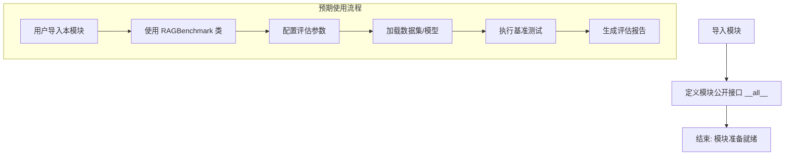
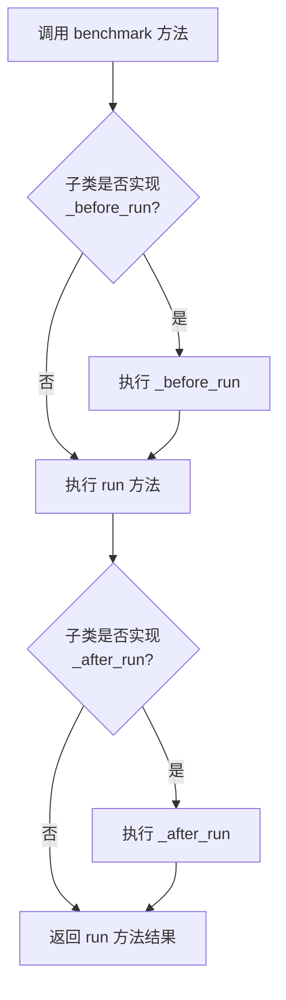

# `.\MetaGPT\metagpt\rag\benchmark\__init__.py` 详细设计文档

该文件定义了一个用于评估检索增强生成（RAG）系统性能的基准测试框架的入口点。它从`metagpt.rag.benchmark.base`模块导入`RAGBenchmark`类，并将其暴露为当前模块的公共接口，为构建和运行RAG评估流程提供基础。

## 整体流程



## 类结构

```
metagpt.rag.benchmark.base (外部模块)
└── RAGBenchmark (基准测试主类，具体结构需查看源文件)
    
当前文件结构
└── (模块级定义)
    ├── 导入: RAGBenchmark
    └── 导出: __all__ = ['RAGBenchmark']
```

## 全局变量及字段


### `__all__`
    
一个字符串列表，定义了当使用 `from module import *` 语法时，从当前模块导出的公共接口名称，此处仅导出 `RAGBenchmark` 类。

类型：`list[str]`
    


### `RAGBenchmark.(需查看 metagpt.rag.benchmark.base 源文件确定)`
    
需查看 metagpt.rag.benchmark.base 源文件确定

类型：`需查看 metagpt.rag.benchmark.base 源文件确定`
    
    

## 全局函数及方法


### `RAGBenchmark`

`RAGBenchmark` 是一个抽象基类（ABC），它为评估检索增强生成（RAG）系统定义了一个标准化的基准测试框架。它强制要求子类实现核心的评估逻辑（`run` 方法），并提供可选的钩子方法（`_before_run` 和 `_after_run`）来支持评估前后的自定义操作。该类旨在确保不同RAG评估任务接口的一致性。

参数：

-  `self`：`RAGBenchmark`，基准测试类的实例
-  `*args`：`tuple`，可变位置参数，传递给 `run` 方法
-  `**kwargs`：`dict`，可变关键字参数，传递给 `run` 方法

返回值：`Any`，`run` 方法的执行结果，具体类型由子类实现决定。

#### 流程图



#### 带注释源码

```python
from abc import ABC, abstractmethod
from typing import Any

class RAGBenchmark(ABC):
    """Base class for RAG benchmarks."""

    def benchmark(self, *args, **kwargs) -> Any:
        """
        执行基准测试的标准入口点。
        此方法定义了评估的标准流程：先执行可选的预处理（_before_run），
        然后执行核心评估逻辑（run），最后执行可选的后续处理（_after_run）。
        """
        # 1. 可选的预处理阶段
        self._before_run(*args, **kwargs)
        # 2. 核心评估阶段（必须由子类实现）
        result = self.run(*args, **kwargs)
        # 3. 可选的后续处理阶段
        self._after_run(result, *args, **kwargs)
        return result

    def _before_run(self, *args, **kwargs) -> None:
        """
        在 `run` 方法执行前调用的钩子方法。
        默认实现为空。子类可以重写此方法以进行资源初始化、数据预处理等操作。
        """
        pass

    @abstractmethod
    def run(self, *args, **kwargs) -> Any:
        """
        抽象方法，定义基准测试的核心评估逻辑。
        所有子类必须实现此方法。它负责执行具体的评估任务并返回结果。
        """
        pass

    def _after_run(self, result: Any, *args, **kwargs) -> None:
        """
        在 `run` 方法执行后调用的钩子方法。
        默认实现为空。子类可以重写此方法以进行结果分析、资源清理、报告生成等操作。
        """
        pass
```


## 关键组件


### RAGBenchmark

RAGBenchmark 是 RAG（检索增强生成）系统基准测试的基类，为评估和比较不同 RAG 实现或配置的性能提供了统一的框架和接口。

## 问题及建议


### 已知问题

-   **代码功能不完整**：当前文件仅包含一个导入语句和一个导出声明，没有实现任何具体的类、方法或功能逻辑。这导致 `RAGBenchmark` 类无法被直接使用，其预期的基准测试功能完全缺失。
-   **依赖模块可能未定义**：代码从 `metagpt.rag.benchmark.base` 导入 `RAGBenchmark`，但该模块（`base`）或其内部的 `RAGBenchmark` 类可能尚未实现或定义，导致导入失败或运行时错误。
-   **缺乏文档和类型提示**：文件本身没有任何注释、文档字符串或类型注解，这降低了代码的可读性和可维护性，不符合大型项目或库的开发规范。

### 优化建议

-   **实现核心功能**：应在当前文件或引用的 `base` 模块中，完整实现 `RAGBenchmark` 类。该类应包含用于评估 RAG（检索增强生成）系统性能的方法，例如设置数据集、定义评估指标（如准确率、召回率、F1分数、答案相关性）、运行测试并生成报告。
-   **确保模块完整性**：检查并确保 `metagpt.rag.benchmark.base` 模块存在且正确导出了 `RAGBenchmark` 类。如果这是占位符或待实现文件，应添加明确的 `TODO` 或 `FIXME` 注释说明。
-   **补充代码文档**：为文件添加模块级别的文档字符串，说明其目的和包含的内容。为 `RAGBenchmark` 类及其方法添加详细的文档字符串、参数类型注解和返回值描述，以提升代码的清晰度和易用性。
-   **考虑接口设计**：在实现时，应设计清晰的抽象基类或接口，定义基准测试的通用流程（如 `load_data`, `evaluate`, `generate_report`），并考虑可扩展性，以便支持不同的数据集和评估指标。


## 其它


### 设计目标与约束

该代码文件 (`__init__.py`) 的设计目标是作为 `metagpt.rag.benchmark` 包的公共接口，通过 `__all__` 变量明确导出 `RAGBenchmark` 类，以控制包的公开 API。其核心约束是保持简洁性，仅负责模块的导入和导出，不包含任何业务逻辑、初始化代码或配置。这遵循了 Python 包的标准结构，确保外部代码可以通过 `from metagpt.rag.benchmark import RAGBenchmark` 或 `from metagpt.rag.benchmark.base import RAGBenchmark` 两种方式正确导入目标类，同时隐藏包内部可能存在的其他非公开模块或类。

### 错误处理与异常设计

当前文件不包含任何主动的错误处理逻辑。其行为完全依赖于 Python 解释器的模块导入机制。可能发生的异常情况包括：
1.  **ImportError**: 当 `from metagpt.rag.benchmark.base import RAGBenchmark` 执行失败时抛出。原因可能是 `base` 模块不存在，或 `RAGBenchmark` 在 `base` 模块中未定义。这是最关键的运行时错误，会导致整个包无法使用。
2.  **ModuleNotFoundError**: 是 `ImportError` 的子类，特指找不到指定的模块（如 `metagpt.rag.benchmark.base`）时抛出。

由于此文件是纯粹的声明性导入和导出，通常不在此处添加 `try-except` 块进行捕获。错误应向上层传播，由调用方或系统启动过程处理。设计上假定依赖的 `base` 模块及其中的 `RAGBenchmark` 类在部署时是完整且可用的。

### 数据流与状态机

此文件不涉及任何数据处理或状态管理。它是一个静态的模块定义文件。其“数据流”仅限于 Python 解释器在导入 `metagpt.rag.benchmark` 包时，读取此文件，执行导入语句将 `RAGBenchmark` 符号加载到当前命名空间，并根据 `__all__` 列表确定当使用 `from metagpt.rag.benchmark import *` 语法时应导出的内容。没有动态状态或状态转换。

### 外部依赖与接口契约

1.  **外部依赖**:
    *   **强依赖**: `metagpt.rag.benchmark.base` 模块。此文件的存在和功能完全依赖于该模块的成功导入。
    *   **隐含依赖**: Python 标准库的模块导入系统。

2.  **接口契约**:
    *   **导出契约**: 通过 `__all__ = ["RAGBenchmark"]` 明确声明，此包对外提供的唯一公共接口是 `RAGBenchmark` 类。这构成了包对使用者的 API 承诺。
    *   **导入契约**: 文件自身通过 `from ... import ...` 语句，承诺会从 `base` 子模块中获取 `RAGBenchmark` 的实现。`base` 模块必须满足此导入契约，否则该包将无法加载。
    *   此文件本身不定义任何类、函数或变量供外部调用，它仅是一个“再导出”的枢纽。

### 配置与初始化

此文件不包含任何配置参数或初始化例程。模块的初始化行为由 Python 解释器在首次导入时自动执行文件中的顶级代码（即 `from ... import ...` 语句）来完成，其唯一作用就是将 `RAGBenchmark` 类绑定到包的命名空间中。没有需要手动调用的初始化函数、配置加载或环境变量检查。

### 安全考虑

从安全角度审视，此文件本身不引入直接的安全风险，因为它不执行任何计算、网络访问或文件操作。然而，它间接影响安全：
*   **依赖安全**: 文件的安全性与它导入的 `metagpt.rag.benchmark.base.RAGBenchmark` 类的安全性强相关。如果底层实现存在漏洞（如反序列化、命令注入等），风险会通过此导出接口传播。
*   **接口暴露**: `__all__` 的控制确保了只有预期的 `RAGBenchmark` 类被公开，遵循了最小暴露原则，避免了意外导出内部辅助函数或类可能带来的信息泄露或误用风险。确保 `__all__` 列表的准确性是维护上的一个安全相关点。

### 测试策略

对此文件的单元测试通常不是重点，因为其逻辑极其简单且由语言机制保证。测试策略更应关注集成层面：
1.  **导入测试**: 验证 `from metagpt.rag.benchmark import RAGBenchmark` 能够成功执行，并且导入的对象确实是预期的类。这可以作为一个简单的冒烟测试或集成测试用例。
2.  **`__all__` 测试**: 验证使用 `from metagpt.rag.benchmark import *` 语法时，是否只导出了 `RAGBenchmark` 这一个符号，没有多余或遗漏。这可以通过检查导入后的命名空间来实现。
3.  **下游测试**: 主要的测试负担落在被导出的 `RAGBenchmark` 类及其所在模块 `base` 上。应确保 `RAGBenchmark` 的功能、性能和安全测试充分。

### 部署与运维

此文件在部署和运维中无需特殊处理：
*   **部署**: 作为项目源代码的一部分，随整个 `metagpt` 包一起打包和分发。
*   **版本管理**: 其版本与所属的 `metagpt.rag.benchmark` 包版本一致。对它的修改（如更改导出列表）应遵循项目的版本控制策略。
*   **监控与日志**: 此文件不产生日志。如果在导入时发生 `ImportError`，错误会体现在应用程序的启动日志或堆栈跟踪中，运维人员应据此检查依赖的 `base` 模块是否正确安装或是否存在。
*   **扩展性**: 如果需要从此包导出更多内容（例如新的基准测试类），只需更新 `__all__` 列表并添加相应的导入语句即可，对现有使用 `RAGBenchmark` 的代码无影响，符合开闭原则。

    