# `.\MetaGPT\metagpt\rag\benchmark\base.py` 详细设计文档

该代码实现了一个RAG（检索增强生成）系统的基准测试工具，用于评估生成文本的质量和检索结果的相关性。它通过计算多种指标（如BLEU、ROUGE-L、语义相似度、召回率、命中率、平均倒数排名等）来量化RAG系统的性能，并支持从配置文件中加载测试数据集。

## 整体流程

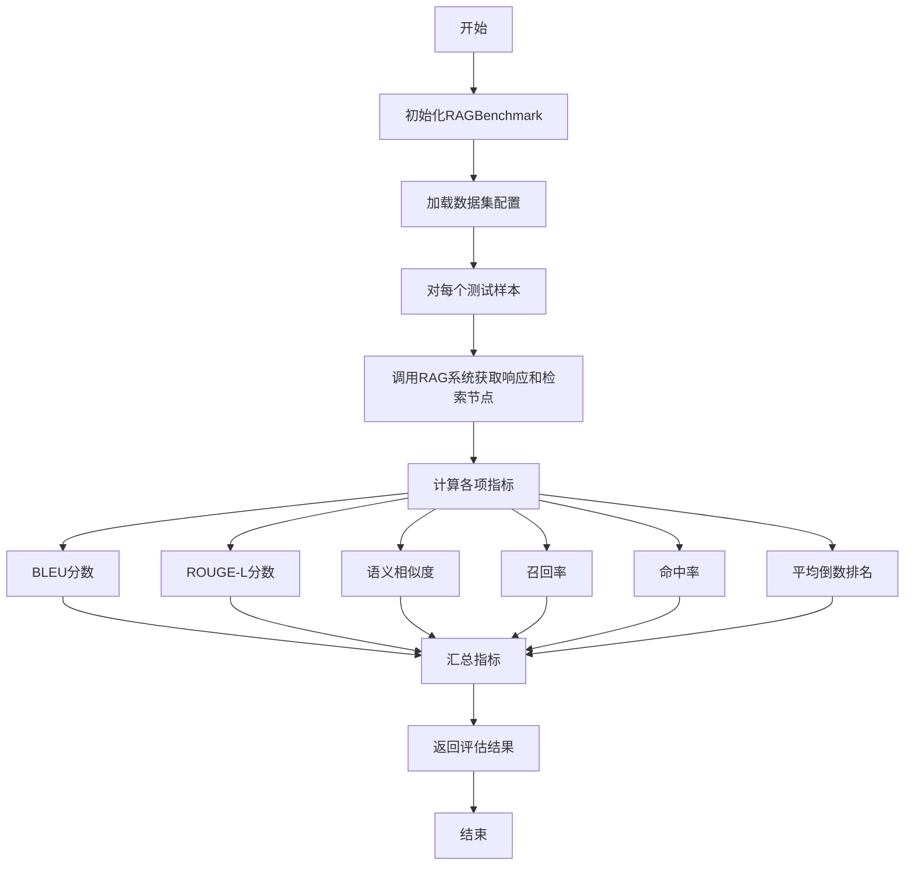

## 类结构

```
BaseModel (Pydantic基类)
├── DatasetInfo (数据集信息)
├── DatasetConfig (数据集配置)
└── RAGBenchmark (RAG基准测试主类)
```

## 全局变量及字段


### `EXAMPLE_BENCHMARK_PATH`
    
指向基准测试数据集根目录的路径常量，用于加载评估数据。

类型：`Path`
    


### `logger`
    
用于记录程序运行日志的日志记录器实例。

类型：`Logger`
    


### `DatasetInfo.name`
    
数据集的唯一标识名称。

类型：`str`
    


### `DatasetInfo.document_files`
    
数据集包含的文档文件路径列表。

类型：`List[str]`
    


### `DatasetInfo.gt_info`
    
数据集的真实答案（Ground Truth）信息列表，通常包含问题和参考答案。

类型：`List[dict]`
    


### `DatasetConfig.datasets`
    
包含多个数据集配置信息的列表。

类型：`List[DatasetInfo]`
    


### `RAGBenchmark.evaluator`
    
用于计算语义相似度分数的评估器实例。

类型：`SemanticSimilarityEvaluator`
    
    

## 全局函数及方法

### `get_rag_embedding`

`get_rag_embedding` 是一个全局函数，用于获取 RAG（检索增强生成）系统中使用的嵌入模型实例。它通过工厂模式动态创建并返回一个配置好的 `BaseEmbedding` 对象，该对象负责将文本转换为向量表示，是语义相似性计算和检索过程的核心组件。

参数：
- 无显式参数。该函数通常从配置或环境变量中读取设置来初始化嵌入模型。

返回值：`BaseEmbedding`，一个实现了 `BaseEmbedding` 接口的嵌入模型实例，用于生成文本的向量表示。

#### 流程图

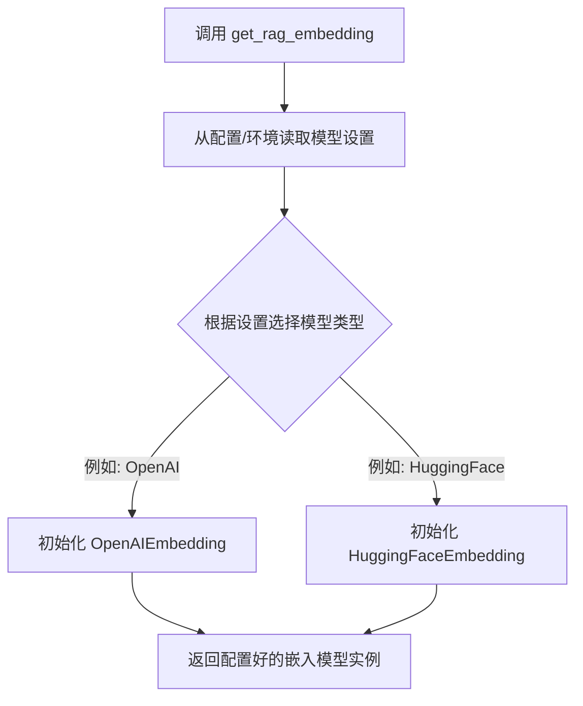

#### 带注释源码

```python
# 注意：提供的代码片段中并未包含 `get_rag_embedding` 函数的具体实现。
# 以下是根据其导入和使用方式推断的典型实现示例。

from llama_index.core.embeddings import BaseEmbedding
# 假设存在一个工厂模块，根据配置返回不同的嵌入模型
from .embedding_factory import EmbeddingFactory

def get_rag_embedding() -> BaseEmbedding:
    """
    获取RAG系统使用的嵌入模型。
    
    此函数作为一个工厂函数，根据项目配置（如环境变量、配置文件）
    动态创建并返回一个合适的文本嵌入模型实例。
    这允许系统灵活地切换不同的嵌入提供商（如OpenAI, HuggingFace等）。
    
    Returns:
        BaseEmbedding: 一个配置好的嵌入模型实例。
    """
    # 通常，这里会读取配置，例如：
    # model_type = os.getenv('EMBED_MODEL_TYPE', 'openai')
    # api_key = os.getenv('EMBED_API_KEY')
    
    # 然后根据配置调用具体的工厂方法
    # embedding = EmbeddingFactory.create_embedding(model_type, api_key=api_key, ...)
    
    # 为了示例，我们假设它返回一个默认或配置好的实例。
    # 在实际代码中，这行会被具体的工厂调用替换。
    embedding = EmbeddingFactory.get_default_embedding()
    return embedding
```

**说明**：
- 由于提供的代码中只导入了 `get_rag_embedding` 而未展示其定义，上述源码是基于常见设计模式的合理推断。
- 在实际的 `metagpt` 项目中，该函数很可能位于 `metagpt.rag.factories` 模块中，负责集中管理不同嵌入模型（如 OpenAI, Sentence Transformers 等）的创建逻辑，遵循依赖注入和单一职责原则，以提高代码的可测试性和可维护性。
- 在 `RAGBenchmark` 类的 `__init__` 方法中，它被用作默认的嵌入模型来源：`embed_model or get_rag_embedding()`。

### `read_json_file`

该函数用于读取并解析指定路径的JSON文件，返回其内容。

参数：

- `file_path`：`str`，JSON文件的路径字符串

返回值：`Any`，解析后的JSON内容，通常是字典、列表等Python数据结构

#### 流程图

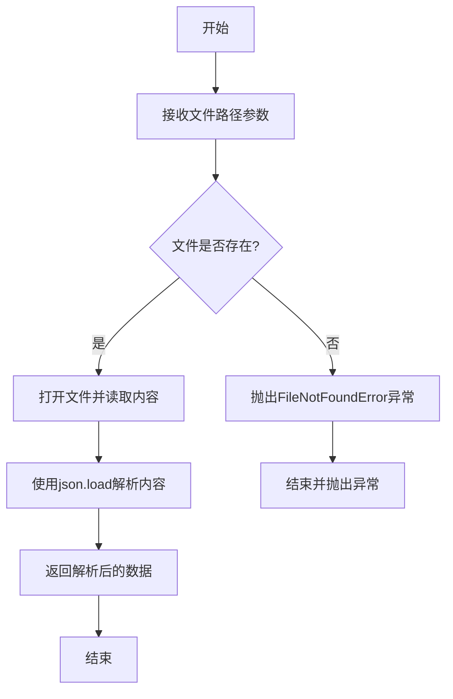

#### 带注释源码

```python
def read_json_file(file_path: str) -> Any:
    """
    读取并解析JSON文件
    
    参数:
        file_path: JSON文件的路径
        
    返回:
        解析后的JSON内容
        
    异常:
        FileNotFoundError: 当文件不存在时
        JSONDecodeError: 当JSON格式错误时
    """
    import json
    
    # 打开文件并读取内容
    with open(file_path, 'r', encoding='utf-8') as f:
        # 解析JSON内容
        data = json.load(f)
    
    return data
```

### `RAGBenchmark.__init__`

该方法用于初始化RAGBenchmark类的实例，主要功能是设置评估器（SemanticSimilarityEvaluator），用于后续的语义相似度评估。如果未提供嵌入模型，则通过工厂函数获取默认的RAG嵌入模型。

参数：

- `embed_model`：`BaseEmbedding`，可选的嵌入模型实例，用于语义相似度评估。如果未提供，则使用默认的RAG嵌入模型。

返回值：`None`，无返回值。

#### 流程图

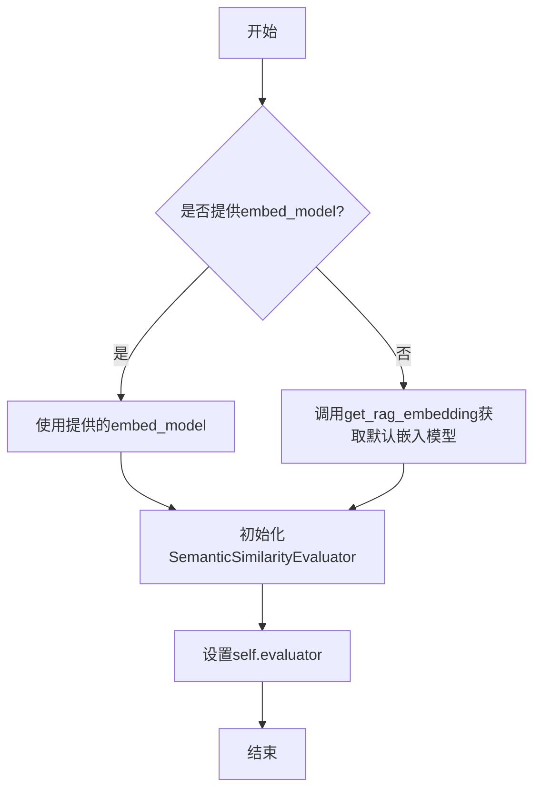

#### 带注释源码

```python
def __init__(
    self,
    embed_model: BaseEmbedding = None,  # 可选的嵌入模型，用于语义相似度评估
):
    # 初始化语义相似度评估器，如果未提供嵌入模型，则使用默认的RAG嵌入模型
    self.evaluator = SemanticSimilarityEvaluator(
        embed_model=embed_model or get_rag_embedding(),  # 优先使用提供的嵌入模型，否则获取默认模型
    )
```

### `RAGBenchmark.set_metrics`

该方法用于将一组RAG（检索增强生成）评估指标和相关的日志信息打包成一个结构化的字典返回。它接收多个评估分数（如BLEU、ROUGE、语义相似度等）和文本信息（如生成的回答、标准答案、问题），并将它们组织成`metrics`和`log`两个子字典，便于后续的记录、分析或输出。

参数：

- `bleu_avg`：`float`，BLEU平均分数，默认为0.0。
- `bleu_1`：`float`，BLEU-1分数，默认为0.0。
- `bleu_2`：`float`，BLEU-2分数，默认为0.0。
- `bleu_3`：`float`，BLEU-3分数，默认为0.0。
- `bleu_4`：`float`，BLEU-4分数，默认为0.0。
- `rouge_l`：`float`，ROUGE-L分数，默认为0.0。
- `semantic_similarity`：`float`，语义相似度分数，默认为0.0。
- `recall`：`float`，召回率，默认为0.0。
- `hit_rate`：`float`，命中率，默认为0.0。
- `mrr`：`float`，平均倒数排名，默认为0.0。
- `length`：`float`，生成文本的长度，默认为0.0。
- `generated_text`：`str`，模型生成的文本，默认为None。
- `ground_truth_text`：`str`，标准答案文本，默认为None。
- `question`：`str`，原始问题文本，默认为None。

返回值：`dict`，一个包含两个键的字典：`"metrics"`（所有评估指标分数的字典）和`"log"`（相关文本信息的字典）。

#### 流程图

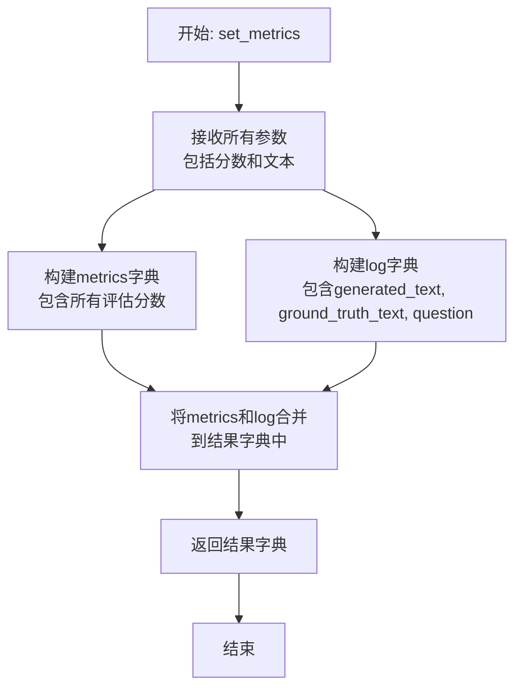

#### 带注释源码

```python
def set_metrics(
    self,
    bleu_avg: float = 0.0,
    bleu_1: float = 0.0,
    bleu_2: float = 0.0,
    bleu_3: float = 0.0,
    bleu_4: float = 0.0,
    rouge_l: float = 0.0,
    semantic_similarity: float = 0.0,
    recall: float = 0.0,
    hit_rate: float = 0.0,
    mrr: float = 0.0,
    length: float = 0.0,
    generated_text: str = None,
    ground_truth_text: str = None,
    question: str = None,
):
    # 将所有传入的评估指标分数组织成一个字典，键为指标名称，值为对应的分数。
    metrics = {
        "bleu-avg": bleu_avg,
        "bleu-1": bleu_1,
        "bleu-2": bleu_2,
        "bleu-3": bleu_3,
        "bleu-4": bleu_4,
        "rouge-L": rouge_l,
        "semantic similarity": semantic_similarity,
        "recall": recall,
        "hit_rate": hit_rate,
        "mrr": mrr,
        "length": length,
    }

    # 将与评估相关的文本信息（生成文本、标准答案、问题）组织成另一个字典，便于日志记录。
    log = {
        "generated_text": generated_text,
        "ground_truth_text": ground_truth_text,
        "question": question,
    }

    # 返回一个包含`metrics`和`log`两个键的字典，作为该次评估的完整结果。
    return {"metrics": metrics, "log": log}
```

### `RAGBenchmark.bleu_score`

计算生成文本与参考文本之间的BLEU分数，支持返回原始BLEU分数或经过长度惩罚调整后的分数。

参数：

- `response`：`str`，需要评估的生成文本
- `reference`：`str`，作为评估标准的参考文本
- `with_penalty`：`bool`，是否返回原始BLEU分数（包含长度惩罚），默认为False

返回值：`Union[float, Tuple[float]]`，当`with_penalty=False`时返回调整后的BLEU平均分数和1-4元语法精度；当`with_penalty=True`时返回原始BLEU平均分数和1-4元语法精度

#### 流程图

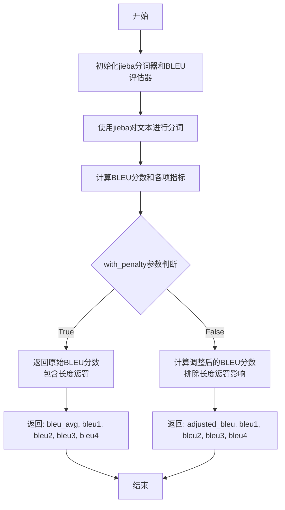

#### 带注释源码

```python
def bleu_score(self, response: str, reference: str, with_penalty=False) -> Union[float, Tuple[float]]:
    # 定义分词函数，使用jieba进行中文分词
    f = lambda text: list(jieba.cut(text))
    
    # 加载BLEU评估器
    bleu = evaluate.load(path="bleu")
    
    # 计算BLEU分数，传入预测文本和参考文本
    results = bleu.compute(predictions=[response], references=[[reference]], tokenizer=f)

    # 提取BLEU平均分数
    bleu_avg = results["bleu"]
    # 提取1-4元语法精度
    bleu1 = results["precisions"][0]
    bleu2 = results["precisions"][1]
    bleu3 = results["precisions"][2]
    bleu4 = results["precisions"][3]
    # 提取长度惩罚因子
    brevity_penalty = results["brevity_penalty"]

    # 根据with_penalty参数决定返回哪种分数
    if with_penalty:
        # 返回原始BLEU分数（包含长度惩罚）
        return bleu_avg, bleu1, bleu2, bleu3, bleu4
    else:
        # 返回调整后的BLEU分数（排除长度惩罚影响）
        # 如果长度惩罚为0，则返回0.0以避免除零错误
        return 0.0 if brevity_penalty == 0 else bleu_avg / brevity_penalty, bleu1, bleu2, bleu3, bleu4
```

### `RAGBenchmark.rougel_score`

该方法用于计算生成文本（`response`）与参考文本（`reference`）之间的 ROUGE-L 分数。ROUGE-L 是一种基于最长公共子序列（LCS）的评估指标，常用于衡量机器生成文本与参考文本之间的相似度，特别关注召回率。该方法使用 `evaluate` 库加载 `rouge` 评估器，并利用 `jieba` 进行中文分词。

参数：

- `response`：`str`，待评估的生成文本。
- `reference`：`str`，作为标准的参考文本。

返回值：`float`，ROUGE-L 分数，值域为 [0, 1]，分数越高表示生成文本与参考文本的相似度越高。

#### 流程图

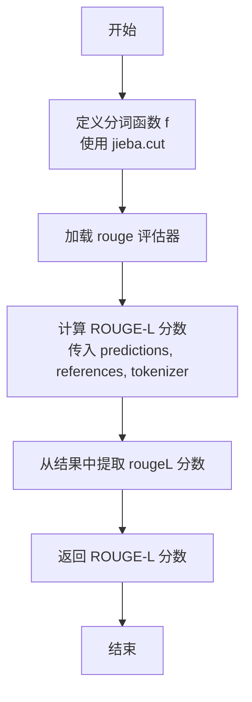

#### 带注释源码

```python
def rougel_score(self, response: str, reference: str) -> float:
    # pip install rouge_score
    # 定义分词函数，使用 jieba 将文本切分为词列表
    f = lambda text: list(jieba.cut(text))
    # 从 evaluate 库加载 rouge 评估器
    rouge = evaluate.load(path="rouge")

    # 计算 ROUGE 分数
    # predictions: 预测文本列表（此处为单个生成文本）
    # references: 参考文本列表的列表（此处为单个参考文本）
    # tokenizer: 自定义分词函数，用于处理中文
    # rouge_types: 指定计算 ROUGE-L 类型
    results = rouge.compute(predictions=[response], references=[[reference]], tokenizer=f, rouge_types=["rougeL"])
    # 从计算结果中提取 ROUGE-L 分数
    score = results["rougeL"]
    # 返回 ROUGE-L 分数
    return score
```

### `RAGBenchmark.recall`

该方法用于计算检索增强生成（RAG）系统中检索步骤的召回率（Recall）。它通过比较检索到的节点（`NodeWithScore`）的文本内容是否出现在给定的参考文档（`reference_docs`）中，来计算检索结果覆盖了多少比例的参考文档。

参数：

- `nodes`：`list[NodeWithScore]`，RAG系统检索到的、带有分数的节点列表。
- `reference_docs`：`list[str]`，作为标准答案或参考依据的文档文本列表。

返回值：`float`，计算出的召回率值，范围在0.0到1.0之间。如果`nodes`为空，则直接返回0.0。

#### 流程图

```mermaid
flowchart TD
    A[开始] --> B{nodes列表是否为空?}
    B -- 是 --> C[返回 0.0]
    B -- 否 --> D[初始化 total_recall = 0]
    D --> E[遍历 reference_docs 中的每个文档 doc]
    E --> F{是否存在任意节点 node<br>其文本 node.text 在 doc 中?}
    F -- 是 --> G[total_recall += 1]
    F -- 否 --> H[继续]
    G --> H
    H --> I{是否遍历完所有文档?}
    I -- 否 --> E
    I -- 是 --> J[计算 recall = total_recall / len(reference_docs)]
    J --> K[返回 recall]
    C --> L[结束]
    K --> L
```

#### 带注释源码

```python
def recall(self, nodes: list[NodeWithScore], reference_docs: list[str]) -> float:
    # 检查检索到的节点列表是否为空
    if nodes:
        # 计算召回率：对于每个参考文档，检查是否有任意一个检索到的节点文本包含在其中。
        # 如果包含，则该文档被成功“召回”，total_recall 加1。
        total_recall = sum(any(node.text in doc for node in nodes) for doc in reference_docs)
        # 召回率 = 成功召回的文档数 / 总参考文档数
        return total_recall / len(reference_docs)
    else:
        # 如果未检索到任何节点，召回率为0
        return 0.0
```

### `RAGBenchmark.hit_rate`

计算检索增强生成（RAG）系统的命中率（Hit Rate）。命中率是一个二元指标，用于衡量在检索到的节点列表中，是否至少有一个节点包含在给定的参考文档列表中。如果存在至少一个匹配，则返回1.0，否则返回0.0。如果节点列表为空，则直接返回0.0。

参数：

- `nodes`：`list[NodeWithScore]`，检索到的节点列表，每个节点包含文本和分数。
- `reference_docs`：`list[str]`，参考文档列表，用于与检索到的节点进行匹配。

返回值：`float`，命中率，值为0.0或1.0。

#### 流程图

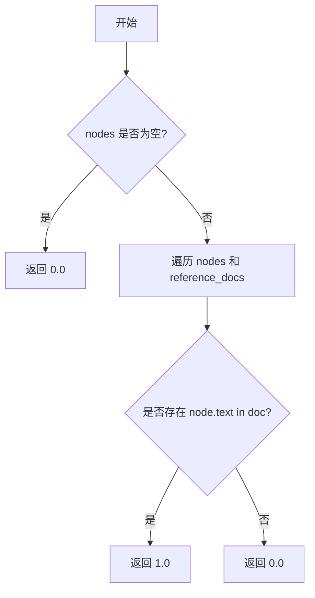

#### 带注释源码

```python
def hit_rate(self, nodes: list[NodeWithScore], reference_docs: list[str]) -> float:
    # 检查检索到的节点列表是否为空
    if nodes:
        # 遍历所有节点和参考文档，检查是否存在节点文本包含在参考文档中的情况
        # 如果存在至少一个匹配，则返回1.0，表示命中
        return 1.0 if any(node.text in doc for doc in reference_docs for node in nodes) else 0.0
    else:
        # 如果节点列表为空，则直接返回0.0，表示未命中
        return 0.0
```

### `RAGBenchmark.mean_reciprocal_rank`

该方法用于计算检索增强生成（RAG）系统中检索结果的“平均倒数排名”（Mean Reciprocal Rank, MRR）。MRR是信息检索中常用的评估指标，用于衡量系统返回的第一个正确答案的排名质量。该方法遍历检索到的节点列表，检查每个节点的文本内容是否出现在任何参考文档中。一旦找到第一个匹配项，就计算其排名的倒数（1/排名），并累加到总和中。如果遍历完所有节点都未找到匹配项，则返回0.0。

参数：
- `nodes`：`list[NodeWithScore]`，检索系统返回的节点列表，每个节点包含文本内容和相关性分数。
- `reference_docs`：`list[str]`，包含正确答案或相关内容的参考文档列表。

返回值：`float`，计算得到的平均倒数排名（MRR）值。该值介于0和1之间，值越高表示系统返回的第一个正确答案的排名越靠前。

#### 流程图

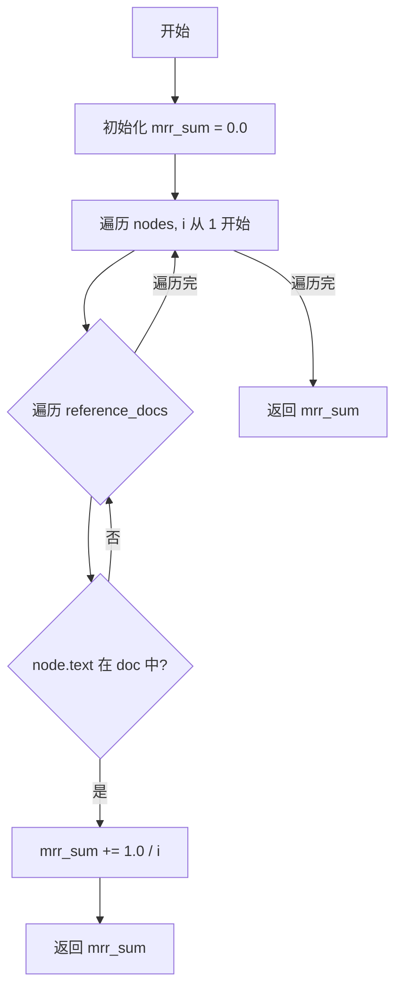

#### 带注释源码

```python
def mean_reciprocal_rank(self, nodes: list[NodeWithScore], reference_docs: list[str]) -> float:
    # 初始化 MRR 总和为 0.0
    mrr_sum = 0.0

    # 遍历检索到的节点列表，i 从 1 开始表示排名
    for i, node in enumerate(nodes, start=1):
        # 遍历所有参考文档
        for doc in reference_docs:
            # 检查当前节点的文本内容是否出现在参考文档中
            if node.text in doc:
                # 如果找到匹配项，计算其排名的倒数并累加到总和中
                mrr_sum += 1.0 / i
                # 找到第一个匹配项后立即返回当前累加值（即 MRR）
                return mrr_sum

    # 如果遍历完所有节点都未找到匹配项，则返回 0.0
    return mrr_sum
```

### `RAGBenchmark.semantic_similarity`

该方法是一个异步方法，用于计算生成文本（`response`）与参考文本（`reference`）之间的语义相似度。它通过调用内部封装的 `SemanticSimilarityEvaluator` 的异步评估方法来实现，并返回一个介于0到1之间的浮点数分数，分数越高表示语义越相似。

参数：

- `response`：`str`，需要评估的生成文本。
- `reference`：`str`，用于比较的参考文本（标准答案）。

返回值：`float`，表示 `response` 与 `reference` 之间语义相似度的分数。

#### 流程图

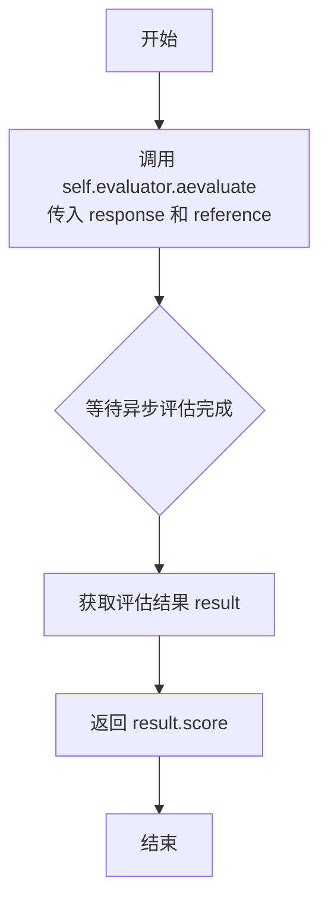

#### 带注释源码

```python
async def semantic_similarity(self, response: str, reference: str) -> float:
    # 调用内部语义相似度评估器的异步评估方法
    result = await self.evaluator.aevaluate(
        response=response,
        reference=reference,
    )
    # 返回评估结果中的分数
    return result.score
```

### `RAGBenchmark.compute_metric`

该方法用于计算RAG（检索增强生成）系统输出的综合评估指标。它接收模型的响应、参考答案、检索到的节点、参考文档和问题，通过调用多个内部评估方法（如BLEU、ROUGE-L、召回率、命中率、平均倒数排名和语义相似度）来计算一组全面的评估分数，并将这些分数与原始文本信息一起打包返回。

参数：

- `response`：`str`，RAG系统生成的文本响应。
- `reference`：`str`，用于评估的参考答案或标准答案。
- `nodes`：`list[NodeWithScore]`，RAG系统检索到的、带有相关性分数的文档节点列表。
- `reference_doc`：`list[str]`，用于计算召回率、命中率等检索指标的参考文档列表。
- `question`：`str`，用户提出的原始问题。

返回值：`dict`，一个包含两个键的字典：
- `"metrics"`：一个字典，包含所有计算出的评估指标（如BLEU分数、ROUGE-L分数、语义相似度、召回率、命中率、MRR和响应长度）。
- `"log"`：一个字典，包含用于评估的原始数据（生成的文本、参考答案和问题），便于调试和记录。

#### 流程图

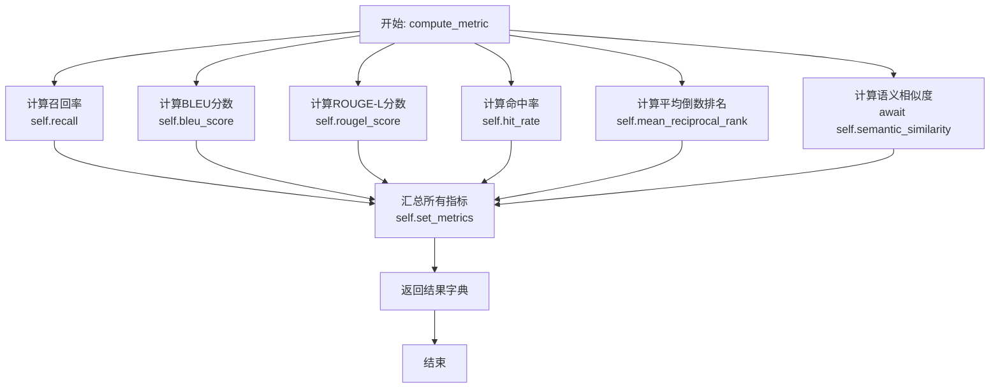

#### 带注释源码

```python
async def compute_metric(
    self,
    response: str = None,          # RAG系统生成的文本响应
    reference: str = None,         # 用于评估的参考答案
    nodes: list[NodeWithScore] = None, # 检索到的文档节点列表
    reference_doc: list[str] = None,   # 用于检索评估的参考文档列表
    question: str = None,          # 原始问题
):
    # 1. 计算召回率：评估检索到的节点覆盖了多少参考文档
    recall = self.recall(nodes, reference_doc)
    # 2. 计算BLEU分数：评估生成文本与参考答案的n-gram重叠度
    bleu_avg, bleu1, bleu2, bleu3, bleu4 = self.bleu_score(response, reference)
    # 3. 计算ROUGE-L分数：评估最长公共子序列的匹配度
    rouge_l = self.rougel_score(response, reference)
    # 4. 计算命中率：评估是否至少检索到一个相关文档
    hit_rate = self.hit_rate(nodes, reference_doc)
    # 5. 计算平均倒数排名：评估相关文档在检索结果中的排名质量
    mrr = self.mean_reciprocal_rank(nodes, reference_doc)
    # 6. 计算语义相似度：评估生成文本与参考答案在语义层面的相似性
    similarity = await self.semantic_similarity(response, reference)

    # 7. 将所有指标和原始文本信息打包成一个结构化的字典
    result = self.set_metrics(
        bleu_avg,      # BLEU平均分
        bleu1,         # BLEU-1分数
        bleu2,         # BLEU-2分数
        bleu3,         # BLEU-3分数
        bleu4,         # BLEU-4分数
        rouge_l,       # ROUGE-L分数
        similarity,    # 语义相似度分数
        recall,        # 召回率
        hit_rate,      # 命中率
        mrr,           # 平均倒数排名
        len(response), # 生成响应的长度
        response,      # 生成的响应文本
        reference,     # 参考答案文本
        question,      # 原始问题
    )

    # 8. 返回包含所有评估结果和日志的字典
    return result
```

### `RAGBenchmark.load_dataset`

`RAGBenchmark.load_dataset` 是一个静态方法，用于加载和配置RAG（检索增强生成）基准测试所需的数据集。它根据传入的数据集名称列表（或默认的“all”），从预定义的配置文件中读取数据集信息，包括文档文件路径和对应的真实答案（ground truth）信息，并构建一个结构化的 `DatasetConfig` 对象返回。

参数：

- `ds_names`：`list[str]`，可选参数，默认为 `["all"]`。指定要加载的数据集名称列表。如果列表包含 `"all"` 或未提供，则加载所有可用的数据集。

返回值：`DatasetConfig`，返回一个包含所有请求数据集配置信息的 `DatasetConfig` 对象。该对象内部是一个 `DatasetInfo` 列表，每个 `DatasetInfo` 包含数据集的名称、文档文件路径列表和真实答案信息。

#### 流程图

```mermaid
flowchart TD
    A[开始: load_dataset(ds_names)] --> B{ds_names 包含 'all' 吗?};
    B -- 是 --> C[加载所有数据集];
    B -- 否 --> D[仅加载 ds_names 中指定的数据集];
    C --> E[读取 dataset_info.json 配置文件];
    D --> E;
    E --> F[遍历配置文件中的每个数据集];
    F --> G{当前数据集名<br>在 ds_names 中或 ds_names 包含 'all'?};
    G -- 是 --> H[为当前数据集构建 DatasetInfo];
    G -- 否 --> I[跳过此数据集];
    H --> J[构建文档文件路径列表];
    H --> K[读取并解析真实答案文件];
    J & K --> L[将 DatasetInfo 加入列表];
    I --> F;
    F --> M[所有数据集处理完毕];
    L --> M;
    M --> N[用 DatasetInfo 列表创建 DatasetConfig];
    N --> O[返回 DatasetConfig 对象];
```

#### 带注释源码

```python
    @staticmethod
    def load_dataset(ds_names: list[str] = ["all"]):
        """
        静态方法：加载RAG基准测试数据集配置。
        从预定义的路径读取数据集信息配置文件，并根据给定的数据集名称列表过滤和构建配置对象。

        Args:
            ds_names (list[str], optional): 要加载的数据集名称列表。默认为 ["all"]，表示加载所有数据集。

        Returns:
            DatasetConfig: 包含所有请求数据集信息的配置对象。
        """
        # 1. 读取数据集信息配置文件。EXAMPLE_BENCHMARK_PATH 是基准测试数据的根目录。
        infos = read_json_file((EXAMPLE_BENCHMARK_PATH / "dataset_info.json").as_posix())

        # 2. 构建数据集配置对象。
        dataset_config = DatasetConfig(
            datasets=[
                # 列表推导式：遍历配置文件中的每一项，为每个符合条件的数据集创建 DatasetInfo 对象。
                DatasetInfo(
                    # 数据集名称
                    name=name,
                    # 构建该数据集下所有文档文件的完整路径列表。
                    document_files=[
                        (EXAMPLE_BENCHMARK_PATH / name / file).as_posix() for file in info["document_file"]
                    ],
                    # 读取并解析该数据集的真实答案（ground truth）文件。
                    gt_info=read_json_file((EXAMPLE_BENCHMARK_PATH / name / info["gt_file"]).as_posix()),
                )
                # 外层循环：遍历从配置文件读取的原始信息列表 (infos)。
                for dataset_info in infos
                # 内层循环：遍历每个原始信息项中的键值对（name 和 info）。
                for name, info in dataset_info.items()
                # 过滤条件：仅当数据集名称在请求列表 (ds_names) 中，或请求列表包含 "all" 时，才处理该数据集。
                if name in ds_names or "all" in ds_names
            ]
        )

        # 3. 返回构建好的配置对象。
        return dataset_config
```

## 关键组件


### 语义相似度评估器 (SemanticSimilarityEvaluator)

用于计算生成文本与参考文本之间的语义相似度得分，基于嵌入模型将文本转换为向量表示并进行比较。

### BLEU 评分计算 (bleu_score)

通过 `evaluate` 库和 `jieba` 分词器，计算生成文本相对于参考文本的 BLEU 分数，支持返回不同 N-gram 的精度和平均 BLEU 分数。

### ROUGE-L 评分计算 (rougel_score)

通过 `evaluate` 库和 `jieba` 分词器，计算生成文本相对于参考文本的 ROUGE-L 分数，用于评估文本的召回率。

### 召回率计算 (recall)

基于检索到的节点（NodeWithScore）列表和参考文档列表，计算有多少比例的参考文档内容被成功检索到。

### 命中率计算 (hit_rate)

基于检索到的节点（NodeWithScore）列表和参考文档列表，判断是否至少有一个参考文档的内容被成功检索到。

### 平均倒数排名计算 (mean_reciprocal_rank)

基于检索到的节点（NodeWithScore）列表和参考文档列表，计算检索结果中第一个相关文档排名的倒数，用于评估检索系统的排序质量。

### 数据集加载与配置 (load_dataset)

从指定路径加载 JSON 格式的数据集配置文件，根据给定的数据集名称列表（或“all”）构建包含数据集名称、文档文件路径和真实信息（ground truth）的结构化配置对象。


## 问题及建议


### 已知问题

-   **`mean_reciprocal_rank` 方法中存在未定义变量**：在 `mean_reciprocal_rank` 方法的循环中，使用了未定义的变量 `text` (`if text in doc:`)，这会导致运行时错误。
-   **`__main__` 中调用错误的方法名**：在 `if __name__ == "__main__":` 代码块中，尝试调用 `benchmark.SemanticSimilarity`，但类中定义的方法是 `semantic_similarity`（小写开头），这会导致 `AttributeError`。
-   **`compute_metric` 方法参数命名冲突**：`compute_metric` 方法定义了一个局部变量 `recall`，这与同名的实例方法 `self.recall` 冲突。虽然Python允许，但这会遮蔽实例方法，导致代码可读性差，且如果后续需要调用实例方法 `self.recall` 将无法直接访问。
-   **`bleu_score` 方法返回值逻辑不一致**：当 `with_penalty=False` 时，返回的 `bleu_avg` 是除以 `brevity_penalty` 后的值，这实际上不是标准的BLEU分数（标准BLEU分数已包含惩罚因子）。此逻辑可能造成混淆，且返回的元组中第一个元素与其他元素（BLEU-1到4）的尺度不一致。
-   **`hit_rate` 和 `recall` 方法逻辑可能不精确**：这两个方法使用 `node.text in doc` 进行字符串包含判断。如果 `node.text` 是长文档的一个子串，或者 `reference_docs` 中的文档字符串包含 `node.text` 但并非精确匹配的源文档，可能导致计算不准确。理想情况下应使用文档ID或哈希进行精确匹配。
-   **`load_dataset` 静态方法逻辑复杂且可能低效**：方法中使用了嵌套的列表推导式，并且对于每个数据集都重新读取 `dataset_info.json` 文件，如果数据集很多，会导致重复的I/O操作和复杂的逻辑流，难以调试和维护。
-   **缺少异步安全与错误处理**：`semantic_similarity` 和 `compute_metric` 是异步方法，但未对 `evaluator.aevaluate` 可能抛出的异常（如网络超时、模型错误）进行捕获和处理。
-   **硬编码的评估指标**：`set_metrics` 方法固定返回一组评估指标。如果未来需要增加、删除或修改指标，需要直接修改此方法，违反了开闭原则。

### 优化建议

-   **修复 `mean_reciprocal_rank` 方法**：将 `if text in doc:` 更正为 `if node.text in doc:`。
-   **修复 `__main__` 中的方法调用**：将 `benchmark.SemanticSimilarity` 更正为 `benchmark.semantic_similarity`。
-   **重命名 `compute_metric` 中的局部变量**：将 `compute_metric` 方法中计算得到的 `recall` 值重命名为 `recall_score` 或其他名称，以避免与实例方法名冲突。
-   **重构 `bleu_score` 方法**：重新审视 `bleu_score` 方法的返回值设计。考虑始终返回包含标准BLEU分数（含惩罚因子）及BLEU-1到4的元组，并通过参数或不同方法名来区分是否需要额外的计算。例如，可以有一个 `bleu_score` 返回标准分数，一个 `bleu_score_without_penalty` 返回未惩罚的分数。
-   **改进 `hit_rate` 和 `recall` 的匹配逻辑**：建议为 `NodeWithScore` 和参考文档定义更可靠的标识符（如ID、索引或内容哈希），并在这些标识符上进行精确匹配，而非子字符串匹配。
-   **重构 `load_dataset` 方法**：
    1.  将读取 `dataset_info.json` 的操作提取到方法外部或缓存结果，避免在循环中重复读取。
    2.  将复杂的列表推导式拆分为多步的显式循环，提高代码可读性。
    3.  考虑使用更清晰的数据结构来映射数据集名称和配置。
-   **增强异步方法的健壮性**：在 `semantic_similarity` 和 `compute_metric` 方法中添加 `try-except` 块，捕获可能的异常，并记录日志或返回默认值/错误标识，避免整个评估流程因单点失败而中断。
-   **使评估指标可配置化**：
    1.  将 `set_metrics` 方法重构为接收一个字典参数，直接构建结果。
    2.  或者，在 `RAGBenchmark` 初始化时允许传入一个指标列表或配置，`compute_metric` 根据配置动态计算和组装结果。这样更容易扩展新的评估指标。
-   **添加类型注解和文档字符串**：为所有方法添加更详细的类型注解（特别是返回类型）和文档字符串（docstring），说明其功能、参数、返回值及可能抛出的异常，这将极大提升代码的可维护性和可理解性。
-   **考虑性能优化**：`compute_metric` 方法中多个指标计算（如BLEU、ROUGE）是同步且可能计算密集的。如果评估大量数据，可以考虑使用 `asyncio.to_thread` 或引入线程池将这些同步计算任务卸载到其他线程，以避免阻塞事件循环。


## 其它


### 设计目标与约束

本模块的核心设计目标是提供一个可扩展、模块化的RAG（检索增强生成）系统评估框架。其主要约束包括：1) 评估指标需覆盖传统文本生成质量（如BLEU、ROUGE）、语义相似度以及检索质量（如召回率、命中率、MRR）；2) 支持异步计算以适应可能耗时的语义相似度评估；3) 通过配置文件驱动，便于管理和扩展评估数据集；4) 与`llama_index`和`evaluate`等外部库集成，复用其成熟能力，避免重复造轮子。

### 错误处理与异常设计

当前代码中显式的错误处理较为有限。潜在的风险点及建议的异常处理策略包括：
1.  **文件读取错误**：`read_json_file`和`load_dataset`方法在读取不存在的JSON文件或路径时可能引发`FileNotFoundError`或`JSONDecodeError`。应使用`try-except`块捕获这些异常，并记录清晰的错误日志。
2.  **外部库调用错误**：`evaluate.load`、`bleu.compute`、`rouge.compute`以及`self.evaluator.aevaluate`等方法可能因网络问题、模型加载失败或输入格式无效而抛出异常。建议对这些调用进行包装，捕获通用异常（如`Exception`），并转换为模块内定义的、更具业务含义的异常（如`MetricComputationError`）。
3.  **空值或无效输入**：`recall`、`hit_rate`、`mean_reciprocal_rank`等方法对`nodes`参数为空列表进行了处理，但`response`或`reference`为空字符串时，BLEU/ROUGE计算可能产生未定义行为。应在方法入口处增加参数校验，对无效输入返回默认值或抛出`ValueError`。
4.  **异步执行错误**：`semantic_similarity`和`compute_metric`是异步方法。调用者（如`__main__`中的代码）需要使用`asyncio.run`，但在更复杂的异步上下文中，需要确保异常能正确传播和处理。

### 数据流与状态机

本模块的数据流清晰，无复杂的状态机，主要遵循“配置加载 -> 数据准备 -> 指标计算 -> 结果聚合”的流程：
1.  **初始化阶段**：`RAGBenchmark`实例化时，初始化`SemanticSimilarityEvaluator`。`load_dataset`静态方法读取`dataset_info.json`配置文件，构造`DatasetConfig`对象，定义了数据集名称、文档文件路径和真实答案信息。
2.  **指标计算阶段**：`compute_metric`方法是核心协调者。它接收`response`（生成答案）、`reference`（标准答案）、`nodes`（检索到的节点）和`reference_doc`（参考文档列表）作为输入。内部同步调用`bleu_score`、`rougel_score`、`recall`、`hit_rate`、`mean_reciprocal_rank`，并异步调用`semantic_similarity`。
3.  **结果聚合阶段**：所有指标计算结果传递给`set_metrics`方法，该方法将其组织为包含`metrics`（数值指标字典）和`log`（原始文本日志字典）的结构化字典并返回。
4.  **数据流向**：原始问题、生成文本、真实答案以及检索结果作为输入流入系统，经过各指标计算单元处理后，汇集成一个统一的评估结果字典输出。

### 外部依赖与接口契约

1.  **外部库依赖**：
    *   `llama_index.core`：用于`BaseEmbedding`、`SemanticSimilarityEvaluator`和`NodeWithScore`。契约：期望嵌入模型和评估器兼容其接口。
    *   `evaluate`（Hugging Face）：用于加载和计算BLEU、ROUGE指标。契约：依赖其特定的`compute`方法接口和返回格式。
    *   `jieba`：用于中文分词。契约：作为`tokenizer`函数传入`evaluate`的`compute`方法。
    *   `pydantic`：用于`DatasetInfo`和`DatasetConfig`的数据验证与序列化。
    *   `asyncio`：用于支持异步操作。

2.  **项目内部依赖**：
    *   `metagpt.const.EXAMPLE_BENCHMARK_PATH`：定义了基准测试数据集的根路径。
    *   `metagpt.rag.factories.get_rag_embedding`：提供默认的嵌入模型实例。
    *   `metagpt.utils.common.read_json_file`：用于读取JSON配置文件。
    *   `metagpt.logs.logger`：用于记录日志。

3.  **接口契约**：
    *   `RAGBenchmark.compute_metric`：是主评估接口。调用者需提供生成答案、标准答案、检索节点和参考文档。它返回一个包含所有指标和日志的字典。
    *   `RAGBenchmark.load_dataset`：是数据加载接口。调用者指定数据集名称列表，返回一个结构化的`DatasetConfig`对象，其中包含了所有必要的数据文件路径和真实答案信息。

    