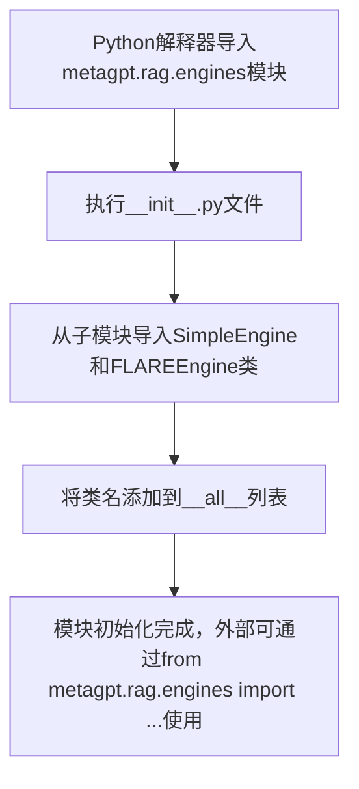

# `.\MetaGPT\metagpt\rag\engines\__init__.py` 详细设计文档

该文件是RAG引擎模块的初始化文件，主要功能是导入并公开两个检索增强生成引擎类：SimpleEngine和FLAREEngine，作为模块的公共接口。

## 整体流程



## 类结构

```
metagpt.rag.engines (Python包)
├── __init__.py (当前文件)
├── simple.py (包含SimpleEngine类)
└── flare.py (包含FLAREEngine类)
```

## 全局变量及字段


### `__all__`
    
一个字符串列表，用于定义模块的公共接口，指定了当使用 `from module import *` 语法时，哪些名称会被导出。

类型：`List[str]`
    


    

## 全局函数及方法


## 关键组件


### SimpleEngine

一个简单的检索增强生成（RAG）引擎，提供基础的文档检索与答案生成功能。

### FLAREEngine

一个基于FLARE（前瞻性主动检索增强生成）策略的RAG引擎，通过迭代式地预测未来token并主动检索相关信息来提升生成质量。


## 问题及建议


### 已知问题

-   **模块导入结构过于简单**：当前 `__init__.py` 文件仅导入了两个引擎类，没有提供更高级别的抽象或工厂方法来统一管理不同引擎的创建和选择。这可能导致客户端代码需要直接依赖具体的引擎类，降低了代码的灵活性和可维护性。
-   **缺乏版本管理或特性标记**：代码中没有包含任何版本信息或用于实验性功能（如 `FLAREEngine`）的标记。随着项目迭代，新引擎的引入或旧引擎的废弃可能缺乏清晰的过渡路径。
-   **缺少文档字符串**：模块级别的文档字符串（`"""Engines init"""`）过于简略，没有说明该模块的职责、包含的引擎类型、使用场景或如何选择合适的引擎，不利于新开发者理解和使用。

### 优化建议

-   **引入工厂模式或配置化加载**：建议创建一个 `EngineFactory` 类或一个 `get_engine` 函数，根据配置（如字符串名称、枚举或配置文件）动态创建并返回对应的引擎实例。这可以解耦客户端代码与具体引擎类。
-   **添加版本和弃用管理**：在 `__all__` 列表或通过装饰器，为实验性引擎（如 `FLAREEngine`）添加标记，并为未来可能废弃的引擎提供 `DeprecationWarning`。考虑在模块中定义 `__version__` 变量。
-   **完善模块和类文档**：为 `__init__.py` 模块添加详细的文档字符串，说明 RAG 引擎模块的目的、可用引擎及其核心区别（例如，`SimpleEngine` 用于基础检索增强，`FLAREEngine` 用于具有前瞻性推理的复杂问答）。同时，确保 `SimpleEngine` 和 `FLAREEngine` 类本身也有完整的类文档字符串。
-   **考虑统一引擎接口**：检查 `SimpleEngine` 和 `FLAREEngine` 是否遵循相同的公共接口（例如，都有一个 `query` 方法）。如果没有，建议定义一个基础的 `BaseRAGEngine` 抽象类，强制所有引擎实现统一的方法，这能提升代码的一致性和可替换性。
-   **预置常用配置或简化入口**：可以在 `__init__.py` 中提供预配置的引擎实例或快捷函数，方便用户快速开始最常见的任务，降低使用门槛。


## 其它


### 设计目标与约束

该模块的设计目标是提供一个清晰、可扩展的框架，用于初始化和管理不同的 RAG（检索增强生成）引擎。它作为 `metagpt.rag.engines` 包的入口点，主要约束是保持接口的简洁性，仅暴露预定义的、稳定的引擎类，以控制命名空间的污染并确保下游代码的导入一致性。模块本身不包含业务逻辑，其核心职责是聚合并导出子模块中定义的引擎类。

### 错误处理与异常设计

由于此模块仅包含导入语句和导出列表，不执行任何初始化或计算逻辑，因此本身不涉及运行时错误处理或异常设计。任何导入错误（例如，引用的模块 `metagpt.rag.engines.simple` 或 `metagpt.rag.engines.flare` 不存在）将在 Python 解释器加载此模块时作为 `ModuleNotFoundError` 抛出，这属于系统级错误，应由上层调用者确保依赖模块的正确安装。

### 数据流与状态机

此模块不处理任何数据流，也不维护任何状态。它是一个纯粹的静态定义模块。其“数据流”仅限于 Python 的模块导入机制：当外部代码执行 `from metagpt.rag.engines import SimpleEngine` 时，Python 解释器会定位并加载当前 `__init__.py` 文件，然后根据 `__all__` 列表的指引，将 `SimpleEngine`（实际来自 `metagpt.rag.engines.simple` 模块）绑定到当前模块的命名空间中，供导入者使用。没有状态变化或复杂的数据转换过程。

### 外部依赖与接口契约

1.  **外部依赖**：
    *   `metagpt.rag.engines.simple` 模块：必须存在并导出一个名为 `SimpleEngine` 的类。
    *   `metagpt.rag.engines.flare` 模块：必须存在并导出一个名为 `FLAREEngine` 的类。
    *   这些依赖是强制的，缺少任一模块将导致此 `__init__.py` 模块无法成功加载。

2.  **接口契约**：
    *   **导出契约**：通过 `__all__ = ["SimpleEngine", "FLAREEngine"]` 明确声明了本模块对外提供的公共接口。用户可以通过 `from metagpt.rag.engines import *` 安全地导入这两个类。
    *   **稳定性契约**：`__all__` 中列出的名称被视为稳定的公共 API。对它们的移除或重命名将被视为破坏性变更。
    *   **隐式契约**：虽然未显式定义，但导入者预期 `SimpleEngine` 和 `FLAREEngine` 是实现了特定 RAG 引擎接口（例如，可能包含 `query`, `retrieve`, `generate` 等方法）的类，而非其他类型的对象。此契约的实际定义依赖于被导入的子模块。

### 配置管理与环境变量

此模块不直接读取任何配置文件或环境变量。所有引擎的配置（如模型路径、检索器参数、生成参数等）应在实例化具体的 `SimpleEngine` 或 `FLAREEngine` 时，通过其构造函数参数传入。模块级别的行为（如导出哪些类）由代码硬编码在 `__all__` 列表中，无需运行时配置。

### 安全与权限考虑

此模块本身不涉及身份认证、授权或数据安全处理。安全责任完全下放给其导出的引擎类（`SimpleEngine`, `FLAREEngine`）以及这些引擎所依赖的底层组件（如向量数据库客户端、LLM API 客户端）。模块设计上无新增的安全风险。

### 测试策略

对此模块的单元测试应极其简单，主要验证其导出功能是否符合预期：
1.  **导入测试**：验证能够成功 `from metagpt.rag.engines import SimpleEngine, FLAREEngine` 且导入的对象是类而非 `None`。
2.  **`__all__` 测试**：验证 `metagpt.rag.engines.__all__` 列表准确包含 `["SimpleEngine", "FLAREEngine"]`。
3.  **通配符导入测试**：验证 `from metagpt.rag.engines import *` 后，当前命名空间仅包含 `__all__` 中指定的名称，没有导入内部或私有模块。
由于模块没有逻辑，无需测试异常流或复杂场景。

### 部署与运维考量

1.  **部署**：此模块作为 Python 包的一部分部署，无特殊要求。确保其依赖的子模块（`simple.py`, `flare.py`）随包一起分发即可。
2.  **监控与日志**：模块本身不产生日志。监控应关注其导出的引擎类在实际运行时的性能指标（如查询延迟、检索命中率、生成质量）和错误日志。
3.  **扩展与维护**：
    *   **添加新引擎**：需要 1) 在新子模块中实现引擎类；2) 在此 `__init__.py` 文件中导入该类并添加到 `__all__` 列表。这是一个明确的、低风险的变更点。
    *   **移除引擎**：从 `__all__` 列表中移除对应项，但需注意这是破坏性变更，可能影响现有用户代码。

    