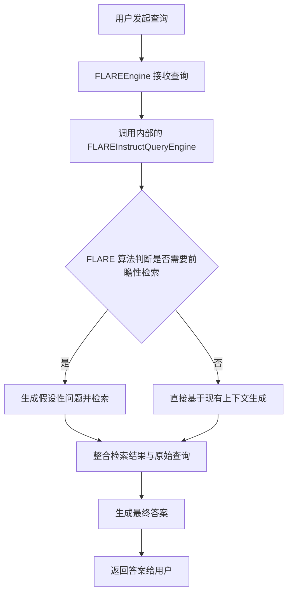

# `.\MetaGPT\metagpt\rag\engines\flare.py` 详细设计文档

该文件提供了一个名为 FLAREEngine 的包装器，它实际上是 llama_index 库中 FLAREInstructQueryEngine 的别名。其核心功能是作为 FLARE（前瞻性主动检索）查询引擎的入口点，允许用户通过传入其他引擎（如检索器、响应合成器等）来构建一个能够主动预测未来信息需求并进行检索的增强型问答系统。

## 整体流程



## 类结构

```
flare_engine.py
└── FLAREEngine (类别名)
    └── 实际指向 llama_index.core.query_engine.FLAREInstructQueryEngine
```

## 全局变量及字段


    

## 全局函数及方法


## 关键组件


### FLAREEngine (FLAREInstructQueryEngine)

一个基于LlamaIndex框架的查询引擎，它实现了FLARE（Forward-Looking Active REtrieval）算法，通过主动预测未来信息需求来迭代地检索和整合外部知识，以生成更准确、信息更丰富的答案。

### 查询引擎参数化设计

FLAREEngine的核心设计模式，它接受其他查询引擎作为构造参数，从而能够灵活地组合不同的检索、生成或推理组件，构建出适应特定场景的复杂问答流程。


## 问题及建议


### 已知问题

-   **代码功能单一且封装不足**：当前代码仅是一个简单的导入和重命名操作，将 `llama_index.core.query_engine.FLAREInstructQueryEngine` 导入并重命名为 `FLAREEngine`。它没有提供任何额外的封装、配置、错误处理或使用示例，功能上等同于直接导入原类。这可能导致使用此模块的开发者困惑，不清楚其与直接导入原类有何区别或优势。
-   **缺乏文档和上下文**：虽然文件顶部有注释，但注释内容较为简略，没有详细说明 `FLAREEngine` 的具体用途、如何配置、需要传入哪些引擎参数以及典型的使用模式。对于不熟悉 LlamaIndex FLARE 功能的开发者来说，理解和使用成本较高。
-   **潜在的命名冲突风险**：通过 `from ... import ... as ...` 的方式在模块级别创建了一个别名 `FLAREEngine`。如果项目中其他模块也定义了同名的类或变量，可能会导致混淆或意外的覆盖。

### 优化建议

-   **提供工厂函数或配置类**：建议创建一个工厂函数（如 `create_flare_engine`）或一个配置类，用于封装 `FLAREInstructQueryEngine` 的实例化过程。这样可以集中管理默认参数、提供输入验证、并简化调用方式。例如，函数可以接受必要的子引擎作为参数，并返回配置好的 `FLAREEngine` 实例。
-   **增强模块文档和示例**：在模块的 `__doc__` 字符串或独立的文档文件中，详细说明 FLARE（Forward-Looking Active REtrieval）机制的原理、`FLAREEngine` 的作用、其核心参数（特别是 `query_engine`、`generate_query_engine` 等）的意义，并提供 1-2 个完整的代码示例，展示如何构建子引擎并组合成 `FLAREEngine`。
-   **考虑添加类型提示和错误处理**：为任何新增的工厂函数或方法添加完整的类型提示（Type Hints），提高代码的清晰度和 IDE 支持。同时，考虑在引擎创建过程中加入基本的错误处理逻辑，例如检查传入的引擎参数是否有效，并在出错时抛出更清晰的异常信息。
-   **评估直接导出的必要性**：重新评估当前这种简单重命名导出的模式是否必要。如果项目架构希望统一入口或隐藏底层实现细节，这种包装是有意义的，但需配以上述的增强措施。否则，可以考虑让使用者直接导入 `llama_index` 的原生类，以减少中间层并保持透明性。


## 其它


### 设计目标与约束

本模块的设计目标是提供一个简洁、统一的接口，用于封装和调用 LlamaIndex 框架中的 `FLAREInstructQueryEngine` 功能。其主要约束包括：
1.  **接口简化**：通过重命名 (`as FLAREEngine`) 和选择性导入 (`# noqa: F401`)，为内部复杂组件提供一个更直观、一致的入口点，降低使用者的认知负担。
2.  **依赖管理**：明确声明并严格依赖于 `llama_index.core.query_engine` 模块，确保功能的稳定性和版本兼容性。`# noqa: F401` 注释表明此导入是故意保留以供外部使用的。
3.  **功能透明**：不隐藏或修改底层 `FLAREInstructQueryEngine` 的核心能力（如主动检索、查询重写、答案生成），而是作为其直接代理，确保所有高级功能可用。
4.  **命名空间清晰**：通过 `from ... import ... as ...` 语法，在模块级别定义了 `FLAREEngine` 这个明确的符号，避免了命名冲突，并建立了项目内的标准术语。

### 错误处理与异常设计

本模块作为底层 `FLAREInstructQueryEngine` 的包装器，其错误处理机制完全继承自 LlamaIndex 框架：
1.  **异常传播**：模块本身不进行额外的异常捕获或处理。在创建或使用 `FLAREEngine` 时发生的任何错误（如初始化参数错误、网络请求失败、模型调用异常等），都将直接抛出 `llama_index` 框架或其所依赖库（如 OpenAI SDK）定义的原生异常。
2.  **错误类型**：使用者应预期可能遇到 `ValueError`, `ImportError`, `ConnectionError`, `APIError`（来自大模型供应商）以及各种 `llama_index.core` 自定义的异常。
3.  **处理建议**：调用方需在应用层根据具体业务逻辑，对 `FLAREEngine.query(...)` 等方法调用进行适当的 `try-except` 包装，并实现重试、降级或用户提示等策略。

### 数据流与状态机

本模块定义的是一个无状态的工厂或别名，其本身不管理数据流或状态。核心的数据流与状态转移发生在 `FLAREInstructQueryEngine` 实例内部：
1.  **初始化数据流**：用户提供配置参数（如底层的 `query_engine`, `service_context`, `max_iterations` 等）来实例化 `FLAREEngine`。这些参数决定了引擎的行为和能力边界。
2.  **查询执行数据流**：
    *   **输入**：用户查询字符串。
    *   **内部处理**：`FLAREInstructQueryEngine` 遵循“预测-检索-验证”的迭代流程。它首先生成一个初步答案或检索指令，利用配置的底层引擎检索相关上下文，然后综合信息生成或 refine 最终答案。此过程可能涉及多轮迭代。
    *   **状态**：每次查询对于引擎实例来说是独立的。虽然引擎本身可能缓存一些中间结果（取决于配置），但通常不保持跨查询的会话状态。主要的“状态”体现在迭代循环的当前步骤、已检索到的文档块以及生成的中间答案上。
    *   **输出**：最终的响应对象（通常包含答案文本和来源引用）。

### 外部依赖与接口契约

1.  **核心外部依赖**：
    *   `llama_index.core.query_engine.FLAREInstructQueryEngine`：这是功能的直接来源，是本模块存在的先决条件。
    *   整个 `llama_index` 框架及其依赖（如 `openai`, `requests`, 各种嵌入模型和LLM的客户端库等）。

2.  **接口契约**：
    *   **导出契约**：本模块承诺对外提供一个名为 `FLAREEngine` 的类，其构造函数、方法、属性与 `llama_index.core.query_engine.FLAREInstructQueryEngine` 完全一致。任何对 `FLAREEngine` 的调用都等价于直接调用原类。
    *   **导入契约**：使用本模块的代码必须确保其运行环境已正确安装并兼容 `llama_index` 库的相应版本。模块通过导入语句声明了这一强契约，任何不满足都会导致 `ImportError`。
    *   **行为契约**：`FLAREEngine` 的行为完全由传入的底层引擎（如 `VectorStoreQueryEngine`）和配置参数决定，本模块不增加或减少其任何既定行为。

### 配置管理与环境要求

1.  **环境变量**：`FLAREEngine` 所依赖的底层组件（如 OpenAI API）通常需要通过环境变量（如 `OPENAI_API_KEY`）或配置文件来设置认证密钥和端点。
2.  **引擎配置**：`FLAREEngine` 的核心能力依赖于其构造时传入的 `query_engine` 参数。该参数通常是一个已配置好的检索查询引擎（例如基于特定向量数据库的 `VectorStoreIndex.as_query_engine()`），其配置（如检索的相似度 top_k、chunk 大小等）间接决定了 `FLARE` 的检索质量。
3.  **FLARE 特定参数**：在创建 `FLAREEngine` 时，可以配置其特有的参数，如 `max_iterations`（最大迭代次数）、`verbose`（是否输出详细日志）等，这些参数控制着 FLARE 算法的执行细节。
4.  **无内部配置**：本模块文件 (`__init__.py` 或类似) 自身不包含任何硬编码的配置逻辑，所有配置均通过构造函数参数在运行时传入。

### 测试策略与考量

1.  **单元测试范围**：由于本模块是简单的导入和重命名，其单元测试应侧重于验证导入是否成功以及 `FLAREEngine` 符号是否正确导出。这通常是一个简单的导入测试。
2.  **集成测试重点**：测试的重点应放在使用 `FLAREEngine` 的集成场景中。需要测试：
    *   使用不同的底层 `query_engine` 实例化 `FLAREEngine` 是否正常工作。
    *   `FLAREEngine.query` 方法对不同类型查询的响应是否符合预期（例如，对于需要检索的问题，它是否发起了检索并整合了结果）。
    *   FLARE 的迭代机制是否在复杂查询下被触发并正确终止。
3.  **模拟与夹具**：在测试中，应使用模拟对象 (Mock) 来替代真实的 LLM 调用和向量数据库检索，以验证 `FLAREEngine` 的控制逻辑（如迭代流程），同时保证测试的独立性和速度。
4.  **错误路径测试**：测试当底层引擎抛出异常或网络失败时，`FLAREEngine` 是否正确地传播了这些异常。


    