# `.\MetaGPT\metagpt\rag\engines\simple.py` 详细设计文档

该代码实现了一个名为 SimpleEngine 的检索增强生成（RAG）引擎，它封装了文档读取、解析、嵌入、索引、检索和排序的完整流程，提供了一个简单易用的接口来构建和操作基于文档的问答系统。

## 整体流程

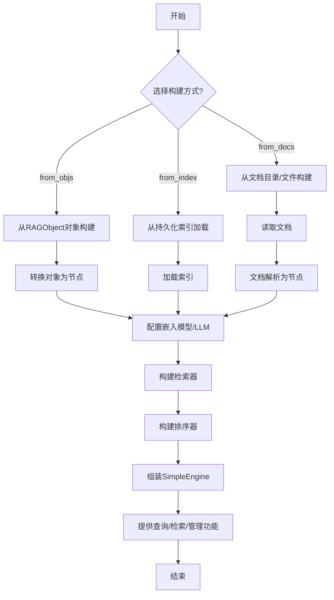

## 类结构

```
SimpleEngine (继承自RetrieverQueryEngine)
├── 类方法: from_docs, from_objs, from_index
├── 实例方法: asearch, retrieve, aretrieve, add_docs, add_objs, persist, count, clear, delete_docs
├── 私有方法: _from_nodes, _from_index, _ensure_retriever_*, _save_nodes, _persist, _try_reconstruct_obj, _fix_document_metadata, _resolve_embed_model, _default_transformations, _get_file_extractor
└── 属性: filenames
```

## 全局变量及字段


### `SimpleEngine._transformations`
    
存储用于将文档转换为节点的转换组件列表，默认为句子分割器。

类型：`Optional[list[TransformComponent]]`
    


### `SimpleEngine._filenames`
    
存储已处理文件的文件名集合，用于跟踪引擎管理的文档。

类型：`Set[str]`
    
    

## 全局函数及方法

### `SimpleEngine.__init__`

`SimpleEngine.__init__` 是 `SimpleEngine` 类的构造函数。它负责初始化一个 `SimpleEngine` 实例，该实例是一个集成了检索、响应合成和文档转换功能的查询引擎。构造函数主要调用父类 `RetrieverQueryEngine` 的初始化逻辑，并设置自身的文档转换流水线。

参数：

-   `retriever`：`BaseRetriever`，用于从知识库中检索相关文档片段的检索器。
-   `response_synthesizer`：`Optional[BaseSynthesizer]`，用于将检索到的文档片段合成为最终响应的合成器。如果为 `None`，将使用父类的默认设置。
-   `node_postprocessors`：`Optional[list[BaseNodePostprocessor]]`，用于对检索到的节点进行后处理的处理器列表，例如重排序。如果为 `None`，将使用父类的默认设置。
-   `callback_manager`：`Optional[CallbackManager]`，用于管理回调函数的回调管理器。如果为 `None`，将使用父类的默认设置。
-   `transformations`：`Optional[list[TransformComponent]]`，用于将原始文档转换为节点（Node）的转换组件列表。如果为 `None`，将使用 `_default_transformations` 方法提供的默认转换器（通常是 `SentenceSplitter`）。

返回值：`None`，构造函数不返回任何值。

#### 流程图

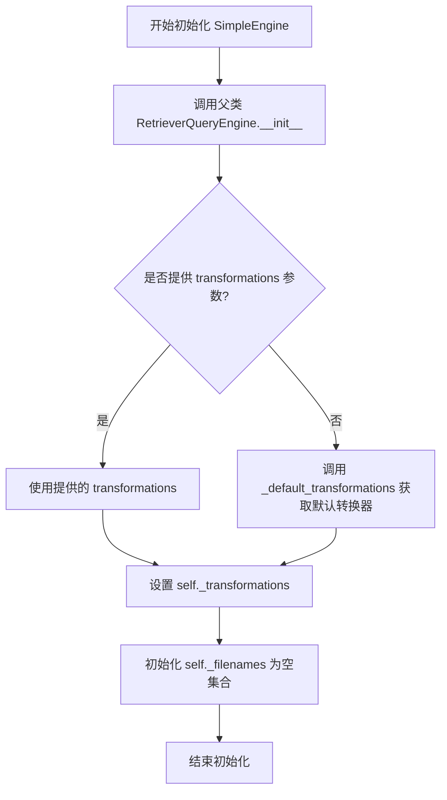

#### 带注释源码

```python
def __init__(
    self,
    retriever: BaseRetriever,  # 核心组件：负责检索相关文档片段
    response_synthesizer: Optional[BaseSynthesizer] = None,  # 可选：负责生成最终答案
    node_postprocessors: Optional[list[BaseNodePostprocessor]] = None,  # 可选：对检索结果进行后处理（如重排序）
    callback_manager: Optional[CallbackManager] = None,  # 可选：用于事件回调管理
    transformations: Optional[list[TransformComponent]] = None,  # 可选：文档预处理流水线（如分句）
) -> None:
    # 1. 调用父类（RetrieverQueryEngine）的构造函数，初始化基础的查询引擎结构
    super().__init__(
        retriever=retriever,
        response_synthesizer=response_synthesizer,
        node_postprocessors=node_postprocessors,
        callback_manager=callback_manager,
    )
    # 2. 设置文档转换流水线。如果未提供，则使用默认的句子分割器。
    self._transformations = transformations or self._default_transformations()
    # 3. 初始化一个用于存储文件名的集合，可能在后续的文档管理功能中使用。
    self._filenames = set()
```

### `SimpleEngine.from_docs`

`SimpleEngine.from_docs` 是一个类方法，用于从文档文件（目录或文件列表）创建并初始化一个 `SimpleEngine` 实例。该方法封装了文档加载、解析、节点转换、嵌入模型配置、检索器构建和排序器配置的完整流程，为用户提供了一个简单、一站式的文档检索引擎构建入口。

参数：

- `input_dir`：`str`，可选，指定包含文档的目录路径。
- `input_files`：`list[str]`，可选，指定要加载的文档文件路径列表。如果提供，将覆盖 `input_dir` 参数。
- `transformations`：`Optional[list[TransformComponent]]`，可选，用于将文档转换为节点的转换组件列表。默认为 `[SentenceSplitter()]`。
- `embed_model`：`BaseEmbedding`，可选，用于生成节点嵌入向量的嵌入模型。默认为 `OpenAIEmbedding`。
- `llm`：`LLM`，可选，用于响应合成和排序器的大语言模型。默认为 `OpenAI`。
- `retriever_configs`：`list[BaseRetrieverConfig]`，可选，检索器的配置列表。如果提供多个配置，将使用 `SimpleHybridRetriever` 进行混合检索。
- `ranker_configs`：`list[BaseRankerConfig]`，可选，排序器的配置列表。
- `fs`：`Optional[fsspec.AbstractFileSystem]`，可选，用于文件操作的文件系统对象。

返回值：`SimpleEngine`，返回一个初始化好的 `SimpleEngine` 实例，该实例集成了文档检索、排序和响应合成的能力。

#### 流程图

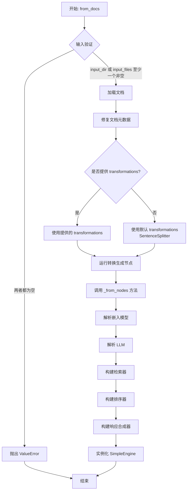

#### 带注释源码

```python
    @classmethod
    def from_docs(
        cls,
        input_dir: str = None,
        input_files: list[str] = None,
        transformations: Optional[list[TransformComponent]] = None,
        embed_model: BaseEmbedding = None,
        llm: LLM = None,
        retriever_configs: list[BaseRetrieverConfig] = None,
        ranker_configs: list[BaseRankerConfig] = None,
        fs: Optional[fsspec.AbstractFileSystem] = None,
    ) -> "SimpleEngine":
        """From docs.

        Must provide either `input_dir` or `input_files`.

        Args:
            input_dir: Path to the directory.
            input_files: List of file paths to read (Optional; overrides input_dir, exclude).
            transformations: Parse documents to nodes. Default [SentenceSplitter].
            embed_model: Parse nodes to embedding. Must supported by llama index. Default OpenAIEmbedding.
            llm: Must supported by llama index. Default OpenAI.
            retriever_configs: Configuration for retrievers. If more than one config, will use SimpleHybridRetriever.
            ranker_configs: Configuration for rankers.
            fs: File system to use.
        """
        # 1. 输入验证：必须提供 input_dir 或 input_files 之一
        if not input_dir and not input_files:
            raise ValueError("Must provide either `input_dir` or `input_files`.")

        # 2. 获取文件提取器（例如，为PDF配置OmniParse解析器）
        file_extractor = cls._get_file_extractor()
        # 3. 使用 SimpleDirectoryReader 加载文档数据
        documents = SimpleDirectoryReader(
            input_dir=input_dir, input_files=input_files, file_extractor=file_extractor, fs=fs
        ).load_data()
        # 4. 修复文档元数据（例如，从嵌入元数据中排除'file_path'）
        cls._fix_document_metadata(documents)

        # 5. 确定转换组件：使用提供的或默认的 SentenceSplitter
        transformations = transformations or cls._default_transformations()
        # 6. 运行转换，将文档列表转换为节点列表
        nodes = run_transformations(documents, transformations=transformations)

        # 7. 调用内部方法 _from_nodes 完成引擎的构建
        return cls._from_nodes(
            nodes=nodes,
            transformations=transformations,
            embed_model=embed_model,
            llm=llm,
            retriever_configs=retriever_configs,
            ranker_configs=ranker_configs,
        )
```

### `SimpleEngine.from_objs`

`SimpleEngine.from_objs` 是一个类方法，用于从一组 `RAGObject` 对象构建一个 `SimpleEngine` 实例。它将这些对象转换为 `ObjectNode` 节点，然后根据提供的配置（如嵌入模型、检索器、排序器等）创建一个完整的检索增强生成（RAG）引擎。该方法特别适用于处理结构化或半结构化的对象数据，而非原始文档文件。

参数：

- `objs`：`Optional[list[RAGObject]]`，一个可选的 `RAGObject` 对象列表。如果为空，则引擎将基于其他配置（如索引）构建，但若配置中包含 `BM25RetrieverConfig`，则此列表不能为空。
- `transformations`：`Optional[list[TransformComponent]]`，可选的转换组件列表，用于将文档解析为节点。默认为 `[SentenceSplitter()]`。
- `embed_model`：`BaseEmbedding`，用于节点嵌入的模型。必须受 LlamaIndex 支持。默认为 `OpenAIEmbedding`。
- `llm`：`LLM`，用于生成响应的语言模型。必须受 LlamaIndex 支持。默认为 `OpenAI`。
- `retriever_configs`：`list[BaseRetrieverConfig]`，检索器的配置列表。如果提供多个配置，将使用 `SimpleHybridRetriever` 进行混合检索。
- `ranker_configs`：`list[BaseRankerConfig]`，排序器的配置列表。

返回值：`SimpleEngine`，返回一个配置好的 `SimpleEngine` 实例，该实例集成了检索、排序和响应生成功能。

#### 流程图

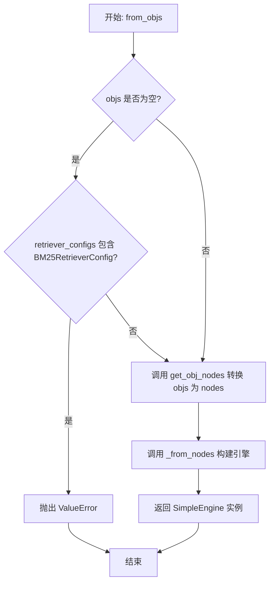

#### 带注释源码

```python
@classmethod
def from_objs(
    cls,
    objs: Optional[list[RAGObject]] = None,
    transformations: Optional[list[TransformComponent]] = None,
    embed_model: BaseEmbedding = None,
    llm: LLM = None,
    retriever_configs: list[BaseRetrieverConfig] = None,
    ranker_configs: list[BaseRankerConfig] = None,
) -> "SimpleEngine":
    """From objs.

    Args:
        objs: List of RAGObject.
        transformations: Parse documents to nodes. Default [SentenceSplitter].
        embed_model: Parse nodes to embedding. Must supported by llama index. Default OpenAIEmbedding.
        llm: Must supported by llama index. Default OpenAI.
        retriever_configs: Configuration for retrievers. If more than one config, will use SimpleHybridRetriever.
        ranker_configs: Configuration for rankers.
    """
    # 初始化参数，确保 objs 和 retriever_configs 不为 None
    objs = objs or []
    retriever_configs = retriever_configs or []

    # 验证逻辑：如果 objs 为空但配置中包含 BM25RetrieverConfig，则抛出异常
    # 因为 BM25 检索器需要基于文本内容构建索引，空对象列表无法提供内容
    if not objs and any(isinstance(config, BM25RetrieverConfig) for config in retriever_configs):
        raise ValueError("In BM25RetrieverConfig, Objs must not be empty.")

    # 将 RAGObject 列表转换为 ObjectNode 列表
    # ObjectNode 是专门用于封装对象的节点类型，包含对象的文本表示和元数据
    nodes = cls.get_obj_nodes(objs)

    # 调用内部方法 _from_nodes，传入转换后的节点和其他配置，构建并返回 SimpleEngine 实例
    return cls._from_nodes(
        nodes=nodes,
        transformations=transformations,
        embed_model=embed_model,
        llm=llm,
        retriever_configs=retriever_configs,
        ranker_configs=ranker_configs,
    )
```

### `SimpleEngine.from_index`

`SimpleEngine.from_index` 是一个类方法，用于从已持久化的索引配置中加载并构建一个 `SimpleEngine` 实例。它首先根据提供的索引配置和嵌入模型解析出具体的索引对象，然后基于该索引、检索器配置和排序器配置，最终构造并返回一个功能完整的 `SimpleEngine`。

参数：

- `index_config`：`BaseIndexConfig`，包含索引持久化路径等信息的配置对象。
- `embed_model`：`BaseEmbedding`，可选的嵌入模型。如果未提供，将根据配置自动解析。
- `llm`：`LLM`，可选的大语言模型。如果未提供，将使用默认的RAG LLM。
- `retriever_configs`：`list[BaseRetrieverConfig]`，可选的检索器配置列表。如果未提供，将使用索引自带的默认检索器。
- `ranker_configs`：`list[BaseRankerConfig]`，可选的排序器配置列表。如果未提供，则不使用排序器。

返回值：`SimpleEngine`，一个构建好的、可直接用于检索和查询的引擎实例。

#### 流程图

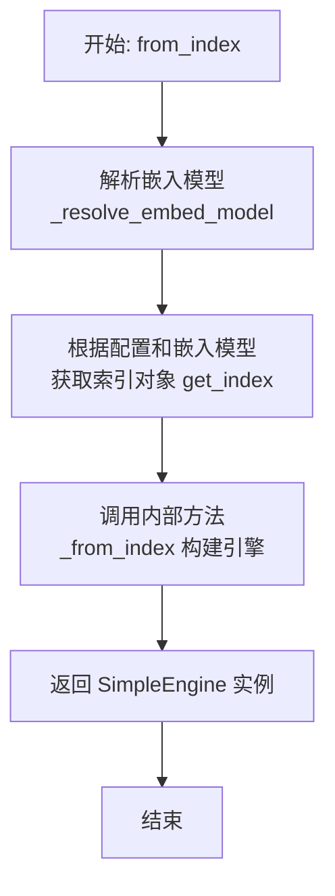

#### 带注释源码

```python
    @classmethod
    def from_index(
        cls,
        index_config: BaseIndexConfig,
        embed_model: BaseEmbedding = None,
        llm: LLM = None,
        retriever_configs: list[BaseRetrieverConfig] = None,
        ranker_configs: list[BaseRankerConfig] = None,
    ) -> "SimpleEngine":
        """Load from previously maintained index by self.persist(), index_config contains persis_path."""
        # 1. 解析嵌入模型：如果未提供embed_model，则根据retriever_configs判断是否需要MockEmbedding，否则使用默认RAG嵌入模型。
        resolved_embed_model = cls._resolve_embed_model(embed_model, [index_config])
        # 2. 获取索引：使用工厂函数get_index，根据index_config和解析后的嵌入模型加载或重建索引。
        index = get_index(index_config, embed_model=resolved_embed_model)
        # 3. 构建引擎：调用内部方法_from_index，传入索引、LLM、检索器和排序器配置，完成引擎的最终构建。
        return cls._from_index(index, llm=llm, retriever_configs=retriever_configs, ranker_configs=ranker_configs)
```

### `SimpleEngine.asearch`

`asearch` 方法是 `SimpleEngine` 类的一个异步方法，用于实现 `tools.SearchInterface` 接口。它接收一个查询字符串，并异步地调用 `aquery` 方法来执行查询，最终返回一个字符串格式的查询结果。

参数：

- `content`：`str`，查询的内容字符串。
- `**kwargs`：`Any`，可变关键字参数，用于传递额外的查询选项。

返回值：`str`，查询结果的字符串表示。

#### 流程图

```mermaid
graph TD
    A[开始] --> B[接收查询内容 content 和可选参数 kwargs]
    B --> C[调用异步查询方法 self.aquery(content)]
    C --> D[等待查询结果]
    D --> E[返回查询结果字符串]
    E --> F[结束]
```

#### 带注释源码

```python
async def asearch(self, content: str, **kwargs) -> str:
    """Inplement tools.SearchInterface"""
    # 调用父类或自身的异步查询方法 aquery，传入查询内容
    return await self.aquery(content)
```

### `SimpleEngine.retrieve`

该方法用于根据查询检索相关的文档节点。它首先将查询字符串（如果提供的是字符串）包装成 `QueryBundle` 对象，然后调用父类（`RetrieverQueryEngine`）的 `retrieve` 方法执行检索。检索完成后，它会尝试对返回的节点进行对象重建（如果节点包含序列化的对象元数据），最后返回带有分数的节点列表。

参数：

- `query`：`QueryType`，查询内容，可以是字符串或 `QueryBundle` 对象。

返回值：`list[NodeWithScore]`，一个包含检索到的节点及其相关性分数的列表。

#### 流程图

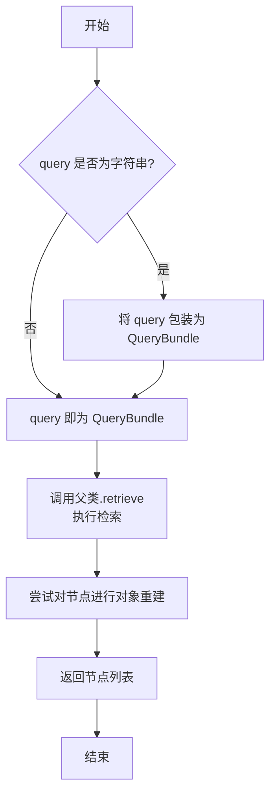

#### 带注释源码

```python
def retrieve(self, query: QueryType) -> list[NodeWithScore]:
    # 1. 参数处理：如果查询是字符串，则将其包装成 QueryBundle 对象，以便后续处理。
    query_bundle = QueryBundle(query) if isinstance(query, str) else query

    # 2. 核心检索：调用父类 RetrieverQueryEngine 的 retrieve 方法执行实际的检索逻辑。
    nodes = super().retrieve(query_bundle)
    
    # 3. 后处理：尝试对检索到的节点进行对象重建（如果节点元数据中包含序列化的对象信息）。
    self._try_reconstruct_obj(nodes)
    
    # 4. 返回结果：返回带有分数的节点列表。
    return nodes
```

### `SimpleEngine.aretrieve`

该方法是一个异步检索方法，用于处理查询请求。它首先将输入的查询字符串（如果提供的是字符串）包装成 `QueryBundle` 对象，然后调用父类的异步检索方法获取相关节点。之后，它会尝试从这些节点中重构出原始的 `RAGObject` 对象，并将重构的对象存储在节点的元数据中，最后返回带有分数的节点列表。

参数：

- `query`：`QueryType`，查询内容，可以是字符串或 `QueryBundle` 对象。

返回值：`list[NodeWithScore]`，一个包含 `NodeWithScore` 对象的列表，每个节点都带有相关性分数，并且可能在其元数据中包含了重构的原始对象。

#### 流程图

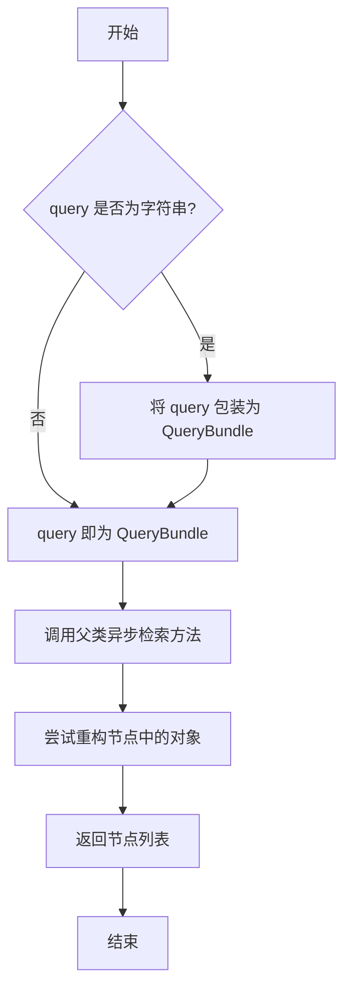

#### 带注释源码

```python
async def aretrieve(self, query: QueryType) -> list[NodeWithScore]:
    """Allow query to be str."""
    # 步骤1：参数标准化。如果传入的查询是字符串，则将其包装成 QueryBundle 对象。
    # 这是为了统一后续处理的输入格式。
    query_bundle = QueryBundle(query) if isinstance(query, str) else query

    # 步骤2：执行核心检索。调用父类（RetrieverQueryEngine）的异步检索方法。
    # 该方法会利用配置的检索器（retriever）和可能的排序器（ranker）来获取与查询最相关的节点。
    nodes = await super().aretrieve(query_bundle)

    # 步骤3：后处理与对象重构。尝试检查检索到的节点。
    # 如果节点元数据中标记了 `is_obj` 为 True，则根据元数据中的类信息动态重构出原始的 RAGObject 对象。
    # 重构后的对象会被存回节点的 `metadata["obj"]` 字段中，方便后续使用。
    self._try_reconstruct_obj(nodes)

    # 步骤4：返回结果。返回处理后的节点列表，每个节点都带有其相关性分数。
    return nodes
```

### `SimpleEngine.add_docs`

该方法用于向检索器（retriever）中添加新的文档。它首先确保当前检索器支持修改操作（即实现了 `ModifiableRAGRetriever` 接口），然后加载指定文件列表中的文档，对文档进行元数据修正和节点转换处理，最后将生成的节点保存到检索器中。

参数：

- `input_files`：`List[Union[str, Path]]`，一个包含文件路径或 `Path` 对象的列表，指定要添加的文档文件。

返回值：`None`，该方法不返回任何值。

#### 流程图

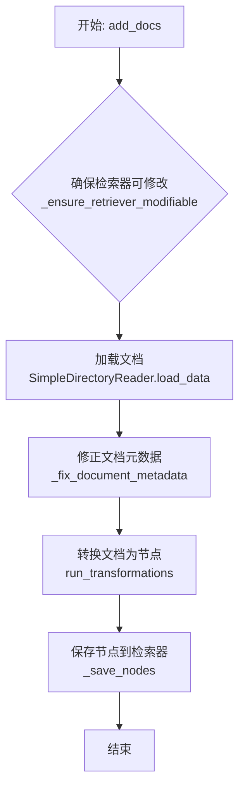

#### 带注释源码

```python
def add_docs(self, input_files: List[Union[str, Path]]):
    """Add docs to retriever. retriever must has add_nodes func."""
    # 1. 类型检查：确保当前检索器支持添加节点（即实现了 ModifiableRAGRetriever 接口）
    self._ensure_retriever_modifiable()

    # 2. 数据加载：使用 SimpleDirectoryReader 加载指定文件列表中的文档
    #    将输入参数统一转换为字符串列表
    documents = SimpleDirectoryReader(input_files=[str(i) for i in input_files]).load_data()
    # 3. 元数据修正：移除文档元数据中不必要的 'file_path' 键，避免其被嵌入
    self._fix_document_metadata(documents)

    # 4. 节点转换：使用引擎初始化时设置的转换流水线（self._transformations）
    #    将文档对象列表转换为节点（BaseNode）列表
    nodes = run_transformations(documents, transformations=self._transformations)
    # 5. 持久化：调用检索器的 add_nodes 方法，将新节点添加到索引和文档存储中
    self._save_nodes(nodes)
```

### `SimpleEngine.add_objs`

该方法用于向检索器（retriever）中添加一组RAGObject对象。它会首先确保当前检索器支持修改操作，然后将传入的对象列表转换为ObjectNode列表，最后将这些节点保存到检索器中，以便后续的检索和查询操作。

参数：

- `objs`：`list[RAGObject]`，一个RAGObject对象的列表，这些对象将被添加到检索器中。

返回值：`None`，该方法不返回任何值。

#### 流程图

```mermaid
flowchart TD
    A[开始: add_objs(objs)] --> B{检查retriever是否可修改};
    B -- 否 --> C[抛出异常];
    B -- 是 --> D[将RAGObject列表转换为ObjectNode列表];
    D --> E[调用retriever.add_nodes保存节点];
    E --> F[结束];
```

#### 带注释源码

```python
def add_objs(self, objs: list[RAGObject]):
    """Adds objects to the retriever, storing each object's original form in metadata for future reference."""
    # 1. 确保当前检索器支持修改操作（例如，实现了ModifiableRAGRetriever接口）
    self._ensure_retriever_modifiable()

    # 2. 调用静态方法get_obj_nodes，将RAGObject列表转换为ObjectNode列表。
    #    每个ObjectNode的text字段是对象的rag_key()，metadata字段包含对象的序列化信息。
    nodes = self.get_obj_nodes(objs)

    # 3. 调用内部方法_save_nodes，将转换后的节点列表添加到检索器中。
    self._save_nodes(nodes)
```

### `SimpleEngine.persist`

该方法用于将当前检索器（retriever）的索引状态持久化到指定的目录中。它首先确保检索器支持持久化操作，然后调用检索器的 `persist` 方法将索引数据保存到本地文件系统。

参数：

- `persist_dir`：`Union[str, os.PathLike]`，指定持久化数据的存储目录路径。
- `**kwargs`：`Any`，可选的关键字参数，传递给底层检索器的 `persist` 方法。

返回值：`None`，该方法没有返回值。

#### 流程图

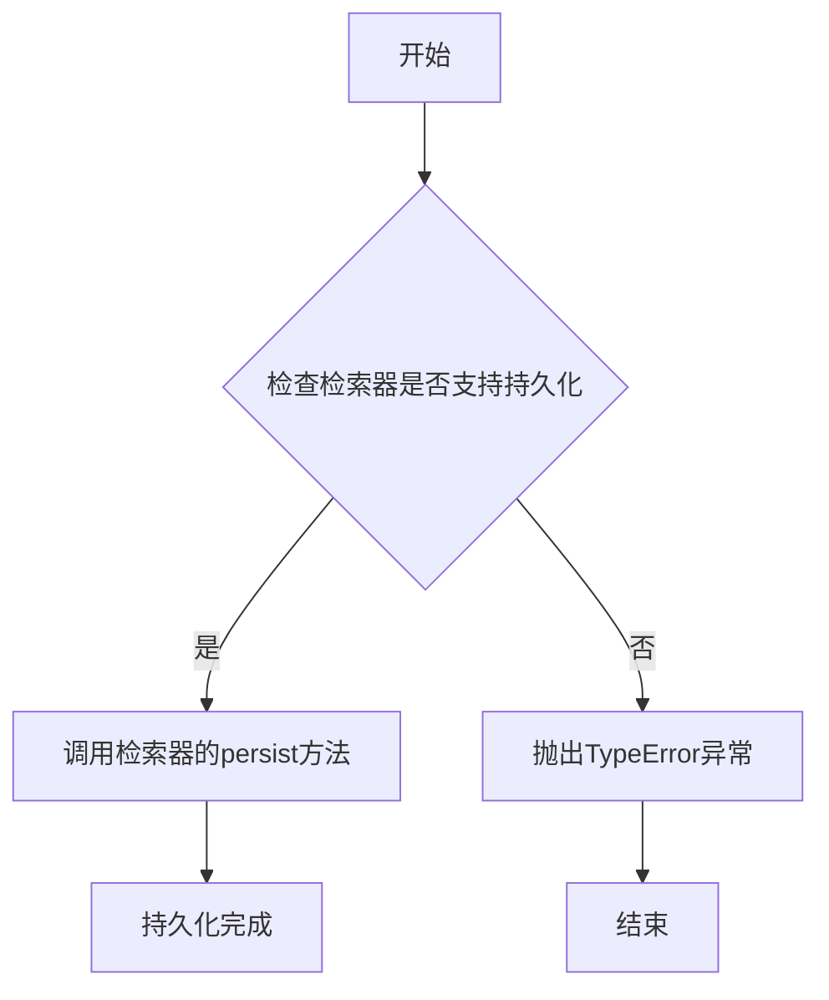

#### 带注释源码

```python
def persist(self, persist_dir: Union[str, os.PathLike], **kwargs):
    """Persist."""
    # 1. 确保当前检索器支持持久化操作
    self._ensure_retriever_persistable()

    # 2. 调用内部方法执行持久化，将路径转换为字符串
    self._persist(str(persist_dir), **kwargs)
```

### `SimpleEngine.count`

`SimpleEngine.count` 方法用于查询当前检索器（retriever）中存储的文档或节点的总数。它首先确保检索器支持查询操作，然后调用检索器的 `query_total_count` 方法获取总数。

参数：无

返回值：`int`，返回检索器中存储的文档或节点的总数。

#### 流程图

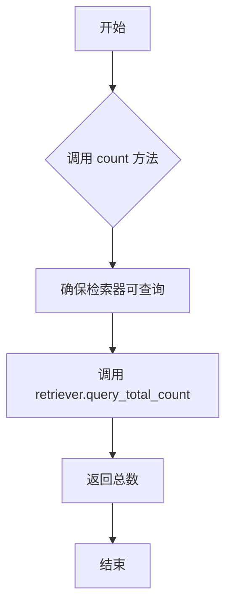

#### 带注释源码

```python
def count(self) -> int:
    """Count."""
    # 确保检索器支持查询操作
    self._ensure_retriever_queryable()

    # 调用检索器的 query_total_count 方法获取总数
    return self.retriever.query_total_count()
```

### `SimpleEngine.clear`

该方法用于清空检索器（retriever）中的所有数据。它首先确保当前检索器支持删除操作（即实现了 `DeletableRAGRetriever` 接口），然后调用检索器的 `clear` 方法执行实际的数据清除。

参数：

-  `kwargs`：`dict`，可选的关键字参数，用于传递给底层检索器的 `clear` 方法。

返回值：`None`，无返回值。

#### 流程图

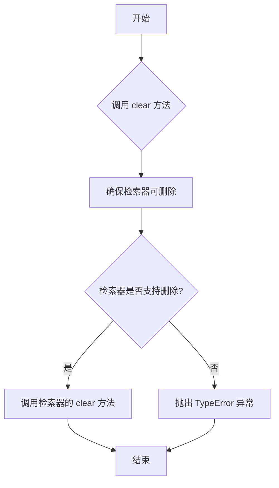

#### 带注释源码

```python
def clear(self, **kwargs):
    """Clear."""
    # 确保当前检索器实现了 DeletableRAGRetriever 接口，支持删除操作
    self._ensure_retriever_deletable()

    # 调用检索器的 clear 方法，传入任何额外的关键字参数
    return self.retriever.clear(**kwargs)
```

### `SimpleEngine.delete_docs`

该方法用于从检索器的索引和文档存储中删除指定的文档。它通过遍历索引中的引用文档信息，匹配给定的文件路径或文件名，并调用底层索引的删除方法来移除对应的文档。

参数：

- `input_files`：`List[Union[str, Path]]`，一个包含要删除的文件路径或文件名的列表。

返回值：`None`，无返回值。

#### 流程图

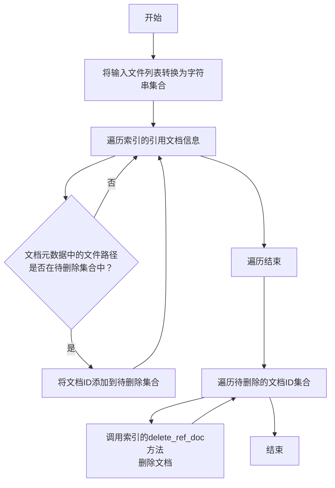

#### 带注释源码

```python
def delete_docs(self, input_files: List[Union[str, Path]]):
    """Delete documents from the index and document store.

    Args:
        input_files (List[Union[str, Path]]): A list of file paths or file names to be deleted.

    Raises:
        NotImplementedError: If the method is not implemented.
    """
    # 1. 初始化一个集合，用于存储实际存在于索引中的文档ID
    exists_filenames = set()
    # 2. 将输入的文件路径列表统一转换为字符串集合，便于后续查找
    filenames = {str(i) for i in input_files}
    # 3. 遍历底层索引（self.retriever._index）中的所有引用文档信息
    for doc_id, info in self.retriever._index.ref_doc_info.items():
        # 4. 检查当前文档的元数据中'file_path'字段的值是否在待删除的文件名集合中
        if info.metadata.get("file_path") in filenames:
            # 5. 如果是，则将该文档的ID添加到待删除集合中
            exists_filenames.add(doc_id)

    # 6. 遍历所有需要删除的文档ID
    for doc_id in exists_filenames:
        # 7. 调用底层索引的delete_ref_doc方法，从索引和文档存储中删除该文档
        self.retriever._index.delete_ref_doc(doc_id, delete_from_docstore=True)
```

### `SimpleEngine.get_obj_nodes`

`SimpleEngine.get_obj_nodes` 是一个静态方法，用于将一组 `RAGObject` 对象转换为一组 `ObjectNode` 对象。每个 `ObjectNode` 的文本内容由对象的 `rag_key()` 方法生成，其元数据则通过 `ObjectNode.get_obj_metadata` 方法从对象中提取并封装。此方法是 `SimpleEngine` 从自定义对象构建检索索引的关键步骤。

参数：

-   `objs`：`Optional[list[RAGObject]]`，一个可选的 `RAGObject` 对象列表。如果为 `None` 或空列表，则返回一个空列表。

返回值：`list[ObjectNode]`，一个由输入对象转换而来的 `ObjectNode` 列表。

#### 流程图

```mermaid
flowchart TD
    A[开始] --> B{输入objs列表是否为空?}
    B -- 是 --> C[返回空列表]
    B -- 否 --> D[遍历objs列表]
    D --> E[对每个obj<br>调用obj.rag_key()生成文本]
    E --> F[对每个obj<br>调用ObjectNode.get_obj_metadata(obj)生成元数据]
    F --> G[使用文本和元数据<br>构造ObjectNode对象]
    G --> H[将ObjectNode加入结果列表]
    H --> I{是否遍历完所有obj?}
    I -- 否 --> D
    I -- 是 --> J[返回结果列表]
    C --> K[结束]
    J --> K
```

#### 带注释源码

```python
@staticmethod
def get_obj_nodes(objs: Optional[list[RAGObject]] = None) -> list[ObjectNode]:
    """Converts a list of RAGObjects to a list of ObjectNodes."""
    # 使用列表推导式，遍历输入的objs列表（如果为None则视为空列表）
    # 对于每个obj，创建一个ObjectNode：
    #   - text字段：调用obj.rag_key()方法获取对象的检索键作为节点文本。
    #   - metadata字段：调用ObjectNode.get_obj_metadata(obj)静态方法，将对象序列化为元数据字典。
    return [ObjectNode(text=obj.rag_key(), metadata=ObjectNode.get_obj_metadata(obj)) for obj in objs]
```

### `SimpleEngine._from_nodes`

`SimpleEngine._from_nodes` 是一个类方法，用于根据提供的节点列表、嵌入模型、LLM、检索器配置和排序器配置，构建并返回一个完整的 `SimpleEngine` 实例。它是 `SimpleEngine` 从原始数据（文档或对象）构建检索增强生成（RAG）引擎的核心内部工厂方法。

参数：

- `nodes`：`list[BaseNode]`，由文档或对象转换而来的基础节点列表，是构建索引和检索器的数据基础。
- `transformations`：`Optional[list[TransformComponent]]`，可选的节点转换流水线，用于在构建引擎前对节点进行进一步处理（如分块、清洗）。如果为 `None`，则使用默认转换。
- `embed_model`：`BaseEmbedding`，用于生成节点向量表示的嵌入模型。如果为 `None`，将根据 `retriever_configs` 自动解析或使用默认嵌入模型。
- `llm`：`LLM`，用于响应合成和可能参与排序器（如LLM重排）的大语言模型。如果为 `None`，将使用默认的RAG LLM。
- `retriever_configs`：`list[BaseRetrieverConfig]`，检索器的配置列表。如果提供多个配置，将使用 `SimpleHybridRetriever` 进行混合检索。如果为 `None`，将使用默认配置。
- `ranker_configs`：`list[BaseRankerConfig]`，排序器（后处理器）的配置列表，用于对检索结果进行重排序。如果为 `None`，则不使用任何排序器。

返回值：`SimpleEngine`，一个配置好的 `SimpleEngine` 实例，集成了检索器、响应合成器和可选的排序器，可以直接用于查询。

#### 流程图

```mermaid
flowchart TD
    A[开始: _from_nodes] --> B{embed_model 参数为空?}
    B -- 是 --> C[调用 _resolve_embed_model<br>根据 retriever_configs 解析嵌入模型]
    B -- 否 --> D[使用传入的 embed_model]
    C --> E
    D --> E
    subgraph E[解析 LLM]
        F{llm 参数为空?}
        F -- 是 --> G[调用 get_rag_llm 获取默认 LLM]
        F -- 否 --> H[使用传入的 llm]
    end
    G --> I
    H --> I
    subgraph I[构建检索器]
        J[调用 get_retriever<br>传入 configs, nodes, embed_model]
    end
    subgraph K[构建排序器]
        L[调用 get_rankers<br>传入 configs, llm]
    end
    I --> M[构建响应合成器<br>get_response_synthesizer(llm)]
    K --> N
    M --> N[实例化 SimpleEngine<br>传入 retriever, rankers, synthesizer, transformations]
    N --> O[返回 SimpleEngine 实例]
```

#### 带注释源码

```python
    @classmethod
    def _from_nodes(
        cls,
        nodes: list[BaseNode],
        transformations: Optional[list[TransformComponent]] = None,
        embed_model: BaseEmbedding = None,
        llm: LLM = None,
        retriever_configs: list[BaseRetrieverConfig] = None,
        ranker_configs: list[BaseRankerConfig] = None,
    ) -> "SimpleEngine":
        # 步骤1: 解析嵌入模型。如果未提供，则根据检索器配置判断是否需要嵌入。
        # 例如，如果所有配置都是 NoEmbedding 类型（如BM25），则使用模拟嵌入模型。
        embed_model = cls._resolve_embed_model(embed_model, retriever_configs)
        # 步骤2: 解析LLM。如果未提供，则使用项目中配置的默认RAG LLM。
        llm = llm or get_rag_llm()

        # 步骤3: 根据配置、节点和嵌入模型，通过工厂函数构建检索器。
        # 如果提供了多个 retriever_configs，工厂函数会返回一个 SimpleHybridRetriever。
        retriever = get_retriever(configs=retriever_configs, nodes=nodes, embed_model=embed_model)
        # 步骤4: 根据配置和LLM，通过工厂函数构建排序器（后处理器）列表。
        # 如果未提供配置，则返回空列表。
        rankers = get_rankers(configs=ranker_configs, llm=llm)  # Default []

        # 步骤5: 使用构建好的组件实例化 SimpleEngine。
        # 传入检索器、排序器（作为node_postprocessors）、响应合成器以及可选的转换流水线。
        return cls(
            retriever=retriever,
            node_postprocessors=rankers,
            response_synthesizer=get_response_synthesizer(llm=llm),
            transformations=transformations,
        )
```

### `SimpleEngine._from_index`

`SimpleEngine._from_index` 是一个类方法，用于从一个已存在的 `BaseIndex` 对象构建一个 `SimpleEngine` 实例。它通过配置检索器（Retriever）和排序器（Ranker），并最终初始化一个 `SimpleEngine` 对象，该对象集成了检索、排序和响应生成功能，从而能够基于索引进行问答或检索。

参数：

- `index`：`BaseIndex`，一个已构建好的索引对象，作为检索器的数据源。
- `llm`：`LLM`，可选，用于响应生成和排序器的大语言模型。如果未提供，则使用 `get_rag_llm()` 获取默认模型。
- `retriever_configs`：`list[BaseRetrieverConfig]`，可选，检索器的配置列表。如果未提供，则使用索引自带的默认检索器（`index.as_retriever`）。
- `ranker_configs`：`list[BaseRankerConfig]`，可选，排序器的配置列表。如果未提供，则不使用任何排序器。

返回值：`SimpleEngine`，返回一个配置好的 `SimpleEngine` 实例，该实例可以执行基于索引的检索和问答。

#### 流程图

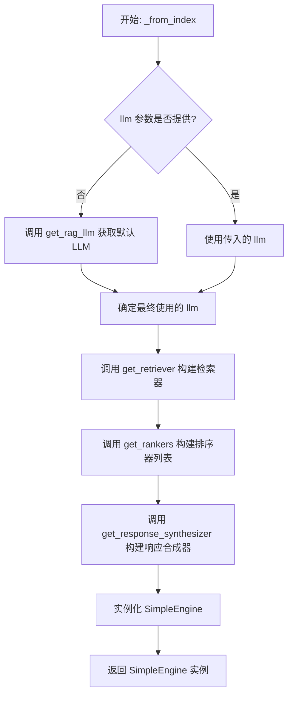

#### 带注释源码

```python
    @classmethod
    def _from_index(
        cls,
        index: BaseIndex,
        llm: LLM = None,
        retriever_configs: list[BaseRetrieverConfig] = None,
        ranker_configs: list[BaseRankerConfig] = None,
    ) -> "SimpleEngine":
        # 1. 确定LLM：如果未提供llm参数，则调用get_rag_llm()获取系统配置的默认LLM。
        llm = llm or get_rag_llm()

        # 2. 构建检索器：调用get_retriever工厂函数。
        #    - 如果提供了retriever_configs，则根据配置和给定的index构建检索器。
        #    - 如果未提供retriever_configs，则默认使用index.as_retriever()。
        retriever = get_retriever(configs=retriever_configs, index=index)  # Default index.as_retriever

        # 3. 构建排序器：调用get_rankers工厂函数。
        #    - 如果提供了ranker_configs，则根据配置和llm构建排序器列表。
        #    - 如果未提供ranker_configs，则返回一个空列表[]。
        rankers = get_rankers(configs=ranker_configs, llm=llm)  # Default []

        # 4. 构建并返回SimpleEngine实例。
        #    - 将上一步构建的retriever设置为引擎的检索器。
        #    - 将排序器列表rankers设置为节点后处理器（node_postprocessors）。
        #    - 使用llm构建一个响应合成器（response_synthesizer）并设置。
        #    - 注意：此处没有传入transformations参数，因为索引已经包含了处理好的节点。
        return cls(
            retriever=retriever,
            node_postprocessors=rankers,
            response_synthesizer=get_response_synthesizer(llm=llm),
        )
```

### `SimpleEngine._ensure_retriever_modifiable`

该方法用于确保当前引擎的检索器（`retriever`）支持修改操作。它通过调用内部辅助方法 `_ensure_retriever_of_type`，检查 `self.retriever` 是否是 `ModifiableRAGRetriever` 类型或其子类的实例。如果检索器是 `SimpleHybridRetriever`（混合检索器），则检查其内部的任何一个子检索器是否支持修改。如果检查失败，将抛出 `TypeError` 异常。

参数：
- `self`：`SimpleEngine`，当前 `SimpleEngine` 实例的引用。

返回值：`None`，该方法不返回任何值，仅用于执行类型检查并在条件不满足时抛出异常。

#### 流程图

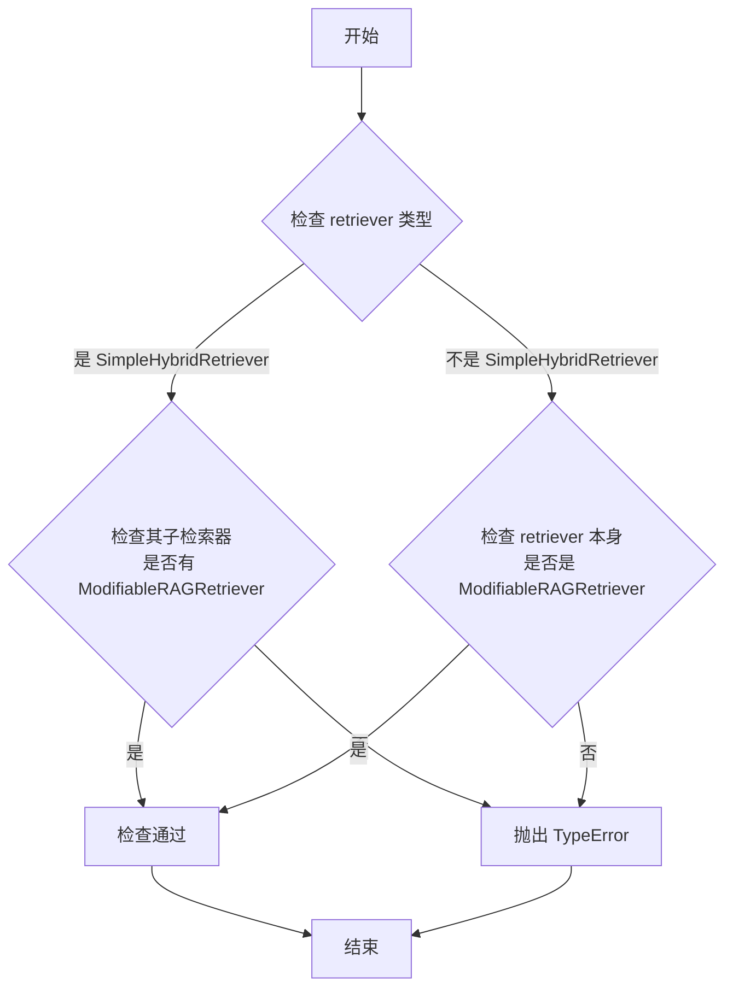

#### 带注释源码

```python
def _ensure_retriever_modifiable(self):
    # 调用内部类型检查方法，确保检索器支持修改操作。
    # 参数 required_type 被固定为 ModifiableRAGRetriever。
    self._ensure_retriever_of_type(ModifiableRAGRetriever)
```

### `SimpleEngine._ensure_retriever_persistable`

该方法用于确保当前引擎的检索器（`retriever`）支持持久化操作。它通过调用内部辅助方法 `_ensure_retriever_of_type`，检查 `self.retriever` 是否是 `PersistableRAGRetriever` 类型或其子类的实例。如果检索器是 `SimpleHybridRetriever`（混合检索器），则要求其内部的至少一个子检索器支持持久化。如果检查失败，将抛出 `TypeError` 异常。

参数：
-  `self`：`SimpleEngine`，当前 `SimpleEngine` 实例的引用。

返回值：`None`，该方法不返回任何值，仅在检查失败时抛出异常。

#### 流程图


#### 带注释源码

```python
def _ensure_retriever_persistable(self):
    # 调用内部类型检查方法，确保检索器支持持久化操作
    self._ensure_retriever_of_type(PersistableRAGRetriever)
```

### `SimpleEngine._ensure_retriever_queryable`

该方法用于确保当前引擎的检索器（`retriever`）具备查询能力。它通过调用内部方法 `_ensure_retriever_of_type`，检查 `self.retriever` 是否是 `QueryableRAGRetriever` 类型或其子类的实例。如果 `retriever` 是一个 `SimpleHybridRetriever`（混合检索器），则检查其内部的任何一个子检索器是否具备查询能力。如果检查失败，将抛出 `TypeError` 异常。

参数：
-  `self`：`SimpleEngine`，当前 `SimpleEngine` 实例的引用。

返回值：`None`，该方法不返回任何值，仅用于执行类型检查，失败时抛出异常。

#### 流程图

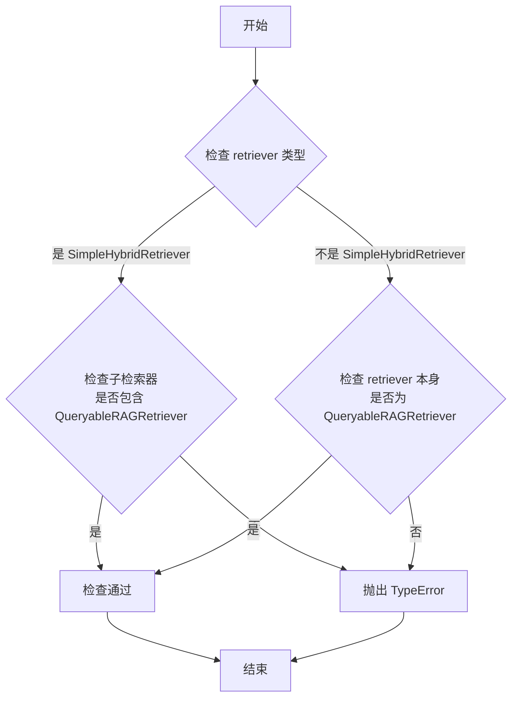

#### 带注释源码

```python
def _ensure_retriever_queryable(self):
    # 调用内部通用类型检查方法，确保检索器具备查询能力
    self._ensure_retriever_of_type(QueryableRAGRetriever)
```

### `SimpleEngine._ensure_retriever_deletable`

该方法用于确保当前引擎的检索器（`retriever`）支持删除操作。它通过调用内部辅助方法 `_ensure_retriever_of_type`，检查 `self.retriever` 是否是 `DeletableRAGRetriever` 类型或其子类的实例。如果检索器是 `SimpleHybridRetriever`（混合检索器），则要求其内部的至少一个子检索器支持删除操作。如果检查失败，将抛出 `TypeError` 异常。

参数：
-  `self`：`SimpleEngine`，当前 `SimpleEngine` 实例。

返回值：`None`，无返回值。如果检查失败，将抛出 `TypeError` 异常。

#### 流程图

```mermaid
flowchart TD
    A[开始] --> B{检查 retriever 类型}
    B -->|是 SimpleHybridRetriever| C{检查子检索器<br>是否包含 DeletableRAGRetriever}
    C -->|是| D[检查通过]
    C -->|否| E[抛出 TypeError]
    B -->|不是 SimpleHybridRetriever| F{检查 retriever 本身<br>是否为 DeletableRAGRetriever}
    F -->|是| D
    F -->|否| E
    D --> G[结束]
    E --> G
```

#### 带注释源码

```python
def _ensure_retriever_deletable(self):
    # 调用内部类型检查方法，确保检索器支持删除操作
    self._ensure_retriever_of_type(DeletableRAGRetriever)
```

### `SimpleEngine._ensure_retriever_of_type`

该方法用于确保当前引擎的检索器（`self.retriever`）或其组成部分（如果是混合检索器）是特定类型的实例。它首先检查检索器是否为 `SimpleHybridRetriever`，如果是，则验证其内部的任一检索器组件是否为所需类型。如果不是混合检索器，则直接检查检索器本身是否为所需类型。如果类型检查失败，将抛出 `TypeError` 异常。

参数：

- `required_type`：`BaseRetriever`，期望检索器或其组件所继承的基类或接口类型。

返回值：`None`，该方法不返回任何值，仅用于执行类型验证。

#### 流程图

```mermaid
flowchart TD
    A[开始] --> B{self.retriever 是<br>SimpleHybridRetriever?}
    B -- 是 --> C{任一内部检索器<br>是 required_type 实例?}
    B -- 否 --> D{self.retriever 是<br>required_type 实例?}
    C -- 是 --> E[结束/通过验证]
    C -- 否 --> F[抛出 TypeError]
    D -- 是 --> E
    D -- 否 --> F
```

#### 带注释源码

```python
def _ensure_retriever_of_type(self, required_type: BaseRetriever):
    """确保 self.retriever 是 required_type 的实例，或者如果它是 SimpleHybridRetriever，则确保其至少有一个组件是该类型的实例。

    Args:
        required_type: 期望检索器所继承的类或接口。
    """
    # 检查当前检索器是否为混合检索器
    if isinstance(self.retriever, SimpleHybridRetriever):
        # 如果是混合检索器，检查其内部的任一检索器组件是否为所需类型
        if not any(isinstance(r, required_type) for r in self.retriever.retrievers):
            # 如果没有一个组件符合要求，抛出类型错误异常
            raise TypeError(
                f"Must have at least one retriever of type {required_type.__name__} in SimpleHybridRetriever"
            )
    # 如果不是混合检索器，直接检查检索器本身是否为所需类型
    if not isinstance(self.retriever, required_type):
        # 如果类型不匹配，抛出类型错误异常
        raise TypeError(f"The retriever is not of type {required_type.__name__}: {type(self.retriever)}")
```

### `SimpleEngine._save_nodes`

该方法用于将一组节点（`BaseNode` 对象）保存到检索器（`retriever`）中。它是 `add_docs` 和 `add_objs` 方法的核心操作，负责将处理后的文档或对象节点持久化到检索器的底层存储（如索引或文档库）中，以便后续的检索操作。

参数：

- `nodes`：`list[BaseNode]`，需要保存到检索器中的节点列表。

返回值：`None`，该方法不返回任何值。

#### 流程图

```mermaid
flowchart TD
    A[开始] --> B[接收节点列表 nodes]
    B --> C[调用 self.retriever.add_nodes(nodes)]
    C --> D[检索器内部处理<br>（如更新索引、存储节点）]
    D --> E[结束]
```

#### 带注释源码

```python
def _save_nodes(self, nodes: list[BaseNode]):
    # 调用检索器（self.retriever）的 add_nodes 方法
    # 将传入的节点列表 nodes 添加到检索器的底层存储结构中
    # 这通常涉及更新向量索引、文档存储或其他持久化机制
    self.retriever.add_nodes(nodes)
```

### `SimpleEngine._persist`

该方法负责将检索器（Retriever）的索引和文档存储持久化到指定的本地目录中。它是对底层检索器 `persist` 方法的简单封装，确保在调用前，检索器具备持久化能力。

参数：

- `persist_dir`：`str`，指定持久化文件保存的目录路径。
- `**kwargs`：`Any`，传递给底层检索器 `persist` 方法的任意关键字参数。

返回值：`None`，该方法不返回任何值。

#### 流程图

```mermaid
graph TD
    A[开始] --> B{检查检索器类型};
    B -- 是 PersistableRAGRetriever --> C[调用 self.retriever.persist];
    B -- 否 --> D[抛出 TypeError 异常];
    C --> E[结束];
    D --> E;
```

#### 带注释源码

```python
def _persist(self, persist_dir: str, **kwargs):
    # 调用底层检索器的 persist 方法，将索引和文档存储保存到指定目录。
    # 参数 persist_dir 是目标目录的路径字符串。
    # **kwargs 允许传递额外的配置参数给底层的持久化实现。
    self.retriever.persist(persist_dir, **kwargs)
```

### `SimpleEngine._try_reconstruct_obj`

该方法用于处理检索到的节点列表。它会检查每个节点是否代表一个对象（通过元数据中的 `is_obj` 标志判断）。如果是，则根据节点元数据中存储的类信息和序列化的对象数据，动态地重新构造出原始的 Python 对象，并将其存储回节点的元数据中，以便后续使用。

参数：

- `nodes`：`list[NodeWithScore]`，包含检索到的节点及其相关分数的列表。

返回值：`None`，该方法不返回任何值，而是直接修改传入的 `nodes` 列表中的节点元数据。

#### 流程图

```mermaid
flowchart TD
    A[开始] --> B{遍历节点列表 nodes}
    B --> C[获取当前节点 node]
    C --> D{检查 node.metadata['is_obj'] 是否为 True?}
    D -- 是 --> E[从元数据中获取类名和模块名]
    E --> F[使用 import_class 动态导入类]
    F --> G[从元数据中获取序列化的 JSON 字符串]
    G --> H[使用 json.loads 反序列化为字典]
    H --> I[使用导入的类和字典实例化对象]
    I --> J[将实例化的对象存入 node.metadata['obj']]
    J --> K{是否还有下一个节点?}
    D -- 否 --> K
    K -- 是 --> C
    K -- 否 --> L[结束]
```

#### 带注释源码

```python
@staticmethod
def _try_reconstruct_obj(nodes: list[NodeWithScore]):
    """If node is object, then dynamically reconstruct object, and save object to node.metadata["obj"]."""
    # 遍历传入的节点列表
    for node in nodes:
        # 检查当前节点的元数据中是否包含 'is_obj' 键，且其值为 True
        # 这标识该节点代表一个序列化的对象
        if node.metadata.get("is_obj", False):
            # 1. 动态导入对象类
            # 从元数据中获取对象的类名和模块名
            obj_cls = import_class(node.metadata["obj_cls_name"], node.metadata["obj_mod_name"])
            # 2. 反序列化对象数据
            # 从元数据中获取对象的 JSON 字符串表示，并解析为 Python 字典
            obj_dict = json.loads(node.metadata["obj_json"])
            # 3. 重构对象实例
            # 使用导入的类和解析出的字典参数，实例化原始对象
            # 4. 存储回元数据
            # 将重构的对象实例存入节点的元数据中，键为 "obj"，供后续逻辑使用
            node.metadata["obj"] = obj_cls(**obj_dict)
```

### `SimpleEngine._fix_document_metadata`

该方法是一个静态方法，用于修正从文档加载器（如`SimpleDirectoryReader`）读取的`Document`对象的元数据。其核心功能是确保文档的`file_path`元数据字段不会被包含在后续的嵌入（embedding）过程中，从而避免该路径信息影响向量相似度计算的结果。

参数：

- `documents`：`list[Document]`，一个包含`Document`对象的列表，这些文档通常由文档读取器加载并准备进行后续处理。

返回值：`None`，该方法不返回任何值，直接对传入的列表进行原地修改。

#### 流程图

```mermaid
flowchart TD
    A[开始] --> B{遍历 documents 列表}
    B --> C[取出一个 Document 对象 doc]
    C --> D[将 'file_path' 添加到 doc 的<br>excluded_embed_metadata_keys 列表中]
    D --> B
    B -- 遍历结束 --> E[结束]
```

#### 带注释源码

```python
@staticmethod
def _fix_document_metadata(documents: list[Document]):
    """LlamaIndex keep metadata['file_path'], which is unnecessary, maybe deleted in the near future."""
    # 遍历传入的文档列表
    for doc in documents:
        # 将 'file_path' 键添加到文档的 excluded_embed_metadata_keys 列表中。
        # 这确保了在后续为文档生成嵌入向量时，不会使用文件路径信息。
        doc.excluded_embed_metadata_keys.append("file_path")
```

### `SimpleEngine._resolve_embed_model`

该方法是一个静态方法，用于根据传入的嵌入模型和配置列表，解析并返回最终应使用的嵌入模型。其核心逻辑是：如果配置列表中的所有配置都标记为`NoEmbedding`（即不需要嵌入），则返回一个模拟嵌入模型（`MockEmbedding`）；否则，返回传入的嵌入模型，如果未传入则使用系统默认的RAG嵌入模型。

参数：

- `embed_model`：`BaseEmbedding`，可选参数，用户指定的嵌入模型实例。
- `configs`：`list[Any]`，可选参数，一个配置对象列表，用于判断是否需要嵌入功能。

返回值：`BaseEmbedding`，返回一个符合`BaseEmbedding`接口的嵌入模型实例。

#### 流程图

```mermaid
flowchart TD
    A[开始] --> B{configs存在且<br>所有元素都是NoEmbedding类型?}
    B -- 是 --> C[返回MockEmbedding<br>embed_dim=1]
    B -- 否 --> D{embed_model参数是否提供?}
    D -- 是 --> E[返回传入的embed_model]
    D -- 否 --> F[调用get_rag_embedding<br>返回默认RAG嵌入模型]
    C --> G[结束]
    E --> G
    F --> G
```

#### 带注释源码

```python
    @staticmethod
    def _resolve_embed_model(embed_model: BaseEmbedding = None, configs: list[Any] = None) -> BaseEmbedding:
        # 检查配置列表：如果存在且所有配置都标记为“无需嵌入”
        if configs and all(isinstance(c, NoEmbedding) for c in configs):
            # 则返回一个模拟嵌入模型，维度为1，用于不需要真实嵌入向量的场景
            return MockEmbedding(embed_dim=1)

        # 否则，优先返回用户传入的嵌入模型，若未传入则使用系统默认的RAG嵌入模型
        return embed_model or get_rag_embedding()
```

### `SimpleEngine._default_transformations`

该方法是一个静态方法，用于提供默认的文档转换组件列表。当创建 `SimpleEngine` 实例时，如果没有显式提供 `transformations` 参数，则会调用此方法来获取一个默认的转换器列表。默认情况下，它返回一个包含 `SentenceSplitter` 的列表，该组件用于将文档按句子分割成更小的节点（chunks），这是构建检索增强生成（RAG）系统索引前的标准预处理步骤。

参数：
-  `self`：`SimpleEngine` 实例，用于实例方法调用。但作为静态方法，此参数在调用时不会被使用。
-  无其他显式参数。

返回值：`list[TransformComponent]`，返回一个包含默认转换组件的列表。当前实现固定返回一个仅包含 `SentenceSplitter` 实例的列表。

#### 流程图

```mermaid
flowchart TD
    Start[“方法调用<br>_default_transformations()”] --> Process[“创建 SentenceSplitter 实例”]
    Process --> Return[“返回包含该实例的列表”]
    Return --> End[“结束”]
```

#### 带注释源码

```python
    @staticmethod
    def _default_transformations():
        # 返回一个默认的转换组件列表。
        # 当前实现固定使用 SentenceSplitter，用于将文档分割成句子级别的节点。
        # 这是一个静态方法，不依赖于任何实例状态。
        return [SentenceSplitter()]
```

### `SimpleEngine._get_file_extractor`

这是一个静态方法，用于根据配置动态构建一个文件提取器字典。其核心逻辑是：如果全局配置 `config.omniparse.base_url` 已设置，则为 `.pdf` 文件类型创建一个使用 OmniParse 服务的解析器；否则，返回一个空字典，让 `SimpleDirectoryReader` 使用 LlamaIndex 内置的默认解析器。

参数：
- 无参数。

返回值：`dict[str, BaseReader]`，一个字典，其键为文件扩展名（如 `.pdf`），值为对应的 `BaseReader` 实例，用于解析该类型的文件。

#### 流程图

```mermaid
flowchart TD
    A[开始] --> B{检查配置<br>config.omniparse.base_url?}
    B -- 未设置 --> C[返回空字典]
    B -- 已设置 --> D[创建 OmniParse 实例<br>配置为解析 PDF 为 Markdown]
    D --> E[将 .pdf 与解析器<br>加入字典]
    E --> F[返回字典]
    C --> F
```

#### 带注释源码

```python
    @staticmethod
    def _get_file_extractor() -> dict[str:BaseReader]:
        """
        Get the file extractor.
        Currently, only PDF use OmniParse. Other document types use the built-in reader from llama_index.

        Returns:
            dict[file_type: BaseReader]
        """
        # 初始化一个空字典，用于存储文件扩展名到解析器的映射
        file_extractor: dict[str:BaseReader] = {}
        # 检查全局配置中是否设置了 OmniParse 服务的基础 URL
        if config.omniparse.base_url:
            # 如果已配置，则创建一个 OmniParse 解析器实例
            pdf_parser = OmniParse(
                api_key=config.omniparse.api_key, # 使用配置中的 API 密钥
                base_url=config.omniparse.base_url, # 使用配置中的基础 URL
                parse_options=OmniParseOptions(
                    parse_type=OmniParseType.PDF, # 指定解析类型为 PDF
                    result_type=ParseResultType.MD # 指定输出结果为 Markdown 格式
                ),
            )
            # 将 .pdf 扩展名与创建的解析器关联起来
            file_extractor[".pdf"] = pdf_parser
        # 返回构建好的文件提取器字典
        # 如果未配置 base_url，则返回空字典，后续将使用默认解析器
        return file_extractor
```

## 关键组件

### SimpleEngine

一个轻量级、易于使用的检索增强生成（RAG）引擎，集成了文档读取、嵌入、索引、检索和排序功能，提供从文档集合快速构建搜索系统的能力。

### 工厂模式组件（RAG Factories）

通过工厂函数（`get_index`, `get_rag_embedding`, `get_rag_llm`, `get_rankers`, `get_retriever`）动态创建和配置RAG流程中的核心组件（如索引、嵌入模型、LLM、排序器、检索器），实现了组件的解耦和灵活替换。

### 可插拔检索器接口

定义了`QueryableRAGRetriever`、`ModifiableRAGRetriever`、`PersistableRAGRetriever`、`DeletableRAGRetriever`等接口，为检索器提供了查询、增删、持久化等标准化能力，并通过`_ensure_retriever_of_type`方法进行运行时类型检查，确保引擎功能与底层检索器兼容。

### 混合检索器（SimpleHybridRetriever）

支持配置多个检索器（如基于向量和基于关键词的BM25），通过`SimpleHybridRetriever`将它们组合成一个混合检索系统，以综合利用不同检索策略的优势。

### 对象节点（ObjectNode）与RAG对象序列化

通过`ObjectNode`类将业务对象（`RAGObject`）封装为可索引的节点，并将其元数据（如类名、模块名、JSON序列化字符串）存储在节点中。在检索阶段，通过`_try_reconstruct_obj`方法动态反序列化，将节点还原为原始对象，实现了对结构化对象的检索支持。

### 全格式文档解析（OmniParse）

通过集成`OmniParse`解析器，并基于配置（`config.omniparse`）动态创建PDF文件的解析器，扩展了引擎对复杂文档格式（如PDF）的解析能力，支持将非结构化文档转换为结构化文本（Markdown格式）。

### 配置驱动（Config-Driven）

引擎的构建和行为（如使用哪种检索器、排序器、是否启用嵌入）由传入的配置对象（`BaseRetrieverConfig`, `BaseRankerConfig`, `BaseIndexConfig`等）驱动，实现了高度的可配置性和策略化。

### 惰性/条件嵌入解析

通过`_resolve_embed_model`方法，根据检索器配置（例如，所有配置都标记为`NoEmbedding`）决定是否使用真实的嵌入模型。当不需要嵌入时（如纯关键词检索），使用一个虚拟的`MockEmbedding`来节省计算资源。

## 问题及建议


### 已知问题

-   **代码重复**：类中存在两个完全相同的 `_from_nodes` 类方法定义。这会导致后一个定义覆盖前一个，但更可能是一个复制粘贴错误，使得其中一个方法成为无效的“僵尸代码”，增加了维护的复杂性和潜在的混淆。
-   **类型注解不完整**：`_get_file_extractor` 方法的返回类型注解 `dict[str:BaseReader]` 使用了旧的 Python 2 风格冒号，应为 `dict[str, BaseReader]`。此外，`_filenames` 字段在初始化后未被更新，其 `Set[str]` 类型与实际可能为空集的使用情况不符，可能导致误解。
-   **潜在的性能瓶颈**：`delete_docs` 方法通过遍历 `self.retriever._index.ref_doc_info` 来查找要删除的文档ID。如果索引中文档数量巨大，这种线性查找方式可能成为性能瓶颈。
-   **错误处理粒度较粗**：`_ensure_retriever_of_type` 方法在检查 `SimpleHybridRetriever` 时，如果其子检索器都不符合要求，会抛出 `TypeError`。然而，对于非混合检索器，错误信息仅说明类型不匹配，没有提供更具体的指导（例如，当前检索器是什么类型，或者用户应该如何配置才能获得所需类型）。
-   **配置依赖的隐式行为**：`_get_file_extractor` 方法的行为依赖于全局配置 `config.omniparse.base_url`。如果配置未正确设置或动态变更，该方法的行为会静默改变（例如，不再解析PDF），这可能给调试带来困难。
-   **资源管理缺失**：代码中使用了可能持有外部资源（如网络连接、文件句柄）的对象（例如 `OmniParse`），但没有显式的资源清理（如 `close` 方法）或上下文管理器支持。

### 优化建议

-   **消除重复代码**：立即删除重复的 `_from_nodes` 类方法定义，只保留一个。在删除前，需确认两个方法逻辑是否完全一致，并确保保留的方法是正确的。
-   **修正类型注解和字段设计**：
    -   将 `_get_file_extractor` 的返回类型注解修正为 `dict[str, BaseReader]`。
    -   重新评估 `_filenames` 字段的用途。如果它旨在跟踪已添加的文件，则应在 `add_docs` 等方法中更新该集合；如果当前并无实际用途，考虑移除该字段以避免误导。
-   **优化删除操作性能**：考虑为 `delete_docs` 方法实现更高效的查找机制。例如，如果底层索引支持，可以尝试通过文档元数据（如 `file_path`）直接查询或建立反向映射来加速删除操作。
-   **细化错误信息**：在 `_ensure_retriever_of_type` 抛出的异常中，提供更详细的上下文信息。例如，可以包含当前 `self.retriever` 的具体类型，以及对于 `SimpleHybridRetriever`，列出其所有子检索器的类型，帮助用户快速定位配置问题。
-   **明确配置依赖**：考虑在 `__init__` 或工厂方法的文档字符串中，明确说明 `_get_file_extractor` 对 `config.omniparse` 的依赖。或者，将文件提取器的配置作为参数传入，减少对全局状态的隐式依赖，提高可测试性和可预测性。
-   **增强资源管理**：为 `SimpleEngine` 类实现上下文管理器协议（`__enter__` 和 `__exit__` 方法），确保在退出时能正确清理其内部组件（如检索器、解析器）持有的资源。同时，在文档中明确说明资源管理的责任。
-   **增加单元测试覆盖率**：针对上述潜在问题点（如重复方法、错误处理路径、文件删除逻辑、配置依赖场景）编写单元测试，确保代码的健壮性和预期行为。


## 其它


### 设计目标与约束

**设计目标**:
1.  **简单易用**: 提供一个轻量级、开箱即用的RAG引擎，通过简洁的工厂方法（`from_docs`, `from_objs`, `from_index`）快速构建检索增强生成系统。
2.  **功能集成**: 将文档读取、解析、向量化、索引、检索、重排序和响应生成等RAG核心流程封装在一个类中，简化用户操作。
3.  **灵活可扩展**: 支持多种数据源（文档、自定义对象、已有索引）、多种检索器配置（支持混合检索）和多种后处理器（排序器），允许用户通过配置进行定制。
4.  **持久化与动态更新**: 支持索引的持久化保存与加载，并允许在引擎运行后动态添加或删除文档/对象。

**设计约束**:
1.  **依赖LlamaIndex**: 核心的索引、检索、节点处理等能力深度依赖于LlamaIndex框架，需遵循其接口规范。
2.  **配置驱动**: 检索器、排序器等组件的具体行为由传入的配置对象（`BaseRetrieverConfig`, `BaseRankerConfig`）决定，引擎本身不硬编码实现细节。
3.  **接口兼容性**: 作为`RetrieverQueryEngine`的子类，必须保持与父类查询接口（`query`, `aquery`, `retrieve`, `aretrieve`）的兼容性。
4.  **错误处理**: 对动态操作（如`add_docs`, `persist`）有前置的类型检查，确保底层检索器支持相应操作，否则抛出明确的类型错误。

### 错误处理与异常设计

1.  **初始化阶段**:
    *   `ValueError`: 当`from_docs`方法未提供`input_dir`或`input_files`参数时抛出。
    *   `ValueError`: 当`from_objs`方法在配置了`BM25RetrieverConfig`但`objs`列表为空时抛出。

2.  **运行时操作阶段**:
    *   `TypeError`: 在执行`add_docs`、`persist`、`count`、`clear`等方法时，通过`_ensure_retriever_of_type`方法检查底层检索器是否实现了相应的能力接口（如`ModifiableRAGRetriever`）。若不支持，则抛出包含明确类型要求的`TypeError`。
    *   `NotImplementedError`: `delete_docs`方法在文档中提到，若未实现会抛出此异常（尽管当前代码已实现删除逻辑）。

3.  **组件交互异常**:
    *   依赖的底层工厂（`get_retriever`, `get_rankers`）或LlamaIndex组件可能抛出其自身的异常（如配置错误、网络异常、模型加载失败等），这些异常会向上传播给`SimpleEngine`的调用者。

4.  **设计特点**:
    *   **防御性编程**: 关键操作前进行类型和状态检查。
    *   **异常信息明确**: 错误信息指明了期望的类型或条件，便于调试。
    *   **异常传播**: 不过度捕获底层异常，允许调用者根据具体错误类型进行处理。

### 数据流与状态机

1.  **主要数据流**:
    *   **构建阶段**: `文档/对象列表` -> (`解析器`/`转换器`) -> `节点列表` -> (`嵌入模型` + `索引器`) -> `检索器` -> `SimpleEngine实例`。
    *   **查询阶段**: `用户查询字符串` -> `QueryBundle` -> `检索器.retrieve` -> `节点列表` -> `后处理器(排序器)排序` -> `响应合成器生成答案` 或 `返回排序后节点`。
    *   **更新阶段**: `新文档/对象` -> `解析/转换` -> `节点列表` -> `检索器.add_nodes` -> 更新底层索引和文档存储。

2.  **关键状态**:
    *   `self.retriever`: 引擎的核心状态，持有索引和数据。其类型决定了引擎支持哪些动态操作（增、删、改、查、持久化）。
    *   `self._transformations`: 存储文档到节点的转换流水线，在添加新文档时复用。
    *   `self._filenames`: （当前代码中似乎未更新，可能是一个待完成的状态）设计上可能用于跟踪已加载的文件名。

3.  **状态转换**:
    *   **初始化**: 通过三个工厂方法之一，进入“就绪”状态。
    *   **就绪**: 可以接受查询，也可以接受添加/删除操作（如果检索器支持）。
    *   **持久化**: 调用`persist`后，引擎状态被保存到磁盘，但内存中的引擎实例仍处于“就绪”状态。
    *   没有复杂的多状态机，主要状态由`retriever`内部管理的索引状态体现。

### 外部依赖与接口契约

1.  **外部依赖库**:
    *   **LlamaIndex Core**: 提供`BaseIndex`, `BaseRetriever`, `BaseEmbedding`, `LLM`, `BaseNode`, `Document`等核心抽象类及具体实现（如`SimpleDirectoryReader`, `SentenceSplitter`）。`SimpleEngine`是其`RetrieverQueryEngine`的子类。
    *   **fsspec**: 用于抽象文件系统操作，支持从多种存储（如S3）加载文档。
    *   **metagpt.rag.factories**: 内部工厂，用于根据配置创建检索器、排序器、LLM、Embedding模型等。是解耦具体实现的关键。
    *   **metagpt.config2.config**: 全局配置对象，用于获取如`omniparse`服务的API密钥和地址。
    *   **metagpt.rag.schema**: 定义了一系列配置类（如`BaseRetrieverConfig`）和数据类（如`RAGObject`, `ObjectNode`），是引擎与外部配置的契约。

2.  **接口契约**:
    *   **输入契约**:
        *   `from_docs`: 接受本地目录路径或文件列表。
        *   `from_objs`: 接受任何实现了`RAGObject`接口（需有`rag_key`方法）的对象列表。
        *   `from_index`: 接受`BaseIndexConfig`配置对象，用于加载持久化的索引。
    *   **输出契约**:
        *   `query`/`aquery`: 返回生成的答案字符串（通过响应合成器）。
        *   `retrieve`/`aretrieve`: 返回`NodeWithScore`列表，其中可能包含通过`_try_reconstruct_obj`重建的原始对象（存储在`node.metadata["obj"]`）。
        *   `asearch`: 实现`tools.SearchInterface`，返回字符串，用于与Agent工具集成。
    *   **能力接口契约**:
        *   引擎的动态操作能力依赖于检索器实现的一系列标记接口（`ModifiableRAGRetriever`, `PersistableRAGRetriever`等）。这是引擎与可插拔检索器组件之间的运行时契约。

    